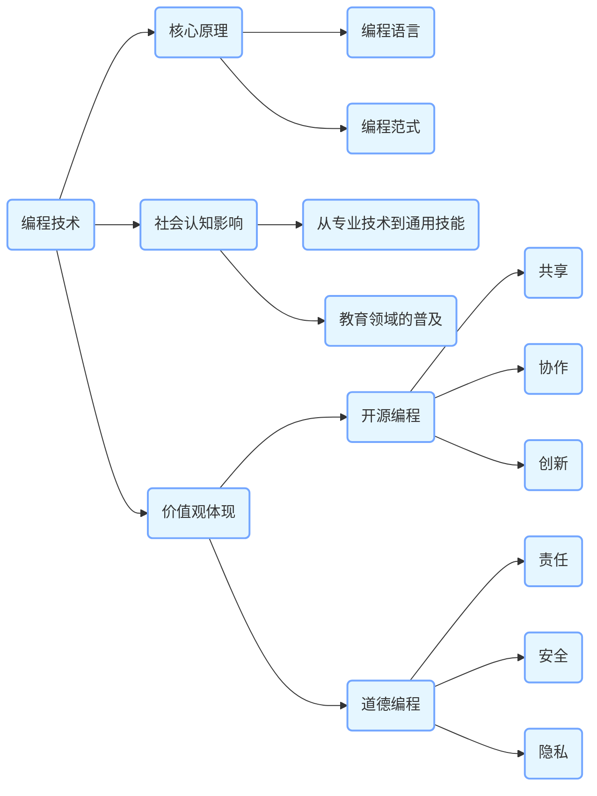

# 未来编程的社会认知与价值观变化

> 关键词：未来编程、社会认知、价值观变化、技术发展、社会影响

> 摘要：本文旨在深入探讨未来编程在社会认知和价值观方面可能发生的变化。随着科技的飞速发展，编程作为一项核心技术正日益渗透到社会的各个领域。了解未来编程的社会认知转变以及与之相关的价值观变化，对于个人、企业和整个社会都具有重要意义。文章将从背景介绍入手，分析编程在不同阶段的社会认知演变，探讨核心概念与联系，阐述编程技术背后的算法原理和操作步骤，介绍相关数学模型，通过项目实战案例加深理解，探讨实际应用场景，推荐学习和开发资源，最后总结未来编程的发展趋势与挑战，并提供常见问题解答和参考资料，以期为读者全面呈现未来编程在社会层面的多维度影响。

## 1. 背景介绍 
### 1.1 目的和范围
本文章的目的在于全面剖析未来编程在社会认知和价值观方面的变化。范围涵盖从编程技术的起源到当前的发展现状，以及对未来趋势的预测。不仅会探讨编程在技术层面的发展，还会深入研究其在社会、文化、教育等多个领域所产生的影响，以及由此引发的社会认知和价值观的转变。

### 1.2 预期读者
本文预期读者包括对编程技术发展感兴趣的普通大众、从事编程相关工作的专业人员、教育工作者、企业管理者以及关注社会发展趋势的研究人员等。通过阅读本文，读者能够对未来编程的社会影响有更深入的理解，从而在各自的领域中做出更明智的决策。

### 1.3 文档结构概述
本文首先介绍编程的背景信息，包括目的、预期读者和文档结构。接着阐述编程的核心概念与联系，包括其原理和架构，并通过流程图进行直观展示。然后详细讲解编程的核心算法原理和具体操作步骤，结合Python源代码进行说明。随后介绍相关的数学模型和公式，并举例说明。通过项目实战案例，展示代码的实际实现和详细解释。探讨编程在实际应用中的场景，推荐相关的学习资源、开发工具和论文著作。最后总结未来编程的发展趋势与挑战，提供常见问题解答和参考资料。

### 1.4 术语表
#### 1.4.1 核心术语定义
- **编程**：是指使用特定的编程语言，按照一定的规则和逻辑，编写指令序列，以实现特定功能的过程。
- **社会认知**：指社会成员对某一事物的认识、理解和评价，包括对其性质、价值、作用等方面的看法。
- **价值观**：是人们在社会实践中形成的关于价值的观念和取向，它影响着人们的行为和决策。
- **人工智能编程**：利用编程技术实现人工智能系统的开发，包括机器学习、深度学习等领域。
- **低代码编程**：一种通过可视化界面和少量代码来快速开发应用程序的编程方式。

#### 1.4.2 相关概念解释
- **编程范式**：是指编程的基本风格和方法，常见的编程范式有面向过程编程、面向对象编程、函数式编程等。不同的编程范式适用于不同的应用场景，反映了程序员对问题的不同思考方式。
- **开源编程**：是指将程序的源代码公开，允许其他开发者查看、修改和分发的编程模式。开源编程促进了技术的共享和创新，形成了庞大的开发者社区。
- **道德编程**：强调在编程过程中遵循道德原则，考虑程序对社会、环境和人类的影响，避免编写具有恶意或有害的代码。

#### 1.4.3 缩略词列表
- **AI**：Artificial Intelligence，人工智能
- **ML**：Machine Learning，机器学习
- **DL**：Deep Learning，深度学习
- **GUI**：Graphical User Interface，图形用户界面
- **API**：Application Programming Interface，应用程序编程接口

## 2. 核心概念与联系 

### 编程的核心概念原理
编程的核心原理是将人类的思维和逻辑转化为计算机能够理解和执行的指令。计算机是基于二进制的数字系统，它只能识别0和1的信号。编程语言作为人与计算机之间的桥梁，通过特定的语法和规则，将人类的高级语言描述转换为计算机能够处理的机器语言。

例如，在Python语言中，我们可以使用简单的语句来实现数学运算：
```python
# 定义两个变量
a = 5
b = 3
# 进行加法运算
result = a + b
# 输出结果
print(result)
```
在这个例子中，我们使用Python语言的变量定义、赋值和加法运算符，将人类的数学运算逻辑转化为计算机能够执行的指令。

### 编程与社会认知的联系
编程技术的发展深刻地影响着社会认知。在过去，编程被视为一种专业的技术活动，只有少数专业人员能够掌握。随着计算机技术的普及和编程教育的推广，编程逐渐走进大众视野，人们对编程的认知也发生了变化。现在，编程被认为是一种重要的技能，它不仅可以用于开发软件和应用程序，还可以培养逻辑思维、创造力和问题解决能力。

例如，在教育领域，越来越多的学校将编程纳入课程体系，让学生从小接触编程，培养他们的科技素养。这使得社会对编程的认知从专业技术逐渐转变为一种通用的教育工具。

### 编程与价值观的联系
编程也与价值观密切相关。不同的编程理念和实践反映了不同的价值观。例如，开源编程体现了共享、协作和创新的价值观。开源社区的开发者们将自己的代码公开，供其他开发者使用和改进，这种共享的精神促进了技术的快速发展。

另一方面，道德编程强调了对社会和人类的责任。程序员在编写代码时，需要考虑程序的安全性、隐私性和社会影响，避免编写可能导致不良后果的代码。这体现了尊重他人、保护社会利益的价值观。

### 文本示意图
```plaintext
编程技术
|
|-- 核心原理（将人类思维转化为计算机指令）
|   |-- 编程语言（Python、Java等）
|   |-- 编程范式（面向过程、面向对象等）
|
|-- 社会认知影响
|   |-- 从专业技术到通用技能
|   |-- 教育领域的普及
|
|-- 价值观体现
|   |-- 开源编程（共享、协作、创新）
|   |-- 道德编程（责任、安全、隐私）
```

### Mermaid 流程图


## 3. 核心算法原理 & 具体操作步骤 

### 算法原理讲解
算法是编程的核心，它是解决问题的一系列步骤和规则。在编程中，我们经常会用到各种算法来实现不同的功能。下面以排序算法中的冒泡排序为例，详细讲解算法原理。

冒泡排序的基本思想是比较相邻的元素，如果顺序错误就把它们交换过来。重复这个过程，直到整个数组都被排序。

Python源代码实现如下：
```python
def bubble_sort(arr):
    n = len(arr)
    # 遍历所有数组元素
    for i in range(n):
        # 最后 i 个元素已经排好序，不需要再比较
        for j in range(0, n - i - 1):
            # 如果当前元素大于下一个元素，则交换它们
            if arr[j] > arr[j + 1]:
                arr[j], arr[j + 1] = arr[j + 1], arr[j]
    return arr

# 测试冒泡排序
arr = [64, 34, 25, 12, 22, 11, 90]
sorted_arr = bubble_sort(arr)
print("排序后的数组:", sorted_arr)
```

### 具体操作步骤
1. **定义函数**：首先定义一个名为`bubble_sort`的函数，它接受一个数组作为参数。
2. **获取数组长度**：使用`len(arr)`获取数组的长度，以便确定需要比较的次数。
3. **外层循环**：使用`for`循环遍历数组的每个元素，控制比较的轮数。
4. **内层循环**：在每一轮中，使用另一个`for`循环比较相邻的元素，如果顺序错误就交换它们。
5. **返回结果**：当所有的元素都比较完后，返回排序好的数组。

### 复杂度分析
- **时间复杂度**：冒泡排序的时间复杂度为 $O(n^2)$，其中 $n$ 是数组的长度。这是因为在最坏情况下，需要进行 $n(n - 1)/2$ 次比较。
- **空间复杂度**：冒泡排序的空间复杂度为 $O(1)$，因为只需要常数级的额外空间。

## 4. 数学模型和公式 & 详细讲解 & 举例说明 

### 数学模型
在编程中，很多算法和数据结构都可以用数学模型来描述。例如，图论中的最短路径问题可以用Dijkstra算法来解决，该算法基于贪心算法的思想。

### Dijkstra算法的数学模型
Dijkstra算法用于在带权有向图中找到从一个源节点到其他所有节点的最短路径。设图 $G = (V, E)$ 是一个带权有向图，其中 $V$ 是节点集合，$E$ 是边集合。每条边 $(u, v) \in E$ 都有一个非负的权值 $w(u, v)$。

设 $d[v]$ 表示从源节点 $s$ 到节点 $v$ 的最短路径长度，初始时 $d[s] = 0$，对于其他节点 $v \neq s$，$d[v] = \infty$。

Dijkstra算法的核心思想是通过不断选择距离源节点最近的节点，并更新其邻居节点的最短路径长度，直到所有节点都被处理。

### 数学公式
Dijkstra算法的更新公式为：
$$
d[v] = \min(d[v], d[u] + w(u, v))
$$
其中，$u$ 是当前已经处理过的节点，$v$ 是 $u$ 的邻居节点，$w(u, v)$ 是边 $(u, v)$ 的权值。

### 举例说明
假设有一个带权有向图，节点集合 $V = \{A, B, C, D\}$，边集合 $E = \{(A, B, 2), (A, C, 4), (B, C, 1), (B, D, 7), (C, D, 3)\}$，其中 $(u, v, w)$ 表示从节点 $u$ 到节点 $v$ 的边的权值为 $w$。

我们要找到从节点 $A$ 到其他所有节点的最短路径。

初始时：
$d[A] = 0$，$d[B] = \infty$，$d[C] = \infty$，$d[D] = \infty$

第一轮：选择节点 $A$，更新其邻居节点 $B$ 和 $C$ 的最短路径长度：
$d[B] = \min(\infty, 0 + 2) = 2$
$d[C] = \min(\infty, 0 + 4) = 4$

第二轮：选择节点 $B$，更新其邻居节点 $C$ 和 $D$ 的最短路径长度：
$d[C] = \min(4, 2 + 1) = 3$
$d[D] = \min(\infty, 2 + 7) = 9$

第三轮：选择节点 $C$，更新其邻居节点 $D$ 的最短路径长度：
$d[D] = \min(9, 3 + 3) = 6$

最终得到从节点 $A$ 到其他节点的最短路径长度：$d[B] = 2$，$d[C] = 3$，$d[D] = 6$。

### Python代码实现
```python
import heapq

def dijkstra(graph, start):
    distances = {node: float('inf') for node in graph}
    distances[start] = 0
    priority_queue = [(0, start)]

    while priority_queue:
        current_distance, current_node = heapq.heappop(priority_queue)

        if current_distance > distances[current_node]:
            continue

        for neighbor, weight in graph[current_node].items():
            distance = current_distance + weight

            if distance < distances[neighbor]:
                distances[neighbor] = distance
                heapq.heappush(priority_queue, (distance, neighbor))

    return distances

# 定义图
graph = {
    'A': {'B': 2, 'C': 4},
    'B': {'C': 1, 'D': 7},
    'C': {'D': 3},
    'D': {}
}

# 计算最短路径
start_node = 'A'
shortest_distances = dijkstra(graph, start_node)
print("从节点", start_node, "到其他节点的最短路径长度:", shortest_distances)
```

## 5. 项目实战：代码实际案例和详细解释说明 

### 5.1  开发环境搭建
本项目将使用Python语言进行开发，以下是搭建开发环境的步骤：

1. **安装Python**：访问Python官方网站（https://www.python.org/downloads/），下载并安装适合你操作系统的Python版本。建议安装Python 3.7及以上版本。
2. **安装集成开发环境（IDE）**：推荐使用PyCharm作为开发工具，它提供了丰富的功能和良好的代码编辑体验。访问PyCharm官方网站（https://www.jetbrains.com/pycharm/download/），下载并安装社区版或专业版。
3. **创建虚拟环境**：在项目开发中，建议使用虚拟环境来隔离不同项目的依赖。可以使用`venv`模块创建虚拟环境：
```bash
python -m venv myenv
```
4. **激活虚拟环境**：在Windows系统中，使用以下命令激活虚拟环境：
```bash
myenv\Scripts\activate
```
在Linux或Mac系统中，使用以下命令激活虚拟环境：
```bash
source myenv/bin/activate
```
5. **安装依赖库**：根据项目需求，安装所需的依赖库。例如，如果项目需要使用数据处理和分析功能，可以安装`pandas`和`numpy`库：
```bash
pip install pandas numpy
```

### 5.2  源代码详细实现和代码解读
本项目将实现一个简单的图书管理系统，包括图书的添加、查询、删除和显示功能。

```python
# 定义图书类
class Book:
    def __init__(self, id, title, author):
        self.id = id
        self.title = title
        self.author = author

    def __str__(self):
        return f"ID: {self.id}, 书名: {self.title}, 作者: {self.author}"

# 定义图书管理系统类
class LibraryManagementSystem:
    def __init__(self):
        self.books = {}

    # 添加图书
    def add_book(self, book):
        if book.id not in self.books:
            self.books[book.id] = book
            print("图书添加成功！")
        else:
            print("图书ID已存在，添加失败！")

    # 查询图书
    def query_book(self, id):
        if id in self.books:
            return self.books[id]
        else:
            print("未找到该图书！")
            return None

    # 删除图书
    def delete_book(self, id):
        if id in self.books:
            del self.books[id]
            print("图书删除成功！")
        else:
            print("未找到该图书，删除失败！")

    # 显示所有图书
    def display_books(self):
        if self.books:
            for book in self.books.values():
                print(book)
        else:
            print("图书馆暂无图书！")

# 主程序
if __name__ == "__main__":
    library = LibraryManagementSystem()

    while True:
        print("\n图书管理系统菜单：")
        print("1. 添加图书")
        print("2. 查询图书")
        print("3. 删除图书")
        print("4. 显示所有图书")
        print("5. 退出系统")

        choice = input("请输入你的选择：")

        if choice == '1':
            id = input("请输入图书ID：")
            title = input("请输入图书书名：")
            author = input("请输入图书作者：")
            book = Book(id, title, author)
            library.add_book(book)
        elif choice == '2':
            id = input("请输入要查询的图书ID：")
            book = library.query_book(id)
            if book:
                print(book)
        elif choice == '3':
            id = input("请输入要删除的图书ID：")
            library.delete_book(id)
        elif choice == '4':
            library.display_books()
        elif choice == '5':
            print("退出系统，再见！")
            break
        else:
            print("输入无效，请重新输入！")
```

### 5.3  代码解读与分析
1. **图书类（`Book`）**：定义了图书的基本属性，包括图书ID、书名和作者。`__str__`方法用于返回图书的字符串表示，方便打印输出。
2. **图书管理系统类（`LibraryManagementSystem`）**：
    - `__init__`方法：初始化一个空的字典`books`，用于存储图书信息。
    - `add_book`方法：将图书添加到字典中，如果图书ID已存在，则提示添加失败。
    - `query_book`方法：根据图书ID查询图书，如果找到则返回图书对象，否则提示未找到。
    - `delete_book`方法：根据图书ID删除图书，如果找到则删除成功，否则提示删除失败。
    - `display_books`方法：显示所有图书信息，如果图书馆暂无图书，则提示相应信息。
3. **主程序**：创建一个图书管理系统对象，并通过一个无限循环显示菜单，根据用户的选择执行相应的操作。当用户选择退出系统时，程序结束。

这个图书管理系统通过面向对象的编程思想，将图书和图书管理系统的功能封装在不同的类中，提高了代码的可维护性和可扩展性。

## 6. 实际应用场景 
### 教育领域
在教育领域，编程的应用越来越广泛。编程教育可以培养学生的逻辑思维、创造力和问题解决能力。例如，通过Scratch等可视化编程工具，小学生可以轻松地创建动画、游戏和故事，激发他们对编程的兴趣。

在中学和大学阶段，编程课程可以帮助学生深入学习计算机科学的基础知识，如算法、数据结构和编程语言。同时，编程也可以与其他学科相结合，如数学、物理和化学，通过编写程序来解决实际问题，提高学生的综合素养。

### 商业领域
在商业领域，编程技术被广泛应用于企业的各个环节。例如，企业可以开发自己的电子商务网站和移动应用程序，实现线上销售和客户服务。通过数据分析和机器学习算法，企业可以对客户数据进行挖掘和分析，了解客户需求，优化产品和服务。

此外，编程还可以用于企业的内部管理系统，如财务管理、人力资源管理和供应链管理等。这些系统可以提高企业的运营效率，降低成本，增强企业的竞争力。

### 医疗领域
在医疗领域，编程技术也发挥着重要作用。例如，医学影像处理技术可以通过编程实现对X光、CT和MRI等影像的分析和诊断，帮助医生更准确地发现疾病。

人工智能在医疗领域的应用也越来越广泛，如疾病预测、药物研发和智能诊断系统等。通过编程实现的机器学习和深度学习算法，可以对大量的医疗数据进行分析和学习，为医疗决策提供支持。

### 娱乐领域
在娱乐领域，编程技术是游戏开发和影视制作的核心。游戏开发需要使用各种编程语言和开发引擎，如C++、Unity和Unreal Engine等，来实现游戏的逻辑、图形渲染和用户交互。

影视制作中的特效和动画制作也离不开编程技术。通过编程实现的计算机图形学算法，可以创建逼真的场景和角色，为观众带来震撼的视觉体验。

### 交通领域
在交通领域，编程技术被用于智能交通系统的开发。例如，交通流量监测系统可以通过传感器和编程算法，实时监测交通流量，优化交通信号灯的控制，提高道路的通行效率。

自动驾驶技术也是编程技术在交通领域的重要应用。通过编程实现的传感器融合、路径规划和决策算法，自动驾驶汽车可以实现自主导航和避障，提高交通安全和效率。

## 7. 工具和资源推荐
### 7.1 学习资源推荐
#### 7.1.1 书籍推荐
- 《Python编程：从入门到实践》：这本书适合初学者，通过实际项目介绍Python编程的基础知识和应用。
- 《算法导论》：经典的算法教材，系统地介绍了各种算法的原理和实现。
- 《代码大全》：软件开发的经典著作，涵盖了软件开发的各个方面，如代码设计、编程规范和调试技巧等。

#### 7.1.2 在线课程
- Coursera：提供了丰富的编程和计算机科学相关的在线课程，由世界各地的知名大学和机构授课。
- edX：同样是一个优秀的在线学习平台，提供了高质量的编程课程，包括Python、Java和机器学习等。
- 中国大学MOOC：国内的在线学习平台，有许多国内高校的编程课程可供选择。

#### 7.1.3 技术博客和网站
- 博客园：国内知名的技术博客平台，有许多程序员分享自己的编程经验和技术文章。
- 开源中国：关注开源技术和软件开发，提供了丰富的技术资讯和开源项目。
- Stack Overflow：全球最大的程序员问答社区，遇到编程问题可以在这里找到答案。

### 7.2 开发工具框架推荐
#### 7.2.1 IDE和编辑器
- PyCharm：专门为Python开发设计的集成开发环境，功能强大，支持代码自动补全、调试和版本控制等。
- Visual Studio Code：一款轻量级的代码编辑器，支持多种编程语言，有丰富的插件扩展。
- IntelliJ IDEA：适用于Java开发的集成开发环境，提供了高效的代码编辑和调试功能。

#### 7.2.2 调试和性能分析工具
- pdb：Python自带的调试器，可以帮助程序员定位和解决代码中的问题。
- Py-Spy：用于Python程序的性能分析工具，可以分析程序的CPU和内存使用情况。
- VisualVM：Java应用程序的性能分析工具，提供了可视化的界面，方便开发人员进行性能调优。

#### 7.2.3 相关框架和库
- Django：Python的Web开发框架，提供了高效的开发工具和功能，适合快速开发Web应用。
- Flask：轻量级的Python Web框架，灵活易用，适合初学者和小型项目。
- TensorFlow：开源的机器学习框架，广泛应用于深度学习领域，提供了丰富的工具和算法。

### 7.3 相关论文著作推荐
#### 7.3.1 经典论文
- "A Mathematical Theory of Communication" by Claude E. Shannon：信息论的经典论文，奠定了现代通信理论的基础。
- "The Art of Computer Programming" by Donald E. Knuth：计算机科学领域的经典著作，系统地介绍了计算机编程的算法和数据结构。
- "ImageNet Classification with Deep Convolutional Neural Networks" by Alex Krizhevsky, Ilya Sutskever, and Geoffrey E. Hinton：深度学习领域的经典论文，介绍了卷积神经网络在图像分类中的应用。

#### 7.3.2 最新研究成果
- 关注顶级学术会议和期刊，如ACM SIGKDD、NeurIPS和IEEE Transactions on Pattern Analysis and Machine Intelligence等，了解编程和人工智能领域的最新研究进展。
- 许多研究机构和大学的官方网站也会发布他们的最新研究成果，可以定期关注。

#### 7.3.3 应用案例分析
- 《大数据时代的商业应用案例》：介绍了大数据和编程技术在商业领域的应用案例，包括客户细分、营销优化和供应链管理等。
- 《人工智能医疗应用案例集》：汇集了人工智能和编程技术在医疗领域的应用案例，如疾病诊断、药物研发和健康管理等。

## 8. 总结：未来发展趋势与挑战
### 未来发展趋势
1. **人工智能与编程的深度融合**：未来，人工智能将与编程技术更加紧密地结合。编程将不仅用于实现人工智能算法，还将利用人工智能技术来辅助编程，如智能代码补全、自动调试和代码生成等。
2. **低代码和无代码编程的普及**：随着技术的发展，低代码和无代码编程平台将越来越普及。这些平台将降低编程的门槛，让更多非专业人员能够参与到软件开发中来，提高软件开发的效率和普及程度。
3. **跨学科编程的兴起**：编程将不再局限于计算机科学领域，而是与其他学科如生物学、物理学和社会学等深度融合。跨学科编程将为解决复杂的现实问题提供新的思路和方法。
4. **量子编程的发展**：量子计算技术的发展将推动量子编程的兴起。量子编程将利用量子比特的特性，实现高效的计算和数据处理，为解决一些传统计算机难以解决的问题提供可能。

### 挑战
1. **技术更新换代快**：编程技术的发展日新月异，程序员需要不断学习和更新知识，以跟上技术的发展步伐。这对程序员的学习能力和适应能力提出了很高的要求。
2. **安全和隐私问题**：随着编程技术在各个领域的广泛应用，安全和隐私问题日益突出。程序员需要在编写代码时考虑到安全和隐私因素，防止程序被攻击和数据泄露。
3. **道德和伦理问题**：编程技术的发展也带来了一系列道德和伦理问题，如人工智能的决策伦理、算法歧视和数据滥用等。程序员和社会需要共同探讨和解决这些问题，确保编程技术的发展符合人类的利益和价值观。
4. **人才短缺**：随着编程技术的普及和应用，对编程人才的需求也越来越大。然而，目前编程人才的培养速度还无法满足市场的需求，人才短缺将成为制约编程技术发展的一个重要因素。

## 9. 附录：常见问题与解答
### 1. 编程难学吗？
编程的难度因人而异。对于有一定数学和逻辑基础的人来说，学习编程可能相对容易一些。而对于初学者来说，可能会觉得编程有一定的难度。但是，只要有足够的兴趣和耐心，通过不断的学习和实践，掌握编程是完全可行的。

### 2. 学习编程需要具备哪些基础知识？
学习编程需要具备一定的数学基础，如逻辑思维、代数和几何等。同时，了解计算机的基本原理和操作系统的使用也是很有帮助的。

### 3. 如何选择适合自己的编程语言？
选择适合自己的编程语言需要考虑多个因素，如学习目的、应用领域和个人兴趣等。如果是初学者，建议选择Python、JavaScript等易于学习和上手的语言。如果是从事特定领域的开发，如游戏开发可以选择C++，Web开发可以选择Java或Python等。

### 4. 编程工作的前景如何？
编程工作的前景非常广阔。随着科技的发展，编程技术在各个领域的应用越来越广泛，对编程人才的需求也越来越大。编程工作不仅薪资待遇较高，而且有很多晋升和发展的机会。

### 5. 如何提高编程水平？
提高编程水平需要不断地学习和实践。可以通过阅读优秀的代码、参加开源项目、解决实际问题等方式来提高自己的编程能力。同时，与其他程序员交流和分享经验也是很有帮助的。

## 10. 扩展阅读 & 参考资料
### 扩展阅读
- 《未来简史：从智人到神人》：探讨了科技发展对人类社会和未来的影响，包括编程技术的发展趋势。
- 《人类简史：从动物到上帝》：从人类的发展历程角度，分析了科技进步与人类社会的相互作用。
- 《奇点临近》：介绍了技术奇点的概念，探讨了未来科技发展的速度和影响。

### 参考资料
1. 相关编程语言的官方文档，如Python官方文档（https://docs.python.org/）、Java官方文档（https://docs.oracle.com/javase/）等。
2. 学术期刊和会议论文，如ACM Transactions on Programming Languages and Systems、IEEE Transactions on Software Engineering等。
3. 专业书籍和教材，如《Python核心编程》《Java编程思想》等。
4. 在线学习平台的课程资料，如Coursera、edX等平台上的相关课程。
5. 技术博客和网站的文章，如博客园、开源中国等平台上的技术分享。