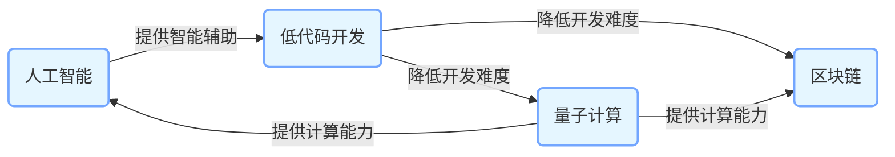

# 未来编程的趋势与挑战

> 关键词：未来编程、趋势、挑战、人工智能、量子计算、低代码开发、区块链

> 摘要：本文深入探讨了未来编程领域的发展趋势与面临的挑战。在科技飞速发展的当下，编程作为推动技术进步的核心力量，正经历着前所未有的变革。我们将分析人工智能、量子计算、低代码开发、区块链等前沿技术对编程的影响，阐述其核心概念、算法原理以及在实际项目中的应用。同时，探讨未来编程在人才需求、安全、伦理等方面面临的挑战，并对未来的发展趋势进行展望，旨在为编程从业者和相关研究人员提供全面而深入的参考。

## 1. 背景介绍 
### 1.1 目的和范围
随着信息技术的不断演进，编程领域正迎来新的变革浪潮。本文章的目的在于全面梳理未来编程的发展趋势，深入分析其所面临的挑战，为广大编程从业者、技术爱好者以及相关研究人员提供有价值的参考。范围涵盖了当前编程领域的前沿技术，包括人工智能、量子计算、低代码开发、区块链等，并探讨这些技术在不同行业的应用场景以及对编程生态的影响。

### 1.2 预期读者
本文预期读者包括但不限于专业的程序员、软件工程师、软件架构师、CTO等编程领域的从业者，以及对编程技术发展趋势感兴趣的学生、研究人员和技术爱好者。同时，也可为企业管理者在制定技术战略和人才规划时提供参考。

### 1.3 文档结构概述
本文将按照以下结构展开：首先介绍编程领域的背景知识，包括相关术语和概念；接着阐述未来编程的核心概念及其联系，通过文本示意图和Mermaid流程图进行直观展示；然后详细讲解核心算法原理和具体操作步骤，并结合Python源代码进行说明；随后介绍相关的数学模型和公式，并举例说明；再通过项目实战展示代码实际案例并进行详细解释；分析未来编程的实际应用场景；推荐相关的学习资源、开发工具框架和论文著作；最后总结未来编程的发展趋势与挑战，并提供常见问题解答和扩展阅读参考资料。

### 1.4 术语表
#### 1.4.1 核心术语定义
- **人工智能（Artificial Intelligence，AI）**：是指计算机系统能够执行通常需要人类智能才能完成的任务，如学习、推理、解决问题等。
- **量子计算（Quantum Computing）**：基于量子力学原理的计算方式，利用量子比特的叠加和纠缠特性进行信息处理，具有极高的计算速度和处理能力。
- **低代码开发（Low - Code Development）**：一种通过可视化界面和少量代码快速开发应用程序的方法，降低了编程门槛，提高了开发效率。
- **区块链（Blockchain）**：一种去中心化的分布式账本技术，通过密码学方法保证数据的不可篡改和可追溯性。

#### 1.4.2 相关概念解释
- **机器学习（Machine Learning，ML）**：是人工智能的一个分支，通过让计算机从数据中学习模式和规律，从而实现预测和决策等功能。
- **深度学习（Deep Learning，DL）**：是机器学习的一种，基于人工神经网络，通过多层神经元对数据进行深度特征提取和学习。
- **智能合约（Smart Contract）**：是区块链上的一种自动执行的合约，通过代码实现合约条款的自动执行和验证。

#### 1.4.3 缩略词列表
- **AI**：Artificial Intelligence（人工智能）
- **ML**：Machine Learning（机器学习）
- **DL**：Deep Learning（深度学习）
- **QC**：Quantum Computing（量子计算）
- **LCD**：Low - Code Development（低代码开发）
- **BC**：Blockchain（区块链）

## 2. 核心概念与联系 

### 2.1 人工智能与编程
人工智能的发展离不开编程的支持。编程为人工智能算法的实现提供了基础，通过编写代码可以实现各种机器学习和深度学习模型。例如，使用Python语言结合TensorFlow、PyTorch等深度学习框架可以方便地构建神经网络模型。

### 2.2 量子计算与编程
量子计算的出现将对编程带来革命性的变化。传统的计算模型基于经典比特，而量子计算基于量子比特，其计算方式和算法设计与传统编程有很大不同。量子编程需要使用专门的编程语言和工具，如Qiskit、Cirq等。

### 2.3 低代码开发与编程
低代码开发旨在降低编程的门槛，让非专业程序员也能参与到应用程序的开发中。通过可视化界面和少量代码，用户可以快速搭建应用程序。低代码开发平台通常提供了丰富的组件和模板，减少了重复的编码工作。

### 2.4 区块链与编程
区块链技术需要编程来实现其核心功能，如智能合约的编写和部署。区块链编程通常使用Solidity等编程语言，通过编写智能合约可以实现去中心化的应用程序。

### 2.5 核心概念联系的文本示意图
人工智能、量子计算、低代码开发和区块链这些核心概念相互关联，共同推动着未来编程的发展。人工智能可以为低代码开发提供智能辅助，帮助用户更高效地开发应用程序；量子计算可以为人工智能和区块链的某些算法提供更强大的计算能力；低代码开发可以降低区块链和量子计算应用的开发难度，促进其更广泛的应用。

### 2.6 核心概念联系的Mermaid流程图


## 3. 核心算法原理 & 具体操作步骤 

### 3.1 人工智能算法原理与Python实现
#### 3.1.1 线性回归算法原理
线性回归是一种基本的机器学习算法，用于建立自变量和因变量之间的线性关系。其数学模型可以表示为：
$y = \theta_0 + \theta_1x_1 + \theta_2x_2 + \cdots + \theta_nx_n$
其中，$y$ 是因变量，$x_1, x_2, \cdots, x_n$ 是自变量，$\theta_0, \theta_1, \cdots, \theta_n$ 是模型的参数。

#### 3.1.2 线性回归算法的Python实现
```python
import numpy as np
from sklearn.linear_model import LinearRegression
from sklearn.model_selection import train_test_split
from sklearn.metrics import mean_squared_error

# 生成示例数据
X = np.array([[1], [2], [3], [4], [5]])
y = np.array([2, 4, 6, 8, 10])

# 划分训练集和测试集
X_train, X_test, y_train, y_test = train_test_split(X, y, test_size=0.2, random_state=42)

# 创建线性回归模型
model = LinearRegression()

# 训练模型
model.fit(X_train, y_train)

# 预测
y_pred = model.predict(X_test)

# 计算均方误差
mse = mean_squared_error(y_test, y_pred)
print(f"均方误差: {mse}")
```

### 3.2 量子计算算法原理与Python实现（以量子比特翻转为例）
#### 3.2.1 量子比特翻转算法原理
量子比特可以处于0和1的叠加态，通过量子门操作可以改变量子比特的状态。例如，使用X门可以实现量子比特的翻转，即将|0⟩ 状态变为|1⟩ 状态，将|1⟩ 状态变为|0⟩ 状态。

#### 3.2.2 量子比特翻转算法的Python实现（使用Qiskit）
```python
from qiskit import QuantumCircuit, Aer, execute

# 创建一个量子电路，包含1个量子比特和1个经典比特
qc = QuantumCircuit(1, 1)

# 应用X门翻转量子比特
qc.x(0)

# 测量量子比特并将结果存储到经典比特中
qc.measure(0, 0)

# 使用模拟器运行量子电路
backend = Aer.get_backend('qasm_simulator')
job = execute(qc, backend, shots=1024)
result = job.result()

# 获取测量结果
counts = result.get_counts(qc)
print(counts)
```

### 3.3 低代码开发操作步骤
1. **选择低代码开发平台**：根据项目需求和个人喜好选择合适的低代码开发平台，如OutSystems、Mendix等。
2. **创建项目**：在低代码开发平台上创建新的项目。
3. **设计界面**：使用平台提供的可视化界面设计工具，拖拽组件来设计应用程序的界面。
4. **配置业务逻辑**：通过平台提供的逻辑配置工具，设置应用程序的业务逻辑，如数据处理、流程控制等。
5. **连接数据源**：将应用程序连接到相应的数据源，如数据库、API等。
6. **测试和部署**：对应用程序进行测试，确保其功能正常，然后将其部署到生产环境中。

### 3.4 区块链智能合约编程步骤（以Solidity为例）
1. **安装开发环境**：安装Solidity编译器和开发工具，如Remix IDE。
2. **创建智能合约文件**：使用文本编辑器创建一个新的Solidity文件，如`MyContract.sol`。
3. **编写智能合约代码**：在`MyContract.sol`文件中编写智能合约代码，例如：
```solidity
pragma solidity ^0.8.0;

contract MyContract {
    uint256 public myVariable;

    constructor() {
        myVariable = 0;
    }

    function setVariable(uint256 newValue) public {
        myVariable = newValue;
    }

    function getVariable() public view returns (uint256) {
        return myVariable;
    }
}
```
4. **编译智能合约**：使用Solidity编译器编译智能合约代码。
5. **部署智能合约**：将编译后的智能合约部署到区块链网络中。
6. **调用智能合约**：通过区块链钱包或其他工具调用智能合约的函数。

## 4. 数学模型和公式 & 详细讲解 & 举例说明 

### 4.1 人工智能中的数学模型和公式
#### 4.1.1 逻辑回归的数学模型
逻辑回归是一种用于分类问题的机器学习算法，其数学模型基于逻辑函数（也称为Sigmoid函数）。逻辑函数的表达式为：
$$\sigma(z) = \frac{1}{1 + e^{-z}}$$
其中，$z = \theta_0 + \theta_1x_1 + \theta_2x_2 + \cdots + \theta_nx_n$ 是线性组合。逻辑回归通过逻辑函数将线性组合的结果映射到0到1之间的概率值，用于表示样本属于某个类别的概率。

#### 4.1.2 举例说明
假设我们有一个二分类问题，判断一个学生是否能通过考试。我们有两个特征：学习时间 $x_1$ 和复习次数 $x_2$。逻辑回归模型可以表示为：
$z = \theta_0 + \theta_1x_1 + \theta_2x_2$
$\hat{y} = \sigma(z)$
其中，$\hat{y}$ 是学生通过考试的概率。如果 $\hat{y} \geq 0.5$，我们预测学生能通过考试；如果 $\hat{y} < 0.5$，我们预测学生不能通过考试。

### 4.2 量子计算中的数学模型和公式
#### 4.2.1 量子比特的状态表示
量子比特可以用二维复向量空间中的向量来表示。例如，基态|0⟩ 和|1⟩ 可以表示为：
$|0⟩ = \begin{bmatrix} 1 \\ 0 \end{bmatrix}$
$|1⟩ = \begin{bmatrix} 0 \\ 1 \end{bmatrix}$
量子比特的一般状态可以表示为：
$|\psi⟩ = \alpha|0⟩ + \beta|1⟩$
其中，$\alpha$ 和 $\beta$ 是复数，且满足 $|\alpha|^2 + |\beta|^2 = 1$。

#### 4.2.2 量子门的矩阵表示
量子门可以用矩阵来表示。例如，X门的矩阵表示为：
$X = \begin{bmatrix} 0 & 1 \\ 1 & 0 \end{bmatrix}$
对量子比特 $|\psi⟩$ 应用X门的操作可以表示为矩阵乘法：
$X|\psi⟩ = \begin{bmatrix} 0 & 1 \\ 1 & 0 \end{bmatrix} \begin{bmatrix} \alpha \\ \beta \end{bmatrix} = \begin{bmatrix} \beta \\ \alpha \end{bmatrix}$

### 4.3 区块链中的数学模型和公式
#### 4.3.1 哈希函数
哈希函数是区块链中的重要组成部分，用于保证数据的完整性和不可篡改。哈希函数将任意长度的输入数据映射为固定长度的哈希值。常见的哈希函数有SHA - 256等。哈希函数具有以下特性：
- **确定性**：相同的输入总是产生相同的输出。
- **高效性**：计算哈希值的速度很快。
- **抗碰撞性**：很难找到两个不同的输入产生相同的哈希值。

#### 4.3.2 举例说明
假设我们有一个字符串 "Hello, World!"，使用SHA - 256哈希函数计算其哈希值：
```python
import hashlib

data = "Hello, World!"
hash_object = hashlib.sha256(data.encode())
hash_value = hash_object.hexdigest()
print(f"哈希值: {hash_value}")
```

## 5. 项目实战：代码实际案例和详细解释说明 

### 5.1  开发环境搭建
#### 5.1.1 人工智能项目开发环境搭建
- **安装Python**：从Python官方网站下载并安装Python 3.x版本。
- **安装机器学习库**：使用pip安装常用的机器学习库，如NumPy、Pandas、Scikit - learn、TensorFlow、PyTorch等。例如：
```bash
pip install numpy pandas scikit-learn tensorflow torch
```
- **安装开发工具**：可以选择使用PyCharm、Jupyter Notebook等开发工具。

#### 5.1.2 量子计算项目开发环境搭建
- **安装Python**：同人工智能项目开发环境。
- **安装量子计算库**：使用pip安装Qiskit、Cirq等量子计算库。例如：
```bash
pip install qiskit cirq
```
- **安装开发工具**：可以使用Jupyter Notebook进行量子计算代码的编写和调试。

#### 5.1.3 低代码开发项目开发环境搭建
- **选择低代码开发平台**：根据项目需求选择合适的低代码开发平台，如OutSystems、Mendix等。
- **注册账号**：在低代码开发平台上注册账号。
- **学习平台使用方法**：通过平台提供的文档和教程学习平台的使用方法。

#### 5.1.4 区块链项目开发环境搭建
- **安装Solidity编译器**：可以使用在线编译器Remix IDE，也可以在本地安装Solidity编译器。
- **安装区块链客户端**：根据区块链网络的不同，安装相应的区块链客户端，如Ganache（用于本地测试）、MetaMask（用于与以太坊网络交互）等。
- **安装开发工具**：可以使用Visual Studio Code等开发工具，并安装相关的Solidity插件。

### 5.2  源代码详细实现和代码解读
#### 5.2.1 人工智能项目（手写数字识别）
```python
import numpy as np
import matplotlib.pyplot as plt
from sklearn.datasets import load_digits
from sklearn.model_selection import train_test_split
from sklearn.neural_network import MLPClassifier
from sklearn.metrics import accuracy_score

# 加载手写数字数据集
digits = load_digits()
X = digits.data
y = digits.target

# 划分训练集和测试集
X_train, X_test, y_train, y_test = train_test_split(X, y, test_size=0.2, random_state=42)

# 创建多层感知器分类器
model = MLPClassifier(hidden_layer_sizes=(100,), max_iter=1000, random_state=42)

# 训练模型
model.fit(X_train, y_train)

# 预测
y_pred = model.predict(X_test)

# 计算准确率
accuracy = accuracy_score(y_test, y_pred)
print(f"准确率: {accuracy}")

# 可视化部分预测结果
fig, axes = plt.subplots(4, 4, figsize=(8, 8))
for i, ax in enumerate(axes.flat):
    ax.imshow(X_test[i].reshape(8, 8), cmap='gray')
    ax.set_title(f"预测: {y_pred[i]}")
    ax.axis('off')
plt.show()
```
代码解读：
- 首先，使用`load_digits`函数加载手写数字数据集。
- 然后，使用`train_test_split`函数将数据集划分为训练集和测试集。
- 接着，创建一个多层感知器分类器`MLPClassifier`，并使用训练集进行训练。
- 最后，使用测试集进行预测，并计算预测的准确率。同时，可视化部分预测结果。

#### 5.2.2 量子计算项目（量子纠缠态制备）
```python
from qiskit import QuantumCircuit, Aer, execute
from qiskit.visualization import plot_histogram

# 创建一个量子电路，包含2个量子比特和2个经典比特
qc = QuantumCircuit(2, 2)

# 应用H门到第一个量子比特
qc.h(0)

# 应用CNOT门，控制比特为第一个量子比特，目标比特为第二个量子比特
qc.cx(0, 1)

# 测量量子比特并将结果存储到经典比特中
qc.measure([0, 1], [0, 1])

# 使用模拟器运行量子电路
backend = Aer.get_backend('qasm_simulator')
job = execute(qc, backend, shots=1024)
result = job.result()

# 获取测量结果
counts = result.get_counts(qc)

# 绘制测量结果直方图
plot_histogram(counts).show()
```
代码解读：
- 首先，创建一个包含2个量子比特和2个经典比特的量子电路。
- 然后，对第一个量子比特应用H门，使其处于叠加态。
- 接着，应用CNOT门，实现量子纠缠。
- 最后，测量量子比特并将结果存储到经典比特中，使用模拟器运行量子电路，并绘制测量结果的直方图。

#### 5.2.3 低代码开发项目（简单任务管理应用）
由于低代码开发主要通过可视化界面进行操作，以下是大致的步骤说明：
1. **创建项目**：在低代码开发平台上创建一个新的项目，选择任务管理应用模板。
2. **设计界面**：使用平台提供的界面设计工具，添加任务列表、任务详情、新建任务等界面组件。
3. **配置业务逻辑**：设置任务的创建、编辑、删除等业务逻辑，例如当用户点击新建任务按钮时，弹出新建任务对话框，用户输入任务信息后保存到数据库。
4. **连接数据源**：将应用程序连接到数据库，如MySQL、SQLite等，用于存储任务信息。
5. **测试和部署**：对应用程序进行测试，确保其功能正常，然后将其部署到生产环境中。

#### 5.2.4 区块链项目（简单资产转移智能合约）
```solidity
pragma solidity ^0.8.0;

contract AssetTransfer {
    mapping(address => uint256) public balances;

    constructor() {
        balances[msg.sender] = 1000;
    }

    function transfer(address recipient, uint256 amount) public {
        require(balances[msg.sender] >= amount, "余额不足");
        balances[msg.sender] -= amount;
        balances[recipient] += amount;
    }

    function getBalance(address account) public view returns (uint256) {
        return balances[account];
    }
}
```
代码解读：
- 首先，定义一个映射`balances`，用于存储每个地址的资产余额。
- 构造函数`constructor`在合约部署时初始化合约创建者的余额为1000。
- `transfer`函数用于实现资产转移，在转移前会检查发送者的余额是否足够。
- `getBalance`函数用于查询某个地址的资产余额。

### 5.3  代码解读与分析
#### 5.3.1 人工智能项目分析
手写数字识别项目使用多层感知器分类器，通过对训练数据的学习，能够对测试数据中的手写数字进行准确分类。模型的准确率可以通过调整隐藏层的大小、迭代次数等参数进行优化。

#### 5.3.2 量子计算项目分析
量子纠缠态制备项目通过H门和CNOT门实现了两个量子比特的纠缠。测量结果的直方图可以直观地显示量子比特的状态分布。由于量子计算的随机性，每次运行的结果可能会有所不同。

#### 5.3.3 低代码开发项目分析
低代码开发项目通过可视化界面和少量代码实现了任务管理应用的快速开发。这种开发方式降低了开发门槛，提高了开发效率，但可能在功能的定制性和性能优化方面存在一定的局限性。

#### 5.3.4 区块链项目分析
简单资产转移智能合约通过映射来存储资产余额，实现了资产的转移和查询功能。智能合约的代码在区块链上是公开透明的，并且具有不可篡改的特性，保证了资产转移的安全性和可信度。

## 6. 实际应用场景 
### 6.1 人工智能的应用场景
- **医疗领域**：人工智能可以用于疾病诊断、医学影像分析、药物研发等。例如，通过对医学影像（如X光、CT等）的分析，人工智能算法可以帮助医生更准确地检测疾病。
- **金融领域**：人工智能可以用于风险评估、欺诈检测、投资决策等。例如，银行可以使用人工智能算法对客户的信用风险进行评估，从而决定是否给予贷款。
- **交通领域**：人工智能可以用于自动驾驶、智能交通管理等。例如，自动驾驶汽车通过人工智能算法感知周围环境，做出驾驶决策。

### 6.2 量子计算的应用场景
- **密码学**：量子计算的强大计算能力可能会对传统的密码系统构成威胁，但同时也可以推动量子密码学的发展，提供更安全的加密方法。
- **优化问题**：量子计算可以在短时间内解决复杂的优化问题，如物流配送路径优化、资源分配优化等。
- **药物研发**：量子计算可以模拟分子的量子态，帮助科学家更深入地了解药物分子的结构和性质，加速药物研发过程。

### 6.3 低代码开发的应用场景
- **企业内部应用开发**：企业可以使用低代码开发平台快速开发内部的业务管理系统、流程审批系统等，提高企业的运营效率。
- **快速原型开发**：在产品开发的初期，低代码开发可以帮助团队快速搭建产品的原型，验证产品的可行性和用户需求。
- **非技术人员参与开发**：低代码开发降低了编程门槛，使得非技术人员也能参与到应用程序的开发中，满足一些简单的业务需求。

### 6.4 区块链的应用场景
- **金融服务**：区块链可以用于跨境支付、证券交易、供应链金融等。例如，通过区块链技术可以实现快速、安全、低成本的跨境支付。
- **供应链管理**：区块链可以实现供应链上的信息共享和追溯，提高供应链的透明度和效率。例如，消费者可以通过区块链查询产品的生产、运输、销售等信息。
- **知识产权保护**：区块链可以记录知识产权的创作和交易信息，保证知识产权的真实性和不可篡改性。

## 7. 工具和资源推荐
### 7.1 学习资源推荐
#### 7.1.1 书籍推荐
- **人工智能**：《Python机器学习》《深度学习》《机器学习》等。
- **量子计算**：《量子计算与量子信息》《量子计算导论》等。
- **低代码开发**：《低代码开发实战》等。
- **区块链**：《区块链技术指南》《区块链：定义未来金融与经济新格局》等。

#### 7.1.2 在线课程
- **人工智能**：Coursera上的《机器学习》课程、edX上的《深度学习》课程等。
- **量子计算**：Qiskit官方教程、Cirq官方教程等。
- **低代码开发**：OutSystems官方教程、Mendix官方教程等。
- **区块链**：Coursera上的《区块链基础》课程、Udemy上的《Solidity编程》课程等。

#### 7.1.3 技术博客和网站
- **人工智能**：Medium上的人工智能相关博客、Kaggle等。
- **量子计算**：Quantum Computing Report、Quantum Magazine等。
- **低代码开发**：低代码开发平台的官方博客、低代码开发社区等。
- **区块链**：CoinDesk、Bitcoin Magazine等。

### 7.2 开发工具框架推荐
#### 7.2.1 IDE和编辑器
- **人工智能**：PyCharm、Jupyter Notebook、Visual Studio Code等。
- **量子计算**：Jupyter Notebook、VS Code（安装相关量子计算插件）等。
- **低代码开发**：OutSystems Studio、Mendix Studio Pro等。
- **区块链**：Remix IDE、Visual Studio Code（安装Solidity插件）等。

#### 7.2.2 调试和性能分析工具
- **人工智能**：TensorBoard（用于TensorFlow模型的调试和可视化）、PyTorch Profiler（用于PyTorch模型的性能分析）等。
- **量子计算**：Qiskit Visualization（用于量子电路的可视化）、Cirq Simulator（用于量子模拟和调试）等。
- **低代码开发**：低代码开发平台自带的调试工具。
- **区块链**：Truffle（用于区块链智能合约的开发和调试）、Ganache（用于本地区块链测试）等。

#### 7.2.3 相关框架和库
- **人工智能**：TensorFlow、PyTorch、Scikit - learn、NumPy、Pandas等。
- **量子计算**：Qiskit、Cirq、PennyLane等。
- **低代码开发**：OutSystems、Mendix、Appian等。
- **区块链**：Solidity（用于智能合约开发）、Web3.py（用于与以太坊网络交互）等。

### 7.3 相关论文著作推荐
#### 7.3.1 经典论文
- **人工智能**：《A Logical Calculus of the Ideas Immanent in Nervous Activity》（神经网络的经典论文）、《ImageNet Classification with Deep Convolutional Neural Networks》（深度学习在图像分类领域的开创性论文）等。
- **量子计算**：《Quantum Computation and Quantum Information》（量子计算领域的经典著作）、《A Fast Quantum Mechanical Algorithm for Database Search》（量子搜索算法的经典论文）等。
- **区块链**：《Bitcoin: A Peer - to - Peer Electronic Cash System》（比特币的白皮书）、《Ethereum: A Next - Generation Smart Contract and Decentralized Application Platform》（以太坊的白皮书）等。

#### 7.3.2 最新研究成果
- **人工智能**：关注顶级学术会议（如NeurIPS、ICML、CVPR等）上的最新研究成果。
- **量子计算**：关注《Physical Review Letters》《Nature》《Science》等期刊上的量子计算相关研究。
- **区块链**：关注顶级学术会议（如IEEE Blockchain、ACM CCS等）上的区块链相关研究。

#### 7.3.3 应用案例分析
- **人工智能**：Kaggle上的各种竞赛案例、各大科技公司的人工智能应用案例（如谷歌的图像识别、亚马逊的推荐系统等）。
- **量子计算**：IBM、Google等公司的量子计算实验和应用案例。
- **低代码开发**：低代码开发平台官方网站上的应用案例分享。
- **区块链**：比特币、以太坊等区块链项目的实际应用案例。

## 8. 总结：未来发展趋势与挑战
### 8.1 未来发展趋势
#### 8.1.1 人工智能与编程的融合将更加深入
人工智能将成为编程的重要组成部分，编程工具将具备更多的智能辅助功能，如自动代码生成、智能代码补全、代码错误诊断等。同时，人工智能算法的开发将更加高效和便捷，通过低代码开发平台和可视化编程工具，非专业程序员也能参与到人工智能项目的开发中。

#### 8.1.2 量子计算将推动编程范式的变革
随着量子计算技术的不断发展，传统的编程模型和算法将面临挑战。量子编程将成为一个新的研究领域，需要开发专门的编程语言、工具和算法。量子计算将在密码学、优化问题、机器学习等领域发挥重要作用，推动这些领域的技术突破。

#### 8.1.3 低代码开发将普及
低代码开发将降低编程的门槛，使得更多的人能够参与到应用程序的开发中。企业将越来越多地采用低代码开发平台来快速响应业务需求，提高开发效率和灵活性。低代码开发平台将不断完善其功能，支持更复杂的业务逻辑和应用场景。

#### 8.1.4 区块链将在更多领域得到应用
区块链技术将在金融、供应链、医疗、政务等领域得到更广泛的应用。智能合约的开发和应用将更加成熟，实现更多的自动化业务流程。同时，区块链的性能和可扩展性将不断提高，解决当前面临的一些技术难题。

### 8.2 挑战
#### 8.2.1 人才短缺
未来编程领域的发展需要大量掌握人工智能、量子计算、低代码开发、区块链等前沿技术的专业人才。目前，这些领域的专业人才相对短缺，培养相关人才需要时间和资源。

#### 8.2.2 安全问题
随着技术的发展，安全问题将变得更加复杂和严峻。人工智能系统可能受到攻击，导致数据泄露和错误决策；量子计算可能对传统的密码系统构成威胁；区块链智能合约可能存在漏洞，导致资产损失。因此，需要加强安全技术的研究和应用，保障系统的安全性。

#### 8.2.3 伦理和法律问题
人工智能、量子计算、区块链等技术的发展带来了一系列伦理和法律问题。例如，人工智能的决策过程可能不透明，导致不公平的结果；量子计算的应用可能涉及到国家安全和隐私问题；区块链的匿名性可能被用于非法活动。需要建立相应的伦理和法律框架，规范技术的发展和应用。

#### 8.2.4 技术兼容性和标准问题
随着新技术的不断涌现，不同技术之间的兼容性和标准问题将成为一个挑战。例如，量子计算与传统计算的融合、低代码开发平台与现有系统的集成、区块链不同网络之间的互操作性等。需要建立统一的标准和规范，促进技术的协同发展。

## 9. 附录：常见问题与解答
### 9.1 人工智能编程难学吗？
人工智能编程有一定的难度，需要掌握数学基础（如线性代数、概率论、微积分等）、编程语言（如Python）以及机器学习和深度学习的相关算法。但随着技术的发展，有许多开源的库和框架可以使用，降低了学习的难度。同时，也有很多在线课程和教程可以帮助初学者入门。

### 9.2 量子计算什么时候能普及？
量子计算目前还处于发展阶段，要实现普及还需要很长的时间。目前，量子计算面临着许多技术难题，如量子比特的稳定性、量子纠错等。随着技术的不断进步，预计在未来几十年内，量子计算可能会在一些特定领域得到应用，但要实现大规模普及还需要更多的研究和发展。

### 9.3 低代码开发能完全替代传统编程吗？
低代码开发不能完全替代传统编程。低代码开发适用于一些简单的业务应用和快速原型开发，能够提高开发效率和降低开发门槛。但对于一些复杂的、对性能和定制性要求较高的应用，仍然需要传统编程来实现。低代码开发和传统编程可以相互补充，共同推动软件开发的发展。

### 9.4 区块链技术安全吗？
区块链技术本身具有一定的安全性，如数据的不可篡改、去中心化等特性。但区块链系统仍然可能存在安全问题，如智能合约的漏洞、私钥的丢失等。因此，在使用区块链技术时，需要采取一系列的安全措施，如代码审计、安全防护机制等，保障系统的安全性。

## 10. 扩展阅读 & 参考资料
### 10.1 扩展阅读
- 《人工智能时代的编程革命》
- 《量子计算：从理论到实践》
- 《低代码开发：开启软件开发新时代》
- 《区块链：重塑未来经济模式》

### 10.2 参考资料
- 相关技术的官方文档和教程，如TensorFlow、Qiskit、OutSystems、Solidity等。
- 学术期刊和会议论文，如《Journal of Artificial Intelligence Research》《Physical Review A》《IEEE Transactions on Blockchain》等。
- 技术博客和网站，如Medium、Stack Overflow、GitHub等。