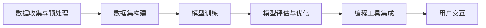

# 未来编程职业的AI赋能与发展前景

> 关键词：编程职业、AI赋能、发展前景、人工智能、代码自动化、职业转型

> 摘要：本文聚焦于未来编程职业在AI赋能下的发展前景。随着人工智能技术的迅猛发展，编程领域正经历着深刻的变革。AI不仅为编程带来了新的工具和方法，提高了编程效率和质量，还在重塑编程职业的结构和要求。文章深入探讨了AI赋能编程的核心概念、算法原理、数学模型，通过项目实战案例展示其应用，分析了实际应用场景，并推荐了相关的学习资源、开发工具和研究成果。最后总结了未来编程职业的发展趋势与挑战，为从业者和相关研究人员提供全面的参考。

## 1. 背景介绍 
### 1.1 目的和范围
随着人工智能技术的快速发展和广泛应用，编程领域正面临着前所未有的变革。本文章的目的在于深入探讨未来编程职业在AI赋能下的发展前景，分析AI对编程职业的多方面影响，包括编程工具、编程方法、职业技能需求等。范围涵盖了AI赋能编程的核心概念、算法原理、数学模型、实际应用场景以及未来发展趋势等方面，旨在为编程从业者、相关研究人员以及对编程职业发展感兴趣的人士提供全面而深入的参考。

### 1.2 预期读者
本文的预期读者包括但不限于以下几类人群：
- **编程从业者**：希望了解AI技术如何影响编程工作，以及如何提升自身技能以适应未来编程职业的发展。
- **计算机科学相关专业的学生**：为他们提供对未来编程职业发展方向的认识，帮助他们在学习过程中更好地规划自己的职业道路。
- **技术管理人员**：有助于他们了解行业趋势，合理规划团队的技术发展方向和人员配置。
- **对人工智能和编程领域感兴趣的爱好者**：满足他们对新兴技术和职业发展的好奇心，拓宽知识面。

### 1.3 文档结构概述
本文将按照以下结构进行阐述：
- **核心概念与联系**：介绍AI赋能编程的核心概念、原理和架构，通过文本示意图和Mermaid流程图进行直观展示。
- **核心算法原理 & 具体操作步骤**：详细讲解相关的核心算法原理，并使用Python源代码进行具体阐述。
- **数学模型和公式 & 详细讲解 & 举例说明**：介绍相关的数学模型和公式，并通过具体例子进行详细讲解。
- **项目实战：代码实际案例和详细解释说明**：通过实际项目案例，展示AI赋能编程的具体实现过程，包括开发环境搭建、源代码详细实现和代码解读。
- **实际应用场景**：分析AI赋能编程在不同领域的实际应用场景。
- **工具和资源推荐**：推荐相关的学习资源、开发工具框架和论文著作。
- **总结：未来发展趋势与挑战**：总结未来编程职业在AI赋能下的发展趋势，并分析可能面临的挑战。
- **附录：常见问题与解答**：解答读者可能关心的常见问题。
- **扩展阅读 & 参考资料**：提供相关的扩展阅读材料和参考资料。

### 1.4 术语表
#### 1.4.1 核心术语定义
- **AI赋能编程**：指利用人工智能技术为编程过程提供支持和帮助，包括代码自动生成、智能代码补全、代码优化等功能，以提高编程效率和质量。
- **代码自动化**：通过AI技术实现代码的自动生成、自动测试、自动部署等任务，减少人工编程的工作量。
- **智能代码补全**：根据程序员输入的部分代码，AI系统预测并补全后续代码，提高编程效率。
- **机器学习**：是一门多领域交叉学科，涉及概率论、统计学、逼近论、凸分析、算法复杂度理论等多门学科。它专门研究计算机怎样模拟或实现人类的学习行为，以获取新的知识或技能，重新组织已有的知识结构使之不断改善自身的性能。
- **深度学习**：是机器学习的一个分支领域，它是一种基于对数据进行表征学习的方法。深度学习通过构建具有很多层的神经网络模型，自动从大量数据中学习特征和模式。

#### 1.4.2 相关概念解释
- **自然语言处理（NLP）**：是人工智能的一个子领域，主要研究如何让计算机理解和处理人类语言。在编程领域，NLP技术可用于将自然语言描述的需求转换为代码，或对代码进行自然语言解释。
- **计算机视觉（CV）**：是一门研究如何使机器“看”的科学，通过摄像头和计算机代替人眼对目标进行识别、跟踪和测量等机器视觉，并进一步做图形处理，使计算机处理成为更适合人眼观察或传送给仪器检测的图像。在编程中，CV技术可用于图形界面编程、图像识别相关的代码开发等。
- **强化学习**：是一种机器学习范式，智能体通过与环境进行交互，根据环境反馈的奖励信号来学习最优的行为策略。在编程领域，强化学习可用于优化代码执行效率、自动调整算法参数等。

#### 1.4.3 缩略词列表
- **AI**：Artificial Intelligence，人工智能
- **ML**：Machine Learning，机器学习
- **DL**：Deep Learning，深度学习
- **NLP**：Natural Language Processing，自然语言处理
- **CV**：Computer Vision，计算机视觉

## 2. 核心概念与联系 

### 核心概念原理
AI赋能编程的核心原理在于利用人工智能技术，特别是机器学习和深度学习算法，对大量的代码数据进行学习和分析，从而实现对编程过程的智能支持。具体来说，通过收集和整理海量的开源代码、编程文档和相关技术资料，构建数据集。然后使用深度学习模型，如循环神经网络（RNN）、长短期记忆网络（LSTM）、Transformer等，对这些数据进行训练，使模型学习到代码的语法结构、语义信息和编程模式。

在实际应用中，当程序员输入部分代码或自然语言描述的需求时，训练好的模型可以根据学习到的知识进行预测和推理，提供智能代码补全、代码自动生成、代码优化建议等功能。例如，智能代码补全功能可以根据程序员当前输入的代码上下文，预测可能的后续代码，并将其推荐给程序员，减少程序员的输入工作量；代码自动生成功能可以根据自然语言描述的需求，生成相应的代码框架或完整的代码实现。

### 架构示意图
以下是AI赋能编程的核心架构的文本示意图：

```plaintext
+----------------------+
|  数据收集与预处理   |
|  (开源代码、文档等)  |
+----------------------+
           |
           v
+----------------------+
|  数据集构建         |
|  (标注、划分等)     |
+----------------------+
           |
           v
+----------------------+
|  模型训练           |
|  (RNN、LSTM、Transformer等) |
+----------------------+
           |
           v
+----------------------+
|  模型评估与优化     |
|  (准确率、召回率等指标) |
+----------------------+
           |
           v
+----------------------+
|  编程工具集成       |
|  (IDE插件、代码编辑器等) |
+----------------------+
           |
           v
+----------------------+
|  用户交互           |
|  (代码输入、需求描述等) |
+----------------------+
```

### Mermaid流程图


## 3. 核心算法原理 & 具体操作步骤 

### 核心算法原理 - 循环神经网络（RNN）
循环神经网络（RNN）是一种用于处理序列数据的神经网络。在编程领域，代码可以看作是一种序列数据，因此RNN可以用于学习代码的序列模式。

RNN的基本结构包含一个输入层、一个隐藏层和一个输出层。隐藏层的输出不仅传递到输出层，还会反馈到自身，形成一个循环结构。这使得RNN能够记住之前的输入信息，从而处理序列数据。

RNN的数学表达式如下：
- 隐藏层状态更新：$h_t = \sigma(W_{hh}h_{t-1} + W_{xh}x_t + b_h)$
- 输出层计算：$y_t = \sigma(W_{hy}h_t + b_y)$

其中，$x_t$ 是时刻 $t$ 的输入，$h_t$ 是时刻 $t$ 的隐藏层状态，$y_t$ 是时刻 $t$ 的输出，$W_{hh}$、$W_{xh}$、$W_{hy}$ 是权重矩阵，$b_h$、$b_y$ 是偏置向量，$\sigma$ 是激活函数，通常使用Sigmoid或Tanh函数。

### Python源代码实现
以下是一个简单的RNN实现示例，用于生成字符序列：

```python
import numpy as np

# 定义超参数
vocab_size = 26  # 字符集大小
hidden_size = 100  # 隐藏层大小
seq_length = 25  # 序列长度
learning_rate = 1e-1

# 初始化权重
Wxh = np.random.randn(hidden_size, vocab_size) * 0.01
Whh = np.random.randn(hidden_size, hidden_size) * 0.01
Why = np.random.randn(vocab_size, hidden_size) * 0.01
bh = np.zeros((hidden_size, 1))
by = np.zeros((vocab_size, 1))

# 定义激活函数
def sigmoid(x):
    return 1 / (1 + np.exp(-x))

def softmax(x):
    e_x = np.exp(x - np.max(x))
    return e_x / e_x.sum(axis=0)

# 前向传播
def forward(x, h_prev):
    h = np.tanh(np.dot(Wxh, x) + np.dot(Whh, h_prev) + bh)
    y = np.dot(Why, h) + by
    p = softmax(y)
    return h, p

# 训练循环
data = "abcdefghijklmnopqrstuvwxyz"
chars = list(set(data))
char_to_ix = {ch: i for i, ch in enumerate(chars)}
ix_to_char = {i: ch for i, ch in enumerate(chars)}

n = 0
p = 0
while True:
    if p + seq_length + 1 >= len(data) or n == 0:
        h_prev = np.zeros((hidden_size, 1))
        p = 0
    inputs = [char_to_ix[ch] for ch in data[p:p+seq_length]]
    targets = [char_to_ix[ch] for ch in data[p+1:p+seq_length+1]]

    # 前向传播
    h, p_pred = forward(np.eye(vocab_size)[inputs[0]].reshape(-1, 1), h_prev)
    for t in range(1, seq_length):
        h, p_pred = forward(np.eye(vocab_size)[inputs[t]].reshape(-1, 1), h)

    # 计算损失
    loss = -np.sum(np.log(p_pred[targets[-1], 0]))

    # 反向传播（省略）

    # 更新权重（省略）

    p += seq_length
    n += 1
```

### 具体操作步骤
1. **数据收集与预处理**：收集大量的代码数据，并进行清洗、标注和划分，构建训练集、验证集和测试集。
2. **模型选择与配置**：根据任务需求选择合适的深度学习模型，如RNN、LSTM、Transformer等，并配置模型的超参数，如学习率、批次大小、训练轮数等。
3. **模型训练**：使用训练集对模型进行训练，通过反向传播算法更新模型的权重，使模型学习到代码的模式和规律。
4. **模型评估**：使用验证集和测试集对训练好的模型进行评估，计算准确率、召回率、F1值等指标，评估模型的性能。
5. **模型优化**：根据评估结果，调整模型的超参数或结构，对模型进行优化，提高模型的性能。
6. **编程工具集成**：将训练好的模型集成到编程工具中，如IDE插件、代码编辑器等，为程序员提供智能支持。

## 4. 数学模型和公式 & 详细讲解 & 举例说明 

### 交叉熵损失函数
在AI赋能编程中，交叉熵损失函数常用于衡量模型预测结果与真实标签之间的差异。交叉熵损失函数的数学表达式如下：

$$H(p, q) = -\sum_{i=1}^{n} p_i \log(q_i)$$

其中，$p$ 是真实标签的概率分布，$q$ 是模型预测的概率分布，$n$ 是类别数。

#### 详细讲解
交叉熵损失函数的核心思想是，当模型预测的概率分布与真实标签的概率分布越接近时，损失值越小；反之，损失值越大。在编程任务中，真实标签可以是正确的代码片段或代码的分类标签，模型预测的概率分布表示模型对不同代码片段或分类的预测概率。

#### 举例说明
假设我们有一个简单的字符分类任务，字符集为 $\{a, b, c\}$，真实标签为 $p = [1, 0, 0]$（表示字符为 $a$），模型预测的概率分布为 $q = [0.8, 0.1, 0.1]$。则交叉熵损失为：

$$H(p, q) = -(1 \times \log(0.8) + 0 \times \log(0.1) + 0 \times \log(0.1)) \approx 0.223$$

### 梯度下降算法
梯度下降算法是一种常用的优化算法，用于更新模型的权重，使损失函数最小化。梯度下降算法的基本思想是，沿着损失函数的负梯度方向更新模型的权重，逐步逼近损失函数的最小值。

梯度下降算法的数学表达式如下：

$$\theta_{t+1} = \theta_t - \alpha \nabla J(\theta_t)$$

其中，$\theta_t$ 是第 $t$ 次迭代时的模型权重，$\alpha$ 是学习率，$\nabla J(\theta_t)$ 是损失函数 $J(\theta)$ 在 $\theta_t$ 处的梯度。

#### 详细讲解
梯度下降算法通过不断迭代更新模型的权重，使得损失函数的值逐渐减小。学习率 $\alpha$ 控制了每次更新的步长，学习率过大可能导致模型无法收敛，学习率过小则会导致收敛速度过慢。

#### 举例说明
假设我们有一个简单的线性回归模型 $y = wx + b$，损失函数为均方误差损失：

$$J(w, b) = \frac{1}{n} \sum_{i=1}^{n} (y_i - (wx_i + b))^2$$

则 $w$ 和 $b$ 的梯度分别为：

$$\frac{\partial J}{\partial w} = -\frac{2}{n} \sum_{i=1}^{n} x_i(y_i - (wx_i + b))$$

$$\frac{\partial J}{\partial b} = -\frac{2}{n} \sum_{i=1}^{n} (y_i - (wx_i + b))$$

使用梯度下降算法更新 $w$ 和 $b$ 的公式为：

$$w_{t+1} = w_t - \alpha \frac{\partial J}{\partial w}$$

$$b_{t+1} = b_t - \alpha \frac{\partial J}{\partial b}$$

## 5. 项目实战：代码实际案例和详细解释说明 

### 5.1  开发环境搭建
#### 硬件环境
- **处理器**：Intel Core i7 或更高性能的处理器
- **内存**：16GB 或以上
- **存储**：512GB 或以上的固态硬盘

#### 软件环境
- **操作系统**：Windows 10、macOS 或 Linux（如 Ubuntu）
- **编程语言**：Python 3.7 或以上版本
- **深度学习框架**：PyTorch 或 TensorFlow
- **开发工具**：PyCharm、Jupyter Notebook 等

### 5.2  源代码详细实现和代码解读
以下是一个使用PyTorch实现的简单的智能代码补全项目示例：

```python
import torch
import torch.nn as nn
import torch.optim as optim
from torch.utils.data import Dataset, DataLoader

# 定义数据集类
class CodeDataset(Dataset):
    def __init__(self, data, seq_length):
        self.data = data
        self.seq_length = seq_length

    def __len__(self):
        return len(self.data) - self.seq_length

    def __getitem__(self, idx):
        input_seq = self.data[idx:idx+self.seq_length]
        target_seq = self.data[idx+1:idx+self.seq_length+1]
        return torch.tensor(input_seq), torch.tensor(target_seq)

# 定义模型类
class CodeCompletionModel(nn.Module):
    def __init__(self, vocab_size, hidden_size):
        super(CodeCompletionModel, self).__init__()
        self.embedding = nn.Embedding(vocab_size, hidden_size)
        self.rnn = nn.RNN(hidden_size, hidden_size, batch_first=True)
        self.fc = nn.Linear(hidden_size, vocab_size)

    def forward(self, x):
        embedded = self.embedding(x)
        output, _ = self.rnn(embedded)
        logits = self.fc(output)
        return logits

# 数据准备
data = "abcdefghijklmnopqrstuvwxyz"
chars = list(set(data))
char_to_ix = {ch: i for i, ch in enumerate(chars)}
ix_to_char = {i: ch for i, ch in enumerate(chars)}
data_ix = [char_to_ix[ch] for ch in data]

# 数据集和数据加载器
seq_length = 25
dataset = CodeDataset(data_ix, seq_length)
dataloader = DataLoader(dataset, batch_size=32, shuffle=True)

# 模型、损失函数和优化器
vocab_size = len(chars)
hidden_size = 100
model = CodeCompletionModel(vocab_size, hidden_size)
criterion = nn.CrossEntropyLoss()
optimizer = optim.Adam(model.parameters(), lr=0.001)

# 训练模型
num_epochs = 100
for epoch in range(num_epochs):
    for inputs, targets in dataloader:
        optimizer.zero_grad()
        outputs = model(inputs)
        loss = criterion(outputs.view(-1, vocab_size), targets.view(-1))
        loss.backward()
        optimizer.step()
    if (epoch + 1) % 10 == 0:
        print(f'Epoch [{epoch+1}/{num_epochs}], Loss: {loss.item():.4f}')

# 代码补全示例
input_seq = "abc"
input_ix = [char_to_ix[ch] for ch in input_seq]
input_tensor = torch.tensor(input_ix).unsqueeze(0)
with torch.no_grad():
    outputs = model(input_tensor)
    _, predicted_ix = torch.max(outputs, dim=2)
    predicted_chars = [ix_to_char[ix.item()] for ix in predicted_ix[0]]
    print(f'Input: {input_seq}, Predicted: {input_seq + "".join(predicted_chars)}')
```

### 5.3  代码解读与分析
- **数据集类 `CodeDataset`**：用于处理代码数据，将代码序列划分为输入序列和目标序列。
- **模型类 `CodeCompletionModel`**：使用嵌入层将输入的字符索引转换为向量表示，然后通过RNN层学习序列模式，最后通过全连接层输出预测的字符概率分布。
- **数据准备**：将代码数据转换为字符索引序列，并创建数据集和数据加载器。
- **模型训练**：使用交叉熵损失函数和Adam优化器对模型进行训练，通过反向传播算法更新模型的权重。
- **代码补全示例**：使用训练好的模型对输入的代码序列进行预测，输出补全后的代码序列。

## 6. 实际应用场景 
### 软件开发
- **提高编程效率**：智能代码补全功能可以减少程序员的输入工作量，提高编程速度。例如，在编写Python代码时，当程序员输入 `for` 关键字后，智能代码补全工具可以自动补全 `for` 循环的基本结构，如 `for i in range():`。
- **代码质量提升**：AI可以对代码进行静态分析，检测代码中的潜在错误和漏洞，提供代码优化建议。例如，AI工具可以检测到代码中的空指针引用、内存泄漏等问题，并给出相应的修复建议。
- **代码生成**：根据自然语言描述的需求，AI可以生成相应的代码框架或完整的代码实现。例如，开发人员可以用自然语言描述一个简单的Web应用程序的功能，AI工具可以生成相应的Python Flask或Django代码。

### 数据科学与机器学习
- **快速搭建模型**：在数据科学和机器学习领域，AI可以帮助快速搭建模型。例如，根据数据集的特点和任务需求，AI工具可以自动选择合适的机器学习算法，并生成相应的代码。
- **超参数调优**：AI可以通过强化学习等技术对机器学习模型的超参数进行自动调优，提高模型的性能。例如，使用AI工具可以自动搜索最优的学习率、批次大小等超参数。
- **特征工程**：AI可以辅助进行特征工程，从原始数据中提取有价值的特征。例如，通过分析数据的统计信息和相关性，AI工具可以自动选择和转换特征，提高模型的预测能力。

### 教育领域
- **编程教学辅助**：AI可以作为编程教学的辅助工具，帮助学生更好地理解编程概念和语法。例如，智能代码补全和代码解释功能可以帮助学生更快地编写代码，并理解代码的含义。
- **个性化学习**：根据学生的学习进度和能力，AI可以提供个性化的学习资源和练习题目，帮助学生提高编程技能。例如，AI系统可以根据学生的答题情况，推荐适合的编程教程和练习题。
- **自动评分与反馈**：AI可以对学生提交的代码进行自动评分和反馈，指出代码中的错误和不足之处，并提供改进建议。例如，AI工具可以检查代码的语法错误、逻辑错误和代码风格问题，并给出相应的评分和反馈。

## 7. 工具和资源推荐
### 7.1 学习资源推荐
#### 7.1.1 书籍推荐
- 《深度学习》（Deep Learning）：由Ian Goodfellow、Yoshua Bengio和Aaron Courville合著，是深度学习领域的经典教材，全面介绍了深度学习的基本概念、算法和应用。
- 《Python深度学习》（Deep Learning with Python）：由Francois Chollet著，以Python和Keras为工具，详细介绍了深度学习的实践方法和应用案例。
- 《机器学习》（Machine Learning）：由周志华著，是机器学习领域的经典教材，系统介绍了机器学习的基本概念、算法和模型。

#### 7.1.2 在线课程
- Coursera上的“深度学习专项课程”（Deep Learning Specialization）：由Andrew Ng教授授课，包括深度学习的基础、卷积神经网络、循环神经网络等多个主题。
- edX上的“使用Python进行数据科学”（Data Science with Python）：介绍了使用Python进行数据科学和机器学习的方法和工具。
- Udemy上的“完整的Python机器学习课程”（Complete Python Machine Learning Course）：提供了丰富的Python机器学习实践案例和项目。

#### 7.1.3 技术博客和网站
- Medium：是一个技术博客平台，有许多关于人工智能、编程等领域的优质文章。
- Towards Data Science：专注于数据科学和机器学习领域的技术博客，提供了大量的技术文章和实践案例。
- Hacker News：是一个技术新闻和讨论平台，关注计算机科学、编程、创业等领域的最新动态和技术趋势。

### 7.2 开发工具框架推荐
#### 7.2.1 IDE和编辑器
- PyCharm：是一款专门为Python开发设计的集成开发环境（IDE），提供了代码编辑、调试、版本控制等丰富的功能。
- Visual Studio Code：是一款轻量级的代码编辑器，支持多种编程语言和插件扩展，具有强大的代码编辑和调试功能。
- Jupyter Notebook：是一个交互式的笔记本环境，适合进行数据探索、模型训练和可视化等工作。

#### 7.2.2 调试和性能分析工具
- PySnooper：是一个简单易用的Python调试工具，可以自动记录函数的执行过程和变量的值。
- cProfile：是Python内置的性能分析工具，可以分析代码的执行时间和函数调用次数。
- TensorBoard：是TensorFlow提供的可视化工具，可以用于可视化模型的训练过程、性能指标等。

#### 7.2.3 相关框架和库
- PyTorch：是一个开源的深度学习框架，提供了丰富的神经网络层和优化算法，易于使用和扩展。
- TensorFlow：是一个广泛使用的深度学习框架，具有强大的分布式训练和部署能力。
- Scikit-learn：是一个简单易用的机器学习库，提供了各种机器学习算法和工具，适合初学者和快速原型开发。

### 7.3 相关论文著作推荐
#### 7.3.1 经典论文
- “Attention Is All You Need”：提出了Transformer模型，是自然语言处理领域的重要突破。
- “ImageNet Classification with Deep Convolutional Neural Networks”：介绍了AlexNet模型，开创了深度学习在计算机视觉领域的应用。
- “Learning Representations by Back-propagating Errors”：介绍了反向传播算法，是神经网络训练的基础。

#### 7.3.2 最新研究成果
- 关注顶级学术会议，如NeurIPS（神经信息处理系统大会）、ICML（国际机器学习会议）、CVPR（计算机视觉与模式识别会议）等，这些会议上的研究成果代表了人工智能领域的最新进展。
- 查阅相关学术期刊，如Journal of Artificial Intelligence Research（JAIR）、Artificial Intelligence等，获取最新的研究论文和成果。

#### 7.3.3 应用案例分析
- 研究一些知名公司的AI应用案例，如谷歌的AlphaGo、百度的飞桨平台等，了解AI在实际应用中的技术方案和实现细节。
- 分析开源项目中的AI应用案例，如OpenAI的GPT系列、Hugging Face的Transformers库等，学习其代码实现和应用方法。

## 8. 总结：未来发展趋势与挑战
### 未来发展趋势
- **代码自动化程度不断提高**：随着AI技术的不断发展，代码自动化的范围将不断扩大，包括代码生成、测试、部署等各个环节。未来，程序员可能只需要提供需求描述，AI就能自动生成完整的软件系统。
- **跨领域融合发展**：编程将与其他领域，如生物学、医学、物理学等进行更深入的融合。AI赋能编程将帮助解决这些领域中的复杂问题，推动科学研究和技术创新。
- **个性化编程辅助**：AI将根据程序员的编程习惯、技能水平和工作场景，提供个性化的编程辅助。例如，为新手程序员提供更多的代码提示和解释，为高级程序员提供更智能的代码优化建议。
- **智能编程生态系统的形成**：未来将形成一个智能编程生态系统，包括智能代码编辑器、智能代码仓库、智能编程社区等。这些系统将相互协作，为程序员提供更全面、高效的编程支持。

### 挑战
- **数据隐私和安全问题**：AI赋能编程需要大量的代码数据进行训练，这些数据可能包含敏感信息，如商业机密、用户隐私等。因此，如何保护数据的隐私和安全是一个重要的挑战。
- **AI模型的可解释性**：目前的AI模型大多是黑盒模型，其决策过程难以解释。在编程领域，这可能导致程序员对AI生成的代码缺乏信任，影响AI技术的应用和推广。
- **职业转型和技能提升**：AI赋能编程将改变编程职业的结构和要求，程序员需要不断学习和提升自己的技能，以适应新的工作需求。如何帮助程序员顺利实现职业转型是一个亟待解决的问题。
- **伦理和法律问题**：随着AI在编程领域的应用越来越广泛，可能会引发一系列伦理和法律问题，如AI生成的代码的版权归属、AI决策的责任认定等。需要建立相应的伦理和法律框架来规范AI的应用。

## 9. 附录：常见问题与解答
### 1. AI会取代程序员吗？
目前来看，AI不会完全取代程序员。虽然AI可以在一定程度上提高编程效率和自动化程度，但编程不仅仅是代码的编写，还涉及到需求分析、系统设计、架构规划、团队协作等多个方面。程序员的创造力、逻辑思维和问题解决能力是AI难以替代的。AI更像是程序员的辅助工具，帮助程序员更好地完成工作。

### 2. 学习AI赋能编程需要具备哪些基础？
学习AI赋能编程需要具备一定的编程基础，如Python编程语言。同时，还需要了解机器学习和深度学习的基本概念和算法，如神经网络、梯度下降、交叉熵损失函数等。此外，对数据处理和分析的能力也很重要，因为AI模型的训练需要大量的数据。

### 3. 如何选择适合的AI模型用于编程任务？
选择适合的AI模型需要考虑任务的特点和需求。如果是处理序列数据，如代码序列，可以选择RNN、LSTM、Transformer等模型；如果是图像相关的编程任务，可以选择卷积神经网络（CNN）；如果是需要进行决策和优化的任务，可以考虑强化学习模型。此外，还需要考虑模型的复杂度、训练时间和计算资源等因素。

### 4. AI赋能编程的应用有哪些限制？
AI赋能编程的应用存在一些限制。例如，AI模型的性能依赖于训练数据的质量和数量，如果训练数据不足或存在偏差，可能导致模型的预测结果不准确。此外，AI模型的泛化能力有限，对于一些复杂、新颖的编程任务，可能无法提供有效的支持。同时，AI生成的代码可能缺乏创新性和灵活性，需要程序员进行进一步的优化和调整。

## 10. 扩展阅读 & 参考资料
### 扩展阅读
- 《人工智能时代与人类未来》：探讨了人工智能对人类社会的影响和未来发展趋势。
- 《智能时代》：介绍了智能时代的技术变革和社会变革，以及如何在智能时代中学习和工作。
- 《未来简史：从智人到神人》：从人类历史和未来发展的角度，探讨了人工智能、生物技术等新兴技术对人类的影响。

### 参考资料
- Goodfellow, I., Bengio, Y., & Courville, A. (2016). Deep Learning. MIT Press.
- Chollet, F. (2018). Deep Learning with Python. Manning Publications.
- Zhou, Z. H. (2016). Machine Learning. Tsinghua University Press.
- Vaswani, A., Shazeer, N., Parmar, N., Uszkoreit, J., Jones, L., Gomez, A. N., ... & Polosukhin, I. (2017). Attention is all you need. In Advances in neural information processing systems (pp. 5998-6008).
- Krizhevsky, A., Sutskever, I., & Hinton, G. E. (2012). ImageNet classification with deep convolutional neural networks. In Advances in neural information processing systems (pp. 1097-1105).
- Rumelhart, D. E., Hinton, G. E., & Williams, R. J. (1986). Learning representations by back-propagating errors. Nature, 323(6088), 533-536.