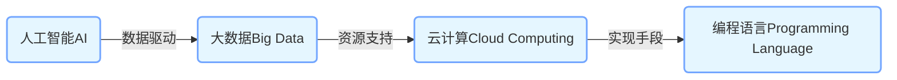

# 未来编程职业的技能需求分析

> 关键词：编程职业、未来技能需求、人工智能、云计算、大数据、编程语言、软件开发

> 摘要：本文旨在深入分析未来编程职业的技能需求。随着科技的飞速发展，编程领域不断演变，新的技术和理念层出不穷。了解未来编程职业所需的技能，对于程序员的职业发展以及企业招聘合适的人才都具有重要意义。文章将从背景介绍入手，阐述相关核心概念与联系，详细讲解核心算法原理及操作步骤，探讨数学模型和公式，通过项目实战案例进行说明，分析实际应用场景，推荐相关工具和资源，最后总结未来发展趋势与挑战，并提供常见问题解答和参考资料，为读者全面呈现未来编程职业技能需求的全貌。

## 1. 背景介绍 
### 1.1 目的和范围
本文章的目的在于全面且深入地剖析未来编程职业所需要的技能。范围涵盖了当前主流的技术领域，如人工智能、云计算、大数据等，以及与之相关的编程语言、开发工具和方法。通过对这些方面的研究，为程序员、相关从业者以及对编程职业感兴趣的人群提供有价值的参考，帮助他们了解未来编程领域的发展方向和技能要求，从而更好地规划自己的职业发展路径。

### 1.2 预期读者
本文的预期读者主要包括以下几类人群：
- **在职程序员**：希望通过了解未来技能需求，提升自己的竞争力，实现职业的进阶。
- **编程专业的学生**：为他们的学习和实践提供指导，使其在学校期间就能够有针对性地培养相关技能。
- **企业招聘人员**：帮助他们明确招聘标准，筛选出符合未来编程职业需求的人才。
- **对编程领域感兴趣的爱好者**：让他们对未来编程职业有更清晰的认识，决定是否要进入这个领域。

### 1.3 文档结构概述
本文将按照以下结构进行阐述：
- **核心概念与联系**：介绍与未来编程职业相关的核心概念，以及它们之间的相互联系，并通过文本示意图和 Mermaid 流程图进行展示。
- **核心算法原理 & 具体操作步骤**：详细讲解一些重要的核心算法原理，并结合 Python 源代码进行说明，同时给出具体的操作步骤。
- **数学模型和公式 & 详细讲解 & 举例说明**：阐述相关的数学模型和公式，对其进行详细讲解，并通过具体的例子进行说明。
- **项目实战：代码实际案例和详细解释说明**：通过一个实际的项目案例，介绍开发环境的搭建、源代码的实现和解读，以及对代码的分析。
- **实际应用场景**：分析未来编程技能在不同领域的实际应用场景。
- **工具和资源推荐**：推荐学习资源、开发工具框架以及相关的论文著作。
- **总结：未来发展趋势与挑战**：总结未来编程职业的发展趋势和面临的挑战。
- **附录：常见问题与解答**：对常见问题进行解答，帮助读者更好地理解文章内容。
- **扩展阅读 & 参考资料**：提供扩展阅读的建议和参考资料，方便读者进一步深入研究。

### 1.4 术语表
#### 1.4.1 核心术语定义
- **人工智能（Artificial Intelligence，AI）**：是一门研究如何使计算机能够模拟人类智能的学科，包括机器学习、深度学习、自然语言处理等多个领域。
- **云计算（Cloud Computing）**：是一种基于互联网的计算方式，通过将计算资源、存储资源等提供给用户，实现资源的共享和高效利用。
- **大数据（Big Data）**：指那些规模巨大、类型多样、产生速度快的数据集合，需要专门的技术和工具来进行存储、管理和分析。
- **编程语言（Programming Language）**：是用于编写计算机程序的语言，不同的编程语言有不同的特点和应用场景。
- **软件开发（Software Development）**：是一个将用户需求转化为软件产品的过程，包括需求分析、设计、编码、测试、维护等多个阶段。

#### 1.4.2 相关概念解释
- **机器学习（Machine Learning）**：是人工智能的一个重要分支，通过让计算机从数据中学习模式和规律，从而实现预测和决策等功能。
- **深度学习（Deep Learning）**：是机器学习的一种特殊形式，基于神经网络模型，通过多层神经元的组合来学习数据的特征和表示。
- **容器化（Containerization）**：是一种轻量级的虚拟化技术，将应用程序及其依赖项打包成一个独立的容器，实现应用的快速部署和迁移。
- **区块链（Blockchain）**：是一种分布式账本技术，通过去中心化的方式实现数据的安全存储和共享。

#### 1.4.3 缩略词列表
- **AI**：Artificial Intelligence（人工智能）
- **ML**：Machine Learning（机器学习）
- **DL**：Deep Learning（深度学习）
- **NLP**：Natural Language Processing（自然语言处理）
- **AWS**：Amazon Web Services（亚马逊云服务）
- **GCP**：Google Cloud Platform（谷歌云平台）
- **Azure**：Microsoft Azure（微软云服务）

## 2. 核心概念与联系 

### 核心概念原理
在未来编程职业中，几个核心概念起着关键作用，它们相互关联，共同推动编程领域的发展。

#### 人工智能（AI）
人工智能旨在让计算机模拟人类的智能行为，如学习、推理、感知等。其核心原理是通过算法和模型对数据进行处理和分析，从而实现对未知数据的预测和决策。机器学习是人工智能的重要实现手段，它通过让计算机从数据中自动学习模式和规律，不断优化模型的性能。深度学习则是机器学习的一种高级形式，通过构建多层神经网络，能够自动提取数据的深层次特征，在图像识别、语音识别等领域取得了巨大的成功。

#### 云计算
云计算基于互联网提供计算资源和服务，其原理是将计算任务分布在大量的计算机构成的资源池上，用户可以根据自己的需求随时获取和使用这些资源。云计算提供了三种主要的服务模式：基础设施即服务（IaaS）、平台即服务（PaaS）和软件即服务（SaaS）。IaaS 提供了基础的计算、存储和网络资源，用户可以在其上自行搭建和管理应用程序；PaaS 提供了一个开发和运行应用程序的平台，用户无需关注底层的基础设施；SaaS 则直接提供软件应用服务，用户通过浏览器即可使用。

#### 大数据
大数据的核心在于对海量、多样、快速变化的数据进行有效的管理和分析。由于数据量巨大，传统的数据处理技术无法满足需求，因此需要采用分布式存储和处理技术。Hadoop 和 Spark 是大数据领域中常用的开源框架，Hadoop 提供了分布式文件系统（HDFS）和分布式计算框架（MapReduce），能够处理大规模的数据存储和计算任务；Spark 则是一个快速、通用的大数据处理引擎，提供了更高效的内存计算能力，能够处理实时数据和复杂的数据分析任务。

#### 编程语言
编程语言是程序员与计算机进行交互的工具，不同的编程语言有不同的特点和应用场景。Python 由于其简洁易读、丰富的库和框架，在数据科学、人工智能等领域得到了广泛的应用；Java 则以其跨平台性、面向对象的特性，在企业级应用开发中占据重要地位；C++ 具有高性能、低内存占用的特点，常用于系统编程、游戏开发等领域。

### 架构的文本示意图
```plaintext
               +----------------+
               |   人工智能（AI）  |
               +----------------+
                      |
                      |  数据驱动
                      v
               +----------------+
               |   大数据（Big Data） |
               +----------------+
                      |
                      |  资源支持
                      v
               +----------------+
               |   云计算（Cloud Computing） |
               +----------------+
                      |
                      |  实现手段
                      v
               +----------------+
               |  编程语言（Programming Language） |
               +----------------+
```

### Mermaid 流程图


这个流程图展示了人工智能、大数据、云计算和编程语言之间的联系。人工智能的发展依赖于大数据提供的数据支持，大数据的处理需要云计算提供的资源支持，而这些技术的实现都离不开编程语言。它们相互关联、相互促进，共同构成了未来编程职业的核心技术体系。

## 3. 核心算法原理 & 具体操作步骤 

### 核心算法原理 - 机器学习中的线性回归算法
线性回归是机器学习中最基础的算法之一，用于建立自变量和因变量之间的线性关系。其基本原理是通过最小化预测值与真实值之间的误差，找到最优的回归系数。

假设我们有一个数据集 $\{(x_1, y_1), (x_2, y_2), \cdots, (x_n, y_n)\}$，其中 $x_i$ 是自变量，$y_i$ 是因变量。线性回归模型可以表示为：

$y = \theta_0 + \theta_1x_1 + \theta_2x_2 + \cdots + \theta_mx_m + \epsilon$

其中，$\theta_0, \theta_1, \cdots, \theta_m$ 是回归系数，$\epsilon$ 是误差项。

为了找到最优的回归系数，我们通常使用最小二乘法。最小二乘法的目标是最小化误差平方和：

$J(\theta) = \frac{1}{2n}\sum_{i=1}^{n}(y_i - \hat{y}_i)^2$

其中，$\hat{y}_i$ 是模型的预测值。

### Python 源代码实现
```python
import numpy as np

class LinearRegression:
    def __init__(self):
        self.theta = None

    def fit(self, X, y):
        # 在 X 矩阵前添加一列全为 1 的列，用于表示截距项
        X_b = np.c_[np.ones((X.shape[0], 1)), X]
        # 使用正规方程求解回归系数
        self.theta = np.linalg.inv(X_b.T.dot(X_b)).dot(X_b.T).dot(y)

    def predict(self, X):
        X_b = np.c_[np.ones((X.shape[0], 1)), X]
        return X_b.dot(self.theta)

# 示例数据
X = np.array([[1], [2], [3], [4], [5]])
y = np.array([2, 4, 6, 8, 10])

# 创建线性回归模型实例
model = LinearRegression()
# 训练模型
model.fit(X, y)
# 进行预测
new_X = np.array([[6]])
prediction = model.predict(new_X)
print("预测值:", prediction)
```

### 具体操作步骤
1. **数据准备**：收集和整理数据集，将自变量和因变量分开。
2. **模型初始化**：创建线性回归模型的实例。
3. **模型训练**：调用 `fit` 方法，使用最小二乘法求解回归系数。
4. **模型预测**：调用 `predict` 方法，对新的数据进行预测。

### 核心算法原理 - 深度学习中的卷积神经网络（CNN）
卷积神经网络是一种专门用于处理具有网格结构数据的深度学习模型，如图像和音频。其核心原理是通过卷积层、池化层和全连接层的组合，自动提取数据的特征。

#### 卷积层
卷积层通过卷积核在输入数据上滑动，进行卷积操作，提取数据的局部特征。卷积操作可以表示为：

$y_{i,j} = \sum_{m=0}^{M-1}\sum_{n=0}^{N-1}x_{i+m,j+n}w_{m,n} + b$

其中，$x$ 是输入数据，$w$ 是卷积核，$b$ 是偏置项，$y$ 是卷积结果。

#### 池化层
池化层用于减少数据的维度，降低计算量，同时增强模型的鲁棒性。常见的池化操作有最大池化和平均池化。

#### 全连接层
全连接层将卷积层和池化层提取的特征进行整合，输出最终的预测结果。

### Python 源代码实现（使用 PyTorch）
```python
import torch
import torch.nn as nn
import torch.optim as optim

# 定义卷积神经网络模型
class SimpleCNN(nn.Module):
    def __init__(self):
        super(SimpleCNN, self).__init__()
        self.conv1 = nn.Conv2d(1, 16, kernel_size=3, padding=1)
        self.relu1 = nn.ReLU()
        self.pool1 = nn.MaxPool2d(kernel_size=2, stride=2)
        self.conv2 = nn.Conv2d(16, 32, kernel_size=3, padding=1)
        self.relu2 = nn.ReLU()
        self.pool2 = nn.MaxPool2d(kernel_size=2, stride=2)
        self.fc1 = nn.Linear(32 * 7 * 7, 128)
        self.relu3 = nn.ReLU()
        self.fc2 = nn.Linear(128, 10)

    def forward(self, x):
        x = self.pool1(self.relu1(self.conv1(x)))
        x = self.pool2(self.relu2(self.conv2(x)))
        x = x.view(-1, 32 * 7 * 7)
        x = self.relu3(self.fc1(x))
        x = self.fc2(x)
        return x

# 初始化模型
model = SimpleCNN()
# 定义损失函数和优化器
criterion = nn.CrossEntropyLoss()
optimizer = optim.SGD(model.parameters(), lr=0.001, momentum=0.9)

# 示例数据（假设输入为 1 通道、28x28 的图像）
input_data = torch.randn(1, 1, 28, 28)
target = torch.randint(0, 10, (1,))

# 训练模型
for epoch in range(10):
    optimizer.zero_grad()
    output = model(input_data)
    loss = criterion(output, target)
    loss.backward()
    optimizer.step()
    print(f'Epoch {epoch+1}, Loss: {loss.item()}')
```

### 具体操作步骤
1. **模型定义**：定义卷积神经网络的结构，包括卷积层、池化层和全连接层。
2. **损失函数和优化器定义**：选择合适的损失函数和优化器，如交叉熵损失函数和随机梯度下降优化器。
3. **数据准备**：准备输入数据和目标标签。
4. **模型训练**：进行多次迭代训练，不断更新模型的参数。

## 4. 数学模型和公式 & 详细讲解 & 举例说明 

### 线性回归的数学模型和公式
线性回归的数学模型为：

$y = \theta_0 + \theta_1x_1 + \theta_2x_2 + \cdots + \theta_mx_m + \epsilon$

其中，$y$ 是因变量，$x_1, x_2, \cdots, x_m$ 是自变量，$\theta_0, \theta_1, \cdots, \theta_m$ 是回归系数，$\epsilon$ 是误差项。

误差平方和的计算公式为：

$J(\theta) = \frac{1}{2n}\sum_{i=1}^{n}(y_i - \hat{y}_i)^2$

其中，$\hat{y}_i = \theta_0 + \theta_1x_{i1} + \theta_2x_{i2} + \cdots + \theta_mx_{im}$ 是模型的预测值。

### 详细讲解
线性回归的目标是找到一组回归系数 $\theta$，使得误差平方和 $J(\theta)$ 最小。通过对 $J(\theta)$ 求偏导数并令其等于 0，可以得到正规方程：

$\theta = (X^TX)^{-1}X^Ty$

其中，$X$ 是自变量矩阵，$y$ 是因变量向量。

### 举例说明
假设我们有以下数据集：

| $x$ | $y$ |
|---|---|
| 1 | 2 |
| 2 | 4 |
| 3 | 6 |
| 4 | 8 |
| 5 | 10 |

我们可以将其表示为矩阵形式：

$X = \begin{bmatrix} 1 & 1 \\ 1 & 2 \\ 1 & 3 \\ 1 & 4 \\ 1 & 5 \end{bmatrix}$，$y = \begin{bmatrix} 2 \\ 4 \\ 6 \\ 8 \\ 10 \end{bmatrix}$

根据正规方程求解回归系数：

```python
import numpy as np

X = np.array([[1, 1], [1, 2], [1, 3], [1, 4], [1, 5]])
y = np.array([2, 4, 6, 8, 10])

theta = np.linalg.inv(X.T.dot(X)).dot(X.T).dot(y)
print("回归系数:", theta)
```

运行结果：

```plaintext
回归系数: [0. 2.]
```

这表明回归方程为 $y = 0 + 2x$，与我们的预期一致。

### 逻辑回归的数学模型和公式
逻辑回归是一种用于分类问题的机器学习算法，其数学模型基于逻辑函数（也称为 sigmoid 函数）：

$\sigma(z) = \frac{1}{1 + e^{-z}}$

其中，$z = \theta_0 + \theta_1x_1 + \theta_2x_2 + \cdots + \theta_mx_m$ 是线性组合。

逻辑回归的预测概率为：

$P(y = 1|x) = \sigma(z)$

$P(y = 0|x) = 1 - P(y = 1|x)$

损失函数通常使用对数损失函数（也称为交叉熵损失函数）：

$J(\theta) = -\frac{1}{n}\sum_{i=1}^{n}[y_i\log(P(y_i = 1|x_i)) + (1 - y_i)\log(1 - P(y_i = 1|x_i))]$

### 详细讲解
逻辑回归的目标是找到一组回归系数 $\theta$，使得对数损失函数 $J(\theta)$ 最小。通常使用梯度下降法来求解 $\theta$。

梯度下降法的更新公式为：

$\theta_j := \theta_j - \alpha\frac{\partial J(\theta)}{\partial \theta_j}$

其中，$\alpha$ 是学习率。

### 举例说明
假设我们有以下二分类数据集：

| $x_1$ | $x_2$ | $y$ |
|---|---|---|
| 1 | 2 | 0 |
| 2 | 3 | 0 |
| 3 | 4 | 1 |
| 4 | 5 | 1 |

我们可以使用 Python 实现逻辑回归：

```python
import numpy as np

def sigmoid(z):
    return 1 / (1 + np.exp(-z))

def log_loss(y_true, y_pred):
    return -np.mean(y_true * np.log(y_pred) + (1 - y_true) * np.log(1 - y_pred))

def gradient_descent(X, y, theta, alpha, num_iterations):
    n = len(y)
    for iteration in range(num_iterations):
        z = np.dot(X, theta)
        y_pred = sigmoid(z)
        gradient = np.dot(X.T, (y_pred - y)) / n
        theta -= alpha * gradient
        if iteration % 100 == 0:
            loss = log_loss(y, y_pred)
            print(f'Iteration {iteration}, Loss: {loss}')
    return theta

# 数据准备
X = np.array([[1, 1, 2], [1, 2, 3], [1, 3, 4], [1, 4, 5]])
y = np.array([0, 0, 1, 1])

# 初始化参数
theta = np.zeros(X.shape[1])
alpha = 0.1
num_iterations = 1000

# 训练模型
theta = gradient_descent(X, y, theta, alpha, num_iterations)
print("回归系数:", theta)
```

运行结果：

```plaintext
Iteration 0, Loss: 0.6931471805599453
Iteration 100, Loss: 0.5321382337170487
Iteration 200, Loss: 0.4600429783170612
Iteration 300, Loss: 0.4237488477804388
Iteration 400, Loss: 0.4021739940834727
Iteration 500, Loss: 0.3879743400848244
Iteration 600, Loss: 0.3779860799048938
Iteration 700, Loss: 0.3704798264747329
Iteration 800, Loss: 0.3646944374939348
Iteration 900, Loss: 0.3601348033987321
回归系数: [-5.20423783  2.03414107  0.8738197 ]
```

这表明我们已经找到了一组回归系数，使得对数损失函数最小。

## 5. 项目实战：代码实际案例和详细解释说明 

### 5.1  开发环境搭建
本项目将使用 Python 语言进行开发，以下是搭建开发环境的步骤：

#### 安装 Python
访问 Python 官方网站（https://www.python.org/downloads/），下载并安装适合你操作系统的 Python 版本。建议安装 Python 3.7 及以上版本。

#### 安装虚拟环境
为了避免不同项目之间的依赖冲突，我们可以使用虚拟环境来管理项目的依赖。在命令行中执行以下命令安装 `virtualenv`：

```bash
pip install virtualenv
```

创建并激活虚拟环境：

```bash
# 创建虚拟环境
virtualenv myenv

# 激活虚拟环境（Windows）
myenv\Scripts\activate

# 激活虚拟环境（Linux/Mac）
source myenv/bin/activate
```

#### 安装依赖库
在虚拟环境中安装项目所需的依赖库，本项目将使用 `numpy`、`pandas`、`scikit-learn` 等库：

```bash
pip install numpy pandas scikit-learn matplotlib
```

### 5.2  源代码详细实现和代码解读
本项目将实现一个简单的房价预测模型，使用波士顿房价数据集。

```python
import numpy as np
import pandas as pd
from sklearn.datasets import load_boston
from sklearn.model_selection import train_test_split
from sklearn.linear_model import LinearRegression
from sklearn.metrics import mean_squared_error
import matplotlib.pyplot as plt

# 加载数据集
boston = load_boston()
X = pd.DataFrame(boston.data, columns=boston.feature_names)
y = pd.Series(boston.target)

# 数据划分
X_train, X_test, y_train, y_test = train_test_split(X, y, test_size=0.2, random_state=42)

# 创建线性回归模型
model = LinearRegression()

# 训练模型
model.fit(X_train, y_train)

# 进行预测
y_pred = model.predict(X_test)

# 计算均方误差
mse = mean_squared_error(y_test, y_pred)
print(f'均方误差: {mse}')

# 可视化预测结果
plt.scatter(y_test, y_pred)
plt.xlabel('真实房价')
plt.ylabel('预测房价')
plt.title('房价预测结果')
plt.show()
```

### 代码解读
1. **数据加载**：使用 `load_boston` 函数加载波士顿房价数据集，并将其转换为 `pandas` 数据框和系列。
2. **数据划分**：使用 `train_test_split` 函数将数据集划分为训练集和测试集，测试集占比为 20%。
3. **模型创建**：创建一个线性回归模型实例。
4. **模型训练**：使用训练集数据对模型进行训练。
5. **模型预测**：使用训练好的模型对测试集数据进行预测。
6. **误差计算**：使用 `mean_squared_error` 函数计算预测结果与真实值之间的均方误差。
7. **可视化**：使用 `matplotlib` 库绘制真实房价与预测房价的散点图，直观展示预测结果。

### 5.3  代码解读与分析
- **数据预处理**：在实际项目中，数据预处理是非常重要的一步。我们可以对数据进行缺失值处理、特征缩放、特征选择等操作，以提高模型的性能。
- **模型选择**：线性回归是一种简单而有效的模型，但在某些情况下可能不适用。我们可以尝试其他模型，如决策树、随机森林、支持向量机等，以找到最适合的模型。
- **模型评估**：均方误差是一种常用的模型评估指标，但在不同的应用场景中，可能需要使用其他指标，如均方根误差（RMSE）、平均绝对误差（MAE）、R² 分数等。

## 6. 实际应用场景 
### 人工智能在医疗领域的应用
- **疾病诊断**：通过对医学影像（如 X 光、CT 等）的分析，人工智能可以帮助医生更准确地诊断疾病。例如，深度学习模型可以自动识别影像中的病变特征，辅助医生进行早期诊断。
- **药物研发**：人工智能可以通过对大量的生物数据和化学数据的分析，预测药物的疗效和副作用，加速药物研发的进程。
- **个性化医疗**：根据患者的基因信息、临床数据等，人工智能可以为患者提供个性化的治疗方案，提高治疗效果。

### 云计算在企业中的应用
- **企业资源规划（ERP）**：企业可以将 ERP 系统部署在云计算平台上，实现资源的共享和高效利用。云计算提供的弹性计算能力可以根据企业的业务需求动态调整资源，降低企业的 IT 成本。
- **软件开发与测试**：云计算平台提供了丰富的开发和测试环境，企业可以在云端进行软件开发和测试，提高开发效率和质量。同时，云计算的分布式计算能力可以加速测试过程，缩短测试周期。
- **数据备份与恢复**：企业可以将重要的数据备份到云计算平台上，确保数据的安全性和可靠性。在数据丢失或损坏的情况下，可以快速从云端恢复数据，减少企业的损失。

### 大数据在金融领域的应用
- **风险评估**：金融机构可以通过对大量的客户数据、市场数据等的分析，评估客户的信用风险和市场风险。大数据分析可以发现潜在的风险因素，帮助金融机构做出更明智的决策。
- **投资决策**：通过对金融市场的大数据分析，投资者可以了解市场趋势和投资机会，制定更合理的投资策略。
- **反欺诈检测**：金融机构可以利用大数据技术实时监测交易数据，识别异常交易行为，防范欺诈风险。

### 编程语言在不同领域的应用
- **Python**：在数据科学、人工智能、机器学习、Web 开发等领域得到了广泛的应用。例如，Python 的 `pandas` 库可以方便地进行数据处理和分析，`scikit-learn` 库提供了丰富的机器学习算法，`Django` 和 `Flask` 框架可以用于 Web 开发。
- **Java**：在企业级应用开发、Android 开发等领域占据重要地位。Java 的跨平台性和面向对象的特性使其非常适合开发大型的企业应用系统，同时，Java 也是 Android 开发的主要语言。
- **C++**：在系统编程、游戏开发、嵌入式系统等领域有广泛的应用。C++ 的高性能和低内存占用的特点使其成为开发对性能要求较高的系统的首选语言。

## 7. 工具和资源推荐
### 7.1 学习资源推荐
#### 7.1.1 书籍推荐
- **《Python 数据分析实战》**：本书介绍了使用 Python 进行数据分析的基本方法和技巧，包括数据处理、数据可视化、机器学习等内容，适合初学者入门。
- **《深度学习》**：由 Ian Goodfellow、Yoshua Bengio 和 Aaron Courville 合著，是深度学习领域的经典教材，全面介绍了深度学习的理论和实践。
- **《Java 核心技术》**：是 Java 编程领域的权威书籍，详细介绍了 Java 语言的核心特性和编程技巧，适合 Java 开发者深入学习。
- **《C++ Primer》**：是学习 C++ 语言的经典教材，系统地介绍了 C++ 的语法、特性和编程思想，适合初学者和有一定基础的开发者。

#### 7.1.2 在线课程
- **Coursera**：提供了丰富的在线课程，包括机器学习、深度学习、数据科学等领域的课程，由全球知名大学和机构的教授授课。
- **EdX**：与全球多所顶尖大学合作，提供高质量的在线课程，涵盖了计算机科学、工程学、数学等多个领域。
- **Udemy**：有大量的编程课程可供选择，课程内容丰富多样，价格相对较低，适合不同水平的学习者。

#### 7.1.3 技术博客和网站
- **Medium**：是一个技术博客平台，有许多优秀的程序员和技术专家分享他们的经验和见解，涵盖了各种编程语言、技术领域。
- **Stack Overflow**：是一个程序员社区，用户可以在上面提问、回答问题，解决编程中遇到的问题。
- **GitHub**：是全球最大的代码托管平台，上面有许多优秀的开源项目和代码库，可以学习和参考。

### 7.2 开发工具框架推荐
#### 7.2.1 IDE和编辑器
- **PyCharm**：是一款专门为 Python 开发设计的集成开发环境（IDE），提供了丰富的功能，如代码编辑、调试、自动完成等，提高开发效率。
- **IntelliJ IDEA**：是一款功能强大的 Java 开发 IDE，支持多种编程语言和框架，具有智能代码提示、重构等功能。
- **Visual Studio Code**：是一款轻量级的代码编辑器，支持多种编程语言，具有丰富的插件生态系统，可以根据需要进行扩展。

#### 7.2.2 调试和性能分析工具
- **pdb**：是 Python 自带的调试器，可以帮助开发者定位和解决代码中的问题。
- **VisualVM**：是一款 Java 性能分析工具，可以对 Java 应用程序进行性能监测、内存分析、线程分析等。
- **gdb**：是一款强大的 C/C++ 调试器，可以帮助开发者调试和优化 C/C++ 程序。

#### 7.2.3 相关框架和库
- **TensorFlow**：是一个开源的机器学习框架，提供了丰富的工具和接口，用于构建和训练深度学习模型。
- **PyTorch**：是另一个流行的深度学习框架，具有动态图的特点，易于使用和调试。
- **Django**：是一个高级的 Python Web 框架，提供了快速开发 Web 应用的功能，具有良好的安全性和可扩展性。

### 7.3 相关论文著作推荐
#### 7.3.1 经典论文
- **《ImageNet Classification with Deep Convolutional Neural Networks》**：Alex Krizhevsky、Ilya Sutskever 和 Geoffrey E. Hinton 发表的论文，介绍了 AlexNet 卷积神经网络，开创了深度学习在图像识别领域的先河。
- **《Attention Is All You Need》**：Vaswani 等人发表的论文，提出了 Transformer 架构，在自然语言处理领域取得了巨大的成功。
- **《A Mathematical Theory of Communication》**：Claude E. Shannon 发表的论文，奠定了信息论的基础，对计算机科学和通信领域产生了深远的影响。

#### 7.3.2 最新研究成果
- **arXiv**：是一个预印本服务器，上面有许多最新的学术研究成果，涵盖了计算机科学、物理学、数学等多个领域。
- **ACM Digital Library**：是计算机协会（ACM）的数字图书馆，提供了大量的计算机科学领域的研究论文和会议记录。
- **IEEE Xplore**：是电气和电子工程师协会（IEEE）的数字图书馆，包含了电气、电子、计算机科学等领域的研究文献。

#### 7.3.3 应用案例分析
- **Kaggle**：是一个数据科学竞赛平台，上面有许多真实的数据集和应用案例，可以学习和参考。
- **Hugging Face**：是一个自然语言处理社区，提供了许多预训练模型和应用案例，方便开发者快速上手和应用。
- **Google AI Blog**：是 Google 发布人工智能研究成果和应用案例的博客，展示了 Google 在人工智能领域的最新进展。

## 8. 总结：未来发展趋势与挑战
### 未来发展趋势
- **人工智能与其他技术的融合**：人工智能将与物联网、区块链、量子计算等技术深度融合，创造出更多的创新应用。例如，人工智能与物联网的结合可以实现智能城市、智能家居等应用；人工智能与区块链的结合可以提高数据的安全性和可信度。
- **低代码/无代码开发**：随着技术的发展，低代码/无代码开发平台将越来越普及。这些平台允许非专业程序员通过可视化界面和简单的操作来开发应用程序，降低了开发门槛，提高了开发效率。
- **绿色计算**：随着全球对环境保护的重视，绿色计算将成为未来的发展趋势。程序员需要关注如何优化算法和代码，减少能源消耗，提高计算资源的利用率。
- **跨学科编程**：未来的编程职业需要具备跨学科的知识和技能。例如，在医疗领域，程序员需要了解医学知识；在金融领域，程序员需要了解金融业务。

### 挑战
- **技术更新换代快**：编程领域的技术更新换代非常快，程序员需要不断学习和更新自己的知识和技能，以适应市场的需求。
- **数据安全和隐私问题**：随着大数据和人工智能的发展，数据安全和隐私问题越来越受到关注。程序员需要采取有效的措施来保护用户的数据安全和隐私，避免数据泄露和滥用。
- **人才竞争激烈**：编程领域是一个竞争激烈的行业，优秀的编程人才供不应求。程序员需要不断提升自己的竞争力，才能在市场中脱颖而出。
- **伦理和法律问题**：人工智能等技术的发展带来了一系列的伦理和法律问题，如算法偏见、人工智能的责任归属等。程序员需要关注这些问题，确保技术的发展符合伦理和法律的要求。

## 9. 附录：常见问题与解答
### 问题 1：未来编程职业需要掌握哪些编程语言？
未来编程职业需要掌握多种编程语言，具体取决于个人的职业方向。一般来说，Python、Java、C++ 是比较重要的编程语言。Python 在数据科学、人工智能等领域应用广泛；Java 在企业级应用开发中占据重要地位；C++ 在系统编程、游戏开发等领域有优势。此外，JavaScript、Go、R 等语言也有各自的应用场景。

### 问题 2：如何快速提升编程技能？
- **多实践**：通过做项目、参加竞赛等方式，不断实践，积累经验。
- **学习优秀代码**：阅读优秀的开源代码，学习他人的编程思路和技巧。
- **参加培训和课程**：参加专业的培训和在线课程，系统地学习编程知识。
- **与他人交流**：加入编程社区，与其他程序员交流经验和心得。

### 问题 3：人工智能和机器学习有什么区别？
人工智能是一个更广泛的概念，旨在让计算机模拟人类的智能行为。机器学习是人工智能的一个重要分支，通过让计算机从数据中学习模式和规律，实现预测和决策等功能。深度学习则是机器学习的一种特殊形式，基于神经网络模型，能够自动提取数据的深层次特征。

### 问题 4：云计算对编程有什么影响？
云计算为编程提供了强大的计算资源和服务，使得程序员可以更方便地进行开发和测试。云计算的弹性计算能力可以根据需求动态调整资源，降低开发成本。同时，云计算平台提供了丰富的开发工具和框架，提高了开发效率。

### 问题 5：大数据处理需要掌握哪些技术？
大数据处理需要掌握以下技术：
- **分布式存储和处理技术**：如 Hadoop、Spark 等。
- **数据库技术**：如 MySQL、MongoDB 等。
- **数据挖掘和分析技术**：如机器学习、统计分析等。
- **数据可视化技术**：如 Matplotlib、Tableau 等。

## 10. 扩展阅读 & 参考资料
### 扩展阅读
- **《人类简史：从动物到上帝》**：虽然不是编程领域的书籍，但可以帮助我们从更宏观的角度思考人类的发展和技术的影响。
- **《创新者的窘境》**：探讨了技术创新和企业发展的关系，对于理解编程领域的创新和变革有一定的启示。
- **《浪潮之巅》**：讲述了信息技术产业的发展历程和规律，了解行业的发展趋势和兴衰变迁。

### 参考资料
- **Python 官方文档**：https://docs.python.org/
- **Java 官方文档**：https://docs.oracle.com/en/java/
- **TensorFlow 官方文档**：https://www.tensorflow.org/
- **PyTorch 官方文档**：https://pytorch.org/
- **Scikit-learn 官方文档**：https://scikit-learn.org/
- **Django 官方文档**：https://www.djangoproject.com/
- **Flask 官方文档**：https://flask.palletsprojects.com/