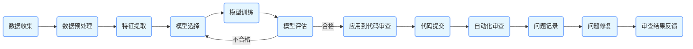

# 机器学习在代码审查中的应用:提高效率与质量

> 关键词：机器学习、代码审查、效率提升、质量保障、自动化审查

> 摘要：本文聚焦于机器学习在代码审查中的应用，旨在探讨如何利用机器学习技术提高代码审查的效率与质量。首先介绍了代码审查的背景和机器学习应用的相关情况，接着阐述了核心概念及联系，包括机器学习与代码审查的原理和架构。详细讲解了核心算法原理及具体操作步骤，通过Python代码进行示例。同时给出了相关数学模型和公式，并结合实际案例进行说明。在项目实战部分，介绍了开发环境搭建、源代码实现及解读。分析了机器学习在代码审查中的实际应用场景，推荐了学习资源、开发工具框架和相关论文著作。最后总结了未来发展趋势与挑战，提供常见问题解答及扩展阅读参考资料，以期为相关领域的研究者和从业者提供全面且深入的参考。

## 1. 背景介绍 
### 1.1 目的和范围
代码审查作为软件开发过程中的关键环节，对于保证代码质量、提高软件可靠性起着至关重要的作用。传统的代码审查主要依赖人工进行，这不仅耗费大量的时间和人力，而且容易受到审查人员主观因素的影响，导致审查结果的不一致性和不准确性。随着软件开发规模的不断扩大和复杂度的不断提高，传统的代码审查方式已经难以满足实际需求。

本文章的目的在于探讨如何利用机器学习技术来改进代码审查过程，提高审查效率和质量。范围涵盖了机器学习在代码审查中的核心概念、算法原理、数学模型、实际应用场景等方面，通过理论分析和实际案例相结合的方式，全面深入地介绍机器学习在代码审查中的应用。

### 1.2 预期读者
本文预期读者包括软件开发工程师、软件测试人员、软件项目管理人员、机器学习研究人员以及对代码审查和机器学习技术感兴趣的相关人员。对于软件开发工程师和测试人员，本文可以帮助他们了解如何利用机器学习技术优化代码审查流程，提高工作效率和代码质量；对于项目管理人员，有助于他们掌握新的技术手段，合理规划和管理项目资源；对于机器学习研究人员，提供了一个新的应用领域和研究方向；对于其他感兴趣的人员，可以作为了解相关技术的入门资料。

### 1.3 文档结构概述
本文按照以下结构进行组织：
1. **背景介绍**：介绍文章的目的、范围、预期读者和文档结构概述，同时给出相关术语的定义和解释。
2. **核心概念与联系**：阐述机器学习和代码审查的核心概念，分析它们之间的联系，并通过文本示意图和Mermaid流程图进行直观展示。
3. **核心算法原理 & 具体操作步骤**：详细讲解在代码审查中应用的机器学习核心算法原理，通过Python源代码进行详细阐述，并给出具体的操作步骤。
4. **数学模型和公式 & 详细讲解 & 举例说明**：介绍相关的数学模型和公式，对其进行详细讲解，并结合实际例子进行说明。
5. **项目实战：代码实际案例和详细解释说明**：包括开发环境搭建、源代码详细实现和代码解读，以及对代码的分析。
6. **实际应用场景**：分析机器学习在代码审查中的实际应用场景，说明其在不同场景下的作用和优势。
7. **工具和资源推荐**：推荐学习资源、开发工具框架和相关论文著作，帮助读者进一步深入学习和研究。
8. **总结：未来发展趋势与挑战**：总结机器学习在代码审查中的应用现状，分析未来发展趋势和面临的挑战。
9. **附录：常见问题与解答**：对常见问题进行解答，帮助读者解决在学习和实践过程中遇到的问题。
10. **扩展阅读 & 参考资料**：提供扩展阅读材料和参考资料，方便读者进一步查阅和学习。

### 1.4 术语表
#### 1.4.1 核心术语定义
- **代码审查**：指对源代码进行系统性检查的过程，目的是发现代码中的缺陷、提高代码质量、确保代码符合编码规范和设计要求。
- **机器学习**：是一门多领域交叉学科，涉及概率论、统计学、逼近论、凸分析、算法复杂度理论等多门学科。它专门研究计算机怎样模拟或实现人类的学习行为，以获取新的知识或技能，重新组织已有的知识结构使之不断改善自身的性能。
- **自动化代码审查**：利用自动化工具对代码进行审查，减少人工审查的工作量，提高审查效率。
- **特征提取**：从原始数据中提取出能够反映数据本质特征的信息，以便机器学习算法进行处理。
- **模型训练**：使用训练数据对机器学习模型进行训练，调整模型的参数，使其能够对数据进行准确的预测和分类。

#### 1.4.2 相关概念解释
- **静态代码分析**：在不运行代码的情况下，对代码的结构、语法、逻辑等进行分析，发现潜在的问题。
- **动态代码分析**：在代码运行过程中，对代码的行为、性能等进行分析，发现运行时的问题。
- **代码度量**：对代码的各种属性进行量化，如代码行数、复杂度、耦合度等，以便对代码质量进行评估。

#### 1.4.3 缩略词列表
- **ML**：Machine Learning（机器学习）
- **SCA**：Static Code Analysis（静态代码分析）
- **DCA**：Dynamic Code Analysis（动态代码分析）

## 2. 核心概念与联系 

### 2.1 核心概念原理

#### 2.1.1 机器学习原理
机器学习的基本原理是通过对大量数据的学习，构建一个能够对未知数据进行预测和分类的模型。其主要步骤包括数据收集、数据预处理、特征提取、模型选择、模型训练和模型评估。

数据收集是指收集与任务相关的大量数据，这些数据可以是结构化数据（如表格数据）或非结构化数据（如文本、图像等）。数据预处理是对收集到的数据进行清洗、转换和归一化等操作，以提高数据的质量和可用性。特征提取是从原始数据中提取出能够反映数据本质特征的信息，这些特征将作为机器学习模型的输入。模型选择是根据任务的特点和数据的性质，选择合适的机器学习模型，如决策树、支持向量机、神经网络等。模型训练是使用训练数据对选择的模型进行训练，调整模型的参数，使其能够对数据进行准确的预测和分类。模型评估是使用测试数据对训练好的模型进行评估，计算模型的性能指标，如准确率、召回率、F1值等，以评估模型的性能。

#### 2.1.2 代码审查原理
代码审查的基本原理是对源代码进行系统性检查，发现代码中的缺陷、提高代码质量、确保代码符合编码规范和设计要求。其主要步骤包括代码提交、审查人员分配、代码审查、问题记录和修复、审查结果反馈等。

代码提交是指开发人员将编写好的代码提交到代码仓库中。审查人员分配是指根据代码的类型、模块和复杂度等因素，分配合适的审查人员对代码进行审查。代码审查是指审查人员对提交的代码进行检查，发现代码中的问题，如语法错误、逻辑错误、性能问题、安全漏洞等。问题记录和修复是指审查人员将发现的问题记录下来，并反馈给开发人员，开发人员对问题进行修复。审查结果反馈是指审查人员将审查结果反馈给开发人员和项目管理人员，以便他们了解代码的质量和审查情况。

### 2.2 架构的文本示意图
机器学习在代码审查中的应用架构主要包括数据层、特征工程层、模型层和应用层。

数据层主要负责收集和存储与代码审查相关的数据，包括源代码、代码审查记录、代码度量数据等。特征工程层主要负责对数据进行预处理和特征提取，将原始数据转换为机器学习模型能够处理的特征向量。模型层主要负责选择和训练合适的机器学习模型，对代码进行预测和分类，如预测代码是否存在缺陷、分类代码的类型等。应用层主要负责将训练好的模型应用到实际的代码审查过程中，提供自动化的代码审查工具和服务。

### 2.3 Mermaid流程图


## 3. 核心算法原理 & 具体操作步骤 

### 3.1 核心算法原理

#### 3.1.1 决策树算法
决策树是一种基于树结构进行决策的机器学习算法。它通过对数据的特征进行递归划分，构建一个决策树模型，每个内部节点表示一个特征上的测试，每个分支表示一个测试输出，每个叶节点表示一个类别或值。

决策树的构建过程主要包括特征选择、树的生成和树的剪枝。特征选择是指选择一个最优的特征作为当前节点的划分特征，常用的特征选择准则有信息增益、信息增益比、基尼指数等。树的生成是指根据选择的特征对数据进行划分，递归地构建决策树。树的剪枝是指对生成的决策树进行简化，避免过拟合。

#### 3.1.2 支持向量机算法
支持向量机是一种二分类模型，它的基本思想是在特征空间中找到一个最优的超平面，使得不同类别的样本能够被最大程度地分开。支持向量机的核心是求解一个凸二次规划问题，通过引入拉格朗日乘子和对偶问题，将原问题转化为一个更容易求解的对偶问题。

支持向量机可以处理线性可分和线性不可分的数据。对于线性不可分的数据，可以通过引入核函数将数据映射到高维空间中，使得数据在高维空间中线性可分。常用的核函数有线性核、多项式核、高斯核等。

#### 3.1.3 神经网络算法
神经网络是一种模仿人类神经系统的机器学习算法，它由大量的神经元组成，这些神经元通过连接形成一个复杂的网络结构。神经网络的基本单元是神经元，每个神经元接收多个输入信号，通过激活函数对输入信号进行处理，输出一个信号。

神经网络的训练过程主要包括前向传播和反向传播。前向传播是指将输入数据从输入层传递到输出层，计算输出结果。反向传播是指根据输出结果和真实标签之间的误差，计算误差对每个神经元的梯度，然后根据梯度对神经元的权重进行更新。

### 3.2 具体操作步骤

#### 3.2.1 数据收集
收集与代码审查相关的数据，包括源代码、代码审查记录、代码度量数据等。可以从代码仓库、审查工具等数据源中获取数据。

#### 3.2.2 数据预处理
对收集到的数据进行清洗、转换和归一化等操作。清洗数据是指去除数据中的噪声、缺失值和重复值等。转换数据是指将数据转换为适合机器学习模型处理的格式，如将文本数据转换为数值向量。归一化数据是指将数据的特征值缩放到一个固定的范围，如[0, 1]或[-1, 1]。

#### 3.2.3 特征提取
从预处理后的数据中提取出能够反映代码质量的特征，如代码行数、复杂度、耦合度、注释率等。可以使用静态代码分析工具来提取这些特征。

#### 3.2.4 模型选择
根据任务的特点和数据的性质，选择合适的机器学习模型，如决策树、支持向量机、神经网络等。可以使用交叉验证等方法来评估不同模型的性能，选择最优的模型。

#### 3.2.5 模型训练
使用训练数据对选择的模型进行训练，调整模型的参数，使其能够对数据进行准确的预测和分类。在训练过程中，可以使用随机梯度下降等优化算法来更新模型的参数。

#### 3.2.6 模型评估
使用测试数据对训练好的模型进行评估，计算模型的性能指标，如准确率、召回率、F1值等。如果模型的性能不满足要求，可以调整模型的参数或选择其他模型进行训练。

#### 3.2.7 应用到代码审查
将训练好的模型应用到实际的代码审查过程中，对提交的代码进行预测和分类，发现代码中的潜在问题。可以将模型集成到代码审查工具中，实现自动化的代码审查。

### 3.3 Python源代码示例
```python
import pandas as pd
from sklearn.model_selection import train_test_split
from sklearn.tree import DecisionTreeClassifier
from sklearn.metrics import accuracy_score

# 数据收集和预处理
# 假设我们有一个包含代码特征和标签的数据集
data = pd.read_csv('code_review_data.csv')
X = data.drop('label', axis=1)  # 特征
y = data['label']  # 标签

# 划分训练集和测试集
X_train, X_test, y_train, y_test = train_test_split(X, y, test_size=0.2, random_state=42)

# 模型选择和训练
model = DecisionTreeClassifier()
model.fit(X_train, y_train)

# 模型评估
y_pred = model.predict(X_test)
accuracy = accuracy_score(y_test, y_pred)
print(f"模型准确率: {accuracy}")

# 应用到代码审查
new_code_features = pd.read_csv('new_code_features.csv')
prediction = model.predict(new_code_features)
print(f"新代码的预测结果: {prediction}")
```

## 4. 数学模型和公式 & 详细讲解 & 举例说明 

### 4.1 决策树算法的数学模型和公式

#### 4.1.1 信息熵
信息熵是用来衡量数据的不确定性的指标，其计算公式为：
$$H(X) = -\sum_{i=1}^{n}p(x_i)\log_2p(x_i)$$
其中，$X$ 是一个随机变量，$p(x_i)$ 是 $X$ 取值为 $x_i$ 的概率，$n$ 是 $X$ 的取值个数。

例如，假设有一个二分类问题，正类的概率为 $p$，负类的概率为 $1 - p$，则信息熵为：
$$H(X) = -p\log_2p - (1 - p)\log_2(1 - p)$$

#### 4.1.2 信息增益
信息增益是用来衡量一个特征对数据分类的贡献程度的指标，其计算公式为：
$$IG(X, A) = H(X) - H(X|A)$$
其中，$X$ 是一个随机变量，$A$ 是一个特征，$H(X)$ 是 $X$ 的信息熵，$H(X|A)$ 是在已知特征 $A$ 的条件下 $X$ 的信息熵。

例如，假设有一个数据集 $D$，特征 $A$ 有两个取值 $a_1$ 和 $a_2$，则信息增益为：
$$IG(D, A) = H(D) - \frac{|D_1|}{|D|}H(D_1) - \frac{|D_2|}{|D|}H(D_2)$$
其中，$D_1$ 和 $D_2$ 分别是特征 $A$ 取值为 $a_1$ 和 $a_2$ 的子集，$|D|$ 是数据集 $D$ 的样本数量，$|D_1|$ 和 $|D_2|$ 分别是子集 $D_1$ 和 $D_2$ 的样本数量。

### 4.2 支持向量机算法的数学模型和公式

#### 4.2.1 线性可分情况下的最优超平面
在线性可分的情况下，支持向量机的目标是找到一个最优的超平面 $w^Tx + b = 0$，使得不同类别的样本能够被最大程度地分开。这个问题可以转化为一个凸二次规划问题：
$$\min_{w, b} \frac{1}{2}||w||^2$$
$$s.t. y_i(w^Tx_i + b) \geq 1, i = 1, 2, \cdots, n$$
其中，$w$ 是超平面的法向量，$b$ 是超平面的截距，$x_i$ 是第 $i$ 个样本，$y_i$ 是第 $i$ 个样本的标签，$n$ 是样本数量。

#### 4.2.2 引入核函数
对于线性不可分的数据，可以通过引入核函数 $K(x_i, x_j)$ 将数据映射到高维空间中，使得数据在高维空间中线性可分。常用的核函数有线性核、多项式核、高斯核等。

例如，高斯核函数的计算公式为：
$$K(x_i, x_j) = \exp(-\frac{||x_i - x_j||^2}{2\sigma^2})$$
其中，$\sigma$ 是高斯核的带宽参数。

### 4.3 神经网络算法的数学模型和公式

#### 4.3.1 神经元的激活函数
神经网络的基本单元是神经元，每个神经元接收多个输入信号，通过激活函数对输入信号进行处理，输出一个信号。常用的激活函数有 sigmoid 函数、ReLU 函数等。

sigmoid 函数的计算公式为：
$$\sigma(x) = \frac{1}{1 + e^{-x}}$$

ReLU 函数的计算公式为：
$$f(x) = \max(0, x)$$

#### 4.3.2 前向传播和反向传播
神经网络的训练过程主要包括前向传播和反向传播。前向传播是指将输入数据从输入层传递到输出层，计算输出结果。反向传播是指根据输出结果和真实标签之间的误差，计算误差对每个神经元的梯度，然后根据梯度对神经元的权重进行更新。

例如，对于一个简单的两层神经网络，前向传播的计算公式为：
$$z_1 = W_1x + b_1$$
$$a_1 = \sigma(z_1)$$
$$z_2 = W_2a_1 + b_2$$
$$a_2 = \sigma(z_2)$$
其中，$x$ 是输入数据，$W_1$ 和 $W_2$ 是权重矩阵，$b_1$ 和 $b_2$ 是偏置向量，$\sigma$ 是激活函数。

反向传播的计算公式为：
$$\delta_2 = (a_2 - y) \odot \sigma'(z_2)$$
$$\delta_1 = W_2^T\delta_2 \odot \sigma'(z_1)$$
$$\frac{\partial L}{\partial W_2} = \delta_2a_1^T$$
$$\frac{\partial L}{\partial b_2} = \delta_2$$
$$\frac{\partial L}{\partial W_1} = \delta_1x^T$$
$$\frac{\partial L}{\partial b_1} = \delta_1$$
其中，$y$ 是真实标签，$L$ 是损失函数，$\odot$ 是逐元素相乘，$\sigma'$ 是激活函数的导数。

## 5. 项目实战：代码实际案例和详细解释说明 

### 5.1  开发环境搭建

#### 5.1.1 操作系统
可以选择 Windows、Linux 或 macOS 等操作系统。建议使用 Linux 系统，因为它在开发和部署方面具有更好的稳定性和兼容性。

#### 5.1.2 Python 环境
安装 Python 3.x 版本，可以从 Python 官方网站（https://www.python.org/downloads/） 下载安装包进行安装。安装完成后，可以使用以下命令验证 Python 版本：
```sh
python --version
```

#### 5.1.3 虚拟环境
为了避免不同项目之间的依赖冲突，建议使用虚拟环境来管理项目的依赖。可以使用 `venv` 或 `conda` 等工具创建虚拟环境。

使用 `venv` 创建虚拟环境的命令如下：
```sh
python -m venv myenv
```
激活虚拟环境的命令如下：
- Windows：
```sh
myenv\Scripts\activate
```
- Linux 或 macOS：
```sh
source myenv/bin/activate
```

#### 5.1.4 安装依赖库
在虚拟环境中安装项目所需的依赖库，如 `pandas`、`scikit-learn` 等。可以使用 `pip` 命令进行安装：
```sh
pip install pandas scikit-learn
```

### 5.2  源代码详细实现和代码解读

#### 5.2.1 数据准备
首先，我们需要准备一个包含代码特征和标签的数据集。假设我们的数据集存储在一个 CSV 文件中，文件名为 `code_review_data.csv`，其中包含多个代码特征列和一个标签列。

```python
import pandas as pd

# 读取数据集
data = pd.read_csv('code_review_data.csv')

# 分离特征和标签
X = data.drop('label', axis=1)  # 特征
y = data['label']  # 标签
```

#### 5.2.2 划分训练集和测试集
为了评估模型的性能，我们需要将数据集划分为训练集和测试集。可以使用 `train_test_split` 函数来实现。

```python
from sklearn.model_selection import train_test_split

# 划分训练集和测试集
X_train, X_test, y_train, y_test = train_test_split(X, y, test_size=0.2, random_state=42)
```

#### 5.2.3 模型选择和训练
选择一个合适的机器学习模型，如决策树分类器，并使用训练数据对模型进行训练。

```python
from sklearn.tree import DecisionTreeClassifier

# 选择决策树分类器
model = DecisionTreeClassifier()

# 训练模型
model.fit(X_train, y_train)
```

#### 5.2.4 模型评估
使用测试数据对训练好的模型进行评估，计算模型的准确率。

```python
from sklearn.metrics import accuracy_score

# 预测测试集
y_pred = model.predict(X_test)

# 计算准确率
accuracy = accuracy_score(y_test, y_pred)
print(f"模型准确率: {accuracy}")
```

#### 5.2.5 应用到新代码审查
将训练好的模型应用到新的代码审查中，对新代码的特征进行预测。

```python
# 读取新代码的特征
new_code_features = pd.read_csv('new_code_features.csv')

# 预测新代码
prediction = model.predict(new_code_features)
print(f"新代码的预测结果: {prediction}")
```

### 5.3  代码解读与分析

#### 5.3.1 数据准备部分
使用 `pandas` 库读取 CSV 文件中的数据集，并将特征和标签分离。`drop` 函数用于删除数据集中的标签列，得到特征矩阵 `X`，而 `label` 列则作为标签向量 `y`。

#### 5.3.2 划分训练集和测试集部分
使用 `train_test_split` 函数将数据集划分为训练集和测试集，`test_size=0.2` 表示将 20% 的数据作为测试集，`random_state=42` 用于保证每次划分的结果相同，以便于复现实验。

#### 5.3.3 模型选择和训练部分
选择 `DecisionTreeClassifier` 作为机器学习模型，并使用 `fit` 函数对模型进行训练。`fit` 函数接受训练集的特征矩阵 `X_train` 和标签向量 `y_train` 作为输入，调整模型的参数，使其能够对数据进行准确的预测和分类。

#### 5.3.4 模型评估部分
使用 `predict` 函数对测试集的特征矩阵 `X_test` 进行预测，得到预测结果 `y_pred`。然后使用 `accuracy_score` 函数计算预测结果和真实标签 `y_test` 之间的准确率。

#### 5.3.5 应用到新代码审查部分
读取新代码的特征矩阵 `new_code_features`，并使用训练好的模型对其进行预测，得到新代码的预测结果 `prediction`。

## 6. 实际应用场景 

### 6.1 开源项目代码审查
在开源项目中，由于参与开发的人员众多，代码的质量和风格可能存在较大差异。使用机器学习进行代码审查可以快速发现代码中的潜在问题，如语法错误、逻辑错误、安全漏洞等，提高代码的质量和可维护性。同时，机器学习模型可以学习不同开发者的代码风格，对代码进行风格检查，确保代码符合项目的编码规范。

### 6.2 企业内部软件开发
在企业内部的软件开发过程中，代码审查是保证软件质量的重要环节。使用机器学习进行代码审查可以减少人工审查的工作量，提高审查效率。同时，机器学习模型可以根据企业的业务需求和编码规范进行定制化训练，更好地适应企业的实际情况。

### 6.3 代码托管平台
代码托管平台如 GitHub、GitLab 等存储了大量的代码仓库。使用机器学习进行代码审查可以对平台上的代码进行自动化审查，发现潜在的问题，并及时通知开发者进行修复。这不仅可以提高代码的质量，还可以增强平台的安全性和可信度。

### 6.4 代码竞赛和评测
在代码竞赛和评测中，需要对参赛选手提交的代码进行快速、准确的评估。使用机器学习进行代码审查可以对代码的正确性、性能、复杂度等方面进行评估，为竞赛和评测提供客观、公正的评价依据。

## 7. 工具和资源推荐
### 7.1 学习资源推荐
#### 7.1.1 书籍推荐
- 《机器学习》（周志华著）：这本书是机器学习领域的经典教材，全面系统地介绍了机器学习的基本概念、算法和应用。
- 《Python 机器学习》（Sebastian Raschka 著）：本书以 Python 为工具，详细介绍了机器学习的基本算法和实践应用，适合初学者学习。
- 《深度学习》（Ian Goodfellow、Yoshua Bengio 和 Aaron Courville 著）：这本书是深度学习领域的权威著作，深入介绍了深度学习的理论和实践。

#### 7.1.2 在线课程
- Coursera 上的“Machine Learning”（Andrew Ng 教授主讲）：这是一门非常经典的机器学习课程，内容全面，讲解详细，适合初学者入门。
- edX 上的“Deep Learning Specialization”（Andrew Ng 教授主讲）：该课程深入介绍了深度学习的各个方面，包括神经网络、卷积神经网络、循环神经网络等。
- 中国大学 MOOC 上的“机器学习”（周志华教授主讲）：这是国内的一门优秀的机器学习课程，内容丰富，结合了实际案例进行讲解。

#### 7.1.3 技术博客和网站
- Medium：这是一个技术博客平台，上面有很多关于机器学习和代码审查的优秀文章。
- Towards Data Science：专注于数据科学和机器学习领域的技术博客，提供了很多实用的教程和案例。
- GitHub：不仅是一个代码托管平台，上面也有很多关于机器学习和代码审查的开源项目和学习资源。

### 7.2 开发工具框架推荐
#### 7.2.1 IDE和编辑器
- PyCharm：一款专业的 Python 集成开发环境，提供了丰富的代码编辑、调试和版本控制等功能。
- Visual Studio Code：一款轻量级的代码编辑器，支持多种编程语言，并且有丰富的插件可以扩展功能。
- Jupyter Notebook：一个交互式的开发环境，适合进行数据探索、模型训练和结果展示。

#### 7.2.2 调试和性能分析工具
- PDB：Python 自带的调试工具，可以帮助开发者定位代码中的问题。
- Py-spy：一个用于分析 Python 代码性能的工具，可以找出代码中的性能瓶颈。
- TensorBoard：一个用于可视化深度学习模型训练过程的工具，可以帮助开发者监控模型的训练进度和性能。

#### 7.2.3 相关框架和库
- Scikit-learn：一个简单易用的机器学习库，提供了多种机器学习算法和工具，适合初学者使用。
- TensorFlow：一个开源的深度学习框架，广泛应用于图像识别、自然语言处理等领域。
- PyTorch：另一个流行的深度学习框架，具有动态图的优势，适合研究和开发。

### 7.3 相关论文著作推荐
#### 7.3.1 经典论文
- “A Unified Approach to Interpreting Model Predictions”（Scott Lundberg 和 Su-In Lee 著）：提出了 SHAP 值的概念，用于解释机器学习模型的预测结果。
- “Gradient-Based Learning Applied to Document Recognition”（Yann LeCun、Léon Bottou、Yoshua Bengio 和 Patrick Haffner 著）：介绍了卷积神经网络在手写数字识别中的应用，是深度学习领域的经典论文。
- “Attention Is All You Need”（Ashish Vaswani 等人著）：提出了 Transformer 模型，在自然语言处理领域取得了巨大的成功。

#### 7.3.2 最新研究成果
- 可以关注 NeurIPS、ICML、CVPR 等顶级机器学习和人工智能会议的论文，了解最新的研究成果。
- arXiv 预印本平台上也有很多关于机器学习和代码审查的最新研究论文。

#### 7.3.3 应用案例分析
- 可以参考一些知名科技公司的技术博客，如 Google AI Blog、Facebook AI Research 等，了解他们在机器学习和代码审查方面的应用案例。
- 一些开源项目的文档和报告中也会介绍机器学习在代码审查中的应用实践。

## 8. 总结：未来发展趋势与挑战

### 8.1 未来发展趋势

#### 8.1.1 自动化程度不断提高
未来，机器学习在代码审查中的应用将越来越自动化。通过不断优化机器学习模型和算法，提高模型的准确性和泛化能力，可以实现对代码的自动审查和问题定位，减少人工干预，提高审查效率。

#### 8.1.2 与其他技术的融合
机器学习将与其他技术如自然语言处理、计算机视觉等进行深度融合。例如，利用自然语言处理技术对代码注释和文档进行分析，辅助代码审查；利用计算机视觉技术对代码的可视化表示进行分析，发现潜在的问题。

#### 8.1.3 个性化和定制化
根据不同的项目需求和开发者习惯，提供个性化和定制化的代码审查服务。机器学习模型可以学习不同项目的编码规范和风格，为每个项目提供针对性的审查建议。

#### 8.1.4 实时审查
实现对代码的实时审查，在开发者编写代码的过程中及时发现问题并给出提示。这将大大提高代码的质量和开发效率。

### 8.2 挑战

#### 8.2.1 数据质量和标注问题
机器学习模型的训练需要大量高质量的数据，并且这些数据需要进行准确的标注。在代码审查领域，获取高质量的代码数据和标注数据是一个挑战。同时，代码数据的多样性和复杂性也增加了数据处理和标注的难度。

#### 8.2.2 模型可解释性问题
机器学习模型尤其是深度学习模型通常是黑盒模型，其决策过程难以解释。在代码审查中，开发者需要了解模型为什么会给出某个审查建议，因此提高模型的可解释性是一个重要的挑战。

#### 8.2.3 性能和效率问题
随着代码规模的不断扩大和复杂度的不断提高，机器学习模型的计算量也会相应增加。如何提高模型的性能和效率，在保证审查准确性的前提下，快速完成代码审查任务，是一个需要解决的问题。

#### 8.2.4 安全和隐私问题
代码中可能包含敏感信息，如商业机密、用户隐私等。在使用机器学习进行代码审查时，需要确保数据的安全和隐私，防止敏感信息泄露。

## 9. 附录：常见问题与解答

### 9.1 机器学习在代码审查中能发现所有的问题吗？
不能。机器学习在代码审查中可以发现很多常见的问题，如语法错误、逻辑错误、安全漏洞等，但不能发现所有的问题。一些复杂的业务逻辑问题和特定领域的问题可能需要人工审查才能发现。

### 9.2 如何选择合适的机器学习模型进行代码审查？
选择合适的机器学习模型需要考虑多个因素，如数据的特点、任务的复杂度、模型的性能等。可以使用交叉验证等方法对不同的模型进行评估，选择性能最优的模型。同时，也可以根据实际情况对模型进行调优和改进。

### 9.3 机器学习模型的训练需要多长时间？
机器学习模型的训练时间取决于多个因素，如数据的规模、模型的复杂度、计算资源等。一般来说，数据规模越大、模型越复杂，训练时间就越长。可以使用并行计算、分布式计算等技术来加速模型的训练过程。

### 9.4 如何保证机器学习模型的准确性和可靠性？
可以通过以下方法来保证机器学习模型的准确性和可靠性：
- 使用高质量的数据进行训练，确保数据的准确性和完整性。
- 对数据进行充分的预处理和特征工程，提取出有价值的特征。
- 选择合适的机器学习模型，并对模型进行调优和改进。
- 使用交叉验证等方法对模型进行评估，确保模型的泛化能力。
- 定期对模型进行更新和维护，以适应新的数据和任务。

## 10. 扩展阅读 & 参考资料

### 10.1 扩展阅读
- 《代码大全》（Steve McConnell 著）：这本书详细介绍了软件开发的各个方面，包括代码设计、编码规范、代码审查等，是软件开发领域的经典著作。
- 《重构：改善既有代码的设计》（Martin Fowler 著）：介绍了重构的原则、方法和技巧，对于提高代码的质量和可维护性有很大的帮助。
- 《Python 数据分析实战》（Aurélien Géron 著）：以 Python 为工具，介绍了数据分析的基本方法和实践应用，适合对数据处理和分析感兴趣的读者。

### 10.2 参考资料
- 相关的学术论文和研究报告，可以从学术数据库如 IEEE Xplore、ACM Digital Library 等获取。
- 开源项目的文档和代码，可以从 GitHub、GitLab 等代码托管平台获取。
- 技术博客和论坛，如 Stack Overflow、Reddit 等，可以获取最新的技术信息和解决方案。