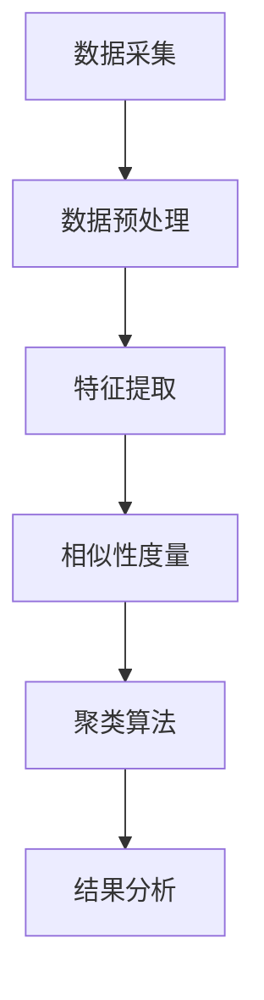

# 机器学习在金融时间序列聚类中的应用

> 关键词：机器学习、金融时间序列、聚类算法、数据挖掘、风险管理、投资决策、模式识别

> 摘要：本文深入探讨了机器学习在金融时间序列聚类中的应用。首先介绍了金融时间序列聚类的背景知识，包括目的、预期读者等。接着阐述了核心概念及联系，详细讲解了相关的核心算法原理并给出Python代码示例，同时介绍了涉及的数学模型和公式。通过项目实战，展示了如何搭建开发环境、实现源代码并进行解读分析。探讨了该技术在金融领域的实际应用场景，推荐了学习资源、开发工具框架以及相关论文著作。最后总结了未来发展趋势与挑战，提供了常见问题解答和扩展阅读参考资料，旨在帮助读者全面了解机器学习在金融时间序列聚类中的应用，为金融领域的数据分析和决策提供有力支持。

## 1. 背景介绍 
### 1.1 目的和范围
金融时间序列数据包含了大量关于金融市场的信息，如股票价格、汇率、利率等随时间变化的数据。对这些数据进行聚类分析，可以帮助投资者、金融分析师和风险管理者发现数据中的潜在模式和规律，从而做出更明智的决策。本文章的目的在于详细介绍机器学习在金融时间序列聚类中的应用，范围涵盖了从基础概念到实际应用的各个方面，包括核心算法原理、数学模型、项目实战以及未来发展趋势等。

### 1.2 预期读者
本文预期读者包括金融领域的从业者，如投资经理、金融分析师、风险管理者等，他们希望通过机器学习技术更好地分析金融时间序列数据；也包括对机器学习和金融数据分析感兴趣的研究人员和学生，希望从理论和实践的角度深入了解相关知识；还包括软件开发人员，他们可能需要开发相关的金融数据分析工具。

### 1.3 文档结构概述
本文首先介绍背景知识，包括目的、预期读者和文档结构概述等内容。接着阐述核心概念与联系，通过文本示意图和Mermaid流程图展示相关原理和架构。然后详细讲解核心算法原理并给出Python源代码，介绍数学模型和公式并举例说明。通过项目实战，展示开发环境搭建、源代码实现和代码解读分析。探讨实际应用场景，推荐学习资源、开发工具框架和相关论文著作。最后总结未来发展趋势与挑战，提供常见问题解答和扩展阅读参考资料。

### 1.4 术语表
#### 1.4.1 核心术语定义
- **金融时间序列**：是指按时间顺序排列的金融数据，如股票价格、汇率、利率等随时间变化的数据序列。
- **聚类分析**：是指将数据对象分组成为多个类或簇的过程，使得同一簇中的对象之间具有较高的相似度，而不同簇中的对象之间具有较高的差异度。
- **机器学习**：是一门多领域交叉学科，涉及概率论、统计学、逼近论、凸分析、算法复杂度理论等多门学科。它专门研究计算机怎样模拟或实现人类的学习行为，以获取新的知识或技能，重新组织已有的知识结构使之不断改善自身的性能。
- **时间序列相似性度量**：用于衡量两个时间序列之间的相似程度的方法，常见的有欧几里得距离、动态时间规整距离等。

#### 1.4.2 相关概念解释
- **数据挖掘**：是指从大量的数据中通过算法搜索隐藏于其中信息的过程。数据挖掘通常与计算机科学有关，并通过统计、在线分析处理、情报检索、机器学习、专家系统（依靠过去的经验法则）和模式识别等诸多方法来实现上述目标。
- **模式识别**：是指对表征事物或现象的各种形式的（数值的、文字的和逻辑关系的）信息进行处理和分析，以对事物或现象进行描述、辨认、分类和解释的过程，是信息科学和人工智能的重要组成部分。
- **风险管理**：是指如何在项目或者企业一个肯定有风险的环境里把风险可能造成的不良影响减至最低的管理过程。风险管理对现代企业而言十分重要。

#### 1.4.3 缩略词列表
- **K-Means**：K均值聚类算法（K-Means Clustering Algorithm）
- **DBSCAN**：基于密度的空间聚类应用（Density-Based Spatial Clustering of Applications with Noise）
- **DTW**：动态时间规整（Dynamic Time Warping）

## 2. 核心概念与联系 

### 核心概念原理
金融时间序列聚类的核心目标是将相似的金融时间序列划分到同一类中，以便发现数据中的潜在模式和规律。机器学习算法在这个过程中起到了关键作用，通过对金融时间序列的特征提取和相似性度量，将数据进行聚类。

常见的聚类算法包括K-Means、DBSCAN等。K-Means算法是一种基于距离的聚类算法，它通过迭代的方式将数据点划分到K个簇中，使得每个数据点到其所属簇的质心的距离之和最小。DBSCAN算法是一种基于密度的聚类算法，它通过定义数据点的密度来发现簇，能够处理任意形状的簇，并且可以识别出噪声点。

在进行金融时间序列聚类时，需要先对数据进行预处理，包括数据清洗、归一化等操作。然后选择合适的相似性度量方法，如欧几里得距离、动态时间规整距离等，来衡量时间序列之间的相似程度。最后使用聚类算法对数据进行聚类，并对聚类结果进行分析和解释。

### 架构的文本示意图
金融时间序列聚类的架构主要包括以下几个部分：
1. **数据采集**：从金融市场数据源中采集所需的金融时间序列数据，如股票价格、汇率等。
2. **数据预处理**：对采集到的数据进行清洗、归一化等操作，以提高数据的质量和可用性。
3. **特征提取**：从预处理后的数据中提取有用的特征，如均值、方差、趋势等。
4. **相似性度量**：选择合适的相似性度量方法，衡量时间序列之间的相似程度。
5. **聚类算法**：使用聚类算法对数据进行聚类，得到聚类结果。
6. **结果分析**：对聚类结果进行分析和解释，发现数据中的潜在模式和规律。

### Mermaid流程图


## 3. 核心算法原理 & 具体操作步骤 

### K-Means算法原理
K-Means算法是一种无监督学习算法，其基本思想是通过迭代的方式将数据点划分到K个簇中，使得每个数据点到其所属簇的质心的距离之和最小。具体步骤如下：
1. **初始化**：随机选择K个数据点作为初始的质心。
2. **分配**：将每个数据点分配到距离其最近的质心所在的簇中。
3. **更新**：计算每个簇的新质心。
4. **重复**：重复步骤2和步骤3，直到质心不再发生变化或达到最大迭代次数。

### Python代码实现
```python
import numpy as np

def kmeans(X, K, max_iterations=100):
    # 初始化质心
    centroids = X[np.random.choice(X.shape[0], K, replace=False)]
    
    for _ in range(max_iterations):
        # 分配数据点到最近的质心
        distances = np.array([np.linalg.norm(X - centroid, axis=1) for centroid in centroids])
        labels = np.argmin(distances, axis=0)
        
        # 更新质心
        new_centroids = np.array([X[labels == k].mean(axis=0) for k in range(K)])
        
        # 判断质心是否不再变化
        if np.allclose(centroids, new_centroids):
            break
        
        centroids = new_centroids
    
    return labels, centroids
```

### DBSCAN算法原理
DBSCAN算法是一种基于密度的聚类算法，它通过定义数据点的密度来发现簇，能够处理任意形状的簇，并且可以识别出噪声点。具体步骤如下：
1. **定义参数**：定义邻域半径`eps`和最小点数`minPts`。
2. **遍历数据点**：对于每个数据点，计算其邻域内的点数。
3. **核心点判断**：如果一个数据点的邻域内的点数大于等于`minPts`，则该数据点为核心点。
4. **簇生成**：从一个核心点开始，将其邻域内的所有点加入到同一个簇中，然后递归地将邻域内的核心点的邻域内的点也加入到该簇中，直到没有新的点可以加入。
5. **噪声点判断**：如果一个数据点不属于任何一个簇，则该数据点为噪声点。

### Python代码实现
```python
from sklearn.cluster import DBSCAN

def dbscan(X, eps=0.5, minPts=5):
    db = DBSCAN(eps=eps, min_samples=minPts).fit(X)
    labels = db.labels_
    return labels
```

## 4. 数学模型和公式 & 详细讲解 & 举例说明 

### 欧几里得距离
欧几里得距离是最常用的相似性度量方法之一，它衡量的是两个数据点之间的直线距离。对于两个时间序列 $X=(x_1,x_2,\cdots,x_n)$ 和 $Y=(y_1,y_2,\cdots,y_n)$，欧几里得距离的计算公式为：
$$d(X,Y)=\sqrt{\sum_{i=1}^{n}(x_i - y_i)^2}$$

**详细讲解**：欧几里得距离的计算基于每个时间点上的数据值的差异，它假设时间序列的时间点是一一对应的。这种方法简单直观，计算效率高，但对于时间序列的局部变化比较敏感。

**举例说明**：假设有两个时间序列 $X=(1,2,3)$ 和 $Y=(4,5,6)$，则它们的欧几里得距离为：
$$d(X,Y)=\sqrt{(1 - 4)^2+(2 - 5)^2+(3 - 6)^2}=\sqrt{9 + 9 + 9}=\sqrt{27}\approx5.2$$

### 动态时间规整距离
动态时间规整（DTW）距离是一种专门用于衡量时间序列相似性的方法，它可以处理时间序列的时间轴上的伸缩和扭曲。对于两个时间序列 $X=(x_1,x_2,\cdots,x_n)$ 和 $Y=(y_1,y_2,\cdots,y_m)$，DTW距离的计算公式为：
$$DTW(X,Y)=\min_{p}\sum_{k=1}^{L}d(x_{i_k},y_{j_k})$$
其中，$p=( (i_1,j_1),(i_2,j_2),\cdots,(i_L,j_L) )$ 是一个路径，满足 $i_1 = 1, j_1 = 1, i_L = n, j_L = m$，并且 $(i_{k+1},j_{k+1})$ 只能是 $(i_k + 1,j_k)$、$(i_k,j_k + 1)$ 或 $(i_k + 1,j_k + 1)$ 中的一个。

**详细讲解**：DTW距离通过寻找一条最优的路径，使得两个时间序列在该路径上的对应点的距离之和最小。这种方法可以处理时间序列的时间轴上的伸缩和扭曲，更适合用于金融时间序列的相似性度量。

**举例说明**：假设有两个时间序列 $X=(1,2,3)$ 和 $Y=(2,3,4)$，使用DTW算法计算它们的距离。首先构建一个代价矩阵 $D$，其中 $D[i,j]$ 表示 $X$ 的前 $i$ 个点和 $Y$ 的前 $j$ 个点的最小累积距离。然后通过动态规划的方法填充代价矩阵，最后得到DTW距离为 $1$。

## 5. 项目实战：代码实际案例和详细解释说明 

### 5.1  开发环境搭建
- **Python环境**：建议使用Python 3.7及以上版本。可以从Python官方网站（https://www.python.org/downloads/）下载安装。
- **必要的库**：需要安装`numpy`、`pandas`、`matplotlib`、`scikit-learn`等库。可以使用以下命令进行安装：
```sh
pip install numpy pandas matplotlib scikit-learn
```

### 5.2  源代码详细实现和代码解读
```python
import numpy as np
import pandas as pd
import matplotlib.pyplot as plt
from sklearn.cluster import KMeans
from sklearn.preprocessing import StandardScaler

# 读取金融时间序列数据
data = pd.read_csv('financial_time_series.csv')

# 数据预处理
# 提取需要的特征列
features = data[['feature1', 'feature2', 'feature3']]

# 数据归一化
scaler = StandardScaler()
scaled_features = scaler.fit_transform(features)

# 使用K-Means算法进行聚类
kmeans = KMeans(n_clusters=3, random_state=42)
labels = kmeans.fit_predict(scaled_features)

# 将聚类结果添加到原始数据中
data['cluster'] = labels

# 可视化聚类结果
plt.scatter(data['feature1'], data['feature2'], c=data['cluster'], cmap='viridis')
plt.xlabel('Feature 1')
plt.ylabel('Feature 2')
plt.title('Clustering Results')
plt.show()
```

### 5.3  代码解读与分析
1. **数据读取**：使用`pandas`库的`read_csv`函数读取金融时间序列数据。
2. **数据预处理**：提取需要的特征列，并使用`StandardScaler`进行数据归一化，使得不同特征具有相同的尺度。
3. **聚类算法**：使用`KMeans`算法进行聚类，设置聚类的数量为3。
4. **结果可视化**：使用`matplotlib`库的`scatter`函数将聚类结果可视化，不同的簇用不同的颜色表示。

通过以上步骤，我们可以对金融时间序列数据进行聚类分析，并直观地观察到聚类结果。

## 6. 实际应用场景 
### 投资组合优化
通过对金融时间序列进行聚类，可以将具有相似走势的股票或其他金融资产划分到同一类中。投资者可以根据聚类结果构建投资组合，选择不同类中的资产进行投资，以降低投资风险。例如，如果某些股票被划分到同一类中，说明它们的价格走势具有较高的相关性，投资者可以避免同时投资过多这类股票，而是选择不同类中的股票进行组合，以实现投资组合的多样化。

### 风险管理
金融机构可以利用聚类分析来识别潜在的风险。通过对不同金融产品的时间序列数据进行聚类，可以发现具有相似风险特征的产品类。对于这些类中的产品，金融机构可以采取更加针对性的风险管理措施。例如，如果某一类金融产品的价格波动具有相似的模式，并且这种模式与市场风险相关，金融机构可以加强对这类产品的风险监测和控制。

### 市场趋势分析
聚类分析可以帮助分析师发现金融市场中的潜在趋势。通过对不同股票或其他金融资产的时间序列数据进行聚类，可以识别出具有相似趋势的资产类。分析师可以根据这些趋势来预测市场的未来走势，为投资决策提供参考。例如，如果某一类股票在一段时间内呈现出相似的上涨趋势，分析师可以进一步研究这些股票的基本面和市场环境，以判断这种趋势是否会持续。

### 客户细分
金融机构可以根据客户的交易行为时间序列数据进行聚类，将客户划分到不同的类别中。不同类别的客户具有不同的投资偏好和风险承受能力，金融机构可以根据这些特点为客户提供个性化的金融服务。例如，对于风险偏好较高的客户，金融机构可以推荐一些高风险高收益的投资产品；对于风险偏好较低的客户，金融机构可以推荐一些稳健型的投资产品。

## 7. 工具和资源推荐
### 7.1 学习资源推荐
#### 7.1.1 书籍推荐
- 《Python机器学习》：这本书详细介绍了Python在机器学习中的应用，包括各种机器学习算法的原理和实现，以及如何使用Python进行数据处理和模型评估。
- 《时间序列分析及其应用：R语言实例》：本书系统地介绍了时间序列分析的基本理论和方法，并通过R语言进行实例演示，对于理解金融时间序列分析非常有帮助。
- 《金融时间序列分析》：这本书专门介绍了金融时间序列分析的理论和方法，包括各种模型的建立和应用，是学习金融时间序列分析的经典教材。

#### 7.1.2 在线课程
- Coursera上的“机器学习”课程：由斯坦福大学的Andrew Ng教授授课，是学习机器学习的经典课程，涵盖了机器学习的基本概念、算法和应用。
- edX上的“金融数据分析与机器学习”课程：该课程结合了金融领域的实际问题，介绍了如何使用机器学习方法进行金融数据分析，对于理解机器学习在金融领域的应用非常有帮助。
- 中国大学MOOC上的“时间序列分析”课程：由国内知名高校的教授授课，系统地介绍了时间序列分析的理论和方法，适合初学者学习。

#### 7.1.3 技术博客和网站
- Medium：这是一个技术博客平台，上面有很多关于机器学习和金融数据分析的文章，可以帮助读者了解最新的技术动态和研究成果。
- Towards Data Science：这是一个专注于数据科学和机器学习的网站，上面有很多高质量的技术文章和教程，对于学习机器学习和金融时间序列分析非常有帮助。
- Kaggle：这是一个数据科学竞赛平台，上面有很多金融时间序列分析的数据集和竞赛项目，可以帮助读者提高实践能力。

### 7.2 开发工具框架推荐
#### 7.2.1 IDE和编辑器
- PyCharm：这是一款专门为Python开发设计的集成开发环境，具有强大的代码编辑、调试和项目管理功能，适合开发机器学习项目。
- Jupyter Notebook：这是一个交互式的开发环境，可以在浏览器中编写和运行Python代码，并且可以实时显示代码的运行结果，非常适合进行数据分析和模型实验。
- Visual Studio Code：这是一款轻量级的代码编辑器，支持多种编程语言，并且有丰富的插件可以扩展其功能，适合快速开发和调试机器学习代码。

#### 7.2.2 调试和性能分析工具
- Py-Spy：这是一个Python性能分析工具，可以实时监测Python程序的CPU使用情况和函数调用栈，帮助开发者找出性能瓶颈。
- Memory Profiler：这是一个Python内存分析工具，可以帮助开发者监测Python程序的内存使用情况，找出内存泄漏的问题。
- TensorBoard：这是一个深度学习可视化工具，可以帮助开发者可视化模型的训练过程和性能指标，方便进行模型调优。

#### 7.2.3 相关框架和库
- Scikit-learn：这是一个Python机器学习库，提供了各种机器学习算法的实现，包括聚类算法、分类算法、回归算法等，非常适合初学者使用。
- TensorFlow：这是一个开源的深度学习框架，提供了高效的计算能力和丰富的工具集，适合开发复杂的机器学习模型。
- PyTorch：这是另一个开源的深度学习框架，具有简洁的API和动态计算图的特点，适合快速开发和实验机器学习模型。

### 7.3 相关论文著作推荐
#### 7.3.1 经典论文
- “A Survey of Clustering Algorithms”：这篇论文对各种聚类算法进行了全面的综述，包括算法的原理、优缺点和应用场景，是学习聚类算法的经典文献。
- “Dynamic Time Warping Algorithm Review”：这篇论文对动态时间规整算法进行了详细的介绍和分析，包括算法的原理、复杂度和应用，对于理解时间序列相似性度量非常有帮助。
- “Financial Time Series Forecasting Using Machine Learning Techniques”：这篇论文介绍了如何使用机器学习技术进行金融时间序列预测，包括各种模型的建立和评估，对于理解机器学习在金融时间序列分析中的应用非常有帮助。

#### 7.3.2 最新研究成果
- 每年的ACM SIGKDD会议、IEEE ICDM会议等都会发表很多关于机器学习和数据挖掘的最新研究成果，可以关注这些会议的论文集，了解最新的技术动态。
- 一些顶级学术期刊，如《Journal of Machine Learning Research》、《IEEE Transactions on Pattern Analysis and Machine Intelligence》等，也会发表很多关于机器学习和金融数据分析的高质量论文，可以定期关注这些期刊的最新文章。

#### 7.3.3 应用案例分析
- 《应用数据挖掘：模式、趋势和应用案例》：这本书介绍了数据挖掘在各个领域的应用案例，包括金融领域。通过阅读这些案例，可以了解如何将机器学习和数据挖掘技术应用到实际的金融问题中。
- Kaggle上的一些金融时间序列分析的竞赛项目和解决方案，也可以作为应用案例进行学习和参考。

## 8. 总结：未来发展趋势与挑战
### 未来发展趋势
- **多模态数据融合**：未来的金融时间序列聚类可能会结合更多类型的数据，如文本数据、图像数据等，以获取更全面的信息。例如，将新闻文本中的情感分析结果与股票价格时间序列数据相结合，进行更准确的聚类分析。
- **深度学习的应用**：深度学习在处理复杂数据和挖掘潜在模式方面具有强大的能力。未来可能会有更多的深度学习模型应用于金融时间序列聚类，如循环神经网络（RNN）、长短期记忆网络（LSTM）等，以更好地捕捉时间序列的动态变化。
- **实时聚类**：随着金融市场的快速变化，实时聚类分析的需求越来越高。未来的算法和技术将更加注重实时性，能够在短时间内对金融时间序列数据进行聚类分析，为投资者和金融机构提供及时的决策支持。
- **可解释性增强**：机器学习模型的可解释性一直是一个重要的问题。未来的研究将更加关注如何提高金融时间序列聚类模型的可解释性，使得分析师和投资者能够更好地理解聚类结果背后的原因和意义。

### 挑战
- **数据质量问题**：金融时间序列数据通常存在噪声、缺失值等问题，这些问题会影响聚类结果的准确性。如何有效地处理这些数据质量问题，是一个需要解决的挑战。
- **计算复杂度**：一些复杂的聚类算法和相似性度量方法，如动态时间规整距离，计算复杂度较高。在处理大规模金融时间序列数据时，如何提高算法的效率，是一个亟待解决的问题。
- **模型选择和调优**：不同的聚类算法和参数设置会对聚类结果产生很大的影响。如何选择合适的模型和参数，以获得最优的聚类效果，是一个具有挑战性的任务。
- **市场变化的适应性**：金融市场是动态变化的，市场环境和数据特征可能会随时发生变化。如何使聚类模型能够适应市场的变化，保持良好的性能，是一个需要研究的问题。

## 9. 附录：常见问题与解答
### 1. 如何选择合适的聚类算法？
选择合适的聚类算法需要考虑多个因素，如数据的特点、聚类的目的、计算复杂度等。如果数据具有明显的球形结构，K-Means算法可能是一个不错的选择；如果数据具有任意形状的簇，并且存在噪声点，DBSCAN算法可能更合适。此外，还可以根据数据的规模和计算资源来选择算法，对于大规模数据，需要选择计算效率高的算法。

### 2. 如何确定聚类的数量？
确定聚类的数量是一个比较困难的问题，常见的方法包括手肘法、轮廓系数法等。手肘法是通过绘制不同聚类数量下的误差平方和（SSE）与聚类数量的关系图，找到图中的“手肘”点，该点对应的聚类数量即为最优的聚类数量。轮廓系数法是通过计算每个样本的轮廓系数，选择轮廓系数最大的聚类数量作为最优的聚类数量。

### 3. 如何处理金融时间序列数据中的缺失值？
处理金融时间序列数据中的缺失值的方法有很多种，常见的方法包括删除缺失值、插值法、填充法等。如果缺失值的比例较小，可以直接删除包含缺失值的样本；如果缺失值的比例较大，可以使用插值法，如线性插值、样条插值等，来填充缺失值；也可以使用填充法，如用均值、中位数等统计量来填充缺失值。

### 4. 如何评估聚类结果的质量？
评估聚类结果的质量可以使用多种指标，如轮廓系数、Calinski-Harabasz指数、Davies-Bouldin指数等。轮廓系数衡量的是每个样本与其所属簇的紧密程度和与其他簇的分离程度，值越接近1表示聚类效果越好。Calinski-Harabasz指数衡量的是簇间的离散程度和簇内的紧凑程度，值越大表示聚类效果越好。Davies-Bouldin指数衡量的是簇间的相似度，值越小表示聚类效果越好。

## 10. 扩展阅读 & 参考资料
### 扩展阅读
- 《机器学习实战》：这本书通过大量的实际案例介绍了机器学习的各种算法和应用，对于提高实践能力非常有帮助。
- 《数据挖掘：概念与技术》：这本书系统地介绍了数据挖掘的基本概念、算法和应用，对于深入理解数据挖掘技术非常有帮助。
- 《深度学习》：这本书由深度学习领域的三位领军人物Ian Goodfellow、Yoshua Bengio和Aaron Courville撰写，是深度学习领域的经典教材，对于学习深度学习技术非常有帮助。

### 参考资料
- Scikit-learn官方文档：https://scikit-learn.org/stable/
- TensorFlow官方文档：https://www.tensorflow.org/
- PyTorch官方文档：https://pytorch.org/
- Pandas官方文档：https://pandas.pydata.org/
- Numpy官方文档：https://numpy.org/