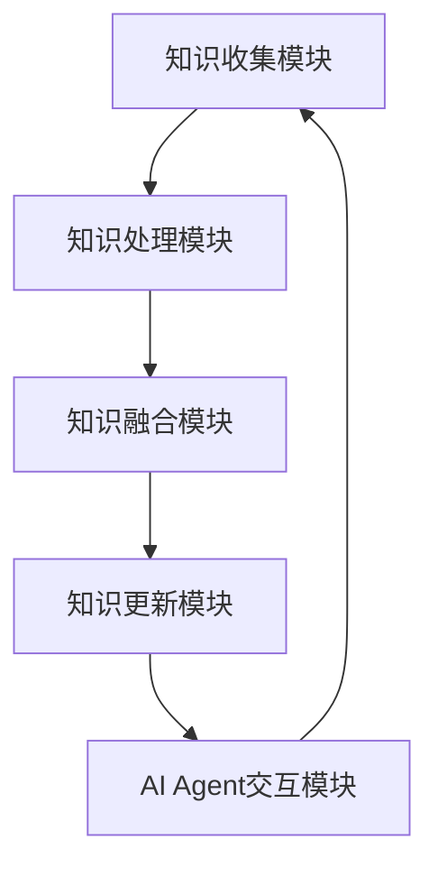

# 构建AI Agent的动态知识图谱更新系统

> 关键词：AI Agent、动态知识图谱、更新系统、知识表示、信息融合

> 摘要：本文聚焦于构建AI Agent的动态知识图谱更新系统。随着人工智能技术的发展，知识图谱作为一种重要的知识表示方式，对于AI Agent的智能决策和推理起着关键作用。然而，现实世界的知识是不断变化和更新的，因此需要一个动态的更新系统来确保知识图谱的时效性和准确性。文章深入探讨了该系统的核心概念、算法原理、数学模型，通过项目实战展示了系统的实现过程，分析了实际应用场景，并推荐了相关的工具和资源，最后对未来发展趋势与挑战进行了总结。

## 1. 背景介绍 
### 1.1 目的和范围
在当今信息爆炸的时代，知识的更新速度极快。AI Agent在执行各种任务时，需要依赖准确和最新的知识来做出合理的决策。知识图谱作为一种结构化的知识表示方式，能够有效地组织和管理知识。然而，传统的知识图谱往往是静态的，难以适应知识的动态变化。因此，构建AI Agent的动态知识图谱更新系统的目的在于实现知识图谱的实时更新，使AI Agent能够及时获取和利用最新的知识，提高其智能水平和决策能力。

本系统的范围涵盖了知识的收集、处理、融合和更新等多个环节，旨在建立一个完整的动态知识图谱更新体系，适用于各种类型的AI Agent，包括智能客服、智能助手、自主机器人等。

### 1.2 预期读者
本文的预期读者包括人工智能领域的研究人员、开发者、软件架构师、CTO等专业人士，以及对知识图谱和AI Agent技术感兴趣的学生和爱好者。对于希望深入了解动态知识图谱更新系统的原理和实现方法，以及如何将其应用于实际项目的读者，本文将提供有价值的参考。

### 1.3 文档结构概述
本文将按照以下结构进行组织：首先介绍背景知识，包括目的、预期读者和文档结构概述等；接着阐述核心概念与联系，包括动态知识图谱、AI Agent等概念的原理和架构；然后详细讲解核心算法原理和具体操作步骤，并给出Python源代码；之后介绍数学模型和公式，并进行详细讲解和举例说明；通过项目实战展示系统的实现过程，包括开发环境搭建、源代码实现和代码解读；分析实际应用场景；推荐相关的工具和资源；总结未来发展趋势与挑战；提供常见问题与解答的附录；最后给出扩展阅读和参考资料。

### 1.4 术语表
#### 1.4.1 核心术语定义
- **AI Agent**：人工智能代理，是一种能够感知环境、做出决策并执行行动的智能实体。
- **知识图谱**：一种以图的形式表示知识的结构化数据模型，由实体、关系和属性组成。
- **动态知识图谱**：能够实时反映知识的变化和更新的知识图谱。
- **知识表示**：将知识以计算机能够理解和处理的方式进行表示的方法。
- **信息融合**：将来自不同来源的信息进行整合和处理，以获得更全面和准确的知识。

#### 1.4.2 相关概念解释
- **实体**：知识图谱中的对象，可以是具体的事物（如人、地点、物品等），也可以是抽象的概念（如事件、组织等）。
- **关系**：描述实体之间的联系，如“属于”、“位于”、“具有”等。
- **属性**：描述实体的特征和性质，如“年龄”、“颜色”、“价格”等。
- **本体**：对领域内概念和关系的一种规范和定义，用于统一知识的表示和理解。

#### 1.4.3 缩略词列表
- **KG**：Knowledge Graph，知识图谱
- **AI**：Artificial Intelligence，人工智能

## 2. 核心概念与联系 

### 核心概念原理
#### 动态知识图谱
动态知识图谱是在传统知识图谱的基础上发展而来的，它不仅能够表示静态的知识，还能够实时反映知识的变化和更新。动态知识图谱的核心思想是将时间维度引入到知识图谱中，通过记录知识的产生、更新和失效时间，实现对知识的动态管理。

动态知识图谱的结构通常包括实体、关系、属性和时间戳。实体表示现实世界中的对象，关系描述实体之间的联系，属性描述实体的特征，时间戳记录知识的生效时间和失效时间。通过时间戳，我们可以跟踪知识的演变过程，确保知识图谱中的知识始终是最新和准确的。

#### AI Agent
AI Agent是一种能够感知环境、做出决策并执行行动的智能实体。它通常由感知模块、决策模块和执行模块组成。感知模块用于获取环境信息，决策模块根据感知到的信息和内部的知识进行推理和决策，执行模块根据决策结果执行相应的行动。

AI Agent的智能水平取决于其内部的知识和推理能力。知识图谱作为一种结构化的知识表示方式，能够为AI Agent提供丰富的知识支持，帮助其更好地理解环境和做出决策。

### 架构的文本示意图
动态知识图谱更新系统的架构主要包括以下几个部分：
1. **知识收集模块**：负责从各种数据源中收集知识，包括文本、图像、视频等。
2. **知识处理模块**：对收集到的知识进行预处理，如实体识别、关系抽取、属性提取等。
3. **知识融合模块**：将处理后的知识与现有的知识图谱进行融合，解决知识冲突和不一致性问题。
4. **知识更新模块**：根据融合后的知识，对知识图谱进行更新，包括新增实体、关系和属性，以及更新已有知识的时间戳。
5. **AI Agent交互模块**：为AI Agent提供知识查询和推理服务，使AI Agent能够利用知识图谱中的知识进行决策和行动。

### Mermaid流程图


## 3. 核心算法原理 & 具体操作步骤 

### 核心算法原理
#### 实体识别算法
实体识别是知识处理的重要步骤，其目的是从文本中识别出实体的名称和类型。常用的实体识别算法包括基于规则的方法、基于机器学习的方法和基于深度学习的方法。

基于深度学习的方法是目前最流行的实体识别方法之一，其核心思想是利用神经网络模型学习文本中的语义信息，从而实现对实体的识别。其中，BiLSTM-CRF模型是一种常用的深度学习模型，它结合了双向长短期记忆网络（BiLSTM）和条件随机场（CRF）的优点，能够有效地处理序列标注问题。

#### 关系抽取算法
关系抽取的目的是从文本中识别出实体之间的关系。常用的关系抽取算法包括基于规则的方法、基于机器学习的方法和基于深度学习的方法。

基于深度学习的关系抽取方法通常采用卷积神经网络（CNN）或循环神经网络（RNN）来学习文本中的语义信息，然后通过分类器来判断实体之间的关系。

#### 知识融合算法
知识融合的目的是将来自不同数据源的知识进行整合和处理，解决知识冲突和不一致性问题。常用的知识融合算法包括基于相似度的方法、基于本体的方法和基于机器学习的方法。

基于相似度的方法是最常用的知识融合方法之一，其核心思想是通过计算实体之间的相似度来判断它们是否为同一实体。常用的相似度计算方法包括编辑距离、余弦相似度等。

### 具体操作步骤
#### 知识收集
1. 确定数据源：根据需求确定需要收集知识的数据源，包括网页、数据库、社交媒体等。
2. 数据采集：使用网络爬虫、数据接口等工具从数据源中采集数据。
3. 数据预处理：对采集到的数据进行清洗、去重、归一化等预处理操作。

#### 知识处理
1. 实体识别：使用实体识别算法从文本中识别出实体的名称和类型。
2. 关系抽取：使用关系抽取算法从文本中识别出实体之间的关系。
3. 属性提取：从文本中提取实体的属性信息。

#### 知识融合
1. 实体匹配：使用知识融合算法计算实体之间的相似度，判断它们是否为同一实体。
2. 关系合并：将匹配的实体之间的关系进行合并，解决关系冲突问题。
3. 属性整合：将匹配的实体的属性信息进行整合，解决属性冲突问题。

#### 知识更新
1. 新增实体和关系：将融合后的新知识添加到知识图谱中。
2. 更新已有知识：根据新知识更新已有知识的时间戳和属性信息。

#### AI Agent交互
1. 知识查询：AI Agent通过知识查询接口从知识图谱中获取所需的知识。
2. 知识推理：AI Agent利用知识图谱中的知识进行推理和决策。

### Python源代码实现
```python
# 示例代码：实体识别（使用Spacy库）
import spacy

# 加载英文语言模型
nlp = spacy.load("en_core_web_sm")

# 定义文本
text = "Apple is a technology company founded by Steve Jobs."

# 处理文本
doc = nlp(text)

# 输出实体信息
for ent in doc.ents:
    print(ent.text, ent.label_)

# 示例代码：关系抽取（简单示例）
def extract_relations(text):
    relations = []
    if "founded by" in text:
        parts = text.split("founded by")
        company = parts[0].strip()
        founder = parts[1].strip().rstrip(".")
        relations.append((company, "founded_by", founder))
    return relations

# 测试关系抽取
relations = extract_relations(text)
for relation in relations:
    print(relation)
```

## 4. 数学模型和公式 & 详细讲解 & 举例说明 

### 实体相似度计算
#### 编辑距离
编辑距离是一种常用的字符串相似度计算方法，它表示将一个字符串转换为另一个字符串所需的最少编辑操作次数（插入、删除、替换）。编辑距离的计算公式如下：

$$
d_{edit}(s_1, s_2) = \min\left\{
\begin{array}{l}
d_{edit}(s_1[:-1], s_2) + 1 \\
d_{edit}(s_1, s_2[:-1]) + 1 \\
d_{edit}(s_1[:-1], s_2[:-1]) + \begin{cases}
0, & \text{if } s_1[-1] = s_2[-1] \\
1, & \text{if } s_1[-1] \neq s_2[-1]
\end{cases}
\end{array}
\right\}
$$

其中，$s_1$ 和 $s_2$ 是两个字符串，$s_1[:-1]$ 表示去掉 $s_1$ 的最后一个字符后的字符串。

举例说明：计算字符串 "kitten" 和 "sitting" 的编辑距离。

|   |   | k | i | t | t | e | n |
|---|---|---|---|---|---|---|---|
|   | 0 | 1 | 2 | 3 | 4 | 5 | 6 |
| s | 1 | 1 | 2 | 3 | 4 | 5 | 6 |
| i | 2 | 2 | 1 | 2 | 3 | 4 | 5 |
| t | 3 | 3 | 2 | 1 | 2 | 3 | 4 |
| t | 4 | 4 | 3 | 2 | 1 | 2 | 3 |
| i | 5 | 5 | 4 | 3 | 2 | 2 | 3 |
| n | 6 | 6 | 5 | 4 | 3 | 3 | 2 |
| g | 7 | 7 | 6 | 5 | 4 | 4 | 3 |

最终的编辑距离为 3。

#### 余弦相似度
余弦相似度是一种常用的向量相似度计算方法，它通过计算两个向量之间的夹角余弦值来衡量它们的相似度。对于两个向量 $\vec{a}$ 和 $\vec{b}$，余弦相似度的计算公式如下：

$$
\cos(\theta) = \frac{\vec{a} \cdot \vec{b}}{\|\vec{a}\| \|\vec{b}\|}
$$

其中，$\vec{a} \cdot \vec{b}$ 表示向量 $\vec{a}$ 和 $\vec{b}$ 的点积，$\|\vec{a}\|$ 和 $\|\vec{b}\|$ 分别表示向量 $\vec{a}$ 和 $\vec{b}$ 的模。

举例说明：假设有两个向量 $\vec{a} = [1, 2, 3]$ 和 $\vec{b} = [4, 5, 6]$，则它们的点积为：

$$
\vec{a} \cdot \vec{b} = 1 \times 4 + 2 \times 5 + 3 \times 6 = 4 + 10 + 18 = 32
$$

向量 $\vec{a}$ 的模为：

$$
\|\vec{a}\| = \sqrt{1^2 + 2^2 + 3^2} = \sqrt{1 + 4 + 9} = \sqrt{14}
$$

向量 $\vec{b}$ 的模为：

$$
\|\vec{b}\| = \sqrt{4^2 + 5^2 + 6^2} = \sqrt{16 + 25 + 36} = \sqrt{77}
$$

则它们的余弦相似度为：

$$
\cos(\theta) = \frac{32}{\sqrt{14} \sqrt{77}} \approx 0.9746
$$

### 知识融合的概率模型
在知识融合中，我们可以使用概率模型来处理知识的不确定性。假设我们有两个数据源 $D_1$ 和 $D_2$，它们分别提供了关于实体 $E$ 的属性值 $v_1$ 和 $v_2$。我们可以使用贝叶斯定理来计算属性值 $v$ 为真实值的概率：

$$
P(v|D_1, D_2) = \frac{P(D_1, D_2|v) P(v)}{P(D_1, D_2)}
$$

其中，$P(D_1, D_2|v)$ 表示在属性值为 $v$ 的情况下，数据源 $D_1$ 和 $D_2$ 提供当前信息的概率，$P(v)$ 表示属性值 $v$ 的先验概率，$P(D_1, D_2)$ 是数据源 $D_1$ 和 $D_2$ 提供当前信息的概率。

举例说明：假设我们要融合两个数据源关于某个人年龄的信息。数据源 $D_1$ 提供的年龄为 30 岁，数据源 $D_2$ 提供的年龄为 32 岁。我们可以根据数据源的可靠性和历史数据来估计先验概率和条件概率，然后使用贝叶斯定理计算真实年龄的概率分布。

## 5. 项目实战：代码实际案例和详细解释说明 

### 5.1  开发环境搭建
#### 操作系统
本项目可以在Windows、Linux或Mac OS等操作系统上进行开发。建议使用Linux系统，因为它具有更好的开源软件支持和稳定性。

#### 编程语言
本项目使用Python作为开发语言，Python具有丰富的开源库和工具，适合快速开发和实验。

#### 开发工具
- **IDE**：推荐使用PyCharm，它是一款功能强大的Python集成开发环境，提供了代码编辑、调试、版本控制等功能。
- **数据库**：使用Neo4j作为知识图谱的存储数据库，Neo4j是一款开源的图数据库，适合存储和管理知识图谱数据。

#### 安装依赖库
在项目中，我们需要安装以下依赖库：
- **Spacy**：用于实体识别和自然语言处理。
- **Neo4j Python Driver**：用于与Neo4j数据库进行交互。
- **Scikit-learn**：用于机器学习相关的任务。

可以使用以下命令安装这些依赖库：
```bash
pip install spacy
pip install neo4j
pip install scikit-learn
```

### 5.2  源代码详细实现和代码解读
#### 知识收集模块
```python
import requests
from bs4 import BeautifulSoup

def collect_knowledge(url):
    try:
        response = requests.get(url)
        if response.status_code == 200:
            soup = BeautifulSoup(response.text, 'html.parser')
            text = soup.get_text()
            return text
        else:
            print(f"请求失败，状态码：{response.status_code}")
            return None
    except Exception as e:
        print(f"发生错误：{e}")
        return None
```
代码解读：该函数用于从指定的URL中收集知识。首先使用`requests`库发送HTTP请求获取网页内容，然后使用`BeautifulSoup`库解析网页内容，提取文本信息。

#### 知识处理模块
```python
import spacy

nlp = spacy.load("en_core_web_sm")

def process_knowledge(text):
    doc = nlp(text)
    entities = []
    for ent in doc.ents:
        entities.append((ent.text, ent.label_))
    return entities
```
代码解读：该函数用于对收集到的知识进行处理，使用Spacy库进行实体识别。将识别出的实体及其类型存储在列表中返回。

#### 知识融合模块
```python
from sklearn.feature_extraction.text import TfidfVectorizer
from sklearn.metrics.pairwise import cosine_similarity

def fuse_knowledge(entities1, entities2):
    vectorizer = TfidfVectorizer()
    texts1 = [entity[0] for entity in entities1]
    texts2 = [entity[0] for entity in entities2]
    all_texts = texts1 + texts2
    vectors = vectorizer.fit_transform(all_texts)
    similarities = cosine_similarity(vectors)
    fused_entities = []
    for i in range(len(texts1)):
        max_similarity = 0
        max_index = -1
        for j in range(len(texts2)):
            similarity = similarities[i][j + len(texts1)]
            if similarity > max_similarity:
                max_similarity = similarity
                max_index = j
        if max_similarity > 0.8:
            # 合并实体
            fused_entities.append((texts1[i], entities1[i][1]))
        else:
            fused_entities.append((texts1[i], entities1[i][1]))
    for j in range(len(texts2)):
        is_merged = False
        for i in range(len(texts1)):
            similarity = similarities[i][j + len(texts1)]
            if similarity > 0.8:
                is_merged = True
                break
        if not is_merged:
            fused_entities.append((texts2[j], entities2[j][1]))
    return fused_entities
```
代码解读：该函数用于对两个数据源的实体进行融合。首先使用`TfidfVectorizer`将实体文本转换为向量，然后使用`cosine_similarity`计算向量之间的余弦相似度。根据相似度判断实体是否相同，将相同的实体进行合并，不同的实体保留。

#### 知识更新模块
```python
from neo4j import GraphDatabase

def update_knowledge_graph(fused_entities):
    uri = "bolt://localhost:7687"
    driver = GraphDatabase.driver(uri, auth=("neo4j", "password"))
    with driver.session() as session:
        for entity in fused_entities:
            name = entity[0]
            label = entity[1]
            session.run("MERGE (n:" + label + "{name: $name})", name=name)
    driver.close()
```
代码解读：该函数用于将融合后的实体更新到Neo4j知识图谱数据库中。使用`MERGE`语句确保实体的唯一性，如果实体不存在则创建，存在则不做处理。

### 5.3  代码解读与分析
通过以上代码，我们实现了一个简单的动态知识图谱更新系统。知识收集模块从网页中收集知识，知识处理模块对收集到的知识进行实体识别，知识融合模块对不同数据源的实体进行融合，知识更新模块将融合后的实体更新到知识图谱数据库中。

在实际应用中，我们可以根据需求对代码进行扩展和优化。例如，增加更多的数据源，改进实体识别和关系抽取算法，优化知识融合策略等。

## 6. 实际应用场景 
### 智能客服
在智能客服系统中，动态知识图谱更新系统可以实时更新产品信息、常见问题解答等知识。当客户咨询问题时，AI Agent可以利用知识图谱中的最新知识进行回答，提高服务质量和效率。

### 智能助手
智能助手可以根据用户的需求和行为，实时更新用户的偏好和习惯等知识。通过动态知识图谱，智能助手可以更好地理解用户的意图，提供个性化的服务和建议。

### 自主机器人
自主机器人在执行任务时，需要不断地感知环境和获取知识。动态知识图谱更新系统可以帮助机器人实时更新环境信息、任务目标等知识，使机器人能够更好地适应环境变化，做出合理的决策和行动。

### 金融风险预警
在金融领域，动态知识图谱更新系统可以实时收集和更新市场信息、企业财务数据等知识。AI Agent可以利用这些知识进行风险评估和预警，帮助金融机构及时发现潜在的风险，采取相应的措施。

## 7. 工具和资源推荐
### 7.1 学习资源推荐
#### 7.1.1 书籍推荐
- 《知识图谱：方法、实践与应用》：全面介绍了知识图谱的理论、方法和应用，是学习知识图谱的经典书籍。
- 《Python自然语言处理实战》：详细介绍了Python在自然语言处理中的应用，包括实体识别、关系抽取等技术。
- 《人工智能：一种现代的方法》：是人工智能领域的经典教材，涵盖了AI Agent、知识表示、推理等多个方面的内容。

#### 7.1.2 在线课程
- Coursera上的“Natural Language Processing Specialization”：由斯坦福大学教授授课，系统地介绍了自然语言处理的理论和实践。
- edX上的“Artificial Intelligence”：由伯克利大学教授授课，全面介绍了人工智能的基本概念、算法和应用。

#### 7.1.3 技术博客和网站
- Medium：上面有很多关于人工智能、知识图谱等领域的技术文章和经验分享。
- arXiv：是一个预印本平台，提供了大量的最新研究成果和论文。

### 7.2 开发工具框架推荐
#### 7.2.1 IDE和编辑器
- PyCharm：功能强大的Python集成开发环境，适合Python项目的开发和调试。
- Visual Studio Code：轻量级的代码编辑器，支持多种编程语言和插件扩展。

#### 7.2.2 调试和性能分析工具
- PDB：Python自带的调试器，用于调试Python代码。
- cProfile：Python的性能分析工具，用于分析代码的性能瓶颈。

#### 7.2.3 相关框架和库
- Spacy：用于自然语言处理的Python库，提供了实体识别、关系抽取等功能。
- Neo4j Python Driver：用于与Neo4j图数据库进行交互的Python库。
- TensorFlow和PyTorch：深度学习框架，用于实现基于深度学习的实体识别、关系抽取等算法。

### 7.3 相关论文著作推荐
#### 7.3.1 经典论文
- “TransE: Translating Embeddings for Modeling Multi-relational Data”：提出了一种基于翻译的知识图谱嵌入模型，用于处理多关系数据。
- “BERT: Pre-training of Deep Bidirectional Transformers for Language Understanding”：介绍了BERT模型，是自然语言处理领域的重要突破。

#### 7.3.2 最新研究成果
- 关注顶级学术会议（如AAAI、IJCAI、ACL等）上的最新研究成果，了解动态知识图谱更新系统的最新技术和方法。

#### 7.3.3 应用案例分析
- 分析一些实际应用中的动态知识图谱更新系统案例，了解其实现方法和应用效果。

## 8. 总结：未来发展趋势与挑战
### 未来发展趋势
#### 多模态知识融合
未来的动态知识图谱更新系统将不仅局限于文本知识的更新，还将融合图像、视频、音频等多模态知识，使知识图谱更加丰富和全面。

#### 强化学习与知识图谱的结合
将强化学习技术与动态知识图谱相结合，使AI Agent能够在动态环境中不断学习和优化知识，提高其智能水平和决策能力。

#### 知识图谱的分布式存储和计算
随着知识图谱数据量的不断增大，分布式存储和计算将成为未来的发展趋势。通过分布式技术，可以提高知识图谱的存储和处理效率，实现大规模知识图谱的实时更新。

### 挑战
#### 知识的准确性和可靠性
动态知识图谱更新系统需要处理大量的知识，如何保证知识的准确性和可靠性是一个挑战。需要采用有效的知识验证和评估方法，对收集到的知识进行筛选和过滤。

#### 知识的隐私和安全
知识图谱中包含大量的敏感信息，如何保护知识的隐私和安全是一个重要的问题。需要采用加密、访问控制等技术，确保知识的安全性。

#### 计算资源的限制
动态知识图谱更新系统需要进行大量的计算和存储，对计算资源的要求较高。如何在有限的计算资源下实现高效的知识更新是一个挑战。

## 9. 附录：常见问题与解答
### 问题1：如何选择合适的实体识别算法？
解答：选择实体识别算法需要考虑多个因素，如数据类型、数据规模、准确率要求等。如果数据规模较小，可以使用基于规则的方法；如果数据规模较大，建议使用基于机器学习或深度学习的方法。

### 问题2：知识融合时如何处理知识冲突？
解答：处理知识冲突可以采用多种方法，如基于相似度的方法、基于本体的方法、基于机器学习的方法等。可以根据具体情况选择合适的方法，或者将多种方法结合使用。

### 问题3：如何保证知识图谱的实时更新？
解答：要保证知识图谱的实时更新，需要建立高效的知识收集、处理和更新机制。可以使用实时数据采集工具，定期对知识图谱进行更新，或者采用增量更新的方式，只更新发生变化的知识。

## 10. 扩展阅读 & 参考资料
### 扩展阅读
- 《深度学习》：深入介绍了深度学习的理论和算法，对于理解基于深度学习的实体识别、关系抽取等技术有很大帮助。
- 《图数据库实战》：详细介绍了图数据库的原理和应用，对于理解知识图谱的存储和管理有重要意义。

### 参考资料
- 相关学术论文和研究报告
- 开源项目的文档和代码
- 官方技术文档和教程