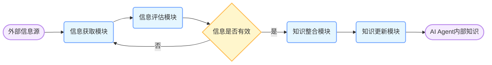

# 构建AI Agent的知识更新机制：保持信息时效性

> 关键词：AI Agent、知识更新机制、信息时效性、机器学习、知识图谱

> 摘要：本文围绕构建AI Agent的知识更新机制展开，旨在探讨如何让AI Agent保持信息的时效性。首先介绍了相关背景知识，包括目的、预期读者、文档结构和术语表。接着阐述了核心概念与联系，通过文本示意图和Mermaid流程图进行直观展示。详细讲解了核心算法原理和具体操作步骤，并结合Python源代码进行说明。深入分析了数学模型和公式，辅以举例说明。通过项目实战展示了代码实际案例及详细解释。探讨了实际应用场景，推荐了相关工具和资源。最后总结了未来发展趋势与挑战，还提供了常见问题解答和扩展阅读参考资料，为构建高效的AI Agent知识更新机制提供全面的指导。

## 1. 背景介绍 
### 1.1 目的和范围
在当今信息爆炸的时代，知识和信息正以前所未有的速度更新和变化。AI Agent作为人工智能领域中能够自主感知环境、做出决策并执行任务的智能实体，其知识储备的时效性直接关系到其性能和应用效果。本文章的目的在于深入探讨如何构建AI Agent的知识更新机制，以确保其能够及时获取、处理和利用最新的信息，从而在各种复杂的应用场景中做出更加准确、合理的决策。

本文的范围涵盖了AI Agent知识更新机制的多个方面，包括核心概念的阐述、相关算法原理的分析、数学模型的建立、实际项目的应用案例，以及相关工具和资源的推荐等。同时，也会对未来的发展趋势和可能面临的挑战进行展望和分析。

### 1.2 预期读者
本文预期读者包括人工智能领域的研究人员、开发人员、学生，以及对AI Agent技术感兴趣的相关从业者。对于研究人员来说，本文可以为他们的学术研究提供新的思路和方向；对于开发人员，能够帮助他们在实际项目中更好地实现AI Agent的知识更新机制；对于学生而言，有助于他们深入理解AI Agent的工作原理和相关技术；而对于其他对AI Agent技术感兴趣的从业者，可以作为了解该领域知识的参考资料。

### 1.3 文档结构概述
本文将按照以下结构进行组织：首先介绍背景知识，包括目的、预期读者、文档结构和术语表；接着阐述AI Agent知识更新机制的核心概念与联系，并通过文本示意图和Mermaid流程图进行直观展示；然后详细讲解核心算法原理和具体操作步骤，结合Python源代码进行说明；再深入分析数学模型和公式，并辅以举例说明；通过项目实战展示代码实际案例及详细解释；探讨实际应用场景；推荐相关工具和资源；最后总结未来发展趋势与挑战，提供常见问题解答和扩展阅读参考资料。

### 1.4 术语表
#### 1.4.1 核心术语定义
- **AI Agent**：人工智能领域中能够自主感知环境、根据内部知识和规则做出决策，并执行相应任务的智能实体。它可以是软件程序、机器人等多种形式。
- **知识更新机制**：指AI Agent为了保持其知识的时效性，对自身知识进行获取、评估、整合和更新的一系列规则、方法和流程。
- **信息时效性**：指信息在一定时间内对决策和行动具有价值的特性。随着时间的推移，信息的价值可能会降低，因此需要及时更新。

#### 1.4.2 相关概念解释
- **知识图谱**：一种用于表示实体之间关系的语义网络，它将现实世界中的各种知识以图的形式进行组织和存储，为AI Agent提供结构化的知识表示。
- **机器学习**：一门多领域交叉学科，涉及概率论、统计学、逼近论、凸分析、算法复杂度理论等多门学科。它专门研究计算机怎样模拟或实现人类的学习行为，以获取新的知识或技能，重新组织已有的知识结构使之不断改善自身的性能。

#### 1.4.3 缩略词列表
- **ML**：Machine Learning，机器学习
- **KG**：Knowledge Graph，知识图谱

## 2. 核心概念与联系 

### 核心概念原理
AI Agent的知识更新机制主要基于以下几个核心概念：

- **知识获取**：AI Agent通过各种渠道获取外部信息，这些渠道可以包括网络爬虫、传感器、数据库等。获取的信息可以是文本、图像、音频等多种形式。
- **知识评估**：对获取到的信息进行评估，判断其准确性、可靠性和时效性。评估的方法可以包括基于规则的评估、基于机器学习的评估等。
- **知识整合**：将评估后的信息与AI Agent已有的知识进行整合，更新知识图谱或其他知识表示形式。整合的过程需要考虑知识的一致性和完整性。
- **知识更新**：根据整合后的知识，对AI Agent的内部知识进行更新，使其能够反映最新的信息。

### 架构的文本示意图
AI Agent的知识更新机制架构可以描述如下：

外部信息源（网络、传感器等） -> 信息获取模块 -> 信息评估模块 -> 知识整合模块 -> 知识更新模块 -> AI Agent内部知识（知识图谱、知识库等）

### Mermaid流程图


## 3. 核心算法原理 & 具体操作步骤 

### 核心算法原理
知识更新机制中常用的算法包括基于规则的算法和基于机器学习的算法。

#### 基于规则的算法
基于规则的算法通过预先定义的规则来判断信息的有效性和更新策略。例如，可以定义规则：如果获取到的信息来源是权威网站，且信息发布时间在最近一周内，则认为该信息有效，可以进行知识更新。

#### 基于机器学习的算法
基于机器学习的算法通过训练模型来判断信息的有效性和更新策略。例如，可以使用分类模型对信息进行分类，判断其是否为有效信息；使用回归模型预测信息的时效性等。

### 具体操作步骤
#### 信息获取
使用Python的`requests`库进行网络信息的获取，示例代码如下：
```python
import requests

def get_web_info(url):
    try:
        response = requests.get(url)
        if response.status_code == 200:
            return response.text
        else:
            return None
    except Exception as e:
        print(f"Error: {e}")
        return None
```
#### 信息评估
使用简单的规则进行信息评估，示例代码如下：
```python
import datetime

def evaluate_info(info, publish_time):
    # 假设信息发布时间在最近一周内为有效信息
    now = datetime.datetime.now()
    one_week_ago = now - datetime.timedelta(days=7)
    if publish_time >= one_week_ago:
        return True
    else:
        return False
```
#### 知识整合
假设使用字典来表示知识，示例代码如下：
```python
def integrate_knowledge(existing_knowledge, new_info):
    # 简单的知识整合，直接更新字典
    existing_knowledge.update(new_info)
    return existing_knowledge
```
#### 知识更新
将整合后的知识更新到AI Agent内部，示例代码如下：
```python
def update_knowledge(agent_knowledge, new_knowledge):
    agent_knowledge = new_knowledge
    return agent_knowledge
```

### 完整示例代码
```python
import requests
import datetime

# 信息获取
def get_web_info(url):
    try:
        response = requests.get(url)
        if response.status_code == 200:
            return response.text
        else:
            return None
    except Exception as e:
        print(f"Error: {e}")
        return None

# 信息评估
def evaluate_info(info, publish_time):
    now = datetime.datetime.now()
    one_week_ago = now - datetime.timedelta(days=7)
    if publish_time >= one_week_ago:
        return True
    else:
        return False

# 知识整合
def integrate_knowledge(existing_knowledge, new_info):
    existing_knowledge.update(new_info)
    return existing_knowledge

# 知识更新
def update_knowledge(agent_knowledge, new_knowledge):
    agent_knowledge = new_knowledge
    return agent_knowledge

# 示例使用
url = "https://example.com"
info = get_web_info(url)
publish_time = datetime.datetime.now()
if info and evaluate_info(info, publish_time):
    new_info = {"example_info": info}
    existing_knowledge = {}
    integrated_knowledge = integrate_knowledge(existing_knowledge, new_info)
    agent_knowledge = {}
    updated_knowledge = update_knowledge(agent_knowledge, integrated_knowledge)
    print(updated_knowledge)
```

## 4. 数学模型和公式 & 详细讲解 & 举例说明 

### 数学模型
在知识更新机制中，可以使用概率模型来描述信息的有效性和时效性。假设信息 $I$ 的有效性概率为 $P(I_{valid})$，时效性概率为 $P(I_{timely})$。

### 数学公式
信息的综合可信度 $C(I)$ 可以表示为：
$$C(I) = \alpha P(I_{valid}) + \beta P(I_{timely})$$
其中，$\alpha$ 和 $\beta$ 是权重系数，且 $\alpha + \beta = 1$。

### 详细讲解
- $P(I_{valid})$：表示信息 $I$ 有效的概率，可以通过基于规则的评估或机器学习模型来计算。例如，使用分类模型对信息进行分类，得到信息有效的概率。
- $P(I_{timely})$：表示信息 $I$ 具有时效性的概率，可以根据信息的发布时间和当前时间来计算。例如，如果信息发布时间在最近一周内，则 $P(I_{timely}) = 1$，否则 $P(I_{timely}) = 0$。
- $\alpha$ 和 $\beta$：权重系数，用于调整有效性和时效性在综合可信度中的重要程度。例如，如果更注重信息的时效性，则可以将 $\beta$ 设置得较大。

### 举例说明
假设信息 $I$ 的有效性概率 $P(I_{valid}) = 0.8$，时效性概率 $P(I_{timely}) = 0.6$，权重系数 $\alpha = 0.4$，$\beta = 0.6$。则信息的综合可信度为：
$$C(I) = 0.4 \times 0.8 + 0.6 \times 0.6 = 0.32 + 0.36 = 0.68$$

如果设定综合可信度阈值为 $0.7$，则该信息的综合可信度低于阈值，可能需要进一步评估或不进行知识更新。

## 5. 项目实战：代码实际案例和详细解释说明 

### 5.1  开发环境搭建
#### 安装Python
首先需要安装Python，建议使用Python 3.7及以上版本。可以从Python官方网站（https://www.python.org/downloads/）下载并安装。

#### 安装必要的库
使用`pip`安装必要的库，示例代码如下：
```bash
pip install requests
```

### 5.2  源代码详细实现和代码解读
以下是一个更完整的项目实战代码示例，用于实现AI Agent的知识更新机制：
```python
import requests
import datetime
import json

# 信息获取
def get_web_info(url):
    try:
        response = requests.get(url)
        if response.status_code == 200:
            return response.json()
        else:
            return None
    except Exception as e:
        print(f"Error: {e}")
        return None

# 信息评估
def evaluate_info(info, publish_time):
    now = datetime.datetime.now()
    one_week_ago = now - datetime.timedelta(days=7)
    if publish_time >= one_week_ago:
        # 简单假设信息中的某个字段表示信息的可信度
        if 'confidence' in info and info['confidence'] > 0.8:
            return True
    return False

# 知识整合
def integrate_knowledge(existing_knowledge, new_info):
    if 'id' in new_info:
        existing_knowledge[new_info['id']] = new_info
    return existing_knowledge

# 知识更新
def update_knowledge(agent_knowledge, new_knowledge):
    agent_knowledge = integrate_knowledge(agent_knowledge, new_knowledge)
    return agent_knowledge

# 主函数
def main():
    url = "https://example-api.com/info"
    info = get_web_info(url)
    if info:
        # 假设信息中有一个字段表示发布时间
        publish_time_str = info.get('publish_time', None)
        if publish_time_str:
            publish_time = datetime.datetime.strptime(publish_time_str, '%Y-%m-%d %H:%M:%S')
            if evaluate_info(info, publish_time):
                agent_knowledge = {}
                updated_knowledge = update_knowledge(agent_knowledge, info)
                print("Updated Knowledge:")
                print(json.dumps(updated_knowledge, indent=4))
            else:
                print("Info is not valid or timely.")
        else:
            print("Publish time not found in info.")
    else:
        print("Failed to get info.")

if __name__ == "__main__":
    main()
```
### 代码解读与分析
- **信息获取**：`get_web_info` 函数使用`requests`库从指定的URL获取信息，并将其解析为JSON格式。如果请求成功，则返回信息；否则返回`None`。
- **信息评估**：`evaluate_info` 函数首先判断信息的发布时间是否在最近一周内，然后检查信息中的可信度字段是否大于0.8。如果都满足条件，则认为信息有效。
- **知识整合**：`integrate_knowledge` 函数将新信息整合到已有的知识中，以信息的`id`作为键。
- **知识更新**：`update_knowledge` 函数调用`integrate_knowledge` 函数进行知识更新。
- **主函数**：`main` 函数是程序的入口，负责调用上述函数完成信息获取、评估、整合和更新的流程。

## 6. 实际应用场景 
### 智能客服
在智能客服系统中，AI Agent需要及时了解产品信息、服务政策等知识的更新，以便更好地回答用户的问题。通过知识更新机制，AI Agent可以定期从官方网站、内部知识库等渠道获取最新信息，更新自己的知识储备，提高回答的准确性和时效性。

### 金融投资
在金融投资领域，AI Agent可以用于分析市场动态、预测股票价格等。为了做出准确的决策，AI Agent需要及时获取最新的金融数据、公司财报、宏观经济信息等。知识更新机制可以确保AI Agent的知识与市场实际情况保持同步，提高投资决策的准确性。

### 医疗诊断
在医疗诊断领域，AI Agent可以辅助医生进行疾病诊断和治疗方案推荐。由于医学知识不断更新，新的疾病、治疗方法和药物不断涌现，AI Agent需要及时更新自己的医学知识。通过知识更新机制，AI Agent可以从医学文献数据库、临床研究报告等渠道获取最新的医学知识，提高诊断和治疗的准确性。

## 7. 工具和资源推荐
### 7.1 学习资源推荐
#### 7.1.1 书籍推荐
- 《人工智能：一种现代的方法》：全面介绍了人工智能的基本概念、算法和应用，是学习人工智能的经典教材。
- 《机器学习》：周志华著，详细介绍了机器学习的各种算法和理论，是机器学习领域的优秀教材。

#### 7.1.2 在线课程
- Coursera上的“机器学习”课程：由Andrew Ng教授主讲，是学习机器学习的经典在线课程。
- edX上的“人工智能基础”课程：系统介绍了人工智能的基本概念和方法。

#### 7.1.3 技术博客和网站
- Medium：有很多关于人工智能和机器学习的技术博客文章，涵盖了最新的研究成果和应用案例。
- arXiv：提供了大量的学术论文，包括人工智能领域的最新研究成果。

### 7.2 开发工具框架推荐
#### 7.2.1 IDE和编辑器
- PyCharm：是一款专门为Python开发设计的集成开发环境，提供了丰富的功能和插件，方便开发和调试Python代码。
- Visual Studio Code：是一款轻量级的代码编辑器，支持多种编程语言，具有丰富的插件生态系统。

#### 7.2.2 调试和性能分析工具
- PDB：Python自带的调试器，可以帮助开发者调试Python代码。
- cProfile：Python的性能分析工具，可以帮助开发者分析代码的性能瓶颈。

#### 7.2.3 相关框架和库
- TensorFlow：是一个开源的机器学习框架，提供了丰富的工具和算法，用于开发和训练机器学习模型。
- PyTorch：是另一个流行的深度学习框架，具有简洁易用的接口和高效的计算性能。

### 7.3 相关论文著作推荐
#### 7.3.1 经典论文
- “A Logical Calculus of the Ideas Immanent in Nervous Activity”：Warren S. McCulloch和Walter Pitts于1943年发表的论文，提出了人工神经网络的基本概念。
- “Learning Representations by Back-propagating Errors”：David E. Rumelhart、Geoffrey E. Hinton和Ronald J. Williams于1986年发表的论文，介绍了反向传播算法，推动了神经网络的发展。

#### 7.3.2 最新研究成果
- 关注顶级学术会议，如NeurIPS（神经信息处理系统大会）、ICML（国际机器学习会议）等，这些会议上的论文代表了人工智能领域的最新研究成果。

#### 7.3.3 应用案例分析
- 可以参考一些知名公司的技术博客和开源项目，如Google AI Blog、Facebook AI Research等，了解他们在AI Agent应用方面的实践经验和案例分析。

## 8. 总结：未来发展趋势与挑战
### 未来发展趋势
- **多模态信息融合**：未来的AI Agent将不仅仅局限于处理文本信息，还将融合图像、音频、视频等多模态信息，以获取更全面、准确的知识。
- **自主学习与进化**：AI Agent将具备更强的自主学习能力，能够自动发现新知识、优化自身的知识更新机制，实现自我进化。
- **与人类的深度协作**：AI Agent将与人类进行更深度的协作，共同完成复杂的任务。在协作过程中，AI Agent需要及时更新知识，以更好地理解人类的需求和意图。

### 挑战
- **信息过载**：随着信息的爆炸式增长，AI Agent面临着信息过载的挑战。如何从海量的信息中筛选出有价值、时效性强的信息，是一个亟待解决的问题。
- **知识一致性**：在知识更新过程中，如何保证新获取的知识与已有知识的一致性，避免出现知识冲突和矛盾，是一个挑战。
- **隐私和安全**：在获取和更新知识的过程中，AI Agent可能会涉及到用户的隐私信息和敏感数据。如何保障信息的隐私和安全，是一个重要的问题。

## 9. 附录：常见问题与解答
### 问题1：如何确保信息获取的准确性？
解答：可以通过选择可靠的信息来源，如权威网站、官方数据库等。同时，可以使用信息评估算法对获取的信息进行验证和筛选，提高信息的准确性。

### 问题2：知识更新的频率应该如何确定？
解答：知识更新的频率取决于具体的应用场景和信息的变化速度。对于变化较快的领域，如金融、科技等，更新频率可以设置得高一些；对于相对稳定的领域，更新频率可以适当降低。

### 问题3：如何处理知识更新过程中的冲突？
解答：可以使用冲突解决策略，如基于规则的冲突解决、基于机器学习的冲突解决等。在知识整合过程中，对冲突的知识进行分析和评估，选择更合理、更准确的知识进行保留。

## 10. 扩展阅读 & 参考资料
- 《人工智能简史》
- 《深度学习》（Ian Goodfellow、Yoshua Bengio和Aaron Courville著）
- 相关学术期刊：《Journal of Artificial Intelligence Research》、《Artificial Intelligence》等
- 相关技术论坛：Stack Overflow、Reddit的人工智能板块等