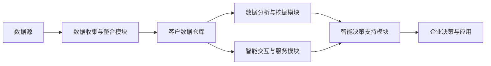

# 构建AI驱动的企业客户关系管理(CRM)系统

> 关键词：AI、客户关系管理(CRM)系统、企业应用、数据挖掘、机器学习、自然语言处理、智能决策

> 摘要：本文围绕构建AI驱动的企业客户关系管理(CRM)系统展开深入探讨。首先介绍了构建该系统的背景，包括目的、预期读者等内容。接着阐述了相关核心概念与联系，分析了核心算法原理并给出具体操作步骤，运用数学模型和公式进行详细讲解与举例说明。通过项目实战展示了代码实际案例及详细解释。探讨了该系统的实际应用场景，推荐了相关工具和资源。最后总结了未来发展趋势与挑战，提供常见问题与解答以及扩展阅读和参考资料，旨在为企业构建智能化的CRM系统提供全面且深入的技术指导和实践参考。

## 1. 背景介绍 
### 1.1 目的和范围
在当今数字化和智能化的时代，企业面临着日益激烈的市场竞争，客户资源成为企业生存和发展的关键因素。传统的客户关系管理(CRM)系统虽然能够对客户信息进行管理和跟踪，但在处理海量数据、挖掘潜在客户需求、提供个性化服务等方面存在一定的局限性。构建AI驱动的企业客户关系管理(CRM)系统的目的在于利用人工智能技术的强大能力，如机器学习、自然语言处理等，对客户数据进行深度分析和挖掘，实现客户信息的智能管理、精准营销、个性化服务以及智能决策支持，从而提高客户满意度和忠诚度，增强企业的核心竞争力。

本系统的范围涵盖了从客户信息的收集、存储、分析到客户服务和营销活动的全过程。包括对客户基本信息、交易记录、行为数据、反馈信息等多源数据的整合与处理；通过机器学习算法对客户进行分类、预测和聚类分析；利用自然语言处理技术实现客户咨询的智能回复和情感分析；以及为企业决策提供基于数据的智能建议等功能。

### 1.2 预期读者
本文的预期读者主要包括企业的管理人员，他们可以通过了解AI驱动的CRM系统，制定符合企业发展战略的客户关系管理策略，提升企业的运营效率和市场竞争力；IT技术人员，他们可以获取系统构建的技术细节和实现方法，进行系统的开发、维护和优化；市场营销人员，他们能够借助系统提供的数据分析和智能决策功能，开展精准营销活动，提高营销效果和客户转化率；同时也适合对人工智能和客户关系管理领域感兴趣的研究人员和学者，为他们的研究和学习提供参考。

### 1.3 文档结构概述
本文将按照以下结构进行详细阐述：首先介绍构建AI驱动的CRM系统的背景信息，包括目的、预期读者和文档结构概述等内容。接着深入探讨相关的核心概念与联系，通过文本示意图和Mermaid流程图展示其原理和架构。然后讲解核心算法原理并给出具体操作步骤，结合Python源代码进行详细阐述。运用数学模型和公式对系统进行详细讲解并举例说明。通过项目实战展示代码实际案例和详细解释说明，包括开发环境搭建、源代码实现和代码解读。探讨该系统的实际应用场景，为企业提供实践参考。推荐相关的工具和资源，包括学习资源、开发工具框架和相关论文著作。最后总结未来发展趋势与挑战，提供常见问题与解答以及扩展阅读和参考资料，为读者提供全面且深入的技术指导。

### 1.4 术语表
#### 1.4.1 核心术语定义
- **客户关系管理(CRM)系统**：是一种旨在管理企业与客户之间关系的信息系统，通过对客户信息的收集、存储、分析和利用，帮助企业更好地了解客户需求，提供个性化服务，提高客户满意度和忠诚度。
- **人工智能(AI)**：是研究、开发用于模拟、延伸和扩展人的智能的理论、方法、技术及应用系统的一门新的技术科学，包括机器学习、自然语言处理、计算机视觉等多个领域。
- **机器学习**：是一门多领域交叉学科，涉及概率论、统计学、逼近论、凸分析、算法复杂度理论等多门学科。它专门研究计算机怎样模拟或实现人类的学习行为，以获取新的知识或技能，重新组织已有的知识结构使之不断改善自身的性能。
- **自然语言处理**：是计算机科学领域与人工智能领域中的一个重要方向，它研究能实现人与计算机之间用自然语言进行有效通信的各种理论和方法，包括文本分类、情感分析、机器翻译等任务。

#### 1.4.2 相关概念解释
- **数据挖掘**：是指从大量的数据中通过算法搜索隐藏于其中信息的过程。在CRM系统中，数据挖掘可以帮助企业发现客户的潜在需求、购买模式和行为规律，为企业的营销和决策提供支持。
- **智能决策**：是指利用人工智能技术和数据分析方法，对企业面临的复杂决策问题进行分析和预测，提供科学合理的决策建议。在CRM系统中，智能决策可以帮助企业优化客户资源分配、制定营销策略和评估客户价值。

#### 1.4.3 缩略词列表
- **CRM**：Customer Relationship Management（客户关系管理）
- **AI**：Artificial Intelligence（人工智能）
- **ML**：Machine Learning（机器学习）
- **NLP**：Natural Language Processing（自然语言处理）

## 2. 核心概念与联系 

### 核心概念原理
AI驱动的企业客户关系管理(CRM)系统是将人工智能技术与传统CRM系统相结合的产物。其核心原理在于利用人工智能的各种技术手段，对企业的客户数据进行深度分析和处理，以实现更高效、更智能的客户关系管理。

- **数据收集与整合**：CRM系统首先需要收集来自不同渠道的客户数据，如网站、社交媒体、线下门店等。这些数据包括客户的基本信息、交易记录、行为数据、反馈信息等。然后将这些多源数据进行整合，形成一个统一的客户数据仓库，为后续的分析和挖掘提供基础。
- **数据分析与挖掘**：利用机器学习算法对客户数据进行分析和挖掘。例如，通过分类算法将客户分为不同的类别，如潜在客户、忠实客户、流失客户等；通过聚类算法发现客户的群体特征和行为模式；通过预测算法预测客户的购买意向、流失概率等。
- **智能交互与服务**：借助自然语言处理技术实现客户与系统之间的智能交互。例如，通过聊天机器人自动回答客户的咨询和问题，提供实时的客户服务；通过情感分析技术了解客户的情绪状态，及时调整服务策略。
- **智能决策支持**：根据数据分析和挖掘的结果，为企业的决策提供智能建议。例如，根据客户价值评估结果优化客户资源分配；根据市场趋势和客户需求预测制定营销策略。

### 架构的文本示意图
```plaintext
+---------------------+
|  数据源             |
|  (网站、社交媒体等) |
+---------------------+
          |
          v
+---------------------+
|  数据收集与整合模块 |
|  (数据清洗、转换等) |
+---------------------+
          |
          v
+---------------------+
|  客户数据仓库       |
|  (存储客户数据)     |
+---------------------+
          |
          v
+---------------------+
|  数据分析与挖掘模块 |
|  (机器学习算法)     |
+---------------------+
          |
          v
+---------------------+
|  智能交互与服务模块 |
|  (自然语言处理)     |
+---------------------+
          |
          v
+---------------------+
|  智能决策支持模块   |
|  (决策模型)         |
+---------------------+
          |
          v
+---------------------+
|  企业决策与应用     |
|  (营销、服务等)     |
+---------------------+
```

### Mermaid流程图


## 3. 核心算法原理 & 具体操作步骤 

### 核心算法原理
在AI驱动的CRM系统中，常用的核心算法包括分类算法、聚类算法和预测算法等。下面以Python代码为例，详细阐述这些算法的原理和实现。

#### 分类算法：逻辑回归
逻辑回归是一种常用的分类算法，用于解决二分类问题。其基本原理是通过逻辑函数将线性回归的输出映射到[0, 1]之间，从而得到样本属于某一类别的概率。逻辑函数的公式为：

$$\sigma(z)=\frac{1}{1 + e^{-z}}$$

其中，$z$ 是线性回归的输出，$\sigma(z)$ 是逻辑函数的输出，表示样本属于正类别的概率。

Python代码实现：
```python
import numpy as np
from sklearn.linear_model import LogisticRegression
from sklearn.datasets import make_classification
from sklearn.model_selection import train_test_split
from sklearn.metrics import accuracy_score

# 生成示例数据
X, y = make_classification(n_samples=1000, n_features=10, n_informative=5, n_redundant=0, random_state=42)

# 划分训练集和测试集
X_train, X_test, y_train, y_test = train_test_split(X, y, test_size=0.2, random_state=42)

# 创建逻辑回归模型
model = LogisticRegression()

# 训练模型
model.fit(X_train, y_train)

# 预测
y_pred = model.predict(X_test)

# 计算准确率
accuracy = accuracy_score(y_test, y_pred)
print(f"Accuracy: {accuracy}")
```

#### 聚类算法：K-Means
K-Means是一种常用的聚类算法，用于将数据集划分为 $K$ 个不同的簇。其基本原理是通过迭代的方式，不断更新簇的中心，使得每个样本到其所属簇中心的距离之和最小。

Python代码实现：
```python
import numpy as np
from sklearn.cluster import KMeans
from sklearn.datasets import make_blobs
import matplotlib.pyplot as plt

# 生成示例数据
X, _ = make_blobs(n_samples=300, centers=4, cluster_std=0.60, random_state=0)

# 创建K-Means模型
kmeans = KMeans(n_clusters=4, random_state=0)

# 训练模型
kmeans.fit(X)

# 获取簇标签
labels = kmeans.labels_

# 获取簇中心
centers = kmeans.cluster_centers_

# 可视化结果
plt.scatter(X[:, 0], X[:, 1], c=labels, s=50, cmap='viridis')
plt.scatter(centers[:, 0], centers[:, 1], c='red', s=200, alpha=0.5)
plt.show()
```

#### 预测算法：线性回归
线性回归是一种常用的预测算法，用于预测连续型变量的值。其基本原理是通过最小化误差的平方和来确定最佳的回归系数，从而得到线性回归方程。

Python代码实现：
```python
import numpy as np
from sklearn.linear_model import LinearRegression
from sklearn.datasets import make_regression
from sklearn.model_selection import train_test_split
from sklearn.metrics import mean_squared_error

# 生成示例数据
X, y = make_regression(n_samples=1000, n_features=10, noise=0.5, random_state=42)

# 划分训练集和测试集
X_train, X_test, y_train, y_test = train_test_split(X, y, test_size=0.2, random_state=42)

# 创建线性回归模型
model = LinearRegression()

# 训练模型
model.fit(X_train, y_train)

# 预测
y_pred = model.predict(X_test)

# 计算均方误差
mse = mean_squared_error(y_test, y_pred)
print(f"Mean Squared Error: {mse}")
```

### 具体操作步骤
1. **数据预处理**：对收集到的客户数据进行清洗、转换和归一化等操作，以提高数据的质量和可用性。
2. **特征工程**：从客户数据中提取有意义的特征，如客户年龄、性别、购买金额、购买频率等。可以使用特征选择和特征提取等方法来减少特征维度，提高模型的效率和性能。
3. **模型选择与训练**：根据具体的业务需求和数据特点，选择合适的算法模型，如分类算法、聚类算法或预测算法等。然后使用训练数据对模型进行训练，调整模型的参数，以提高模型的准确性和泛化能力。
4. **模型评估与优化**：使用测试数据对训练好的模型进行评估，计算模型的性能指标，如准确率、召回率、均方误差等。根据评估结果对模型进行优化，如调整模型参数、更换算法模型等。
5. **模型部署与应用**：将训练好的模型部署到实际的CRM系统中，实现客户数据的实时分析和处理。根据模型的预测结果，为企业的决策和业务流程提供支持，如客户分类、营销推荐、客户流失预警等。

## 4. 数学模型和公式 & 详细讲解 & 举例说明 

### 逻辑回归数学模型和公式
逻辑回归的数学模型可以表示为：

$$P(y = 1|x)=\sigma(\theta^T x)=\frac{1}{1 + e^{-\theta^T x}}$$

其中，$P(y = 1|x)$ 表示样本 $x$ 属于正类别的概率，$\theta$ 是模型的参数，$x$ 是样本的特征向量。

逻辑回归的目标是找到一组最优的参数 $\theta$，使得所有样本的似然函数最大。似然函数可以表示为：

$$L(\theta)=\prod_{i=1}^{n}P(y^{(i)}|x^{(i)};\theta)$$

为了方便计算，通常对似然函数取对数，得到对数似然函数：

$$\ell(\theta)=\log L(\theta)=\sum_{i=1}^{n}[y^{(i)}\log P(y^{(i)} = 1|x^{(i)};\theta)+(1 - y^{(i)})\log(1 - P(y^{(i)} = 1|x^{(i)};\theta))]$$

通过最大化对数似然函数，可以得到最优的参数 $\theta$。在实际应用中，通常使用梯度下降法或牛顿法等优化算法来求解最优参数。

举例说明：假设我们有一个二分类问题，要预测客户是否会购买某产品。我们收集了客户的年龄、收入、购买频率等特征作为输入，客户是否购买作为输出。使用逻辑回归模型进行训练，得到最优的参数 $\theta$。对于一个新的客户，我们可以根据其特征向量 $x$ 计算其购买产品的概率 $P(y = 1|x)$，如果概率大于某个阈值（如0.5），则预测该客户会购买产品。

### K-Means数学模型和公式
K-Means的目标是将数据集 $X=\{x_1,x_2,\cdots,x_n\}$ 划分为 $K$ 个不同的簇 $C=\{C_1,C_2,\cdots,C_K\}$，使得每个样本到其所属簇中心的距离之和最小。可以用以下公式表示：

$$\min_{C}\sum_{k=1}^{K}\sum_{x_i\in C_k}||x_i - \mu_k||^2$$

其中，$\mu_k$ 是第 $k$ 个簇的中心。

K-Means算法的具体步骤如下：
1. 随机初始化 $K$ 个簇中心 $\mu_1,\mu_2,\cdots,\mu_K$。
2. 对于每个样本 $x_i$，计算其到各个簇中心的距离，将其分配到距离最近的簇中。
3. 重新计算每个簇的中心 $\mu_k=\frac{1}{|C_k|}\sum_{x_i\in C_k}x_i$，其中 $|C_k|$ 是第 $k$ 个簇的样本数量。
4. 重复步骤2和3，直到簇中心不再变化或达到最大迭代次数。

举例说明：假设我们有一个客户数据集，包含客户的年龄和购买金额两个特征。我们希望将客户划分为3个不同的簇。使用K-Means算法进行聚类，首先随机初始化3个簇中心，然后根据每个客户到簇中心的距离将其分配到不同的簇中，接着重新计算簇中心，不断迭代，直到簇中心不再变化。最终得到3个不同的客户簇，每个簇代表具有相似特征的客户群体。

### 线性回归数学模型和公式
线性回归的数学模型可以表示为：

$$y = \theta_0+\theta_1x_1+\theta_2x_2+\cdots+\theta_nx_n+\epsilon$$

其中，$y$ 是目标变量，$x_1,x_2,\cdots,x_n$ 是特征变量，$\theta_0,\theta_1,\cdots,\theta_n$ 是模型的参数，$\epsilon$ 是误差项。

线性回归的目标是找到一组最优的参数 $\theta$，使得所有样本的误差平方和最小。误差平方和可以表示为：

$$J(\theta)=\frac{1}{2m}\sum_{i=1}^{m}(h_{\theta}(x^{(i)}) - y^{(i)})^2$$

其中，$h_{\theta}(x^{(i)})=\theta_0+\theta_1x_1^{(i)}+\theta_2x_2^{(i)}+\cdots+\theta_nx_n^{(i)}$ 是模型的预测值，$m$ 是样本数量。

通过最小化误差平方和，可以得到最优的参数 $\theta$。在实际应用中，通常使用最小二乘法或梯度下降法等优化算法来求解最优参数。

举例说明：假设我们要预测客户的购买金额，我们收集了客户的年龄、收入、购买频率等特征作为输入，客户的购买金额作为输出。使用线性回归模型进行训练，得到最优的参数 $\theta$。对于一个新的客户，我们可以根据其特征向量 $x$ 计算其预测的购买金额 $h_{\theta}(x)$。

## 5. 项目实战：代码实际案例和详细解释说明 

### 5.1  开发环境搭建
- **操作系统**：推荐使用Windows、Linux或macOS等主流操作系统。
- **Python环境**：安装Python 3.6及以上版本。可以从Python官方网站（https://www.python.org/downloads/） 下载并安装。
- **开发工具**：推荐使用PyCharm或Jupyter Notebook等开发工具。PyCharm是一款专业的Python集成开发环境（IDE），提供了丰富的功能和工具，方便代码的编写、调试和管理。Jupyter Notebook是一个交互式的开发环境，适合进行数据探索和模型实验。
- **相关库和框架**：安装必要的Python库和框架，如NumPy、Pandas、Scikit-learn、Matplotlib等。可以使用pip命令进行安装，例如：
```bash
pip install numpy pandas scikit-learn matplotlib
```

### 5.2  源代码详细实现和代码解读
以下是一个简单的AI驱动的CRM系统的代码示例，包括客户数据的加载、预处理、模型训练和预测等步骤。

```python
import numpy as np
import pandas as pd
from sklearn.model_selection import train_test_split
from sklearn.linear_model import LogisticRegression
from sklearn.metrics import accuracy_score

# 加载客户数据
data = pd.read_csv('customer_data.csv')

# 数据预处理
# 处理缺失值
data = data.fillna(data.mean())

# 分离特征和标签
X = data.drop('label', axis=1)
y = data['label']

# 划分训练集和测试集
X_train, X_test, y_train, y_test = train_test_split(X, y, test_size=0.2, random_state=42)

# 创建逻辑回归模型
model = LogisticRegression()

# 训练模型
model.fit(X_train, y_train)

# 预测
y_pred = model.predict(X_test)

# 计算准确率
accuracy = accuracy_score(y_test, y_pred)
print(f"Accuracy: {accuracy}")
```

### 代码解读与分析
1. **数据加载**：使用Pandas库的 `read_csv` 函数加载客户数据文件 `customer_data.csv`。
2. **数据预处理**：使用 `fillna` 函数处理数据中的缺失值，将缺失值填充为该列的均值。
3. **特征和标签分离**：使用 `drop` 函数将标签列从数据集中分离出来，得到特征矩阵 $X$ 和标签向量 $y$。
4. **划分训练集和测试集**：使用 `train_test_split` 函数将数据集划分为训练集和测试集，测试集占比为20%。
5. **模型创建和训练**：创建逻辑回归模型，并使用训练集数据对模型进行训练。
6. **预测和评估**：使用训练好的模型对测试集数据进行预测，得到预测结果 $y_pred$。使用 `accuracy_score` 函数计算预测结果的准确率。

## 6. 实际应用场景 
### 客户细分与个性化营销
AI驱动的CRM系统可以通过聚类算法将客户划分为不同的细分群体，每个群体具有相似的特征和行为模式。企业可以根据不同的客户细分群体，制定个性化的营销策略，提供个性化的产品推荐和服务，提高营销效果和客户转化率。例如，对于高价值客户群体，可以提供专属的优惠活动和增值服务；对于潜在客户群体，可以通过针对性的广告和促销活动吸引他们购买产品。

### 客户流失预警
通过预测算法，系统可以对客户的流失概率进行预测。企业可以提前发现有流失风险的客户，并采取相应的措施进行挽留，如提供个性化的优惠、改进服务质量等。例如，当系统预测某客户的流失概率超过一定阈值时，客服人员可以及时与该客户联系，了解其需求和意见，解决其问题，从而降低客户流失率。

### 智能客服与客户服务优化
借助自然语言处理技术，系统可以实现智能客服功能，自动回答客户的咨询和问题。智能客服可以24小时在线，快速响应客户需求，提高客户服务效率。同时，通过对客户咨询和反馈信息的分析，系统可以了解客户的需求和痛点，帮助企业优化产品和服务，提高客户满意度。例如，智能客服可以根据客户的问题自动推荐相关的产品或解决方案；企业可以根据客户反馈的问题，对产品进行改进和升级。

### 销售预测与决策支持
系统可以通过对历史销售数据和客户行为数据的分析，预测未来的销售趋势和客户需求。企业可以根据销售预测结果，合理安排生产和库存，制定销售策略和目标。同时，系统还可以为企业的决策提供智能建议，如客户资源分配、市场推广策略等，帮助企业做出更科学、更合理的决策。例如，根据销售预测结果，企业可以提前采购原材料，调整生产计划，避免库存积压或缺货现象的发生。

## 7. 工具和资源推荐
### 7.1 学习资源推荐
#### 7.1.1 书籍推荐
- 《Python机器学习》：本书全面介绍了Python在机器学习领域的应用，包括各种机器学习算法的原理、实现和应用案例。
- 《统计学习方法》：这本书系统地介绍了统计学习的基本概念、理论和方法，是学习机器学习和数据挖掘的经典教材。
- 《自然语言处理入门》：详细介绍了自然语言处理的基本概念、技术和应用，适合初学者学习。

#### 7.1.2 在线课程
- Coursera上的“机器学习”课程：由斯坦福大学教授Andrew Ng主讲，是一门非常经典的机器学习入门课程。
- edX上的“数据科学与机器学习微硕士项目”：提供了系统的数据分析和机器学习课程，适合有一定基础的学习者深入学习。
- 网易云课堂上的“Python人工智能实战”课程：通过实际案例讲解Python在人工智能领域的应用，具有很强的实践性。

#### 7.1.3 技术博客和网站
- 博客园：是一个技术交流平台，有很多关于人工智能和CRM系统的技术文章和经验分享。
- 知乎：在知乎上可以找到很多关于人工智能和客户关系管理的讨论和问答，了解行业动态和最新技术。
- 开源中国：提供了丰富的开源项目和技术资源，对于学习和实践AI驱动的CRM系统有很大的帮助。

### 7.2 开发工具框架推荐
#### 7.2.1 IDE和编辑器
- PyCharm：是一款功能强大的Python集成开发环境，提供了代码编辑、调试、版本控制等丰富的功能，适合专业的Python开发者使用。
- Jupyter Notebook：是一个交互式的开发环境，支持代码、文本、图像等多种格式的展示，适合进行数据探索和模型实验。
- Visual Studio Code：是一款轻量级的代码编辑器，支持多种编程语言和插件扩展，具有良好的开发体验。

#### 7.2.2 调试和性能分析工具
- PySnooper：是一个简单易用的Python调试工具，可以自动记录函数的调用过程和变量的值，方便调试代码。
- cProfile：是Python标准库中的性能分析工具，可以统计函数的执行时间和调用次数，帮助优化代码性能。
- Scikit-learn的GridSearchCV：可以用于模型的超参数调优，通过网格搜索的方式找到最优的超参数组合，提高模型的性能。

#### 7.2.3 相关框架和库
- Scikit-learn：是一个简单易用的机器学习库，提供了各种机器学习算法的实现和工具，如分类、聚类、回归等。
- TensorFlow：是一个开源的深度学习框架，广泛应用于图像识别、自然语言处理等领域，具有强大的计算能力和扩展性。
- NLTK：是一个自然语言处理库，提供了丰富的语料库和工具，如分词、词性标注、命名实体识别等。

### 7.3 相关论文著作推荐
#### 7.3.1 经典论文
- “A Unified Approach to Interpreting Model Predictions”：提出了一种统一的方法来解释模型的预测结果，对于理解AI模型的决策过程具有重要意义。
- “Deep Learning”：由Yoshua Bengio、Geoffrey Hinton和Yann LeCun等深度学习领域的先驱撰写的综述论文，系统地介绍了深度学习的基本概念、方法和应用。
- “Customer Relationship Management: A Synthesis of Theory, Practice, and Applications”：对客户关系管理的理论、实践和应用进行了全面的综述和分析，为CRM系统的研究和实践提供了重要的参考。

#### 7.3.2 最新研究成果
- 在顶级学术会议如NeurIPS、ICML、ACL等上发表的关于人工智能和客户关系管理的最新研究论文，反映了该领域的最新技术和研究趋势。
- 相关学术期刊如《Journal of Artificial Intelligence Research》、《Journal of Customer Relationship Management》等上发表的高质量研究论文。

#### 7.3.3 应用案例分析
- 各大企业的案例研究报告，如亚马逊、谷歌、微软等公司在客户关系管理方面的实践经验和成功案例，为企业构建AI驱动的CRM系统提供了实际参考。
- 行业咨询公司发布的关于AI驱动的CRM系统的应用案例分析报告，分析了不同行业的企业在实施CRM系统过程中遇到的问题和解决方案。

## 8. 总结：未来发展趋势与挑战
### 未来发展趋势
- **更深入的人工智能应用**：未来，AI驱动的CRM系统将更加深入地应用人工智能技术，如深度学习、强化学习等。深度学习可以处理更复杂的客户数据，如文本、图像、视频等，提供更精准的客户画像和预测结果。强化学习可以通过与客户的交互不断优化系统的决策策略，提高客户满意度和忠诚度。
- **多渠道融合与全场景覆盖**：随着移动互联网、社交媒体等渠道的不断发展，客户与企业的交互方式越来越多样化。未来的CRM系统将实现多渠道融合，整合网站、移动应用、社交媒体、线下门店等各种渠道的客户数据，实现全场景覆盖。企业可以在不同的渠道和场景下为客户提供一致的服务和体验。
- **智能化的客户体验管理**：未来的CRM系统将更加注重客户体验管理，通过人工智能技术实现智能化的客户体验优化。例如，通过情感分析技术了解客户的情绪状态，及时调整服务策略；通过个性化推荐技术为客户提供符合其需求和兴趣的产品和服务，提高客户的满意度和忠诚度。
- **与其他企业系统的集成**：CRM系统将与企业的其他系统，如企业资源规划（ERP）系统、供应链管理（SCM）系统等进行深度集成，实现数据的共享和业务流程的协同。这样可以提高企业的整体运营效率，优化资源配置，提升企业的核心竞争力。

### 挑战
- **数据隐私和安全问题**：AI驱动的CRM系统需要收集和处理大量的客户数据，包括客户的个人信息、交易记录等。这些数据的隐私和安全问题是企业面临的重要挑战。企业需要采取有效的措施来保护客户数据的安全，防止数据泄露和滥用。
- **算法可解释性和透明度**：人工智能算法，特别是深度学习算法，通常被视为“黑盒”模型，其决策过程和结果难以解释和理解。在CRM系统中，企业需要向客户和监管机构解释系统的决策依据和结果，以提高客户的信任度和合规性。因此，如何提高算法的可解释性和透明度是一个亟待解决的问题。
- **技术人才短缺**：构建和维护AI驱动的CRM系统需要具备人工智能、机器学习、数据分析等多方面技术的专业人才。目前，市场上这类技术人才相对短缺，企业面临着人才招聘和培养的压力。
- **业务流程和组织变革**：引入AI驱动的CRM系统需要企业对现有的业务流程和组织架构进行调整和变革。这可能会面临员工的抵触情绪和组织文化的阻力，需要企业进行有效的沟通和管理，确保系统的顺利实施和应用。

## 9. 附录：常见问题与解答
### 1. 如何选择适合企业的AI算法？
选择适合企业的AI算法需要考虑多个因素，如数据特点、业务需求、算法复杂度等。首先，需要对企业的客户数据进行分析，了解数据的类型、规模、分布等特点。然后，根据业务需求确定具体的任务，如分类、聚类、预测等。最后，结合算法的复杂度和性能，选择合适的算法模型。例如，如果数据规模较小且任务简单，可以选择简单的机器学习算法，如逻辑回归、决策树等；如果数据规模较大且任务复杂，可以选择深度学习算法，如神经网络、卷积神经网络等。

### 2. 如何保证AI驱动的CRM系统的准确性和可靠性？
保证AI驱动的CRM系统的准确性和可靠性需要从多个方面入手。首先，要确保数据的质量，对收集到的客户数据进行清洗、预处理和验证，去除噪声和错误数据。其次，选择合适的算法模型，并进行充分的模型训练和优化，调整模型的参数，提高模型的准确性和泛化能力。此外，还需要对模型进行评估和验证，使用测试数据和交叉验证等方法来评估模型的性能。最后，建立监控和反馈机制，及时发现和解决系统中出现的问题，不断优化系统的性能。

### 3. 如何解决AI算法的可解释性问题？
解决AI算法的可解释性问题可以采用多种方法。一种方法是选择可解释性较强的算法模型，如决策树、线性回归等，这些算法的决策过程和结果比较容易理解和解释。另一种方法是使用模型解释技术，如局部可解释模型无关解释（LIME）、SHAP值等，这些技术可以对模型的预测结果进行解释，提供每个特征对预测结果的贡献度。此外，还可以通过可视化的方式展示模型的决策过程和结果，帮助用户更好地理解和解释模型。

### 4. 如何进行AI驱动的CRM系统的实施和部署？
进行AI驱动的CRM系统的实施和部署需要遵循一定的步骤。首先，要进行需求分析和规划，明确系统的功能和目标，制定实施计划和时间表。然后，进行数据准备和预处理，收集和整理客户数据，确保数据的质量和可用性。接着，选择合适的技术和工具，开发和实现系统的功能。在开发过程中，要进行充分的测试和验证，确保系统的稳定性和可靠性。最后，进行系统的部署和上线，对用户进行培训和指导，确保系统的顺利使用和运行。

## 10. 扩展阅读 & 参考资料
### 扩展阅读
- 《人工智能简史》：全面介绍了人工智能的发展历程、主要技术和应用领域，帮助读者了解人工智能的全貌。
- 《客户体验管理》：深入探讨了客户体验管理的理论、方法和实践，为企业提升客户体验提供了有益的参考。
- 《数字化转型：企业如何实现可持续增长》：介绍了企业数字化转型的趋势、策略和实践案例，对于企业构建AI驱动的CRM系统具有重要的指导意义。

### 参考资料
- 相关的学术论文和研究报告，如ACM、IEEE等学术组织发表的关于人工智能和客户关系管理的研究论文。
- 各大企业的官方网站和技术博客，如亚马逊、谷歌、微软等公司发布的关于CRM系统和人工智能应用的技术文章和案例分享。
- 行业咨询公司的研究报告和白皮书，如Gartner、IDC等公司发布的关于AI驱动的CRM系统的市场研究和趋势分析报告。