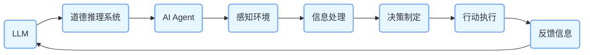

# 构建LLM支持的AI Agent道德推理系统

> 关键词：LLM（大语言模型）、AI Agent、道德推理系统、人工智能伦理、决策机制、自然语言处理、机器学习

> 摘要：本文聚焦于构建基于LLM支持的AI Agent道德推理系统。随着人工智能技术的飞速发展，AI Agent在各个领域的应用日益广泛，其决策和行为的道德性变得至关重要。大语言模型（LLM）凭借其强大的自然语言理解和生成能力，为AI Agent的道德推理提供了有力支持。文章首先介绍了相关背景，包括目的、预期读者等内容；接着深入阐述了核心概念与联系，分析了核心算法原理和具体操作步骤；详细讲解了数学模型和公式；通过项目实战展示了代码实现和解读；探讨了实际应用场景；推荐了相关工具和资源；最后总结了未来发展趋势与挑战，并提供常见问题解答和参考资料，旨在为构建高效、可靠的AI Agent道德推理系统提供全面的技术指导和理论支持。

## 1. 背景介绍 
### 1.1 目的和范围
随着人工智能技术的不断进步，AI Agent在诸多领域得到了广泛应用，如自动驾驶、医疗诊断、金融决策等。然而，AI Agent的决策和行为往往会对人类社会产生重大影响，因此其道德性成为了亟待解决的问题。本研究的目的在于构建一个基于LLM支持的AI Agent道德推理系统，使AI Agent能够在面对复杂的道德情境时，做出符合道德规范的决策。

本研究的范围涵盖了从理论原理到实际应用的多个方面。在理论层面，深入探讨了道德推理的基本概念、LLM的工作原理以及二者之间的联系；在技术实现层面，详细介绍了核心算法原理、数学模型和公式，并通过项目实战展示了系统的具体实现过程；在应用层面，分析了系统在不同领域的实际应用场景。

### 1.2 预期读者
本文预期读者包括人工智能领域的研究人员、开发者、伦理学家以及对AI Agent道德问题感兴趣的相关人士。对于研究人员，本文提供了关于AI Agent道德推理系统的前沿研究成果和理论框架，有助于拓展其研究思路；对于开发者，文中详细的技术实现细节和代码示例可以为他们构建实际的道德推理系统提供参考；对于伦理学家，本文从技术角度探讨了AI Agent的道德问题，为伦理研究提供了新的视角；对于其他感兴趣的读者，本文可以帮助他们了解AI Agent道德推理系统的基本原理和应用前景。

### 1.3 文档结构概述
本文将按照以下结构展开：
1. **背景介绍**：介绍研究的目的、范围、预期读者和文档结构概述，并给出相关术语的定义和解释。
2. **核心概念与联系**：阐述LLM、AI Agent和道德推理系统的核心概念，分析它们之间的联系，并通过文本示意图和Mermaid流程图进行直观展示。
3. **核心算法原理 & 具体操作步骤**：详细讲解基于LLM的道德推理算法原理，并使用Python源代码进行具体实现和步骤说明。
4. **数学模型和公式 & 详细讲解 & 举例说明**：介绍道德推理系统中的数学模型和公式，对其进行详细讲解，并通过具体例子进行说明。
5. **项目实战：代码实际案例和详细解释说明**：搭建开发环境，展示源代码的详细实现过程，并对代码进行解读和分析。
6. **实际应用场景**：探讨AI Agent道德推理系统在不同领域的实际应用场景。
7. **工具和资源推荐**：推荐学习资源、开发工具框架和相关论文著作。
8. **总结：未来发展趋势与挑战**：总结AI Agent道德推理系统的未来发展趋势，并分析面临的挑战。
9. **附录：常见问题与解答**：解答读者在阅读过程中可能遇到的常见问题。
10. **扩展阅读 & 参考资料**：提供相关的扩展阅读材料和参考资料。

### 1.4 术语表
#### 1.4.1 核心术语定义
- **LLM（大语言模型）**：是一种基于深度学习的自然语言处理模型，通过在大规模文本数据上进行训练，学习语言的统计规律和语义信息，能够生成自然流畅的文本。
- **AI Agent（人工智能智能体）**：是一种能够感知环境、做出决策并采取行动的智能实体，它可以是软件程序、机器人或其他智能设备。
- **道德推理系统**：是一种能够对道德情境进行分析、评估和决策的系统，旨在使AI Agent的行为符合道德规范。

#### 1.4.2 相关概念解释
- **自然语言处理（NLP）**：是人工智能的一个重要分支，主要研究如何让计算机理解、处理和生成自然语言。
- **机器学习**：是一门多领域交叉学科，涉及概率论、统计学、逼近论、凸分析、算法复杂度理论等多门学科。它专门研究计算机怎样模拟或实现人类的学习行为，以获取新的知识或技能，重新组织已有的知识结构使之不断改善自身的性能。
- **伦理准则**：是指在一定的社会和文化背景下，人们普遍认可的道德规范和行为准则。

#### 1.4.3 缩略词列表
- **LLM**：Large Language Model（大语言模型）
- **AI**：Artificial Intelligence（人工智能）
- **NLP**：Natural Language Processing（自然语言处理）

## 2. 核心概念与联系 
### 2.1 LLM的原理和架构
大语言模型（LLM）通常基于Transformer架构，Transformer是一种基于注意力机制的深度学习模型，它通过多头自注意力机制来捕捉输入序列中不同位置之间的依赖关系。LLM的训练过程通常采用无监督学习的方式，在大规模的文本数据上进行预训练，学习语言的统计规律和语义信息。预训练完成后，可以通过微调的方式将LLM应用到不同的自然语言处理任务中。

LLM的架构主要包括输入层、编码器、解码器和输出层。输入层将输入的文本转换为模型可以处理的向量表示；编码器通过多头自注意力机制和前馈神经网络对输入的向量进行编码，提取文本的特征信息；解码器在编码器的基础上，生成输出文本；输出层将解码器的输出转换为具体的文本。

### 2.2 AI Agent的概念和工作原理
AI Agent是一种能够感知环境、做出决策并采取行动的智能实体。它通常由感知模块、决策模块和执行模块组成。感知模块负责收集环境信息，如传感器数据、文本信息等；决策模块根据感知模块收集的信息，结合自身的目标和策略，做出决策；执行模块根据决策模块的决策，采取相应的行动。

AI Agent的工作原理可以概括为以下几个步骤：
1. **感知环境**：通过感知模块收集环境信息。
2. **信息处理**：对收集到的环境信息进行处理和分析，提取有用的信息。
3. **决策制定**：根据处理后的信息和自身的目标、策略，做出决策。
4. **行动执行**：根据决策结果，通过执行模块采取相应的行动。

### 2.3 道德推理系统的概念和作用
道德推理系统是一种能够对道德情境进行分析、评估和决策的系统。它的主要作用是使AI Agent的行为符合道德规范，避免AI Agent做出不道德的决策和行为。道德推理系统通常基于一定的伦理准则和道德原则，对道德情境进行分析和评估，然后根据评估结果做出决策。

道德推理系统的工作流程通常包括以下几个步骤：
1. **道德情境识别**：识别当前所处的道德情境。
2. **道德原则应用**：根据识别的道德情境，应用相应的道德原则进行分析和评估。
3. **决策生成**：根据分析和评估的结果，生成符合道德规范的决策。

### 2.4 核心概念之间的联系
LLM、AI Agent和道德推理系统之间存在着密切的联系。LLM为AI Agent的道德推理提供了强大的自然语言理解和生成能力。通过LLM，AI Agent可以更好地理解道德情境的描述，生成符合道德规范的决策和解释。道德推理系统则为AI Agent的决策提供了道德指导，使AI Agent的行为符合道德规范。AI Agent作为执行主体，将道德推理系统的决策付诸实践，实现对环境的感知和行动。

### 2.5 文本示意图和Mermaid流程图
#### 2.5.1 文本示意图
```plaintext
+----------------+        +------------------+        +-------------------+
|     LLM        | ----> | 道德推理系统     | ----> |    AI Agent       |
| (自然语言处理) |        | (道德分析与决策) |        | (感知、决策与行动) |
+----------------+        +------------------+        +-------------------+
```

#### 2.5.2 Mermaid流程图


## 3. 核心算法原理 & 具体操作步骤 
### 3.1 基于LLM的道德推理算法原理
基于LLM的道德推理算法主要包括以下几个步骤：
1. **道德情境编码**：将输入的道德情境描述转换为LLM可以处理的向量表示。
2. **道德原则嵌入**：将预先定义的道德原则转换为向量表示。
3. **道德推理**：通过LLM对道德情境编码和道德原则嵌入进行处理，生成道德评估结果。
4. **决策生成**：根据道德评估结果，生成符合道德规范的决策。

### 3.2 具体操作步骤及Python代码实现
以下是一个基于Python和Hugging Face Transformers库的简单示例，展示了如何使用LLM进行道德推理：

```python
from transformers import AutoTokenizer, AutoModelForSequenceClassification
import torch

# 加载预训练的LLM模型和分词器
model_name = "bert-base-uncased"
tokenizer = AutoTokenizer.from_pretrained(model_name)
model = AutoModelForSequenceClassification.from_pretrained(model_name, num_labels=2)

# 定义道德情境和道德原则
moral_scenario = "一个人在商店里偷了东西，被店员发现了。店员应该怎么做？"
moral_principle = "应该遵守法律，维护社会秩序。"

# 对道德情境和道德原则进行编码
inputs = tokenizer(moral_scenario + " " + moral_principle, return_tensors="pt")

# 进行道德推理
with torch.no_grad():
    outputs = model(**inputs)
    logits = outputs.logits
    predicted_class_id = logits.argmax().item()

# 生成决策
if predicted_class_id == 0:
    decision = "店员应该报警，让警察来处理。"
else:
    decision = "店员应该采取其他非法律手段解决问题。"

print("道德推理结果：", decision)
```

### 3.3 代码解释
1. **加载模型和分词器**：使用Hugging Face Transformers库加载预训练的BERT模型和对应的分词器。
2. **定义道德情境和道德原则**：将具体的道德情境和道德原则以文本的形式进行定义。
3. **编码**：使用分词器将道德情境和道德原则转换为模型可以处理的输入张量。
4. **道德推理**：通过模型对输入张量进行处理，得到输出的logits。
5. **决策生成**：根据logits的最大值对应的类别ID，生成相应的决策。

## 4. 数学模型和公式 & 详细讲解 & 举例说明 
### 4.1 道德推理的数学模型
道德推理的数学模型可以基于概率图模型或深度学习模型进行构建。这里我们以基于深度学习的分类模型为例进行说明。

假设我们有一个道德情境 $x$ 和一组道德原则 $P = \{p_1, p_2, \cdots, p_n\}$，我们的目标是预测一个道德决策 $y$。我们可以将道德推理问题看作一个分类问题，通过训练一个分类模型 $f(x, P)$ 来预测决策 $y$。

### 4.2 相关公式
在深度学习模型中，通常使用交叉熵损失函数来训练模型。交叉熵损失函数的公式为：

$$
L(y, \hat{y}) = -\sum_{i=1}^{C} y_i \log(\hat{y}_i)
$$

其中，$y$ 是真实标签的one - hot编码，$\hat{y}$ 是模型预测的概率分布，$C$ 是类别数。

模型的预测过程可以表示为：

$$
\hat{y} = \text{softmax}(z)
$$

其中，$z$ 是模型的输出logits，$\text{softmax}$ 函数的公式为：

$$
\text{softmax}(z_j) = \frac{e^{z_j}}{\sum_{k=1}^{C} e^{z_k}}
$$

### 4.3 详细讲解
交叉熵损失函数衡量了真实标签和模型预测概率分布之间的差异。通过最小化交叉熵损失函数，模型可以学习到如何更好地预测道德决策。

$\text{softmax}$ 函数将模型的输出logits转换为概率分布，使得所有类别的概率之和为1。

### 4.4 举例说明
假设我们有一个二分类问题，真实标签 $y = [1, 0]$，模型的输出logits $z = [2, -1]$。

首先，计算 $\text{softmax}$ 函数：

$$
\text{softmax}(z_1) = \frac{e^{2}}{e^{2} + e^{-1}} \approx 0.9526
$$

$$
\text{softmax}(z_2) = \frac{e^{-1}}{e^{2} + e^{-1}} \approx 0.0474
$$

则 $\hat{y} = [0.9526, 0.0474]$。

然后，计算交叉熵损失函数：

$$
L(y, \hat{y}) = -(1 \times \log(0.9526) + 0 \times \log(0.0474)) \approx 0.0486
$$

## 5. 项目实战：代码实际案例和详细解释说明 
### 5.1  开发环境搭建
#### 5.1.1 安装Python
首先，确保你已经安装了Python 3.6或更高版本。你可以从Python官方网站（https://www.python.org/downloads/）下载并安装Python。

#### 5.1.2 创建虚拟环境
为了避免不同项目之间的依赖冲突，建议使用虚拟环境。可以使用 `venv` 或 `conda` 来创建虚拟环境。

使用 `venv` 创建虚拟环境的命令如下：

```bash
python -m venv myenv
```

激活虚拟环境：

- 在Windows上：
```bash
myenv\Scripts\activate
```

- 在Linux或Mac上：
```bash
source myenv/bin/activate
```

#### 5.1.3 安装依赖库
在虚拟环境中安装所需的依赖库，包括 `transformers`、`torch` 等。

```bash
pip install transformers torch
```

### 5.2  源代码详细实现和代码解读
以下是一个更完整的基于LLM的AI Agent道德推理系统的代码示例：

```python
from transformers import AutoTokenizer, AutoModelForSequenceClassification
import torch

# 加载预训练的LLM模型和分词器
model_name = "bert-base-uncased"
tokenizer = AutoTokenizer.from_pretrained(model_name)
model = AutoModelForSequenceClassification.from_pretrained(model_name, num_labels=3)

# 定义道德情境和道德原则数据集
moral_scenarios = [
    "一个医生在紧急情况下，没有得到患者的同意就进行了手术。这种行为是否道德？",
    "一个人在公交车上看到老人没有座位，但是自己很累不想让座。这种行为是否道德？",
    "一个公司为了追求利润，隐瞒了产品的质量问题。这种行为是否道德？"
]

moral_principles = [
    "医生应该以患者的生命健康为重。",
    "在公共场合应该尊重和帮助他人。",
    "公司应该诚实守信，对消费者负责。"
]

# 定义标签
labels = [1, 0, 0]  # 1表示道德，0表示不道德

# 对数据进行编码
inputs = tokenizer(moral_scenarios, moral_principles, return_tensors="pt", padding=True, truncation=True)
labels = torch.tensor(labels)

# 训练模型
optimizer = torch.optim.AdamW(model.parameters(), lr=1e-5)
num_epochs = 3

for epoch in range(num_epochs):
    outputs = model(**inputs, labels=labels)
    loss = outputs.loss
    loss.backward()
    optimizer.step()
    optimizer.zero_grad()
    print(f"Epoch {epoch + 1}/{num_epochs}, Loss: {loss.item()}")

# 进行预测
new_moral_scenario = "一个学生在考试中抄袭了其他同学的答案。这种行为是否道德？"
new_moral_principle = "学生应该诚实守信，遵守考试规则。"

new_inputs = tokenizer(new_moral_scenario, new_moral_principle, return_tensors="pt")

with torch.no_grad():
    outputs = model(**new_inputs)
    logits = outputs.logits
    predicted_class_id = logits.argmax().item()

if predicted_class_id == 1:
    decision = "这种行为是道德的。"
else:
    decision = "这种行为是不道德的。"

print("预测结果：", decision)
```

### 5.3  代码解读与分析
1. **数据准备**：定义了道德情境和道德原则的数据集，并为每个情境分配了相应的标签。
2. **数据编码**：使用分词器对道德情境和道德原则进行编码，将其转换为模型可以处理的输入张量。
3. **模型训练**：使用交叉熵损失函数和AdamW优化器对模型进行训练，通过多次迭代更新模型的参数。
4. **预测**：使用训练好的模型对新的道德情境进行预测，根据预测结果生成决策。

## 6. 实际应用场景 
### 6.1 自动驾驶领域
在自动驾驶领域，AI Agent需要在复杂的交通环境中做出决策。例如，当遇到突然出现的行人时，AI Agent需要决定是紧急刹车还是采取其他避让措施。道德推理系统可以帮助AI Agent在这种情况下做出符合道德规范的决策，如优先保护行人的生命安全。

### 6.2 医疗领域
在医疗领域，AI Agent可以辅助医生进行诊断和治疗决策。例如，在资源有限的情况下，如何分配医疗资源。道德推理系统可以根据公平、公正等道德原则，帮助AI Agent做出合理的决策。

### 6.3 金融领域
在金融领域，AI Agent可以用于风险评估和投资决策。例如，在评估一个企业的信用风险时，道德推理系统可以考虑企业的社会责任和道德行为，避免投资不道德的企业。

### 6.4 教育领域
在教育领域，AI Agent可以用于智能辅导和教学评价。例如，在评价学生的作业和考试成绩时，道德推理系统可以确保评价过程的公平、公正，避免因偏见等因素导致不道德的评价结果。

## 7. 工具和资源推荐
### 7.1 学习资源推荐
#### 7.1.1 书籍推荐
- 《人工智能伦理》：本书全面介绍了人工智能领域的伦理问题，包括道德推理、隐私保护、公平性等方面的内容。
- 《深度学习》：深度学习是LLM的基础，这本书详细介绍了深度学习的基本原理和算法。
- 《自然语言处理入门》：帮助读者了解自然语言处理的基本概念和技术，为学习LLM提供基础。

#### 7.1.2 在线课程
- Coursera上的“Natural Language Processing Specialization”：由顶尖大学的教授授课，系统地介绍了自然语言处理的各个方面。
- edX上的“Artificial Intelligence Ethics”：专门探讨人工智能伦理问题，包括道德推理系统的设计和实现。

#### 7.1.3 技术博客和网站
- Hugging Face Blog：提供了关于LLM和自然语言处理的最新研究成果和技术应用。
- OpenAI Blog：发布了关于人工智能技术和伦理的前沿观点和研究。

### 7.2 开发工具框架推荐
#### 7.2.1 IDE和编辑器
- PyCharm：功能强大的Python集成开发环境，提供了代码编辑、调试、版本控制等多种功能。
- Visual Studio Code：轻量级的代码编辑器，支持多种编程语言和插件扩展，适合快速开发和调试。

#### 7.2.2 调试和性能分析工具
- PyTorch Profiler：用于分析PyTorch模型的性能瓶颈，帮助开发者优化模型。
- TensorBoard：可以可视化模型的训练过程和性能指标，方便开发者进行调试和优化。

#### 7.2.3 相关框架和库
- Hugging Face Transformers：提供了丰富的预训练模型和工具，方便开发者进行自然语言处理任务的开发。
- PyTorch：广泛使用的深度学习框架，支持多种深度学习模型的开发和训练。

### 7.3 相关论文著作推荐
#### 7.3.1 经典论文
- “Attention Is All You Need”：介绍了Transformer架构，是LLM的基础。
- “BERT: Pre-training of Deep Bidirectional Transformers for Language Understanding”：提出了BERT模型，开创了预训练语言模型的新纪元。

#### 7.3.2 最新研究成果
- 关注顶级学术会议如NeurIPS、ICML、ACL等上关于AI Agent道德推理的最新研究论文。

#### 7.3.3 应用案例分析
- 研究一些实际应用中AI Agent道德推理系统的案例，了解其设计思路和实现方法。

## 8. 总结：未来发展趋势与挑战
### 8.1 未来发展趋势
- **多模态融合**：未来的AI Agent道德推理系统将不仅仅依赖于文本信息，还会融合图像、音频等多模态信息，以更全面地理解道德情境。
- **个性化道德推理**：根据不同用户的价值观和道德偏好，实现个性化的道德推理，提高系统的适应性和用户满意度。
- **与区块链技术结合**：利用区块链的不可篡改和可追溯性，保证道德推理过程和决策的透明性和可信度。

### 8.2 挑战
- **道德标准的多样性**：不同文化、地区和人群的道德标准存在差异，如何在系统中融合和处理这些多样性是一个挑战。
- **数据隐私和安全**：道德推理系统需要处理大量的用户数据，如何保证数据的隐私和安全是至关重要的。
- **计算资源需求**：LLM通常需要大量的计算资源进行训练和推理，如何降低计算成本和提高效率是一个亟待解决的问题。

## 9. 附录：常见问题与解答
### 9.1 如何选择合适的LLM模型？
选择合适的LLM模型需要考虑多个因素，如任务的复杂度、数据的规模、计算资源的限制等。一般来说，如果任务较为简单，可以选择较小的预训练模型；如果任务复杂，需要选择较大的模型。同时，还可以根据模型在相关任务上的性能表现进行选择。

### 9.2 如何处理道德原则的冲突？
当道德原则发生冲突时，可以采用以下方法进行处理：
- **优先级排序**：为不同的道德原则分配不同的优先级，当冲突发生时，优先遵循优先级高的原则。
- **情境分析**：根据具体的道德情境，综合考虑各种因素，权衡不同原则的重要性。

### 9.3 如何评估道德推理系统的性能？
可以从以下几个方面评估道德推理系统的性能：
- **准确率**：模型预测结果与真实标签的一致性。
- **召回率**：模型正确预测的正例占所有正例的比例。
- **F1值**：综合考虑准确率和召回率的指标。

## 10. 扩展阅读 & 参考资料
### 10.1 扩展阅读
- 《人类简史：从动物到上帝》：探讨了人类的进化和发展历程，有助于从更宏观的角度理解人工智能的发展和道德问题。
- 《未来简史：从智人到神人》：对未来人类社会和技术发展进行了展望，为AI Agent道德推理系统的发展提供了思考方向。

### 10.2 参考资料
- Hugging Face官方文档：https://huggingface.co/docs
- PyTorch官方文档：https://pytorch.org/docs/stable/index.html
- 相关学术论文数据库：IEEE Xplore、ACM Digital Library等。