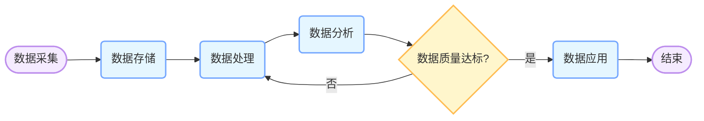

# 构建企业级AI数据治理助手：确保数据质量与一致性

> 关键词：企业级AI、数据治理助手、数据质量、数据一致性、数据管理

> 摘要：本文聚焦于构建企业级AI数据治理助手，深入探讨其在确保数据质量与一致性方面的关键作用。首先介绍了相关背景知识，包括目的、预期读者等内容；接着阐述核心概念与联系，通过文本示意图和Mermaid流程图清晰呈现其原理和架构；详细讲解核心算法原理与具体操作步骤，并结合Python源代码进行说明；深入剖析数学模型和公式，辅以举例加深理解；通过项目实战，展示代码实际案例并进行详细解释；探讨了实际应用场景；推荐了相关工具和资源；最后总结未来发展趋势与挑战，同时给出常见问题解答和扩展阅读参考资料，旨在为企业在AI数据治理领域提供全面且深入的技术指导。

## 1. 背景介绍 
### 1.1 目的和范围
在当今数字化时代，企业积累了海量的数据，这些数据是企业宝贵的资产。然而，数据的质量参差不齐、缺乏一致性等问题严重影响了企业对数据的有效利用，尤其是在AI应用场景下，低质量的数据会导致模型训练不准确，影响决策的科学性。本文章的目的在于提供一个全面的指导，帮助企业构建企业级AI数据治理助手，确保数据质量与一致性，提高企业数据资产的价值。

本文的范围涵盖了企业级AI数据治理助手的核心概念、算法原理、数学模型、项目实战、实际应用场景以及相关工具和资源推荐等方面，旨在为企业提供一个系统的解决方案。

### 1.2 预期读者
本文的预期读者包括企业的CTO、数据管理人员、数据科学家、AI工程师、软件架构师等相关技术和管理人员，以及对企业级AI数据治理感兴趣的研究人员和学者。

### 1.3 文档结构概述
本文将按照以下结构进行阐述：首先介绍背景知识，包括目的、预期读者和文档结构概述等；接着深入讲解核心概念与联系，通过示意图和流程图展示其原理和架构；详细说明核心算法原理与具体操作步骤，并给出Python源代码；分析数学模型和公式，结合实例进行解释；通过项目实战展示代码实际案例并进行详细解读；探讨实际应用场景；推荐相关工具和资源；总结未来发展趋势与挑战；最后给出常见问题解答和扩展阅读参考资料。

### 1.4 术语表
#### 1.4.1 核心术语定义
- **企业级AI**：指企业在其业务流程中广泛应用人工智能技术，以提高效率、创新业务模式和增强竞争力。
- **数据治理助手**：一种自动化工具，用于协助企业进行数据治理，包括数据质量监控、数据一致性维护等功能。
- **数据质量**：指数据满足特定业务需求的程度，包括准确性、完整性、一致性、时效性等方面。
- **数据一致性**：指数据在不同系统、不同业务环节中保持相同或兼容的状态。

#### 1.4.2 相关概念解释
- **数据管理**：对数据的全生命周期进行管理，包括数据的采集、存储、处理、分析和应用等环节。
- **数据清洗**：对原始数据进行预处理，去除噪声、缺失值和重复数据等，提高数据质量。
- **数据标准化**：将数据按照统一的标准进行规范，确保数据的一致性。

#### 1.4.3 缩略词列表
- **ETL**：Extract, Transform, Load（提取、转换、加载）
- **AI**：Artificial Intelligence（人工智能）
- **ML**：Machine Learning（机器学习）
- **BI**：Business Intelligence（商业智能）

## 2. 核心概念与联系 

### 核心概念原理
企业级AI数据治理助手的核心原理是通过对企业数据的全面监控、分析和处理，确保数据的质量和一致性。它主要包括以下几个方面：

- **数据质量评估**：通过定义一系列的数据质量指标，对数据进行评估，如准确性、完整性、一致性等。
- **数据清洗和修复**：根据数据质量评估的结果，对低质量的数据进行清洗和修复，去除噪声、填充缺失值等。
- **数据标准化**：将不同来源、不同格式的数据按照统一的标准进行规范，确保数据的一致性。
- **数据监控和预警**：实时监控数据的变化，当数据质量或一致性出现问题时，及时发出预警。

### 架构的文本示意图
企业级AI数据治理助手的架构主要包括数据采集层、数据存储层、数据处理层、数据分析层和数据应用层。

- **数据采集层**：负责从企业的各个业务系统中采集数据，包括数据库、文件系统、日志文件等。
- **数据存储层**：将采集到的数据存储在数据仓库或数据湖中，为后续的处理和分析提供支持。
- **数据处理层**：对采集到的数据进行清洗、转换和标准化处理，提高数据质量和一致性。
- **数据分析层**：通过数据分析算法，对处理后的数据进行分析，评估数据质量和一致性，并发现潜在的问题。
- **数据应用层**：将分析结果应用到企业的业务流程中，如AI模型训练、决策支持等。

### Mermaid流程图


## 3. 核心算法原理 & 具体操作步骤 

### 核心算法原理
企业级AI数据治理助手的核心算法主要包括数据质量评估算法、数据清洗算法和数据标准化算法。

#### 数据质量评估算法
数据质量评估算法主要用于评估数据的准确性、完整性、一致性等指标。常用的评估方法包括统计分析、规则匹配等。

例如，评估数据的准确性可以通过计算数据的误差率来实现：
```python
def accuracy_evaluation(data, true_data):
    error_count = 0
    total_count = len(data)
    for i in range(total_count):
        if data[i] != true_data[i]:
            error_count += 1
    accuracy = (total_count - error_count) / total_count
    return accuracy
```

#### 数据清洗算法
数据清洗算法主要用于去除噪声、填充缺失值和去除重复数据等。常用的清洗方法包括均值填充、中位数填充、删除重复记录等。

例如，使用均值填充缺失值：
```python
import numpy as np

def mean_imputation(data):
    column_means = np.nanmean(data, axis=0)
    inds = np.where(np.isnan(data))
    data[inds] = np.take(column_means, inds[1])
    return data
```

#### 数据标准化算法
数据标准化算法主要用于将不同来源、不同格式的数据按照统一的标准进行规范。常用的标准化方法包括Z-score标准化、Min-Max标准化等。

例如，使用Z-score标准化：
```python
from sklearn.preprocessing import StandardScaler

def z_score_standardization(data):
    scaler = StandardScaler()
    standardized_data = scaler.fit_transform(data)
    return standardized_data
```

### 具体操作步骤
1. **数据采集**：从企业的各个业务系统中采集数据。
2. **数据存储**：将采集到的数据存储在数据仓库或数据湖中。
3. **数据质量评估**：使用数据质量评估算法对采集到的数据进行评估。
4. **数据清洗**：根据数据质量评估的结果，使用数据清洗算法对低质量的数据进行清洗。
5. **数据标准化**：使用数据标准化算法将清洗后的数据进行标准化处理。
6. **数据监控和预警**：实时监控数据的变化，当数据质量或一致性出现问题时，及时发出预警。
7. **数据应用**：将处理后的数据应用到企业的业务流程中，如AI模型训练、决策支持等。

## 4. 数学模型和公式 & 详细讲解 & 举例说明 

### 数据质量评估数学模型
#### 准确性评估
准确性可以用误差率来衡量，误差率的计算公式为：
$$
\text{误差率} = \frac{\text{错误数据的数量}}{\text{数据的总数量}}
$$
例如，有一组数据 $[1, 2, 3, 4, 5]$，真实数据为 $[1, 2, 3, 4, 6]$，则误差率为：
$$
\text{误差率} = \frac{1}{5} = 0.2
$$

#### 完整性评估
完整性可以用缺失值的比例来衡量，缺失值比例的计算公式为：
$$
\text{缺失值比例} = \frac{\text{缺失值的数量}}{\text{数据的总数量}}
$$
例如，有一组数据 $[1, 2, \text{nan}, 4, 5]$，则缺失值比例为：
$$
\text{缺失值比例} = \frac{1}{5} = 0.2
$$

#### 一致性评估
一致性可以通过计算数据之间的相似度来衡量，常用的相似度计算方法包括余弦相似度、欧几里得距离等。

以余弦相似度为例，余弦相似度的计算公式为：
$$
\text{cosine similarity} = \frac{\mathbf{A} \cdot \mathbf{B}}{\|\mathbf{A}\| \|\mathbf{B}\|}
$$
其中，$\mathbf{A}$ 和 $\mathbf{B}$ 是两个向量，$\cdot$ 表示向量的点积，$\|\mathbf{A}\|$ 和 $\|\mathbf{B}\|$ 分别表示向量 $\mathbf{A}$ 和 $\mathbf{B}$ 的模。

例如，有两个向量 $\mathbf{A} = [1, 2, 3]$ 和 $\mathbf{B} = [4, 5, 6]$，则它们的余弦相似度为：
$$
\begin{align*}
\mathbf{A} \cdot \mathbf{B} &= 1\times4 + 2\times5 + 3\times6 = 32\\
\|\mathbf{A}\| &= \sqrt{1^2 + 2^2 + 3^2} = \sqrt{14}\\
\|\mathbf{B}\| &= \sqrt{4^2 + 5^2 + 6^2} = \sqrt{77}\\
\text{cosine similarity} &= \frac{32}{\sqrt{14} \sqrt{77}} \approx 0.9747
\end{align*}
$$

### 数据标准化数学模型
#### Z-score标准化
Z-score标准化的计算公式为：
$$
z = \frac{x - \mu}{\sigma}
$$
其中，$x$ 是原始数据，$\mu$ 是数据的均值，$\sigma$ 是数据的标准差。

例如，有一组数据 $[1, 2, 3, 4, 5]$，其均值 $\mu = 3$，标准差 $\sigma = \sqrt{2}$，则标准化后的数据为：
$$
\begin{align*}
z_1 &= \frac{1 - 3}{\sqrt{2}} \approx -1.414\\
z_2 &= \frac{2 - 3}{\sqrt{2}} \approx -0.707\\
z_3 &= \frac{3 - 3}{\sqrt{2}} = 0\\
z_4 &= \frac{4 - 3}{\sqrt{2}} \approx 0.707\\
z_5 &= \frac{5 - 3}{\sqrt{2}} \approx 1.414
\end{align*}
$$

#### Min-Max标准化
Min-Max标准化的计算公式为：
$$
x' = \frac{x - \text{min}(x)}{\text{max}(x) - \text{min}(x)}
$$
其中，$x$ 是原始数据，$\text{min}(x)$ 和 $\text{max}(x)$ 分别是数据的最小值和最大值。

例如，有一组数据 $[1, 2, 3, 4, 5]$，其最小值 $\text{min}(x) = 1$，最大值 $\text{max}(x) = 5$，则标准化后的数据为：
$$
\begin{align*}
x_1' &= \frac{1 - 1}{5 - 1} = 0\\
x_2' &= \frac{2 - 1}{5 - 1} = 0.25\\
x_3' &= \frac{3 - 1}{5 - 1} = 0.5\\
x_4' &= \frac{4 - 1}{5 - 1} = 0.75\\
x_5' &= \frac{5 - 1}{5 - 1} = 1
\end{align*}
$$

## 5. 项目实战：代码实际案例和详细解释说明 

### 5.1  开发环境搭建
#### 安装Python
首先，需要安装Python开发环境。可以从Python官方网站（https://www.python.org/downloads/）下载适合自己操作系统的Python版本，并按照安装向导进行安装。

#### 安装必要的库
在项目中，需要使用一些Python库，如`pandas`、`numpy`、`scikit-learn`等。可以使用`pip`命令进行安装：
```sh
pip install pandas numpy scikit-learn
```

### 5.2  源代码详细实现和代码解读
以下是一个简单的企业级AI数据治理助手的代码示例：

```python
import pandas as pd
import numpy as np
from sklearn.preprocessing import StandardScaler

# 数据采集
def data_collection(file_path):
    data = pd.read_csv(file_path)
    return data

# 数据质量评估
def data_quality_evaluation(data):
    # 计算缺失值比例
    missing_ratio = data.isna().sum() / len(data)
    # 计算重复记录数量
    duplicate_count = data.duplicated().sum()
    print(f"缺失值比例: {missing_ratio}")
    print(f"重复记录数量: {duplicate_count}")
    return missing_ratio, duplicate_count

# 数据清洗
def data_cleaning(data):
    # 填充缺失值
    data = data.fillna(data.mean())
    # 去除重复记录
    data = data.drop_duplicates()
    return data

# 数据标准化
def data_standardization(data):
    scaler = StandardScaler()
    numerical_columns = data.select_dtypes(include=[np.number]).columns
    data[numerical_columns] = scaler.fit_transform(data[numerical_columns])
    return data

# 主函数
def main():
    # 数据采集
    file_path = "data.csv"
    data = data_collection(file_path)
    
    # 数据质量评估
    missing_ratio, duplicate_count = data_quality_evaluation(data)
    
    # 数据清洗
    cleaned_data = data_cleaning(data)
    
    # 数据标准化
    standardized_data = data_standardization(cleaned_data)
    
    # 保存处理后的数据
    standardized_data.to_csv("processed_data.csv", index=False)

if __name__ == "__main__":
    main()
```

### 5.3  代码解读与分析
- **数据采集**：`data_collection`函数使用`pandas`库的`read_csv`函数从CSV文件中读取数据。
- **数据质量评估**：`data_quality_evaluation`函数计算数据的缺失值比例和重复记录数量，并打印输出。
- **数据清洗**：`data_cleaning`函数使用均值填充缺失值，并去除重复记录。
- **数据标准化**：`data_standardization`函数使用`StandardScaler`对数值型数据进行Z-score标准化。
- **主函数**：`main`函数依次调用数据采集、数据质量评估、数据清洗和数据标准化函数，并将处理后的数据保存到CSV文件中。

## 6. 实际应用场景 
### 金融行业
在金融行业，数据的质量和一致性对于风险评估、信用评级、投资决策等业务至关重要。企业级AI数据治理助手可以帮助金融机构对客户信息、交易记录等数据进行治理，确保数据的准确性和一致性，提高风险评估的准确性和决策的科学性。

### 医疗行业
在医疗行业，数据的质量和一致性对于疾病诊断、治疗方案制定、医疗研究等业务至关重要。企业级AI数据治理助手可以帮助医疗机构对患者病历、检查报告等数据进行治理，确保数据的完整性和准确性，提高医疗服务的质量和效率。

### 制造业
在制造业，数据的质量和一致性对于生产计划、供应链管理、质量控制等业务至关重要。企业级AI数据治理助手可以帮助制造企业对生产数据、设备运行数据等进行治理，确保数据的及时性和准确性，提高生产效率和产品质量。

## 7. 工具和资源推荐
### 7.1 学习资源推荐
#### 7.1.1 书籍推荐
- 《数据治理：数字化转型的核心驱动力》：全面介绍了数据治理的理论、方法和实践，对企业级数据治理有深入的探讨。
- 《Python数据分析实战》：详细介绍了Python在数据分析领域的应用，包括数据采集、清洗、分析和可视化等方面的内容。
- 《机器学习实战》：通过实际案例介绍了机器学习的算法和应用，对于理解AI数据治理中的机器学习应用有很大帮助。

#### 7.1.2 在线课程
- Coursera上的“Data Science Specialization”：由多所知名大学的教授授课，涵盖了数据科学的各个方面，包括数据治理、数据分析和机器学习等。
- edX上的“Introduction to Data Science”：介绍了数据科学的基本概念、方法和工具，适合初学者学习。
- 阿里云大学的“数据治理与数据质量管理”：结合阿里云的实践经验，介绍了数据治理的流程、方法和工具，具有很强的实践指导意义。

#### 7.1.3 技术博客和网站
- 开源中国（https://www.oschina.net/）：提供了丰富的开源技术资源和技术文章，包括数据治理、AI等领域的内容。
- 博客园（https://www.cnblogs.com/）：有很多技术博主分享数据治理、数据分析和AI等方面的经验和心得。
- 数据派（https://www.datapi.cn/）：专注于数据科学领域，提供了大量的数据治理、数据分析和机器学习等方面的文章和案例。

### 7.2 开发工具框架推荐
#### 7.2.1 IDE和编辑器
- PyCharm：一款专业的Python集成开发环境，具有代码编辑、调试、版本控制等功能，适合Python开发。
- Jupyter Notebook：一个交互式的开发环境，支持多种编程语言，适合数据探索和分析。
- Visual Studio Code：一款轻量级的代码编辑器，支持多种编程语言和插件，具有丰富的扩展功能。

#### 7.2.2 调试和性能分析工具
- PDB：Python自带的调试工具，可以帮助开发者调试Python代码。
- cProfile：Python的性能分析工具，可以分析代码的运行时间和函数调用关系。
- Py-Spy：一个基于采样的Python性能分析工具，可以实时分析Python程序的性能。

#### 7.2.3 相关框架和库
- Pandas：一个强大的数据分析库，提供了数据结构和数据处理工具，适合数据清洗、转换和分析。
- Numpy：一个用于科学计算的库，提供了高效的数组操作和数学函数，适合数值计算和数据分析。
- Scikit-learn：一个机器学习库，提供了各种机器学习算法和工具，适合AI模型训练和评估。

### 7.3 相关论文著作推荐
#### 7.3.1 经典论文
- “Data Governance: Concepts, Strategies, and Best Practices”：介绍了数据治理的基本概念、策略和最佳实践，是数据治理领域的经典论文。
- “A Survey on Data Quality: Definitions, Dimensions, and Metrics”：对数据质量的定义、维度和度量方法进行了全面的综述，为数据质量评估提供了理论基础。
- “Data Standardization in Big Data: A Survey”：对大数据环境下的数据标准化方法进行了综述，为数据标准化提供了参考。

#### 7.3.2 最新研究成果
- 关注顶级学术会议如ACM SIGKDD、IEEE ICDM等的最新论文，了解数据治理和AI领域的最新研究成果。
- 关注知名学术期刊如《Journal of Data and Information Quality》、《Data Mining and Knowledge Discovery》等的最新文章，获取前沿研究信息。

#### 7.3.3 应用案例分析
- 各大企业的技术博客和白皮书，如谷歌、微软、阿里巴巴等公司的技术分享，介绍了他们在数据治理和AI应用方面的实践经验和案例。
- 行业报告和研究机构的分析报告，如Gartner、IDC等机构的报告，对不同行业的数据治理和AI应用进行了深入分析和案例研究。

## 8. 总结：未来发展趋势与挑战
### 未来发展趋势
- **智能化**：企业级AI数据治理助手将越来越智能化，能够自动识别数据质量和一致性问题，并提供相应的解决方案。
- **自动化**：数据治理的流程将越来越自动化，减少人工干预，提高数据治理的效率和准确性。
- **云化**：随着云计算技术的发展，企业级AI数据治理助手将越来越多地部署在云端，实现数据的集中管理和共享。
- **融合化**：数据治理将与AI、大数据、区块链等技术深度融合，实现数据的价值最大化。

### 挑战
- **数据安全和隐私**：在数据治理过程中，需要保护数据的安全和隐私，防止数据泄露和滥用。
- **数据复杂性**：随着企业数据量的不断增加和数据类型的不断丰富，数据的复杂性也在不断提高，给数据治理带来了更大的挑战。
- **技术更新换代快**：AI、大数据等技术更新换代快，需要不断学习和掌握新的技术，以适应数据治理的需求。
- **组织文化和管理**：数据治理需要企业各部门的协同配合，需要改变企业的组织文化和管理模式，提高员工的数据意识和数据管理能力。

## 9. 附录：常见问题与解答
### 1. 企业级AI数据治理助手需要哪些技术基础？
企业级AI数据治理助手需要掌握数据管理、数据分析、机器学习等方面的技术基础，同时还需要了解相关的业务知识。

### 2. 如何评估数据质量评估算法的准确性？
可以使用真实数据进行验证，计算评估结果与真实结果之间的误差率，误差率越小，算法的准确性越高。

### 3. 数据清洗和数据标准化的顺序有要求吗？
一般建议先进行数据清洗，去除噪声和缺失值，再进行数据标准化，确保标准化的效果。

### 4. 企业级AI数据治理助手如何与现有业务系统集成？
可以通过API接口、ETL工具等方式实现企业级AI数据治理助手与现有业务系统的集成，实现数据的共享和交互。

### 5. 如何保证数据治理的效果？
需要建立完善的数据治理体系，包括数据质量评估指标、数据治理流程、数据管理制度等，同时需要不断监控和优化数据治理的效果。

## 10. 扩展阅读 & 参考资料
### 扩展阅读
- 《大数据时代：生活、工作与思维的大变革》：介绍了大数据时代的特点和影响，对于理解数据治理的重要性有很大帮助。
- 《人工智能时代：与机器人共舞》：探讨了人工智能时代的发展趋势和挑战，对于了解AI在数据治理中的应用有一定的启示。
- 《数字化转型：企业如何实现全面数字化升级》：介绍了企业数字化转型的方法和实践，对于企业级AI数据治理助手的应用有指导意义。

### 参考资料
- 各相关技术文档和官方网站，如Python官方文档、Pandas官方文档、Scikit-learn官方文档等。
- 相关学术论文和研究报告，如ACM SIGKDD、IEEE ICDM等会议的论文，Gartner、IDC等机构的研究报告。
- 行业专家的博客和技术文章，如开源中国、博客园等网站上的相关文章。