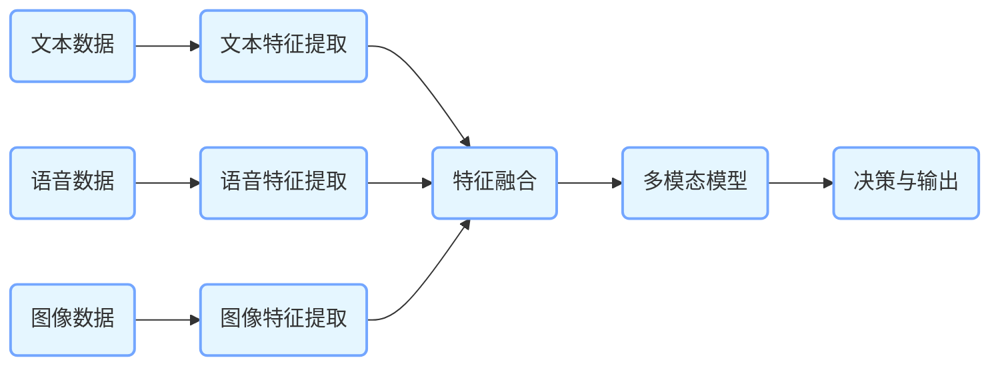

# 构建企业级多模态AI Agent：整合文本、语音与图像

> 关键词：企业级、多模态AI Agent、文本、语音、图像、整合、人工智能

> 摘要：本文聚焦于构建企业级多模态AI Agent，深入探讨整合文本、语音与图像的相关技术与实现方法。首先介绍了该领域的背景知识，包括目的范围、预期读者等内容。接着详细阐述了多模态AI Agent的核心概念、联系以及架构，通过Mermaid流程图进行直观展示。在核心算法原理部分，结合Python源代码进行深入讲解，并给出了相关的数学模型和公式。通过项目实战，展示了代码的实际案例和详细解释。同时分析了多模态AI Agent的实际应用场景，推荐了学习资源、开发工具框架以及相关论文著作。最后对未来发展趋势与挑战进行总结，并给出常见问题与解答以及扩展阅读参考资料，旨在为企业级多模态AI Agent的构建提供全面且深入的技术指导。

## 1. 背景介绍 
### 1.1 目的和范围
在当今数字化快速发展的时代，企业面临着处理多样化数据的挑战和机遇。单一模态的数据处理已经难以满足企业复杂的业务需求。构建企业级多模态AI Agent，整合文本、语音与图像等多种模态的数据，目的在于让AI Agent能够像人类一样综合处理和理解不同类型的信息，从而提供更智能、更全面的服务。

其范围涵盖了多个领域，如客户服务、智能安防、医疗诊断、工业自动化等。在客户服务中，多模态AI Agent可以同时处理客户的文本咨询、语音诉求以及图像反馈，提高服务效率和质量；在智能安防领域，结合图像监控和语音识别，能够更准确地发现安全隐患和异常情况；在医疗诊断中，整合医学图像、病历文本和患者语音描述，有助于医生做出更准确的诊断。

### 1.2 预期读者
本文的预期读者主要包括企业的技术决策者、AI研发工程师、软件架构师、数据科学家以及对多模态人工智能技术感兴趣的研究人员。企业的技术决策者可以从本文中了解构建企业级多模态AI Agent的重要性和潜在价值，为企业的技术战略规划提供参考；AI研发工程师和软件架构师可以获取详细的技术实现方法和架构设计思路，用于实际的项目开发；数据科学家可以深入了解多模态数据的处理和分析方法；对多模态人工智能技术感兴趣的研究人员可以通过本文掌握该领域的最新进展和研究方向。

### 1.3 文档结构概述
本文将按照以下结构进行阐述：首先介绍多模态AI Agent的背景知识，包括目的范围、预期读者等内容。接着详细讲解多模态AI Agent的核心概念、联系以及架构，通过Mermaid流程图进行直观展示。在核心算法原理部分，结合Python源代码进行深入讲解，并给出相关的数学模型和公式。通过项目实战，展示代码的实际案例和详细解释。同时分析多模态AI Agent的实际应用场景，推荐学习资源、开发工具框架以及相关论文著作。最后对未来发展趋势与挑战进行总结，并给出常见问题与解答以及扩展阅读参考资料。

### 1.4 术语表
#### 1.4.1 核心术语定义
- **多模态AI Agent**：一种能够同时处理和理解文本、语音、图像等多种不同模态数据的人工智能实体，通过整合多种模态的信息，实现更智能、更全面的决策和交互。
- **文本模态**：以文字形式存在的数据，如文档、聊天记录、新闻报道等。
- **语音模态**：以声音形式存在的数据，包括人类的语音、环境声音等。
- **图像模态**：以视觉形式存在的数据，如照片、视频帧、医学影像等。
- **特征提取**：从原始数据中提取出具有代表性的特征，以便后续的处理和分析。
- **融合策略**：将不同模态的特征进行整合的方法和策略。

#### 1.4.2 相关概念解释
- **人工智能（AI）**：研究如何使计算机能够模拟人类的智能行为，包括学习、推理、决策等能力。
- **机器学习（ML）**：人工智能的一个分支，通过让计算机从数据中学习模式和规律，从而实现预测和决策。
- **深度学习（DL）**：一种基于神经网络的机器学习方法，通过构建多层神经网络，自动从数据中学习复杂的特征和模式。
- **自然语言处理（NLP）**：处理和分析人类语言的技术，包括文本分类、情感分析、机器翻译等任务。
- **语音识别（ASR）**：将语音信号转换为文本的技术。
- **图像识别（OCR）**：将图像中的文字信息提取出来的技术。

#### 1.4.3 缩略词列表
- **AI**：Artificial Intelligence（人工智能）
- **ML**：Machine Learning（机器学习）
- **DL**：Deep Learning（深度学习）
- **NLP**：Natural Language Processing（自然语言处理）
- **ASR**：Automatic Speech Recognition（自动语音识别）
- **OCR**：Optical Character Recognition（光学字符识别）

## 2. 核心概念与联系 
### 2.1 核心概念原理
多模态AI Agent的核心原理在于整合不同模态的数据，以实现更全面、更准确的信息理解和决策。不同模态的数据包含了不同的信息，例如文本可以提供详细的语义信息，语音可以传达情感和语调信息，图像可以展示视觉特征和场景信息。通过将这些不同模态的数据进行融合，可以充分发挥各种模态的优势，弥补单一模态的局限性。

多模态数据的融合通常分为三个层次：特征级融合、决策级融合和中间级融合。特征级融合是在提取不同模态的特征后，直接将这些特征进行拼接或组合，形成一个统一的特征向量；决策级融合是先对不同模态的数据分别进行处理和决策，然后将这些决策结果进行综合；中间级融合则是在特征提取和决策之间的某个中间阶段进行融合。

### 2.2 架构示意图
下面是一个简单的多模态AI Agent架构示意图：



该架构的工作流程如下：首先，分别对文本、语音和图像数据进行特征提取。然后，将提取的特征进行融合，得到一个统一的多模态特征表示。接着，将这个多模态特征输入到多模态模型中进行处理和分析。最后，根据模型的输出进行决策，并输出最终的结果。

## 3. 核心算法原理 & 具体操作步骤 
### 3.1 文本特征提取算法
在文本特征提取方面，常用的算法有词袋模型（Bag of Words）、词嵌入（Word Embedding）等。这里以词嵌入中的Word2Vec算法为例进行讲解。

Word2Vec是一种将词语转换为向量表示的算法，它可以将词语的语义信息编码到向量中。下面是一个使用Python和`gensim`库实现Word2Vec的示例代码：

```python
from gensim.models import Word2Vec
import numpy as np

# 示例文本数据
sentences = [['this', 'is', 'the', 'first', 'sentence', 'for', 'word2vec'],
             ['this', 'is', 'the', 'second', 'sentence'],
             ['yet', 'another', 'sentence'],
             ['one', 'more', 'sentence'],
             ['and', 'the', 'final', 'sentence']]

# 训练Word2Vec模型
model = Word2Vec(sentences, min_count=1)

# 获取词语的向量表示
vector = model.wv['sentence']
print(vector)
```

### 3.2 语音特征提取算法
语音特征提取常用的算法有梅尔频率倒谱系数（MFCC）、线性预测倒谱系数（LPCC）等。这里以MFCC为例进行讲解。

MFCC是一种广泛应用于语音信号处理的特征提取方法，它可以将语音信号转换为一组特征向量，这些特征向量能够很好地反映语音的频谱特性。下面是一个使用Python和`librosa`库实现MFCC特征提取的示例代码：

```python
import librosa
import librosa.display
import numpy as np
import matplotlib.pyplot as plt

# 加载语音文件
audio_path = 'example.wav'
y, sr = librosa.load(audio_path)

# 提取MFCC特征
mfccs = librosa.feature.mfcc(y=y, sr=sr)

# 可视化MFCC特征
plt.figure(figsize=(10, 4))
librosa.display.specshow(mfccs, x_axis='time')
plt.colorbar()
plt.title('MFCC')
plt.tight_layout()
plt.show()
```

### 3.3 图像特征提取算法
图像特征提取常用的算法有SIFT（尺度不变特征变换）、HOG（方向梯度直方图）、卷积神经网络（CNN）等。这里以CNN为例进行讲解。

CNN是一种专门用于处理图像数据的神经网络，它可以自动从图像中提取出具有代表性的特征。下面是一个使用Python和`torchvision`库实现简单CNN图像特征提取的示例代码：

```python
import torch
import torchvision.models as models
import torchvision.transforms as transforms
from PIL import Image

# 加载预训练的ResNet模型
model = models.resnet18(pretrained=True)
model.eval()

# 定义图像预处理步骤
preprocess = transforms.Compose([
    transforms.Resize(256),
    transforms.CenterCrop(224),
    transforms.ToTensor(),
    transforms.Normalize(mean=[0.485, 0.456, 0.406], std=[0.229, 0.224, 0.225])
])

# 加载图像
image_path = 'example.jpg'
image = Image.open(image_path)
input_tensor = preprocess(image)
input_batch = input_tensor.unsqueeze(0)

# 提取图像特征
with torch.no_grad():
    features = model(input_batch)

print(features.shape)
```

### 3.4 特征融合算法
特征融合的方法有很多种，这里以简单的拼接融合为例进行讲解。假设我们已经提取了文本、语音和图像的特征向量，下面是一个将这些特征向量进行拼接融合的示例代码：

```python
import numpy as np

# 假设这是文本、语音和图像的特征向量
text_feature = np.random.rand(100)
speech_feature = np.random.rand(100)
image_feature = np.random.rand(100)

# 拼接融合
combined_feature = np.concatenate((text_feature, speech_feature, image_feature))

print(combined_feature.shape)
```

### 3.5 多模态模型训练
在得到融合后的特征向量后，我们可以使用这些特征向量来训练多模态模型。这里以简单的全连接神经网络为例进行讲解。

```python
import torch
import torch.nn as nn
import torch.optim as optim

# 定义多模态模型
class MultiModalModel(nn.Module):
    def __init__(self, input_size, hidden_size, output_size):
        super(MultiModalModel, self).__init__()
        self.fc1 = nn.Linear(input_size, hidden_size)
        self.relu = nn.ReLU()
        self.fc2 = nn.Linear(hidden_size, output_size)

    def forward(self, x):
        out = self.fc1(x)
        out = self.relu(out)
        out = self.fc2(out)
        return out

# 初始化模型
input_size = 300  # 拼接后的特征向量维度
hidden_size = 128
output_size = 10  # 假设是10分类任务
model = MultiModalModel(input_size, hidden_size, output_size)

# 定义损失函数和优化器
criterion = nn.CrossEntropyLoss()
optimizer = optim.Adam(model.parameters(), lr=0.001)

# 模拟训练数据
num_samples = 100
train_data = torch.randn(num_samples, input_size)
train_labels = torch.randint(0, output_size, (num_samples,))

# 训练模型
num_epochs = 10
for epoch in range(num_epochs):
    outputs = model(train_data)
    loss = criterion(outputs, train_labels)

    optimizer.zero_grad()
    loss.backward()
    optimizer.step()

    print(f'Epoch [{epoch+1}/{num_epochs}], Loss: {loss.item():.4f}')
```

## 4. 数学模型和公式 & 详细讲解 & 举例说明 
### 4.1 词嵌入的数学模型
词嵌入的数学模型可以用一个映射函数 $f: V \rightarrow \mathbb{R}^d$ 来表示，其中 $V$ 是词汇表，$\mathbb{R}^d$ 是 $d$ 维的向量空间。Word2Vec的目标是学习这个映射函数，使得具有相似语义的词语在向量空间中距离相近。

Word2Vec有两种主要的模型架构：连续词袋模型（CBOW）和跳字模型（Skip-gram）。

#### 4.1.1 连续词袋模型（CBOW）
CBOW模型的目标是根据上下文词语预测中心词语。假设上下文词语的向量表示为 $x_1, x_2, \cdots, x_{2c}$（其中 $c$ 是上下文窗口的大小），中心词语的向量表示为 $y$。CBOW模型的预测概率可以表示为：

$$P(y|x_1, x_2, \cdots, x_{2c}) = \frac{\exp(u_y^T \cdot \text{avg}(x_1, x_2, \cdots, x_{2c}))}{\sum_{j=1}^{|V|} \exp(u_j^T \cdot \text{avg}(x_1, x_2, \cdots, x_{2c}))}$$

其中 $u_y$ 是中心词语 $y$ 的输出向量，$\text{avg}(x_1, x_2, \cdots, x_{2c})$ 是上下文词语向量的平均值。

#### 4.1.2 跳字模型（Skip-gram）
Skip-gram模型的目标是根据中心词语预测上下文词语。假设中心词语的向量表示为 $x$，上下文词语的向量表示为 $y_1, y_2, \cdots, y_{2c}$。Skip-gram模型的预测概率可以表示为：

$$P(y_1, y_2, \cdots, y_{2c}|x) = \prod_{i=1}^{2c} \frac{\exp(u_{y_i}^T \cdot x)}{\sum_{j=1}^{|V|} \exp(u_j^T \cdot x)}$$

其中 $u_{y_i}$ 是上下文词语 $y_i$ 的输出向量。

### 4.2 梅尔频率倒谱系数（MFCC）的数学模型
MFCC的计算步骤如下：

1. **预处理**：对语音信号进行分帧、加窗等预处理操作。
2. **快速傅里叶变换（FFT）**：对每一帧语音信号进行FFT，得到其频谱。
3. **梅尔滤波器组**：将频谱通过一组梅尔滤波器组，得到梅尔频谱。
4. **对数运算**：对梅尔频谱取对数。
5. **离散余弦变换（DCT）**：对取对数后的梅尔频谱进行DCT，得到MFCC系数。

MFCC的数学公式可以表示为：

$$c_m = \sum_{k=0}^{K-1} \log(S(k)) \cdot \cos\left[\frac{\pi m}{K} \left(k + \frac{1}{2}\right)\right]$$

其中 $c_m$ 是第 $m$ 个MFCC系数，$S(k)$ 是第 $k$ 个梅尔滤波器的输出，$K$ 是梅尔滤波器的数量。

### 4.3 卷积神经网络（CNN）的数学模型
CNN的核心操作是卷积操作。假设输入图像为 $X$，卷积核为 $W$，卷积操作的输出为 $Y$，则卷积操作可以表示为：

$$Y(i, j) = \sum_{m=0}^{M-1} \sum_{n=0}^{N-1} X(i + m, j + n) \cdot W(m, n)$$

其中 $M$ 和 $N$ 是卷积核的大小，$i$ 和 $j$ 是输出特征图的位置。

在卷积层之后，通常会进行池化操作，池化操作的目的是降低特征图的维度。常用的池化操作有最大池化和平均池化。最大池化的数学公式可以表示为：

$$Y(i, j) = \max_{m=0}^{M-1} \max_{n=0}^{N-1} X(i \cdot s + m, j \cdot s + n)$$

其中 $s$ 是池化窗口的步长。

### 4.4 特征融合的数学模型
特征融合的方法有很多种，这里以拼接融合为例。假设我们有三个特征向量 $x_1 \in \mathbb{R}^{d_1}$，$x_2 \in \mathbb{R}^{d_2}$ 和 $x_3 \in \mathbb{R}^{d_3}$，拼接融合后的特征向量 $x \in \mathbb{R}^{d_1 + d_2 + d_3}$ 可以表示为：

$$x = [x_1; x_2; x_3]$$

其中 $[;]$ 表示向量的拼接操作。

### 4.5 多模态模型的数学模型
以全连接神经网络为例，假设输入特征向量为 $x \in \mathbb{R}^d$，隐藏层的权重矩阵为 $W_1 \in \mathbb{R}^{h \times d}$，偏置向量为 $b_1 \in \mathbb{R}^h$，输出层的权重矩阵为 $W_2 \in \mathbb{R}^{o \times h}$，偏置向量为 $b_2 \in \mathbb{R}^o$，则全连接神经网络的输出 $y \in \mathbb{R}^o$ 可以表示为：

$$h = \text{ReLU}(W_1 \cdot x + b_1)$$
$$y = W_2 \cdot h + b_2$$

其中 $\text{ReLU}(z) = \max(0, z)$ 是ReLU激活函数。

## 5. 项目实战：代码实际案例和详细解释说明 
### 5.1  开发环境搭建
#### 5.1.1 操作系统
推荐使用Ubuntu 18.04及以上版本或Windows 10及以上版本。

#### 5.1.2 编程语言和库
- **Python**：推荐使用Python 3.7及以上版本。
- **深度学习框架**：推荐使用PyTorch或TensorFlow。
- **数据处理库**：推荐使用`numpy`、`pandas`等。
- **图像和语音处理库**：推荐使用`torchvision`、`librosa`、`opencv-python`等。
- **自然语言处理库**：推荐使用`gensim`、`nltk`等。

#### 5.1.3 安装步骤
以下是在Ubuntu系统上安装所需库的示例命令：

```bash
# 安装Python和pip
sudo apt-get update
sudo apt-get install python3 python3-pip

# 安装深度学习框架
pip3 install torch torchvision

# 安装数据处理库
pip3 install numpy pandas

# 安装图像和语音处理库
pip3 install librosa opencv-python

# 安装自然语言处理库
pip3 install gensim nltk
```

### 5.2  源代码详细实现和代码解读
#### 5.2.1 数据准备
首先，我们需要准备文本、语音和图像数据。假设我们有一个包含文本、语音和图像的数据集，我们可以使用以下代码来加载和预处理数据：

```python
import os
import numpy as np
import librosa
from PIL import Image
import torchvision.transforms as transforms

# 定义数据路径
text_data_path = 'data/text'
speech_data_path = 'data/speech'
image_data_path = 'data/image'

# 定义图像预处理步骤
image_transform = transforms.Compose([
    transforms.Resize(256),
    transforms.CenterCrop(224),
    transforms.ToTensor(),
    transforms.Normalize(mean=[0.485, 0.456, 0.406], std=[0.229, 0.224, 0.225])
])

# 加载文本数据
text_files = os.listdir(text_data_path)
text_data = []
for file in text_files:
    with open(os.path.join(text_data_path, file), 'r') as f:
        text = f.read()
        text_data.append(text)

# 加载语音数据
speech_files = os.listdir(speech_data_path)
speech_data = []
for file in speech_files:
    audio_path = os.path.join(speech_data_path, file)
    y, sr = librosa.load(audio_path)
    mfccs = librosa.feature.mfcc(y=y, sr=sr)
    speech_data.append(mfccs.flatten())

# 加载图像数据
image_files = os.listdir(image_data_path)
image_data = []
for file in image_files:
    image_path = os.path.join(image_data_path, file)
    image = Image.open(image_path)
    input_tensor = image_transform(image)
    image_data.append(input_tensor.numpy().flatten())

# 合并数据
data = []
for i in range(len(text_data)):
    combined_data = np.concatenate((text_data[i], speech_data[i], image_data[i]))
    data.append(combined_data)

data = np.array(data)
```

#### 5.2.2 特征提取和融合
接下来，我们可以使用前面介绍的特征提取和融合算法对数据进行处理：

```python
from gensim.models import Word2Vec
import torch
import torchvision.models as models

# 文本特征提取
sentences = [text.split() for text in text_data]
model = Word2Vec(sentences, min_count=1)
text_features = []
for sentence in sentences:
    vectors = [model.wv[word] for word in sentence if word in model.wv]
    if vectors:
        text_feature = np.mean(vectors, axis=0)
    else:
        text_feature = np.zeros(model.vector_size)
    text_features.append(text_feature)

# 图像特征提取
image_model = models.resnet18(pretrained=True)
image_model.eval()
image_features = []
for image in image_data:
    input_tensor = torch.tensor(image).unsqueeze(0)
    with torch.no_grad():
        feature = image_model(input_tensor)
    image_features.append(feature.numpy().flatten())

# 特征融合
features = []
for i in range(len(text_features)):
    combined_feature = np.concatenate((text_features[i], speech_features[i], image_features[i]))
    features.append(combined_feature)

features = np.array(features)
```

#### 5.2.3 多模态模型训练
最后，我们可以使用融合后的特征向量来训练多模态模型：

```python
import torch
import torch.nn as nn
import torch.optim as optim

# 定义多模态模型
class MultiModalModel(nn.Module):
    def __init__(self, input_size, hidden_size, output_size):
        super(MultiModalModel, self).__init__()
        self.fc1 = nn.Linear(input_size, hidden_size)
        self.relu = nn.ReLU()
        self.fc2 = nn.Linear(hidden_size, output_size)

    def forward(self, x):
        out = self.fc1(x)
        out = self.relu(out)
        out = self.fc2(out)
        return out

# 初始化模型
input_size = features.shape[1]
hidden_size = 128
output_size = 10  # 假设是10分类任务
model = MultiModalModel(input_size, hidden_size, output_size)

# 定义损失函数和优化器
criterion = nn.CrossEntropyLoss()
optimizer = optim.Adam(model.parameters(), lr=0.001)

# 模拟训练数据
labels = torch.randint(0, output_size, (features.shape[0],))
train_data = torch.tensor(features, dtype=torch.float32)

# 训练模型
num_epochs = 10
for epoch in range(num_epochs):
    outputs = model(train_data)
    loss = criterion(outputs, labels)

    optimizer.zero_grad()
    loss.backward()
    optimizer.step()

    print(f'Epoch [{epoch+1}/{num_epochs}], Loss: {loss.item():.4f}')
```

### 5.3  代码解读与分析
#### 5.3.1 数据准备部分
在数据准备部分，我们首先定义了文本、语音和图像数据的路径。然后，分别使用不同的方法加载和预处理这些数据。对于文本数据，我们直接读取文件内容；对于语音数据，我们使用`librosa`库提取MFCC特征；对于图像数据，我们使用`torchvision`库进行预处理。最后，将三种模态的数据合并成一个数据集。

#### 5.3.2 特征提取和融合部分
在特征提取和融合部分，我们使用Word2Vec算法提取文本特征，使用预训练的ResNet模型提取图像特征。然后，将文本、语音和图像的特征向量进行拼接融合，得到一个统一的特征向量。

#### 5.3.3 多模态模型训练部分
在多模态模型训练部分，我们定义了一个简单的全连接神经网络作为多模态模型。然后，使用交叉熵损失函数和Adam优化器对模型进行训练。在训练过程中，我们不断更新模型的参数，使得模型的损失逐渐减小。

## 6. 实际应用场景 
### 6.1 客户服务
在客户服务领域，多模态AI Agent可以同时处理客户的文本咨询、语音诉求以及图像反馈。例如，客户在咨询产品问题时，可以通过文字描述问题，也可以通过语音详细说明，还可以上传相关的产品图片。多模态AI Agent可以综合分析这些信息，快速准确地理解客户的需求，并提供相应的解决方案。这样可以提高客户服务的效率和质量，提升客户满意度。

### 6.2 智能安防
在智能安防领域，多模态AI Agent可以结合图像监控和语音识别技术，实现更全面的安全监控。例如，通过监控摄像头获取的图像信息，可以识别出人员的行为和特征；通过语音识别技术，可以监听环境中的声音，判断是否存在异常情况。多模态AI Agent可以将这些信息进行融合分析，及时发现安全隐患，并发出警报。

### 6.3 医疗诊断
在医疗诊断领域，多模态AI Agent可以整合医学图像、病历文本和患者语音描述等信息，辅助医生进行诊断。例如，通过医学图像（如X光、CT等）可以观察患者的身体结构和病变情况；通过病历文本可以了解患者的病史和症状；通过患者的语音描述可以获取更多的细节信息。多模态AI Agent可以对这些信息进行综合分析，为医生提供更准确的诊断建议。

### 6.4 工业自动化
在工业自动化领域，多模态AI Agent可以处理生产线上的图像、语音和文本数据，实现智能生产和质量控制。例如，通过图像识别技术可以检测产品的外观缺陷；通过语音识别技术可以监听设备的运行声音，判断设备是否正常运行；通过文本数据可以记录生产过程中的相关信息。多模态AI Agent可以将这些信息进行融合分析，优化生产流程，提高生产效率和产品质量。

## 7. 工具和资源推荐
### 7.1 学习资源推荐
#### 7.1.1 书籍推荐
- 《深度学习》（Deep Learning）：由Ian Goodfellow、Yoshua Bengio和Aaron Courville所著，是深度学习领域的经典教材，涵盖了深度学习的基本概念、算法和应用。
- 《Python自然语言处理》（Natural Language Processing with Python）：由Steven Bird、Ewan Klein和Edward Loper所著，介绍了使用Python进行自然语言处理的方法和技术。
- 《计算机视觉：算法与应用》（Computer Vision: Algorithms and Applications）：由Richard Szeliski所著，全面介绍了计算机视觉的基本算法和应用。

#### 7.1.2 在线课程
- Coursera上的“深度学习专项课程”（Deep Learning Specialization）：由Andrew Ng教授主讲，包括深度学习的基础、卷积神经网络、循环神经网络等内容。
- edX上的“人工智能基础”（Fundamentals of Artificial Intelligence）：介绍了人工智能的基本概念、算法和应用。
- Udemy上的“自然语言处理实战”（Natural Language Processing in Python）：通过实际案例介绍了自然语言处理的方法和技术。

#### 7.1.3 技术博客和网站
- Medium：上面有很多关于人工智能、深度学习、自然语言处理等领域的技术博客和文章。
- arXiv：一个预印本平台，提供了大量的最新研究论文。
- Towards Data Science：专注于数据科学和人工智能领域的技术博客，有很多实用的教程和案例。

### 7.2 开发工具框架推荐
#### 7.2.1 IDE和编辑器
- PyCharm：一款专业的Python集成开发环境，提供了丰富的功能和插件，方便Python代码的开发和调试。
- Jupyter Notebook：一种交互式的开发环境，适合进行数据探索和模型实验。
- Visual Studio Code：一款轻量级的代码编辑器，支持多种编程语言和插件，具有强大的代码编辑和调试功能。

#### 7.2.2 调试和性能分析工具
- TensorBoard：TensorFlow的可视化工具，可以用于可视化模型的训练过程、性能指标等。
- PyTorch Profiler：PyTorch的性能分析工具，可以帮助开发者找出代码中的性能瓶颈。
- cProfile：Python的内置性能分析工具，可以分析Python代码的执行时间和函数调用情况。

#### 7.2.3 相关框架和库
- PyTorch：一个开源的深度学习框架，提供了丰富的神经网络模型和工具，易于使用和扩展。
- TensorFlow：一个广泛使用的深度学习框架，具有强大的分布式训练和部署能力。
- Hugging Face Transformers：一个用于自然语言处理的开源库，提供了大量的预训练模型和工具。
- OpenCV：一个开源的计算机视觉库，提供了丰富的图像处理和计算机视觉算法。

### 7.3 相关论文著作推荐
#### 7.3.1 经典论文
- “Attention Is All You Need”：提出了Transformer架构，是自然语言处理领域的重要突破。
- “ImageNet Classification with Deep Convolutional Neural Networks”：介绍了AlexNet模型，开启了深度学习在计算机视觉领域的热潮。
- “Deep Residual Learning for Image Recognition”：提出了ResNet模型，解决了深度神经网络训练中的梯度消失问题。

#### 7.3.2 最新研究成果
- 关注顶级学术会议如NeurIPS、ICML、CVPR、ACL等的最新论文，了解多模态人工智能领域的最新研究进展。
- 关注知名学术期刊如Journal of Artificial Intelligence Research (JAIR)、Artificial Intelligence等的相关研究论文。

#### 7.3.3 应用案例分析
- 查看一些企业和研究机构发布的多模态人工智能应用案例，了解实际应用中的技术实现和挑战解决方法。
- 参考一些开源项目的文档和代码，学习如何将多模态人工智能技术应用到实际项目中。

## 8. 总结：未来发展趋势与挑战
### 8.1 未来发展趋势
#### 8.1.1 更强大的多模态融合技术
未来，多模态融合技术将不断发展和完善，能够更有效地整合不同模态的数据，挖掘出更多的信息和价值。例如，通过更复杂的深度学习模型和算法，实现更细粒度的多模态特征融合，提高多模态AI Agent的性能和智能水平。

#### 8.1.2 跨领域应用的拓展
多模态AI Agent将在更多的领域得到应用，如教育、金融、娱乐等。在教育领域，多模态AI Agent可以根据学生的文本作业、语音回答和表情图像等信息，提供个性化的学习建议和辅导；在金融领域，多模态AI Agent可以结合文本新闻、语音财报和图像图表等信息，进行风险评估和投资决策；在娱乐领域，多模态AI Agent可以根据用户的语音指令、表情和手势等信息，提供个性化的娱乐内容推荐。

#### 8.1.3 与物联网的深度融合
随着物联网技术的发展，多模态AI Agent将与物联网设备深度融合，实现更智能的环境感知和交互。例如，通过物联网设备收集的各种传感器数据（如温度、湿度、光照等）和图像、语音数据，多模态AI Agent可以对环境进行全面的监测和分析，实现智能家居、智能城市等应用。

### 8.2 挑战
#### 8.2.1 数据的获取和标注
多模态数据的获取和标注是一个挑战。不同模态的数据来源不同，格式也不同，需要进行复杂的预处理和整合。同时，多模态数据的标注也比较困难，需要专业的知识和大量的人力物力。

#### 8.2.2 计算资源的需求
多模态AI Agent的训练和推理需要大量的计算资源。随着模型的不断复杂和数据量的不断增加，对计算资源的需求也越来越高。如何在有限的计算资源下，提高多模态AI Agent的性能和效率，是一个亟待解决的问题。

#### 8.2.3 模型的可解释性
多模态AI Agent的模型通常比较复杂，缺乏可解释性。在一些关键领域，如医疗诊断、金融决策等，模型的可解释性非常重要。如何提高多模态AI Agent模型的可解释性，让人们能够理解模型的决策过程和依据，是一个需要解决的问题。

#### 8.2.4 隐私和安全问题
多模态数据包含了大量的个人信息和敏感信息，如语音、图像、文本等。如何保护这些数据的隐私和安全，防止数据泄露和滥用，是一个重要的挑战。

## 9. 附录：常见问题与解答
### 9.1 多模态AI Agent与传统AI系统有什么区别？
多模态AI Agent能够同时处理和理解文本、语音、图像等多种不同模态的数据，而传统AI系统通常只能处理单一模态的数据。多模态AI Agent可以综合利用不同模态的数据信息，提供更全面、更准确的决策和交互，具有更高的智能水平。

### 9.2 如何选择合适的特征融合方法？
选择合适的特征融合方法需要考虑多个因素，如数据的特点、任务的需求、模型的复杂度等。一般来说，如果不同模态的数据之间存在较强的相关性，可以选择特征级融合方法；如果不同模态的数据之间相关性较弱，可以选择决策级融合方法。此外，还可以根据实验结果来选择最适合的特征融合方法。

### 9.3 多模态AI Agent的训练时间和计算资源需求如何？
多模态AI Agent的训练时间和计算资源需求通常比较高，这主要取决于模型的复杂度、数据量的大小以及硬件设备的性能。为了减少训练时间和计算资源需求，可以采用一些优化方法，如使用预训练模型、分布式训练、模型压缩等。

### 9.4 如何评估多模态AI Agent的性能？
评估多模态AI Agent的性能可以采用多种指标，如准确率、召回率、F1值、均方误差等。具体的评估指标需要根据任务的类型和需求来选择。此外，还可以通过用户反馈和实际应用效果来评估多模态AI Agent的性能。

### 9.5 多模态AI Agent在实际应用中可能会遇到哪些问题？
多模态AI Agent在实际应用中可能会遇到数据质量问题、计算资源限制问题、模型可解释性问题、隐私和安全问题等。为了解决这些问题，需要采用相应的技术和方法，如数据预处理、优化算法、模型解释技术、数据加密等。

## 10. 扩展阅读 & 参考资料
### 10.1 扩展阅读
- 《多模态机器学习：综述与分类》（Multimodal Machine Learning: A Survey and Taxonomy）：对多模态机器学习的方法和技术进行了全面的综述和分类。
- 《多模态深度学习》（Multimodal Deep Learning）：介绍了多模态深度学习的基本概念、算法和应用。
- 《人工智能：一种现代方法》（Artificial Intelligence: A Modern Approach）：是人工智能领域的经典教材，涵盖了人工智能的各个方面。

### 10.2 参考资料
- 相关学术论文和研究报告，可以从IEEE Xplore、ACM Digital Library、Google Scholar等学术数据库中获取。
- 开源项目的文档和代码，如GitHub上的相关项目。
- 官方文档和教程，如PyTorch、TensorFlow等深度学习框架的官方文档。