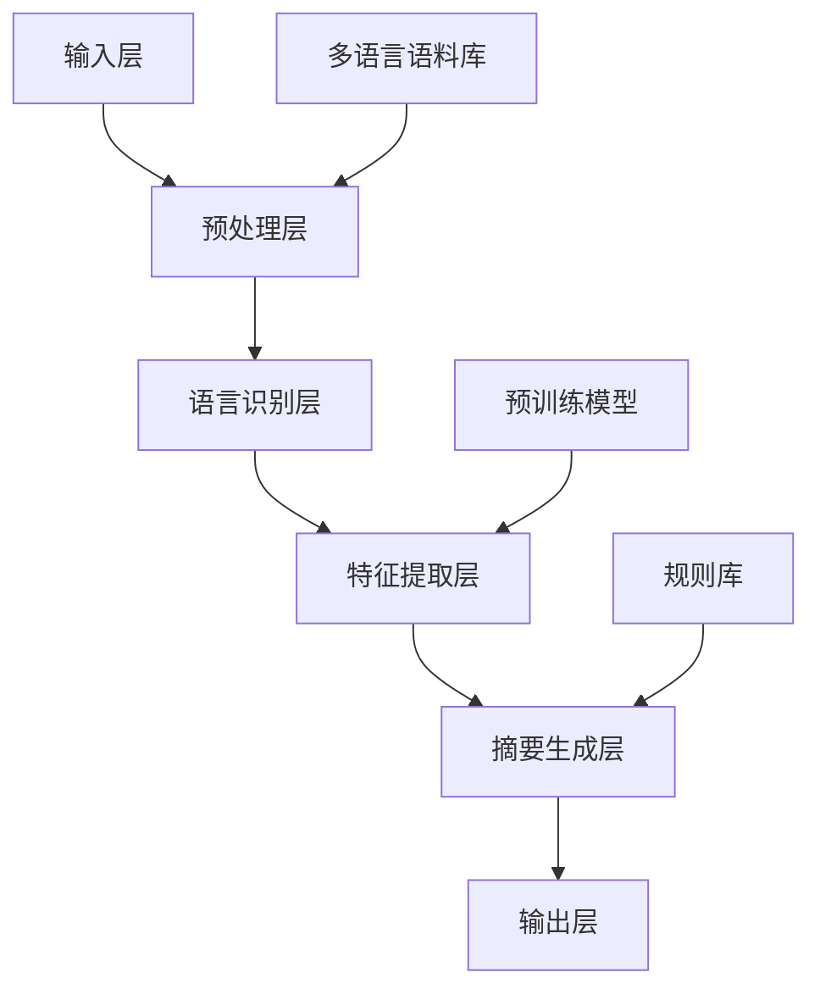

# 构建企业级多语言文本摘要系统：自动生成报告摘要

> 关键词：企业级、多语言、文本摘要系统、自动生成、报告摘要

> 摘要：本文聚焦于构建企业级多语言文本摘要系统，旨在实现报告摘要的自动生成。随着企业全球化发展，处理多语言文本的需求日益增长，手动提取摘要效率低下且容易出错。本系统将综合运用自然语言处理、机器学习等技术，支持多种语言的文本输入，自动提炼出关键信息作为摘要。文章将详细介绍系统的背景、核心概念、算法原理、数学模型、项目实战、实际应用场景、工具资源推荐等内容，最后探讨系统未来的发展趋势与挑战，为企业构建高效的多语言文本摘要系统提供全面的技术指导。

## 1. 背景介绍 
### 1.1 目的和范围
在当今全球化的商业环境中，企业面临着大量来自不同地区、使用不同语言的文本数据，如市场调研报告、行业分析报告、客户反馈等。这些文本通常篇幅较长，手动阅读和提取关键信息不仅耗时费力，而且容易遗漏重要内容。因此，构建一个企业级多语言文本摘要系统，自动生成报告摘要，对于提高企业信息处理效率、辅助决策具有重要意义。

本系统的范围涵盖多种常见语言，包括但不限于英语、中文、法语、德语、西班牙语等。能够处理不同类型的文本，如新闻报道、学术论文、商务文档等，生成准确、简洁的摘要。

### 1.2 预期读者
本文的预期读者包括企业的信息技术部门人员、自然语言处理开发者、数据科学家、对文本摘要技术感兴趣的研究人员等。对于希望提升企业文本处理能力、优化信息流程的企业管理者也具有一定的参考价值。

### 1.3 文档结构概述
本文将按照以下结构进行阐述：首先介绍系统的背景信息，包括目的、预期读者和文档结构概述；接着详细讲解核心概念与联系，包括文本摘要的原理和系统架构；然后深入探讨核心算法原理和具体操作步骤，并用 Python 代码进行详细阐述；随后介绍数学模型和公式，并通过举例说明；再通过项目实战展示代码实际案例和详细解释；之后介绍系统的实际应用场景；接着推荐相关的工具和资源；最后总结系统的未来发展趋势与挑战，并提供常见问题与解答以及扩展阅读和参考资料。

### 1.4 术语表
#### 1.4.1 核心术语定义
- **文本摘要**：从原始文本中提取关键信息，生成简洁、连贯的短文本，以概括原始文本的主要内容。
- **多语言处理**：系统能够处理多种不同语言的文本，考虑到不同语言的语法、词汇、语义等特点。
- **企业级**：适用于企业环境，具有高可靠性、可扩展性、安全性等特点，能够满足企业大规模数据处理和业务需求。
- **自动生成**：系统无需人工干预，通过预设的算法和模型，自动对输入的文本进行处理并生成摘要。

#### 1.4.2 相关概念解释
- **自然语言处理（NLP）**：是计算机科学与语言学的交叉领域，旨在让计算机理解、处理和生成人类语言。文本摘要系统是自然语言处理的一个重要应用方向。
- **机器学习**：是一门多领域交叉学科，涉及概率论、统计学、逼近论、凸分析、算法复杂度理论等多门学科。在文本摘要系统中，机器学习算法可以用于训练模型，自动学习文本的特征和规律。
- **深度学习**：是机器学习的一个分支领域，它试图从数据中学习高级抽象的特征表示。在文本摘要中，深度学习模型如循环神经网络（RNN）、长短期记忆网络（LSTM）、Transformer 等被广泛应用。

#### 1.4.3 缩略词列表
- **NLP**：Natural Language Processing（自然语言处理）
- **RNN**：Recurrent Neural Network（循环神经网络）
- **LSTM**：Long Short-Term Memory（长短期记忆网络）
- **BERT**：Bidirectional Encoder Representations from Transformers（基于 Transformer 的双向编码器表示）

## 2. 核心概念与联系 

### 文本摘要的原理
文本摘要的基本原理是从原始文本中选择或生成最重要的信息，以简洁的形式呈现。主要分为抽取式摘要和生成式摘要两种方法。

- **抽取式摘要**：从原始文本中直接提取关键句子或短语作为摘要。这种方法通常基于文本的特征，如句子的位置、关键词的频率、句子的重要性得分等进行筛选。例如，在一篇新闻报道中，开头的句子往往包含了最重要的信息，因此可以优先选择。
- **生成式摘要**：通过对原始文本的理解和分析，生成全新的句子来概括文本的主要内容。生成式摘要需要更深入的语言理解和生成能力，通常使用深度学习模型来实现。

### 系统架构
企业级多语言文本摘要系统的架构主要包括以下几个部分：



- **输入层**：接收用户输入的多语言文本数据，可以是文件、数据库记录、网络请求等形式。
- **预处理层**：对输入的文本进行清洗、分词、去除停用词等操作，为后续处理做准备。同时，利用多语言语料库对文本进行标准化处理。
- **语言识别层**：确定输入文本的语言类型，以便后续选择合适的模型和规则进行处理。
- **特征提取层**：提取文本的特征，如词向量、句向量等。可以使用预训练模型（如 BERT）来获取文本的语义表示。
- **摘要生成层**：根据提取的特征，使用抽取式或生成式方法生成摘要。可以结合规则库来优化摘要的质量。
- **输出层**：将生成的摘要输出给用户，可以是文本形式、文件形式或存储到数据库中。

## 3. 核心算法原理 & 具体操作步骤 

### 抽取式摘要算法 - TextRank
TextRank 是一种基于图的排序算法，用于抽取式文本摘要。其基本思想是将文本中的句子看作图中的节点，句子之间的相似度作为边的权重，通过迭代计算节点的重要性得分，选择得分高的句子作为摘要。

以下是使用 Python 实现 TextRank 算法的代码：

```python
import numpy as np
import networkx as nx
from sklearn.feature_extraction.text import TfidfVectorizer

def text_rank_summary(text, num_sentences=3):
    # 分句
    sentences = text.split('. ')
    
    # 计算句子的 TF-IDF 特征
    vectorizer = TfidfVectorizer()
    sentence_vectors = vectorizer.fit_transform(sentences)
    
    # 构建相似度矩阵
    similarity_matrix = np.zeros((len(sentences), len(sentences)))
    for i in range(len(sentences)):
        for j in range(len(sentences)):
            if i != j:
                similarity_matrix[i][j] = np.dot(sentence_vectors[i].toarray()[0], sentence_vectors[j].toarray()[0])
    
    # 构建图
    graph = nx.from_numpy_array(similarity_matrix)
    
    # 计算节点的重要性得分
    scores = nx.pagerank(graph)
    
    # 选择得分高的句子作为摘要
    ranked_sentences = sorted(((scores[i], s) for i, s in enumerate(sentences)), reverse=True)
    summary = [ranked_sentences[i][1] for i in range(min(num_sentences, len(ranked_sentences)))]
    
    return '. '.join(summary)

# 示例文本
text = "This is a sample text. It contains some information about text summarization. Text summarization is an important task in natural language processing. It helps to extract key information from a large amount of text."
summary = text_rank_summary(text)
print(summary)
```

### 操作步骤
1. **分句**：将输入的文本按句子进行分割。
2. **特征提取**：使用 TF-IDF 向量器计算每个句子的特征向量。
3. **构建相似度矩阵**：计算句子之间的相似度，构建相似度矩阵。
4. **构建图**：将相似度矩阵转换为图，句子作为节点，相似度作为边的权重。
5. **计算重要性得分**：使用 PageRank 算法计算每个节点的重要性得分。
6. **选择摘要句子**：选择得分高的句子作为摘要。

### 生成式摘要算法 - Seq2Seq
Seq2Seq（Sequence-to-Sequence）是一种深度学习模型，常用于生成式文本摘要。它由编码器和解码器组成，编码器将输入的文本序列编码为固定长度的向量，解码器根据这个向量生成输出序列。

以下是使用 PyTorch 实现简单 Seq2Seq 模型的代码：

```python
import torch
import torch.nn as nn
import torch.optim as optim

# 定义编码器
class Encoder(nn.Module):
    def __init__(self, input_size, hidden_size):
        super(Encoder, self).__init__()
        self.hidden_size = hidden_size
        self.embedding = nn.Embedding(input_size, hidden_size)
        self.gru = nn.GRU(hidden_size, hidden_size)

    def forward(self, input, hidden):
        embedded = self.embedding(input).view(1, 1, -1)
        output = embedded
        output, hidden = self.gru(output, hidden)
        return output, hidden

    def initHidden(self):
        return torch.zeros(1, 1, self.hidden_size)

# 定义解码器
class Decoder(nn.Module):
    def __init__(self, hidden_size, output_size):
        super(Decoder, self).__init__()
        self.hidden_size = hidden_size
        self.embedding = nn.Embedding(output_size, hidden_size)
        self.gru = nn.GRU(hidden_size, hidden_size)
        self.out = nn.Linear(hidden_size, output_size)
        self.softmax = nn.LogSoftmax(dim=1)

    def forward(self, input, hidden):
        output = self.embedding(input).view(1, 1, -1)
        output = nn.functional.relu(output)
        output, hidden = self.gru(output, hidden)
        output = self.softmax(self.out(output[0]))
        return output, hidden

    def initHidden(self):
        return torch.zeros(1, 1, self.hidden_size)

# 训练模型
def train(input_tensor, target_tensor, encoder, decoder, encoder_optimizer, decoder_optimizer, criterion):
    encoder_hidden = encoder.initHidden()
    encoder_optimizer.zero_grad()
    decoder_optimizer.zero_grad()
    input_length = input_tensor.size(0)
    target_length = target_tensor.size(0)
    encoder_outputs = torch.zeros(input_length, encoder.hidden_size)
    loss = 0
    for ei in range(input_length):
        encoder_output, encoder_hidden = encoder(input_tensor[ei], encoder_hidden)
        encoder_outputs[ei] = encoder_output[0, 0]
    decoder_input = torch.tensor([[0]])
    decoder_hidden = encoder_hidden
    for di in range(target_length):
        decoder_output, decoder_hidden = decoder(decoder_input, decoder_hidden)
        topv, topi = decoder_output.topk(1)
        decoder_input = topi.squeeze().detach()
        loss += criterion(decoder_output, target_tensor[di].unsqueeze(0))
    loss.backward()
    encoder_optimizer.step()
    decoder_optimizer.step()
    return loss.item() / target_length

# 示例使用
input_size = 1000
hidden_size = 256
output_size = 1000
encoder = Encoder(input_size, hidden_size)
decoder = Decoder(hidden_size, output_size)
encoder_optimizer = optim.SGD(encoder.parameters(), lr=0.01)
decoder_optimizer = optim.SGD(decoder.parameters(), lr=0.01)
criterion = nn.NLLLoss()
# 这里需要准备输入和目标张量进行训练
# input_tensor = ...
# target_tensor = ...
# train(input_tensor, target_tensor, encoder, decoder, encoder_optimizer, decoder_optimizer, criterion)
```

### 操作步骤
1. **定义编码器和解码器**：编码器将输入序列编码为固定长度的向量，解码器根据这个向量生成输出序列。
2. **初始化模型和优化器**：选择合适的优化器（如 SGD）和损失函数（如 NLLLoss）。
3. **训练模型**：将输入序列和目标序列输入到模型中，通过反向传播更新模型的参数。
4. **生成摘要**：使用训练好的模型，输入文本序列，生成对应的摘要序列。

## 4. 数学模型和公式 & 详细讲解 & 举例说明 

### TextRank 算法的数学模型
TextRank 算法基于 PageRank 算法，PageRank 算法的基本公式为：

$$PR(u) = (1 - d) + d \times \sum_{v \in In(u)} \frac{PR(v)}{Out(v)}$$

其中：
- $PR(u)$ 表示节点 $u$ 的 PageRank 值。
- $d$ 是阻尼系数，通常取值为 0.85。
- $In(u)$ 表示指向节点 $u$ 的节点集合。
- $Out(v)$ 表示节点 $v$ 指向的节点数量。

在 TextRank 算法中，节点是句子，边的权重是句子之间的相似度。相似度可以使用余弦相似度来计算：

$$sim(s_i, s_j) = \frac{\vec{v}_i \cdot \vec{v}_j}{\|\vec{v}_i\| \|\vec{v}_j\|}$$

其中：
- $sim(s_i, s_j)$ 表示句子 $s_i$ 和 $s_j$ 之间的相似度。
- $\vec{v}_i$ 和 $\vec{v}_j$ 分别是句子 $s_i$ 和 $s_j$ 的特征向量。

### 举例说明
假设有三个句子：
- $s_1$: "This is a sample text."
- $s_2$: "It contains some information."
- $s_3$: "Text summarization is important."

首先计算每个句子的 TF-IDF 特征向量：
- $\vec{v}_1 = [0.1, 0.2, 0.3, ...]$
- $\vec{v}_2 = [0.2, 0.3, 0.4, ...]$
- $\vec{v}_3 = [0.3, 0.4, 0.5, ...]$

然后计算相似度矩阵：
$$
\begin{bmatrix}
0 & sim(s_1, s_2) & sim(s_1, s_3) \\
sim(s_2, s_1) & 0 & sim(s_2, s_3) \\
sim(s_3, s_1) & sim(s_3, s_2) & 0
\end{bmatrix}
$$

接着构建图，使用 PageRank 算法计算每个句子的重要性得分，选择得分高的句子作为摘要。

### Seq2Seq 模型的数学模型
Seq2Seq 模型的编码器和解码器通常使用循环神经网络（RNN）或其变体（如 LSTM、GRU）。以 GRU 为例，GRU 的更新公式为：

$$z_t = \sigma(W_z x_t + U_z h_{t-1})$$
$$r_t = \sigma(W_r x_t + U_r h_{t-1})$$
$$\tilde{h}_t = \tanh(W x_t + r_t \odot U h_{t-1})$$
$$h_t = (1 - z_t) \odot h_{t-1} + z_t \odot \tilde{h}_t$$

其中：
- $z_t$ 是更新门，控制上一时刻的隐藏状态 $h_{t-1}$ 有多少信息需要更新。
- $r_t$ 是重置门，控制上一时刻的隐藏状态 $h_{t-1}$ 有多少信息需要被遗忘。
- $\tilde{h}_t$ 是候选隐藏状态。
- $h_t$ 是当前时刻的隐藏状态。
- $\sigma$ 是 sigmoid 函数，$\tanh$ 是双曲正切函数。
- $W$、$U$ 是权重矩阵。

编码器将输入序列 $x_1, x_2, ..., x_T$ 编码为隐藏状态序列 $h_1, h_2, ..., h_T$，最后一个隐藏状态 $h_T$ 作为上下文向量传递给解码器。解码器根据上下文向量和之前生成的词，生成下一个词。

### 举例说明
假设输入序列为 "This is a sample text"，经过编码器编码后得到上下文向量 $h_T$。解码器从初始状态开始，根据 $h_T$ 生成第一个词 "This"，然后将 "This" 作为输入，结合 $h_T$ 生成下一个词 "is"，以此类推，直到生成完整的摘要序列。

## 5. 项目实战：代码实际案例和详细解释说明 

### 5.1  开发环境搭建
- **操作系统**：推荐使用 Linux 或 macOS 系统，也可以使用 Windows 系统。
- **Python 版本**：建议使用 Python 3.7 及以上版本。
- **依赖库安装**：使用 pip 安装以下依赖库：
```sh
pip install numpy networkx scikit-learn torch
```

### 5.2  源代码详细实现和代码解读
以下是一个完整的多语言文本摘要系统的实现示例，结合了语言识别和 TextRank 算法：

```python
import numpy as np
import networkx as nx
from sklearn.feature_extraction.text import TfidfVectorizer
from langdetect import detect

def text_rank_summary(text, num_sentences=3):
    # 分句
    sentences = text.split('. ')
    
    # 计算句子的 TF-IDF 特征
    vectorizer = TfidfVectorizer()
    sentence_vectors = vectorizer.fit_transform(sentences)
    
    # 构建相似度矩阵
    similarity_matrix = np.zeros((len(sentences), len(sentences)))
    for i in range(len(sentences)):
        for j in range(len(sentences)):
            if i != j:
                similarity_matrix[i][j] = np.dot(sentence_vectors[i].toarray()[0], sentence_vectors[j].toarray()[0])
    
    # 构建图
    graph = nx.from_numpy_array(similarity_matrix)
    
    # 计算节点的重要性得分
    scores = nx.pagerank(graph)
    
    # 选择得分高的句子作为摘要
    ranked_sentences = sorted(((scores[i], s) for i, s in enumerate(sentences)), reverse=True)
    summary = [ranked_sentences[i][1] for i in range(min(num_sentences, len(ranked_sentences)))]
    
    return '. '.join(summary)

def multi_language_summary(text):
    # 语言识别
    language = detect(text)
    print(f"Detected language: {language}")
    
    # 生成摘要
    summary = text_rank_summary(text)
    return summary

# 示例文本
text = "This is a sample text in English. It demonstrates the multi-language text summarization system. The system can handle different languages."
summary = multi_language_summary(text)
print("Summary:")
print(summary)
```

### 代码解读与分析
1. **语言识别**：使用 `langdetect` 库检测输入文本的语言类型，并打印出来。
2. **TextRank 算法**：使用 TextRank 算法生成摘要。具体步骤包括分句、计算 TF-IDF 特征、构建相似度矩阵、构建图、计算节点重要性得分和选择摘要句子。
3. **返回摘要**：将生成的摘要返回并打印出来。

这个示例只是一个简单的实现，实际的企业级系统还需要考虑更多的因素，如多语言的处理、模型的优化、性能的提升等。

## 6. 实际应用场景 
### 新闻媒体
新闻媒体每天需要处理大量的新闻报道，通过文本摘要系统可以快速生成新闻摘要，方便读者快速了解新闻的主要内容。同时，对于多语言的新闻报道，系统可以支持不同语言的摘要生成，满足全球读者的需求。

### 金融行业
金融行业需要处理大量的研究报告、市场分析、公司财报等文本数据。文本摘要系统可以帮助分析师快速提取关键信息，辅助决策。例如，在分析公司财报时，系统可以生成财报的摘要，突出重要的财务指标和业绩信息。

### 法律领域
法律领域的文档通常篇幅较长，如合同、判决书等。文本摘要系统可以帮助律师和法官快速了解文档的主要内容，提高工作效率。同时，对于跨国法律业务，系统的多语言支持可以处理不同语言的法律文档。

### 企业知识管理
企业内部积累了大量的文档和知识，如产品手册、技术文档、会议记录等。文本摘要系统可以自动生成这些文档的摘要，方便员工快速查找和理解相关信息，促进知识的共享和传承。

## 7. 工具和资源推荐
### 7.1 学习资源推荐
#### 7.1.1 书籍推荐
- 《自然语言处理入门》：作者何晗，本书全面介绍了自然语言处理的基础知识和常用技术，适合初学者入门。
- 《深度学习》：作者 Ian Goodfellow、Yoshua Bengio 和 Aaron Courville，这是深度学习领域的经典著作，对深度学习的原理和应用进行了深入的阐述。
- 《Python 自然语言处理》：作者 Steven Bird、Ewan Klein 和 Edward Loper，本书介绍了如何使用 Python 进行自然语言处理，包含了大量的实例代码。

#### 7.1.2 在线课程
- Coursera 上的 “Natural Language Processing Specialization”：由斯坦福大学的教授授课，系统地介绍了自然语言处理的各个方面。
- edX 上的 “Deep Learning for Natural Language Processing”：讲解了深度学习在自然语言处理中的应用，包括文本分类、情感分析、文本生成等。
- 中国大学 MOOC 上的 “自然语言处理”：国内高校的课程，适合国内学生学习自然语言处理的基础知识。

#### 7.1.3 技术博客和网站
- Medium 上的自然语言处理相关博客：有很多专业的自然语言处理开发者和研究人员分享最新的技术和研究成果。
- arXiv 网站：可以获取最新的自然语言处理研究论文。
- 开源中国的自然语言处理板块：有很多关于自然语言处理的技术文章和开源项目。

### 7.2 开发工具框架推荐
#### 7.2.1 IDE和编辑器
- PyCharm：是一款专业的 Python 集成开发环境，提供了丰富的功能，如代码编辑、调试、版本控制等。
- Visual Studio Code：是一款轻量级的代码编辑器，支持多种编程语言，有丰富的插件可以扩展功能。
- Jupyter Notebook：适合进行数据分析和模型开发，以交互式的方式编写和运行代码。

#### 7.2.2 调试和性能分析工具
- Py-Spy：可以对 Python 程序进行性能分析，找出性能瓶颈。
- PDB：Python 内置的调试器，可以帮助开发者调试代码。
- TensorBoard：是 TensorFlow 提供的可视化工具，可以用于查看模型的训练过程和性能指标。

#### 7.2.3 相关框架和库
- NLTK（Natural Language Toolkit）：是 Python 中常用的自然语言处理库，提供了丰富的工具和数据集，如分词、词性标注、命名实体识别等。
- SpaCy：是一个快速、高效的自然语言处理库，支持多种语言，提供了预训练模型和简单易用的 API。
- Hugging Face Transformers：是一个用于自然语言处理的深度学习库，提供了大量的预训练模型，如 BERT、GPT 等。

### 7.3 相关论文著作推荐
#### 7.3.1 经典论文
- “TextRank: Bringing Order into Texts”：介绍了 TextRank 算法的原理和应用。
- “Sequence to Sequence Learning with Neural Networks”：提出了 Seq2Seq 模型，开启了深度学习在序列到序列任务中的应用。
- “Attention Is All You Need”：提出了 Transformer 模型，在自然语言处理领域取得了巨大的成功。

#### 7.3.2 最新研究成果
- 关注 ACL（Association for Computational Linguistics）、EMNLP（Conference on Empirical Methods in Natural Language Processing）等自然语言处理领域的顶级会议，获取最新的研究成果。
- 在 arXiv 上搜索关于多语言文本摘要、自然语言处理的最新论文。

#### 7.3.3 应用案例分析
- 研究一些知名企业或机构在文本摘要系统方面的应用案例，了解实际应用中的技术选型、实现方法和优化策略。例如，谷歌的新闻摘要系统、百度的知识图谱摘要技术等。

## 8. 总结：未来发展趋势与挑战
### 未来发展趋势
- **多模态融合**：将文本与图像、音频、视频等多种模态的数据进行融合，生成更加丰富、全面的摘要。例如，在新闻报道中，结合图片和文本生成多媒体摘要。
- **强化学习的应用**：使用强化学习算法优化文本摘要系统，通过与环境的交互不断调整模型的参数，提高摘要的质量和用户满意度。
- **跨语言知识迁移**：利用跨语言的预训练模型，实现不同语言之间的知识迁移，提高多语言文本摘要系统的性能和通用性。
- **个性化摘要**：根据用户的兴趣、偏好和需求，生成个性化的文本摘要。例如，为不同的用户提供不同侧重点的新闻摘要。

### 挑战
- **语言多样性**：不同语言的语法、词汇、语义等差异很大，增加了多语言文本摘要的难度。需要研究更加通用的语言模型和处理方法。
- **语义理解**：准确理解文本的语义是生成高质量摘要的关键，但自然语言的语义非常复杂，存在歧义、隐喻等问题，需要进一步提高语义理解的能力。
- **数据质量和标注**：训练高质量的文本摘要模型需要大量的标注数据，但数据的标注成本高、难度大，而且不同标注人员的标注结果可能存在差异。
- **计算资源和效率**：深度学习模型通常需要大量的计算资源和时间进行训练和推理，如何提高系统的效率，降低计算成本是一个挑战。

## 9. 附录：常见问题与解答
### 问题 1：文本摘要系统的准确率如何评估？
答：常见的评估指标包括 ROUGE（Recall-Oriented Understudy for Gisting Evaluation）、BLEU（Bilingual Evaluation Understudy）等。ROUGE 主要用于评估摘要与参考摘要之间的重叠程度，BLEU 常用于机器翻译领域，也可以用于文本摘要的评估。

### 问题 2：如何处理长文本的摘要生成？
答：对于长文本，可以采用分块处理的方法，将长文本分成多个段落或章节，分别生成摘要，然后再进行合并和优化。也可以使用基于注意力机制的模型，直接处理长文本。

### 问题 3：多语言文本摘要系统如何处理不同语言的特点？
答：可以使用多语言预训练模型，这些模型在多种语言的语料上进行训练，能够学习到不同语言的共性和特性。同时，在预处理阶段，针对不同语言的语法和词汇特点进行特殊处理，如分词、词形还原等。

### 问题 4：如何提高文本摘要系统的性能？
答：可以从以下几个方面入手：使用更复杂的模型，如 Transformer 模型；增加训练数据的数量和质量；进行模型的调优和优化，如调整超参数、使用正则化方法等；结合领域知识和规则，提高摘要的准确性和可读性。

## 10. 扩展阅读 & 参考资料
- Jurafsky, D., & Martin, J. H. (2021). Speech and Language Processing.
- Goldberg, Y. (2017). Neural Network Methods for Natural Language Processing.
- https://www.nltk.org/
- https://spacy.io/
- https://huggingface.co/