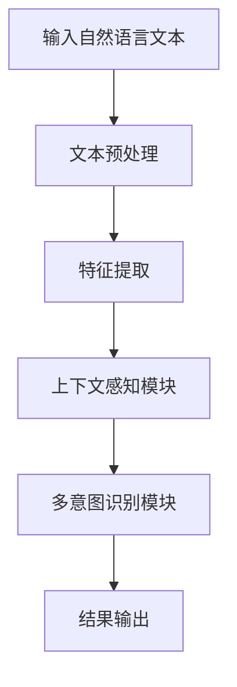

# 构建企业级自然语言理解系统：上下文感知与多意图识别

> 关键词：企业级自然语言理解系统、上下文感知、多意图识别、NLP技术、深度学习

> 摘要：本文聚焦于企业级自然语言理解系统的构建，着重探讨上下文感知与多意图识别这两个关键要素。详细阐述了相关核心概念、算法原理、数学模型，并通过项目实战展示了具体的实现过程。同时，分析了该系统的实际应用场景，推荐了学习资源、开发工具和相关论文著作。最后，对未来发展趋势与挑战进行了总结，并提供常见问题解答和扩展阅读参考资料，旨在为企业构建高效、智能的自然语言理解系统提供全面且深入的技术指导。

## 1. 背景介绍 
### 1.1 目的和范围
在当今数字化时代，企业面临着海量的自然语言文本数据，如客户咨询、市场反馈、内部沟通等。如何高效准确地理解这些文本背后的含义和意图，对于企业提升客户服务质量、优化业务流程、做出科学决策具有重要意义。本文的目的在于深入探讨构建企业级自然语言理解系统的方法和技术，特别是上下文感知与多意图识别这两个关键功能，以满足企业在处理复杂自然语言文本时的需求。范围涵盖了从核心概念的阐述、算法原理的分析、数学模型的建立，到项目实战的实现和实际应用场景的分析等多个方面。

### 1.2 预期读者
本文预期读者包括对自然语言处理（NLP）技术感兴趣的研究人员、从事企业级软件系统开发的程序员、软件架构师以及相关领域的技术管理者。同时，对于希望了解如何利用自然语言理解技术提升企业竞争力的企业决策者也具有一定的参考价值。

### 1.3 文档结构概述
本文将按照以下结构展开：首先介绍背景信息，包括目的、预期读者和文档结构概述等内容；接着阐述核心概念与联系，通过文本示意图和Mermaid流程图展示相关原理和架构；然后详细讲解核心算法原理和具体操作步骤，并使用Python源代码进行阐述；之后介绍数学模型和公式，并通过举例说明；再通过项目实战展示代码实际案例和详细解释说明；随后分析实际应用场景；接着推荐相关的工具和资源；最后总结未来发展趋势与挑战，提供常见问题解答和扩展阅读参考资料。

### 1.4 术语表
#### 1.4.1 核心术语定义
- **自然语言理解（Natural Language Understanding，NLU）**：指让计算机理解人类自然语言的技术和方法，旨在将自然语言文本转化为计算机能够处理和分析的结构化表示。
- **上下文感知（Context Awareness）**：指系统能够理解文本所处的上下文信息，包括对话历史、用户偏好、场景信息等，从而更准确地理解文本的含义和意图。
- **多意图识别（Multi - Intent Recognition）**：指系统能够从一段自然语言文本中识别出多个不同的意图，而不仅仅是单一意图。

#### 1.4.2 相关概念解释
- **词嵌入（Word Embedding）**：将单词表示为低维向量的技术，使得语义相近的单词在向量空间中距离较近，从而能够更好地捕捉单词之间的语义关系。
- **深度学习（Deep Learning）**：一类基于人工神经网络的机器学习技术，通过多层神经网络自动学习数据的特征和模式，在自然语言处理等领域取得了显著的成果。

#### 1.4.3 缩略词列表
- **NLU**：Natural Language Understanding（自然语言理解）
- **NLP**：Natural Language Processing（自然语言处理）
- **RNN**：Recurrent Neural Network（循环神经网络）
- **LSTM**：Long Short - Term Memory（长短期记忆网络）
- **GRU**：Gated Recurrent Unit（门控循环单元）

## 2. 核心概念与联系 
### 核心概念原理
自然语言理解是自然语言处理的一个重要分支，其目标是让计算机理解人类语言的语义和语用信息。上下文感知是自然语言理解中的关键技术，它能够考虑到文本的前后文信息，从而消除歧义，更准确地理解文本的含义。例如，在对话 “我想去银行。它在哪里？” 中，“它” 指代的是 “银行”，只有结合上下文才能正确理解。

多意图识别则是处理复杂自然语言文本的重要能力。在实际应用中，用户的表达往往包含多个意图，例如 “我想订一张明天去北京的机票，并且帮我推荐一家北京的酒店” 就包含了订票和酒店推荐两个意图。

### 架构的文本示意图
企业级自然语言理解系统的基本架构包括输入层、特征提取层、意图识别层和输出层。输入层接收自然语言文本数据；特征提取层将文本转换为计算机能够处理的特征表示，例如词向量；意图识别层利用机器学习或深度学习模型对特征进行分析，识别出文本的意图；输出层将识别结果以合适的形式输出，例如文本描述或结构化数据。

### Mermaid 流程图


## 3. 核心算法原理 & 具体操作步骤 
### 算法原理
在企业级自然语言理解系统中，常用的算法包括基于规则的方法、机器学习方法和深度学习方法。基于规则的方法通过手动编写规则来识别文本的意图，适用于领域知识明确、规则相对固定的场景。机器学习方法则通过训练模型来学习文本特征和意图之间的映射关系，常见的模型包括支持向量机（SVM）、朴素贝叶斯（Naive Bayes）等。深度学习方法利用神经网络自动学习文本的特征和模式，在自然语言处理领域取得了更好的效果，例如循环神经网络（RNN）、长短期记忆网络（LSTM）和门控循环单元（GRU）等。

### 具体操作步骤
1. **数据收集**：收集大量的自然语言文本数据，并标注出对应的意图标签。
2. **数据预处理**：对收集到的数据进行清洗、分词、去除停用词等操作，将文本转换为适合模型处理的格式。
3. **特征提取**：使用词嵌入技术将文本转换为向量表示，例如使用Word2Vec或GloVe。
4. **模型训练**：选择合适的模型，如LSTM或GRU，对特征数据进行训练。
5. **模型评估**：使用测试数据对训练好的模型进行评估，计算准确率、召回率等指标。
6. **模型优化**：根据评估结果对模型进行优化，调整超参数或增加训练数据。

### Python源代码阐述
以下是一个使用Python和Keras库实现基于LSTM的多意图识别的示例代码：

```python
import numpy as np
from keras.preprocessing.text import Tokenizer
from keras.preprocessing.sequence import pad_sequences
from keras.models import Sequential
from keras.layers import Embedding, LSTM, Dense
from sklearn.preprocessing import MultiLabelBinarizer

# 示例数据
texts = ["我想订一张明天去北京的机票，并且帮我推荐一家北京的酒店", "我要查询明天的天气情况"]
labels = [["订票", "酒店推荐"], ["天气查询"]]

# 文本预处理
tokenizer = Tokenizer()
tokenizer.fit_on_texts(texts)
sequences = tokenizer.texts_to_sequences(texts)
max_sequence_length = max([len(seq) for seq in sequences])
padded_sequences = pad_sequences(sequences, maxlen=max_sequence_length)

# 标签处理
mlb = MultiLabelBinarizer()
label_encoded = mlb.fit_transform(labels)

# 构建模型
model = Sequential()
model.add(Embedding(input_dim=len(tokenizer.word_index) + 1, output_dim=100, input_length=max_sequence_length))
model.add(LSTM(128))
model.add(Dense(len(mlb.classes_), activation='sigmoid'))

# 编译模型
model.compile(loss='binary_crossentropy', optimizer='adam', metrics=['accuracy'])

# 训练模型
model.fit(padded_sequences, label_encoded, epochs=10, batch_size=1)

# 预测
new_text = ["我想订后天去上海的机票"]
new_sequence = tokenizer.texts_to_sequences(new_text)
new_padded_sequence = pad_sequences(new_sequence, maxlen=max_sequence_length)
prediction = model.predict(new_padded_sequence)
predicted_labels = mlb.inverse_transform((prediction > 0.5).astype(int))
print("预测结果:", predicted_labels)
```

## 4. 数学模型和公式 & 详细讲解 & 举例说明 
### 词嵌入模型
词嵌入模型的目标是将单词表示为低维向量，使得语义相近的单词在向量空间中距离较近。常见的词嵌入模型包括Word2Vec和GloVe。

Word2Vec基于神经网络，通过预测单词的上下文或被上下文预测来学习单词的向量表示。其数学模型可以表示为：

$$
\theta = \arg\max_{\theta} \prod_{t=1}^{T} \prod_{-c \leq j \leq c, j \neq 0} P(w_{t + j} | w_t; \theta)
$$

其中，$\theta$ 是模型的参数，$T$ 是文本的长度，$c$ 是上下文窗口的大小，$w_t$ 是第 $t$ 个单词。

GloVe模型则基于共现矩阵，通过最小化以下损失函数来学习单词的向量表示：

$$
J(\theta) = \sum_{i, j = 1}^{V} f(X_{ij}) (\mathbf{w}_i^T \tilde{\mathbf{w}}_j + b_i + \tilde{b}_j - \log X_{ij})^2
$$

其中，$V$ 是词汇表的大小，$X_{ij}$ 是单词 $i$ 和 $j$ 的共现次数，$\mathbf{w}_i$ 和 $\tilde{\mathbf{w}}_j$ 分别是单词 $i$ 和 $j$ 的向量表示，$b_i$ 和 $\tilde{b}_j$ 是偏置项，$f(X_{ij})$ 是加权函数。

### 循环神经网络（RNN）
RNN是一种用于处理序列数据的神经网络，其核心思想是通过隐藏状态来传递序列中的信息。RNN的数学模型可以表示为：

$$
\mathbf{h}_t = \tanh(\mathbf{W}_{hh} \mathbf{h}_{t - 1} + \mathbf{W}_{xh} \mathbf{x}_t + \mathbf{b}_h)
$$

$$
\mathbf{y}_t = \mathbf{W}_{hy} \mathbf{h}_t + \mathbf{b}_y
$$

其中，$\mathbf{h}_t$ 是第 $t$ 时刻的隐藏状态，$\mathbf{x}_t$ 是第 $t$ 时刻的输入，$\mathbf{y}_t$ 是第 $t$ 时刻的输出，$\mathbf{W}_{hh}$、$\mathbf{W}_{xh}$ 和 $\mathbf{W}_{hy}$ 是权重矩阵，$\mathbf{b}_h$ 和 $\mathbf{b}_y$ 是偏置向量。

### 长短期记忆网络（LSTM）
LSTM是RNN的一种改进版本，通过引入门控机制来解决RNN中的梯度消失问题。LSTM的数学模型包括输入门、遗忘门、输出门和细胞状态更新等步骤：

遗忘门：

$$
\mathbf{f}_t = \sigma(\mathbf{W}_f \begin{bmatrix} \mathbf{h}_{t - 1} \\ \mathbf{x}_t \end{bmatrix} + \mathbf{b}_f)
$$

输入门：

$$
\mathbf{i}_t = \sigma(\mathbf{W}_i \begin{bmatrix} \mathbf{h}_{t - 1} \\ \mathbf{x}_t \end{bmatrix} + \mathbf{b}_i)
$$

候选细胞状态：

$$
\tilde{\mathbf{C}}_t = \tanh(\mathbf{W}_C \begin{bmatrix} \mathbf{h}_{t - 1} \\ \mathbf{x}_t \end{bmatrix} + \mathbf{b}_C)
$$

细胞状态更新：

$$
\mathbf{C}_t = \mathbf{f}_t \odot \mathbf{C}_{t - 1} + \mathbf{i}_t \odot \tilde{\mathbf{C}}_t
$$

输出门：

$$
\mathbf{o}_t = \sigma(\mathbf{W}_o \begin{bmatrix} \mathbf{h}_{t - 1} \\ \mathbf{x}_t \end{bmatrix} + \mathbf{b}_o)
$$

隐藏状态更新：

$$
\mathbf{h}_t = \mathbf{o}_t \odot \tanh(\mathbf{C}_t)
$$

其中，$\sigma$ 是 sigmoid 函数，$\odot$ 是逐元素乘法。

### 举例说明
假设我们有一个简单的文本序列 “I like apples”，使用Word2Vec将每个单词转换为向量表示。然后将这些向量作为输入传递给LSTM网络，LSTM网络会根据当前输入和上一时刻的隐藏状态更新细胞状态和隐藏状态，最终输出预测结果。例如，在情感分析任务中，输出结果可以表示文本的情感倾向（积极、消极或中性）。

## 5. 项目实战：代码实际案例和详细解释说明 
### 5.1  开发环境搭建
1. **安装Python**：从Python官方网站（https://www.python.org/downloads/）下载并安装Python 3.x版本。
2. **安装依赖库**：使用pip命令安装所需的库，如Keras、TensorFlow、scikit - learn等。
```bash
pip install keras tensorflow scikit-learn
```
3. **选择开发工具**：可以使用PyCharm、Jupyter Notebook等开发工具进行代码编写和调试。

### 5.2  源代码详细实现和代码解读
以下是一个完整的企业级自然语言理解系统的项目实战代码，包括数据预处理、模型构建、训练和预测等步骤：

```python
import numpy as np
from keras.preprocessing.text import Tokenizer
from keras.preprocessing.sequence import pad_sequences
from keras.models import Sequential
from keras.layers import Embedding, LSTM, Dense
from sklearn.preprocessing import MultiLabelBinarizer
from sklearn.model_selection import train_test_split

# 示例数据
texts = ["我想订一张明天去北京的机票，并且帮我推荐一家北京的酒店", "我要查询明天的天气情况", "我想预订一个餐厅", "我想了解一下旅游攻略"]
labels = [["订票", "酒店推荐"], ["天气查询"], ["餐厅预订"], ["旅游攻略查询"]]

# 文本预处理
tokenizer = Tokenizer()
tokenizer.fit_on_texts(texts)
sequences = tokenizer.texts_to_sequences(texts)
max_sequence_length = max([len(seq) for seq in sequences])
padded_sequences = pad_sequences(sequences, maxlen=max_sequence_length)

# 标签处理
mlb = MultiLabelBinarizer()
label_encoded = mlb.fit_transform(labels)

# 划分训练集和测试集
X_train, X_test, y_train, y_test = train_test_split(padded_sequences, label_encoded, test_size=0.2, random_state=42)

# 构建模型
model = Sequential()
model.add(Embedding(input_dim=len(tokenizer.word_index) + 1, output_dim=100, input_length=max_sequence_length))
model.add(LSTM(128))
model.add(Dense(len(mlb.classes_), activation='sigmoid'))

# 编译模型
model.compile(loss='binary_crossentropy', optimizer='adam', metrics=['accuracy'])

# 训练模型
model.fit(X_train, y_train, epochs=10, batch_size=1, validation_data=(X_test, y_test))

# 预测
new_text = ["我想订后天去上海的机票"]
new_sequence = tokenizer.texts_to_sequences(new_text)
new_padded_sequence = pad_sequences(new_sequence, maxlen=max_sequence_length)
prediction = model.predict(new_padded_sequence)
predicted_labels = mlb.inverse_transform((prediction > 0.5).astype(int))
print("预测结果:", predicted_labels)
```

### 5.3  代码解读与分析
1. **数据预处理**：使用 `Tokenizer` 对文本进行分词和编号，将文本转换为序列。然后使用 `pad_sequences` 对序列进行填充，使其长度一致。
2. **标签处理**：使用 `MultiLabelBinarizer` 对多意图标签进行编码，将其转换为二进制向量。
3. **模型构建**：使用Keras的 `Sequential` 模型构建一个简单的LSTM模型，包括嵌入层、LSTM层和全连接层。
4. **模型编译**：使用 `binary_crossentropy` 作为损失函数，`adam` 作为优化器，`accuracy` 作为评估指标。
5. **模型训练**：使用训练集对模型进行训练，并使用测试集进行验证。
6. **预测**：对新的文本进行预测，将预测结果转换为原始的标签形式。

## 6. 实际应用场景 
### 客户服务
在客户服务场景中，企业级自然语言理解系统可以自动识别客户的问题和意图，将客户咨询分配到相应的客服人员或自动提供解决方案。例如，当客户咨询 “我的订单什么时候发货” 时，系统可以识别出 “订单发货查询” 的意图，并提供相关的订单状态信息。

### 智能助手
智能助手如智能语音助手和聊天机器人可以利用自然语言理解系统实现上下文感知和多意图识别。例如，用户说 “今天天气怎么样，帮我订一张明天去北京的机票”，智能助手可以同时识别出 “天气查询” 和 “订票” 两个意图，并分别提供相应的服务。

### 市场调研
在市场调研中，自然语言理解系统可以分析客户的反馈和评价，识别出客户的需求和意见。例如，通过分析客户对产品的评价，系统可以识别出客户对产品的功能、性能、价格等方面的满意度和改进建议。

### 内容推荐
自然语言理解系统可以理解用户的兴趣和偏好，从而为用户推荐相关的内容。例如，在新闻推荐系统中，系统可以分析用户的搜索历史和阅读记录，识别出用户的兴趣主题，然后为用户推荐相关的新闻文章。

## 7. 工具和资源推荐
### 7.1 学习资源推荐
#### 7.1.1 书籍推荐
- 《自然语言处理入门》：介绍了自然语言处理的基本概念、算法和技术，适合初学者入门。
- 《深度学习》：详细讲解了深度学习的原理和应用，包括神经网络、卷积神经网络、循环神经网络等。
- 《Python自然语言处理》：结合Python语言介绍了自然语言处理的实践方法和技巧。

#### 7.1.2 在线课程
- Coursera上的 “Natural Language Processing Specialization”：由顶尖大学的教授授课，系统地介绍了自然语言处理的各个方面。
- edX上的 “Introduction to Artificial Intelligence”：涵盖了人工智能的基础知识，包括自然语言处理的相关内容。
- 中国大学MOOC上的 “自然语言处理”：国内高校的优质课程，适合国内学习者。

#### 7.1.3 技术博客和网站
- Medium上的 “Towards Data Science”：发布了大量关于自然语言处理和机器学习的技术文章和案例。
- 机器之心：专注于人工智能领域的技术资讯和深度报道。
- 开源中国：提供了丰富的开源项目和技术文章，包括自然语言处理相关的内容。

### 7.2 开发工具框架推荐
#### 7.2.1 IDE和编辑器
- PyCharm：功能强大的Python集成开发环境，提供代码编辑、调试、版本控制等功能。
- Jupyter Notebook：交互式的开发环境，适合进行数据探索和模型实验。
- Visual Studio Code：轻量级的代码编辑器，支持多种编程语言和插件扩展。

#### 7.2.2 调试和性能分析工具
- TensorBoard：TensorFlow的可视化工具，用于监控模型的训练过程和性能指标。
- PyTorch Profiler：PyTorch的性能分析工具，帮助开发者找出代码中的性能瓶颈。
- cProfile：Python的内置性能分析工具，用于分析代码的执行时间和调用关系。

#### 7.2.3 相关框架和库
- Keras：简单易用的深度学习框架，适合快速搭建和训练模型。
- TensorFlow：开源的深度学习框架，功能强大，支持分布式训练和部署。
- PyTorch：动态图深度学习框架，具有良好的灵活性和可调试性。
- NLTK：自然语言处理工具包，提供了丰富的语料库和处理方法。
- SpaCy：高效的自然语言处理库，适合处理大规模文本数据。

### 7.3 相关论文著作推荐
#### 7.3.1 经典论文
- “Efficient Estimation of Word Representations in Vector Space”：介绍了Word2Vec的原理和算法。
- “GloVe: Global Vectors for Word Representation”：提出了GloVe词嵌入模型。
- “Long Short - Term Memory”：介绍了长短期记忆网络（LSTM）的原理和应用。

#### 7.3.2 最新研究成果
- 关注ACL（Association for Computational Linguistics）、EMNLP（Conference on Empirical Methods in Natural Language Processing）等自然语言处理领域的顶级会议，了解最新的研究成果和技术趋势。

#### 7.3.3 应用案例分析
- 参考企业和研究机构发布的自然语言理解系统的应用案例，学习实际应用中的经验和技巧。

## 8. 总结：未来发展趋势与挑战
### 未来发展趋势
- **融合多模态信息**：未来的自然语言理解系统将不仅考虑文本信息，还会融合图像、语音等多模态信息，以更全面地理解用户的意图和需求。
- **知识增强**：结合知识图谱等技术，将领域知识融入自然语言理解系统中，提高系统的理解能力和推理能力。
- **个性化和自适应**：系统将能够根据用户的个性化需求和偏好进行自适应调整，提供更加个性化的服务。
- **低资源学习**：在资源有限的情况下，提高自然语言理解系统的性能和效果，例如在小数据集上进行有效的模型训练。

### 挑战
- **语义理解的准确性**：自然语言的语义具有复杂性和歧义性，如何提高系统对语义的准确理解仍然是一个挑战。
- **上下文处理的复杂性**：在长对话和复杂场景中，处理上下文信息的难度较大，需要更高效的算法和技术。
- **数据隐私和安全**：自然语言文本数据往往包含用户的敏感信息，如何保护数据的隐私和安全是企业级自然语言理解系统面临的重要问题。
- **计算资源和效率**：深度学习模型的训练和推理需要大量的计算资源，如何提高系统的计算效率和降低成本是一个关键挑战。

## 9. 附录：常见问题与解答
### 问题1：如何处理文本中的噪声数据？
解答：可以使用数据清洗技术，如去除特殊字符、停用词、重复字符等。还可以使用正则表达式进行模式匹配和替换，或者使用机器学习方法进行噪声数据的分类和过滤。

### 问题2：如何提高多意图识别的准确率？
解答：可以增加训练数据的数量和多样性，使用更复杂的模型结构，如多层LSTM或注意力机制。还可以进行特征工程，提取更有代表性的文本特征，以及进行模型融合等方法。

### 问题3：如何处理不同领域的自然语言文本？
解答：可以针对不同领域进行数据收集和模型训练，构建领域特定的自然语言理解系统。也可以使用迁移学习的方法，将在一个领域训练好的模型迁移到另一个领域进行微调。

### 问题4：如何评估自然语言理解系统的性能？
解答：可以使用准确率、召回率、F1值等指标来评估多意图识别的性能。对于上下文感知能力，可以通过人工评估或模拟真实对话场景进行评估。

## 10. 扩展阅读 & 参考资料
### 扩展阅读
- 《人工智能时代的自然语言处理》：深入探讨了自然语言处理在人工智能时代的发展和应用。
- 《自然语言处理前沿技术》：介绍了自然语言处理领域的最新研究成果和前沿技术。

### 参考资料
- 相关学术论文和研究报告
- 开源项目的文档和代码
- 技术社区和论坛的讨论和分享