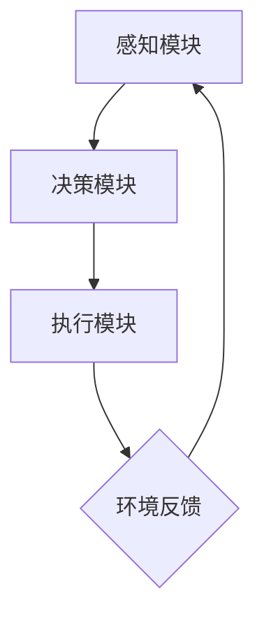

# 构建具有元学习能力的自适应AI Agent

> 关键词：元学习、自适应AI Agent、人工智能、机器学习、强化学习、智能体、模型训练

> 摘要：本文围绕构建具有元学习能力的自适应AI Agent展开。首先介绍了相关背景，包括目的、预期读者、文档结构和术语表等内容。接着阐述了核心概念与联系，通过文本示意图和Mermaid流程图清晰展示原理和架构。详细讲解了核心算法原理及具体操作步骤，并使用Python源代码进行说明。深入探讨了数学模型和公式，结合举例加深理解。通过项目实战，从开发环境搭建、源代码实现与解读等方面进行详细分析。探讨了实际应用场景，推荐了学习、开发工具等资源，包括书籍、在线课程、技术博客、IDE、调试工具、相关框架和库以及论文著作等。最后总结了未来发展趋势与挑战，给出常见问题解答和扩展阅读参考资料，旨在为读者全面呈现构建具有元学习能力的自适应AI Agent的技术全貌。

## 1. 背景介绍 
### 1.1 目的和范围
随着人工智能技术的飞速发展，传统的AI系统在面对复杂多变的环境时，往往需要大量的人力和时间进行重新训练和调整。具有元学习能力的自适应AI Agent旨在解决这一问题，使其能够在不同的任务和环境中快速学习和适应，减少对人工干预的依赖。本文的范围涵盖了元学习和自适应AI Agent的基本概念、核心算法、数学模型、实际应用案例以及相关的工具和资源推荐。

### 1.2 预期读者
本文预期读者包括人工智能领域的研究人员、开发者、学生以及对AI技术感兴趣的专业人士。对于初学者，本文可以作为了解元学习和自适应AI Agent的入门资料；对于有一定基础的开发者和研究人员，本文提供了深入的技术细节和实践案例，可作为技术参考和研究方向的指导。

### 1.3 文档结构概述
本文首先介绍相关背景知识，包括目的、读者和文档结构等内容。然后深入探讨核心概念与联系，通过文本示意图和流程图展示原理和架构。接着详细讲解核心算法原理和具体操作步骤，结合Python代码进行说明。随后阐述数学模型和公式，并举例说明。通过项目实战部分，从开发环境搭建到源代码实现与解读进行详细分析。探讨实际应用场景后，推荐学习、开发工具等资源。最后总结未来发展趋势与挑战，给出常见问题解答和扩展阅读参考资料。

### 1.4 术语表
#### 1.4.1 核心术语定义
- **元学习（Meta - learning）**：也称为“学习如何学习”，是一种让模型能够快速学习新知识和技能的机器学习方法。它通过在多个任务上进行训练，使模型能够学习到通用的学习策略，从而在面对新任务时能够快速适应。
- **自适应AI Agent（Adaptive AI Agent）**：一种能够感知环境变化，并根据环境反馈自动调整自身行为和策略的人工智能智能体。它具有在不同环境和任务中自主学习和适应的能力。
- **智能体（Agent）**：在人工智能领域，智能体是一个能够感知环境、做出决策并执行动作的实体。它可以是软件程序、机器人等。

#### 1.4.2 相关概念解释
- **机器学习（Machine Learning）**：一门多领域交叉学科，涉及概率论、统计学、逼近论、凸分析、算法复杂度理论等多门学科。它专门研究计算机怎样模拟或实现人类的学习行为，以获取新的知识或技能，重新组织已有的知识结构使之不断改善自身的性能。
- **强化学习（Reinforcement Learning）**：一种通过智能体与环境进行交互，根据环境反馈的奖励信号来学习最优策略的机器学习方法。智能体的目标是最大化长期累积奖励。

#### 1.4.3 缩略词列表
- **AI**：Artificial Intelligence，人工智能
- **ML**：Machine Learning，机器学习
- **RL**：Reinforcement Learning，强化学习

## 2. 核心概念与联系 

### 元学习的基本原理
元学习的核心思想是学习如何学习，它将学习过程本身作为一个学习目标。传统的机器学习模型通常是在一个固定的数据集上进行训练，而元学习则是在多个不同的任务上进行训练，以学习到通用的学习策略。

例如，在图像分类任务中，传统的模型可能只学习如何对特定的图像类别进行分类。而元学习模型可以学习到如何快速适应新的图像分类任务，即使这些任务的图像类别和分布与训练时不同。

### 自适应AI Agent的架构
自适应AI Agent通常由感知模块、决策模块和执行模块组成。感知模块负责收集环境信息，决策模块根据感知到的信息和自身的学习策略做出决策，执行模块则将决策转化为具体的动作。

以下是自适应AI Agent的架构文本示意图：

```plaintext
+----------------------+
|      感知模块        |
|  收集环境信息        |
+----------------------+
           |
           v
+----------------------+
|      决策模块        |
|  根据信息和策略决策  |
+----------------------+
           |
           v
+----------------------+
|      执行模块        |
|  执行具体动作        |
+----------------------+
```

### Mermaid流程图


### 元学习与自适应AI Agent的联系
元学习为自适应AI Agent提供了快速学习和适应新环境的能力。通过元学习，自适应AI Agent可以在不同的任务和环境中快速调整自己的学习策略，从而更好地完成任务。例如，在一个机器人导航任务中，元学习可以帮助机器人快速适应不同的地形和障碍物，调整自己的导航策略。

## 3. 核心算法原理 & 具体操作步骤 

### 元学习算法 - MAML（Model - Agnostic Meta - Learning）原理
MAML是一种经典的元学习算法，其核心思想是找到一个初始模型参数，使得在这个参数的基础上进行少量的梯度更新，就能够在新的任务上取得较好的性能。

#### 算法步骤
1. **采样任务**：从任务分布中采样一组任务。
2. **内循环**：对于每个采样的任务，使用当前的模型参数进行训练，得到一组更新后的参数。
3. **外循环**：根据更新后的参数，计算元损失，并使用元损失更新初始模型参数。

### Python源代码实现
```python
import torch
import torch.nn as nn
import torch.optim as optim

# 定义一个简单的神经网络模型
class SimpleNet(nn.Module):
    def __init__(self):
        super(SimpleNet, self).__init__()
        self.fc1 = nn.Linear(10, 20)
        self.fc2 = nn.Linear(20, 1)

    def forward(self, x):
        x = torch.relu(self.fc1(x))
        x = self.fc2(x)
        return x

# MAML算法实现
def maml(train_tasks, num_inner_steps, inner_lr, outer_lr, num_epochs):
    model = SimpleNet()
    meta_optimizer = optim.Adam(model.parameters(), lr=outer_lr)

    for epoch in range(num_epochs):
        meta_loss = 0
        for task in train_tasks:
            # 内循环
            fast_weights = list(model.parameters())
            for _ in range(num_inner_steps):
                x, y = task.sample_data()
                pred = model(x)
                loss = nn.MSELoss()(pred, y)
                grads = torch.autograd.grad(loss, fast_weights)
                fast_weights = [w - inner_lr * g for w, g in zip(fast_weights, grads)]

            # 外循环
            x, y = task.sample_data()
            pred = model(x)
            loss = nn.MSELoss()(pred, y)
            meta_loss += loss

        meta_optimizer.zero_grad()
        meta_loss.backward()
        meta_optimizer.step()

    return model
```

### 具体操作步骤解释
1. **定义模型**：首先定义一个简单的神经网络模型 `SimpleNet`。
2. **初始化元优化器**：使用Adam优化器作为元优化器，用于更新初始模型参数。
3. **训练循环**：在每个训练周期中，遍历采样的任务。
4. **内循环**：对于每个任务，使用当前的模型参数进行多次梯度更新，得到一组更新后的参数。
5. **外循环**：根据更新后的参数，计算元损失，并使用元优化器更新初始模型参数。

## 4. 数学模型和公式 & 详细讲解 & 举例说明 

### MAML的数学模型
设 $\theta$ 为初始模型参数，$\mathcal{T}$ 为任务分布，$T_i \in \mathcal{T}$ 为从任务分布中采样的第 $i$ 个任务。对于每个任务 $T_i$，我们有训练数据 $\mathcal{D}_{tr}^i$ 和测试数据 $\mathcal{D}_{te}^i$。

#### 内循环
在任务 $T_i$ 上，我们使用梯度下降法更新模型参数：
$$\theta_{i}' = \theta - \alpha \nabla_{\theta} \mathcal{L}_{T_i}(\theta)$$
其中，$\alpha$ 是内循环的学习率，$\mathcal{L}_{T_i}(\theta)$ 是任务 $T_i$ 上的损失函数。

#### 外循环
元损失定义为所有任务上更新后的参数在测试数据上的损失之和：
$$\mathcal{L}_{meta}(\theta) = \sum_{i} \mathcal{L}_{T_i}(\theta_{i}')$$
元学习的目标是最小化元损失：
$$\theta^* = \arg \min_{\theta} \mathcal{L}_{meta}(\theta)$$

### 详细讲解
内循环的目的是在每个任务上快速适应，通过梯度下降法更新模型参数。外循环的目的是找到一个初始模型参数，使得在这个参数的基础上进行内循环更新后，能够在不同的任务上取得较好的性能。

### 举例说明
假设我们有两个任务 $T_1$ 和 $T_2$，每个任务都有自己的训练数据和测试数据。初始模型参数为 $\theta$。

#### 内循环
对于任务 $T_1$，我们使用训练数据计算损失 $\mathcal{L}_{T_1}(\theta)$，并更新参数：
$$\theta_{1}' = \theta - \alpha \nabla_{\theta} \mathcal{L}_{T_1}(\theta)$$
对于任务 $T_2$，同样计算损失 $\mathcal{L}_{T_2}(\theta)$，并更新参数：
$$\theta_{2}' = \theta - \alpha \nabla_{\theta} \mathcal{L}_{T_2}(\theta)$$

#### 外循环
元损失为：
$$\mathcal{L}_{meta}(\theta) = \mathcal{L}_{T_1}(\theta_{1}') + \mathcal{L}_{T_2}(\theta_{2}')$$
我们使用梯度下降法更新初始模型参数 $\theta$，使得 $\mathcal{L}_{meta}(\theta)$ 最小化。

## 5. 项目实战：代码实际案例和详细解释说明 

### 5.1  开发环境搭建
#### 操作系统
推荐使用Ubuntu 18.04或更高版本，或者Windows 10操作系统。

#### 编程语言和版本
使用Python 3.7或更高版本。

#### 依赖库安装
```bash
pip install torch torchvision numpy matplotlib
```

### 5.2  源代码详细实现和代码解读
以下是一个简单的基于MAML的元学习项目的完整代码：
```python
import torch
import torch.nn as nn
import torch.optim as optim
import numpy as np

# 定义一个简单的任务生成器
class TaskGenerator:
    def __init__(self, num_tasks, num_samples_per_task):
        self.num_tasks = num_tasks
        self.num_samples_per_task = num_samples_per_task

    def generate_tasks(self):
        tasks = []
        for _ in range(self.num_tasks):
            slope = np.random.uniform(-1, 1)
            intercept = np.random.uniform(-1, 1)
            x = np.random.uniform(-1, 1, size=(self.num_samples_per_task, 1))
            y = slope * x + intercept
            x = torch.tensor(x, dtype=torch.float32)
            y = torch.tensor(y, dtype=torch.float32)
            tasks.append((x, y))
        return tasks

# 定义一个简单的神经网络模型
class SimpleNet(nn.Module):
    def __init__(self):
        super(SimpleNet, self).__init__()
        self.fc1 = nn.Linear(1, 20)
        self.fc2 = nn.Linear(20, 1)

    def forward(self, x):
        x = torch.relu(self.fc1(x))
        x = self.fc2(x)
        return x

# MAML算法实现
def maml(train_tasks, num_inner_steps, inner_lr, outer_lr, num_epochs):
    model = SimpleNet()
    meta_optimizer = optim.Adam(model.parameters(), lr=outer_lr)

    for epoch in range(num_epochs):
        meta_loss = 0
        for x, y in train_tasks:
            # 内循环
            fast_weights = list(model.parameters())
            for _ in range(num_inner_steps):
                pred = model(x)
                loss = nn.MSELoss()(pred, y)
                grads = torch.autograd.grad(loss, fast_weights)
                fast_weights = [w - inner_lr * g for w, g in zip(fast_weights, grads)]

            # 外循环
            pred = model(x)
            loss = nn.MSELoss()(pred, y)
            meta_loss += loss

        meta_optimizer.zero_grad()
        meta_loss.backward()
        meta_optimizer.step()

    return model

# 主函数
if __name__ == "__main__":
    task_generator = TaskGenerator(num_tasks=10, num_samples_per_task=20)
    train_tasks = task_generator.generate_tasks()
    num_inner_steps = 3
    inner_lr = 0.01
    outer_lr = 0.001
    num_epochs = 100

    model = maml(train_tasks, num_inner_steps, inner_lr, outer_lr, num_epochs)
    print("训练完成，模型参数已更新。")
```

### 5.3  代码解读与分析
#### 任务生成器 `TaskGenerator`
该类用于生成多个线性回归任务。每个任务由一个随机的斜率和截距定义，通过生成随机的输入数据 $x$ 和对应的输出数据 $y$ 来模拟任务。

#### 神经网络模型 `SimpleNet`
定义了一个简单的两层全连接神经网络，用于解决线性回归任务。

#### MAML算法实现 `maml`
该函数实现了MAML算法的核心逻辑，包括内循环和外循环。内循环在每个任务上进行多次梯度更新，外循环根据更新后的参数计算元损失并更新初始模型参数。

#### 主函数
在主函数中，我们创建了一个任务生成器，生成训练任务，设置MAML算法的参数，然后调用 `maml` 函数进行训练。

## 6. 实际应用场景 
### 机器人领域
在机器人领域，具有元学习能力的自适应AI Agent可以帮助机器人快速适应不同的环境和任务。例如，在救援机器人中，机器人需要在不同的灾难现场进行搜索和救援任务，元学习可以帮助机器人快速学习到不同地形和环境下的导航和操作策略。

### 游戏领域
在游戏中，自适应AI Agent可以作为游戏中的智能对手，根据玩家的行为和策略快速调整自己的游戏策略。例如，在实时战略游戏中，AI Agent可以根据玩家的出兵策略和资源管理方式，快速学习并调整自己的战术。

### 医疗领域
在医疗领域，自适应AI Agent可以用于疾病诊断和治疗方案推荐。通过元学习，AI Agent可以快速学习到不同疾病的症状和治疗方法，根据患者的具体情况提供个性化的诊断和治疗建议。

### 金融领域
在金融领域，自适应AI Agent可以用于股票市场预测和投资策略优化。元学习可以帮助AI Agent快速适应市场的变化，学习到不同市场环境下的投资策略。

## 7. 工具和资源推荐
### 7.1 学习资源推荐
#### 7.1.1 书籍推荐
- 《机器学习》（周志华）：全面介绍了机器学习的基本概念、算法和应用，是机器学习领域的经典教材。
- 《深度学习》（Ian Goodfellow、Yoshua Bengio和Aaron Courville）：详细介绍了深度学习的理论和实践，是深度学习领域的权威著作。
- 《强化学习：原理与Python实现》（智能系统学习与应用系列）：系统介绍了强化学习的基本原理和算法，并通过Python代码进行实现。

#### 7.1.2 在线课程
- Coursera上的“机器学习”课程（Andrew Ng教授）：该课程是机器学习领域的经典在线课程，内容全面，讲解详细。
- edX上的“深度学习”课程：由全球顶尖大学的教授授课，深入介绍了深度学习的理论和实践。
- 哔哩哔哩上的“强化学习入门”系列视频：以通俗易懂的方式介绍了强化学习的基本概念和算法。

#### 7.1.3 技术博客和网站
- Medium上的AI相关博客：有许多AI领域的专家和研究者在Medium上分享他们的研究成果和经验。
- arXiv.org：是一个收集物理学、数学、计算机科学等领域预印本论文的网站，提供了大量最新的AI研究论文。
- 机器之心：是一个专注于人工智能领域的媒体平台，提供了丰富的AI技术资讯和深度报道。

### 7.2 开发工具框架推荐
#### 7.2.1 IDE和编辑器
- PyCharm：是一款专门为Python开发设计的集成开发环境，具有代码自动补全、调试等功能，适合初学者和专业开发者使用。
- Visual Studio Code：是一款轻量级的代码编辑器，支持多种编程语言和插件，具有丰富的扩展功能。

#### 7.2.2 调试和性能分析工具
- TensorBoard：是TensorFlow提供的一个可视化工具，用于可视化训练过程中的损失、准确率等指标，帮助开发者调试和优化模型。
- PyTorch Profiler：是PyTorch提供的一个性能分析工具，用于分析模型的性能瓶颈，帮助开发者优化代码。

#### 7.2.3 相关框架和库
- PyTorch：是一个开源的深度学习框架，具有动态图机制，易于使用和调试，广泛应用于学术界和工业界。
- TensorFlow：是另一个流行的深度学习框架，具有强大的分布式训练和部署能力，适用于大规模的深度学习任务。
- Gym：是OpenAI开发的一个开源的强化学习环境库，提供了多种不同的环境和任务，方便开发者进行强化学习算法的开发和测试。

### 7.3 相关论文著作推荐
#### 7.3.1 经典论文
- "Model - Agnostic Meta - Learning for Fast Adaptation of Deep Networks"（MAML论文）：介绍了MAML算法的基本原理和实现方法，是元学习领域的经典论文。
- "Playing Atari with Deep Reinforcement Learning"：介绍了深度强化学习在Atari游戏中的应用，开创了深度强化学习的先河。

#### 7.3.2 最新研究成果
- 关注arXiv.org上的最新论文，了解元学习和自适应AI Agent领域的最新研究进展。
- 参加AI领域的顶级学术会议，如NeurIPS、ICML等，获取最新的研究成果。

#### 7.3.3 应用案例分析
- 研究OpenAI、DeepMind等机构的公开项目和论文，了解具有元学习能力的自适应AI Agent在实际应用中的案例和经验。

## 8. 总结：未来发展趋势与挑战
### 未来发展趋势
- **更强大的学习能力**：未来的自适应AI Agent将具备更强大的元学习能力，能够在更复杂的任务和环境中快速学习和适应。例如，在多模态任务中，能够同时处理图像、文本、语音等多种信息。
- **与其他技术的融合**：自适应AI Agent将与区块链、物联网等技术深度融合，创造出更智能、更安全的应用场景。例如，在物联网中，自适应AI Agent可以根据设备的实时状态和环境变化，自动调整设备的运行策略。
- **通用人工智能的发展**：随着元学习和自适应AI Agent技术的不断发展，有望推动通用人工智能的实现。通用人工智能能够像人类一样，在不同的领域和任务中灵活学习和应用知识。

### 挑战
- **计算资源需求**：元学习和自适应AI Agent通常需要大量的计算资源进行训练和推理，这对硬件设备和计算成本提出了挑战。
- **数据隐私和安全**：在自适应AI Agent的应用中，需要处理大量的敏感数据，如个人信息、医疗数据等，数据隐私和安全问题需要得到重视。
- **可解释性**：目前的AI模型大多是黑盒模型，缺乏可解释性。在自适应AI Agent的应用中，尤其是在医疗、金融等领域，模型的可解释性至关重要。

## 9. 附录：常见问题与解答
### 问题1：元学习和传统机器学习有什么区别？
元学习的目标是学习如何学习，通过在多个任务上进行训练，使模型能够快速适应新的任务。而传统机器学习通常是在一个固定的数据集上进行训练，模型的泛化能力主要依赖于训练数据的质量和数量。

### 问题2：MAML算法的复杂度如何？
MAML算法的复杂度主要取决于内循环和外循环的次数、任务的数量和模型的复杂度。一般来说，MAML算法的计算复杂度较高，需要大量的计算资源和时间。

### 问题3：如何评估自适应AI Agent的性能？
可以使用任务完成率、奖励值、学习速度等指标来评估自适应AI Agent的性能。在不同的应用场景中，可以根据具体的任务需求选择合适的评估指标。

## 10. 扩展阅读 & 参考资料
### 扩展阅读
- "Meta - Learning in Neural Networks: A Survey"：对元学习在神经网络中的应用进行了全面的综述。
- "Adaptive AI Agents for Complex Environments"：探讨了自适应AI Agent在复杂环境中的应用和挑战。

### 参考资料
- 周志华. 机器学习[M]. 清华大学出版社, 2016.
- Ian Goodfellow, Yoshua Bengio, Aaron Courville. Deep Learning[M]. MIT Press, 2016.
- OpenAI Gym官方文档：https://gym.openai.com/
- PyTorch官方文档：https://pytorch.org/docs/stable/index.html
- TensorFlow官方文档：https://www.tensorflow.org/api_docs