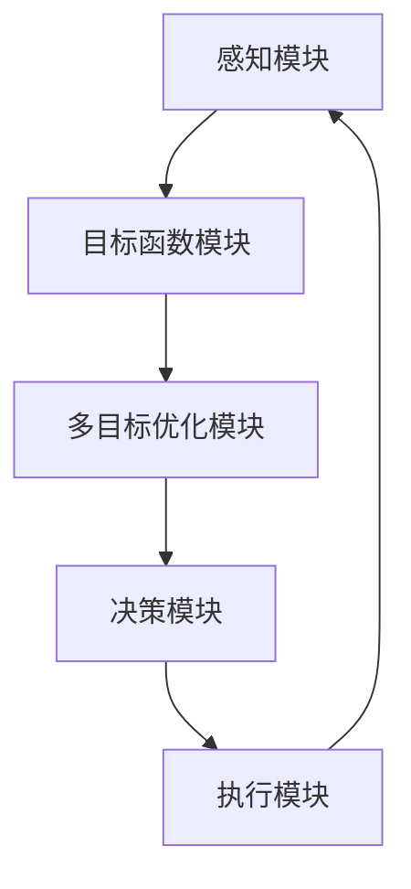

# 构建具有多目标优化决策能力的AI Agent

> 关键词：AI Agent、多目标优化、决策能力、智能系统、算法原理、数学模型、实战案例

> 摘要：本文围绕构建具有多目标优化决策能力的AI Agent展开深入探讨。首先介绍了相关背景知识，包括目的、预期读者等内容。接着阐述了核心概念与联系，呈现其原理和架构。详细讲解了核心算法原理及具体操作步骤，结合Python源代码进行说明。通过数学模型和公式进一步剖析其内在逻辑，并举例说明。以项目实战的方式展示了代码实际案例并进行详细解释。分析了实际应用场景，推荐了相关的工具和资源。最后总结了未来发展趋势与挑战，还提供了常见问题解答和扩展阅读参考资料，旨在为读者全面深入地介绍构建具有多目标优化决策能力的AI Agent的相关知识和技术。

## 1. 背景介绍 
### 1.1 目的和范围
在当今复杂多变的环境中，单一目标的决策往往无法满足实际需求。构建具有多目标优化决策能力的AI Agent的目的在于使智能系统能够同时考虑多个相互冲突或相互关联的目标，做出更全面、更合理的决策。其范围涵盖了多个领域，如机器人控制、资源分配、交通规划、金融投资等。在这些领域中，AI Agent需要在不同的目标之间进行权衡和优化，以达到整体的最优效果。

### 1.2 预期读者
本文预期读者包括对人工智能、机器学习、优化算法等领域感兴趣的研究人员、工程师、学生以及相关从业人员。对于想要深入了解多目标优化决策理论和实践的读者，本文将提供系统的知识和实用的技术指导。同时，对于正在从事相关项目开发的人员，本文中的项目实战案例和代码实现将具有一定的参考价值。

### 1.3 文档结构概述
本文首先介绍背景知识，让读者对构建具有多目标优化决策能力的AI Agent有一个初步的认识。接着阐述核心概念与联系，帮助读者理解其基本原理和架构。然后详细讲解核心算法原理和具体操作步骤，并给出Python源代码。通过数学模型和公式进一步剖析其内在逻辑，并举例说明。以项目实战的方式展示代码实际案例并进行详细解释。分析实际应用场景，推荐相关的工具和资源。最后总结未来发展趋势与挑战，提供常见问题解答和扩展阅读参考资料。

### 1.4 术语表
#### 1.4.1 核心术语定义
- **AI Agent**：即智能体，是一种能够感知环境、做出决策并采取行动的智能实体。它可以是软件程序、机器人或其他具有智能行为的系统。
- **多目标优化**：在存在多个目标的情况下，寻找一组最优解，使得这些目标在一定程度上都得到满足。由于多个目标之间可能存在冲突，因此多目标优化的解通常是一组非支配解，也称为帕累托最优解。
- **决策能力**：AI Agent根据感知到的环境信息和自身的目标，选择合适的行动方案的能力。具有多目标优化决策能力的AI Agent能够在多个目标之间进行权衡和优化，做出更合理的决策。

#### 1.4.2 相关概念解释
- **帕累托最优**：在多目标优化问题中，如果一个解在不降低其他目标值的情况下，无法进一步提高某个目标的值，那么这个解就是帕累托最优解。所有帕累托最优解构成的集合称为帕累托前沿。
- **非支配解**：对于一个多目标优化问题中的两个解 $x_1$ 和 $x_2$，如果 $x_1$ 至少在一个目标上优于 $x_2$，且在其他目标上不劣于 $x_2$，则称 $x_1$ 支配 $x_2$。不被其他解支配的解称为非支配解。

#### 1.4.3 缩略词列表
- **MOP**：Multi - Objective Optimization Problem，多目标优化问题
- **NSGA - II**：Non - dominated Sorting Genetic Algorithm II，非支配排序遗传算法II

## 2. 核心概念与联系 
### 核心概念原理
具有多目标优化决策能力的AI Agent的核心在于能够同时处理多个目标，并在这些目标之间进行权衡和优化。其基本原理是通过感知环境信息，将环境状态映射到一组目标函数上，然后利用多目标优化算法寻找一组帕累托最优解。AI Agent根据这些帕累托最优解和自身的偏好，选择合适的行动方案。

### 架构的文本示意图
一个具有多目标优化决策能力的AI Agent通常由以下几个部分组成：
1. **感知模块**：负责感知环境信息，将环境状态转化为AI Agent能够处理的信息。
2. **目标函数模块**：定义多个目标函数，用于评估不同行动方案在各个目标上的表现。
3. **多目标优化模块**：利用多目标优化算法寻找一组帕累托最优解。
4. **决策模块**：根据帕累托最优解和AI Agent的偏好，选择合适的行动方案。
5. **执行模块**：执行决策模块选择的行动方案，并将行动结果反馈给感知模块。

### Mermaid 流程图


## 3. 核心算法原理 & 具体操作步骤 
### 核心算法原理
在多目标优化中，非支配排序遗传算法II（NSGA - II）是一种常用的算法。NSGA - II的基本思想是通过模拟生物进化过程，不断迭代优化种群，最终找到一组帕累托最优解。

### 具体操作步骤
1. **初始化种群**：随机生成一组初始解作为种群。
2. **计算适应度**：对于每个解，计算其在各个目标函数上的值，并进行非支配排序，确定其支配等级和拥挤距离。
3. **选择操作**：根据支配等级和拥挤距离，选择一部分个体作为父代。
4. **交叉操作**：对父代个体进行交叉操作，生成子代个体。
5. **变异操作**：对子代个体进行变异操作，引入新的基因。
6. **合并种群**：将父代种群和子代种群合并。
7. **环境选择**：对合并后的种群进行非支配排序，选择前N个个体作为下一代种群，其中N为种群大小。
8. **终止条件判断**：如果满足终止条件（如达到最大迭代次数），则算法结束，输出帕累托最优解；否则，返回步骤2。

### Python源代码
```python
import numpy as np
from deap import base, creator, tools, algorithms

# 定义目标函数
def objective_functions(individual):
    x1 = individual[0]
    x2 = individual[1]
    f1 = x1 ** 2
    f2 = (x2 - 2) ** 2
    return f1, f2

# 定义问题类型
creator.create("FitnessMin", base.Fitness, weights=(-1.0, -1.0))
creator.create("Individual", list, fitness=creator.FitnessMin)

# 初始化工具盒
toolbox = base.Toolbox()
toolbox.register("attr_float", np.random.uniform, -5, 5)
toolbox.register("individual", tools.initRepeat, creator.Individual, toolbox.attr_float, n=2)
toolbox.register("population", tools.initRepeat, list, toolbox.individual)

# 注册评估函数
toolbox.register("evaluate", objective_functions)

# 注册遗传操作
toolbox.register("mate", tools.cxTwoPoint)
toolbox.register("mutate", tools.mutGaussian, mu=0, sigma=1, indpb=0.1)
toolbox.register("select", tools.selNSGA2)

def main():
    pop = toolbox.population(n=100)
    hof = tools.HallOfFame(10)
    stats = tools.Statistics(lambda ind: ind.fitness.values)
    stats.register("avg", np.mean, axis=0)
    stats.register("std", np.std, axis=0)
    stats.register("min", np.min, axis=0)
    stats.register("max", np.max, axis=0)

    pop, log = algorithms.eaMuPlusLambda(pop, toolbox, mu=100, lambda_=100, cxpb=0.5, mutpb=0.2, ngen=50,
                                         stats=stats, halloffame=hof, verbose=True)
    return pop, log, hof

if __name__ == "__main__":
    pop, log, hof = main()
    print("Pareto front solutions:")
    for ind in hof:
        print(ind, ind.fitness.values)
```

## 4. 数学模型和公式 & 详细讲解 & 举例说明 
### 数学模型
多目标优化问题可以表示为：
$$
\begin{cases}
\min_{x \in \Omega} F(x) = [f_1(x), f_2(x), \cdots, f_m(x)]^T \\
\text{s.t. } g_i(x) \leq 0, i = 1, 2, \cdots, p \\
h_j(x) = 0, j = 1, 2, \cdots, q
\end{cases}
$$
其中，$x$ 是决策变量，$\Omega$ 是决策空间，$F(x)$ 是目标函数向量，$g_i(x)$ 是不等式约束条件，$h_j(x)$ 是等式约束条件。

### 详细讲解
在上述数学模型中，目标是寻找一组决策变量 $x$，使得多个目标函数 $f_1(x), f_2(x), \cdots, f_m(x)$ 同时达到最优。由于多个目标之间可能存在冲突，因此通常无法找到一个解使得所有目标函数都达到最优。帕累托最优解是在不降低其他目标值的情况下，无法进一步提高某个目标值的解。

### 举例说明
考虑一个简单的多目标优化问题：
$$
\begin{cases}
\min_{x \in [-5, 5]} F(x) = [f_1(x), f_2(x)]^T \\
f_1(x) = x^2 \\
f_2(x) = (x - 2)^2
\end{cases}
$$
在这个问题中，$f_1(x)$ 和 $f_2(x)$ 是两个相互冲突的目标函数。当 $x = 0$ 时，$f_1(x)$ 取得最小值 0，但 $f_2(x)$ 取得较大值 4；当 $x = 2$ 时，$f_2(x)$ 取得最小值 0，但 $f_1(x)$ 取得较大值 4。通过多目标优化算法，可以找到一组帕累托最优解，这些解在 $f_1(x)$ 和 $f_2(x)$ 之间进行了权衡。

## 5. 项目实战：代码实际案例和详细解释说明 
### 5.1  开发环境搭建
1. **安装Python**：确保已经安装了Python 3.x版本。
2. **安装依赖库**：使用以下命令安装所需的依赖库：
```sh
pip install deap numpy
```
### 5.2  源代码详细实现和代码解读
```python
import numpy as np
from deap import base, creator, tools, algorithms

# 定义目标函数
def objective_functions(individual):
    x1 = individual[0]
    x2 = individual[1]
    f1 = x1 ** 2
    f2 = (x2 - 2) ** 2
    return f1, f2

# 定义问题类型
creator.create("FitnessMin", base.Fitness, weights=(-1.0, -1.0))
creator.create("Individual", list, fitness=creator.FitnessMin)

# 初始化工具盒
toolbox = base.Toolbox()
toolbox.register("attr_float", np.random.uniform, -5, 5)
toolbox.register("individual", tools.initRepeat, creator.Individual, toolbox.attr_float, n=2)
toolbox.register("population", tools.initRepeat, list, toolbox.individual)

# 注册评估函数
toolbox.register("evaluate", objective_functions)

# 注册遗传操作
toolbox.register("mate", tools.cxTwoPoint)
toolbox.register("mutate", tools.mutGaussian, mu=0, sigma=1, indpb=0.1)
toolbox.register("select", tools.selNSGA2)

def main():
    pop = toolbox.population(n=100)
    hof = tools.HallOfFame(10)
    stats = tools.Statistics(lambda ind: ind.fitness.values)
    stats.register("avg", np.mean, axis=0)
    stats.register("std", np.std, axis=0)
    stats.register("min", np.min, axis=0)
    stats.register("max", np.max, axis=0)

    pop, log = algorithms.eaMuPlusLambda(pop, toolbox, mu=100, lambda_=100, cxpb=0.5, mutpb=0.2, ngen=50,
                                         stats=stats, halloffame=hof, verbose=True)
    return pop, log, hof

if __name__ == "__main__":
    pop, log, hof = main()
    print("Pareto front solutions:")
    for ind in hof:
        print(ind, ind.fitness.values)
```
### 代码解读与分析
1. **目标函数定义**：`objective_functions` 函数定义了两个目标函数 $f_1(x)$ 和 $f_2(x)$，用于评估个体的适应度。
2. **问题类型定义**：使用 `creator` 模块定义了适应度类型 `FitnessMin` 和个体类型 `Individual`。
3. **工具盒初始化**：使用 `toolbox` 注册了属性生成器、个体生成器和种群生成器。
4. **评估函数注册**：将 `objective_functions` 函数注册为评估函数。
5. **遗传操作注册**：注册了交叉操作、变异操作和选择操作。
6. **主函数**：初始化种群、精英集和统计信息，使用 `eaMuPlusLambda` 算法进行迭代优化，最后输出帕累托最优解。

## 6. 实际应用场景 
### 机器人路径规划
在机器人路径规划中，机器人需要同时考虑多个目标，如最短路径、最小能耗、避障等。具有多目标优化决策能力的AI Agent可以在这些目标之间进行权衡，找到一条最优的路径。

### 资源分配
在资源分配问题中，需要同时考虑多个目标，如资源利用率最大化、成本最小化、公平性等。AI Agent可以根据不同的目标和约束条件，进行多目标优化，实现资源的合理分配。

### 交通规划
在交通规划中，需要考虑多个目标，如交通流量最小化、出行时间最短化、环境污染最小化等。通过构建具有多目标优化决策能力的AI Agent，可以制定出更合理的交通规划方案。

### 金融投资
在金融投资中，投资者需要同时考虑多个目标，如收益最大化、风险最小化、流动性等。AI Agent可以根据市场信息和投资者的偏好，进行多目标优化，选择最优的投资组合。

## 7. 工具和资源推荐
### 7.1 学习资源推荐
#### 7.1.1 书籍推荐
- 《多目标优化与进化算法》：全面介绍了多目标优化的基本理论和进化算法，是学习多目标优化的经典书籍。
- 《人工智能：一种现代方法》：系统地介绍了人工智能的基本概念、方法和技术，对AI Agent的相关内容有详细的讲解。

#### 7.1.2 在线课程
- Coursera上的“人工智能基础”课程：提供了人工智能的基础知识和实践经验，对理解AI Agent和多目标优化有很大的帮助。
- edX上的“多目标优化”课程：专门讲解多目标优化的理论和算法，适合深入学习多目标优化的读者。

#### 7.1.3 技术博客和网站
- Medium上的人工智能相关博客：有很多关于AI Agent和多目标优化的技术文章和案例分享。
- arXiv.org：提供了大量的学术论文，包括多目标优化和AI Agent的最新研究成果。

### 7.2 开发工具框架推荐
#### 7.2.1 IDE和编辑器
- PyCharm：功能强大的Python集成开发环境，适合开发Python代码。
- Visual Studio Code：轻量级的代码编辑器，支持多种编程语言，有丰富的插件。

#### 7.2.2 调试和性能分析工具
- PDB：Python自带的调试工具，用于调试Python代码。
- cProfile：Python的性能分析工具，用于分析代码的性能瓶颈。

#### 7.2.3 相关框架和库
- DEAP：Python的进化算法框架，提供了丰富的进化算法实现，包括NSGA - II等多目标优化算法。
- NumPy：Python的科学计算库，用于处理数组和矩阵运算。

### 7.3 相关论文著作推荐
#### 7.3.1 经典论文
- Deb, K., Pratap, A., Agarwal, S., & Meyarivan, T. (2002). A fast and elitist multiobjective genetic algorithm: NSGA - II. IEEE transactions on evolutionary computation, 6(2), 182 - 197. 该论文提出了NSGA - II算法，是多目标优化领域的经典之作。

#### 7.3.2 最新研究成果
- 在arXiv.org上搜索“Multi - objective optimization for AI agents”可以找到多目标优化在AI Agent中的最新研究成果。

#### 7.3.3 应用案例分析
- 一些学术期刊和会议论文集中会有关于多目标优化在不同领域应用的案例分析，如机器人、交通、金融等领域。

## 8. 总结：未来发展趋势与挑战
### 未来发展趋势
1. **与深度学习的结合**：将多目标优化与深度学习相结合，利用深度学习的强大表示能力，提高AI Agent的决策能力。
2. **实时多目标优化**：在实时环境中进行多目标优化，使AI Agent能够快速做出决策，适应环境的变化。
3. **分布式多目标优化**：在分布式系统中进行多目标优化，提高优化效率和可扩展性。
4. **跨领域应用**：将具有多目标优化决策能力的AI Agent应用到更多的领域，如医疗、教育、能源等。

### 挑战
1. **计算复杂度**：多目标优化问题的计算复杂度通常较高，尤其是在高维问题和大规模问题中，如何降低计算复杂度是一个挑战。
2. **目标函数建模**：准确地定义和建模目标函数是多目标优化的关键，但在实际应用中，目标函数的定义往往比较困难。
3. **偏好建模**：如何准确地建模AI Agent的偏好，使AI Agent能够根据不同的偏好做出合理的决策，是一个需要解决的问题。
4. **可解释性**：提高AI Agent决策的可解释性，使人们能够理解AI Agent的决策过程和依据，是多目标优化决策能力的AI Agent面临的挑战之一。

## 9. 附录：常见问题与解答
### 1. 什么是帕累托最优解？
帕累托最优解是在多目标优化问题中，在不降低其他目标值的情况下，无法进一步提高某个目标值的解。所有帕累托最优解构成的集合称为帕累托前沿。

### 2. NSGA - II算法的时间复杂度是多少？
NSGA - II算法的时间复杂度为 $O(MN^2)$，其中 $M$ 是目标函数的个数，$N$ 是种群大小。

### 3. 如何选择合适的多目标优化算法？
选择合适的多目标优化算法需要考虑问题的特点，如目标函数的类型、决策变量的维度、约束条件等。一般来说，对于小规模问题，可以选择一些简单的算法；对于大规模问题，需要选择高效的算法。

### 4. 如何评估多目标优化算法的性能？
可以使用一些指标来评估多目标优化算法的性能，如收敛性指标、多样性指标等。常见的指标包括IGD（Inverted Generational Distance）、HV（Hypervolume）等。

## 10. 扩展阅读 & 参考资料
### 扩展阅读
- 阅读更多关于进化算法、机器学习、控制理论等方面的书籍和论文，深入了解相关知识。
- 关注人工智能和多目标优化领域的最新研究动态和技术发展。

### 参考资料
- Deb, K. (2001). Multi - objective optimization using evolutionary algorithms. John Wiley & Sons.
- Russell, S. J., & Norvig, P. (2009). Artificial intelligence: a modern approach. Pearson Education.
- 相关的学术论文和技术报告。