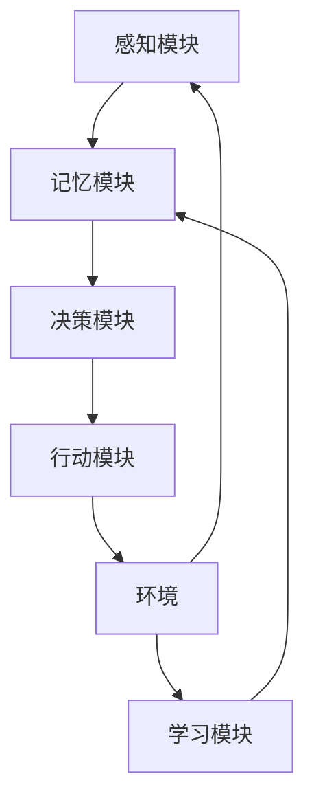

# 构建具有自我演化能力的AI Agent

> 关键词：AI Agent、自我演化、机器学习、强化学习、智能体架构、自适应系统、自主学习

> 摘要：本文围绕构建具有自我演化能力的AI Agent展开深入探讨。首先介绍了相关背景知识，包括目的、预期读者、文档结构和术语表。接着阐述了AI Agent及自我演化的核心概念与联系，给出了原理和架构的文本示意图与Mermaid流程图。详细讲解了核心算法原理，用Python代码进行了具体操作步骤的阐述，同时给出了相关数学模型和公式并举例说明。通过项目实战展示了代码实际案例及详细解释。探讨了其实际应用场景，推荐了学习资源、开发工具框架以及相关论文著作。最后总结了未来发展趋势与挑战，提供了常见问题与解答以及扩展阅读和参考资料，旨在为构建具有自我演化能力的AI Agent提供全面、深入的技术指导。

## 1. 背景介绍 
### 1.1 目的和范围
随着人工智能技术的不断发展，传统的AI系统在面对复杂多变的环境时往往表现出一定的局限性。构建具有自我演化能力的AI Agent的目的在于使智能体能够在不断变化的环境中自主学习、适应和进化，从而更好地完成各种任务。本文的范围涵盖了从核心概念的阐述到实际应用场景的分析，涉及相关的算法原理、数学模型、项目实战以及工具资源推荐等多个方面，旨在为读者提供一个全面的技术指南，帮助读者深入理解并掌握构建具有自我演化能力的AI Agent的方法和技术。

### 1.2 预期读者
本文预期读者包括对人工智能技术有一定了解的程序员、软件架构师、人工智能研究人员以及对智能体技术感兴趣的爱好者。对于希望深入学习和研究具有自我演化能力的AI Agent的专业人士，本文提供了详细的技术原理和实现方法；对于初学者，本文也通过通俗易懂的语言和丰富的实例，帮助他们逐步建立起对该领域的认识和理解。

### 1.3 文档结构概述
本文共分为十个部分。第一部分为背景介绍，包括目的和范围、预期读者、文档结构概述以及术语表。第二部分阐述核心概念与联系，给出原理和架构的文本示意图与Mermaid流程图。第三部分详细讲解核心算法原理，并使用Python源代码说明具体操作步骤。第四部分介绍数学模型和公式，并进行详细讲解和举例说明。第五部分通过项目实战展示代码实际案例和详细解释。第六部分探讨实际应用场景。第七部分推荐学习资源、开发工具框架以及相关论文著作。第八部分总结未来发展趋势与挑战。第九部分为附录，提供常见问题与解答。第十部分为扩展阅读和参考资料。

### 1.4 术语表
#### 1.4.1 核心术语定义
- **AI Agent（人工智能智能体）**：是一个能够感知环境、进行决策并采取行动的实体，它可以是软件程序、机器人或其他具有智能行为的系统。
- **自我演化**：指AI Agent在运行过程中，能够根据环境的变化和自身的经验，自动调整和改进自己的行为、知识和能力，以更好地适应环境和完成任务。
- **机器学习**：是一门多领域交叉学科，涉及概率论、统计学、逼近论、凸分析、算法复杂度理论等多门学科。它专门研究计算机怎样模拟或实现人类的学习行为，以获取新的知识或技能，重新组织已有的知识结构使之不断改善自身的性能。
- **强化学习**：是机器学习中的一个领域，强调智能体如何在环境中采取一系列行动，以最大化累积奖励。智能体通过与环境进行交互，根据环境反馈的奖励信号来学习最优的行为策略。

#### 1.4.2 相关概念解释
- **智能体架构**：指AI Agent的内部结构和组织方式，包括感知模块、决策模块、行动模块等，它决定了智能体如何感知环境、进行决策和采取行动。
- **自适应系统**：是一种能够根据环境变化自动调整自身行为和性能的系统。在AI Agent中，自适应系统可以帮助智能体更好地适应不同的环境和任务需求。
- **自主学习**：指智能体在没有外部明确指导的情况下，能够自主地从环境中获取信息、发现规律并学习新知识和技能的能力。

#### 1.4.3 缩略词列表
- **RL**：Reinforcement Learning，强化学习
- **ML**：Machine Learning，机器学习
- **AI**：Artificial Intelligence，人工智能

## 2. 核心概念与联系 

### 核心概念原理
AI Agent是一个具有感知、决策和行动能力的实体。它通过感知模块获取环境信息，然后将这些信息传递给决策模块。决策模块根据当前的环境状态和自身的知识、经验，选择合适的行动。行动模块则将决策模块的决策转化为实际的行动，作用于环境。

自我演化是AI Agent的一个重要特性。在运行过程中，AI Agent会不断地收集环境信息和自身的行为反馈，通过学习算法对这些信息进行分析和处理，从而更新自己的知识、策略和模型。这样，AI Agent就能够逐渐适应环境的变化，提高自己的性能和能力。

### 架构的文本示意图
AI Agent的架构主要包括以下几个部分：
- **感知模块**：负责收集环境信息，例如传感器数据、图像、文本等。
- **记忆模块**：用于存储智能体的历史经验、知识和模型参数。
- **决策模块**：根据感知模块提供的环境信息和记忆模块中的知识，选择合适的行动。
- **行动模块**：将决策模块的决策转化为实际的行动，作用于环境。
- **学习模块**：根据环境反馈和智能体的行为结果，对记忆模块中的知识和模型参数进行更新，实现自我演化。

### Mermaid流程图


这个流程图展示了AI Agent的基本工作流程。感知模块从环境中获取信息，传递给记忆模块。决策模块根据记忆模块中的信息进行决策，行动模块将决策转化为行动作用于环境。环境的反馈一方面被感知模块再次获取，另一方面传递给学习模块。学习模块根据反馈对记忆模块中的知识和模型进行更新，从而实现AI Agent的自我演化。

## 3. 核心算法原理 & 具体操作步骤 

### 强化学习算法原理
强化学习是构建具有自我演化能力的AI Agent的重要算法之一。在强化学习中，智能体与环境进行交互，环境会根据智能体的行动给予相应的奖励或惩罚。智能体的目标是通过不断地尝试和学习，找到一种最优的行为策略，使得在长期运行过程中获得的累积奖励最大。

强化学习的基本要素包括：
- **状态（State）**：表示环境在某一时刻的特征和状态。
- **行动（Action）**：智能体在某一状态下可以采取的操作。
- **奖励（Reward）**：环境根据智能体的行动给予的反馈信号，用于评价行动的好坏。
- **策略（Policy）**：智能体根据当前状态选择行动的规则。

### Q - learning算法
Q - learning是一种无模型的强化学习算法，它通过学习一个Q值函数来找到最优策略。Q值函数 $Q(s, a)$ 表示在状态 $s$ 下采取行动 $a$ 后，智能体能够获得的期望累积奖励。

Q - learning算法的更新公式为：
$Q(s_t, a_t) \leftarrow Q(s_t, a_t) + \alpha [r_{t+1} + \gamma \max_{a} Q(s_{t+1}, a) - Q(s_t, a_t)]$

其中，$s_t$ 是当前状态，$a_t$ 是当前行动，$r_{t+1}$ 是采取行动后获得的奖励，$s_{t+1}$ 是下一个状态，$\alpha$ 是学习率，$\gamma$ 是折扣因子。

### Python代码实现
```python
import numpy as np

# 定义环境
class Environment:
    def __init__(self):
        self.states = [0, 1, 2, 3]  # 状态空间
        self.actions = [0, 1]  # 行动空间
        self.rewards = np.array([[1, -1], [-1, 1], [1, -1], [-1, 1]])  # 奖励矩阵

    def step(self, state, action):
        next_state = (state + 1) % len(self.states)
        reward = self.rewards[state][action]
        return next_state, reward

# 定义Q - learning智能体
class QLearningAgent:
    def __init__(self, num_states, num_actions, learning_rate=0.1, discount_factor=0.9):
        self.num_states = num_states
        self.num_actions = num_actions
        self.learning_rate = learning_rate
        self.discount_factor = discount_factor
        self.q_table = np.zeros((num_states, num_actions))

    def choose_action(self, state):
        if np.random.uniform(0, 1) < 0.1:  # 探索率为0.1
            action = np.random.choice(self.num_actions)
        else:
            action = np.argmax(self.q_table[state])
        return action

    def update(self, state, action, reward, next_state):
        max_q_next = np.max(self.q_table[next_state])
        self.q_table[state][action] += self.learning_rate * (reward + self.discount_factor * max_q_next - self.q_table[state][action])

# 训练智能体
env = Environment()
agent = QLearningAgent(num_states=len(env.states), num_actions=len(env.actions))

num_episodes = 1000
for episode in range(num_episodes):
    state = np.random.choice(env.states)
    done = False
    while not done:
        action = agent.choose_action(state)
        next_state, reward = env.step(state, action)
        agent.update(state, action, reward, next_state)
        state = next_state
        if state == 3:  # 终止条件
            done = True

# 输出Q表
print("Q - table:")
print(agent.q_table)
```

### 具体操作步骤
1. **初始化环境和智能体**：定义环境的状态空间、行动空间和奖励矩阵，初始化Q - learning智能体的Q表。
2. **训练智能体**：在每个训练回合中，智能体从初始状态开始，根据当前状态选择行动，与环境进行交互，获取奖励和下一个状态。然后，根据Q - learning算法的更新公式更新Q表。
3. **重复训练**：重复上述步骤，直到达到预设的训练回合数。
4. **测试智能体**：训练完成后，可以使用训练好的Q表进行测试，观察智能体的行为表现。

## 4. 数学模型和公式 & 详细讲解 & 举例说明 

### 马尔可夫决策过程（MDP）
马尔可夫决策过程是强化学习的理论基础，它描述了智能体与环境交互的过程。MDP可以用一个五元组 $(S, A, P, R, \gamma)$ 表示，其中：
- $S$ 是状态空间，表示环境的所有可能状态。
- $A$ 是行动空间，表示智能体在每个状态下可以采取的所有可能行动。
- $P(s'|s, a)$ 是状态转移概率，表示在状态 $s$ 下采取行动 $a$ 后转移到状态 $s'$ 的概率。
- $R(s, a, s')$ 是奖励函数，表示在状态 $s$ 下采取行动 $a$ 后转移到状态 $s'$ 时获得的奖励。
- $\gamma \in [0, 1]$ 是折扣因子，用于平衡短期奖励和长期奖励。

### 价值函数
在MDP中，有两种重要的价值函数：状态价值函数 $V(s)$ 和动作价值函数 $Q(s, a)$。

- **状态价值函数**：$V(s)$ 表示在状态 $s$ 下，遵循某一策略 $\pi$ 时，智能体能够获得的期望累积奖励。其定义为：
$$V^{\pi}(s) = \mathbb{E}_{\pi} \left[ \sum_{t=0}^{\infty} \gamma^t r_{t+1} | s_0 = s \right]$$

- **动作价值函数**：$Q(s, a)$ 表示在状态 $s$ 下采取行动 $a$，然后遵循某一策略 $\pi$ 时，智能体能够获得的期望累积奖励。其定义为：
$$Q^{\pi}(s, a) = \mathbb{E}_{\pi} \left[ \sum_{t=0}^{\infty} \gamma^t r_{t+1} | s_0 = s, a_0 = a \right]$$

### 最优价值函数和最优策略
最优状态价值函数 $V^*(s)$ 和最优动作价值函数 $Q^*(s, a)$ 分别表示在所有可能的策略中，能够获得的最大期望累积奖励。

最优策略 $\pi^*$ 是使得 $V^{\pi}(s)$ 或 $Q^{\pi}(s, a)$ 达到最大值的策略。可以通过求解贝尔曼最优方程来找到最优策略。

贝尔曼最优方程为：
$$V^*(s) = \max_{a} \sum_{s'} P(s'|s, a) [R(s, a, s') + \gamma V^*(s')]$$
$$Q^*(s, a) = \sum_{s'} P(s'|s, a) [R(s, a, s') + \gamma \max_{a'} Q^*(s', a')]$$

### 举例说明
考虑一个简单的网格世界环境，智能体在一个 $3 \times 3$ 的网格中移动。智能体的目标是从起点 $(0, 0)$ 移动到终点 $(2, 2)$。智能体可以采取四个行动：上、下、左、右。如果智能体移动到边界外，则会回到原来的位置，并且获得一个负奖励。如果智能体到达终点，则获得一个正奖励。

状态空间 $S$ 是所有可能的网格位置，行动空间 $A$ 是四个行动。状态转移概率 $P(s'|s, a)$ 取决于智能体的行动和环境的规则。奖励函数 $R(s, a, s')$ 根据智能体的行动结果给予相应的奖励。

通过求解贝尔曼最优方程，可以找到智能体的最优策略，使得智能体能够最快地到达终点。

## 5. 项目实战：代码实际案例和详细解释说明 

### 5.1  开发环境搭建
#### 硬件环境
- 处理器：Intel Core i5及以上
- 内存：8GB及以上
- 硬盘：至少有500MB的可用空间

#### 软件环境
- 操作系统：Windows 10、Linux（如Ubuntu 18.04及以上）或macOS
- Python版本：Python 3.6及以上
- 开发工具：推荐使用PyCharm或Jupyter Notebook

#### 安装依赖库
在命令行中使用以下命令安装所需的依赖库：
```sh
pip install numpy
```

### 5.2  源代码详细实现和代码解读
以下是一个更完整的网格世界环境的代码实现：
```python
import numpy as np

# 定义网格世界环境
class GridWorld:
    def __init__(self):
        self.grid_size = 3
        self.start_state = (0, 0)
        self.goal_state = (2, 2)
        self.states = [(i, j) for i in range(self.grid_size) for j in range(self.grid_size)]
        self.actions = ['up', 'down', 'left', 'right']
        self.rewards = np.zeros((self.grid_size, self.grid_size))
        self.rewards[self.goal_state] = 10  # 到达终点的奖励
        self.current_state = self.start_state

    def step(self, action):
        x, y = self.current_state
        if action == 'up':
            x = max(0, x - 1)
        elif action == 'down':
            x = min(self.grid_size - 1, x + 1)
        elif action == 'left':
            y = max(0, y - 1)
        elif action == 'right':
            y = min(self.grid_size - 1, y + 1)
        next_state = (x, y)
        reward = self.rewards[next_state]
        done = next_state == self.goal_state
        self.current_state = next_state
        return next_state, reward, done

    def reset(self):
        self.current_state = self.start_state
        return self.current_state

# 定义Q - learning智能体
class QLearningAgent:
    def __init__(self, states, actions, learning_rate=0.1, discount_factor=0.9, exploration_rate=0.1):
        self.states = states
        self.actions = actions
        self.learning_rate = learning_rate
        self.discount_factor = discount_factor
        self.exploration_rate = exploration_rate
        self.q_table = {}
        for state in states:
            self.q_table[state] = {action: 0 for action in actions}

    def choose_action(self, state):
        if np.random.uniform(0, 1) < self.exploration_rate:
            action = np.random.choice(self.actions)
        else:
            q_values = self.q_table[state]
            max_q = max(q_values.values())
            actions_with_max_q = [action for action, q in q_values.items() if q == max_q]
            action = np.random.choice(actions_with_max_q)
        return action

    def update(self, state, action, reward, next_state):
        max_q_next = max(self.q_table[next_state].values())
        self.q_table[state][action] += self.learning_rate * (reward + self.discount_factor * max_q_next - self.q_table[state][action])

# 训练智能体
env = GridWorld()
agent = QLearningAgent(env.states, env.actions)

num_episodes = 1000
for episode in range(num_episodes):
    state = env.reset()
    done = False
    while not done:
        action = agent.choose_action(state)
        next_state, reward, done = env.step(action)
        agent.update(state, action, reward, next_state)
        state = next_state

# 测试智能体
state = env.reset()
done = False
path = [state]
while not done:
    action = agent.choose_action(state)
    next_state, reward, done = env.step(action)
    state = next_state
    path.append(state)

print("Path:", path)
```

### 5.3  代码解读与分析
- **GridWorld类**：定义了网格世界环境，包括状态空间、行动空间、奖励函数等。`step` 方法用于执行一个行动，返回下一个状态、奖励和是否终止的标志。`reset` 方法用于重置环境到初始状态。
- **QLearningAgent类**：实现了Q - learning智能体，包括Q表的初始化、行动选择和Q表更新等功能。`choose_action` 方法根据探索率选择行动，`update` 方法根据Q - learning算法的更新公式更新Q表。
- **训练过程**：在每个训练回合中，智能体从初始状态开始，根据当前状态选择行动，与环境进行交互，获取奖励和下一个状态。然后，根据Q - learning算法的更新公式更新Q表。
- **测试过程**：训练完成后，使用训练好的Q表进行测试，记录智能体从初始状态到终点的路径。

## 6. 实际应用场景 
### 游戏领域
在游戏中，具有自我演化能力的AI Agent可以作为游戏中的对手或队友。例如，在策略游戏中，AI Agent可以根据玩家的策略和游戏局势的变化，不断调整自己的策略，提高自己的游戏水平。在角色扮演游戏中，AI Agent可以作为非玩家角色（NPC），根据玩家的行为和环境的变化，表现出不同的行为和情感。

### 机器人领域
在机器人领域，具有自我演化能力的AI Agent可以使机器人更好地适应不同的环境和任务需求。例如，在工业生产中，机器人可以根据生产线上的工件变化和设备状态，自动调整自己的操作策略，提高生产效率和质量。在服务机器人领域，机器人可以根据用户的需求和环境的变化，提供更加个性化的服务。

### 金融领域
在金融领域，具有自我演化能力的AI Agent可以用于股票交易、风险评估等任务。例如，AI Agent可以根据市场行情的变化，自动调整股票交易策略，实现最优的投资组合。在风险评估方面，AI Agent可以根据客户的信用信息和市场环境的变化，实时评估风险，为金融机构提供决策支持。

### 医疗领域
在医疗领域，具有自我演化能力的AI Agent可以用于疾病诊断、治疗方案推荐等任务。例如，AI Agent可以根据患者的症状、病史和检查结果，自动学习和分析疾病的特征和规律，提供准确的诊断结果和个性化的治疗方案。同时，AI Agent可以根据患者的治疗反应和病情变化，及时调整治疗方案，提高治疗效果。

## 7. 工具和资源推荐
### 7.1 学习资源推荐
#### 7.1.1 书籍推荐
- 《人工智能：一种现代的方法》：这本书是人工智能领域的经典教材，全面介绍了人工智能的各个方面，包括搜索算法、知识表示、机器学习、自然语言处理等。
- 《强化学习：原理与Python实现》：详细介绍了强化学习的基本原理和算法，通过Python代码实现了多个强化学习的案例，适合初学者学习。
- 《深度学习》：由深度学习领域的三位顶尖专家Ian Goodfellow、Yoshua Bengio和Aaron Courville合著，系统地介绍了深度学习的理论和实践。

#### 7.1.2 在线课程
- Coursera上的“人工智能基础”课程：由全球知名高校的教授授课，内容涵盖人工智能的基本概念、算法和应用。
- edX上的“强化学习”课程：深入讲解了强化学习的理论和实践，包括马尔可夫决策过程、Q - learning、策略梯度等算法。
- 吴恩达的“深度学习专项课程”：在深度学习领域具有很高的知名度，课程内容包括神经网络和深度学习、改善深层神经网络、结构化机器学习项目、卷积神经网络、序列模型等。

#### 7.1.3 技术博客和网站
- Medium：上面有很多关于人工智能和强化学习的技术博客文章，作者来自全球各地的研究人员和开发者。
- arXiv：是一个收集物理学、数学、计算机科学、生物学与统计学论文预印本的网站，上面有很多最新的人工智能研究成果。
- OpenAI Blog：OpenAI官方博客，会发布关于人工智能的最新研究成果和技术进展。

### 7.2 开发工具框架推荐
#### 7.2.1 IDE和编辑器
- PyCharm：是一款专门为Python开发设计的集成开发环境（IDE），具有代码自动补全、调试、版本控制等功能，适合专业开发者使用。
- Jupyter Notebook：是一个开源的Web应用程序，允许用户创建和共享包含代码、方程、可视化和叙述文本的文档，非常适合进行数据分析和机器学习实验。
- Visual Studio Code：是一款轻量级的代码编辑器，支持多种编程语言，具有丰富的插件生态系统，可以通过安装Python插件来进行Python开发。

#### 7.2.2 调试和性能分析工具
- pdb：是Python的标准调试器，可以在代码中设置断点，单步执行代码，查看变量的值等。
- cProfile：是Python的性能分析工具，可以分析代码的运行时间和函数调用次数，帮助开发者找出性能瓶颈。
- TensorBoard：是TensorFlow的可视化工具，可以用于可视化训练过程中的损失函数、准确率等指标，帮助开发者更好地理解模型的训练过程。

#### 7.2.3 相关框架和库
- TensorFlow：是一个开源的机器学习框架，由Google开发和维护，提供了丰富的深度学习模型和工具，支持分布式训练和部署。
- PyTorch：是一个开源的深度学习框架，由Facebook开发和维护，具有动态计算图的特点，易于使用和调试，在学术界和工业界都有广泛的应用。
- Stable Baselines：是一个基于OpenAI Gym的强化学习库，提供了多种强化学习算法的实现，方便开发者进行强化学习实验。

### 7.3 相关论文著作推荐
#### 7.3.1 经典论文
- “Reinforcement Learning: A Survey”：这篇论文是强化学习领域的经典综述论文，全面介绍了强化学习的发展历程、基本概念和算法。
- “Playing Atari with Deep Reinforcement Learning”：这篇论文首次提出了深度Q网络（DQN）算法，将深度学习和强化学习相结合，在Atari游戏中取得了很好的效果。
- “Proximal Policy Optimization Algorithms”：这篇论文提出了近端策略优化（PPO）算法，是一种高效的策略梯度算法，在多个强化学习任务中取得了很好的性能。

#### 7.3.2 最新研究成果
- 关注ICML（国际机器学习会议）、NeurIPS（神经信息处理系统大会）、AAAI（美国人工智能协会会议）等顶级学术会议的论文，这些会议上会发布人工智能领域的最新研究成果。
- 关注顶级学术期刊，如Journal of Artificial Intelligence Research（JAIR）、Artificial Intelligence等，这些期刊上会发表高质量的人工智能研究论文。

#### 7.3.3 应用案例分析
- 一些知名科技公司的技术博客会分享他们在人工智能领域的应用案例，例如Google AI Blog、Facebook AI Research等。
- 一些开源项目的文档和代码也可以作为应用案例进行学习，例如OpenAI Gym的官方文档和示例代码，其中包含了很多强化学习的应用案例。

## 8. 总结：未来发展趋势与挑战
### 未来发展趋势
- **多智能体协同**：未来的AI Agent将不再是孤立的个体，而是多个智能体之间进行协同工作。例如，在自动驾驶领域，多辆自动驾驶汽车可以通过协同合作，实现更加高效和安全的交通流量管理。
- **与人类的深度融合**：AI Agent将与人类更加紧密地结合，例如在医疗领域，AI Agent可以作为医生的辅助工具，提供更加准确的诊断和治疗建议；在教育领域，AI Agent可以作为个性化学习的导师，根据学生的学习情况提供定制化的学习方案。
- **跨领域应用**：具有自我演化能力的AI Agent将在更多的领域得到应用，例如农业、能源、环保等领域。在农业领域，AI Agent可以根据土壤、气候等环境因素，自动调整种植策略，提高农作物的产量和质量。

### 挑战
- **计算资源需求**：具有自我演化能力的AI Agent通常需要大量的计算资源来进行训练和推理。随着模型的不断复杂和数据量的不断增加，计算资源的需求也会越来越大，如何降低计算资源的消耗是一个重要的挑战。
- **安全性和可靠性**：在一些关键领域，如医疗、交通等，AI Agent的安全性和可靠性至关重要。如何确保AI Agent在各种情况下都能做出正确的决策，避免出现错误和故障，是需要解决的问题。
- **伦理和法律问题**：随着AI Agent的广泛应用，伦理和法律问题也日益凸显。例如，当AI Agent做出的决策导致了不良后果时，责任应该如何界定；AI Agent的行为是否符合伦理道德标准等。

## 9. 附录：常见问题与解答
### Q1：什么是自我演化能力？
A1：自我演化能力指AI Agent在运行过程中，能够根据环境的变化和自身的经验，自动调整和改进自己的行为、知识和能力，以更好地适应环境和完成任务。

### Q2：强化学习和监督学习有什么区别？
A2：监督学习是基于有标签的数据进行学习，模型的目标是学习输入数据和标签之间的映射关系。而强化学习是通过智能体与环境进行交互，根据环境反馈的奖励信号来学习最优的行为策略，没有明确的标签数据。

### Q3：如何选择合适的学习率和折扣因子？
A3：学习率和折扣因子是强化学习中的重要超参数。学习率控制了每次更新Q表时的步长，折扣因子平衡了短期奖励和长期奖励。通常需要通过实验来选择合适的学习率和折扣因子，一般学习率可以选择在0.1 - 0.5之间，折扣因子可以选择在0.9 - 0.99之间。

### Q4：如何处理连续状态和行动空间？
A4：对于连续状态和行动空间，可以使用函数逼近的方法，例如神经网络。将状态作为输入，输出Q值或策略。深度Q网络（DQN）就是一种使用神经网络来处理连续状态空间的强化学习算法。

## 10. 扩展阅读 & 参考资料
### 扩展阅读
- 《智能系统原理》：深入介绍了智能系统的基本原理和方法，包括知识表示、推理、学习等方面的内容。
- 《人工智能哲学》：探讨了人工智能领域的哲学问题，如人工智能的本质、意识、伦理等，有助于从哲学的角度理解人工智能。

### 参考资料
- Sutton, R. S., & Barto, A. G. (2018). Reinforcement learning: An introduction. MIT press.
- Goodfellow, I., Bengio, Y., & Courville, A. (2016). Deep learning. MIT press.
- OpenAI Gym官方文档：https://gym.openai.com/docs/
- TensorFlow官方文档：https://www.tensorflow.org/guide
- PyTorch官方文档：https://pytorch.org/docs/stable/index.html