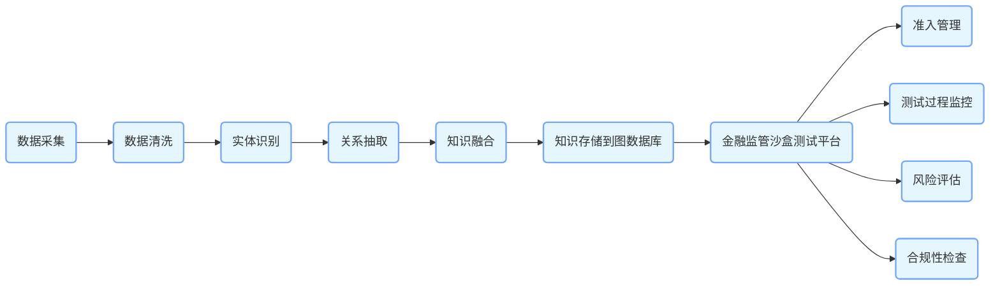

# 构建基于知识图谱的金融监管沙盒测试平台

> 关键词：知识图谱、金融监管、沙盒测试平台、人工智能、大数据、合规性检查、风险评估

> 摘要：本文旨在探讨如何构建基于知识图谱的金融监管沙盒测试平台。首先介绍了该平台构建的背景，包括目的、预期读者、文档结构等内容。接着阐述了知识图谱与金融监管沙盒测试平台相关的核心概念及其联系，详细讲解了核心算法原理和具体操作步骤，并给出了相应的数学模型和公式。通过项目实战展示了代码实际案例及详细解释，分析了其在实际中的应用场景。同时推荐了相关的学习资源、开发工具框架以及论文著作。最后对基于知识图谱的金融监管沙盒测试平台的未来发展趋势与挑战进行总结，并提供了常见问题的解答和扩展阅读参考资料，为构建此类平台提供全面而深入的技术指导。

## 1. 背景介绍 
### 1.1 目的和范围
金融行业的快速发展以及金融创新的不断涌现，给金融监管带来了巨大的挑战。传统的监管方式往往难以适应复杂多变的金融业务场景，无法及时准确地识别和防范金融风险。金融监管沙盒测试平台作为一种创新的监管工具，旨在为金融创新提供一个相对安全的测试环境，在保障消费者权益的前提下，促进金融创新的发展。

知识图谱作为一种强大的知识表示和推理工具，能够整合多源异构的金融数据，揭示金融实体之间的复杂关系，为金融监管提供更加全面、深入的信息支持。构建基于知识图谱的金融监管沙盒测试平台的目的在于：
- 提高金融监管的效率和准确性，通过知识图谱的关联分析和推理能力，快速发现潜在的金融风险和合规问题。
- 促进金融创新，为金融机构提供一个安全的测试环境，降低创新成本和风险。
- 加强金融监管的智能化水平，利用人工智能技术实现自动化的风险监测和合规性检查。

本平台的范围涵盖了金融监管沙盒测试的各个环节，包括金融产品的准入管理、测试过程的监控、风险评估和合规性检查等。

### 1.2 预期读者
本文的预期读者包括金融监管机构的工作人员、金融机构的合规管理人员、金融科技企业的研发人员以及对金融监管和知识图谱技术感兴趣的研究人员。

### 1.3 文档结构概述
本文将按照以下结构进行组织：
- 核心概念与联系：介绍知识图谱、金融监管沙盒测试平台的核心概念及其相互关系。
- 核心算法原理 & 具体操作步骤：详细讲解构建知识图谱和实现金融监管沙盒测试的核心算法原理，并给出具体的操作步骤。
- 数学模型和公式 & 详细讲解 & 举例说明：给出相关的数学模型和公式，并通过具体的例子进行详细讲解。
- 项目实战：代码实际案例和详细解释说明：通过一个具体的项目实战，展示如何实现基于知识图谱的金融监管沙盒测试平台，并对代码进行详细的解释和分析。
- 实际应用场景：分析基于知识图谱的金融监管沙盒测试平台在实际中的应用场景。
- 工具和资源推荐：推荐相关的学习资源、开发工具框架以及论文著作。
- 总结：未来发展趋势与挑战：对基于知识图谱的金融监管沙盒测试平台的未来发展趋势和挑战进行总结。
- 附录：常见问题与解答：提供常见问题的解答。
- 扩展阅读 & 参考资料：提供扩展阅读的资料和参考文献。

### 1.4 术语表
#### 1.4.1 核心术语定义
- **知识图谱**：是一种语义网络，用于表示实体之间的关系和属性，将现实世界中的各种知识以图的形式进行组织和表示。
- **金融监管沙盒**：是一种创新的监管机制，允许金融机构在一个受监管的环境中测试新的金融产品、服务或商业模式，而无需立即遵守全部的监管要求。
- **金融实体**：指金融领域中的各种参与者，如银行、证券机构、保险公司、企业和个人等。
- **合规性检查**：指检查金融机构的业务活动是否符合相关的法律法规和监管要求。
- **风险评估**：指对金融机构的业务活动可能面临的风险进行评估和分析。

#### 1.4.2 相关概念解释
- **多源异构数据**：指来自不同数据源、具有不同格式和结构的数据。在金融领域，多源异构数据包括金融交易数据、监管政策文件、新闻报道等。
- **语义网络**：是一种用图来表示知识的方法，其中节点表示实体，边表示实体之间的关系。
- **图数据库**：是一种专门用于存储和管理图数据的数据库，能够高效地处理图的查询和分析。

#### 1.4.3 缩略词列表
- **API**：Application Programming Interface（应用程序编程接口）
- **AI**：Artificial Intelligence（人工智能）
- **KG**：Knowledge Graph（知识图谱）
- **NLP**：Natural Language Processing（自然语言处理）
- **RDF**：Resource Description Framework（资源描述框架）

## 2. 核心概念与联系 

### 知识图谱原理
知识图谱是一种基于图的数据结构，由节点（实体）和边（关系）组成。每个节点表示一个实体，如金融机构、金融产品、客户等；每条边表示实体之间的关系，如“发行”、“购买”、“持有”等。知识图谱通过对实体和关系的建模，将现实世界中的知识以结构化的方式进行表示，便于计算机进行处理和分析。

知识图谱的构建过程通常包括数据采集、数据清洗、实体识别、关系抽取、知识融合和知识存储等步骤。数据采集是从各种数据源中获取相关的数据；数据清洗是对采集到的数据进行预处理，去除噪声和错误信息；实体识别是从文本中识别出实体；关系抽取是确定实体之间的关系；知识融合是将不同数据源中的知识进行整合；知识存储是将构建好的知识图谱存储到图数据库中。

### 金融监管沙盒测试平台原理
金融监管沙盒测试平台是一个为金融创新提供安全测试环境的平台。其原理是通过设定一定的测试规则和条件，允许金融机构在该环境中测试新的金融产品、服务或商业模式。在测试过程中，平台会对金融机构的业务活动进行实时监控和风险评估，确保测试活动不会对金融市场和消费者造成重大影响。

金融监管沙盒测试平台通常包括准入管理、测试过程监控、风险评估和合规性检查等模块。准入管理模块负责对申请进入沙盒测试的金融机构和项目进行审核和筛选；测试过程监控模块负责对金融机构在沙盒测试中的业务活动进行实时监控；风险评估模块负责对金融机构的业务活动可能面临的风险进行评估和分析；合规性检查模块负责检查金融机构的业务活动是否符合相关的法律法规和监管要求。

### 知识图谱与金融监管沙盒测试平台的联系
知识图谱为金融监管沙盒测试平台提供了强大的知识支持。通过构建金融领域的知识图谱，可以整合多源异构的金融数据，揭示金融实体之间的复杂关系，为金融监管沙盒测试平台的准入管理、测试过程监控、风险评估和合规性检查等模块提供更加全面、深入的信息支持。

例如，在准入管理模块中，知识图谱可以帮助监管机构更好地了解申请进入沙盒测试的金融机构和项目的背景信息、业务模式和风险状况，从而做出更加准确的决策。在测试过程监控模块中，知识图谱可以实时跟踪金融机构的业务活动，发现潜在的风险和合规问题。在风险评估模块中，知识图谱可以通过关联分析和推理，对金融机构的业务活动可能面临的风险进行全面、深入的评估。在合规性检查模块中，知识图谱可以将金融机构的业务活动与相关的法律法规和监管要求进行比对，快速发现合规问题。

### 文本示意图
```plaintext
金融监管沙盒测试平台
├── 准入管理模块
│   └── 知识图谱（提供金融机构和项目信息）
├── 测试过程监控模块
│   └── 知识图谱（实时跟踪业务活动）
├── 风险评估模块
│   └── 知识图谱（关联分析风险）
└── 合规性检查模块
    └── 知识图谱（比对合规要求）
```

### Mermaid 流程图


## 3. 核心算法原理 & 具体操作步骤 

### 知识图谱构建算法原理
知识图谱的构建主要涉及实体识别和关系抽取两个核心算法。

#### 实体识别算法
实体识别是从文本中识别出实体的过程。常用的实体识别算法包括基于规则的方法、基于机器学习的方法和基于深度学习的方法。

基于规则的方法是通过手工编写规则来识别实体。这种方法的优点是准确性高，但缺点是需要大量的人工编写规则，并且难以处理复杂的语言现象。

基于机器学习的方法是通过训练机器学习模型来识别实体。常用的机器学习模型包括隐马尔可夫模型（HMM）、条件随机场（CRF）等。这种方法的优点是可以自动学习实体的特征，但缺点是需要大量的标注数据。

基于深度学习的方法是通过训练深度学习模型来识别实体。常用的深度学习模型包括循环神经网络（RNN）、长短时记忆网络（LSTM）、门控循环单元（GRU）等。这种方法的优点是可以自动学习文本的语义信息，并且能够处理复杂的语言现象，但缺点是训练时间长，需要大量的计算资源。

以下是一个使用Python和`spaCy`库实现的简单实体识别示例：
```python
import spacy

# 加载英文语言模型
nlp = spacy.load("en_core_web_sm")

# 待处理的文本
text = "Apple is a technology company based in California."

# 处理文本
doc = nlp(text)

# 提取实体
for ent in doc.ents:
    print(ent.text, ent.start_char, ent.end_char, ent.label_)
```
#### 关系抽取算法
关系抽取是确定实体之间关系的过程。常用的关系抽取算法包括基于规则的方法、基于机器学习的方法和基于深度学习的方法。

基于规则的方法是通过手工编写规则来抽取关系。这种方法的优点是准确性高，但缺点是需要大量的人工编写规则，并且难以处理复杂的语言现象。

基于机器学习的方法是通过训练机器学习模型来抽取关系。常用的机器学习模型包括支持向量机（SVM）、决策树等。这种方法的优点是可以自动学习关系的特征，但缺点是需要大量的标注数据。

基于深度学习的方法是通过训练深度学习模型来抽取关系。常用的深度学习模型包括卷积神经网络（CNN）、循环神经网络（RNN）等。这种方法的优点是可以自动学习文本的语义信息，并且能够处理复杂的语言现象，但缺点是训练时间长，需要大量的计算资源。

以下是一个使用Python和`transformers`库实现的简单关系抽取示例：
```python
from transformers import AutoTokenizer, AutoModelForSequenceClassification
import torch

# 加载预训练模型和分词器
tokenizer = AutoTokenizer.from_pretrained("bert-base-uncased")
model = AutoModelForSequenceClassification.from_pretrained("bert-base-uncased", num_labels=2)

# 待处理的文本
text = "Apple is a technology company based in California."
entity1 = "Apple"
entity2 = "California"

# 构建输入
input_text = f"{entity1} [SEP] {entity2} [SEP] {text}"
inputs = tokenizer(input_text, return_tensors="pt")

# 进行推理
with torch.no_grad():
    outputs = model(**inputs)
    logits = outputs.logits
    prediction = torch.argmax(logits, dim=1).item()

print("关系预测结果:", prediction)
```
### 金融监管沙盒测试平台核心算法原理
#### 风险评估算法
风险评估是金融监管沙盒测试平台的核心功能之一。常用的风险评估算法包括基于统计的方法、基于机器学习的方法和基于深度学习的方法。

基于统计的方法是通过对历史数据进行统计分析来评估风险。常用的统计指标包括均值、方差、标准差等。这种方法的优点是简单易懂，但缺点是无法考虑到数据的复杂性和不确定性。

基于机器学习的方法是通过训练机器学习模型来评估风险。常用的机器学习模型包括逻辑回归、决策树、随机森林等。这种方法的优点是可以自动学习风险的特征，但缺点是需要大量的标注数据。

基于深度学习的方法是通过训练深度学习模型来评估风险。常用的深度学习模型包括神经网络、卷积神经网络（CNN）、循环神经网络（RNN）等。这种方法的优点是可以自动学习数据的复杂特征，并且能够处理大规模的数据，但缺点是训练时间长，需要大量的计算资源。

以下是一个使用Python和`scikit-learn`库实现的简单风险评估示例：
```python
from sklearn.linear_model import LogisticRegression
from sklearn.model_selection import train_test_split
from sklearn.metrics import accuracy_score
import numpy as np

# 生成示例数据
X = np.random.rand(100, 10)
y = np.random.randint(0, 2, 100)

# 划分训练集和测试集
X_train, X_test, y_train, y_test = train_test_split(X, y, test_size=0.2, random_state=42)

# 训练逻辑回归模型
model = LogisticRegression()
model.fit(X_train, y_train)

# 进行预测
y_pred = model.predict(X_test)

# 计算准确率
accuracy = accuracy_score(y_test, y_pred)
print("风险评估准确率:", accuracy)
```
#### 合规性检查算法
合规性检查是金融监管沙盒测试平台的另一个核心功能。合规性检查算法通常是通过将金融机构的业务活动与相关的法律法规和监管要求进行比对来实现的。

以下是一个简单的合规性检查示例：
```python
# 定义合规规则
compliance_rules = {
    "rule1": lambda x: x > 10,
    "rule2": lambda x: x < 20
}

# 金融机构的业务活动数据
business_activity = 15

# 进行合规性检查
is_compliant = True
for rule_name, rule_func in compliance_rules.items():
    if not rule_func(business_activity):
        is_compliant = False
        print(f"违反规则 {rule_name}")

if is_compliant:
    print("业务活动符合所有规则")
```
### 具体操作步骤
#### 知识图谱构建步骤
1. **数据采集**：从各种数据源中获取相关的金融数据，如金融交易数据、监管政策文件、新闻报道等。
2. **数据清洗**：对采集到的数据进行预处理，去除噪声和错误信息。
3. **实体识别**：使用实体识别算法从文本中识别出实体。
4. **关系抽取**：使用关系抽取算法确定实体之间的关系。
5. **知识融合**：将不同数据源中的知识进行整合。
6. **知识存储**：将构建好的知识图谱存储到图数据库中。

#### 金融监管沙盒测试平台搭建步骤
1. **需求分析**：明确金融监管沙盒测试平台的功能需求和性能需求。
2. **系统设计**：设计金融监管沙盒测试平台的架构和模块。
3. **数据库设计**：设计金融监管沙盒测试平台的数据库结构，包括图数据库和关系型数据库。
4. **开发实现**：使用编程语言和开发框架实现金融监管沙盒测试平台的各个模块。
5. **测试部署**：对金融监管沙盒测试平台进行测试和部署。

## 4. 数学模型和公式 & 详细讲解 & 举例说明 

### 知识图谱相关数学模型和公式
#### 图的表示
知识图谱可以用图 $G=(V, E)$ 来表示，其中 $V$ 表示节点（实体）的集合，$E$ 表示边（关系）的集合。每个节点 $v \in V$ 可以用一个向量 $\mathbf{x}_v$ 来表示，每个边 $e=(u, v) \in E$ 可以用一个关系类型 $r$ 来表示。

#### 实体嵌入
实体嵌入是将实体表示为低维向量的过程。常用的实体嵌入方法包括 TransE、TransH、TransR 等。以 TransE 为例，其目标是学习实体和关系的嵌入，使得对于每个三元组 $(h, r, t)$，其中 $h$ 表示头实体，$r$ 表示关系，$t$ 表示尾实体，满足 $\mathbf{h} + \mathbf{r} \approx \mathbf{t}$，其中 $\mathbf{h}$、$\mathbf{r}$ 和 $\mathbf{t}$ 分别是头实体、关系和尾实体的嵌入向量。

TransE 的损失函数可以定义为：
$$
L = \sum_{(h, r, t) \in S} \sum_{(h', r, t') \in S'} [\gamma + d(\mathbf{h} + \mathbf{r}, \mathbf{t}) - d(\mathbf{h}' + \mathbf{r}, \mathbf{t}')]_+
$$
其中 $S$ 是正样本集合，$S'$ 是负样本集合，$\gamma$ 是边际超参数，$d(\cdot, \cdot)$ 是距离函数，通常使用欧几里得距离或曼哈顿距离，$[x]_+ = \max(0, x)$ 是合页损失函数。

#### 举例说明
假设我们有一个简单的知识图谱，包含以下三元组：(Apple, 总部位于, California)。我们可以使用 TransE 算法学习实体和关系的嵌入。首先，随机初始化实体和关系的嵌入向量，然后通过最小化损失函数来更新嵌入向量。经过多次迭代后，我们可以得到实体和关系的最终嵌入向量，使得 $\mathbf{Apple} + \mathbf{总部位于} \approx \mathbf{California}$。

### 金融监管沙盒测试平台相关数学模型和公式
#### 风险评估模型
风险评估模型通常可以用一个函数 $f(X)$ 来表示，其中 $X$ 是金融机构的业务活动数据，$f(X)$ 是风险评估结果。常用的风险评估模型包括线性回归模型、逻辑回归模型、决策树模型等。

以逻辑回归模型为例，其数学表达式为：
$$
P(Y = 1|X) = \frac{1}{1 + e^{-(\mathbf{w}^T\mathbf{X} + b)}}
$$
其中 $Y$ 是风险标签（0 表示无风险，1 表示有风险），$\mathbf{X}$ 是输入特征向量，$\mathbf{w}$ 是权重向量，$b$ 是偏置项。

#### 合规性检查模型
合规性检查模型可以用一个布尔函数 $g(X)$ 来表示，其中 $X$ 是金融机构的业务活动数据，$g(X)$ 表示业务活动是否符合相关的法律法规和监管要求。

#### 举例说明
假设我们有一个金融机构的业务活动数据 $X = [x_1, x_2, x_3]$，我们可以使用逻辑回归模型进行风险评估。首先，训练逻辑回归模型，得到权重向量 $\mathbf{w} = [w_1, w_2, w_3]$ 和偏置项 $b$。然后，计算 $P(Y = 1|X) = \frac{1}{1 + e^{-(\mathbf{w}^T\mathbf{X} + b)}}$。如果 $P(Y = 1|X) > 0.5$，则认为该金融机构存在风险。

对于合规性检查，假设我们有一个合规规则：$x_1 > 10$ 且 $x_2 < 20$。我们可以定义布尔函数 $g(X) = (x_1 > 10) \land (x_2 < 20)$。如果 $g(X) = True$，则认为该金融机构的业务活动符合相关的法律法规和监管要求。

## 5. 项目实战：代码实际案例和详细解释说明 

### 5.1  开发环境搭建
#### 硬件环境
- 处理器：Intel Core i7 及以上
- 内存：16GB 及以上
- 硬盘：500GB 及以上

#### 软件环境
- 操作系统：Windows 10 或 Ubuntu 18.04 及以上
- Python 版本：3.7 及以上
- 图数据库：Neo4j
- 开发框架：Flask

#### 安装依赖库
```bash
pip install spacy
python -m spacy download en_core_web_sm
pip install transformers
pip install scikit-learn
pip install flask
```
#### 安装 Neo4j
1. 下载 Neo4j 社区版：https://neo4j.com/download-center/#community
2. 安装 Neo4j：按照安装向导进行安装。
3. 启动 Neo4j：打开终端，运行以下命令：
```bash
neo4j start
```
4. 访问 Neo4j 浏览器：打开浏览器，访问 http://localhost:7474，使用默认用户名和密码（neo4j/neo4j）登录。

### 5.2  源代码详细实现和代码解读
#### 知识图谱构建模块
```python
import spacy
from py2neo import Graph, Node, Relationship

# 加载英文语言模型
nlp = spacy.load("en_core_web_sm")

# 连接 Neo4j 数据库
graph = Graph("bolt://localhost:7687", auth=("neo4j", "password"))

# 待处理的文本
text = "Apple is a technology company based in California."

# 处理文本
doc = nlp(text)

# 提取实体
entities = []
for ent in doc.ents:
    entity = Node(ent.label_, name=ent.text)
    entities.append(entity)
    graph.merge(entity, ent.label_, "name")

# 提取关系
relations = []
for token in doc:
    if token.dep_ == "nsubj":
        head_entity = next((e for e in entities if e["name"] == token.head.text), None)
        child_entity = next((e for e in entities if e["name"] == token.text), None)
        if head_entity and child_entity:
            relation = Relationship(child_entity, "IS_SUBJECT_OF", head_entity)
            relations.append(relation)
            graph.merge(relation)

print("知识图谱构建完成")
```
**代码解读**：
1. **加载语言模型**：使用 `spacy.load("en_core_web_sm")` 加载英文语言模型。
2. **连接数据库**：使用 `Graph("bolt://localhost:7687", auth=("neo4j", "password"))` 连接 Neo4j 数据库。
3. **提取实体**：使用 `doc.ents` 提取文本中的实体，并将实体存储到 Neo4j 数据库中。
4. **提取关系**：使用 `token.dep_` 提取实体之间的关系，并将关系存储到 Neo4j 数据库中。

#### 金融监管沙盒测试平台模块
```python
from flask import Flask, request, jsonify
from sklearn.linear_model import LogisticRegression
import numpy as np

app = Flask(__name__)

# 训练风险评估模型
X = np.random.rand(100, 10)
y = np.random.randint(0, 2, 100)
model = LogisticRegression()
model.fit(X, y)

# 定义合规规则
compliance_rules = {
    "rule1": lambda x: x > 10,
    "rule2": lambda x: x < 20
}

@app.route('/risk_assessment', methods=['POST'])
def risk_assessment():
    data = request.get_json()
    input_data = np.array(data["input"]).reshape(1, -1)
    prediction = model.predict(input_data)
    return jsonify({"risk_prediction": prediction[0]})

@app.route('/compliance_check', methods=['POST'])
def compliance_check():
    data = request.get_json()
    business_activity = data["business_activity"]
    is_compliant = True
    for rule_name, rule_func in compliance_rules.items():
        if not rule_func(business_activity):
            is_compliant = False
            break
    return jsonify({"is_compliant": is_compliant})

if __name__ == '__main__':
    app.run(debug=True)
```
**代码解读**：
1. **训练风险评估模型**：使用 `LogisticRegression()` 训练风险评估模型。
2. **定义合规规则**：定义两个合规规则 `rule1` 和 `rule2`。
3. **风险评估接口**：使用 `/risk_assessment` 接口接收金融机构的业务活动数据，并返回风险评估结果。
4. **合规性检查接口**：使用 `/compliance_check` 接口接收金融机构的业务活动数据，并返回合规性检查结果。

### 5.3  代码解读与分析
#### 知识图谱构建模块分析
- **优点**：使用 `spacy` 库可以方便地进行实体识别和关系抽取，使用 Neo4j 图数据库可以高效地存储和管理知识图谱。
- **缺点**：`spacy` 库的实体识别和关系抽取能力有限，对于复杂的语言现象可能无法准确识别。

#### 金融监管沙盒测试平台模块分析
- **优点**：使用 Flask 框架可以快速搭建一个 RESTful API 服务，方便与其他系统进行集成。
- **缺点**：风险评估模型和合规规则是简单的示例，实际应用中需要根据具体需求进行优化和调整。

## 6. 实际应用场景 
### 金融产品创新测试
金融机构可以在基于知识图谱的金融监管沙盒测试平台上测试新的金融产品，如创新的理财产品、信贷产品等。通过知识图谱的关联分析和推理能力，平台可以帮助监管机构更好地了解金融产品的风险状况和合规性，从而做出更加准确的决策。同时，金融机构可以在测试过程中收集用户反馈，对金融产品进行优化和改进。

### 金融科技企业孵化
金融科技企业可以利用金融监管沙盒测试平台来测试其新的技术和业务模式，如区块链技术在金融领域的应用、人工智能在风险评估中的应用等。知识图谱可以整合多源异构的金融数据，为金融科技企业提供更加全面、深入的信息支持，帮助其快速发现潜在的风险和问题，提高创新效率和成功率。

### 金融市场风险监测
监管机构可以利用基于知识图谱的金融监管沙盒测试平台对金融市场进行实时监测，及时发现潜在的风险和危机。通过知识图谱的关联分析和推理能力，平台可以揭示金融实体之间的复杂关系，发现隐藏的风险传导路径，为监管机构提供更加准确的风险预警信息。

### 金融合规性检查
金融机构需要遵守各种法律法规和监管要求，基于知识图谱的金融监管沙盒测试平台可以帮助金融机构进行合规性检查。平台可以将金融机构的业务活动与相关的法律法规和监管要求进行比对，快速发现合规问题，并提供相应的整改建议。

## 7. 工具和资源推荐
### 7.1 学习资源推荐
#### 7.1.1 书籍推荐
- 《知识图谱：方法、实践与应用》：本书全面介绍了知识图谱的相关理论、方法和技术，以及在不同领域的应用案例。
- 《Python 自然语言处理》：本书详细介绍了 Python 语言在自然语言处理中的应用，包括文本处理、实体识别、关系抽取等技术。
- 《金融科技：框架与实践》：本书介绍了金融科技的相关概念、技术和应用，包括区块链、人工智能、大数据等在金融领域的应用。

#### 7.1.2 在线课程
- Coursera 上的“Natural Language Processing Specialization”：该课程由斯坦福大学的教授授课，全面介绍了自然语言处理的相关知识和技术。
- edX 上的“Blockchain and Cryptocurrencies”：该课程介绍了区块链技术和加密货币的相关知识和技术。
- Udemy 上的“Artificial Intelligence A-Z™: Learn How To Build An AI”：该课程介绍了人工智能的相关知识和技术，包括机器学习、深度学习等。

#### 7.1.3 技术博客和网站
- 开源中国：https://www.oschina.net/ 提供了丰富的开源技术资源和技术文章。
- 博客园：https://www.cnblogs.com/ 有很多技术专家分享的技术文章和经验。
- 机器之心：https://www.alizila.com/ 专注于人工智能、机器学习等领域的技术报道和分析。

### 7.2 开发工具框架推荐
#### 7.2.1 IDE和编辑器
- PyCharm：是一款专门用于 Python 开发的集成开发环境，提供了丰富的功能和插件，方便开发和调试 Python 代码。
- Visual Studio Code：是一款轻量级的代码编辑器，支持多种编程语言，具有丰富的插件生态系统。
- Jupyter Notebook：是一种交互式的开发环境，适合进行数据分析和机器学习实验。

#### 7.2.2 调试和性能分析工具
- Py-Spy：是一个用于 Python 代码性能分析的工具，可以帮助开发者找出代码中的性能瓶颈。
- Flask-DebugToolbar：是一个用于 Flask 应用程序的调试工具，提供了详细的调试信息和性能分析功能。
- TensorBoard：是一个用于深度学习模型可视化和性能分析的工具，支持 TensorFlow、PyTorch 等深度学习框架。

#### 7.2.3 相关框架和库
- spaCy：是一个用于自然语言处理的 Python 库，提供了高效的实体识别、关系抽取等功能。
- transformers：是一个用于自然语言处理的 Python 库，提供了预训练的深度学习模型，如 BERT、GPT 等。
- scikit-learn：是一个用于机器学习的 Python 库，提供了丰富的机器学习算法和工具。
- Neo4j Python Driver：是一个用于连接和操作 Neo4j 图数据库的 Python 驱动程序。

### 7.3 相关论文著作推荐
#### 7.3.1 经典论文
- “Translating Embeddings for Modeling Multi-relational Data”：该论文提出了 TransE 算法，是知识图谱嵌入领域的经典论文。
- “Conditional Random Fields: Probabilistic Models for Segmenting and Labeling Sequence Data”：该论文提出了条件随机场（CRF）算法，是自然语言处理领域的经典论文。
- “Gradient-based Learning Applied to Document Recognition”：该论文提出了卷积神经网络（CNN）算法，是深度学习领域的经典论文。

#### 7.3.2 最新研究成果
- 关注顶级学术会议如 ACL（Association for Computational Linguistics）、KDD（Knowledge Discovery and Data Mining）、ICML（International Conference on Machine Learning）等，这些会议上的研究成果代表了该领域的最新进展。
- 查阅相关的学术期刊如 Journal of Artificial Intelligence Research、ACM Transactions on Knowledge Discovery from Data 等，这些期刊上发表了很多高质量的研究论文。

#### 7.3.3 应用案例分析
- 金融稳定理事会（FSB）发布的关于金融科技监管的报告，其中包含了很多金融科技应用案例和监管实践。
- 各国金融监管机构发布的金融监管沙盒测试报告，介绍了金融监管沙盒测试的实践经验和应用案例。

## 8. 总结：未来发展趋势与挑战
### 未来发展趋势
#### 智能化监管
随着人工智能技术的不断发展，基于知识图谱的金融监管沙盒测试平台将越来越智能化。平台将能够自动学习和理解金融业务的规则和模式，实现自动化的风险监测和合规性检查。例如，利用深度学习技术对金融文本进行语义分析，自动识别金融产品的风险特征和合规问题。

#### 跨领域融合
金融行业与其他行业的融合将越来越深入，基于知识图谱的金融监管沙盒测试平台将需要整合更多跨领域的数据和知识。例如，将金融数据与医疗数据、交通数据等进行融合，挖掘潜在的金融风险和创新机会。

#### 全球协同监管
随着金融全球化的发展，金融监管需要各国之间的协同合作。基于知识图谱的金融监管沙盒测试平台将能够实现全球金融数据的共享和协同监管，提高金融监管的效率和效果。

### 挑战
#### 数据质量和安全
知识图谱的构建和应用依赖于大量的数据，数据的质量和安全是一个重要的挑战。金融数据通常包含敏感信息，需要采取严格的安全措施来保护数据的隐私和安全。同时，数据的准确性和完整性也直接影响知识图谱的质量和应用效果。

#### 技术复杂度
知识图谱的构建和应用涉及到多种技术，如自然语言处理、机器学习、图数据库等，技术复杂度较高。需要具备专业的技术人才和丰富的实践经验，才能有效地构建和应用基于知识图谱的金融监管沙盒测试平台。

#### 法律法规和政策
金融监管受到严格的法律法规和政策的约束，基于知识图谱的金融监管沙盒测试平台的应用需要符合相关的法律法规和政策要求。同时，法律法规和政策的不断变化也给平台的应用带来了一定的挑战。

## 9. 附录：常见问题与解答
### 知识图谱构建相关问题
#### 问：如何选择合适的实体识别和关系抽取算法？
答：选择合适的实体识别和关系抽取算法需要考虑数据的特点、任务的要求和计算资源等因素。如果数据量较小，可以选择基于规则的方法；如果数据量较大，可以选择基于机器学习或深度学习的方法。同时，还需要根据任务的要求选择合适的模型，如对于文本分类任务，可以选择逻辑回归模型；对于序列标注任务，可以选择条件随机场（CRF）模型。

#### 问：知识图谱构建过程中如何处理多源异构数据？
答：处理多源异构数据需要进行数据清洗、数据转换和知识融合等操作。首先，对采集到的数据进行清洗，去除噪声和错误信息；然后，将不同格式和结构的数据转换为统一的格式；最后，使用知识融合算法将不同数据源中的知识进行整合。

### 金融监管沙盒测试平台相关问题
#### 问：如何确保金融监管沙盒测试平台的安全性？
答：确保金融监管沙盒测试平台的安全性需要采取多种措施，如数据加密、访问控制、安全审计等。同时，还需要对平台进行定期的安全评估和漏洞修复，及时发现和解决安全问题。

#### 问：金融监管沙盒测试平台如何进行性能优化？
答：金融监管沙盒测试平台的性能优化可以从多个方面入手，如优化算法、优化数据库、使用分布式计算等。例如，使用高效的算法可以减少计算时间；优化数据库可以提高数据的读写速度；使用分布式计算可以提高系统的处理能力。

## 10. 扩展阅读 & 参考资料
### 扩展阅读
- 《金融科技前沿：技术趋势与应用实践》
- 《区块链：技术驱动金融》
- 《人工智能：现代方法》

### 参考资料
- 金融稳定理事会（FSB）官方网站：https://www.fsb.org/
- 国际清算银行（BIS）官方网站：https://www.bis.org/
- 各国金融监管机构官方网站，如中国人民银行（https://www.pbc.gov.cn/）、美国证券交易委员会（https://www.sec.gov/）等。