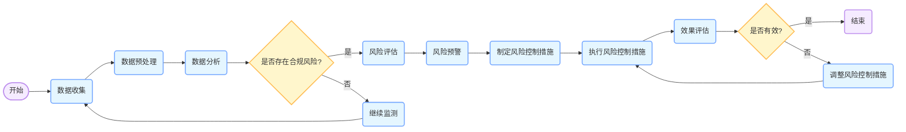

# 构建智能企业合规管理系统：AI辅助风险识别与控制

> 关键词：智能企业合规管理系统、AI、风险识别、风险控制、合规管理、机器学习、数据分析

> 摘要：本文聚焦于构建智能企业合规管理系统，深入探讨利用AI技术辅助企业进行风险识别与控制的相关内容。首先介绍了企业合规管理的背景和构建智能系统的重要性，阐述了核心概念与联系，包括AI在合规管理中的作用原理和架构。详细讲解了核心算法原理及具体操作步骤，并结合数学模型和公式进行理论支撑。通过项目实战展示了代码实际案例及详细解释。分析了该系统的实际应用场景，推荐了相关的学习资源、开发工具框架以及论文著作。最后总结了未来发展趋势与挑战，解答了常见问题并提供扩展阅读与参考资料，旨在为企业实现高效合规管理提供全面的技术指导和理论支持。

## 1. 背景介绍 
### 1.1 目的和范围
在当今复杂多变的商业环境中，企业面临着日益严格的法律法规和监管要求。合规管理对于企业的生存和发展至关重要，它不仅关系到企业的声誉和信誉，还直接影响企业的经济效益和市场竞争力。本文章的目的在于探讨如何利用人工智能（AI）技术构建智能企业合规管理系统，以辅助企业更高效地进行风险识别与控制，确保企业的运营活动符合相关法律法规和内部政策的要求。

本文的范围涵盖了智能企业合规管理系统的各个方面，包括核心概念、算法原理、数学模型、项目实战、应用场景、工具资源推荐等。通过对这些内容的详细阐述，为企业和相关技术人员提供全面的指导和参考，帮助他们更好地理解和应用AI技术来提升企业合规管理水平。

### 1.2 预期读者
本文的预期读者包括企业的合规管理人员、风险管理专家、信息技术人员、企业高层管理人员以及对人工智能和企业合规管理感兴趣的研究人员和学者。对于合规管理人员和风险管理专家，本文将提供实用的技术方法和案例，帮助他们优化现有的合规管理流程；对于信息技术人员，本文将深入介绍AI算法和技术实现细节，为他们开发智能合规管理系统提供技术支持；对于企业高层管理人员，本文将帮助他们了解AI在合规管理中的价值和应用前景，以便做出合理的决策；对于研究人员和学者，本文将为他们提供相关的理论研究和实践案例，促进该领域的学术交流和研究发展。

### 1.3 文档结构概述
本文将按照以下结构进行组织：
1. **背景介绍**：介绍构建智能企业合规管理系统的目的、范围、预期读者以及文档结构概述，并对相关术语进行定义和解释。
2. **核心概念与联系**：阐述智能企业合规管理系统的核心概念，包括AI在合规管理中的作用原理和架构，通过文本示意图和Mermaid流程图进行详细说明。
3. **核心算法原理 & 具体操作步骤**：详细讲解用于风险识别和控制的核心算法原理，并使用Python源代码进行详细阐述，同时给出具体的操作步骤。
4. **数学模型和公式 & 详细讲解 & 举例说明**：介绍与风险识别和控制相关的数学模型和公式，进行详细讲解并通过具体例子进行说明。
5. **项目实战：代码实际案例和详细解释说明**：通过实际项目案例，展示智能企业合规管理系统的开发过程，包括开发环境搭建、源代码详细实现和代码解读与分析。
6. **实际应用场景**：分析智能企业合规管理系统在不同行业和领域的实际应用场景。
7. **工具和资源推荐**：推荐相关的学习资源、开发工具框架以及论文著作，帮助读者进一步深入学习和研究。
8. **总结：未来发展趋势与挑战**：总结智能企业合规管理系统的发展趋势，并分析面临的挑战。
9. **附录：常见问题与解答**：解答读者在学习和应用过程中可能遇到的常见问题。
10. **扩展阅读 & 参考资料**：提供相关的扩展阅读材料和参考资料，方便读者进一步深入学习和研究。

### 1.4 术语表
#### 1.4.1 核心术语定义
- **智能企业合规管理系统**：利用人工智能技术，结合企业的业务流程和合规要求，实现自动化的风险识别、评估和控制的信息系统。
- **AI（人工智能）**：研究、开发用于模拟、延伸和扩展人的智能的理论、方法、技术及应用系统的一门新的技术科学。
- **风险识别**：通过各种方法和技术，识别企业运营过程中可能面临的合规风险的过程。
- **风险控制**：针对识别出的合规风险，采取相应的措施进行防范和处理，以降低风险发生的可能性和影响程度的过程。
- **合规管理**：企业为了确保其运营活动符合法律法规、监管要求和内部政策而进行的一系列管理活动。

#### 1.4.2 相关概念解释
- **机器学习**：人工智能的一个分支，它致力于研究如何让计算机通过数据学习模式和规律，从而实现预测和决策的能力。在智能企业合规管理系统中，机器学习可以用于风险识别和预测。
- **数据分析**：对大量的数据进行收集、整理、分析和解释，以发现有价值的信息和知识的过程。在合规管理中，数据分析可以帮助企业发现潜在的合规风险和趋势。
- **自然语言处理（NLP）**：人工智能的一个领域，主要研究如何让计算机理解和处理人类语言。在合规管理中，NLP可以用于对法规文本、合同条款等自然语言文本的分析和理解。

#### 1.4.3 缩略词列表
- **AI**：Artificial Intelligence（人工智能）
- **ML**：Machine Learning（机器学习）
- **NLP**：Natural Language Processing（自然语言处理）
- **RPA**：Robotic Process Automation（机器人流程自动化）

## 2. 核心概念与联系 

### 智能企业合规管理系统的核心概念
智能企业合规管理系统是将人工智能技术与企业合规管理相结合的创新系统。其核心目标是利用AI的强大能力，实现对企业合规风险的高效识别和精准控制。

#### 原理
AI在智能企业合规管理系统中的作用原理主要基于以下几个方面：
- **数据驱动**：系统收集企业内部和外部的各种数据，包括业务数据、法规文本、市场信息等。通过对这些数据的分析和挖掘，AI可以发现潜在的合规风险模式和规律。
- **模式识别**：利用机器学习算法，对历史合规案例和数据进行学习，建立风险识别模型。这些模型可以自动识别新的业务活动中是否存在合规风险。
- **自然语言处理**：对于法规文本、合同条款等自然语言文本，使用NLP技术进行解析和理解。将文本信息转化为计算机可处理的结构化数据，以便进行风险分析和评估。
- **决策支持**：基于风险识别和评估的结果，AI系统可以为企业提供决策建议，帮助企业制定合理的风险控制措施。

#### 架构
智能企业合规管理系统的架构通常包括以下几个层次：
- **数据层**：负责收集、存储和管理企业的各种数据，包括结构化数据和非结构化数据。数据来源可以包括企业内部的业务系统、外部的法规数据库、新闻媒体等。
- **处理层**：对数据层收集的数据进行预处理和分析。包括数据清洗、特征提取、模型训练等操作。使用机器学习、NLP等AI技术，对数据进行深入挖掘和分析。
- **应用层**：提供各种合规管理应用功能，如风险识别、风险评估、风险预警、合规报告等。这些应用功能基于处理层的分析结果，为企业的合规管理提供支持。
- **用户界面层**：为企业用户提供友好的交互界面，方便用户使用系统的各种功能。用户可以通过界面进行数据查询、风险查看、决策制定等操作。

### 文本示意图
```plaintext
智能企业合规管理系统
|-- 数据层
|   |-- 企业内部业务数据
|   |-- 外部法规数据库
|   |-- 新闻媒体数据
|-- 处理层
|   |-- 数据预处理
|   |   |-- 数据清洗
|   |   |-- 特征提取
|   |-- 数据分析
|       |-- 机器学习模型训练
|       |-- 自然语言处理
|-- 应用层
|   |-- 风险识别
|   |-- 风险评估
|   |-- 风险预警
|   |-- 合规报告
|-- 用户界面层
|   |-- 风险查看
|   |-- 决策制定
|   |-- 数据查询
```

### Mermaid流程图


## 3. 核心算法原理 & 具体操作步骤 

### 核心算法原理
在智能企业合规管理系统中，常用的核心算法包括机器学习算法和自然语言处理算法。以下分别介绍这些算法的原理。

#### 机器学习算法 - 逻辑回归
逻辑回归是一种常用的分类算法，用于预测一个样本属于某个类别的概率。在合规风险识别中，逻辑回归可以用于判断一个业务活动是否存在合规风险。

逻辑回归的基本原理是通过一个逻辑函数将线性回归的结果映射到[0, 1]的概率区间。逻辑函数的表达式为：
$$\sigma(z)=\frac{1}{1 + e^{-z}}$$
其中，$z$ 是线性回归的结果，$e$ 是自然常数。

逻辑回归的目标是找到一组最优的参数 $\theta$，使得模型对训练数据的预测概率最大。通常使用最大似然估计来求解最优参数。

#### 自然语言处理算法 - 词向量模型
词向量模型是一种将文本中的单词表示为向量的技术。在合规管理中，词向量模型可以用于对法规文本、合同条款等自然语言文本进行分析和理解。

常用的词向量模型包括Word2Vec和GloVe。这些模型的基本原理是通过在大规模文本数据上进行训练，学习单词之间的语义关系。将单词表示为向量后，可以方便地计算单词之间的相似度，从而实现文本的分类、聚类等任务。

### 具体操作步骤

#### 数据收集
首先，需要收集企业内部和外部的各种数据，包括业务数据、法规文本、新闻媒体数据等。数据的来源可以包括企业的业务系统、数据库、网页爬虫等。

#### 数据预处理
对收集到的数据进行预处理，包括数据清洗、特征提取等操作。
- **数据清洗**：去除数据中的噪声、重复数据和缺失值。
- **特征提取**：从原始数据中提取有用的特征，以便后续的分析和建模。对于结构化数据，可以直接使用数值特征；对于非结构化数据，如文本数据，需要使用自然语言处理技术进行特征提取。

#### 模型训练
使用预处理后的数据进行模型训练。对于风险识别任务，可以使用逻辑回归等机器学习算法进行训练。对于文本分析任务，可以使用词向量模型等自然语言处理算法进行训练。

#### 模型评估
使用测试数据对训练好的模型进行评估，计算模型的准确率、召回率、F1值等指标，评估模型的性能。

#### 风险识别与控制
使用训练好的模型对新的业务活动进行风险识别。如果识别出存在合规风险，系统将进行风险评估，并提供相应的风险控制建议。

### Python源代码实现

#### 逻辑回归实现
```python
import numpy as np
from sklearn.linear_model import LogisticRegression
from sklearn.model_selection import train_test_split
from sklearn.metrics import accuracy_score

# 生成示例数据
X = np.random.rand(100, 5)
y = np.random.randint(0, 2, 100)

# 划分训练集和测试集
X_train, X_test, y_train, y_test = train_test_split(X, y, test_size=0.2, random_state=42)

# 创建逻辑回归模型
model = LogisticRegression()

# 训练模型
model.fit(X_train, y_train)

# 预测
y_pred = model.predict(X_test)

# 评估模型
accuracy = accuracy_score(y_test, y_pred)
print(f"Accuracy: {accuracy}")
```

#### 词向量模型实现
```python
from gensim.models import Word2Vec
import nltk
from nltk.tokenize import word_tokenize
nltk.download('punkt')

# 示例文本数据
sentences = [
    "This is a sample sentence.",
    "Another sample sentence for testing."
]

# 分词
tokenized_sentences = [word_tokenize(sentence.lower()) for sentence in sentences]

# 训练Word2Vec模型
model = Word2Vec(tokenized_sentences, min_count=1)

# 获取单词的向量表示
vector = model.wv['sample']
print(f"Vector for 'sample': {vector}")
```

## 4. 数学模型和公式 & 详细讲解 & 举例说明 

### 逻辑回归的数学模型和公式
逻辑回归的数学模型可以表示为：
$$P(y = 1|x)=\sigma(\theta^T x)$$
其中，$P(y = 1|x)$ 表示在给定特征向量 $x$ 的情况下，样本属于正类（存在合规风险）的概率，$\theta$ 是模型的参数向量，$\sigma$ 是逻辑函数。

逻辑回归的损失函数通常使用对数损失函数，也称为交叉熵损失函数。对于单个样本 $(x, y)$，其对数损失函数的表达式为：
$$L(\theta; x, y)=-y\log(P(y = 1|x))-(1 - y)\log(1 - P(y = 1|x))$$
对于整个训练数据集 $D=\{(x_1, y_1), (x_2, y_2), \cdots, (x_n, y_n)\}$，其对数损失函数的表达式为：
$$J(\theta)=\frac{1}{n}\sum_{i = 1}^{n}L(\theta; x_i, y_i)$$

逻辑回归的目标是找到一组最优的参数 $\theta$，使得损失函数 $J(\theta)$ 最小。通常使用梯度下降法等优化算法来求解最优参数。

### 详细讲解
逻辑回归的核心思想是通过一个线性组合将特征向量 $x$ 映射到一个实数 $z=\theta^T x$，然后通过逻辑函数将 $z$ 映射到[0, 1]的概率区间。逻辑函数的特点是在 $z = 0$ 处取值为 0.5，当 $z$ 趋近于正无穷时，函数值趋近于 1；当 $z$ 趋近于负无穷时，函数值趋近于 0。

对数损失函数的作用是衡量模型预测的概率与真实标签之间的差异。当样本的真实标签为 1 时，如果模型预测的概率接近 1，则损失函数的值较小；如果模型预测的概率接近 0，则损失函数的值较大。同理，当样本的真实标签为 0 时，如果模型预测的概率接近 0，则损失函数的值较小；如果模型预测的概率接近 1，则损失函数的值较大。

梯度下降法是一种常用的优化算法，其基本思想是沿着损失函数的负梯度方向更新参数 $\theta$，直到损失函数达到最小值。梯度下降法的更新公式为：
$$\theta := \theta-\alpha\nabla J(\theta)$$
其中，$\alpha$ 是学习率，$\nabla J(\theta)$ 是损失函数 $J(\theta)$ 关于参数 $\theta$ 的梯度。

### 举例说明
假设我们有一个简单的二分类问题，特征向量 $x$ 只有一个特征，即 $x\in\mathbb{R}$。模型的参数向量 $\theta=[\theta_0, \theta_1]$，则 $z=\theta_0+\theta_1 x$。

假设 $\theta_0 = 0$，$\theta_1 = 1$，则 $z = x$。当 $x = 0$ 时，$z = 0$，$P(y = 1|x)=\sigma(0)=0.5$；当 $x = 1$ 时，$z = 1$，$P(y = 1|x)=\sigma(1)\approx0.73$；当 $x = -1$ 时，$z = -1$，$P(y = 1|x)=\sigma(-1)\approx0.27$。

假设我们有一个训练数据集 $D=\{(1, 1), (2, 1), (-1, 0), (-2, 0)\}$，我们可以使用梯度下降法来求解最优的参数 $\theta$。具体实现可以参考上一节的Python代码。

### 词向量模型的数学模型和公式
词向量模型的核心思想是通过在大规模文本数据上进行训练，学习单词之间的语义关系。以Word2Vec为例，其数学模型基于神经网络。

Word2Vec有两种训练模式：CBOW（Continuous Bag-of-Words）和Skip-gram。

#### CBOW
CBOW的目标是根据上下文单词预测中心单词。假设上下文单词的向量表示为 $w_{c - n}, w_{c - n + 1}, \cdots, w_{c - 1}, w_{c + 1}, \cdots, w_{c + n}$，中心单词的向量表示为 $w_c$，则CBOW的训练目标是最大化以下概率：
$$P(w_c|w_{c - n}, w_{c - n + 1}, \cdots, w_{c - 1}, w_{c + 1}, \cdots, w_{c + n})$$

#### Skip-gram
Skip-gram的目标是根据中心单词预测上下文单词。假设中心单词的向量表示为 $w_c$，上下文单词的向量表示为 $w_{c - n}, w_{c - n + 1}, \cdots, w_{c - 1}, w_{c + 1}, \cdots, w_{c + n}$，则Skip-gram的训练目标是最大化以下概率：
$$P(w_{c - n}, w_{c - n + 1}, \cdots, w_{c - 1}, w_{c + 1}, \cdots, w_{c + n}|w_c)$$

### 详细讲解
CBOW模型通过将上下文单词的向量表示进行求和或平均，得到一个上下文向量，然后通过一个神经网络将上下文向量映射到中心单词的概率分布。Skip-gram模型则是将中心单词的向量表示输入到一个神经网络中，输出上下文单词的概率分布。

在训练过程中，通过不断调整单词的向量表示，使得模型的预测概率最大化。训练完成后，每个单词都对应一个向量表示，这些向量表示可以反映单词之间的语义关系。

### 举例说明
假设我们有一个简单的文本句子 “The cat sat on the mat”。如果我们使用CBOW模型，以 “sat” 为中心单词，上下文窗口大小为 2，则上下文单词为 “The”，“cat”，“on”，“the”。CBOW模型的目标是根据这些上下文单词预测中心单词 “sat”。

如果我们使用Skip-gram模型，以 “sat” 为中心单词，上下文窗口大小为 2，则模型的目标是根据 “sat” 预测上下文单词 “The”，“cat”，“on”，“the”。

## 5. 项目实战：代码实际案例和详细解释说明 

### 5.1  开发环境搭建
#### 操作系统
本项目可以在Windows、Linux或macOS等主流操作系统上进行开发。建议使用Linux系统，如Ubuntu 18.04及以上版本，因为Linux系统在开发和部署方面具有更好的稳定性和兼容性。

#### 编程语言
本项目使用Python作为主要的编程语言。Python具有丰富的库和工具，适合进行数据处理、机器学习和自然语言处理等任务。建议使用Python 3.7及以上版本。

#### 开发工具
- **Anaconda**：Anaconda是一个Python的发行版，包含了许多常用的科学计算库和工具。可以从Anaconda官方网站（https://www.anaconda.com/products/individual）下载并安装适合自己操作系统的版本。
- **PyCharm**：PyCharm是一款功能强大的Python集成开发环境（IDE），可以提高开发效率。可以从JetBrains官方网站（https://www.jetbrains.com/pycharm/）下载并安装社区版或专业版。

#### 相关库和框架
- **Scikit-learn**：Scikit-learn是一个用于机器学习的Python库，提供了许多常用的机器学习算法和工具。可以使用以下命令进行安装：
```sh
pip install scikit-learn
```
- **Gensim**：Gensim是一个用于自然语言处理的Python库，提供了Word2Vec等词向量模型的实现。可以使用以下命令进行安装：
```sh
pip install gensim
```
- **NLTK**：NLTK是一个用于自然语言处理的Python库，提供了许多自然语言处理的工具和数据集。可以使用以下命令进行安装：
```sh
pip install nltk
```
安装完成后，还需要下载NLTK的数据集：
```python
import nltk
nltk.download('punkt')
```

### 5.2  源代码详细实现和代码解读

#### 数据收集和预处理
```python
import pandas as pd
from sklearn.preprocessing import StandardScaler
from nltk.tokenize import word_tokenize
import nltk
nltk.download('punkt')

# 读取数据
data = pd.read_csv('compliance_data.csv')

# 数据清洗
data = data.dropna()

# 特征提取
# 对于数值特征，进行标准化处理
numeric_features = data.select_dtypes(include=['number']).columns
scaler = StandardScaler()
data[numeric_features] = scaler.fit_transform(data[numeric_features])

# 对于文本特征，进行分词处理
text_features = data.select_dtypes(include=['object']).columns
for feature in text_features:
    data[feature] = data[feature].apply(lambda x: word_tokenize(x.lower()))
```
**代码解读**：
- 首先，使用 `pandas` 库读取CSV格式的合规数据文件。
- 然后，使用 `dropna()` 方法去除数据中的缺失值。
- 对于数值特征，使用 `StandardScaler` 进行标准化处理，将特征值缩放到均值为 0，标准差为 1 的范围。
- 对于文本特征，使用 `nltk` 库的 `word_tokenize` 方法进行分词处理，并将所有单词转换为小写。

#### 模型训练和评估
```python
from sklearn.model_selection import train_test_split
from sklearn.linear_model import LogisticRegression
from sklearn.metrics import accuracy_score

# 划分特征和标签
X = data.drop('label', axis=1)
y = data['label']

# 划分训练集和测试集
X_train, X_test, y_train, y_test = train_test_split(X, y, test_size=0.2, random_state=42)

# 创建逻辑回归模型
model = LogisticRegression()

# 训练模型
model.fit(X_train, y_train)

# 预测
y_pred = model.predict(X_test)

# 评估模型
accuracy = accuracy_score(y_test, y_pred)
print(f"Accuracy: {accuracy}")
```
**代码解读**：
- 首先，将数据划分为特征矩阵 $X$ 和标签向量 $y$。
- 然后，使用 `train_test_split` 方法将数据划分为训练集和测试集，测试集占总数据的 20%。
- 创建逻辑回归模型，并使用训练集数据进行训练。
- 使用训练好的模型对测试集数据进行预测。
- 最后，使用 `accuracy_score` 方法计算模型的准确率。

#### 文本分析
```python
from gensim.models import Word2Vec

# 训练Word2Vec模型
model = Word2Vec(data[text_features[0]], min_count=1)

# 获取单词的向量表示
vector = model.wv['compliance']
print(f"Vector for 'compliance': {vector}")
```
**代码解读**：
- 使用 `Gensim` 库的 `Word2Vec` 模型对文本特征进行训练。
- 训练完成后，可以使用 `wv` 属性获取单词的向量表示。

### 5.3  代码解读与分析
#### 数据预处理的重要性
数据预处理是机器学习和自然语言处理中非常重要的一步。通过数据清洗可以去除数据中的噪声和缺失值，提高数据的质量。特征提取可以将原始数据转换为适合模型训练的特征，提高模型的性能。对于数值特征，标准化处理可以使得不同特征具有相同的尺度，避免某些特征对模型的影响过大。对于文本特征，分词处理可以将文本转换为单词序列，方便后续的处理和分析。

#### 模型选择和评估
在本项目中，选择逻辑回归作为风险识别的模型。逻辑回归是一种简单而有效的分类算法，适用于二分类问题。在模型评估方面，使用准确率作为评估指标。准确率是指模型预测正确的样本数占总样本数的比例。然而，准确率并不是唯一的评估指标，在实际应用中，还需要考虑召回率、F1值等指标，以全面评估模型的性能。

#### 文本分析的作用
文本分析在智能企业合规管理系统中具有重要的作用。通过词向量模型可以将文本中的单词表示为向量，从而可以计算单词之间的相似度。在合规管理中，可以利用词向量模型对法规文本、合同条款等自然语言文本进行分析和理解，发现潜在的合规风险。

## 6. 实际应用场景 
### 金融行业
在金融行业，合规管理是非常重要的。智能企业合规管理系统可以帮助金融机构识别和控制各种合规风险，如反洗钱、内幕交易、市场操纵等。通过对交易数据、客户信息、新闻媒体等数据的分析，系统可以及时发现异常交易行为和潜在的合规风险，并提供相应的预警和控制建议。

### 医疗行业
在医疗行业，合规管理涉及到患者隐私保护、药品安全、医疗质量等多个方面。智能企业合规管理系统可以对医疗记录、药品信息、医疗设备使用等数据进行分析，识别潜在的合规风险，如患者信息泄露、药品违规使用等。同时，系统可以帮助医疗机构制定和执行合规政策，确保医疗服务的质量和安全。

### 制造业
在制造业，合规管理包括环境保护、安全生产、知识产权保护等方面。智能企业合规管理系统可以对生产过程中的数据进行监测和分析，识别潜在的环境风险、安全隐患和知识产权侵权行为。通过及时预警和控制措施，帮助企业降低合规风险，提高企业的可持续发展能力。

### 互联网行业
在互联网行业，合规管理涉及到用户隐私保护、网络安全、内容合规等多个方面。智能企业合规管理系统可以对用户数据、网站内容、网络流量等数据进行分析，识别潜在的合规风险，如用户信息泄露、网络攻击、不良内容传播等。通过实时监测和预警，帮助互联网企业及时发现和处理合规问题，保护用户权益和企业声誉。

## 7. 工具和资源推荐
### 7.1 学习资源推荐
#### 7.1.1 书籍推荐
- 《Python机器学习》：本书详细介绍了Python在机器学习领域的应用，包括各种机器学习算法的原理和实现。
- 《自然语言处理入门》：本书系统地介绍了自然语言处理的基本概念、方法和技术，适合初学者学习。
- 《人工智能：现代方法》：本书是人工智能领域的经典教材，全面介绍了人工智能的各个方面，包括机器学习、自然语言处理、知识表示等。

#### 7.1.2 在线课程
- Coursera上的“机器学习”课程：由斯坦福大学的Andrew Ng教授授课，是学习机器学习的经典课程。
- edX上的“自然语言处理”课程：由哈佛大学和麻省理工学院联合开设，系统地介绍了自然语言处理的理论和实践。
- 阿里云天池平台上的“人工智能实战”课程：提供了丰富的人工智能实战项目和案例，帮助学习者提高实践能力。

#### 7.1.3 技术博客和网站
- 博客园：是一个技术交流平台，有许多关于人工智能、机器学习和自然语言处理的技术文章和经验分享。
- 开源中国：提供了大量的开源项目和技术资讯，对于学习和了解相关技术有很大的帮助。
- Kaggle：是一个数据科学竞赛平台，上面有许多关于机器学习和数据分析的竞赛和数据集，可以通过参加竞赛来提高自己的技术水平。

### 7.2 开发工具框架推荐
#### 7.2.1 IDE和编辑器
- PyCharm：是一款功能强大的Python集成开发环境，提供了代码编辑、调试、版本控制等功能，适合专业的Python开发人员使用。
- Jupyter Notebook：是一个交互式的开发环境，适合进行数据探索、模型训练和可视化等任务。可以方便地展示代码和结果，便于交流和分享。
- Visual Studio Code：是一款轻量级的代码编辑器，支持多种编程语言和插件，具有良好的扩展性和兼容性。

#### 7.2.2 调试和性能分析工具
- PySnooper：是一个简单易用的Python调试工具，可以自动记录函数的调用过程和变量的值，方便调试代码。
- cProfile：是Python内置的性能分析工具，可以分析代码的执行时间和函数调用次数，帮助优化代码性能。
- TensorBoard：是TensorFlow提供的可视化工具，可以用于可视化模型的训练过程、损失函数曲线、网络结构等，方便分析和优化模型。

#### 7.2.3 相关框架和库
- Scikit-learn：是一个用于机器学习的Python库，提供了许多常用的机器学习算法和工具，如分类、回归、聚类等。
- Gensim：是一个用于自然语言处理的Python库，提供了Word2Vec、Doc2Vec等词向量模型的实现，方便进行文本分析和处理。
- TensorFlow和PyTorch：是两个常用的深度学习框架，提供了丰富的深度学习模型和工具，适合进行复杂的机器学习和自然语言处理任务。

### 7.3 相关论文著作推荐
#### 7.3.1 经典论文
- “A Logical Calculus of the Ideas Immanent in Nervous Activity”：由Warren S. McCulloch和Walter Pitts发表，是神经网络领域的经典论文，提出了神经元模型和逻辑计算的概念。
- “Efficient Estimation of Word Representations in Vector Space”：由Tomas Mikolov等人发表，介绍了Word2Vec模型的原理和实现，是自然语言处理领域的重要论文。
- “Gradient-Based Learning Applied to Document Recognition”：由Yann LeCun等人发表，介绍了卷积神经网络（CNN）在手写字符识别中的应用，是深度学习领域的经典论文。

#### 7.3.2 最新研究成果
- 关注顶级学术会议，如NeurIPS（神经信息处理系统大会）、ACL（计算语言学协会年会）、ICML（国际机器学习会议）等，这些会议上发表的论文代表了人工智能和自然语言处理领域的最新研究成果。
- 查阅相关的学术期刊，如Journal of Artificial Intelligence Research（JAIR）、Artificial Intelligence、Computational Linguistics等，这些期刊上发表的论文具有较高的学术水平和研究价值。

#### 7.3.3 应用案例分析
- 一些知名企业和研究机构会发布关于智能企业合规管理系统的应用案例和研究报告，可以通过它们的官方网站或相关媒体渠道获取。例如，IBM、微软等公司会分享它们在合规管理领域的实践经验和技术成果。

## 8. 总结：未来发展趋势与挑战
### 未来发展趋势
#### 更强大的AI技术应用
随着人工智能技术的不断发展，未来智能企业合规管理系统将应用更强大的AI技术，如深度学习、强化学习等。深度学习可以处理更复杂的数据和任务，提高风险识别的准确性和效率；强化学习可以根据环境的变化自动调整风险控制策略，实现自适应的合规管理。

#### 与其他技术的融合
智能企业合规管理系统将与其他技术，如区块链、物联网等进行融合。区块链技术可以提供不可篡改的交易记录和数据溯源，增强合规管理的可信度和透明度；物联网技术可以实时监测企业的生产和运营过程，提供更全面的合规数据。

#### 个性化的合规管理
未来的智能企业合规管理系统将根据企业的行业特点、规模、业务模式等因素，提供个性化的合规管理解决方案。系统将能够自动识别企业的特定合规需求，并提供相应的风险识别和控制策略。

#### 智能决策支持
智能企业合规管理系统将不仅仅是一个风险识别和预警系统，还将提供智能决策支持功能。系统将能够根据风险评估结果和企业的目标，自动生成最优的风险控制方案，并为企业的决策提供参考。

### 挑战
#### 数据质量和隐私问题
智能企业合规管理系统依赖于大量的数据进行分析和决策，数据的质量和隐私问题是一个重要的挑战。数据可能存在噪声、缺失值和错误，需要进行有效的数据清洗和预处理。同时，企业的合规数据往往包含敏感信息，需要采取有效的措施保护数据的隐私和安全。

#### 算法的可解释性
AI算法，尤其是深度学习算法，往往是黑盒模型，其决策过程难以解释。在合规管理中，企业需要了解模型的决策依据，以便进行合理的决策和风险控制。因此，提高算法的可解释性是一个亟待解决的问题。

#### 法律法规的变化
法律法规和监管要求不断变化，智能企业合规管理系统需要及时更新和调整以适应这些变化。这需要系统具备良好的灵活性和可扩展性，能够快速响应法律法规的变化。

#### 人才短缺
智能企业合规管理系统的开发和应用需要既懂人工智能技术又懂合规管理的复合型人才。目前，这类人才相对短缺，限制了智能企业合规管理系统的发展和应用。

## 9. 附录：常见问题与解答
### 1. 智能企业合规管理系统的实施成本高吗？
智能企业合规管理系统的实施成本因企业的规模、业务复杂度和系统功能需求而异。一般来说，系统的实施成本包括硬件设备、软件系统、数据采集和处理、人员培训等方面的费用。对于大型企业，实施成本可能相对较高；对于小型企业，可以选择一些轻量级的解决方案，降低实施成本。

### 2. 如何确保智能企业合规管理系统的准确性和可靠性？
为了确保系统的准确性和可靠性，可以采取以下措施：
- 使用高质量的数据进行模型训练和验证。
- 选择合适的算法和模型，并进行充分的调优和评估。
- 建立有效的监控和反馈机制，及时发现和纠正系统中的错误和偏差。
- 定期对系统进行更新和维护，以适应法律法规和业务环境的变化。

### 3. 智能企业合规管理系统可以完全替代人工合规管理吗？
智能企业合规管理系统不能完全替代人工合规管理。虽然系统可以自动识别和预警一些常见的合规风险，但在一些复杂的情况下，如法律法规的解释和判断、企业战略决策等，还需要人工的参与和判断。智能企业合规管理系统可以作为人工合规管理的辅助工具，提高合规管理的效率和准确性。

### 4. 如何保护智能企业合规管理系统中的数据安全和隐私？
为了保护数据的安全和隐私，可以采取以下措施：
- 对数据进行加密处理，确保数据在传输和存储过程中的安全性。
- 建立严格的访问控制机制，限制只有授权人员才能访问和处理数据。
- 定期对数据进行备份，以防数据丢失或损坏。
- 遵守相关的法律法规和行业标准，如GDPR（通用数据保护条例）等。

### 5. 智能企业合规管理系统需要具备哪些功能？
智能企业合规管理系统通常需要具备以下功能：
- 风险识别：自动识别企业运营过程中可能面临的合规风险。
- 风险评估：对识别出的合规风险进行评估，确定风险的等级和影响程度。
- 风险预警：及时向企业相关人员发出风险预警，提醒他们采取相应的措施。
- 合规报告：生成合规报告，向企业管理层和监管机构汇报企业的合规情况。
- 决策支持：为企业的合规决策提供支持，帮助企业制定合理的风险控制措施。

## 10. 扩展阅读 & 参考资料
### 扩展阅读
- 《企业合规管理体系建设指南》：详细介绍了企业合规管理体系的建设方法和流程，对于理解企业合规管理的整体框架有很大的帮助。
- 《AI时代的企业风险管理》：探讨了人工智能技术在企业风险管理中的应用和挑战，为智能企业合规管理系统的发展提供了新的思路。
- 《数据驱动的企业决策》：强调了数据在企业决策中的重要性，对于理解智能企业合规管理系统如何利用数据进行风险识别和控制有一定的启示。

### 参考资料
- 相关法律法规和监管文件，如《中华人民共和国公司法》、《中华人民共和国证券法》、《金融机构反洗钱规定》等。
- 行业标准和规范，如ISO 37301《合规管理体系 要求及使用指南》等。
- 学术论文和研究报告，如在IEEE、ACM等学术会议和期刊上发表的关于人工智能和合规管理的论文。