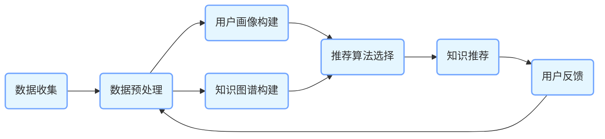

# 构建智能企业知识推荐系统：个性化学习与技能提升

> 关键词：智能企业知识推荐系统、个性化学习、技能提升、知识图谱、推荐算法

> 摘要：本文聚焦于构建智能企业知识推荐系统，旨在实现员工的个性化学习与技能提升。首先介绍了该系统构建的背景、目的、预期读者等信息，接着阐述了核心概念与联系，包括相关原理和架构的文本示意图及 Mermaid 流程图。详细讲解了核心算法原理和具体操作步骤，并给出 Python 源代码。通过数学模型和公式进一步剖析系统的理论基础，结合项目实战案例，对代码进行详细解读。探讨了系统的实际应用场景，推荐了相关的学习资源、开发工具框架以及论文著作。最后总结了系统未来的发展趋势与挑战，并提供常见问题与解答以及扩展阅读和参考资料，为企业构建智能知识推荐系统提供全面的技术指导。

## 1. 背景介绍 
### 1.1 目的和范围
在当今竞争激烈的商业环境中，企业的成功越来越依赖于员工的知识和技能水平。然而，企业内部积累的大量知识资源往往难以被员工高效地获取和利用。构建智能企业知识推荐系统的目的在于解决这一问题，通过对员工的个性化需求进行精准分析，为其推荐最相关的知识内容，从而促进员工的个性化学习和技能提升。

本系统的范围涵盖了企业内部的各种知识资源，包括但不限于文档、培训课程、案例分析等。系统将综合考虑员工的岗位信息、学习历史、技能水平等多方面因素，实现个性化的知识推荐。

### 1.2 预期读者
本文的预期读者主要包括企业的管理人员、人力资源专家、技术开发人员以及对企业知识管理和员工学习发展感兴趣的相关人员。企业管理人员可以从本文中了解智能知识推荐系统对企业发展的重要性和潜在价值；人力资源专家可以获取关于如何利用该系统提升员工技能和绩效的思路；技术开发人员则可以借鉴系统的实现原理和技术方案进行实际开发工作。

### 1.3 文档结构概述
本文将按照以下结构进行组织：首先介绍构建智能企业知识推荐系统的背景信息，包括目的、预期读者和文档结构概述等内容。接着深入探讨系统的核心概念与联系，通过文本示意图和 Mermaid 流程图进行详细说明。然后讲解核心算法原理和具体操作步骤，并给出 Python 源代码。通过数学模型和公式进一步阐述系统的理论基础，并举例说明。结合项目实战案例，对代码进行详细解读和分析。探讨系统的实际应用场景，推荐相关的学习资源、开发工具框架以及论文著作。最后总结系统未来的发展趋势与挑战，提供常见问题与解答以及扩展阅读和参考资料。

### 1.4 术语表
#### 1.4.1 核心术语定义
- **智能企业知识推荐系统**：利用人工智能技术，对企业内部的知识资源进行整合和分析，根据员工的个性化需求为其推荐相关知识内容的系统。
- **个性化学习**：根据学习者的个体差异，如学习目标、兴趣爱好、知识水平等，为其提供定制化的学习内容和学习路径的学习方式。
- **技能提升**：通过学习和实践，提高员工在特定领域的专业技能和能力水平。
- **知识图谱**：一种以图形化方式表示知识和知识之间关系的技术，用于整合和管理企业内部的知识资源。
- **推荐算法**：用于根据用户的行为数据和偏好信息，预测用户可能感兴趣的内容并进行推荐的算法。

#### 1.4.2 相关概念解释
- **协同过滤**：一种基于用户行为数据的推荐算法，通过分析用户之间的相似性，为用户推荐其他相似用户感兴趣的内容。
- **内容推荐**：根据内容的特征和用户的偏好，为用户推荐相关的内容。
- **混合推荐**：结合协同过滤和内容推荐等多种推荐算法的优点，提高推荐的准确性和多样性。

#### 1.4.3 缩略词列表
- **AI**：Artificial Intelligence，人工智能
- **ML**：Machine Learning，机器学习
- **NLP**：Natural Language Processing，自然语言处理
- **KG**：Knowledge Graph，知识图谱

## 2. 核心概念与联系 
### 核心概念原理
智能企业知识推荐系统的核心原理是通过对员工的个性化需求进行分析，结合企业内部的知识资源，利用推荐算法为员工推荐最相关的知识内容。系统主要涉及以下几个核心概念：

- **用户画像**：用户画像是对员工个体特征的一种抽象表示，包括员工的基本信息、岗位信息、学习历史、技能水平、兴趣爱好等。通过构建用户画像，系统可以深入了解员工的个性化需求，为推荐提供依据。
- **知识图谱**：知识图谱是一种以图形化方式表示知识和知识之间关系的技术。在企业知识推荐系统中，知识图谱可以将企业内部的各种知识资源进行整合和管理，明确知识之间的关联和层次结构，为推荐提供丰富的语义信息。
- **推荐算法**：推荐算法是系统的核心组成部分，用于根据用户画像和知识图谱，预测员工可能感兴趣的知识内容并进行推荐。常见的推荐算法包括协同过滤、内容推荐、混合推荐等。

### 架构的文本示意图
智能企业知识推荐系统的架构主要包括数据层、处理层、推荐层和应用层四个部分，具体如下：

- **数据层**：负责收集和存储企业内部的各种数据，包括员工信息、知识资源信息、用户行为数据等。数据可以来自多个数据源，如企业的人力资源系统、文档管理系统、学习管理系统等。
- **处理层**：对数据层收集到的数据进行预处理和分析，包括数据清洗、特征提取、用户画像构建、知识图谱构建等。处理层的主要任务是将原始数据转化为系统可以处理的结构化数据。
- **推荐层**：根据处理层生成的用户画像和知识图谱，利用推荐算法为员工推荐相关的知识内容。推荐层可以根据不同的业务需求选择不同的推荐算法，如协同过滤、内容推荐、混合推荐等。
- **应用层**：将推荐结果展示给员工，提供个性化的学习和技能提升服务。应用层可以通过网页、移动应用等多种渠道与员工进行交互，为员工提供便捷的知识获取方式。

### Mermaid 流程图

该流程图展示了智能企业知识推荐系统的主要流程。首先进行数据收集，然后对数据进行预处理，接着构建用户画像和知识图谱。根据用户画像和知识图谱选择合适的推荐算法进行知识推荐，最后收集用户反馈并将其反馈到数据预处理阶段，形成一个闭环的推荐系统。

## 3. 核心算法原理 & 具体操作步骤 
### 协同过滤算法原理
协同过滤算法是一种基于用户行为数据的推荐算法，其核心思想是通过分析用户之间的相似性，为用户推荐其他相似用户感兴趣的内容。协同过滤算法主要分为基于用户的协同过滤和基于物品的协同过滤两种类型。

- **基于用户的协同过滤**：基于用户的协同过滤算法首先计算用户之间的相似度，然后找出与目标用户最相似的 K 个用户，最后根据这 K 个用户的行为数据为目标用户推荐相关的内容。
- **基于物品的协同过滤**：基于物品的协同过滤算法首先计算物品之间的相似度，然后找出与目标用户已经感兴趣的物品最相似的 K 个物品，最后将这 K 个物品推荐给目标用户。

### 具体操作步骤
以下是基于用户的协同过滤算法的具体操作步骤：

1. **数据收集**：收集用户的行为数据，如用户对知识内容的浏览、收藏、点赞等行为。
2. **相似度计算**：计算用户之间的相似度，可以使用余弦相似度、皮尔逊相关系数等方法。
3. **邻居选择**：选择与目标用户最相似的 K 个用户作为邻居。
4. **推荐生成**：根据邻居用户的行为数据，为目标用户推荐相关的知识内容。

### Python 源代码实现
```python
import numpy as np

# 定义用户行为矩阵
user_item_matrix = np.array([
    [1, 0, 1, 0],
    [0, 1, 0, 1],
    [1, 1, 0, 0],
    [0, 0, 1, 1]
])

# 计算余弦相似度
def cosine_similarity(user1, user2):
    dot_product = np.dot(user1, user2)
    norm_user1 = np.linalg.norm(user1)
    norm_user2 = np.linalg.norm(user2)
    if norm_user1 == 0 or norm_user2 == 0:
        return 0
    else:
        return dot_product / (norm_user1 * norm_user2)

# 计算用户之间的相似度矩阵
num_users = user_item_matrix.shape[0]
similarity_matrix = np.zeros((num_users, num_users))
for i in range(num_users):
    for j in range(num_users):
        similarity_matrix[i][j] = cosine_similarity(user_item_matrix[i], user_item_matrix[j])

# 选择与目标用户最相似的 K 个用户
target_user = 0
K = 2
similar_users = np.argsort(-similarity_matrix[target_user])[1:K + 1]

# 生成推荐列表
recommended_items = []
for user in similar_users:
    for item in range(user_item_matrix.shape[1]):
        if user_item_matrix[user][item] == 1 and user_item_matrix[target_user][item] == 0:
            recommended_items.append(item)

print("推荐的物品列表:", recommended_items)
```
### 代码解释
上述代码实现了基于用户的协同过滤算法的基本流程。首先定义了用户行为矩阵，然后计算用户之间的余弦相似度矩阵。接着选择与目标用户最相似的 K 个用户作为邻居，最后根据邻居用户的行为数据为目标用户推荐相关的物品。

## 4. 数学模型和公式 & 详细讲解 & 举例说明 
### 余弦相似度公式
余弦相似度是一种常用的相似度计算方法，用于衡量两个向量之间的夹角余弦值。其公式如下：
$$
\text{cosine similarity}(A, B) = \frac{A \cdot B}{\|A\| \|B\|}
$$
其中，$A$ 和 $B$ 是两个向量，$A \cdot B$ 表示向量 $A$ 和 $B$ 的点积，$\|A\|$ 和 $\|B\|$ 分别表示向量 $A$ 和 $B$ 的模。

### 详细讲解
余弦相似度的取值范围在 $[-1, 1]$ 之间，值越接近 1 表示两个向量越相似，值越接近 -1 表示两个向量越不相似。在协同过滤算法中，我们可以将用户的行为数据表示为向量，然后使用余弦相似度计算用户之间的相似度。

### 举例说明
假设有两个用户 $A$ 和 $B$，他们对四个物品的行为数据分别为 $A = [1, 0, 1, 0]$ 和 $B = [0, 1, 0, 1]$。则 $A$ 和 $B$ 的点积为：
$$
A \cdot B = 1 \times 0 + 0 \times 1 + 1 \times 0 + 0 \times 1 = 0
$$
$A$ 的模为：
$$
\|A\| = \sqrt{1^2 + 0^2 + 1^2 + 0^2} = \sqrt{2}
$$
$B$ 的模为：
$$
\|B\| = \sqrt{0^2 + 1^2 + 0^2 + 1^2} = \sqrt{2}
$$
则 $A$ 和 $B$ 的余弦相似度为：
$$
\text{cosine similarity}(A, B) = \frac{0}{\sqrt{2} \times \sqrt{2}} = 0
$$
这表明用户 $A$ 和 $B$ 的行为数据没有相似性。

## 5. 项目实战：代码实际案例和详细解释说明 
### 5.1  开发环境搭建
#### 环境要求
- **操作系统**：Windows、Linux 或 macOS
- **Python 版本**：Python 3.6 及以上
- **开发工具**：PyCharm、Jupyter Notebook 等

#### 安装依赖库
在项目中，我们需要使用一些 Python 库来实现智能企业知识推荐系统，如 `numpy`、`pandas`、`scikit-learn` 等。可以使用以下命令安装这些库：
```sh
pip install numpy pandas scikit-learn
```

### 5.2  源代码详细实现和代码解读
以下是一个简单的智能企业知识推荐系统的代码实现：
```python
import numpy as np
import pandas as pd
from sklearn.metrics.pairwise import cosine_similarity

# 加载数据
data = pd.read_csv('user_behavior.csv')

# 构建用户行为矩阵
user_item_matrix = data.pivot(index='user_id', columns='item_id', values='rating').fillna(0)

# 计算用户之间的相似度矩阵
user_similarity = cosine_similarity(user_item_matrix)

# 选择与目标用户最相似的 K 个用户
target_user = 0
K = 5
similar_users_indices = user_similarity[target_user].argsort()[::-1][1:K + 1]

# 生成推荐列表
recommended_items = []
for user_index in similar_users_indices:
    similar_user_id = user_item_matrix.index[user_index]
    similar_user_ratings = user_item_matrix.loc[similar_user_id]
    target_user_ratings = user_item_matrix.loc[target_user]
    for item_id in similar_user_ratings.index:
        if similar_user_ratings[item_id] > 0 and target_user_ratings[item_id] == 0:
            recommended_items.append(item_id)

# 去除重复的推荐项
recommended_items = list(set(recommended_items))

print("推荐的物品列表:", recommended_items)
```
### 代码解读
1. **数据加载**：使用 `pandas` 库的 `read_csv` 函数加载用户行为数据。
2. **用户行为矩阵构建**：使用 `pivot` 函数将用户行为数据转换为用户行为矩阵，其中行表示用户，列表示物品，值表示用户对物品的评分。
3. **相似度计算**：使用 `scikit-learn` 库的 `cosine_similarity` 函数计算用户之间的相似度矩阵。
4. **邻居选择**：选择与目标用户最相似的 K 个用户作为邻居。
5. **推荐生成**：根据邻居用户的行为数据，为目标用户推荐相关的物品，并去除重复的推荐项。

### 5.3  代码解读与分析
通过上述代码，我们实现了一个简单的基于用户的协同过滤推荐系统。该系统的优点是实现简单，能够利用用户之间的相似性进行推荐。然而，该系统也存在一些局限性，如数据稀疏性问题、冷启动问题等。在实际应用中，我们可以结合其他推荐算法，如内容推荐、混合推荐等，来提高推荐的准确性和多样性。

## 6. 实际应用场景 
### 员工培训与学习
智能企业知识推荐系统可以根据员工的岗位需求和技能水平，为其推荐相关的培训课程和学习资料，帮助员工进行个性化的学习和技能提升。例如，对于新入职的员工，系统可以推荐入职培训课程和基础业务知识；对于有晋升需求的员工，系统可以推荐相关的管理课程和专业技能培训。

### 项目协作与知识共享
在项目协作过程中，智能企业知识推荐系统可以根据项目的需求和团队成员的知识背景，为团队成员推荐相关的知识资源和经验案例，促进团队成员之间的知识共享和协作效率。例如，在软件开发项目中，系统可以为开发人员推荐相关的技术文档和代码示例；在市场营销项目中，系统可以为营销人员推荐市场调研资料和成功案例。

### 员工绩效提升
通过为员工提供个性化的知识推荐，智能企业知识推荐系统可以帮助员工不断提升自己的知识和技能水平，从而提高工作绩效。例如，系统可以根据员工的工作任务和目标，为其推荐相关的最佳实践和解决方案，帮助员工更好地完成工作任务。

## 7. 工具和资源推荐
### 7.1 学习资源推荐
#### 7.1.1 书籍推荐
- 《推荐系统实践》：作者项亮，本书系统地介绍了推荐系统的基本概念、算法原理和实践经验，是学习推荐系统的经典书籍。
- 《Python 机器学习》：作者 Sebastian Raschka，本书详细介绍了 Python 在机器学习领域的应用，包括推荐算法的实现，适合初学者学习。
- 《知识图谱：方法、实践与应用》：作者王昊奋、漆桂林、陈华钧，本书全面介绍了知识图谱的基本概念、技术方法和应用场景，对于理解知识图谱在智能企业知识推荐系统中的应用具有重要的参考价值。

#### 7.1.2 在线课程
- Coursera 上的“Machine Learning”：由 Andrew Ng 教授授课，是一门非常经典的机器学习课程，涵盖了推荐算法等相关内容。
- edX 上的“Data Science MicroMasters Program”：该课程体系包含了数据科学的各个方面，包括推荐系统的理论和实践。
- 中国大学 MOOC 上的“人工智能基础”：由国内知名高校的教授授课，介绍了人工智能的基本概念和技术，对于理解智能企业知识推荐系统的原理有帮助。

#### 7.1.3 技术博客和网站
- 机器之心：提供了大量关于人工智能、机器学习、推荐系统等领域的最新技术资讯和研究成果。
- 知乎专栏：有很多关于推荐系统和知识图谱的优质文章，可以从中获取不同的观点和思路。
- GitHub：可以搜索到很多开源的推荐系统和知识图谱项目，通过学习这些项目的代码可以提高自己的实践能力。

### 7.2 开发工具框架推荐
#### 7.2.1 IDE和编辑器
- PyCharm：一款专门为 Python 开发设计的集成开发环境，具有强大的代码编辑、调试和自动补全功能。
- Jupyter Notebook：一种交互式的开发环境，适合进行数据分析和算法实验，方便代码的展示和分享。
- Visual Studio Code：一款轻量级的代码编辑器，支持多种编程语言，具有丰富的插件扩展功能。

#### 7.2.2 调试和性能分析工具
- PDB：Python 自带的调试工具，可以帮助开发者快速定位和解决代码中的问题。
- cProfile：Python 标准库中的性能分析工具，可以分析代码的运行时间和函数调用情况，帮助开发者优化代码性能。
- TensorBoard：一个可视化工具，主要用于深度学习模型的训练过程监控和性能分析，对于优化推荐算法的性能有帮助。

#### 7.2.3 相关框架和库
- Scikit-learn：一个强大的机器学习库，提供了多种推荐算法的实现，如协同过滤、内容推荐等。
- Pandas：一个数据处理和分析库，用于数据的加载、清洗和预处理。
- NetworkX：一个用于图论和复杂网络分析的库，可用于知识图谱的构建和分析。

### 7.3 相关论文著作推荐
#### 7.3.1 经典论文
- “Item-based Collaborative Filtering Recommendation Algorithms”：提出了基于物品的协同过滤算法，是推荐系统领域的经典论文之一。
- “BPR: Bayesian Personalized Ranking from Implicit Feedback”：介绍了一种基于贝叶斯个性化排序的推荐算法，适用于处理隐式反馈数据。
- “Knowledge Graph Embedding: A Survey of Approaches and Applications”：对知识图谱嵌入技术进行了全面的综述，对于理解知识图谱在推荐系统中的应用有重要意义。

#### 7.3.2 最新研究成果
- 关注顶级学术会议，如 SIGKDD、WWW、NeurIPS 等，这些会议上会发表很多关于推荐系统和知识图谱的最新研究成果。
- 关注知名学术期刊，如 ACM Transactions on Information Systems、Journal of Artificial Intelligence Research 等，这些期刊上也会刊登相关领域的高质量研究论文。

#### 7.3.3 应用案例分析
- 可以查阅一些企业的技术博客和案例分享，了解智能企业知识推荐系统在实际应用中的成功案例和经验教训。例如，阿里巴巴、亚马逊等公司都有关于推荐系统的技术分享。

## 8. 总结：未来发展趋势与挑战
### 未来发展趋势
- **多模态融合**：未来的智能企业知识推荐系统将不仅仅局限于文本信息，还会融合图像、音频、视频等多模态信息，提供更加丰富和全面的知识推荐服务。
- **深度学习的应用**：深度学习技术在推荐系统中的应用将越来越广泛，如使用卷积神经网络（CNN）处理图像信息，使用循环神经网络（RNN）处理序列信息，提高推荐的准确性和个性化程度。
- **与区块链技术的结合**：区块链技术的去中心化、不可篡改等特点可以为智能企业知识推荐系统提供更加安全和可信的数据环境，保障知识资源的版权和用户隐私。
- **强化学习的引入**：强化学习可以根据用户的实时反馈动态调整推荐策略，提高推荐系统的适应性和灵活性。

### 挑战
- **数据质量和安全**：智能企业知识推荐系统依赖于大量的数据，数据的质量和安全直接影响系统的性能和可靠性。如何保证数据的准确性、完整性和安全性是一个重要的挑战。
- **冷启动问题**：冷启动问题是推荐系统中常见的问题，包括新用户冷启动和新物品冷启动。如何在用户和物品信息不足的情况下提供有效的推荐是一个需要解决的难题。
- **算法复杂度和效率**：随着数据量的不断增加和推荐算法的不断复杂，如何提高算法的效率和降低算法的复杂度是一个挑战。
- **用户隐私保护**：在收集和使用用户数据的过程中，如何保护用户的隐私是一个重要的问题。需要制定严格的隐私政策和数据保护措施，确保用户数据的安全。

## 9. 附录：常见问题与解答
### 1. 智能企业知识推荐系统需要多少数据才能正常运行？
智能企业知识推荐系统的运行需要一定量的数据支持，但具体的数据量并没有固定的标准。一般来说，数据量越大，推荐的准确性和多样性就越高。在实际应用中，可以根据企业的规模和业务需求逐步积累和完善数据。

### 2. 如何解决推荐系统的冷启动问题？
可以采用以下方法解决冷启动问题：
- **新用户冷启动**：可以在用户注册时收集用户的基本信息和兴趣爱好，为用户提供一些热门的知识内容推荐；也可以利用用户的社交网络信息，为用户推荐其好友感兴趣的内容。
- **新物品冷启动**：可以对新物品进行内容分析，提取其特征信息，然后根据用户的兴趣偏好进行推荐；也可以利用物品的关联信息，如相关的分类、标签等，为用户推荐相关的物品。

### 3. 智能企业知识推荐系统的推荐结果不准确怎么办？
如果推荐结果不准确，可以从以下几个方面进行优化：
- **数据质量**：检查数据的准确性和完整性，去除噪声数据和错误数据。
- **推荐算法**：尝试不同的推荐算法或调整算法的参数，选择最适合企业需求的推荐算法。
- **用户反馈**：收集用户的反馈信息，根据用户的反馈调整推荐策略，提高推荐的准确性。

### 4. 如何保证智能企业知识推荐系统的安全性？
可以采取以下措施保证系统的安全性：
- **数据加密**：对用户数据和知识资源进行加密处理，防止数据泄露。
- **访问控制**：设置严格的访问权限，只有授权用户才能访问系统和相关数据。
- **安全审计**：定期对系统进行安全审计，及时发现和处理安全漏洞。

## 10. 扩展阅读 & 参考资料
### 扩展阅读
- 《大数据时代》：作者维克托·迈尔 - 舍恩伯格，本书介绍了大数据的概念、特点和应用，对于理解智能企业知识推荐系统的数据驱动原理有帮助。
- 《人工智能时代》：作者李开复、王咏刚，本书探讨了人工智能对社会和经济的影响，以及人工智能在各个领域的应用前景。
- 《数字化转型》：作者加里·哈梅尔、米歇尔·坎贝尔，本书介绍了企业数字化转型的方法和策略，对于企业构建智能知识推荐系统有一定的指导意义。

### 参考资料
- 相关的学术论文和研究报告，可以通过学术数据库如 IEEE Xplore、ACM Digital Library 等进行查阅。
- 企业的技术文档和白皮书，如阿里巴巴、亚马逊等公司的技术分享文档。
- 开源项目的代码和文档，如 GitHub 上的推荐系统和知识图谱项目。