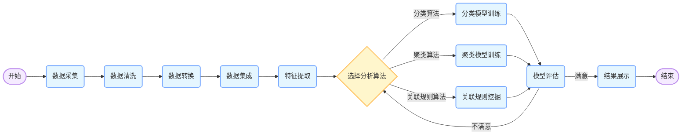

# 构建智能化的个人投资风格漂移原因分析系统

> 关键词：个人投资风格、风格漂移、智能化分析系统、数据挖掘、机器学习

> 摘要：本文聚焦于构建智能化的个人投资风格漂移原因分析系统。在当今复杂多变的金融市场环境下，个人投资者的投资风格常常发生漂移，这不仅影响投资绩效，还可能带来额外风险。本系统旨在运用先进的数据挖掘和机器学习技术，对个人投资行为数据进行深入分析，精准找出投资风格漂移的原因，为投资者提供科学、合理的决策依据，助力其优化投资策略，实现更稳健的投资回报。通过对系统核心概念、算法原理、数学模型以及实际应用场景等方面的详细阐述，展示了该系统在金融投资领域的重要价值和广阔应用前景。

## 1. 背景介绍 
### 1.1 目的和范围
个人投资风格是投资者在长期投资过程中形成的相对稳定的投资偏好和策略模式。然而，市场环境的变化、投资者自身心理因素等多种原因，会导致投资风格发生漂移。本系统的目的在于开发一套智能化的分析系统，全面、深入地分析个人投资风格漂移的原因。其范围涵盖了各类常见的个人投资领域，如股票、基金、债券等，通过收集和分析投资者在这些领域的交易数据、资产配置数据等，挖掘出导致投资风格漂移的潜在因素。

### 1.2 预期读者
本系统的预期读者包括个人投资者、金融投资顾问、金融研究机构人员以及相关领域的科研人员。个人投资者可以借助该系统了解自身投资风格漂移的原因，从而调整投资策略；金融投资顾问可以利用系统的分析结果为客户提供更精准的投资建议；金融研究机构人员可以基于系统的数据和分析结论开展相关研究；科研人员则可以在本系统的基础上进行技术创新和理论探索。

### 1.3 文档结构概述
本文将首先介绍构建智能化个人投资风格漂移原因分析系统的背景知识，包括相关术语和概念。接着阐述系统的核心概念与联系，通过文本示意图和 Mermaid 流程图展示系统的架构原理。然后详细讲解系统所采用的核心算法原理和具体操作步骤，并用 Python 源代码进行阐述。之后介绍系统涉及的数学模型和公式，并通过举例说明其应用。再通过项目实战部分展示系统的实际开发过程和代码实现，以及对代码的解读与分析。随后探讨系统的实际应用场景，推荐相关的工具和资源。最后对系统的未来发展趋势与挑战进行总结，并在附录中提供常见问题与解答以及扩展阅读和参考资料。

### 1.4 术语表
#### 1.4.1 核心术语定义
- **个人投资风格**：指个人投资者在投资决策过程中表现出的相对稳定的投资偏好和策略特征，如价值投资、成长投资、趋势投资等。
- **投资风格漂移**：指投资者的实际投资行为与原有的投资风格发生偏离的现象，表现为投资组合的资产配置、投资标的选择等方面的变化。
- **智能化分析系统**：利用人工智能技术，如机器学习、数据挖掘等，对大量数据进行自动分析和处理，以发现规律、提供决策支持的系统。

#### 1.4.2 相关概念解释
- **数据挖掘**：从大量的、不完全的、有噪声的、模糊的、随机的数据中，提取隐含在其中的、人们事先不知道的、但又是潜在有用的信息和知识的过程。
- **机器学习**：一门多领域交叉学科，涉及概率论、统计学、逼近论、凸分析、算法复杂度理论等多门学科。它专门研究计算机怎样模拟或实现人类的学习行为，以获取新的知识或技能，重新组织已有的知识结构使之不断改善自身的性能。

#### 1.4.3 缩略词列表
- **AI**：Artificial Intelligence，人工智能
- **ML**：Machine Learning，机器学习
- **DM**：Data Mining，数据挖掘

## 2. 核心概念与联系 
### 核心概念原理
个人投资风格漂移原因分析系统的核心原理是基于数据驱动的分析方法。系统首先收集个人投资者的投资行为数据，包括交易记录、资产配置、投资收益等。然后运用数据挖掘和机器学习技术对这些数据进行预处理、特征提取和模型训练。通过分析数据中的模式和规律，找出可能导致投资风格漂移的因素，如市场行情变化、投资者情绪波动、重大事件影响等。

### 架构的文本示意图
该系统主要由数据采集层、数据处理层、分析建模层和结果展示层组成。

- **数据采集层**：负责收集个人投资者的各种投资行为数据，包括来自金融交易平台、社交媒体、新闻资讯等多源数据。
- **数据处理层**：对采集到的数据进行清洗、转换和集成，去除噪声数据，统一数据格式，为后续分析提供高质量的数据。
- **分析建模层**：运用机器学习算法和数据挖掘技术对处理后的数据进行分析和建模，挖掘出投资风格漂移的原因。
- **结果展示层**：将分析结果以直观的图表、报告等形式展示给用户，为用户提供决策支持。

### Mermaid 流程图


## 3. 核心算法原理 & 具体操作步骤 
### 分类算法原理及 Python 实现
分类算法可以用于将投资者的投资行为分为不同的风格类别，并分析导致风格漂移的因素。以决策树分类算法为例，其原理是通过构建决策树模型，根据数据的特征属性进行划分，将数据分配到不同的类别中。

```python
import pandas as pd
from sklearn.model_selection import train_test_split
from sklearn.tree import DecisionTreeClassifier
from sklearn.metrics import accuracy_score

# 加载数据
data = pd.read_csv('investment_data.csv')

# 划分特征和标签
X = data.drop('style_drift', axis=1)
y = data['style_drift']

# 划分训练集和测试集
X_train, X_test, y_train, y_test = train_test_split(X, y, test_size=0.2, random_state=42)

# 创建决策树分类器
clf = DecisionTreeClassifier()

# 训练模型
clf.fit(X_train, y_train)

# 预测
y_pred = clf.predict(X_test)

# 评估模型
accuracy = accuracy_score(y_test, y_pred)
print(f"模型准确率: {accuracy}")
```

### 操作步骤
1. **数据加载**：使用 `pandas` 库读取投资行为数据文件。
2. **特征和标签划分**：将数据集中的特征和标签分离。
3. **数据集划分**：使用 `train_test_split` 函数将数据集划分为训练集和测试集。
4. **模型创建**：创建决策树分类器对象。
5. **模型训练**：使用训练集数据对模型进行训练。
6. **模型预测**：使用训练好的模型对测试集数据进行预测。
7. **模型评估**：使用 `accuracy_score` 函数计算模型的准确率。

### 聚类算法原理及 Python 实现
聚类算法可以将投资者的投资行为数据进行聚类，发现不同的投资风格群体，并分析群体内和群体间的风格漂移原因。以 K-Means 聚类算法为例，其原理是通过迭代的方式将数据点划分到不同的簇中，使得簇内的数据点相似度高，簇间的数据点相似度低。

```python
from sklearn.cluster import KMeans
import numpy as np

# 加载数据
data = np.loadtxt('investment_data.csv', delimiter=',')

# 创建 K-Means 聚类器
kmeans = KMeans(n_clusters=3)

# 训练模型
kmeans.fit(data)

# 获取聚类标签
labels = kmeans.labels_
print(f"聚类标签: {labels}")
```

### 操作步骤
1. **数据加载**：使用 `numpy` 库读取投资行为数据文件。
2. **模型创建**：创建 K-Means 聚类器对象，指定簇的数量。
3. **模型训练**：使用数据对模型进行训练。
4. **获取聚类标签**：获取每个数据点所属的簇标签。

### 关联规则算法原理及 Python 实现
关联规则算法可以发现投资行为数据中不同因素之间的关联关系，从而找出导致投资风格漂移的潜在因素。以 Apriori 算法为例，其原理是通过逐层搜索的方式，找出数据集中频繁出现的项集，并生成关联规则。

```python
from mlxtend.preprocessing import TransactionEncoder
from mlxtend.frequent_patterns import apriori, association_rules
import pandas as pd

# 示例数据
dataset = [['股票', '基金'], ['股票', '债券'], ['基金', '债券']]

# 数据编码
te = TransactionEncoder()
te_ary = te.fit(dataset).transform(dataset)
df = pd.DataFrame(te_ary, columns=te.columns_)

# 挖掘频繁项集
frequent_itemsets = apriori(df, min_support=0.5, use_colnames=True)

# 生成关联规则
rules = association_rules(frequent_itemsets, metric="confidence", min_threshold=0.7)
print(rules)
```

### 操作步骤
1. **数据准备**：准备投资行为数据，以交易记录的形式表示。
2. **数据编码**：使用 `TransactionEncoder` 对数据进行编码，将数据转换为适合算法处理的格式。
3. **频繁项集挖掘**：使用 `apriori` 算法挖掘频繁项集，设置最小支持度阈值。
4. **关联规则生成**：使用 `association_rules` 函数生成关联规则，设置最小置信度阈值。
5. **结果展示**：打印生成的关联规则。

## 4. 数学模型和公式 & 详细讲解 & 举例说明 
### 分类算法的数学模型
以决策树分类算法为例，其数学模型基于信息论中的信息增益概念。信息增益用于衡量在某个特征上进行划分后，数据集的纯度提升程度。信息增益的计算公式为：

$$
IG(S, A) = H(S) - \sum_{v \in Values(A)} \frac{|S_v|}{|S|} H(S_v)
$$

其中，$IG(S, A)$ 表示在特征 $A$ 上的信息增益，$H(S)$ 表示数据集 $S$ 的熵，$S_v$ 表示在特征 $A$ 取值为 $v$ 时的子集，$|S|$ 和 $|S_v|$ 分别表示数据集 $S$ 和子集 $S_v$ 的样本数量。

### 详细讲解
- **熵的计算**：熵是衡量数据集纯度的指标，计算公式为：

$$
H(S) = - \sum_{i=1}^{n} p_i \log_2 p_i
$$

其中，$p_i$ 表示数据集中第 $i$ 类样本的比例，$n$ 表示类别数量。

- **信息增益的意义**：信息增益越大，说明在该特征上进行划分后，数据集的纯度提升越大，该特征越适合作为划分节点。

### 举例说明
假设有一个数据集 $S$ 包含 10 个样本，分为两类，其中 6 个样本属于类别 1，4 个样本属于类别 2。则数据集 $S$ 的熵为：

$$
H(S) = - \frac{6}{10} \log_2 \frac{6}{10} - \frac{4}{10} \log_2 \frac{4}{10} \approx 0.971
$$

假设有一个特征 $A$，其取值有两个，$A_1$ 和 $A_2$。在特征 $A$ 取值为 $A_1$ 的子集中，有 4 个样本，其中 3 个属于类别 1，1 个属于类别 2；在特征 $A$ 取值为 $A_2$ 的子集中，有 6 个样本，其中 3 个属于类别 1，3 个属于类别 2。则在特征 $A$ 上的信息增益为：

$$
\begin{align*}
IG(S, A) &= H(S) - \frac{4}{10} H(S_{A_1}) - \frac{6}{10} H(S_{A_2}) \\
&= 0.971 - \frac{4}{10} \left(- \frac{3}{4} \log_2 \frac{3}{4} - \frac{1}{4} \log_2 \frac{1}{4}\right) - \frac{6}{10} \left(- \frac{3}{6} \log_2 \frac{3}{6} - \frac{3}{6} \log_2 \frac{3}{6}\right) \\
&\approx 0.971 - 0.322 - 0.420 \\
&\approx 0.229
\end{align*}
$$

### 聚类算法的数学模型
以 K-Means 聚类算法为例，其目标是最小化所有数据点到其所属簇中心的距离之和。目标函数为：

$$
J = \sum_{i=1}^{n} \sum_{j=1}^{k} r_{ij} \| x_i - \mu_j \|^2
$$

其中，$n$ 表示数据点的数量，$k$ 表示簇的数量，$r_{ij}$ 是一个指示变量，当数据点 $x_i$ 属于簇 $j$ 时，$r_{ij} = 1$，否则 $r_{ij} = 0$，$\mu_j$ 表示簇 $j$ 的中心。

### 详细讲解
- **迭代更新**：K-Means 算法通过迭代的方式不断更新簇中心，直到目标函数收敛。具体步骤为：
  1. 随机初始化 $k$ 个簇中心。
  2. 对于每个数据点，计算其到各个簇中心的距离，将其分配到距离最近的簇中。
  3. 更新每个簇的中心，即计算该簇中所有数据点的均值。
  4. 重复步骤 2 和 3，直到簇中心不再变化或达到最大迭代次数。

### 举例说明
假设有 3 个数据点 $x_1 = [1, 2]$，$x_2 = [4, 5]$，$x_3 = [7, 8]$，要将其分为 2 个簇。随机初始化簇中心 $\mu_1 = [2, 3]$，$\mu_2 = [6, 7]$。

- **第一步**：计算每个数据点到各个簇中心的距离：
  - $d(x_1, \mu_1) = \sqrt{(1 - 2)^2 + (2 - 3)^2} = \sqrt{2}$
  - $d(x_1, \mu_2) = \sqrt{(1 - 6)^2 + (2 - 7)^2} = \sqrt{50}$
  - 所以 $x_1$ 属于簇 1。
  - $d(x_2, \mu_1) = \sqrt{(4 - 2)^2 + (5 - 3)^2} = 2\sqrt{2}$
  - $d(x_2, \mu_2) = \sqrt{(4 - 6)^2 + (5 - 7)^2} = 2\sqrt{2}$
  - 所以 $x_2$ 可以随机分配到簇 1 或簇 2，这里分配到簇 2。
  - $d(x_3, \mu_1) = \sqrt{(7 - 2)^2 + (8 - 3)^2} = \sqrt{50}$
  - $d(x_3, \mu_2) = \sqrt{(7 - 6)^2 + (8 - 7)^2} = \sqrt{2}$
  - 所以 $x_3$ 属于簇 2。

- **第二步**：更新簇中心：
  - 簇 1 的中心 $\mu_1 = [1, 2]$
  - 簇 2 的中心 $\mu_2 = \frac{[4, 5] + [7, 8]}{2} = [5.5, 6.5]$

- 重复上述步骤，直到簇中心不再变化。

### 关联规则算法的数学模型
以 Apriori 算法为例，其核心概念是支持度、置信度和提升度。

- **支持度**：表示项集在数据集中出现的频率，计算公式为：

$$
Support(X) = \frac{| \{ t \in T : X \subseteq t \} |}{|T|}
$$

其中，$X$ 表示项集，$T$ 表示数据集，$| \{ t \in T : X \subseteq t \} |$ 表示包含项集 $X$ 的交易记录数量，$|T|$ 表示数据集的交易记录总数。

- **置信度**：表示在包含项集 $X$ 的交易记录中，同时包含项集 $Y$ 的比例，计算公式为：

$$
Confidence(X \Rightarrow Y) = \frac{Support(X \cup Y)}{Support(X)}
$$

- **提升度**：表示项集 $X$ 和 $Y$ 之间的关联强度，计算公式为：

$$
Lift(X \Rightarrow Y) = \frac{Confidence(X \Rightarrow Y)}{Support(Y)}
$$

### 详细讲解
- **频繁项集挖掘**：通过设置最小支持度阈值，找出支持度大于该阈值的项集，即频繁项集。
- **关联规则生成**：从频繁项集中生成关联规则，通过设置最小置信度阈值，筛选出置信度大于该阈值的关联规则。
- **提升度的意义**：提升度大于 1 表示项集 $X$ 和 $Y$ 之间存在正关联，提升度小于 1 表示存在负关联，提升度等于 1 表示两者相互独立。

### 举例说明
假设有一个数据集包含 5 条交易记录：
- $t_1 = \{ A, B, C \}$
- $t_2 = \{ A, B \}$
- $t_3 = \{ B, C \}$
- $t_4 = \{ A, C \}$
- $t_5 = \{ A, B, C \}$

- **支持度计算**：
  - $Support(\{ A \}) = \frac{4}{5} = 0.8$
  - $Support(\{ A, B \}) = \frac{3}{5} = 0.6$

- **置信度计算**：
  - $Confidence(\{ A \} \Rightarrow \{ B \}) = \frac{Support(\{ A, B \})}{Support(\{ A \})} = \frac{0.6}{0.8} = 0.75$

- **提升度计算**：
  - $Support(\{ B \}) = \frac{4}{5} = 0.8$
  - $Lift(\{ A \} \Rightarrow \{ B \}) = \frac{Confidence(\{ A \} \Rightarrow \{ B \})}{Support(\{ B \})} = \frac{0.75}{0.8} = 0.9375$

## 5. 项目实战：代码实际案例和详细解释说明 
### 5.1  开发环境搭建
#### 操作系统
本项目可以在 Windows、Linux 或 macOS 操作系统上进行开发。建议使用 Linux 或 macOS 系统，因为它们对 Python 开发环境的支持更好。

#### Python 环境
安装 Python 3.7 或以上版本。可以从 Python 官方网站（https://www.python.org/downloads/）下载安装包进行安装。

#### 依赖库安装
使用 `pip` 命令安装项目所需的依赖库：

```bash
pip install pandas numpy scikit-learn mlxtend matplotlib
```

### 5.2  源代码详细实现和代码解读
#### 数据加载和预处理
```python
import pandas as pd
import numpy as np

# 加载数据
data = pd.read_csv('investment_data.csv')

# 查看数据基本信息
print(data.info())

# 处理缺失值
data = data.dropna()

# 特征编码
categorical_columns = data.select_dtypes(include=['object']).columns
for column in categorical_columns:
    data[column] = pd.factorize(data[column])[0]

# 划分特征和标签
X = data.drop('style_drift', axis=1)
y = data['style_drift']
```

**代码解读**：
- 使用 `pandas` 库的 `read_csv` 函数加载投资行为数据文件。
- 使用 `info` 方法查看数据的基本信息，包括数据类型、缺失值情况等。
- 使用 `dropna` 方法删除包含缺失值的行。
- 对于分类特征，使用 `factorize` 方法进行编码，将其转换为数值类型。
- 最后将特征和标签分离。

#### 模型训练和评估
```python
from sklearn.model_selection import train_test_split
from sklearn.tree import DecisionTreeClassifier
from sklearn.metrics import accuracy_score, classification_report

# 划分训练集和测试集
X_train, X_test, y_train, y_test = train_test_split(X, y, test_size=0.2, random_state=42)

# 创建决策树分类器
clf = DecisionTreeClassifier()

# 训练模型
clf.fit(X_train, y_train)

# 预测
y_pred = clf.predict(X_test)

# 评估模型
accuracy = accuracy_score(y_test, y_pred)
print(f"模型准确率: {accuracy}")

# 打印分类报告
print(classification_report(y_test, y_pred))
```

**代码解读**：
- 使用 `train_test_split` 函数将数据集划分为训练集和测试集，测试集占比为 20%。
- 创建决策树分类器对象。
- 使用训练集数据对模型进行训练。
- 使用训练好的模型对测试集数据进行预测。
- 使用 `accuracy_score` 函数计算模型的准确率。
- 使用 `classification_report` 函数打印分类报告，包括精确率、召回率、F1 值等指标。

#### 结果可视化
```python
import matplotlib.pyplot as plt
from sklearn.tree import plot_tree

# 绘制决策树
plt.figure(figsize=(20, 10))
plot_tree(clf, feature_names=X.columns, class_names=['No Drift', 'Drift'], filled=True)
plt.show()
```

**代码解读**：
- 使用 `matplotlib` 库和 `plot_tree` 函数绘制决策树图形。
- 设置图形的大小为 20x10。
- 指定特征名称和类别名称，填充节点颜色。
- 最后显示图形。

### 5.3  代码解读与分析
#### 数据预处理的重要性
数据预处理是数据挖掘和机器学习项目中非常重要的一步。在本项目中，处理缺失值可以避免数据的不完整性对模型训练产生影响；特征编码可以将分类特征转换为数值特征，使得模型能够处理这些数据。

#### 模型选择和评估
选择决策树分类器是因为它具有直观、易于理解的特点，能够很好地处理分类问题。使用准确率和分类报告对模型进行评估，可以全面地了解模型的性能。准确率可以反映模型的整体预测能力，而分类报告中的精确率、召回率和 F1 值可以更详细地分析模型在不同类别上的表现。

#### 结果可视化的作用
通过绘制决策树图形，可以直观地看到模型的决策过程和特征的重要性。这有助于我们理解模型的工作原理，发现潜在的问题，并对模型进行优化。

## 6. 实际应用场景 
### 个人投资者
个人投资者可以使用该系统了解自己投资风格漂移的原因，从而调整投资策略。例如，如果系统分析发现投资者的投资风格漂移是由于市场行情变化导致的，投资者可以根据市场趋势调整资产配置；如果是由于自身情绪波动引起的，投资者可以尝试控制情绪，避免盲目跟风投资。

### 金融投资顾问
金融投资顾问可以利用该系统为客户提供更精准的投资建议。通过分析客户的投资风格漂移原因，顾问可以了解客户的投资偏好和风险承受能力的变化，为客户制定个性化的投资方案，提高客户的投资收益。

### 金融研究机构
金融研究机构可以使用该系统对大量投资者的投资行为数据进行分析，研究投资风格漂移的规律和影响因素。这有助于深入了解投资者的行为模式，为金融市场的监管和政策制定提供参考依据。

### 金融监管部门
金融监管部门可以借助该系统监测投资者的投资行为，及时发现异常的投资风格漂移现象。这有助于防范金融风险，维护金融市场的稳定。

## 7. 工具和资源推荐
### 7.1 学习资源推荐
#### 7.1.1 书籍推荐
- 《Python 数据分析实战》：介绍了使用 Python 进行数据分析的基本方法和技巧，包括数据处理、可视化、机器学习等内容。
- 《机器学习实战》：通过实际案例详细讲解了机器学习的各种算法和应用，适合初学者入门。
- 《数据挖掘：概念与技术》：系统地介绍了数据挖掘的基本概念、算法和应用，是数据挖掘领域的经典教材。

#### 7.1.2 在线课程
- Coursera 上的 “Machine Learning” 课程：由斯坦福大学的 Andrew Ng 教授授课，是机器学习领域的经典课程。
- edX 上的 “Data Science MicroMasters Program” 课程：提供了全面的数据科学知识体系，包括数据处理、机器学习、深度学习等内容。
- 中国大学 MOOC 上的 “Python 语言程序设计” 课程：适合初学者学习 Python 语言。

#### 7.1.3 技术博客和网站
- Medium：上面有很多关于数据科学、机器学习、金融科技等领域的优秀博客文章。
- Towards Data Science：专注于数据科学和机器学习领域的技术分享和交流。
- 掘金：国内的技术社区，有很多关于 Python 开发、数据挖掘等方面的技术文章。

### 7.2 开发工具框架推荐
#### 7.2.1 IDE和编辑器
- PyCharm：是一款专业的 Python 集成开发环境，具有代码自动补全、调试、版本控制等功能。
- Jupyter Notebook：是一个交互式的开发环境，适合进行数据探索和模型实验。
- Visual Studio Code：是一款轻量级的代码编辑器，支持多种编程语言，有丰富的插件扩展功能。

#### 7.2.2 调试和性能分析工具
- pdb：Python 自带的调试器，可以帮助开发者调试代码。
- cProfile：Python 自带的性能分析工具，可以分析代码的运行时间和函数调用情况。
- Scikit-learn 的 `cross_val_score` 函数：可以用于模型的交叉验证和性能评估。

#### 7.2.3 相关框架和库
- Pandas：用于数据处理和分析，提供了高效的数据结构和数据操作方法。
- NumPy：用于科学计算，提供了高效的数组操作和数学函数。
- Scikit-learn：是一个强大的机器学习库，提供了各种机器学习算法和工具。
- MLxtend：提供了一些扩展的机器学习工具和算法，如关联规则挖掘等。

### 7.3 相关论文著作推荐
#### 7.3.1 经典论文
- “A Decision-Theoretic Generalization of On-Line Learning and an Application to Boosting”：介绍了决策理论在在线学习和提升算法中的应用。
- “Data Mining: Practical Machine Learning Tools and Techniques”：系统地介绍了数据挖掘的实用工具和技术。
- “Machine Learning: A Probabilistic Perspective”：从概率的角度介绍了机器学习的基本原理和算法。

#### 7.3.2 最新研究成果
- 关注顶级学术会议如 KDD（Knowledge Discovery and Data Mining）、ICML（International Conference on Machine Learning）等的最新研究成果，了解投资风格分析领域的前沿技术和发展趋势。

#### 7.3.3 应用案例分析
- 阅读金融机构和研究机构发布的关于投资风格分析的应用案例报告，学习实际应用中的经验和方法。

## 8. 总结：未来发展趋势与挑战
### 未来发展趋势
#### 智能化程度不断提高
随着人工智能技术的不断发展，个人投资风格漂移原因分析系统将越来越智能化。系统将能够自动识别和分析更多复杂的投资行为模式，提供更精准的原因分析和决策建议。

#### 多源数据融合
未来的系统将不仅仅依赖于金融交易数据，还将融合社交媒体数据、新闻资讯数据、宏观经济数据等多源数据，以更全面地了解投资者的行为和市场环境，提高分析的准确性和可靠性。

#### 个性化服务
系统将更加注重个性化服务，根据投资者的不同需求和特点，提供定制化的分析报告和投资建议。例如，对于不同风险偏好、投资经验的投资者，提供不同的分析视角和决策支持。

#### 与金融科技的深度融合
与区块链、云计算、大数据等金融科技技术深度融合，提高系统的安全性、可扩展性和处理效率。例如，利用区块链技术保证数据的真实性和不可篡改，利用云计算技术实现大规模数据的存储和处理。

### 挑战
#### 数据质量和隐私保护
数据质量是影响系统分析结果准确性的关键因素。如何获取高质量、准确、完整的数据是一个挑战。同时，投资者的投资行为数据涉及个人隐私，如何在保护隐私的前提下进行数据分析和挖掘也是一个重要问题。

#### 算法复杂度和可解释性
随着系统智能化程度的提高，所采用的算法也越来越复杂。复杂的算法虽然可以提高分析的准确性，但也增加了算法的复杂度和计算成本。此外，算法的可解释性也是一个挑战，投资者和监管部门需要了解系统的分析过程和决策依据，以便做出合理的决策。

#### 市场变化的适应性
金融市场是动态变化的，投资者的投资行为和市场环境也在不断变化。系统需要具备良好的适应性，能够及时调整分析模型和算法，以应对市场变化带来的挑战。

## 9. 附录：常见问题与解答
### 数据采集过程中可能遇到哪些问题？
- **数据缺失**：部分数据源可能存在数据缺失的情况，需要进行数据填充或删除处理。
- **数据不一致**：不同数据源的数据格式、定义可能不一致，需要进行数据转换和集成。
- **数据获取权限**：获取某些数据可能需要相关的权限，需要解决权限问题才能获取数据。

### 如何选择合适的分析算法？
- 根据数据的特点和分析的目标选择合适的算法。例如，如果是分类问题，可以选择决策树、逻辑回归等算法；如果是聚类问题，可以选择 K-Means、DBSCAN 等算法；如果是关联规则挖掘问题，可以选择 Apriori、FP-Growth 等算法。
- 可以通过交叉验证等方法对不同算法进行评估和比较，选择性能最优的算法。

### 如何提高模型的准确性？
- **数据预处理**：对数据进行清洗、转换和集成，去除噪声数据，提高数据质量。
- **特征工程**：选择和提取有意义的特征，去除冗余特征，提高特征的质量。
- **模型选择和调优**：选择合适的模型，并通过调参等方法优化模型的性能。
- **集成学习**：使用集成学习方法，如随机森林、梯度提升等，将多个模型的预测结果进行组合，提高模型的准确性。

### 系统的分析结果是否可靠？
系统的分析结果的可靠性取决于多个因素，如数据质量、算法选择、模型训练等。为了提高分析结果的可靠性，需要确保数据的准确性和完整性，选择合适的分析算法，对模型进行充分的训练和评估。同时，可以通过交叉验证、模型融合等方法提高模型的稳定性和泛化能力。

## 10. 扩展阅读 & 参考资料
### 扩展阅读
- 《金融市场学》：了解金融市场的基本原理和运行机制，有助于更好地理解投资行为和投资风格漂移的原因。
- 《行为金融学》：研究投资者的心理和行为对金融市场的影响，为分析投资风格漂移提供理论支持。
- 《人工智能与金融》：探讨人工智能技术在金融领域的应用和发展趋势，为构建智能化的投资分析系统提供思路。

### 参考资料
- 相关金融机构和研究机构发布的报告和研究成果。
- 学术期刊和会议上发表的关于投资风格分析、数据挖掘、机器学习等领域的论文。
- 相关技术文档和官方网站，如 Pandas、NumPy、Scikit-learn 等库的官方文档。