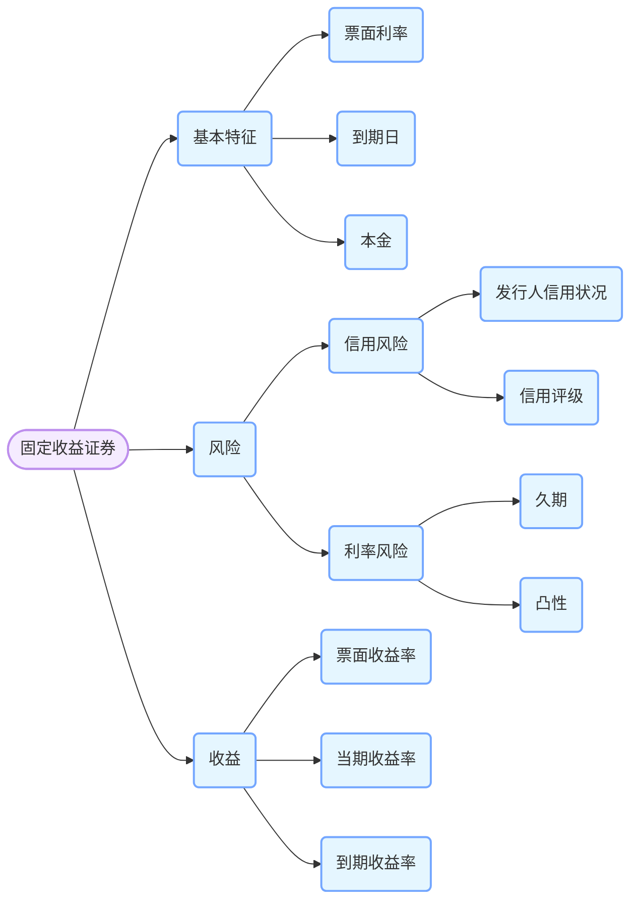

# 格雷厄姆·多德的固定收益证券分析方法

> 关键词：格雷厄姆·多德、固定收益证券、分析方法、信用风险、估值模型

> 摘要：本文深入探讨了格雷厄姆·多德的固定收益证券分析方法。首先介绍了该方法产生的背景及适用范围，明确预期读者群体和文档结构。接着阐述了固定收益证券相关的核心概念及联系，通过文本示意图和 Mermaid 流程图直观呈现。详细讲解了核心算法原理并给出 Python 源代码示例，同时介绍了相关数学模型和公式，辅以举例说明。通过项目实战，包括开发环境搭建、源代码实现与解读，展示该方法在实际中的应用。探讨了其实际应用场景，推荐了学习资源、开发工具框架以及相关论文著作。最后总结了该方法未来的发展趋势与挑战，还提供了常见问题解答和扩展阅读参考资料，旨在帮助读者全面深入地理解和运用格雷厄姆·多德的固定收益证券分析方法。

## 1. 背景介绍 
### 1.1 目的和范围
固定收益证券在金融市场中占据着重要地位，其价格波动、信用风险等因素对于投资者的决策至关重要。格雷厄姆·多德的固定收益证券分析方法旨在为投资者、金融分析师等提供一套系统、科学的分析框架，帮助他们评估固定收益证券的价值、风险，从而做出合理的投资决策。本方法的范围涵盖了各类常见的固定收益证券，如债券、优先股等，同时也适用于对不同市场环境下固定收益证券的分析。

### 1.2 预期读者
本文的预期读者主要包括金融领域的专业人士，如投资经理、金融分析师、交易员等，他们需要深入了解固定收益证券的分析方法以进行投资决策和风险管理。同时，对于金融专业的学生和研究人员来说，本文也是学习和研究固定收益证券分析理论和实践的重要参考资料。此外，对金融投资有兴趣的普通投资者也可以通过阅读本文，掌握基本的固定收益证券分析方法，提高自身的投资能力。

### 1.3 文档结构概述
本文将按照以下结构展开：首先介绍格雷厄姆·多德固定收益证券分析方法的背景信息，包括目的、预期读者和文档结构概述等。接着阐述固定收益证券分析的核心概念及其相互联系，通过文本示意图和 Mermaid 流程图进行直观展示。然后详细讲解核心算法原理，并给出 Python 源代码示例。之后介绍相关的数学模型和公式，并举例说明。通过项目实战，包括开发环境搭建、源代码实现与解读，展示该方法在实际中的应用。探讨该方法的实际应用场景，推荐学习资源、开发工具框架以及相关论文著作。最后总结该方法未来的发展趋势与挑战，提供常见问题解答和扩展阅读参考资料。

### 1.4 术语表
#### 1.4.1 核心术语定义
- **固定收益证券**：是指在金融市场上发行的，规定了票面利率、到期日等固定要素，投资者按照约定可以定期获得固定利息收入，并在到期时收回本金的证券，如债券、优先股等。
- **信用风险**：指固定收益证券的发行人可能无法按时支付利息或偿还本金的风险。
- **收益率**：是指投资者投资固定收益证券所获得的收益与投资成本的比率，常见的收益率指标包括票面收益率、当期收益率、到期收益率等。
- **久期**：是衡量固定收益证券价格对利率变动敏感性的指标，它反映了债券现金流的加权平均期限。
- **凸性**：是对债券价格 - 收益率曲线弯曲程度的一种度量，用于更精确地描述债券价格对利率变动的非线性关系。

#### 1.4.2 相关概念解释
- **票面利率**：是指固定收益证券发行时规定的利率，它决定了投资者每年可以获得的利息收入。
- **到期日**：是指固定收益证券发行人承诺偿还本金的日期。
- **本金**：是指投资者购买固定收益证券时所投入的资金，在到期日时发行人将按照约定偿还本金。
- **市场利率**：是指市场上资金的借贷成本，它会影响固定收益证券的价格。当市场利率上升时，固定收益证券的价格通常会下降；反之，当市场利率下降时，固定收益证券的价格通常会上升。

#### 1.4.3 缩略词列表
- **YTM**：到期收益率（Yield to Maturity）
- **DV01**：基点价值（Dollar Value of an 01）
- **CFA**：特许金融分析师（Chartered Financial Analyst）

## 2. 核心概念与联系 

### 固定收益证券的基本概念
固定收益证券是一种具有固定现金流特征的金融工具。它通常由发行人（如政府、企业等）向投资者发行，以筹集资金。投资者购买固定收益证券后，有权按照约定的时间和金额获得利息收入，并在到期日收回本金。

### 信用风险与固定收益证券
信用风险是固定收益证券投资中需要重点关注的风险之一。发行人的信用状况直接影响其按时支付利息和偿还本金的能力。信用评级机构（如标准普尔、穆迪等）会对发行人的信用状况进行评估，并给出相应的信用评级。信用评级越低，说明发行人的信用风险越高，投资者要求的风险补偿也就越高，从而导致固定收益证券的价格越低。

### 收益率与固定收益证券
收益率是衡量固定收益证券投资回报的重要指标。常见的收益率指标包括票面收益率、当期收益率、到期收益率等。票面收益率是指固定收益证券发行时规定的利率，它只考虑了票面利息与本金的关系。当期收益率是指当前利息收入与债券当前市场价格的比率，它反映了投资者当前的收益水平。到期收益率是指投资者持有固定收益证券至到期日时所能获得的平均收益率，它考虑了债券的票面利息、本金以及当前市场价格等因素。

### 久期与凸性
久期和凸性是衡量固定收益证券价格对利率变动敏感性的重要指标。久期反映了债券现金流的加权平均期限，它可以近似地衡量债券价格对利率变动的线性敏感度。凸性则是对债券价格 - 收益率曲线弯曲程度的一种度量，它可以更精确地描述债券价格对利率变动的非线性关系。

### 文本示意图
```plaintext
固定收益证券
|-- 基本特征
|   |-- 票面利率
|   |-- 到期日
|   |-- 本金
|-- 风险
|   |-- 信用风险
|   |   |-- 发行人信用状况
|   |   |-- 信用评级
|   |-- 利率风险
|       |-- 久期
|       |-- 凸性
|-- 收益
|   |-- 票面收益率
|   |-- 当期收益率
|   |-- 到期收益率
```

### Mermaid 流程图


## 3. 核心算法原理 & 具体操作步骤 

### 到期收益率（YTM）的计算原理
到期收益率（YTM）是使固定收益证券未来现金流的现值等于当前市场价格的贴现率。对于每年付息一次、按面值偿还本金的债券，其到期收益率的计算公式为：

$P = \frac{C}{(1 + YTM)^1} + \frac{C}{(1 + YTM)^2} + \cdots + \frac{C + F}{(1 + YTM)^n}$

其中，$P$ 为债券当前的市场价格，$C$ 为每年支付的利息，$F$ 为债券的面值，$n$ 为债券的剩余期限，$YTM$ 为到期收益率。

### Python 代码实现
```python
import numpy as np
from scipy.optimize import newton

def bond_price(coupon, face_value, yield_rate, maturity):
    """
    计算债券价格
    :param coupon: 每年支付的利息
    :param face_value: 债券面值
    :param yield_rate: 到期收益率
    :param maturity: 剩余期限
    :return: 债券价格
    """
    price = 0
    for t in range(1, maturity + 1):
        if t < maturity:
            price += coupon / (1 + yield_rate) ** t
        else:
            price += (coupon + face_value) / (1 + yield_rate) ** t
    return price

def ytm(price, coupon, face_value, maturity):
    """
    计算到期收益率
    :param price: 债券当前市场价格
    :param coupon: 每年支付的利息
    :param face_value: 债券面值
    :param maturity: 剩余期限
    :return: 到期收益率
    """
    def objective(yield_rate):
        return bond_price(coupon, face_value, yield_rate, maturity) - price
    return newton(objective, 0.05)

# 示例
coupon = 50  # 每年支付的利息
face_value = 1000  # 债券面值
price = 950  # 债券当前市场价格
maturity = 5  # 剩余期限

ytm_value = ytm(price, coupon, face_value, maturity)
print(f"到期收益率: {ytm_value * 100:.2f}%")
```

### 代码解释
- `bond_price` 函数：该函数用于计算债券的价格。它通过循环遍历债券的剩余期限，将每年的利息和到期时的本金按照给定的到期收益率进行贴现，然后求和得到债券的价格。
- `ytm` 函数：该函数用于计算到期收益率。它定义了一个目标函数 `objective`，该函数表示债券价格与当前市场价格的差值。通过 `scipy.optimize.newton` 函数求解目标函数的根，即得到到期收益率。

### 具体操作步骤
1. 确定债券的基本信息，包括每年支付的利息、债券面值、当前市场价格和剩余期限。
2. 调用 `ytm` 函数，将债券的基本信息作为参数传入，计算到期收益率。
3. 输出计算得到的到期收益率。

## 4. 数学模型和公式 & 详细讲解 & 举例说明 

### 债券定价模型
债券定价模型是基于现金流贴现原理的。债券的价值等于其未来现金流的现值之和。对于每年付息一次、按面值偿还本金的债券，其定价公式为：

$P = \sum_{t = 1}^{n} \frac{C}{(1 + r)^t} + \frac{F}{(1 + r)^n}$

其中，$P$ 为债券当前的市场价格，$C$ 为每年支付的利息，$F$ 为债券的面值，$n$ 为债券的剩余期限，$r$ 为贴现率（通常为市场利率）。

### 详细讲解
- **现金流贴现原理**：该原理认为，一项资产的价值等于其未来产生的现金流在当前时刻的价值之和。在债券定价中，债券的未来现金流包括每年支付的利息和到期时偿还的本金。将这些现金流按照一定的贴现率贴现到当前时刻，就得到了债券的价值。
- **贴现率的选择**：贴现率通常选择市场利率。市场利率反映了投资者对资金的时间价值和风险的预期。当市场利率上升时，贴现率增大，债券的未来现金流的现值减小，从而导致债券价格下降；反之，当市场利率下降时，贴现率减小，债券的未来现金流的现值增大，从而导致债券价格上升。

### 举例说明
假设某债券的面值为 $1000$ 元，票面利率为 $5\%$，每年付息一次，剩余期限为 $5$ 年，市场利率为 $6\%$。则每年支付的利息为 $C = 1000 \times 5\% = 50$ 元。

根据债券定价公式，该债券的价格为：

$P = \frac{50}{(1 + 0.06)^1} + \frac{50}{(1 + 0.06)^2} + \frac{50}{(1 + 0.06)^3} + \frac{50}{(1 + 0.06)^4} + \frac{50 + 1000}{(1 + 0.06)^5}$

$P = 50 \times \frac{1 - (1 + 0.06)^{-5}}{0.06} + \frac{1000}{(1 + 0.06)^5}$

$P \approx 957.88$ 元

### 久期公式
久期（Duration）是衡量债券价格对利率变动敏感性的指标。对于每年付息一次、按面值偿还本金的债券，其久期的计算公式为：

$D = \frac{\sum_{t = 1}^{n} t \times \frac{C}{(1 + r)^t} + n \times \frac{F}{(1 + r)^n}}{P}$

其中，$D$ 为久期，$t$ 为现金流发生的时间，$C$ 为每年支付的利息，$F$ 为债券的面值，$n$ 为债券的剩余期限，$r$ 为贴现率，$P$ 为债券的价格。

### 详细讲解
- **久期的含义**：久期可以理解为债券现金流的加权平均期限。它反映了债券价格对利率变动的线性敏感度。久期越长，债券价格对利率变动的敏感性越高；久期越短，债券价格对利率变动的敏感性越低。
- **久期的应用**：久期在债券投资中具有重要的应用。投资者可以通过调整债券组合的久期来管理利率风险。例如，当预期市场利率上升时，投资者可以缩短债券组合的久期，以降低债券价格下跌的风险；当预期市场利率下降时，投资者可以延长债券组合的久期，以增加债券价格上涨的收益。

### 举例说明
仍以上述债券为例，计算其久期。

首先，计算分子各项的值：

$t = 1$ 时，$1 \times \frac{50}{(1 + 0.06)^1} \approx 47.17$

$t = 2$ 时，$2 \times \frac{50}{(1 + 0.06)^2} \approx 88.00$

$t = 3$ 时，$3 \times \frac{50}{(1 + 0.06)^3} \approx 124.73$

$t = 4$ 时，$4 \times \frac{50}{(1 + 0.06)^4} \approx 157.89$

$t = 5$ 时，$5 \times \frac{50 + 1000}{(1 + 0.06)^5} \approx 3873.26$

分子之和为：$47.17 + 88.00 + 124.73 + 157.89 + 3873.26 = 4291.05$

债券价格 $P \approx 957.88$ 元

则久期 $D = \frac{4291.05}{957.88} \approx 4.48$ 年

## 5. 项目实战：代码实际案例和详细解释说明 

### 5.1  开发环境搭建
在进行固定收益证券分析的项目实战之前，需要搭建相应的开发环境。以下是具体的步骤：

#### 安装 Python
Python 是一种广泛使用的编程语言，具有丰富的科学计算库。可以从 Python 官方网站（https://www.python.org/downloads/） 下载并安装最新版本的 Python。

#### 安装必要的库
在本项目中，需要使用 `numpy` 和 `scipy` 库进行数值计算。可以使用以下命令进行安装：
```sh
pip install numpy scipy
```

#### 选择开发工具
可以选择使用 PyCharm、Jupyter Notebook 等开发工具进行代码的编写和调试。

### 5.2  源代码详细实现和代码解读
以下是一个完整的固定收益证券分析的 Python 代码示例，包括债券定价、到期收益率计算和久期计算：

```python
import numpy as np
from scipy.optimize import newton

def bond_price(coupon, face_value, yield_rate, maturity):
    """
    计算债券价格
    :param coupon: 每年支付的利息
    :param face_value: 债券面值
    :param yield_rate: 到期收益率
    :param maturity: 剩余期限
    :return: 债券价格
    """
    price = 0
    for t in range(1, maturity + 1):
        if t < maturity:
            price += coupon / (1 + yield_rate) ** t
        else:
            price += (coupon + face_value) / (1 + yield_rate) ** t
    return price

def ytm(price, coupon, face_value, maturity):
    """
    计算到期收益率
    :param price: 债券当前市场价格
    :param coupon: 每年支付的利息
    :param face_value: 债券面值
    :param maturity: 剩余期限
    :return: 到期收益率
    """
    def objective(yield_rate):
        return bond_price(coupon, face_value, yield_rate, maturity) - price
    return newton(objective, 0.05)

def duration(coupon, face_value, yield_rate, maturity):
    """
    计算久期
    :param coupon: 每年支付的利息
    :param face_value: 债券面值
    :param yield_rate: 到期收益率
    :param maturity: 剩余期限
    :return: 久期
    """
    price = bond_price(coupon, face_value, yield_rate, maturity)
    numerator = 0
    for t in range(1, maturity + 1):
        if t < maturity:
            numerator += t * coupon / (1 + yield_rate) ** t
        else:
            numerator += t * (coupon + face_value) / (1 + yield_rate) ** t
    return numerator / price

# 示例
coupon = 50  # 每年支付的利息
face_value = 1000  # 债券面值
yield_rate = 0.06  # 到期收益率
maturity = 5  # 剩余期限

# 计算债券价格
price = bond_price(coupon, face_value, yield_rate, maturity)
print(f"债券价格: {price:.2f} 元")

# 计算到期收益率
ytm_value = ytm(price, coupon, face_value, maturity)
print(f"到期收益率: {ytm_value * 100:.2f}%")

# 计算久期
duration_value = duration(coupon, face_value, yield_rate, maturity)
print(f"久期: {duration_value:.2f} 年")
```

### 5.3  代码解读与分析
- **`bond_price` 函数**：该函数用于计算债券的价格。它通过循环遍历债券的剩余期限，将每年的利息和到期时的本金按照给定的到期收益率进行贴现，然后求和得到债券的价格。
- **`ytm` 函数**：该函数用于计算到期收益率。它定义了一个目标函数 `objective`，该函数表示债券价格与当前市场价格的差值。通过 `scipy.optimize.newton` 函数求解目标函数的根，即得到到期收益率。
- **`duration` 函数**：该函数用于计算久期。它首先调用 `bond_price` 函数计算债券的价格，然后通过循环遍历债券的剩余期限，计算久期公式的分子部分，最后将分子除以债券价格得到久期。

在主程序中，我们设置了债券的基本信息，包括每年支付的利息、债券面值、到期收益率和剩余期限。然后分别调用 `bond_price`、`ytm` 和 `duration` 函数计算债券价格、到期收益率和久期，并输出计算结果。

## 6. 实际应用场景 
### 投资决策
投资者可以使用格雷厄姆·多德的固定收益证券分析方法来评估不同固定收益证券的价值和风险，从而做出合理的投资决策。例如，通过计算债券的到期收益率和久期，投资者可以比较不同债券的收益和风险水平，选择最适合自己投资目标和风险承受能力的债券。

### 风险管理
金融机构和投资者可以利用该方法来管理固定收益证券投资组合的风险。通过调整投资组合的久期和凸性，投资者可以降低利率风险和信用风险。例如，当预期市场利率上升时，投资者可以缩短投资组合的久期，以降低债券价格下跌的风险；当预期市场利率下降时，投资者可以延长投资组合的久期，以增加债券价格上涨的收益。

### 债券定价
在债券发行和交易过程中，发行人、承销商和投资者可以使用该方法来确定债券的合理价格。通过对债券的现金流、信用风险和市场利率等因素进行分析，计算出债券的理论价格，为债券的定价提供参考。

### 信用分析
信用分析师可以使用该方法来评估固定收益证券发行人的信用状况。通过对发行人的财务状况、经营业绩、行业前景等因素进行分析，结合信用评级机构的评级结果，评估发行人的信用风险，为投资者提供信用风险提示。

## 7. 工具和资源推荐
### 7.1 学习资源推荐
#### 7.1.1 书籍推荐
- 《证券分析》（Security Analysis）：作者是本杰明·格雷厄姆（Benjamin Graham）和戴维·多德（David Dodd），该书是价值投资的经典著作，详细介绍了固定收益证券分析的方法和理论。
- 《固定收益证券分析》（Analysis of Fixed Income Securities）：作者是弗兰克·J·法博齐（Frank J. Fabozzi），该书全面系统地介绍了固定收益证券的分析方法、定价模型和风险管理等内容。
- 《债券市场：分析与策略》（Bond Markets, Analysis, and Strategies）：作者是弗兰克·J·法博齐（Frank J. Fabozzi），该书深入探讨了债券市场的结构、运行机制和投资策略，是学习债券投资的重要参考书籍。

#### 7.1.2 在线课程
- Coursera 平台上的“固定收益证券分析”课程：该课程由知名高校的教授授课，内容涵盖了固定收益证券的基本概念、定价模型、风险管理等方面的知识。
- edX 平台上的“金融市场与投资”课程：该课程介绍了金融市场的基本原理和投资策略，包括固定收益证券投资的相关内容。
- 中国大学 MOOC 平台上的“投资学”课程：该课程由国内高校的教授授课，系统地介绍了投资学的基本理论和方法，其中包括固定收益证券分析的内容。

#### 7.1.3 技术博客和网站
- 雪球网（https://xueqiu.com/）：是一个财经社交平台，提供了丰富的固定收益证券投资分析文章和讨论。
- 华尔街见闻（https://wallstreetcn.com/）：是一个专业的财经资讯网站，提供了全球金融市场的最新动态和分析，包括固定收益证券市场的相关内容。
- 英为财情（https://cn.investing.com/）：是一个全球金融市场数据和分析平台，提供了各种固定收益证券的实时行情、历史数据和分析工具。

### 7.2 开发工具框架推荐
#### 7.2.1 IDE和编辑器
- PyCharm：是一款专业的 Python 集成开发环境，具有代码编辑、调试、版本控制等功能，适合进行固定收益证券分析的 Python 代码开发。
- Jupyter Notebook：是一个交互式的开发环境，支持 Python 等多种编程语言，适合进行数据探索、模型验证和代码演示等工作。
- Visual Studio Code：是一款轻量级的代码编辑器，具有丰富的插件和扩展功能，支持 Python 开发，适合进行快速的代码编写和调试。

#### 7.2.2 调试和性能分析工具
- pdb：是 Python 内置的调试器，可以帮助开发者逐行调试代码，查找代码中的错误。
- cProfile：是 Python 内置的性能分析工具，可以帮助开发者分析代码的性能瓶颈，优化代码性能。
- Py-Spy：是一个开源的 Python 性能分析工具，可以实时监测 Python 程序的性能，帮助开发者快速定位性能问题。

#### 7.2.3 相关框架和库
- numpy：是 Python 中用于科学计算的基础库，提供了高效的数组操作和数学函数。
- scipy：是 Python 中用于科学计算和数值分析的库，提供了优化算法、积分、插值等功能。
- pandas：是 Python 中用于数据处理和分析的库，提供了数据结构和数据操作工具，方便进行固定收益证券数据的处理和分析。

### 7.3 相关论文著作推荐
#### 7.3.1 经典论文
- “The Pricing of Options and Corporate Liabilities” by Fischer Black and Myron Scholes：该论文提出了著名的 Black - Scholes 期权定价模型，对金融衍生品定价理论的发展产生了深远影响。
- “Capital Market Equilibrium in a Mean - Variance Framework” by Harry Markowitz：该论文提出了现代投资组合理论，为投资组合的优化和风险管理提供了理论基础。
- “Efficient Capital Markets: A Review of Theory and Empirical Work” by Eugene F. Fama：该论文提出了有效市场假说，对金融市场的效率和定价机制进行了深入探讨。

#### 7.3.2 最新研究成果
- 关注《Journal of Finance》、《Review of Financial Studies》、《Journal of Financial Economics》等国际顶级金融学术期刊，这些期刊发表了大量关于固定收益证券分析、金融市场定价和风险管理等方面的最新研究成果。
- 参加国际金融学术会议，如 American Finance Association (AFA) Annual Meeting、Western Finance Association (WFA) Annual Meeting 等，了解固定收益证券分析领域的最新研究动态。

#### 7.3.3 应用案例分析
- 可以参考各大金融机构的研究报告和案例分析，了解他们在固定收益证券投资和风险管理方面的实践经验和应用案例。例如，高盛、摩根大通、贝莱德等金融机构的研究报告和投资策略文档。
- 分析上市公司的财务报表和债券发行公告，了解他们的融资需求、债券发行情况和信用状况，通过实际案例学习固定收益证券分析的方法和技巧。

## 8. 总结：未来发展趋势与挑战
### 未来发展趋势
- **数字化和智能化**：随着信息技术的快速发展，固定收益证券分析将越来越多地采用数字化和智能化的方法。例如，利用大数据、人工智能和机器学习等技术，可以对海量的固定收益证券数据进行分析和挖掘，提高分析的效率和准确性。
- **国际化和全球化**：随着全球金融市场的一体化，固定收益证券市场的国际化和全球化趋势将越来越明显。投资者将面临更多的国际投资机会和挑战，需要具备跨市场、跨币种的固定收益证券分析能力。
- **创新产品和业务模式**：金融创新将不断推出新的固定收益证券产品和业务模式，如资产支持证券、绿色债券、永续债券等。投资者和金融机构需要不断学习和掌握这些创新产品和业务模式的分析方法和风险管理技巧。

### 挑战
- **市场复杂性增加**：随着金融市场的发展和创新，固定收益证券市场的复杂性不断增加。市场利率波动、信用风险变化、宏观经济环境不确定性等因素给固定收益证券分析带来了更大的挑战。
- **数据质量和安全**：数字化和智能化的分析方法依赖于大量的数据，但数据质量和安全问题也日益突出。不准确、不完整的数据可能导致分析结果的偏差，而数据泄露和网络攻击等安全问题可能给投资者和金融机构带来重大损失。
- **监管要求提高**：为了维护金融市场的稳定和安全，监管机构对固定收益证券市场的监管要求不断提高。投资者和金融机构需要遵守更加严格的监管规定，这对固定收益证券分析的合规性和风险管理能力提出了更高的要求。

## 9. 附录：常见问题与解答
### 问题 1：到期收益率和票面收益率有什么区别？
- 票面收益率是指固定收益证券发行时规定的利率，它只考虑了票面利息与本金的关系。到期收益率是指投资者持有固定收益证券至到期日时所能获得的平均收益率，它考虑了债券的票面利息、本金以及当前市场价格等因素。票面收益率是固定不变的，而到期收益率会随着市场价格的变化而变化。

### 问题 2：久期和凸性有什么作用？
- 久期和凸性是衡量固定收益证券价格对利率变动敏感性的重要指标。久期反映了债券现金流的加权平均期限，它可以近似地衡量债券价格对利率变动的线性敏感度。凸性则是对债券价格 - 收益率曲线弯曲程度的一种度量，它可以更精确地描述债券价格对利率变动的非线性关系。投资者可以利用久期和凸性来管理利率风险，调整投资组合的风险和收益特征。

### 问题 3：如何评估固定收益证券的信用风险？
- 评估固定收益证券的信用风险可以从多个方面入手。首先，可以参考信用评级机构的评级结果，信用评级越低，说明发行人的信用风险越高。其次，可以分析发行人的财务状况，包括资产负债表、利润表和现金流量表等，评估其偿债能力和盈利能力。此外，还可以考虑发行人所处的行业前景、市场竞争地位等因素，综合评估其信用风险。

### 问题 4：固定收益证券分析方法在不同市场环境下的适用性如何？
- 固定收益证券分析方法在不同市场环境下具有一定的适用性，但也需要根据市场环境的变化进行调整。在市场利率稳定、经济形势较好的环境下，传统的分析方法可以较好地评估固定收益证券的价值和风险。但在市场利率波动较大、经济形势不稳定的环境下，需要考虑更多的不确定性因素，如宏观经济政策变化、市场情绪波动等，对分析方法进行适当的修正和补充。

## 10. 扩展阅读 & 参考资料
### 扩展阅读
- 《聪明的投资者》（The Intelligent Investor）：作者是本杰明·格雷厄姆（Benjamin Graham），该书是价值投资的经典著作之一，提供了投资决策的基本原则和方法，对固定收益证券投资也有一定的指导意义。
- 《金融炼金术》（The Alchemy of Finance）：作者是乔治·索罗斯（George Soros），该书介绍了索罗斯的投资哲学和交易策略，对理解金融市场的运行机制和投资决策有一定的启发。
- 《漫步华尔街》（A Random Walk Down Wall Street）：作者是伯顿·马尔基尔（Burton G. Malkiel），该书探讨了股票、债券等金融资产的投资策略和市场效率问题，是一本适合普通投资者阅读的投资科普书籍。

### 参考资料
- Graham, B., & Dodd, D. L. (1934). Security Analysis. McGraw - Hill.
- Fabozzi, F. J. (2007). Analysis of Fixed Income Securities. Wiley.
- Fabozzi, F. J. (2012). Bond Markets, Analysis, and Strategies. Pearson.
- Black, F., & Scholes, M. (1973). The Pricing of Options and Corporate Liabilities. Journal of Political Economy, 81(3), 637 - 654.
- Markowitz, H. M. (1952). Portfolio Selection. The Journal of Finance, 7(1), 77 - 91.
- Fama, E. F. (1970). Efficient Capital Markets: A Review of Theory and Empirical Work. The Journal of Finance, 25(2), 383 - 417.