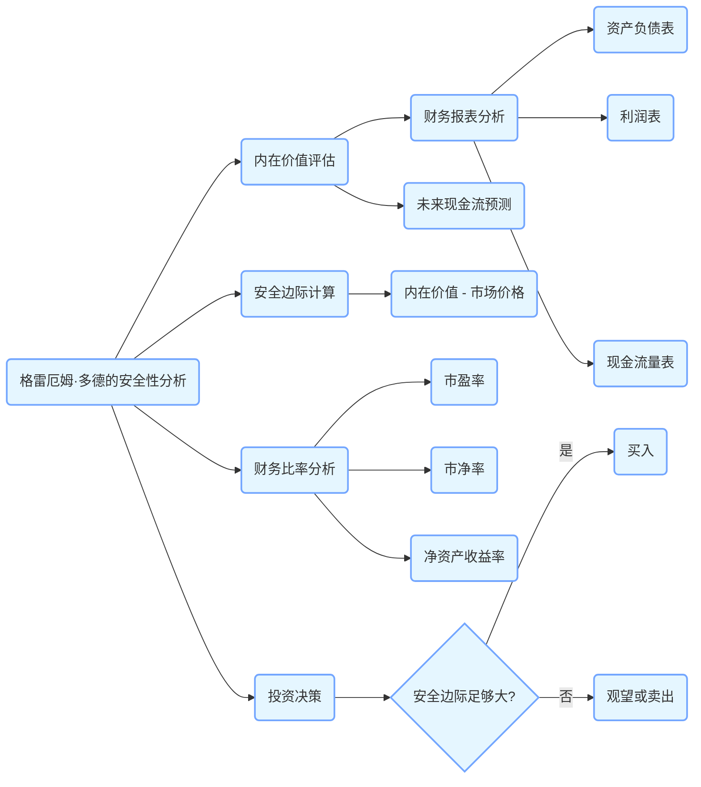

# 格雷厄姆·多德的安全性分析在现代投资中的应用

> 关键词：格雷厄姆·多德、安全性分析、现代投资、价值投资、风险评估

> 摘要：本文深入探讨了格雷厄姆·多德的安全性分析在现代投资中的应用。首先介绍了安全性分析的背景，包括其目的、预期读者和文档结构等。接着阐述了核心概念及联系，详细讲解了安全性分析的原理和架构。通过具体的算法原理和操作步骤，结合数学模型与公式进行了深入剖析。以项目实战的方式呈现了安全性分析在实际投资中的代码实现和详细解释。分析了其在不同场景下的实际应用，并推荐了相关的学习资源、开发工具和论文著作。最后总结了其未来发展趋势与挑战，还提供了常见问题解答和扩展阅读参考资料，旨在为投资者全面理解和应用格雷厄姆·多德的安全性分析提供有价值的参考。

## 1. 背景介绍 
### 1.1 目的和范围
格雷厄姆·多德的安全性分析理论自提出以来，对投资领域产生了深远的影响。本文的目的在于深入研究该理论在现代投资中的具体应用，探讨如何将其核心思想与现代投资实践相结合，以提高投资决策的科学性和准确性。研究范围涵盖了股票、债券等多种投资领域，旨在为不同类型的投资者提供实用的投资策略和方法。

### 1.2 预期读者
本文预期读者包括专业投资者、投资机构从业者、金融专业学生以及对投资理论和实践感兴趣的普通投资者。希望通过本文的阐述，能为不同层次的读者提供有价值的信息和思路，帮助他们更好地理解和应用格雷厄姆·多德的安全性分析理论。

### 1.3 文档结构概述
本文将按照以下结构展开：首先介绍格雷厄姆·多德安全性分析的背景知识，包括相关术语和概念；接着深入探讨其核心概念和联系，通过示意图和流程图进行直观展示；然后详细讲解核心算法原理和具体操作步骤，并结合 Python 源代码进行说明；再介绍相关的数学模型和公式，并举例说明；通过项目实战展示代码实际案例和详细解释；分析其在实际投资场景中的应用；推荐相关的学习资源、开发工具和论文著作；最后总结未来发展趋势与挑战，提供常见问题解答和扩展阅读参考资料。

### 1.4 术语表
#### 1.4.1 核心术语定义
- **格雷厄姆·多德的安全性分析**：由本杰明·格雷厄姆（Benjamin Graham）和戴维·多德（David Dodd）提出的一种投资分析方法，强调通过对公司财务状况、资产价值等因素的分析，评估投资的安全性和价值。
- **价值投资**：基于公司内在价值进行投资的策略，认为股票价格会围绕其内在价值波动，投资者应寻找价格低于内在价值的股票进行投资。
- **内在价值**：公司在未来能够产生的现金流量的现值，是评估公司真实价值的重要指标。

#### 1.4.2 相关概念解释
- **安全边际**：指股票价格低于其内在价值的幅度，是格雷厄姆·多德安全性分析的核心概念之一。安全边际越大，投资的风险越低。
- **财务比率分析**：通过对公司财务报表中的各项比率进行分析，如市盈率、市净率、净资产收益率等，评估公司的财务状况和盈利能力。

#### 1.4.3 缩略词列表
- **PE**：市盈率（Price-to-Earnings Ratio）
- **PB**：市净率（Price-to-Book Ratio）
- **ROE**：净资产收益率（Return on Equity）

## 2. 核心概念与联系 
格雷厄姆·多德的安全性分析核心在于通过对公司基本面的深入研究，评估投资的安全性和价值。其主要概念包括内在价值、安全边际、财务比率分析等，这些概念相互关联，共同构成了安全性分析的理论体系。

### 核心概念原理和架构的文本示意图
```plaintext
格雷厄姆·多德的安全性分析
|-- 内在价值评估
|   |-- 财务报表分析
|   |   |-- 资产负债表
|   |   |-- 利润表
|   |   |-- 现金流量表
|   |-- 未来现金流预测
|-- 安全边际计算
|   |-- 内在价值 - 市场价格
|-- 财务比率分析
|   |-- 市盈率
|   |-- 市净率
|   |-- 净资产收益率
|-- 投资决策
|   |-- 安全边际足够大
|   |   |-- 买入
|   |-- 安全边际不足
|   |   |-- 观望或卖出
```

### Mermaid 流程图


从流程图可以看出，格雷厄姆·多德的安全性分析是一个系统的过程。首先通过对公司财务报表的分析和未来现金流的预测来评估公司的内在价值。然后计算安全边际，即内在价值与市场价格的差值。同时，通过财务比率分析来辅助评估公司的财务状况和盈利能力。最后，根据安全边际的大小做出投资决策。

## 3. 核心算法原理 & 具体操作步骤 
### 核心算法原理
格雷厄姆·多德的安全性分析核心算法围绕内在价值的评估和安全边际的计算展开。内在价值的评估通常采用现金流折现法（DCF），其基本原理是将公司未来的现金流量按照一定的折现率折现到当前，得到公司的内在价值。

### 具体操作步骤
1. **收集公司财务数据**：包括资产负债表、利润表、现金流量表等，获取公司的历史财务信息。
2. **预测未来现金流量**：根据公司的历史业绩、行业发展趋势等因素，预测公司未来的现金流量。
3. **确定折现率**：折现率反映了投资者对投资回报的要求，通常考虑无风险利率、市场风险溢价等因素。
4. **计算内在价值**：使用现金流折现法计算公司的内在价值。
5. **计算安全边际**：用内在价值减去市场价格，得到安全边际。
6. **进行财务比率分析**：计算市盈率、市净率、净资产收益率等财务比率，评估公司的财务状况和盈利能力。
7. **做出投资决策**：根据安全边际的大小和财务比率分析的结果，决定是否投资。

### Python 源代码实现
```python
import numpy as np

# 定义现金流折现法计算内在价值的函数
def dcf_valuation(cash_flows, discount_rate):
    """
    计算公司的内在价值
    :param cash_flows: 未来现金流量列表
    :param discount_rate: 折现率
    :return: 内在价值
    """
    present_values = []
    for i, cf in enumerate(cash_flows):
        present_value = cf / (1 + discount_rate) ** (i + 1)
        present_values.append(present_value)
    return sum(present_values)

# 示例数据
cash_flows = [100, 120, 150, 180, 200]  # 未来 5 年的现金流量
discount_rate = 0.1  # 折现率为 10%

# 计算内在价值
intrinsic_value = dcf_valuation(cash_flows, discount_rate)
print(f"公司的内在价值为: {intrinsic_value}")

# 假设市场价格为 500
market_price = 500

# 计算安全边际
safety_margin = intrinsic_value - market_price
print(f"安全边际为: {safety_margin}")

# 财务比率分析示例
# 假设净利润为 80，总市值为 500，净资产为 300
net_income = 80
total_market_value = 500
net_assets = 300

# 计算市盈率
pe_ratio = total_market_value / net_income
print(f"市盈率为: {pe_ratio}")

# 计算市净率
pb_ratio = total_market_value / net_assets
print(f"市净率为: {pb_ratio}")

# 计算净资产收益率
roe = net_income / net_assets
print(f"净资产收益率为: {roe}")
```

在上述代码中，首先定义了一个 `dcf_valuation` 函数，用于计算公司的内在价值。然后使用示例数据计算了内在价值、安全边际以及市盈率、市净率、净资产收益率等财务比率。通过这些指标，可以对公司的投资价值进行初步评估。

## 4. 数学模型和公式 & 详细讲解 & 举例说明 
### 现金流折现法（DCF）公式
现金流折现法的基本公式为：
$$
V = \sum_{t=1}^{n} \frac{CF_t}{(1 + r)^t}
$$
其中：
- $V$ 表示公司的内在价值
- $CF_t$ 表示第 $t$ 期的现金流量
- $r$ 表示折现率
- $n$ 表示预测的期数

### 详细讲解
现金流折现法的核心思想是将公司未来的现金流量按照一定的折现率折现到当前，得到公司的内在价值。折现率反映了投资者对投资回报的要求，通常考虑无风险利率、市场风险溢价等因素。预测的期数 $n$ 可以根据公司的具体情况和投资者的预期进行确定。

### 举例说明
假设一家公司未来 3 年的现金流量分别为 100 万元、120 万元和 150 万元，折现率为 10%。则该公司的内在价值为：
$$
\begin{align*}
V &= \frac{100}{(1 + 0.1)^1} + \frac{120}{(1 + 0.1)^2} + \frac{150}{(1 + 0.1)^3}\\
&= \frac{100}{1.1} + \frac{120}{1.21} + \frac{150}{1.331}\\
&\approx 90.91 + 99.17 + 112.69\\
&= 302.77 \text{（万元）}
\end{align*}
$$

### 安全边际公式
安全边际的计算公式为：
$$
\text{安全边际} = \text{内在价值} - \text{市场价格}
$$

### 详细讲解
安全边际反映了股票价格低于其内在价值的幅度。安全边际越大，投资的风险越低。当安全边际为正数时，说明股票价格低于其内在价值，具有投资价值；当安全边际为负数时，说明股票价格高于其内在价值，投资风险较大。

### 举例说明
假设上述公司的市场价格为 250 万元，则其安全边际为：
$$
\text{安全边际} = 302.77 - 250 = 52.77 \text{（万元）}
$$

### 财务比率公式
- **市盈率（PE）**：
$$
\text{市盈率} = \frac{\text{总市值}}{\text{净利润}}
$$
- **市净率（PB）**：
$$
\text{市净率} = \frac{\text{总市值}}{\text{净资产}}
$$
- **净资产收益率（ROE）**：
$$
\text{净资产收益率} = \frac{\text{净利润}}{\text{净资产}}
$$

### 详细讲解
市盈率反映了投资者为获取公司每一元净利润所愿意支付的价格，市盈率越低，说明股票越具有投资价值。市净率反映了投资者为获取公司每一元净资产所愿意支付的价格，市净率越低，说明股票的估值越低。净资产收益率反映了公司运用自有资本的效率，净资产收益率越高，说明公司的盈利能力越强。

### 举例说明
假设一家公司的总市值为 500 万元，净利润为 80 万元，净资产为 300 万元。则该公司的市盈率、市净率和净资产收益率分别为：
- **市盈率**：
$$
\text{市盈率} = \frac{500}{80} = 6.25
$$
- **市净率**：
$$
\text{市净率} = \frac{500}{300} \approx 1.67
$$
- **净资产收益率**：
$$
\text{净资产收益率} = \frac{80}{300} \approx 0.27
$$

## 5. 项目实战：代码实际案例和详细解释说明 
### 5.1  开发环境搭建
在进行项目实战之前，需要搭建相应的开发环境。以下是具体的步骤：
1. **安装 Python**：从 Python 官方网站（https://www.python.org/downloads/）下载并安装 Python 3.x 版本。
2. **安装必要的库**：使用 `pip` 命令安装所需的库，如 `pandas`、`numpy` 等。
```sh
pip install pandas numpy
```
3. **选择开发工具**：可以选择 PyCharm、Jupyter Notebook 等开发工具。

### 5.2  源代码详细实现和代码解读
```python
import pandas as pd
import numpy as np

# 定义函数计算内在价值
def calculate_intrinsic_value(cash_flows, discount_rate):
    """
    计算公司的内在价值
    :param cash_flows: 未来现金流量列表
    :param discount_rate: 折现率
    :return: 内在价值
    """
    present_values = []
    for i, cf in enumerate(cash_flows):
        present_value = cf / (1 + discount_rate) ** (i + 1)
        present_values.append(present_value)
    return sum(present_values)

# 定义函数计算安全边际
def calculate_safety_margin(intrinsic_value, market_price):
    """
    计算安全边际
    :param intrinsic_value: 内在价值
    :param market_price: 市场价格
    :return: 安全边际
    """
    return intrinsic_value - market_price

# 定义函数计算财务比率
def calculate_financial_ratios(net_income, total_market_value, net_assets):
    """
    计算财务比率
    :param net_income: 净利润
    :param total_market_value: 总市值
    :param net_assets: 净资产
    :return: 市盈率、市净率、净资产收益率
    """
    pe_ratio = total_market_value / net_income
    pb_ratio = total_market_value / net_assets
    roe = net_income / net_assets
    return pe_ratio, pb_ratio, roe

# 示例数据
data = {
    'Year': [1, 2, 3, 4, 5],
    'Cash Flow': [100, 120, 150, 180, 200],
    'Net Income': 80,
    'Total Market Value': 500,
    'Net Assets': 300
}

# 创建 DataFrame
df = pd.DataFrame(data)

# 提取现金流量数据
cash_flows = df['Cash Flow'].tolist()

# 设定折现率
discount_rate = 0.1

# 计算内在价值
intrinsic_value = calculate_intrinsic_value(cash_flows, discount_rate)
print(f"公司的内在价值为: {intrinsic_value}")

# 计算安全边际
market_price = data['Total Market Value']
safety_margin = calculate_safety_margin(intrinsic_value, market_price)
print(f"安全边际为: {safety_margin}")

# 计算财务比率
net_income = data['Net Income']
net_assets = data['Net Assets']
pe_ratio, pb_ratio, roe = calculate_financial_ratios(net_income, market_price, net_assets)
print(f"市盈率为: {pe_ratio}")
print(f"市净率为: {pb_ratio}")
print(f"净资产收益率为: {roe}")
```

### 代码解读与分析
1. **数据准备**：首先定义了一个包含公司财务数据的字典 `data`，并使用 `pandas` 库将其转换为 DataFrame。然后提取出未来现金流量数据。
2. **计算内在价值**：定义了 `calculate_intrinsic_value` 函数，使用现金流折现法计算公司的内在价值。
3. **计算安全边际**：定义了 `calculate_safety_margin` 函数，根据内在价值和市场价格计算安全边际。
4. **计算财务比率**：定义了 `calculate_financial_ratios` 函数，计算市盈率、市净率和净资产收益率。
5. **输出结果**：将计算得到的内在价值、安全边际和财务比率打印输出。

通过这个项目实战，我们可以看到如何使用 Python 代码实现格雷厄姆·多德的安全性分析，为投资决策提供依据。

## 6. 实际应用场景 
### 股票投资
在股票投资中，格雷厄姆·多德的安全性分析可以帮助投资者筛选出具有投资价值的股票。投资者可以通过分析公司的财务报表，计算其内在价值和安全边际，选择安全边际较大、财务状况良好的股票进行投资。例如，当某只股票的市场价格低于其内在价值，且具有较高的净资产收益率和较低的市盈率、市净率时，说明该股票具有较高的投资价值。

### 债券投资
在债券投资中，安全性分析同样重要。投资者可以通过分析债券发行公司的财务状况，评估债券的违约风险。例如，通过计算债券发行公司的资产负债率、利息保障倍数等财务比率，判断公司的偿债能力。同时，结合债券的票面利率和市场利率，计算债券的内在价值，选择内在价值高于市场价格的债券进行投资。

### 基金投资
对于基金投资者来说，格雷厄姆·多德的安全性分析可以帮助他们评估基金的投资策略和风险水平。投资者可以分析基金的持仓股票或债券的基本面情况，了解基金的投资组合是否符合安全性分析的原则。例如，查看基金持仓股票的市盈率、市净率等指标，判断基金的投资风格是否偏向价值投资。

### 资产配置
在进行资产配置时，安全性分析可以帮助投资者确定不同资产的投资比例。投资者可以根据不同资产的内在价值和安全边际，合理分配资金，降低投资组合的风险。例如，当股票市场整体估值较高时，投资者可以适当增加债券等固定收益类资产的投资比例，以提高投资组合的安全性。

## 7. 工具和资源推荐
### 7.1 学习资源推荐
#### 7.1.1 书籍推荐
- 《聪明的投资者》（The Intelligent Investor）：本杰明·格雷厄姆的经典著作，被誉为投资界的圣经，详细阐述了价值投资的理念和方法。
- 《证券分析》（Security Analysis）：格雷厄姆和多德的代表作，对证券分析的理论和实践进行了系统的阐述。
- 《巴菲特致股东的信：投资者和公司高管教程》（The Essays of Warren Buffett: Lessons for Corporate America）：通过巴菲特致股东的信，深入了解巴菲特的投资思想和方法，其中很多理念都源于格雷厄姆·多德的安全性分析。

#### 7.1.2 在线课程
- Coursera 平台上的“投资学原理”课程：由知名教授授课，系统介绍投资学的基本原理和方法，包括价值投资和安全性分析的相关内容。
- edX 平台上的“金融市场”课程：提供了金融市场的全面知识，对理解投资环境和安全性分析有很大帮助。

#### 7.1.3 技术博客和网站
- 雪球网：国内知名的投资社区，有很多投资者分享自己的投资经验和对股票、债券等资产的分析，其中不乏基于格雷厄姆·多德安全性分析的观点。
- Seeking Alpha：国外的投资研究网站，提供大量的投资分析文章和研究报告，涵盖了各种投资领域和分析方法。

### 7.2 开发工具框架推荐
#### 7.2.1 IDE和编辑器
- PyCharm：一款专业的 Python 集成开发环境，提供了丰富的代码编辑、调试和项目管理功能，适合开发投资分析相关的 Python 程序。
- Jupyter Notebook：一个交互式的开发环境，支持多种编程语言，非常适合进行数据探索和分析，在投资分析中可以方便地展示代码和结果。

#### 7.2.2 调试和性能分析工具
- PDB：Python 自带的调试工具，可以帮助开发者逐行调试代码，查找和解决问题。
- cProfile：Python 的性能分析工具，可以分析代码的运行时间和函数调用情况，帮助优化代码性能。

#### 7.2.3 相关框架和库
- Pandas：用于数据处理和分析的 Python 库，提供了高效的数据结构和数据操作方法，在投资分析中可以方便地处理财务数据。
- Numpy：用于科学计算的 Python 库，提供了高效的数组操作和数学函数，在计算内在价值、财务比率等方面有很大的作用。

### 7.3 相关论文著作推荐
#### 7.3.1 经典论文
- “The Theory of Investment Value” by John Burr Williams：提出了现金流折现法的基本思想，为格雷厄姆·多德的安全性分析提供了重要的理论基础。
- “Security Analysis: Principles and Technique” by Benjamin Graham and David Dodd：格雷厄姆和多德的经典论文，系统阐述了证券分析的原理和方法。

#### 7.3.2 最新研究成果
- 近年来，有很多学者对格雷厄姆·多德的安全性分析进行了深入研究，提出了一些新的理论和方法。例如，一些研究结合了机器学习和人工智能技术，对财务数据进行更深入的分析，提高了投资决策的准确性。

#### 7.3.3 应用案例分析
- 一些金融机构和投资公司会发布基于格雷厄姆·多德安全性分析的投资案例分析报告，这些报告可以帮助投资者更好地理解和应用该理论。例如，某投资公司通过对某行业内多家公司的安全性分析，筛选出具有投资价值的股票，并取得了较好的投资回报。

## 8. 总结：未来发展趋势与挑战
### 未来发展趋势
- **与科技的融合**：随着科技的不断发展，格雷厄姆·多德的安全性分析将与大数据、人工智能、机器学习等技术更加紧密地结合。通过对海量财务数据和市场信息的分析，利用机器学习算法建立更准确的投资模型，提高投资决策的效率和准确性。
- **国际化应用**：随着全球经济一体化的发展，格雷厄姆·多德的安全性分析将在国际投资领域得到更广泛的应用。投资者可以运用该理论对不同国家和地区的企业进行分析和比较，实现全球资产配置。
- **多元化投资领域**：除了传统的股票、债券投资领域，安全性分析将逐渐应用于新兴的投资领域，如数字货币、私募股权、风险投资等。为投资者在这些领域的投资决策提供参考。

### 挑战
- **数据质量和可靠性**：安全性分析依赖于准确的财务数据和市场信息。然而，在实际应用中，数据质量和可靠性可能存在问题。例如，财务报表可能存在造假行为，市场信息可能存在滞后或不准确的情况。这将影响到安全性分析的结果和投资决策的准确性。
- **市场的不确定性**：金融市场具有高度的不确定性，受到宏观经济环境、政策变化、突发事件等多种因素的影响。即使通过安全性分析筛选出的具有投资价值的资产，也可能由于市场的不确定性而面临风险。
- **理论的局限性**：格雷厄姆·多德的安全性分析理论是基于一定的假设和前提条件的，存在一定的局限性。例如，现金流折现法中对未来现金流量和折现率的预测具有一定的主观性，可能导致内在价值的计算不准确。

## 9. 附录：常见问题与解答
### 1. 如何准确预测未来现金流量？
预测未来现金流量需要综合考虑公司的历史业绩、行业发展趋势、市场竞争状况等因素。可以参考公司的财务报表、行业研究报告、分析师的预测等资料。同时，要对不同的情景进行假设和分析，以提高预测的准确性。

### 2. 折现率如何确定？
折现率的确定需要考虑无风险利率、市场风险溢价等因素。无风险利率可以参考国债收益率等指标，市场风险溢价则需要根据市场情况和投资者的风险偏好进行估计。可以使用资本资产定价模型（CAPM）等方法来计算折现率。

### 3. 安全边际多大才合适？
安全边际的大小没有固定的标准，取决于投资者的风险偏好和投资目标。一般来说，安全边际越大，投资的风险越低。投资者可以根据自己的情况设定一个合理的安全边际阈值，当安全边际大于该阈值时，才考虑投资。

### 4. 财务比率分析有哪些局限性？
财务比率分析虽然可以提供一些有用的信息，但也存在一定的局限性。例如，财务比率可能受到会计政策的影响，不同公司的财务比率可能缺乏可比性。此外，财务比率只能反映公司过去的业绩，不能完全预测未来的发展。

### 5. 格雷厄姆·多德的安全性分析适用于所有类型的投资吗？
格雷厄姆·多德的安全性分析适用于大多数传统的投资领域，如股票、债券等。但对于一些新兴的投资领域，如数字货币、风险投资等，可能需要进行适当的调整和改进。因为这些领域的投资特点和风险特征与传统投资领域有所不同。

## 10. 扩展阅读 & 参考资料
### 扩展阅读
- 《价值投资实战手册》：进一步阐述了价值投资的理念和实践方法，结合实际案例进行分析，对理解格雷厄姆·多德的安全性分析有很大帮助。
- 《漫步华尔街》：介绍了各种投资理论和方法，对不同投资策略的优缺点进行了分析，有助于投资者拓宽投资视野。

### 参考资料
- 本杰明·格雷厄姆，戴维·多德. 《证券分析》. 中国人民大学出版社.
- 本杰明·格雷厄姆. 《聪明的投资者》. 人民邮电出版社.
- 沃伦·巴菲特. 《巴菲特致股东的信：投资者和公司高管教程》. 机械工业出版社.
- 相关金融期刊和研究报告，如《金融研究》、《证券市场导报》等。