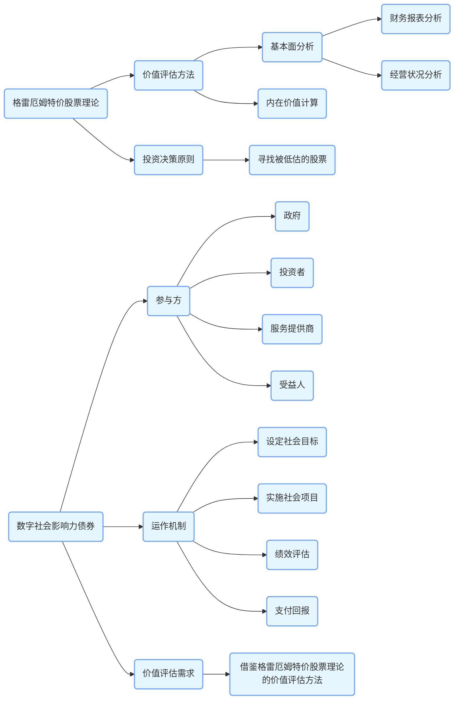

# 格雷厄姆特价股票理论在数字社会影响力债券中的新应用

> 关键词：格雷厄姆特价股票理论、数字社会影响力债券、价值评估、风险管理、新应用

> 摘要：本文旨在探讨格雷厄姆特价股票理论在数字社会影响力债券领域的新应用。首先介绍了相关背景，包括目的范围、预期读者等内容。接着阐述核心概念与联系，详细说明格雷厄姆特价股票理论和数字社会影响力债券的原理及架构，并通过示意图和流程图呈现。然后深入讲解核心算法原理与具体操作步骤，用Python代码详细阐述。同时给出相关数学模型和公式，并举例说明。通过项目实战，展示代码实际案例并进行详细解释。分析该理论在实际应用场景中的作用，推荐相关工具和资源，最后总结未来发展趋势与挑战，解答常见问题并提供扩展阅读与参考资料，以期为该领域的研究和实践提供有价值的参考。

## 1. 背景介绍 
### 1.1 目的和范围
本研究的目的在于探索格雷厄姆特价股票理论在数字社会影响力债券中的创新应用，挖掘该理论在新领域的价值和潜力，为数字社会影响力债券的评估、投资和风险管理提供新的思路和方法。范围涵盖了格雷厄姆特价股票理论的核心概念、数字社会影响力债券的特点和运作机制，以及两者结合的具体应用场景和实现途径。

### 1.2 预期读者
本文预期读者包括金融领域的研究人员、投资者、金融从业者、政策制定者以及对金融创新和社会影响力投资感兴趣的人士。这些读者可能希望了解格雷厄姆特价股票理论在数字社会影响力债券中的应用，以获取新的投资策略和风险管理方法，或者为相关政策制定提供参考。

### 1.3 文档结构概述
本文将按照以下结构展开：首先介绍背景信息，包括目的、预期读者和文档结构概述；接着阐述核心概念与联系，包括格雷厄姆特价股票理论和数字社会影响力债券的原理和架构；然后详细讲解核心算法原理和具体操作步骤，并用Python代码实现；给出相关数学模型和公式，并举例说明；通过项目实战展示代码实际案例和详细解释；分析实际应用场景；推荐相关工具和资源；总结未来发展趋势与挑战；解答常见问题；提供扩展阅读和参考资料。

### 1.4 术语表
#### 1.4.1 核心术语定义
- **格雷厄姆特价股票理论**：由本杰明·格雷厄姆（Benjamin Graham）提出的一种价值投资理论，强调通过分析公司的基本面，寻找被市场低估的股票，以获取长期投资回报。
- **数字社会影响力债券**：一种结合了数字技术和社会影响力投资理念的金融工具，旨在通过市场机制解决社会问题，同时为投资者提供经济回报。
- **价值评估**：对资产或投资项目的内在价值进行评估的过程，以确定其是否被低估或高估。
- **风险管理**：识别、评估和应对投资过程中各种风险的过程，以降低损失的可能性。

#### 1.4.2 相关概念解释
- **社会影响力**：指投资项目对社会和环境产生的积极影响，如改善教育、医疗、环境等方面的状况。
- **数字技术**：包括互联网、大数据、人工智能等技术，在数字社会影响力债券中用于提高信息透明度、优化投资决策和管理等。
- **投资回报**：投资者从投资项目中获得的收益，包括资本增值和股息收入等。

#### 1.4.3 缩略词列表
- **SIB**：社会影响力债券（Social Impact Bond）
- **DSIB**：数字社会影响力债券（Digital Social Impact Bond）

## 2. 核心概念与联系 
### 2.1 格雷厄姆特价股票理论原理
格雷厄姆特价股票理论的核心思想是通过对公司的财务报表、经营状况等基本面因素的分析，寻找那些市场价格低于其内在价值的股票。格雷厄姆认为，股票的内在价值是由公司的资产、盈利能力、股息政策等因素决定的。投资者可以通过分析这些因素，计算出股票的内在价值，并与市场价格进行比较。如果市场价格低于内在价值，那么该股票就被认为是被低估的，具有投资价值。

### 2.2 数字社会影响力债券原理
数字社会影响力债券是一种创新的金融工具，它将社会目标与金融回报相结合。其运作机制通常涉及多个参与方，包括政府、投资者、服务提供商和受益人。政府作为委托方，设定社会目标和绩效指标；投资者提供资金；服务提供商负责实施社会项目；受益人是社会项目的直接受益者。如果社会项目达到了预定的绩效指标，政府将向投资者支付回报；如果未达到指标，投资者可能会损失部分或全部投资。

### 2.3 两者的联系
格雷厄姆特价股票理论和数字社会影响力债券之间存在着一定的联系。在数字社会影响力债券中，同样需要对投资项目的价值进行评估，以确定其是否具有投资价值。格雷厄姆特价股票理论中的价值评估方法可以为数字社会影响力债券的投资决策提供参考。例如，可以通过分析社会项目的成本、收益、风险等因素，计算出项目的内在价值，并与投资成本进行比较。如果内在价值高于投资成本，那么该项目就被认为是具有投资价值的。

### 2.4 文本示意图
格雷厄姆特价股票理论和数字社会影响力债券的关系可以用以下示意图表示：

格雷厄姆特价股票理论
|-- 价值评估方法
|   |-- 基本面分析
|   |   |-- 财务报表分析
|   |   |-- 经营状况分析
|   |-- 内在价值计算
|-- 投资决策原则
|   |-- 寻找被低估的股票

数字社会影响力债券
|-- 参与方
|   |-- 政府
|   |-- 投资者
|   |-- 服务提供商
|   |-- 受益人
|-- 运作机制
|   |-- 设定社会目标
|   |-- 实施社会项目
|   |-- 绩效评估
|   |-- 支付回报
|-- 价值评估需求
|   |-- 借鉴格雷厄姆特价股票理论的价值评估方法

### 2.5 Mermaid 流程图


## 3. 核心算法原理 & 具体操作步骤 
### 3.1 格雷厄姆特价股票理论的核心算法原理
格雷厄姆特价股票理论的核心算法原理是计算股票的内在价值。常见的计算方法包括股息折现模型（Dividend Discount Model, DDM）和市盈率法（Price - Earnings Ratio, P/E）等。

#### 3.1.1 股息折现模型
股息折现模型的基本思想是将股票的未来股息按照一定的折现率折现到当前，得到股票的内在价值。其公式为：

$V = \sum_{t = 1}^{\infty} \frac{D_t}{(1 + r)^t}$

其中，$V$ 表示股票的内在价值，$D_t$ 表示第 $t$ 期的股息，$r$ 表示折现率。

#### 3.1.2 市盈率法
市盈率法是通过比较股票的市盈率与行业平均市盈率来评估股票的价值。其公式为：

$V = EPS \times P/E$

其中，$V$ 表示股票的内在价值，$EPS$ 表示每股收益，$P/E$ 表示市盈率。

### 3.2 数字社会影响力债券价值评估的核心算法原理
数字社会影响力债券的价值评估需要综合考虑社会项目的成本、收益、风险等因素。一种常见的方法是净现值法（Net Present Value, NPV）。

净现值法的基本思想是将社会项目的未来现金流量按照一定的折现率折现到当前，减去初始投资成本，得到项目的净现值。其公式为：

$NPV = \sum_{t = 0}^{n} \frac{CF_t}{(1 + r)^t} - I$

其中，$NPV$ 表示净现值，$CF_t$ 表示第 $t$ 期的现金流量，$r$ 表示折现率，$I$ 表示初始投资成本。

### 3.3 具体操作步骤
#### 3.3.1 数据收集
收集社会项目的相关数据，包括项目成本、预期收益、绩效指标、风险因素等。

#### 3.3.2 确定折现率
根据市场情况和项目风险，确定合适的折现率。

#### 3.3.3 计算净现值
使用净现值法计算社会项目的净现值。

#### 3.3.4 价值评估
根据净现值的结果，评估社会项目的价值。如果净现值大于零，则项目具有投资价值；如果净现值小于零，则项目不具有投资价值。

### 3.4 Python 源代码实现
```python
import numpy as np

def calculate_npv(cash_flows, discount_rate, initial_investment):
    """
    计算净现值
    :param cash_flows: 未来现金流量列表
    :param discount_rate: 折现率
    :param initial_investment: 初始投资成本
    :return: 净现值
    """
    npv = -initial_investment
    for t, cash_flow in enumerate(cash_flows):
        npv += cash_flow / (1 + discount_rate) ** t
    return npv

# 示例数据
cash_flows = [100, 200, 300, 400, 500]
discount_rate = 0.1
initial_investment = 1000

# 计算净现值
npv = calculate_npv(cash_flows, discount_rate, initial_investment)
print(f"净现值: {npv}")
```

## 4. 数学模型和公式 & 详细讲解 & 举例说明 
### 4.1 股息折现模型
#### 4.1.1 公式
$V = \sum_{t = 1}^{\infty} \frac{D_t}{(1 + r)^t}$

#### 4.1.2 详细讲解
股息折现模型的基本假设是股票的价值等于其未来股息的现值之和。其中，$D_t$ 表示第 $t$ 期的股息，$r$ 表示折现率。折现率反映了投资者对资金时间价值和风险的要求。

#### 4.1.3 举例说明
假设某股票每年的股息为 $10$ 元，折现率为 $0.1$，则该股票的内在价值为：

$V = \frac{10}{1 + 0.1} + \frac{10}{(1 + 0.1)^2} + \frac{10}{(1 + 0.1)^3} + \cdots$

这是一个无穷等比数列求和的问题，根据等比数列求和公式 $S = \frac{a_1}{1 - q}$（其中 $a_1$ 为首项，$q$ 为公比），可得：

$V = \frac{10}{0.1} = 100$（元）

### 4.2 市盈率法
#### 4.2.1 公式
$V = EPS \times P/E$

#### 4.2.2 详细讲解
市盈率法是一种相对简单的估值方法，通过比较股票的市盈率与行业平均市盈率来评估股票的价值。其中，$EPS$ 表示每股收益，$P/E$ 表示市盈率。

#### 4.2.3 举例说明
假设某股票的每股收益为 $2$ 元，行业平均市盈率为 $15$，则该股票的内在价值为：

$V = 2 \times 15 = 30$（元）

### 4.3 净现值法
#### 4.3.1 公式
$NPV = \sum_{t = 0}^{n} \frac{CF_t}{(1 + r)^t} - I$

#### 4.3.2 详细讲解
净现值法是一种常用的投资决策方法，通过比较项目的净现值与零的大小来判断项目是否具有投资价值。其中，$CF_t$ 表示第 $t$ 期的现金流量，$r$ 表示折现率，$I$ 表示初始投资成本。

#### 4.3.3 举例说明
假设某社会项目的初始投资成本为 $1000$ 元，未来 $5$ 年的现金流量分别为 $100$ 元、$200$ 元、$300$ 元、$400$ 元、$500$ 元，折现率为 $0.1$，则该项目的净现值为：

$NPV = -1000 + \frac{100}{1 + 0.1} + \frac{200}{(1 + 0.1)^2} + \frac{300}{(1 + 0.1)^3} + \frac{400}{(1 + 0.1)^4} + \frac{500}{(1 + 0.1)^5}$

$NPV \approx -1000 + 90.91 + 165.29 + 225.39 + 273.21 + 310.46 = 65.26$（元）

由于净现值大于零，该项目具有投资价值。

## 5. 项目实战：代码实际案例和详细解释说明 
### 5.1  开发环境搭建
#### 5.1.1 安装 Python
首先，需要安装 Python 开发环境。可以从 Python 官方网站（https://www.python.org/downloads/）下载适合自己操作系统的 Python 安装包，并按照安装向导进行安装。

#### 5.1.2 安装必要的库
在本项目中，我们使用了 `numpy` 库来进行数值计算。可以使用以下命令安装 `numpy` 库：

```sh
pip install numpy
```

### 5.2  源代码详细实现和代码解读
```python
import numpy as np

def calculate_npv(cash_flows, discount_rate, initial_investment):
    """
    计算净现值
    :param cash_flows: 未来现金流量列表
    :param discount_rate: 折现率
    :param initial_investment: 初始投资成本
    :return: 净现值
    """
    npv = -initial_investment
    for t, cash_flow in enumerate(cash_flows):
        npv += cash_flow / (1 + discount_rate) ** t
    return npv

# 示例数据
cash_flows = [100, 200, 300, 400, 500]
discount_rate = 0.1
initial_investment = 1000

# 计算净现值
npv = calculate_npv(cash_flows, discount_rate, initial_investment)
print(f"净现值: {npv}")
```

#### 5.2.1 代码解读
- **导入库**：`import numpy as np` 导入 `numpy` 库，用于数值计算。
- **定义函数**：`calculate_npv` 函数用于计算净现值。该函数接受三个参数：`cash_flows` 表示未来现金流量列表，`discount_rate` 表示折现率，`initial_investment` 表示初始投资成本。
- **计算净现值**：在函数内部，首先将初始投资成本取负，然后遍历未来现金流量列表，将每个现金流量按照折现率折现到当前，并累加到净现值中。
- **示例数据**：定义了示例数据 `cash_flows`、`discount_rate` 和 `initial_investment`。
- **调用函数**：调用 `calculate_npv` 函数计算净现值，并将结果打印输出。

### 5.3  代码解读与分析
#### 5.3.1 代码优点
- **简单易懂**：代码结构简单，逻辑清晰，易于理解和维护。
- **可扩展性**：可以根据需要修改函数的参数和实现逻辑，以适应不同的应用场景。

#### 5.3.2 代码局限性
- **假设条件**：代码中假设未来现金流量是已知的，且折现率是固定的。在实际应用中，这些假设可能不成立。
- **缺乏风险评估**：代码中没有考虑项目的风险因素，可能导致评估结果不准确。

## 6. 实际应用场景 
### 6.1 投资决策
在数字社会影响力债券的投资决策中，投资者可以使用格雷厄姆特价股票理论的价值评估方法，对社会项目的价值进行评估，以确定是否投资。例如，通过计算社会项目的净现值，判断项目是否具有投资价值。如果净现值大于零，则项目具有投资价值；如果净现值小于零，则项目不具有投资价值。

### 6.2 风险管理
在数字社会影响力债券的投资过程中，投资者可以使用格雷厄姆特价股票理论的风险管理方法，对项目的风险进行评估和控制。例如，通过分析社会项目的风险因素，确定合适的折现率，以降低投资风险。

### 6.3 项目评估
政府和其他相关部门可以使用格雷厄姆特价股票理论的价值评估方法，对社会项目的绩效进行评估。例如，通过比较社会项目的实际收益与预期收益，评估项目的实施效果。

### 6.4 政策制定
政策制定者可以根据格雷厄姆特价股票理论的相关原理，制定相关政策，促进数字社会影响力债券的发展。例如，通过税收优惠等政策，鼓励投资者参与数字社会影响力债券的投资。

## 7. 工具和资源推荐
### 7.1 学习资源推荐
#### 7.1.1 书籍推荐
- 《聪明的投资者》（The Intelligent Investor）：本杰明·格雷厄姆的经典著作，介绍了价值投资的基本原理和方法。
- 《社会影响力投资：改变世界的金融创新》（Impact Investing: Transforming How We Make Money While Making a Difference）：介绍了社会影响力投资的概念、实践和发展趋势。

#### 7.1.2 在线课程
- Coursera 上的 “价值投资基础”（Foundations of Value Investing）课程：由知名教授授课，介绍了价值投资的基本理论和方法。
- edX 上的 “社会影响力投资”（Social Impact Investing）课程：介绍了社会影响力投资的概念、实践和案例分析。

#### 7.1.3 技术博客和网站
- 金融界网站（https://www.jrj.com.cn/）：提供金融领域的最新资讯和研究报告。
- 社会影响力投资网络（https://www.thegiin.org/）：提供社会影响力投资的相关信息和资源。

### 7.2 开发工具框架推荐
#### 7.2.1 IDE和编辑器
- PyCharm：一款功能强大的 Python 集成开发环境，提供代码编辑、调试、版本控制等功能。
- Visual Studio Code：一款轻量级的代码编辑器，支持多种编程语言，具有丰富的插件扩展功能。

#### 7.2.2 调试和性能分析工具
- `pdb`：Python 自带的调试工具，可以帮助开发者调试代码。
- `cProfile`：Python 自带的性能分析工具，可以帮助开发者分析代码的性能瓶颈。

#### 7.2.3 相关框架和库
- `numpy`：用于数值计算的 Python 库，提供了高效的数组操作和数学函数。
- `pandas`：用于数据处理和分析的 Python 库，提供了丰富的数据结构和数据处理方法。

### 7.3 相关论文著作推荐
#### 7.3.1 经典论文
- Graham, B., & Dodd, D. L. (1934). Security Analysis. McGraw - Hill. 该书是价值投资领域的经典著作，提出了格雷厄姆特价股票理论的基本原理。
- Nicholls, A. (2010). Social impact bonds: a new instrument for social finance in the UK. The London School of Economics and Political Science. 该论文介绍了社会影响力债券的概念和运作机制。

#### 7.3.2 最新研究成果
- 关注《Journal of Financial Economics》、《Review of Financial Studies》等金融领域的顶级期刊，获取关于价值投资和社会影响力投资的最新研究成果。

#### 7.3.3 应用案例分析
- 世界银行、国际金融公司等国际组织发布的关于社会影响力投资的案例分析报告，提供了实际应用场景和经验教训。

## 8. 总结：未来发展趋势与挑战
### 8.1 未来发展趋势
#### 8.1.1 数字化程度不断提高
随着数字技术的不断发展，数字社会影响力债券的数字化程度将不断提高。例如，利用区块链技术提高信息透明度和安全性，利用人工智能技术优化投资决策和风险管理。

#### 8.1.2 应用领域不断拓展
数字社会影响力债券的应用领域将不断拓展，除了教育、医疗、环境等传统领域，还将涉及到更多的社会问题，如贫困、就业、老龄化等。

#### 8.1.3 国际合作不断加强
随着全球社会问题的日益复杂，国际合作将不断加强。数字社会影响力债券将成为国际合作的重要工具，促进各国之间的资源共享和经验交流。

### 8.2 挑战
#### 8.2.1 数据质量和透明度
数字社会影响力债券的价值评估和风险管理需要大量的数据支持。然而，目前社会项目的数据质量和透明度普遍较低，给投资决策和风险管理带来了困难。

#### 8.2.2 风险评估和管理
数字社会影响力债券涉及到多个参与方和复杂的社会问题，风险评估和管理难度较大。如何准确评估项目的风险，并采取有效的风险管理措施，是当前面临的重要挑战。

#### 8.2.3 政策和监管
数字社会影响力债券是一种创新的金融工具，目前相关的政策和监管还不完善。如何制定合适的政策和监管措施，促进数字社会影响力债券的健康发展，是当前需要解决的问题。

## 9. 附录：常见问题与解答
### 9.1 格雷厄姆特价股票理论适用于所有类型的股票吗？
格雷厄姆特价股票理论主要适用于那些具有稳定现金流和可预测股息的股票。对于一些新兴行业的股票，由于其未来发展的不确定性较大，该理论的适用性可能会受到限制。

### 9.2 数字社会影响力债券的投资回报如何确定？
数字社会影响力债券的投资回报通常与社会项目的绩效指标挂钩。如果社会项目达到了预定的绩效指标，政府将向投资者支付回报；如果未达到指标，投资者可能会损失部分或全部投资。

### 9.3 如何评估数字社会影响力债券的风险？
评估数字社会影响力债券的风险需要综合考虑多个因素，如社会项目的可行性、服务提供商的能力、政策环境等。可以使用风险评估模型和方法，对项目的风险进行量化分析。

### 9.4 数字社会影响力债券与传统债券有什么区别？
数字社会影响力债券与传统债券的主要区别在于其投资目的和回报机制。传统债券主要关注投资者的经济回报，而数字社会影响力债券不仅关注经济回报，还关注社会项目的社会影响力。其回报机制通常与社会项目的绩效指标挂钩。

## 10. 扩展阅读 & 参考资料
### 10.1 扩展阅读
- 《金融炼金术》（The Alchemy of Finance）：乔治·索罗斯的著作，介绍了金融市场的运行机制和投资策略。
- 《穷查理宝典》（Poor Charlie's Almanack）：查理·芒格的著作，介绍了他的投资理念和人生智慧。

### 10.2 参考资料
- Graham, B. (1949). The Intelligent Investor. HarperBusiness.
- Nicholls, A., & Tomkinson, P. (2012). Social impact bonds: the challenges of implementation. The London School of Economics and Political Science.
- The Global Impact Investing Network. (2023). Annual Impact Investor Survey.