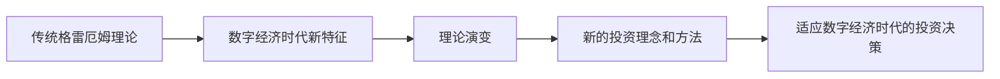

# 格雷厄姆特价股票理论在数字经济时代的演变

> 关键词：格雷厄姆特价股票理论、数字经济时代、价值投资、股票估值、理论演变

> 摘要：本文深入探讨了格雷厄姆特价股票理论在数字经济时代的演变。首先介绍了该理论的背景及其在传统经济环境下的重要性，接着阐述数字经济时代带来的新特征和挑战，分析这些变化如何促使格雷厄姆理论进行演变。详细讲解了核心概念与联系，包括传统理论和数字经济下的新内涵；通过具体算法原理和数学模型揭示理论演变的内在逻辑；结合项目实战案例展示演变后的理论在实际投资中的应用；探讨了该理论在数字经济时代的实际应用场景；推荐了相关的学习资源、开发工具框架以及论文著作。最后总结了未来发展趋势与挑战，并对常见问题进行解答，提供扩展阅读和参考资料，旨在为投资者和研究者在数字经济时代的投资决策和理论研究提供全面的参考。

## 1. 背景介绍 
### 1.1 目的和范围
本研究的目的在于全面剖析格雷厄姆特价股票理论在数字经济时代的演变过程、特点和影响。范围涵盖了从格雷厄姆理论的起源和基本原理，到数字经济时代经济环境、企业特征、投资理念等方面的变化，以及这些变化如何作用于该理论，使其发生适应性的演变。同时，通过实际案例分析和理论推导，探讨演变后的理论在数字经济时代的应用和发展前景。

### 1.2 预期读者
本文预期读者包括金融投资者，他们可以从理论演变中获取新的投资思路和方法，优化投资策略；金融分析师和研究人员，能够深入了解理论的发展动态，为进一步的学术研究和市场分析提供参考；经济和金融专业的学生，有助于他们拓宽知识面，加深对价值投资理论和数字经济的理解。

### 1.3 文档结构概述
本文首先介绍格雷厄姆特价股票理论的背景信息，包括目的、预期读者和文档结构。接着阐述核心概念与联系，分析传统理论与数字经济时代新特征的关联。然后讲解核心算法原理和数学模型，揭示理论演变的内在逻辑。通过项目实战案例展示演变后的理论在实际投资中的应用。探讨该理论在数字经济时代的实际应用场景。推荐相关的学习资源、开发工具框架和论文著作。最后总结未来发展趋势与挑战，解答常见问题，并提供扩展阅读和参考资料。

### 1.4 术语表
#### 1.4.1 核心术语定义
- **格雷厄姆特价股票理论**：由本杰明·格雷厄姆提出的一种价值投资理论，强调通过分析公司的财务报表和基本面，寻找被市场低估的股票进行投资，以获取长期稳定的收益。
- **数字经济时代**：以数字技术为核心驱动力，数据成为关键生产要素，经济活动高度数字化、网络化和智能化的时代。
- **价值投资**：一种基于公司内在价值进行投资的理念，投资者通过分析公司的财务状况、行业地位、竞争优势等因素，寻找价格低于内在价值的股票进行投资。
- **股票估值**：对股票的内在价值进行评估的过程，常用的方法包括市盈率法、市净率法、现金流折现法等。

#### 1.4.2 相关概念解释
- **基本面分析**：通过研究公司的财务报表、经营状况、行业前景等基本面因素，评估公司的内在价值和投资价值。
- **市场效率**：市场价格反映所有可用信息的程度。在有效市场中，股票价格能够及时、准确地反映公司的内在价值；而在无效市场中，股票价格可能偏离其内在价值。
- **无形资产**：不具有实物形态，但具有经济价值的资产，如专利、商标、品牌、技术等。在数字经济时代，无形资产对企业的价值和竞争力越来越重要。

#### 1.4.3 缩略词列表
- **PE**：市盈率（Price - Earnings Ratio），是股票价格与每股收益的比率，用于衡量股票的估值水平。
- **PB**：市净率（Price - Book Ratio），是股票价格与每股净资产的比率，反映了市场对公司净资产的估值。
- **DCF**：现金流折现法（Discounted Cash Flow），是一种通过预测公司未来现金流并折现到当前的估值方法。

## 2. 核心概念与联系 

### 格雷厄姆特价股票理论的传统内涵
格雷厄姆特价股票理论的核心思想是寻找市场中价格低于内在价值的股票，即“特价股票”。其基本原理基于对公司基本面的深入分析，通过计算公司的净资产、盈利能力等指标，评估公司的内在价值。传统的格雷厄姆理论主要关注公司的有形资产和财务报表，认为股票的价值主要取决于公司的账面价值和盈利能力。

### 数字经济时代的新特征
数字经济时代具有以下新特征：
1. **数据成为关键生产要素**：数据的收集、分析和利用能力成为企业核心竞争力的重要组成部分。
2. **无形资产占比增加**：企业的价值越来越多地体现在专利、技术、品牌、用户数据等无形资产上。
3. **商业模式创新**：出现了许多基于互联网、大数据、人工智能等技术的新型商业模式，如平台经济、共享经济等。
4. **市场变化快速**：数字技术的发展使得市场信息传播速度加快，市场变化更加频繁和剧烈。

### 理论演变的联系
数字经济时代的新特征对格雷厄姆特价股票理论产生了深刻的影响，促使其发生演变。传统理论主要关注有形资产和财务报表，而在数字经济时代，无形资产和数据资产的重要性日益凸显，需要将这些因素纳入股票估值的考虑范围。同时，新型商业模式的出现也要求投资者重新审视公司的盈利能力和成长潜力。此外，市场变化的快速性要求投资者更加注重信息的及时性和准确性，以及投资策略的灵活性。

### 文本示意图
| 传统格雷厄姆理论 | 数字经济时代演变 |
| --- | --- |
| 关注有形资产 | 重视无形资产和数据资产 |
| 基于财务报表分析 | 结合大数据和人工智能分析 |
| 强调账面价值 | 考虑未来成长潜力 |
| 投资策略相对稳定 | 投资策略更加灵活 |

### Mermaid 流程图


## 3. 核心算法原理 & 具体操作步骤 

### 传统格雷厄姆理论的核心算法
传统格雷厄姆理论常用的估值方法包括市盈率法和市净率法。

#### 市盈率法
市盈率（PE）的计算公式为：
```python
# 计算市盈率
def calculate_pe(stock_price, earnings_per_share):
    return stock_price / earnings_per_share
```
市盈率反映了市场对公司盈利能力的预期。一般来说，市盈率较低的股票可能被低估。

#### 市净率法
市净率（PB）的计算公式为：
```python
# 计算市净率
def calculate_pb(stock_price, book_value_per_share):
    return stock_price / book_value_per_share
```
市净率反映了市场对公司净资产的估值。市净率较低的股票可能具有更高的安全边际。

### 数字经济时代的演变算法
在数字经济时代，需要对传统算法进行改进，纳入无形资产和数据资产等因素。

#### 考虑无形资产的估值方法
可以通过对无形资产进行评估，将其价值加入到公司的净资产中，从而调整市净率的计算。
```python
# 考虑无形资产的市净率计算
def calculate_pb_with_intangible(stock_price, book_value_per_share, intangible_value_per_share):
    adjusted_book_value = book_value_per_share + intangible_value_per_share
    return stock_price / adjusted_book_value
```

#### 基于大数据和人工智能的估值方法
利用大数据和人工智能技术，可以收集和分析更多的信息，包括市场趋势、用户行为、行业动态等，从而更准确地预测公司的未来现金流和成长潜力。以下是一个简单的基于机器学习的现金流预测示例：
```python
import pandas as pd
from sklearn.linear_model import LinearRegression

# 假设已经有历史现金流数据和相关特征数据
data = pd.read_csv('cash_flow_data.csv')
X = data[['feature1', 'feature2', 'feature3']]
y = data['cash_flow']

# 训练线性回归模型
model = LinearRegression()
model.fit(X, y)

# 预测未来现金流
new_data = pd.DataFrame({'feature1': [1], 'feature2': [2], 'feature3': [3]})
predicted_cash_flow = model.predict(new_data)
```

### 具体操作步骤
1. **数据收集**：收集公司的财务报表、行业数据、市场信息、用户数据等。
2. **基本面分析**：对公司的财务状况、经营业绩、行业地位等进行分析，评估公司的基本面。
3. **无形资产评估**：对公司的专利、技术、品牌、用户数据等无形资产进行评估，确定其价值。
4. **估值计算**：根据改进后的算法，计算股票的估值，包括考虑无形资产的市净率、基于大数据和人工智能的现金流折现估值等。
5. **投资决策**：根据估值结果，选择价格低于内在价值的股票进行投资，并制定合理的投资策略。

## 4. 数学模型和公式 & 详细讲解 & 举例说明 

### 传统格雷厄姆理论的数学模型
#### 市盈率模型
市盈率（PE）的计算公式为：
$$PE = \frac{P}{EPS}$$
其中，$P$ 为股票价格，$EPS$ 为每股收益。

举例说明：假设某公司的股票价格为 $50$ 元，每股收益为 $5$ 元，则该股票的市盈率为：
$$PE = \frac{50}{5} = 10$$

#### 市净率模型
市净率（PB）的计算公式为：
$$PB = \frac{P}{BVPS}$$
其中，$P$ 为股票价格，$BVPS$ 为每股净资产。

举例说明：假设某公司的股票价格为 $30$ 元，每股净资产为 $10$ 元，则该股票的市净率为：
$$PB = \frac{30}{10} = 3$$

### 数字经济时代演变后的数学模型
#### 考虑无形资产的市净率模型
考虑无形资产的市净率（PB'）的计算公式为：
$$PB' = \frac{P}{BVPS + IVPS}$$
其中，$P$ 为股票价格，$BVPS$ 为每股净资产，$IVPS$ 为每股无形资产价值。

举例说明：假设某公司的股票价格为 $40$ 元，每股净资产为 $15$ 元，每股无形资产价值为 $5$ 元，则该股票考虑无形资产的市净率为：
$$PB' = \frac{40}{15 + 5} = 2$$

#### 现金流折现模型（DCF）
现金流折现模型的基本公式为：
$$V = \sum_{t = 1}^{n} \frac{CF_t}{(1 + r)^t}$$
其中，$V$ 为公司的内在价值，$CF_t$ 为第 $t$ 期的现金流，$r$ 为折现率，$n$ 为预测期数。

举例说明：假设某公司未来三年的现金流分别为 $100$ 万元、$120$ 万元、$150$ 万元，折现率为 $10\%$，则该公司的内在价值为：
$$V = \frac{100}{(1 + 0.1)^1} + \frac{120}{(1 + 0.1)^2} + \frac{150}{(1 + 0.1)^3} \approx 295.36$$（万元）

### 详细讲解
传统的市盈率和市净率模型主要基于公司的历史财务数据，反映了公司过去的盈利能力和净资产状况。而在数字经济时代，考虑无形资产的市净率模型和现金流折现模型更加注重公司的未来成长潜力和无形资产的价值。现金流折现模型通过预测公司未来的现金流，并将其折现到当前，能够更准确地反映公司的内在价值。但该模型的关键在于准确预测未来现金流和选择合适的折现率，这需要投资者具备丰富的经验和专业知识。

## 5. 项目实战：代码实际案例和详细解释说明 

### 5.1  开发环境搭建
1. **Python 环境**：安装 Python 3.x 版本，可以从 Python 官方网站（https://www.python.org/downloads/）下载并安装。
2. **必要的库**：安装 pandas、numpy、scikit - learn 等库，可以使用以下命令进行安装：
```sh
pip install pandas numpy scikit-learn
```
3. **数据获取**：可以通过金融数据接口（如 Tushare、BaoStock 等）获取股票的财务数据和市场数据。

### 5.2  源代码详细实现和代码解读
```python
import pandas as pd
import numpy as np
from sklearn.linear_model import LinearRegression

# 模拟获取股票数据
def get_stock_data():
    data = {
        'stock_price': [50, 60, 70, 80, 90],
        'earnings_per_share': [5, 6, 7, 8, 9],
        'book_value_per_share': [10, 12, 14, 16, 18],
        'intangible_value_per_share': [2, 3, 4, 5, 6]
    }
    return pd.DataFrame(data)

# 计算市盈率
def calculate_pe(stock_price, earnings_per_share):
    return stock_price / earnings_per_share

# 计算市净率
def calculate_pb(stock_price, book_value_per_share):
    return stock_price / book_value_per_share

# 计算考虑无形资产的市净率
def calculate_pb_with_intangible(stock_price, book_value_per_share, intangible_value_per_share):
    adjusted_book_value = book_value_per_share + intangible_value_per_share
    return stock_price / adjusted_book_value

# 主函数
def main():
    # 获取股票数据
    stock_data = get_stock_data()
    
    # 计算市盈率
    stock_data['pe'] = calculate_pe(stock_data['stock_price'], stock_data['earnings_per_share'])
    
    # 计算市净率
    stock_data['pb'] = calculate_pb(stock_data['stock_price'], stock_data['book_value_per_share'])
    
    # 计算考虑无形资产的市净率
    stock_data['pb_with_intangible'] = calculate_pb_with_intangible(stock_data['stock_price'], 
                                                                  stock_data['book_value_per_share'], 
                                                                  stock_data['intangible_value_per_share'])
    
    print(stock_data)

if __name__ == '__main__':
    main()
```

### 5.3  代码解读与分析
1. **数据获取**：`get_stock_data` 函数模拟获取股票的相关数据，包括股票价格、每股收益、每股净资产和每股无形资产价值。
2. **计算函数**：`calculate_pe` 函数计算市盈率，`calculate_pb` 函数计算市净率，`calculate_pb_with_intangible` 函数计算考虑无形资产的市净率。
3. **主函数**：`main` 函数调用上述函数，计算市盈率、市净率和考虑无形资产的市净率，并将结果存储在数据框中进行输出。

通过这个案例，我们可以看到如何在 Python 中实现格雷厄姆理论的基本估值方法，并考虑数字经济时代无形资产的影响。

## 6. 实际应用场景 
### 股票投资决策
在数字经济时代，投资者可以利用演变后的格雷厄姆理论，结合大数据和人工智能技术，对股票进行更准确的估值和分析。通过考虑无形资产和数据资产的价值，投资者可以发现那些被市场低估的具有成长潜力的股票，从而做出更明智的投资决策。

### 企业价值评估
企业在进行并购、重组等资本运作时，需要对目标企业的价值进行评估。演变后的格雷厄姆理论可以为企业价值评估提供更全面、准确的方法，帮助企业确定合理的交易价格。

### 金融机构风险管理
金融机构在进行信贷审批、投资组合管理等业务时，需要对企业的信用风险和投资风险进行评估。格雷厄姆理论的演变可以为金融机构提供更有效的风险评估工具，帮助其降低风险。

### 政策制定参考
政府在制定产业政策、金融政策时，需要了解企业的价值和市场的运行情况。演变后的格雷厄姆理论可以为政策制定者提供参考，帮助其制定更科学、合理的政策。

## 7. 工具和资源推荐
### 7.1 学习资源推荐
#### 7.1.1 书籍推荐
- 《聪明的投资者》（The Intelligent Investor）：本杰明·格雷厄姆的经典著作，详细阐述了价值投资的理念和方法。
- 《证券分析》（Security Analysis）：同样是格雷厄姆的重要著作，对股票和债券的分析方法进行了深入探讨。
- 《数字经济：智能时代的新形态》：介绍了数字经济的基本概念、发展趋势和应用场景。

#### 7.1.2 在线课程
- Coursera 上的“Financial Markets”：由耶鲁大学教授罗伯特·席勒（Robert Shiller）讲授，涵盖了金融市场的基本理论和实践。
- edX 上的“Data Science for Business”：介绍了数据科学在商业中的应用，包括数据分析、机器学习等技术。

#### 7.1.3 技术博客和网站
- Seeking Alpha：提供股票分析、投资策略和市场评论等内容。
- QuantNet：专注于量化金融领域，分享量化投资的技术和经验。

### 7.2 开发工具框架推荐
#### 7.2.1 IDE和编辑器
- PyCharm：功能强大的 Python 集成开发环境，提供代码编辑、调试、版本控制等功能。
- Jupyter Notebook：交互式的编程环境，适合数据探索和分析。

#### 7.2.2 调试和性能分析工具
- pdb：Python 自带的调试工具，可以帮助开发者定位和解决代码中的问题。
- cProfile：Python 的性能分析工具，可以分析代码的执行时间和性能瓶颈。

#### 7.2.3 相关框架和库
- Pandas：用于数据处理和分析的 Python 库，提供了丰富的数据结构和数据操作方法。
- NumPy：Python 的科学计算库，提供了高效的数组和矩阵运算功能。
- Scikit - learn：用于机器学习的 Python 库，提供了各种机器学习算法和工具。

### 7.3 相关论文著作推荐
#### 7.3.1 经典论文
- Graham, B., & Dodd, D. L. (1934). Security Analysis. 该论文奠定了价值投资的理论基础。
- Fama, E. F., & French, K. R. (1992). The Cross - Section of Expected Stock Returns. 提出了著名的 Fama - French 三因子模型。

#### 7.3.2 最新研究成果
- 关注《Journal of Finance》、《Review of Financial Studies》等金融领域顶级期刊，获取关于价值投资和数字经济的最新研究成果。

#### 7.3.3 应用案例分析
- 可以参考一些金融机构和投资公司的研究报告，了解格雷厄姆理论在实际投资中的应用案例和效果。

## 8. 总结：未来发展趋势与挑战
### 未来发展趋势
1. **数据驱动的投资决策**：随着数字经济的发展，数据将成为投资决策的重要依据。投资者将更多地利用大数据、人工智能等技术，对海量数据进行分析和挖掘，以获取更准确的投资信息。
2. **跨学科融合**：格雷厄姆理论将与计算机科学、统计学、心理学等学科进行更深入的融合，形成更加综合和复杂的投资理论和方法。
3. **个性化投资**：根据投资者的风险偏好、投资目标和财务状况，提供个性化的投资策略和建议，满足不同投资者的需求。
4. **全球投资视野**：数字经济打破了地域限制，投资者将具有更广阔的全球投资视野，关注不同国家和地区的投资机会。

### 挑战
1. **数据质量和安全**：数据的质量和安全是数据驱动投资决策的关键。投资者需要确保获取的数据准确、可靠，并保护数据的安全和隐私。
2. **技术更新换代快**：数字技术发展迅速，投资者需要不断学习和掌握新的技术和方法，以适应市场的变化。
3. **市场不确定性增加**：数字经济时代市场变化更加快速和复杂，投资者面临的不确定性增加，需要提高风险应对能力。
4. **伦理和法律问题**：大数据和人工智能的应用可能会带来伦理和法律问题，如数据滥用、算法歧视等，投资者需要遵守相关的伦理和法律规定。

## 9. 附录：常见问题与解答
### 1. 格雷厄姆特价股票理论在数字经济时代是否仍然适用？
答：仍然适用，但需要进行适当的演变和调整。数字经济时代的新特征对传统理论提出了挑战，需要将无形资产、数据资产等因素纳入考虑范围，同时结合大数据和人工智能等技术，提高理论的适应性和准确性。

### 2. 如何评估无形资产的价值？
答：评估无形资产的价值是一个复杂的过程，常用的方法包括成本法、市场法和收益法。成本法是根据无形资产的开发成本进行评估；市场法是通过比较类似无形资产的市场交易价格进行评估；收益法是根据无形资产未来带来的收益进行评估。

### 3. 现金流折现模型中的折现率如何确定？
答：折现率的确定需要考虑多种因素，包括市场利率、投资风险、行业平均收益率等。一般来说，可以采用资本资产定价模型（CAPM）来确定折现率，公式为：$r = R_f+\beta\times (R_m - R_f)$，其中 $R_f$ 为无风险利率，$\beta$ 为股票的贝塔系数，$R_m$ 为市场收益率。

### 4. 数字经济时代的投资风险有哪些？
答：数字经济时代的投资风险包括技术风险、市场风险、竞争风险、政策风险等。技术风险主要来自于数字技术的快速发展和更新换代；市场风险表现为市场价格的波动和不确定性增加；竞争风险是由于数字经济领域竞争激烈，企业可能面临被淘汰的风险；政策风险是指政府政策的变化可能对企业和投资产生影响。

## 10. 扩展阅读 & 参考资料
### 扩展阅读
- 《创新者的窘境》（The Innovator's Dilemma）：探讨了创新对企业和市场的影响，对于理解数字经济时代企业的发展和竞争具有重要意义。
- 《智能时代》：介绍了人工智能技术的发展和应用，以及对经济、社会和生活的影响。

### 参考资料
- 本杰明·格雷厄姆（Benjamin Graham）的相关著作和论文。
- 金融领域的学术期刊和研究报告，如《Journal of Finance》、《Review of Financial Studies》等。
- 金融数据提供商的网站，如 Tushare、BaoStock 等。