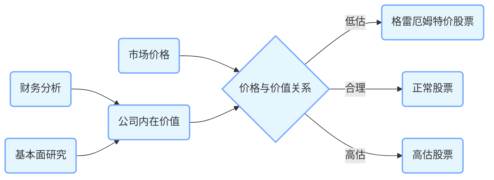

# 格雷厄姆特价股票理论对公司估值方法的影响

> 关键词：格雷厄姆特价股票理论、公司估值方法、价值投资、财务分析、市场效率

> 摘要：本文深入探讨了格雷厄姆特价股票理论对公司估值方法的影响。首先介绍了该理论的背景，包括其目的、预期读者、文档结构和相关术语。接着阐述了核心概念及联系，详细讲解了格雷厄姆特价股票理论的原理和架构。通过Python源代码展示了核心算法原理及具体操作步骤，同时给出了相关的数学模型和公式并举例说明。在项目实战部分，通过实际案例展示了如何运用理论进行公司估值，包括开发环境搭建、源代码实现和代码解读。还分析了该理论在实际中的应用场景，推荐了相关的学习资源、开发工具框架和论文著作。最后总结了未来发展趋势与挑战，并对常见问题进行了解答，提供了扩展阅读和参考资料，旨在全面剖析格雷厄姆特价股票理论对公司估值方法的多方面影响。

## 1. 背景介绍 
### 1.1 目的和范围
格雷厄姆特价股票理论是价值投资领域的重要基石，对公司估值方法产生了深远影响。本文的目的在于系统地分析这一理论如何改变和完善了公司估值的思路与方法。范围涵盖了格雷厄姆特价股票理论的基本原理、相关算法、数学模型，以及在实际项目中的应用，同时探讨其在不同市场环境下对公司估值的作用和局限性。

### 1.2 预期读者
本文预期读者包括金融分析师、投资经理、股票投资者、学术研究人员以及对价值投资和公司估值感兴趣的人士。无论是专业的金融从业者，还是希望深入了解投资理论的普通投资者，都能从本文中获得有价值的信息。

### 1.3 文档结构概述
本文将按照以下结构展开：首先介绍格雷厄姆特价股票理论的背景和相关术语；接着阐述核心概念及联系，包括理论原理和架构；然后详细讲解核心算法原理和具体操作步骤，并给出数学模型和公式；通过项目实战展示理论在实际中的应用；分析实际应用场景；推荐相关的学习资源、开发工具框架和论文著作；最后总结未来发展趋势与挑战，解答常见问题，并提供扩展阅读和参考资料。

### 1.4 术语表
#### 1.4.1 核心术语定义
- **格雷厄姆特价股票理论**：由本杰明·格雷厄姆（Benjamin Graham）提出的一种价值投资理论，强调寻找被市场低估的股票，即股价低于其内在价值的股票。
- **公司估值**：对公司的价值进行评估的过程，通过各种方法确定公司的合理价值，为投资决策提供依据。
- **内在价值**：公司的真实价值，基于公司的财务状况、盈利能力、资产质量等因素综合评估得出。
- **安全边际**：股票的内在价值与市场价格之间的差额，是格雷厄姆投资理论中的重要概念，用于降低投资风险。

#### 1.4.2 相关概念解释
- **价值投资**：一种投资策略，通过分析公司的基本面，寻找被低估的股票，长期持有以获取投资回报。
- **财务分析**：对公司的财务报表进行分析，评估公司的财务状况、经营成果和现金流量，为公司估值提供数据支持。
- **市场效率**：市场价格反映公司真实价值的程度，在有效市场中，股票价格能够及时、准确地反映公司的所有信息。

#### 1.4.3 缩略词列表
- **PE**：市盈率（Price - Earnings Ratio），反映股票价格与每股收益之间的关系。
- **PB**：市净率（Price - Book Ratio），反映股票价格与每股净资产之间的关系。
- **DCF**：现金流折现法（Discounted Cash Flow），一种常用的公司估值方法，通过预测公司未来的现金流并折现来计算公司的价值。

## 2. 核心概念与联系 

### 格雷厄姆特价股票理论原理
格雷厄姆特价股票理论的核心思想是，市场有时会出现非理性行为，导致股票价格偏离其内在价值。投资者可以通过深入的财务分析和对公司基本面的研究，寻找那些被市场低估的股票，即具有安全边际的股票。安全边际的存在为投资者提供了一定的保护，降低了投资风险。

### 架构示意图


### 核心概念联系
格雷厄姆特价股票理论与公司估值方法密切相关。公司估值是确定股票内在价值的过程，而格雷厄姆特价股票理论则是基于内在价值与市场价格的比较来寻找投资机会。财务分析和基本面研究是确定公司内在价值的重要手段，通过对公司的资产、负债、收入、利润等财务指标的分析，以及对公司的行业地位、竞争优势、管理团队等基本面因素的研究，可以更准确地评估公司的价值。

## 3. 核心算法原理 & 具体操作步骤 

### 核心算法原理
格雷厄姆提出了一些简单的估值公式来估算股票的内在价值。其中一个经典公式为：

$V = EPS \times (8.5 + 2g)$

其中，$V$ 表示股票的内在价值，$EPS$ 表示每股收益，$g$ 表示预期的长期增长率。

### 具体操作步骤
1. **收集财务数据**：收集公司的财务报表，包括资产负债表、利润表和现金流量表，获取每股收益（$EPS$）等关键财务指标。
2. **估算长期增长率**：通过分析公司的历史业绩、行业发展趋势等因素，估算公司的预期长期增长率（$g$）。
3. **计算内在价值**：将每股收益和预期长期增长率代入上述公式，计算股票的内在价值（$V$）。
4. **比较内在价值与市场价格**：将计算得到的内在价值与当前的市场价格进行比较，如果市场价格低于内在价值，则该股票可能是被低估的，具有投资价值。

### Python源代码实现
```python
def graham_value(eps, growth_rate):
    """
    计算格雷厄姆股票内在价值
    :param eps: 每股收益
    :param growth_rate: 预期长期增长率
    :return: 股票内在价值
    """
    return eps * (8.5 + 2 * growth_rate)

# 示例数据
eps = 2.0  # 每股收益
growth_rate = 5  # 预期长期增长率

# 计算内在价值
intrinsic_value = graham_value(eps, growth_rate)
print(f"股票内在价值: {intrinsic_value}")
```

### 代码解释
上述代码定义了一个名为 `graham_value` 的函数，该函数接受每股收益和预期长期增长率作为输入参数，根据格雷厄姆的估值公式计算股票的内在价值。最后，通过示例数据调用该函数并打印出计算结果。

## 4. 数学模型和公式 & 详细讲解 & 举例说明 

### 数学模型和公式
#### 格雷厄姆估值公式
$V = EPS \times (8.5 + 2g)$

其中，$V$ 表示股票的内在价值，$EPS$ 表示每股收益，$g$ 表示预期的长期增长率。

### 详细讲解
- **每股收益（$EPS$）**：是公司净利润与发行在外普通股股数的比值，反映了公司每股股票的盈利水平。
- **预期长期增长率（$g$）**：是对公司未来盈利增长的预期，通常根据公司的历史业绩、行业发展趋势、宏观经济环境等因素进行估算。
- **常数 8.5**：格雷厄姆认为，对于一家没有增长的公司，其合理的市盈率为 8.5。
- **系数 2**：用于调整预期增长率对股票价值的影响。

### 举例说明
假设某公司的每股收益为 $3$ 元，预期长期增长率为 $6\%$。根据格雷厄姆估值公式，该股票的内在价值为：

$V = 3 \times (8.5 + 2 \times 6)$

$V = 3 \times (8.5 + 12)$

$V = 3 \times 20.5$

$V = 61.5$（元）

如果该股票的当前市场价格为 $50$ 元，低于其内在价值 $61.5$ 元，则根据格雷厄姆特价股票理论，该股票可能被低估，具有投资价值。

## 5. 项目实战：代码实际案例和详细解释说明 

### 5.1  开发环境搭建
- **编程语言**：Python 3.x
- **开发工具**：可以使用 PyCharm、Jupyter Notebook 等开发工具。
- **所需库**：需要安装 `pandas`、`numpy` 等库，用于数据处理和分析。可以使用以下命令进行安装：
```sh
pip install pandas numpy
```

### 5.2  源代码详细实现和代码解读
```python
import pandas as pd

def get_financial_data(file_path):
    """
    读取财务数据文件
    :param file_path: 财务数据文件路径
    :return: 财务数据 DataFrame
    """
    data = pd.read_csv(file_path)
    return data

def calculate_graham_value(data):
    """
    计算格雷厄姆股票内在价值
    :param data: 财务数据 DataFrame
    :return: 包含内在价值的 DataFrame
    """
    data['intrinsic_value'] = data['eps'] * (8.5 + 2 * data['growth_rate'])
    return data

def find_undervalued_stocks(data):
    """
    寻找被低估的股票
    :param data: 包含内在价值的 DataFrame
    :return: 被低估的股票 DataFrame
    """
    undervalued_stocks = data[data['market_price'] < data['intrinsic_value']]
    return undervalued_stocks

# 示例数据文件路径
file_path = 'financial_data.csv'

# 读取财务数据
financial_data = get_financial_data(file_path)

# 计算内在价值
financial_data_with_value = calculate_graham_value(financial_data)

# 寻找被低估的股票
undervalued_stocks = find_undervalued_stocks(financial_data_with_value)

# 打印结果
print("被低估的股票:")
print(undervalued_stocks)
```

### 代码解读与分析
- **`get_financial_data` 函数**：用于读取财务数据文件，返回一个包含财务数据的 `DataFrame`。
- **`calculate_graham_value` 函数**：根据格雷厄姆估值公式计算股票的内在价值，并将结果添加到 `DataFrame` 中。
- **`find_undervalued_stocks` 函数**：通过比较市场价格和内在价值，找出被低估的股票，返回一个包含被低估股票信息的 `DataFrame`。
- **主程序**：首先读取财务数据文件，然后计算内在价值，最后找出被低估的股票并打印结果。

## 6. 实际应用场景 
### 股票投资决策
格雷厄姆特价股票理论为股票投资者提供了一种寻找被低估股票的方法。投资者可以通过分析公司的财务报表和基本面，运用该理论计算股票的内在价值，与市场价格进行比较，从而做出投资决策。例如，当发现某只股票的市场价格低于其内在价值时，投资者可以考虑买入该股票，等待市场价格回归内在价值，获取投资收益。

### 公司并购估值
在公司并购过程中，需要对目标公司进行估值。格雷厄姆特价股票理论可以作为一种参考方法，帮助并购方评估目标公司的价值。通过计算目标公司的内在价值，并购方可以确定合理的并购价格，避免支付过高的溢价。

### 价值评估研究
学术研究人员可以运用格雷厄姆特价股票理论进行价值评估研究。通过对不同公司的财务数据进行分析，验证该理论在不同市场环境下的有效性和局限性，为进一步完善公司估值方法提供理论支持。

## 7. 工具和资源推荐
### 7.1 学习资源推荐
#### 7.1.1 书籍推荐
- 《聪明的投资者》（The Intelligent Investor）：本杰明·格雷厄姆的经典著作，系统阐述了价值投资的理念和方法，是学习格雷厄姆特价股票理论的必读之书。
- 《证券分析》（Security Analysis）：同样是格雷厄姆的重要著作，对证券分析和公司估值进行了深入探讨，为投资者提供了全面的理论和实践指导。

#### 7.1.2 在线课程
- Coursera 上的“价值投资原理”课程：由知名教授授课，系统讲解价值投资的基本原理和方法，包括格雷厄姆特价股票理论的应用。
- edX 上的“财务分析与估值”课程：介绍财务分析和公司估值的基本方法，结合实际案例进行讲解，有助于深入理解格雷厄姆特价股票理论。

#### 7.1.3 技术博客和网站
- Seeking Alpha：一个专业的投资研究网站，提供大量的股票分析和投资策略文章，其中不乏关于格雷厄姆特价股票理论的讨论和应用案例。
- ValueInvestorsClub：专注于价值投资的社区，投资者可以在这里分享投资经验和研究成果，学习格雷厄姆特价股票理论的实践应用。

### 7.2 开发工具框架推荐
#### 7.2.1 IDE和编辑器
- PyCharm：一款功能强大的 Python 集成开发环境，提供代码编辑、调试、版本控制等功能，适合开发与格雷厄姆特价股票理论相关的 Python 程序。
- Jupyter Notebook：一个交互式的开发环境，支持 Python 等多种编程语言，方便进行数据处理、分析和可视化，有助于进行财务数据的分析和估值计算。

#### 7.2.2 调试和性能分析工具
- PySnooper：一个简单易用的 Python 调试工具，可以自动记录函数的执行过程和变量的值，方便调试与格雷厄姆特价股票理论相关的代码。
- cProfile：Python 内置的性能分析工具，可以分析程序的性能瓶颈，优化代码的执行效率。

#### 7.2.3 相关框架和库
- Pandas：一个强大的数据处理和分析库，提供了高效的数据结构和数据操作方法，适合处理财务数据和进行估值计算。
- NumPy：一个用于科学计算的 Python 库，提供了高效的数组操作和数学函数，可用于计算股票的内在价值和相关指标。

### 7.3 相关论文著作推荐
#### 7.3.1 经典论文
- Graham, B., & Dodd, D. L. (1934). Security Analysis. 该论文是格雷厄姆和多德的经典之作，奠定了价值投资和公司估值的理论基础。
- Fama, E. F., & French, K. R. (1992). The Cross - Section of Expected Stock Returns. 该论文对股票收益率的影响因素进行了深入研究，对理解股票市场的定价机制具有重要意义。

#### 7.3.2 最新研究成果
- 近年来，学术界对格雷厄姆特价股票理论的研究不断深入，一些研究探讨了该理论在不同市场环境下的适用性和改进方法。可以通过学术数据库（如 Web of Science、EBSCOhost 等）搜索相关的最新研究论文。

#### 7.3.3 应用案例分析
- 一些金融研究机构和投资公司会发布关于格雷厄姆特价股票理论应用的案例分析报告。可以通过这些报告了解该理论在实际投资中的应用效果和操作经验。

## 8. 总结：未来发展趋势与挑战
### 未来发展趋势
- **与其他理论融合**：格雷厄姆特价股票理论可能会与其他投资理论（如行为金融学、机器学习等）融合，形成更加完善的投资策略。例如，结合行为金融学的观点，更好地理解市场的非理性行为，提高寻找被低估股票的准确性；利用机器学习算法处理大量的财务数据和市场信息，优化估值模型。
- **国际化应用**：随着全球金融市场的一体化，格雷厄姆特价股票理论将在更广泛的国际市场得到应用。不同国家和地区的市场环境和公司特点存在差异，该理论需要进行适当的调整和改进，以适应不同市场的需求。
- **数字化转型**：随着金融科技的发展，公司估值方法将更加数字化和智能化。利用大数据、人工智能等技术，可以更快速、准确地获取和分析财务数据，提高公司估值的效率和精度。

### 挑战
- **市场环境变化**：现代金融市场的环境日益复杂，市场效率不断提高，股票价格更难偏离其内在价值。同时，宏观经济环境、政策法规等因素的变化也增加了公司估值的难度，格雷厄姆特价股票理论的应用面临更大的挑战。
- **数据质量和可靠性**：公司估值依赖于准确的财务数据，但财务数据可能存在造假、误差等问题，影响估值结果的可靠性。此外，一些新兴行业的公司具有独特的商业模式和财务特征，传统的财务指标可能无法准确反映其价值，给格雷厄姆特价股票理论的应用带来困难。
- **理论局限性**：格雷厄姆特价股票理论是基于一定的假设和简化模型提出的，存在一定的局限性。例如，该理论对公司未来增长率的估算较为主观，缺乏科学的预测方法；估值公式相对简单，可能无法全面考虑公司的各种因素。

## 9. 附录：常见问题与解答
### 问题 1：格雷厄姆估值公式中的常数 8.5 和系数 2 是如何确定的？
解答：常数 8.5 和系数 2 是格雷厄姆根据历史数据和经验总结得出的。8.5 被认为是一家没有增长的公司的合理市盈率，系数 2 用于调整预期增长率对股票价值的影响。这些数值并不是绝对的，在不同的市场环境和行业中可能需要进行适当的调整。

### 问题 2：如何准确估算公司的预期长期增长率？
解答：估算公司的预期长期增长率需要综合考虑多个因素，包括公司的历史业绩、行业发展趋势、宏观经济环境、公司的竞争优势和战略规划等。可以参考分析师的预测报告、行业研究数据，同时结合自己的分析和判断进行估算。但需要注意的是，预期长期增长率的估算具有一定的主观性和不确定性。

### 问题 3：格雷厄姆特价股票理论是否适用于所有行业的公司？
解答：格雷厄姆特价股票理论并不是适用于所有行业的公司。一些新兴行业（如互联网、生物技术等）的公司具有独特的商业模式和财务特征，其价值更多地取决于未来的增长潜力和创新能力，传统的财务指标可能无法准确反映其价值。因此，在应用该理论时，需要根据不同行业的特点进行适当的调整和补充。

### 问题 4：如何处理财务数据中的异常值？
解答：财务数据中的异常值可能会影响估值结果的准确性。可以采用以下方法处理异常值：一是删除异常值，但需要谨慎判断，避免误删有价值的数据；二是对异常值进行修正，例如采用平滑处理或插值法；三是采用稳健的统计方法，减少异常值对估值结果的影响。

## 10. 扩展阅读 & 参考资料
### 扩展阅读
- 《巴菲特致股东的信》（Letters to Shareholders of Berkshire Hathaway）：沃伦·巴菲特的书信集，分享了他的投资理念和经验，其中很多内容与格雷厄姆特价股票理论相关，对深入理解价值投资有很大帮助。
- 《金融炼金术》（The Alchemy of Finance）：乔治·索罗斯的著作，探讨了金融市场的运行规律和投资者的行为模式，从不同的角度为投资者提供了思考和启示。

### 参考资料
- Graham, B., & Dodd, D. L. (1934). Security Analysis. McGraw - Hill.
- Graham, B. (1949). The Intelligent Investor. HarperBusiness.
- Fama, E. F., & French, K. R. (1992). The Cross - Section of Expected Stock Returns. The Journal of Finance, 47(2), 427 - 465.
- 相关金融研究报告和学术论文，可通过学术数据库（如 Web of Science、EBSCOhost 等）和金融资讯平台获取。