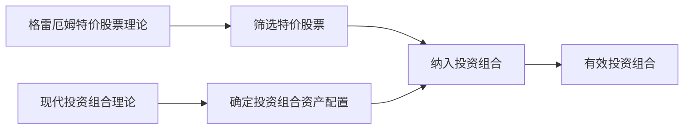

# 格雷厄姆特价股票理论对现代投资组合理论的补充

> 关键词：格雷厄姆特价股票理论、现代投资组合理论、价值投资、风险分散、投资补充

> 摘要：本文旨在深入探讨格雷厄姆特价股票理论对现代投资组合理论的补充作用。首先介绍了两种理论的背景，明确目的、预期读者和文档结构。接着阐述核心概念与联系，通过文本示意图和 Mermaid 流程图展示二者关系。详细讲解核心算法原理与操作步骤，用 Python 代码阐述相关逻辑。引入数学模型和公式并举例说明。结合项目实战给出代码案例及解读。分析实际应用场景，推荐学习资源、开发工具框架和相关论文著作。最后总结未来发展趋势与挑战，提供常见问题解答和扩展阅读参考资料，全面展现格雷厄姆特价股票理论在现代投资组合理论体系中的重要补充价值。

## 1. 背景介绍 
### 1.1 目的和范围
本研究的主要目的是全面剖析格雷厄姆特价股票理论对现代投资组合理论的补充作用。通过对两种理论的深入研究，揭示它们在投资决策中的相互关系和协同效应，为投资者提供更全面、更科学的投资思路和方法。范围涵盖了两种理论的核心概念、算法原理、数学模型、实际应用等多个方面，旨在从理论到实践的各个层面探讨二者的关联和补充价值。

### 1.2 预期读者
本文预期读者主要包括专业投资者、金融从业者、投资学相关专业的学生以及对投资理论和实践感兴趣的广大爱好者。对于专业投资者和金融从业者，本文提供了深入思考和优化投资策略的理论依据；对于学生而言，有助于其系统学习和理解投资领域的重要理论；对于普通爱好者，能帮助他们提升投资知识和决策能力。

### 1.3 文档结构概述
本文首先介绍研究的背景信息，包括目的、预期读者和文档结构。接着阐述格雷厄姆特价股票理论和现代投资组合理论的核心概念与联系，通过示意图和流程图展示其关系。然后详细讲解两种理论的核心算法原理和具体操作步骤，结合 Python 代码进行说明。引入数学模型和公式并举例解释。通过项目实战给出代码案例和解读。分析实际应用场景，推荐相关的学习资源、开发工具框架和论文著作。最后总结未来发展趋势与挑战，提供常见问题解答和扩展阅读参考资料。

### 1.4 术语表
#### 1.4.1 核心术语定义
- **格雷厄姆特价股票理论**：由本杰明·格雷厄姆（Benjamin Graham）提出的一种价值投资理论，强调寻找价格低于其内在价值的股票，即所谓的“特价股票”，通过分析公司的财务报表和基本面，评估股票的内在价值，以获取长期投资收益。
- **现代投资组合理论**：由哈里·马科维茨（Harry Markowitz）提出，该理论认为投资者可以通过分散投资来降低非系统性风险，通过构建有效的投资组合，在给定风险水平下实现预期收益最大化，或在给定预期收益水平下实现风险最小化。

#### 1.4.2 相关概念解释
- **内在价值**：指股票所代表的公司的真实价值，是基于公司的资产、盈利、现金流等基本面因素评估得出的价值。内在价值是格雷厄姆特价股票理论的核心概念，投资者通过寻找价格低于内在价值的股票来获取投资机会。
- **非系统性风险**：也称为可分散风险，是指由个别公司或行业的特定因素引起的风险，如公司的管理问题、行业竞争、技术变革等。现代投资组合理论认为，通过分散投资于不同的资产，可以降低非系统性风险。
- **有效投资组合**：在现代投资组合理论中，有效投资组合是指在给定风险水平下具有最高预期收益，或在给定预期收益水平下具有最低风险的投资组合。投资者可以通过优化投资组合的资产配置来实现有效投资组合。

#### 1.4.3 缩略词列表
- **CAPM**：资本资产定价模型（Capital Asset Pricing Model），是现代投资组合理论的重要延伸，用于描述资产的预期收益率与市场风险之间的关系。
- **ETF**：交易型开放式指数基金（Exchange - Traded Fund），是一种在证券交易所上市交易的开放式基金，通常跟踪特定的指数，具有分散投资、交易成本低等特点。

## 2. 核心概念与联系 

### 格雷厄姆特价股票理论核心概念
格雷厄姆特价股票理论的核心在于寻找被市场低估的股票。其基本原理是通过对公司的财务报表进行深入分析，计算公司的内在价值。例如，格雷厄姆提出了一种简单的内在价值计算公式：$V = EPS\times(8.5 + 2g)$，其中 $V$ 表示内在价值，$EPS$ 是每股收益，$g$ 是预期的长期增长率。投资者通过比较股票的市场价格和内在价值，如果市场价格低于内在价值，那么该股票就被认为是“特价股票”，具有投资价值。

### 现代投资组合理论核心概念
现代投资组合理论的核心是风险分散和有效投资组合的构建。该理论认为，投资者面临的风险可以分为系统性风险和非系统性风险。非系统性风险可以通过分散投资来降低，而系统性风险则无法通过分散投资消除。投资者通过选择不同的资产进行组合，利用资产之间的相关性来优化投资组合的风险 - 收益特征。马科维茨提出了均值 - 方差模型，通过计算投资组合的预期收益率和方差（风险的度量），来确定有效投资组合的边界。

### 两者的联系
格雷厄姆特价股票理论和现代投资组合理论并不是相互独立的，而是可以相互补充的。格雷厄姆特价股票理论侧重于选择具有投资价值的单个股票，而现代投资组合理论侧重于通过分散投资来降低风险和优化投资组合。将格雷厄姆的价值投资理念融入现代投资组合理论中，可以在构建投资组合时选择具有内在价值的股票，从而提高投资组合的质量。例如，在构建投资组合时，可以首先根据格雷厄姆的方法筛选出一批被低估的股票，然后再根据现代投资组合理论的原则进行资产配置，以实现风险和收益的平衡。

### 文本示意图
```plaintext
格雷厄姆特价股票理论 ---> 筛选具有内在价值的股票
                          ↓
现代投资组合理论 ---> 构建包含特价股票的有效投资组合
```

### Mermaid 流程图


## 3. 核心算法原理 & 具体操作步骤 

### 格雷厄姆特价股票理论算法原理及 Python 实现
#### 算法原理
格雷厄姆特价股票理论的核心算法是计算股票的内在价值并与市场价格进行比较。主要步骤包括：
1. 获取公司的财务数据，如每股收益（EPS）、预期增长率（g）等。
2. 根据格雷厄姆的内在价值计算公式 $V = EPS\times(8.5 + 2g)$ 计算内在价值。
3. 比较内在价值 $V$ 和市场价格 $P$，如果 $P < V$，则认为该股票是特价股票。

#### Python 代码实现
```python
def calculate_intrinsic_value(eps, growth_rate):
    """
    计算股票的内在价值
    :param eps: 每股收益
    :param growth_rate: 预期增长率
    :return: 内在价值
    """
    return eps * (8.5 + 2 * growth_rate)

def is_bargain_stock(eps, growth_rate, market_price):
    """
    判断股票是否为特价股票
    :param eps: 每股收益
    :param growth_rate: 预期增长率
    :param market_price: 市场价格
    :return: True 或 False
    """
    intrinsic_value = calculate_intrinsic_value(eps, growth_rate)
    return market_price < intrinsic_value

# 示例数据
eps = 2.0
growth_rate = 0.1
market_price = 20.0

if is_bargain_stock(eps, growth_rate, market_price):
    print("该股票是特价股票")
else:
    print("该股票不是特价股票")
```

### 现代投资组合理论算法原理及 Python 实现
#### 算法原理
现代投资组合理论的核心算法是均值 - 方差模型，用于确定有效投资组合的边界。主要步骤包括：
1. 获取资产的历史收益率数据。
2. 计算资产的预期收益率和协方差矩阵。
3. 设定投资组合的预期收益率目标，通过优化算法求解在该预期收益率下的最小方差投资组合。

#### Python 代码实现
```python
import numpy as np
from scipy.optimize import minimize

def portfolio_return(weights, returns):
    """
    计算投资组合的预期收益率
    :param weights: 资产权重
    :param returns: 资产预期收益率
    :return: 投资组合预期收益率
    """
    return np.dot(weights, returns)

def portfolio_variance(weights, cov_matrix):
    """
    计算投资组合的方差
    :param weights: 资产权重
    :param cov_matrix: 资产协方差矩阵
    :return: 投资组合方差
    """
    return np.dot(weights.T, np.dot(cov_matrix, weights))

def efficient_portfolio(returns, cov_matrix, target_return):
    """
    计算给定预期收益率下的最小方差投资组合
    :param returns: 资产预期收益率
    :param cov_matrix: 资产协方差矩阵
    :param target_return: 目标预期收益率
    :return: 最小方差投资组合的权重
    """
    num_assets = len(returns)
    constraints = ({'type': 'eq', 'fun': lambda x: portfolio_return(x, returns) - target_return},
                   {'type': 'eq', 'fun': lambda x: np.sum(x) - 1})
    bounds = [(0, 1) for _ in range(num_assets)]
    initial_weights = np.ones(num_assets) / num_assets
    result = minimize(portfolio_variance, initial_weights, args=(cov_matrix),
                      method='SLSQP', bounds=bounds, constraints=constraints)
    return result.x

# 示例数据
returns = np.array([0.1, 0.15, 0.2])
cov_matrix = np.array([[0.01, 0.005, 0.003],
                       [0.005, 0.02, 0.006],
                       [0.003, 0.006, 0.03]])
target_return = 0.12

weights = efficient_portfolio(returns, cov_matrix, target_return)
print("最小方差投资组合的权重:", weights)
```

## 4. 数学模型和公式 & 详细讲解 & 举例说明 

### 格雷厄姆特价股票理论数学模型和公式
#### 内在价值计算公式
格雷厄姆提出的内在价值计算公式为：
$$V = EPS\times(8.5 + 2g)$$
其中：
- $V$ 表示股票的内在价值。
- $EPS$ 是每股收益，反映了公司的盈利能力。
- $g$ 是预期的长期增长率，通常通过分析公司的历史业绩、行业发展趋势等因素来估计。

#### 详细讲解
这个公式的基本思想是，股票的内在价值与公司的盈利能力和增长潜力相关。每股收益越高，说明公司的盈利能力越强；预期增长率越高，说明公司的增长潜力越大。系数 8.5 是格雷厄姆根据经验得出的一个常数，2 是对预期增长率的一个调整系数。

#### 举例说明
假设一家公司的每股收益 $EPS = 3$ 元，预期长期增长率 $g = 0.1$（即 10%），则该股票的内在价值为：
$$V = 3\times(8.5 + 2\times0.1)=3\times(8.5 + 0.2)=3\times8.7 = 26.1$$（元）
如果该股票的市场价格为 20 元，由于 $20 < 26.1$，则该股票被认为是特价股票。

### 现代投资组合理论数学模型和公式
#### 投资组合预期收益率公式
投资组合的预期收益率 $E(R_p)$ 计算公式为：
$$E(R_p)=\sum_{i = 1}^{n}w_iE(R_i)$$
其中：
- $E(R_p)$ 是投资组合的预期收益率。
- $w_i$ 是第 $i$ 种资产在投资组合中的权重，且 $\sum_{i = 1}^{n}w_i = 1$。
- $E(R_i)$ 是第 $i$ 种资产的预期收益率。

#### 投资组合方差公式
投资组合的方差 $\sigma_p^2$ 计算公式为：
$$\sigma_p^2=\sum_{i = 1}^{n}\sum_{j = 1}^{n}w_iw_j\sigma_{ij}$$
其中：
- $\sigma_p^2$ 是投资组合的方差，衡量投资组合的风险。
- $\sigma_{ij}$ 是第 $i$ 种资产和第 $j$ 种资产的协方差，反映了两种资产收益率之间的相关性。

#### 详细讲解
投资组合预期收益率公式表明，投资组合的预期收益率是各资产预期收益率的加权平均值，权重为各资产在投资组合中的比例。投资组合方差公式则考虑了资产之间的相关性，通过协方差来衡量。当资产之间的相关性较低时，通过分散投资可以降低投资组合的方差，即降低风险。

#### 举例说明
假设有两种资产 A 和 B，资产 A 的预期收益率 $E(R_A)=0.1$，资产 B 的预期收益率 $E(R_B)=0.15$，资产 A 在投资组合中的权重 $w_A = 0.6$，资产 B 在投资组合中的权重 $w_B = 0.4$，则投资组合的预期收益率为：
$$E(R_p)=0.6\times0.1 + 0.4\times0.15=0.06 + 0.06 = 0.12$$
假设资产 A 和 B 的协方差 $\sigma_{AB}=0.005$，资产 A 的方差 $\sigma_A^2 = 0.01$，资产 B 的方差 $\sigma_B^2 = 0.02$，则投资组合的方差为：
$$\sigma_p^2=0.6^2\times0.01+0.4^2\times0.02 + 2\times0.6\times0.4\times0.005$$
$$=0.0036+0.0032 + 0.0024=0.0092$$

## 5. 项目实战：代码实际案例和详细解释说明 

### 5.1  开发环境搭建
#### 安装 Python
首先，需要安装 Python 环境。可以从 Python 官方网站（https://www.python.org/downloads/） 下载适合自己操作系统的 Python 安装包，按照安装向导进行安装。建议安装 Python 3.7 及以上版本。

#### 安装必要的库
在本项目中，需要使用一些 Python 库，如 `numpy`、`pandas`、`scipy` 等。可以使用 `pip` 命令进行安装：
```sh
pip install numpy pandas scipy
```

### 5.2  源代码详细实现和代码解读
#### 完整代码示例
```python
import numpy as np
import pandas as pd
from scipy.optimize import minimize

# 格雷厄姆特价股票理论部分
def calculate_intrinsic_value(eps, growth_rate):
    """
    计算股票的内在价值
    :param eps: 每股收益
    :param growth_rate: 预期增长率
    :return: 内在价值
    """
    return eps * (8.5 + 2 * growth_rate)

def is_bargain_stock(eps, growth_rate, market_price):
    """
    判断股票是否为特价股票
    :param eps: 每股收益
    :param growth_rate: 预期增长率
    :param market_price: 市场价格
    :return: True 或 False
    """
    intrinsic_value = calculate_intrinsic_value(eps, growth_rate)
    return market_price < intrinsic_value

# 现代投资组合理论部分
def portfolio_return(weights, returns):
    """
    计算投资组合的预期收益率
    :param weights: 资产权重
    :param returns: 资产预期收益率
    :return: 投资组合预期收益率
    """
    return np.dot(weights, returns)

def portfolio_variance(weights, cov_matrix):
    """
    计算投资组合的方差
    :param weights: 资产权重
    :param cov_matrix: 资产协方差矩阵
    :return: 投资组合方差
    """
    return np.dot(weights.T, np.dot(cov_matrix, weights))

def efficient_portfolio(returns, cov_matrix, target_return):
    """
    计算给定预期收益率下的最小方差投资组合
    :param returns: 资产预期收益率
    :param cov_matrix: 资产协方差矩阵
    :param target_return: 目标预期收益率
    :return: 最小方差投资组合的权重
    """
    num_assets = len(returns)
    constraints = ({'type': 'eq', 'fun': lambda x: portfolio_return(x, returns) - target_return},
                   {'type': 'eq', 'fun': lambda x: np.sum(x) - 1})
    bounds = [(0, 1) for _ in range(num_assets)]
    initial_weights = np.ones(num_assets) / num_assets
    result = minimize(portfolio_variance, initial_weights, args=(cov_matrix),
                      method='SLSQP', bounds=bounds, constraints=constraints)
    return result.x

# 示例数据
stocks_data = pd.DataFrame({
    'stock': ['A', 'B', 'C'],
    'eps': [2.0, 3.0, 4.0],
    'growth_rate': [0.1, 0.15, 0.2],
    'market_price': [20.0, 35.0, 45.0]
})

# 筛选特价股票
bargain_stocks = []
for index, row in stocks_data.iterrows():
    if is_bargain_stock(row['eps'], row['growth_rate'], row['market_price']):
        bargain_stocks.append(row['stock'])

print("特价股票:", bargain_stocks)

# 假设筛选出的特价股票的预期收益率和协方差矩阵
returns = np.array([0.1, 0.15, 0.2])
cov_matrix = np.array([[0.01, 0.005, 0.003],
                       [0.005, 0.02, 0.006],
                       [0.003, 0.006, 0.03]])
target_return = 0.12

# 计算有效投资组合的权重
weights = efficient_portfolio(returns, cov_matrix, target_return)
print("最小方差投资组合的权重:", weights)
```

#### 代码解读
1. **格雷厄姆特价股票理论部分**：
    - `calculate_intrinsic_value` 函数根据格雷厄姆的内在价值计算公式计算股票的内在价值。
    - `is_bargain_stock` 函数判断股票是否为特价股票，通过比较内在价值和市场价格。
2. **现代投资组合理论部分**：
    - `portfolio_return` 函数计算投资组合的预期收益率。
    - `portfolio_variance` 函数计算投资组合的方差。
    - `efficient_portfolio` 函数使用 `scipy.optimize.minimize` 函数求解给定预期收益率下的最小方差投资组合的权重。
3. **主程序部分**：
    - 首先定义了一个包含股票信息的 `DataFrame`，包括每股收益、预期增长率和市场价格。
    - 遍历 `DataFrame`，筛选出特价股票。
    - 假设筛选出的特价股票的预期收益率和协方差矩阵，设定目标预期收益率，调用 `efficient_portfolio` 函数计算最小方差投资组合的权重。

### 5.3  代码解读与分析
#### 格雷厄姆特价股票理论代码分析
格雷厄姆特价股票理论的代码实现相对简单，主要是通过计算股票的内在价值并与市场价格进行比较来筛选特价股票。这种方法的优点是简单直观，基于公司的基本面分析，能够找到被市场低估的股票。然而，其局限性在于对预期增长率的估计比较困难，不同的分析师可能会得出不同的结果，而且该公式是一种简化的模型，没有考虑到公司的其他因素，如行业竞争、宏观经济环境等。

#### 现代投资组合理论代码分析
现代投资组合理论的代码实现主要是通过均值 - 方差模型来求解有效投资组合的权重。这种方法的优点是考虑了资产之间的相关性，通过分散投资可以降低非系统性风险。然而，其局限性在于需要大量的历史数据来估计资产的预期收益率和协方差矩阵，而且这些估计值可能存在误差。此外，该模型假设投资者是风险厌恶的，并且市场是有效的，这些假设在现实市场中可能并不完全成立。

## 6. 实际应用场景 
### 个人投资者
对于个人投资者来说，格雷厄姆特价股票理论可以帮助他们筛选出具有投资价值的股票。例如，个人投资者可以通过分析公司的财务报表，使用格雷厄姆的内在价值计算公式来评估股票的价值，选择价格低于内在价值的股票进行投资。同时，现代投资组合理论可以帮助个人投资者构建分散化的投资组合，降低投资风险。个人投资者可以将筛选出的特价股票纳入投资组合中，并根据自己的风险承受能力和预期收益目标，使用均值 - 方差模型来确定各股票的权重。

### 机构投资者
机构投资者，如基金公司、保险公司等，通常管理着大量的资金，需要进行多元化的投资。格雷厄姆特价股票理论可以为机构投资者提供一种价值投资的思路，帮助他们挖掘被市场低估的股票，提高投资组合的收益。现代投资组合理论则可以帮助机构投资者优化投资组合的资产配置，实现风险和收益的平衡。例如，基金公司可以根据格雷厄姆的方法筛选出一批特价股票，然后使用现代投资组合理论的模型来构建投资组合，以满足不同投资者的需求。

### 风险管理
在风险管理方面，格雷厄姆特价股票理论和现代投资组合理论都具有重要的应用价值。格雷厄姆的价值投资理念可以帮助投资者选择具有一定安全边际的股票，降低投资风险。现代投资组合理论则可以通过分散投资来降低非系统性风险，提高投资组合的稳定性。例如，企业在进行投资决策时，可以结合两种理论，选择被低估的股票并构建分散化的投资组合，以降低投资风险，保护企业的资产安全。

## 7. 工具和资源推荐
### 7.1 学习资源推荐
#### 7.1.1 书籍推荐
- 《聪明的投资者》（The Intelligent Investor）：本杰明·格雷厄姆的经典著作，系统阐述了价值投资的理论和方法，是学习格雷厄姆特价股票理论的必读之书。
- 《证券分析》（Security Analysis）：同样是本杰明·格雷厄姆的著作，对证券的价值分析进行了深入探讨，为投资者提供了全面的投资分析工具和方法。
- 《投资组合理论与资本市场》（Portfolio Theory and Capital Markets）：哈里·马科维茨的代表作，详细介绍了现代投资组合理论的原理和应用，是学习现代投资组合理论的重要参考书籍。

#### 7.1.2 在线课程
- Coursera 平台上的“投资学原理”课程：该课程由知名大学的教授授课，系统讲解投资学的基本原理和方法，包括格雷厄姆特价股票理论和现代投资组合理论。
- edX 平台上的“金融市场与投资”课程：提供了丰富的金融市场和投资知识，对现代投资组合理论的讲解深入浅出，适合初学者和有一定基础的学习者。

#### 7.1.3 技术博客和网站
- Seeking Alpha：一个专业的金融投资博客网站，提供了大量的股票分析和投资策略文章，包括对格雷厄姆特价股票理论和现代投资组合理论的应用案例分析。
- Investopedia：一个权威的金融投资知识网站，对各种投资理论和概念进行了详细的解释和说明，是学习投资知识的重要资源。

### 7.2 开发工具框架推荐
#### 7.2.1 IDE和编辑器
- PyCharm：一款专业的 Python 集成开发环境，提供了丰富的代码编辑、调试和分析功能，适合开发投资相关的 Python 程序。
- Jupyter Notebook：一个交互式的开发环境，支持 Python 代码的编写、运行和可视化，非常适合进行数据探索和模型验证。

#### 7.2.2 调试和性能分析工具
- pdb：Python 自带的调试工具，可以帮助开发者定位代码中的问题。
- cProfile：Python 标准库中的性能分析工具，可以分析代码的运行时间和函数调用次数，帮助优化代码性能。

#### 7.2.3 相关框架和库
- numpy：一个强大的 Python 科学计算库，提供了高效的数组操作和数学函数，在投资组合理论的计算中非常有用。
- pandas：一个用于数据处理和分析的 Python 库，可以方便地处理和分析股票数据。
- scipy：一个包含各种科学计算算法的 Python 库，在优化问题求解中可以使用其优化算法来计算有效投资组合的权重。

### 7.3 相关论文著作推荐
#### 7.3.1 经典论文
- Markowitz, H. M. (1952). Portfolio Selection. The Journal of Finance, 7(1), 77 - 91. 这是哈里·马科维茨提出现代投资组合理论的经典论文，奠定了现代投资组合理论的基础。
- Graham, B., & Dodd, D. L. (1934). Security Analysis. McGraw - Hill. 本杰明·格雷厄姆和戴维·多德的著作，是价值投资领域的经典之作，对格雷厄姆特价股票理论进行了系统阐述。

#### 7.3.2 最新研究成果
- 近年来，随着金融市场的发展和技术的进步，关于格雷厄姆特价股票理论和现代投资组合理论的研究也在不断深入。一些学者提出了改进的价值投资模型和投资组合优化算法，以提高投资决策的准确性和效率。可以通过学术数据库，如 Web of Science、EBSCOhost 等，查找相关的最新研究成果。

#### 7.3.3 应用案例分析
- 许多金融机构和研究机构会发布关于投资组合管理和价值投资的应用案例分析报告。例如，晨星公司（Morningstar）会对不同的投资组合进行评估和分析，提供相关的案例研究。这些案例分析可以帮助投资者更好地理解和应用格雷厄姆特价股票理论和现代投资组合理论。

## 8. 总结：未来发展趋势与挑战
### 未来发展趋势
#### 技术融合
随着人工智能、大数据等技术的发展，格雷厄姆特价股票理论和现代投资组合理论将与这些技术深度融合。例如，利用人工智能算法可以更准确地估计股票的内在价值和预期收益率，利用大数据可以获取更全面的市场信息和公司基本面数据，从而提高投资决策的准确性和效率。

#### 个性化投资
未来的投资将更加注重个性化，投资者的需求和风险偏好将得到更充分的考虑。格雷厄姆特价股票理论和现代投资组合理论将结合投资者的个人情况，为投资者提供更加个性化的投资策略和投资组合方案。

#### 全球投资
随着全球经济一体化的发展，投资者将有更多的机会进行全球投资。格雷厄姆特价股票理论和现代投资组合理论将在全球范围内得到更广泛的应用，投资者可以通过分散投资于不同国家和地区的资产，降低投资风险，提高投资收益。

### 挑战
#### 数据质量和可靠性
在应用格雷厄姆特价股票理论和现代投资组合理论时，需要大量的财务数据和市场数据。然而，数据的质量和可靠性可能存在问题，如数据不准确、不完整等。这些问题可能会影响投资决策的准确性，需要投资者和研究人员采取有效的措施来提高数据质量。

#### 市场不确定性
金融市场具有高度的不确定性，股票价格受到多种因素的影响，如宏观经济环境、政策变化、公司业绩等。格雷厄姆特价股票理论和现代投资组合理论都是基于一定的假设和模型，在市场不确定性增加的情况下，这些模型的有效性可能会受到挑战。

#### 投资者行为偏差
投资者的行为往往受到情绪、认知偏差等因素的影响，可能会做出非理性的投资决策。例如，投资者可能会过度自信、追涨杀跌等。这些行为偏差可能会影响格雷厄姆特价股票理论和现代投资组合理论的应用效果，需要投资者提高自身的投资素养，克服行为偏差。

## 9. 附录：常见问题与解答
### 1. 格雷厄姆特价股票理论中的预期增长率如何估计？
预期增长率的估计是一个比较复杂的问题，没有一种绝对准确的方法。可以通过分析公司的历史业绩，了解公司过去的增长情况，并结合行业的发展趋势、宏观经济环境等因素来进行预测。也可以参考分析师的研究报告，但需要注意不同分析师的观点可能存在差异。

### 2. 现代投资组合理论中的协方差矩阵如何计算？
协方差矩阵可以通过资产的历史收益率数据来计算。首先，计算每种资产的收益率序列，然后使用统计方法计算资产之间的协方差。在 Python 中，可以使用 `numpy` 库的 `cov` 函数来计算协方差矩阵。

### 3. 如何确定投资组合的目标预期收益率？
投资组合的目标预期收益率需要根据投资者的风险承受能力、投资目标和投资期限等因素来确定。一般来说，风险承受能力较高的投资者可以设定较高的目标预期收益率，而风险承受能力较低的投资者则应设定较低的目标预期收益率。同时，还需要考虑投资期限的长短，长期投资可以适当承担较高的风险，以追求更高的收益。

### 4. 格雷厄姆特价股票理论和现代投资组合理论是否适用于所有市场？
格雷厄姆特价股票理论和现代投资组合理论是基于一定的市场假设和理论基础提出的，虽然具有一定的普遍性，但并不是适用于所有市场。在不同的市场环境下，如新兴市场和成熟市场，市场的有效性、投资者结构等因素可能会有所不同，需要对理论进行适当的调整和应用。

## 10. 扩展阅读 & 参考资料
### 扩展阅读
- 《金融炼金术》（The Alchemy of Finance）：乔治·索罗斯（George Soros）的著作，介绍了他的反身性理论和投资哲学，对投资者的思维方式和投资决策具有重要的启发作用。
- 《漫步华尔街》（A Random Walk Down Wall Street）：伯顿·马尔基尔（Burton Malkiel）的著作，探讨了股票市场的随机性和有效性，以及投资者如何在市场中进行投资。

### 参考资料
- Graham, B. (1949). The Intelligent Investor. HarperBusiness.
- Markowitz, H. M. (1959). Portfolio Selection: Efficient Diversification of Investments. Yale University Press.
- Bodie, Z., Kane, A., & Marcus, A. J. (2018). Investments. McGraw - Hill Education.