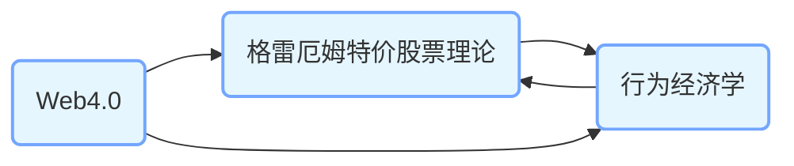

# 格雷厄姆特价股票理论对行为经济学的Web4.0补充

> 关键词：格雷厄姆特价股票理论、行为经济学、Web4.0、市场行为、投资决策

> 摘要：本文深入探讨了格雷厄姆特价股票理论对行为经济学在Web4.0时代的补充作用。首先介绍了相关的背景知识，包括研究的目的和范围、预期读者等。接着阐述了核心概念，分析了它们之间的联系，并通过流程图进行展示。详细讲解了核心算法原理，结合Python代码进行说明。给出了相关的数学模型和公式，并举例解释。通过项目实战，展示了代码实现和分析。探讨了该理论在实际中的应用场景，推荐了相关的学习资源、开发工具和论文著作。最后总结了未来发展趋势与挑战，解答了常见问题并提供了参考资料，旨在全面揭示格雷厄姆特价股票理论在行为经济学Web4.0发展中的重要价值。

## 1. 背景介绍 
### 1.1 目的和范围
在当今快速发展的金融和科技领域，行为经济学作为研究投资者心理和行为对市场影响的学科，越来越受到关注。而Web4.0的兴起，带来了全新的信息传播和交互模式，对传统的金融市场和行为经济学研究产生了深远影响。格雷厄姆特价股票理论作为价值投资的经典理论，在新的时代背景下，其与行为经济学和Web4.0的结合具有重要的研究意义。

本研究的目的在于探讨格雷厄姆特价股票理论如何对行为经济学在Web4.0时代进行补充，分析其在新环境下的应用和发展。研究范围涵盖了格雷厄姆特价股票理论的核心内容、行为经济学的基本原理、Web4.0的特点和影响，以及三者之间的相互关系和作用机制。

### 1.2 预期读者
本文预期读者包括金融领域的投资者、研究人员，行为经济学的学者和爱好者，以及对Web4.0技术和金融科技发展感兴趣的专业人士。对于投资者来说，了解格雷厄姆特价股票理论在Web4.0时代的应用可以帮助他们做出更明智的投资决策；对于研究人员和学者，本文提供了一个新的研究视角和思路，有助于推动相关领域的学术研究；对于对金融科技感兴趣的人士，本文可以让他们了解到金融与科技融合的最新动态和趋势。

### 1.3 文档结构概述
本文将按照以下结构进行阐述：首先介绍相关的背景知识，包括研究的目的、范围、预期读者和文档结构概述。接着深入探讨核心概念，分析它们之间的联系，并通过流程图进行清晰展示。然后详细讲解核心算法原理，结合Python代码进行说明，使读者能够更好地理解和应用。给出相关的数学模型和公式，并举例解释，增强理论的科学性和严谨性。通过项目实战，展示代码实现和分析，让读者能够将理论应用到实际中。探讨该理论在实际中的应用场景，为读者提供更多的实践参考。推荐相关的学习资源、开发工具和论文著作，方便读者进一步深入学习。最后总结未来发展趋势与挑战，解答常见问题并提供参考资料，使文章内容更加完整和实用。

### 1.4 术语表
#### 1.4.1 核心术语定义
- **格雷厄姆特价股票理论**：由本杰明·格雷厄姆提出的一种价值投资理论，该理论认为股票存在内在价值，当股票价格低于其内在价值时，就被认为是特价股票，具有投资价值。
- **行为经济学**：是一门将心理学与经济学相结合的学科，研究投资者的心理和行为对金融市场的影响，以及这些影响如何导致市场的非有效现象。
- **Web4.0**：是互联网发展的下一代阶段，强调人工智能、大数据、区块链等技术的深度融合，实现更加智能、个性化、去中心化的信息交互和服务模式。

#### 1.4.2 相关概念解释
- **价值投资**：是一种基于公司内在价值进行投资的策略，投资者通过分析公司的财务状况、经营业绩等因素，寻找被市场低估的股票进行投资。
- **市场非有效**：指市场价格不能完全反映所有可用信息，导致股票价格偏离其内在价值的现象。行为经济学认为，投资者的心理和行为偏差是导致市场非有效的重要原因。
- **信息交互**：指在互联网环境下，用户之间、用户与系统之间进行信息传递和交流的过程。Web4.0时代的信息交互更加智能、高效和个性化。

#### 1.4.3 缩略词列表
- **AI**：Artificial Intelligence，人工智能
- **Big Data**：大数据
- **Blockchain**：区块链

## 2. 核心概念与联系 

### 格雷厄姆特价股票理论原理
格雷厄姆特价股票理论的核心在于寻找被市场低估的股票。其基本原理是，股票具有内在价值，而市场价格会受到各种因素的影响而波动。当市场价格低于股票的内在价值时，就形成了特价股票。内在价值的计算通常基于公司的财务报表、资产状况、盈利能力等因素。例如，格雷厄姆提出了一些简单的估值方法，如市盈率法、市净率法等。通过对这些指标的分析，可以大致估算出股票的内在价值。

### 行为经济学原理
行为经济学认为，投资者并非完全理性的经济人，他们的决策会受到心理和行为因素的影响。例如，投资者可能存在过度自信、损失厌恶、羊群效应等心理偏差。这些偏差会导致投资者在决策时出现错误，从而影响市场价格的形成。行为经济学通过研究这些心理和行为偏差，揭示了市场非有效的原因，并为投资者提供了一些应对策略。

### Web4.0特点
Web4.0是互联网发展的新阶段，具有以下特点：
- **人工智能应用**：利用人工智能技术实现智能搜索、智能推荐、智能客服等功能，提高信息获取和处理的效率。
- **大数据分析**：通过对海量数据的收集、存储和分析，挖掘用户的行为模式和偏好，为个性化服务提供支持。
- **区块链技术**：利用区块链的去中心化、不可篡改等特性，实现更加安全、可信的信息交互和价值传递。

### 三者之间的联系
格雷厄姆特价股票理论为行为经济学提供了一种投资策略的基础。在行为经济学所揭示的市场非有效环境下，格雷厄姆的方法可以帮助投资者寻找被低估的股票。而Web4.0的发展则为格雷厄姆特价股票理论和行为经济学的研究和应用提供了新的技术手段和数据支持。例如，通过大数据分析可以获取更多关于公司和市场的信息，帮助投资者更准确地计算股票的内在价值；人工智能技术可以对投资者的行为进行分析和预测，进一步揭示行为偏差对市场的影响。

### 文本示意图
格雷厄姆特价股票理论处于核心位置，行为经济学围绕其展开，分析投资者行为对该理论应用的影响。Web4.0作为外部环境，为格雷厄姆特价股票理论和行为经济学提供技术和数据支持，形成一个相互关联的整体。

### Mermaid流程图


## 3. 核心算法原理 & 具体操作步骤 

### 格雷厄姆特价股票筛选算法原理
格雷厄姆特价股票筛选的核心思想是通过计算股票的内在价值，并与市场价格进行比较，找出价格低于内在价值的股票。以下是一个简化的基于市盈率和市净率的筛选算法：

1. **数据收集**：收集公司的财务数据，包括每股收益（EPS）、每股净资产（BVPS）等。
2. **计算内在价值**：
    - **市盈率法**：假设合理的市盈率为 $P/E_{合理}$，则股票的内在价值 $V_{PE} = EPS \times P/E_{合理}$。
    - **市净率法**：假设合理的市净率为 $P/B_{合理}$，则股票的内在价值 $V_{PB} = BVPS \times P/B_{合理}$。
3. **综合评估**：取 $V_{PE}$ 和 $V_{PB}$ 的平均值作为股票的最终内在价值 $V$。
4. **筛选特价股票**：比较股票的市场价格 $P$ 和内在价值 $V$，如果 $P < V$，则认为该股票是特价股票。

### Python源代码实现
```python
import pandas as pd

# 定义合理的市盈率和市净率
PE_REASONABLE = 15
PB_REASONABLE = 1.5

def calculate_intrinsic_value(eps, bvps):
    """
    计算股票的内在价值
    :param eps: 每股收益
    :param bvps: 每股净资产
    :return: 内在价值
    """
    v_pe = eps * PE_REASONABLE
    v_pb = bvps * PB_REASONABLE
    return (v_pe + v_pb) / 2

def screen_bargain_stocks(data):
    """
    筛选特价股票
    :param data: 包含每股收益、每股净资产和市场价格的DataFrame
    :return: 特价股票的DataFrame
    """
    data['intrinsic_value'] = data.apply(lambda row: calculate_intrinsic_value(row['eps'], row['bvps']), axis=1)
    bargain_stocks = data[data['price'] < data['intrinsic_value']]
    return bargain_stocks

# 示例数据
data = {
    'stock_code': ['000001', '000002', '000003'],
    'eps': [1.0, 2.0, 0.5],
    'bvps': [5.0, 10.0, 3.0],
    'price': [10.0, 30.0, 2.0]
}
df = pd.DataFrame(data)

# 筛选特价股票
bargain_stocks = screen_bargain_stocks(df)
print(bargain_stocks)
```

### 具体操作步骤
1. **数据准备**：收集公司的财务数据，包括每股收益、每股净资产和市场价格等，并将其整理成DataFrame格式。
2. **定义合理的市盈率和市净率**：根据市场情况和行业特点，确定合理的市盈率和市净率值。
3. **计算内在价值**：调用 `calculate_intrinsic_value` 函数，计算每只股票的内在价值。
4. **筛选特价股票**：调用 `screen_bargain_stocks` 函数，筛选出价格低于内在价值的股票。
5. **结果分析**：对筛选出的特价股票进行进一步的分析和研究，评估其投资价值。

## 4. 数学模型和公式 & 详细讲解 & 举例说明 

### 市盈率法计算内在价值
市盈率（P/E）是指股票价格与每股收益的比值，反映了投资者为获取每股收益所愿意支付的价格。市盈率法计算内在价值的公式为：
$$V_{PE} = EPS \times P/E_{合理}$$
其中，$V_{PE}$ 表示基于市盈率法计算的内在价值，$EPS$ 表示每股收益，$P/E_{合理}$ 表示合理的市盈率。

例如，某公司的每股收益为 $2$ 元，假设合理的市盈率为 $15$，则该公司股票的内在价值为：
$$V_{PE} = 2 \times 15 = 30 \text{ 元}$$

### 市净率法计算内在价值
市净率（P/B）是指股票价格与每股净资产的比值，反映了股票价格相对于每股净资产的溢价程度。市净率法计算内在价值的公式为：
$$V_{PB} = BVPS \times P/B_{合理}$$
其中，$V_{PB}$ 表示基于市净率法计算的内在价值，$BVPS$ 表示每股净资产，$P/B_{合理}$ 表示合理的市净率。

例如，某公司的每股净资产为 $5$ 元，假设合理的市净率为 $1.5$，则该公司股票的内在价值为：
$$V_{PB} = 5 \times 1.5 = 7.5 \text{ 元}$$

### 综合评估内在价值
为了更准确地评估股票的内在价值，我们取市盈率法和市净率法计算结果的平均值作为最终的内在价值：
$$V = \frac{V_{PE} + V_{PB}}{2}$$

例如，某公司的每股收益为 $1$ 元，每股净资产为 $3$ 元，合理的市盈率为 $15$，合理的市净率为 $1.5$，则：
$$V_{PE} = 1 \times 15 = 15 \text{ 元}$$
$$V_{PB} = 3 \times 1.5 = 4.5 \text{ 元}$$
$$V = \frac{15 + 4.5}{2} = 9.75 \text{ 元}$$

### 筛选特价股票
比较股票的市场价格 $P$ 和内在价值 $V$，如果 $P < V$，则认为该股票是特价股票。例如，某股票的市场价格为 $8$ 元，内在价值为 $9.75$ 元，由于 $8 < 9.75$，所以该股票是特价股票。

## 5. 项目实战：代码实际案例和详细解释说明 

### 5.1  开发环境搭建
1. **安装Python**：从Python官方网站（https://www.python.org/downloads/）下载并安装Python 3.x版本。
2. **安装必要的库**：使用pip命令安装 `pandas` 库，用于数据处理和分析。
```sh
pip install pandas
```
3. **选择开发工具**：可以选择使用PyCharm、Jupyter Notebook等开发工具。

### 5.2  源代码详细实现和代码解读
```python
import pandas as pd

# 定义合理的市盈率和市净率
PE_REASONABLE = 15
PB_REASONABLE = 1.5

def calculate_intrinsic_value(eps, bvps):
    """
    计算股票的内在价值
    :param eps: 每股收益
    :param bvps: 每股净资产
    :return: 内在价值
    """
    v_pe = eps * PE_REASONABLE
    v_pb = bvps * PB_REASONABLE
    return (v_pe + v_pb) / 2

def screen_bargain_stocks(data):
    """
    筛选特价股票
    :param data: 包含每股收益、每股净资产和市场价格的DataFrame
    :return: 特价股票的DataFrame
    """
    data['intrinsic_value'] = data.apply(lambda row: calculate_intrinsic_value(row['eps'], row['bvps']), axis=1)
    bargain_stocks = data[data['price'] < data['intrinsic_value']]
    return bargain_stocks

# 示例数据
data = {
    'stock_code': ['000001', '000002', '000003'],
    'eps': [1.0, 2.0, 0.5],
    'bvps': [5.0, 10.0, 3.0],
    'price': [10.0, 30.0, 2.0]
}
df = pd.DataFrame(data)

# 筛选特价股票
bargain_stocks = screen_bargain_stocks(df)
print(bargain_stocks)
```

### 代码解读与分析
1. **导入必要的库**：`import pandas as pd` 导入 `pandas` 库，用于数据处理和分析。
2. **定义合理的市盈率和市净率**：`PE_REASONABLE = 15` 和 `PB_REASONABLE = 1.5` 定义了合理的市盈率和市净率值。
3. **定义计算内在价值的函数**：`calculate_intrinsic_value` 函数接受每股收益和每股净资产作为参数，根据市盈率法和市净率法计算内在价值，并返回平均值。
4. **定义筛选特价股票的函数**：`screen_bargain_stocks` 函数接受包含每股收益、每股净资产和市场价格的DataFrame作为参数，调用 `calculate_intrinsic_value` 函数计算每只股票的内在价值，并筛选出价格低于内在价值的股票。
5. **示例数据**：创建一个包含股票代码、每股收益、每股净资产和市场价格的DataFrame。
6. **筛选特价股票**：调用 `screen_bargain_stocks` 函数筛选特价股票，并打印结果。

通过这个项目实战，我们可以看到如何使用Python代码实现格雷厄姆特价股票的筛选，以及如何对代码进行解读和分析。

## 6. 实际应用场景 
### 投资决策
投资者可以利用格雷厄姆特价股票理论和行为经济学的知识，结合Web4.0提供的大数据和人工智能技术，筛选出被市场低估的股票进行投资。通过分析投资者的行为偏差，避免受到市场情绪的影响，做出更加理性的投资决策。

### 风险管理
在投资过程中，投资者可以根据格雷厄姆特价股票理论评估股票的内在价值，设置合理的止损和止盈点，降低投资风险。同时，行为经济学可以帮助投资者认识到自己的心理偏差，避免因过度自信或损失厌恶等因素导致的决策失误。

### 金融研究
研究人员可以利用Web4.0提供的海量数据，对格雷厄姆特价股票理论和行为经济学进行实证研究，验证理论的有效性和适用性。通过分析不同市场环境下投资者的行为模式和市场价格的变化，深入理解市场的运行机制。

### 金融教育
在金融教育领域，格雷厄姆特价股票理论和行为经济学可以作为重要的教学内容，帮助学生了解价值投资的理念和方法，认识到投资者心理和行为对市场的影响。通过案例分析和模拟交易等方式，提高学生的投资分析能力和决策水平。

## 7. 工具和资源推荐
### 7.1 学习资源推荐
#### 7.1.1 书籍推荐
- 《聪明的投资者》（本杰明·格雷厄姆著）：格雷厄姆的经典著作，系统阐述了价值投资的理论和方法。
- 《思考，快与慢》（丹尼尔·卡尼曼著）：行为经济学领域的经典著作，介绍了人类思维的两种模式以及它们对决策的影响。
- 《金融心理学》（拉斯·特维德著）：从心理学的角度分析金融市场的运行机制和投资者的行为模式。

#### 7.1.2 在线课程
- Coursera上的“Behavioral Finance”：由知名教授授课，系统介绍行为金融学的理论和应用。
- edX上的“Investment Management with Python and Machine Learning”：结合Python和机器学习技术，介绍投资管理的方法和实践。

#### 7.1.3 技术博客和网站
- 雪球网：提供股票市场的资讯、分析和交流平台，有很多投资者分享自己的投资经验和见解。
- 金融界：提供金融市场的新闻、数据和分析，是了解金融市场动态的重要渠道。

### 7.2 开发工具框架推荐
#### 7.2.1 IDE和编辑器
- PyCharm：一款专业的Python集成开发环境，提供代码编辑、调试、版本控制等功能。
- Jupyter Notebook：一个交互式的开发环境，适合进行数据探索和分析，支持Python、R等多种编程语言。

#### 7.2.2 调试和性能分析工具
- pdb：Python自带的调试工具，可以帮助开发者定位和解决代码中的问题。
- cProfile：Python的性能分析工具，可以分析代码的执行时间和资源占用情况。

#### 7.2.3 相关框架和库
- pandas：用于数据处理和分析的Python库，提供了丰富的数据结构和数据操作方法。
- numpy：用于科学计算的Python库，提供了高效的数组操作和数学函数。

### 7.3 相关论文著作推荐
#### 7.3.1 经典论文
- “The Capital Asset Pricing Model: Theory and Evidence”（Eugene F. Fama, Kenneth R. French著）：经典的资本资产定价模型论文，对金融市场的定价理论产生了深远影响。
- “Behavioral Finance: A Survey”（Nicholas Barberis, Richard Thaler著）：行为金融学领域的综述论文，系统介绍了行为金融学的理论和研究成果。

#### 7.3.2 最新研究成果
- 关注顶级金融学术期刊，如《Journal of Finance》《Review of Financial Studies》等，了解行为经济学和价值投资领域的最新研究动态。

#### 7.3.3 应用案例分析
- 一些金融研究机构和咨询公司会发布关于价值投资和行为经济学的应用案例分析报告，可以通过网络搜索获取相关资料。

## 8. 总结：未来发展趋势与挑战
### 未来发展趋势
1. **技术融合加深**：随着Web4.0技术的不断发展，人工智能、大数据、区块链等技术将与格雷厄姆特价股票理论和行为经济学更加深度融合。例如，利用人工智能技术可以实现更精准的股票估值和投资者行为预测；区块链技术可以提高金融市场的透明度和可信度。
2. **个性化投资服务**：根据投资者的风险偏好、投资目标和行为模式，提供个性化的投资建议和服务。通过对投资者行为数据的分析，了解投资者的需求和心理特征，为其量身定制投资策略。
3. **跨学科研究增多**：行为经济学与金融学、心理学、计算机科学等学科的交叉研究将越来越多。跨学科的研究方法和视角将有助于更深入地理解金融市场的运行机制和投资者的行为模式。

### 挑战
1. **数据质量和安全问题**：Web4.0时代的数据量巨大，但数据质量参差不齐。如何保证数据的准确性、完整性和及时性是一个挑战。同时，数据安全和隐私保护也是需要关注的重要问题。
2. **模型的有效性和适应性**：随着市场环境的变化，格雷厄姆特价股票理论和行为经济学模型的有效性和适应性可能会受到影响。需要不断对模型进行优化和改进，以适应新的市场情况。
3. **投资者教育和培训**：投资者对行为经济学和价值投资理念的理解和接受程度还需要提高。需要加强投资者教育和培训，提高投资者的投资素养和风险意识。

## 9. 附录：常见问题与解答
### 1. 格雷厄姆特价股票理论在不同市场环境下的适用性如何？
格雷厄姆特价股票理论的基本原理在不同市场环境下都有一定的适用性，但具体的估值方法和筛选标准可能需要根据市场情况进行调整。在新兴市场，由于市场的有效性相对较低，可能存在更多被低估的股票，但同时也伴随着更高的风险。在成熟市场，市场的有效性较高，寻找特价股票的难度可能会增加。

### 2. 行为经济学如何帮助投资者避免决策失误？
行为经济学通过揭示投资者的心理偏差，如过度自信、损失厌恶、羊群效应等，帮助投资者认识到自己在决策过程中可能存在的问题。投资者可以通过学习行为经济学的知识，采取相应的措施来避免这些偏差的影响，例如制定合理的投资计划、控制情绪、避免盲目跟风等。

### 3. Web4.0技术对金融市场有哪些具体影响？
Web4.0技术对金融市场的影响主要体现在以下几个方面：一是提高信息传递的效率和透明度，投资者可以更及时地获取市场信息；二是实现个性化的金融服务，根据投资者的需求和偏好提供定制化的投资建议；三是推动金融创新，如区块链技术的应用可以改变金融交易的模式和流程。

### 4. 如何确定合理的市盈率和市净率？
合理的市盈率和市净率需要根据行业特点、市场环境和公司的发展阶段等因素来确定。一般来说，可以参考同行业的平均水平，结合公司的盈利能力、成长潜力等因素进行综合判断。同时，也可以参考历史数据和市场预期，对合理的市盈率和市净率进行调整。

## 10. 扩展阅读 & 参考资料
### 扩展阅读
- 《非理性繁荣》（罗伯特·希勒著）：探讨了金融市场中的泡沫现象和投资者的非理性行为。
- 《黑天鹅》（纳西姆·尼古拉斯·塔勒布著）：介绍了不可预测的重大事件对金融市场的影响。

### 参考资料
- 本杰明·格雷厄姆. 《聪明的投资者》. 人民邮电出版社.
- 丹尼尔·卡尼曼. 《思考，快与慢》. 中信出版社.
- 拉斯·特维德. 《金融心理学》. 机械工业出版社.
- 相关学术期刊和研究报告，如《Journal of Finance》《Review of Financial Studies》等。