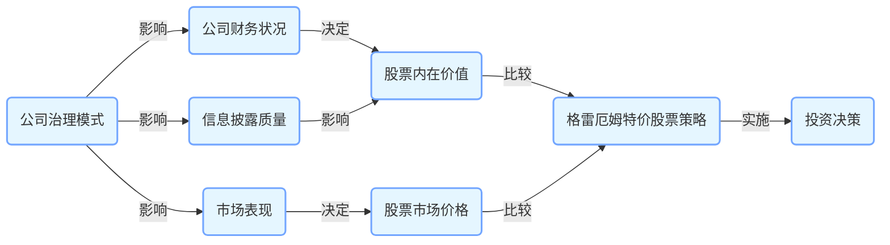

# 格雷厄姆特价股票策略在不同公司治理模式下的效果

> 关键词：格雷厄姆特价股票策略、公司治理模式、投资效果、财务分析、市场效率

> 摘要：本文旨在深入探讨格雷厄姆特价股票策略在不同公司治理模式下的应用效果。首先介绍了研究的背景、目的、预期读者和文档结构，对相关术语进行了明确界定。接着阐述了格雷厄姆特价股票策略及公司治理模式的核心概念与联系，并通过Mermaid流程图展示其关系。详细讲解了核心算法原理和具体操作步骤，结合数学模型和公式进行分析并举例说明。通过项目实战给出代码实际案例和详细解释，探讨了该策略在不同公司治理模式下的实际应用场景。推荐了相关的学习资源、开发工具框架和论文著作。最后总结了未来发展趋势与挑战，提供常见问题解答和扩展阅读参考资料，全面剖析格雷厄姆特价股票策略在不同公司治理模式下的综合效果，为投资者和相关研究人员提供有价值的参考。

## 1. 背景介绍 
### 1.1 目的和范围
本研究的主要目的是系统地分析格雷厄姆特价股票策略在不同公司治理模式下的效果。通过对不同公司治理模式的分类和研究，结合格雷厄姆特价股票策略的原理和实践，探究该策略在各种治理环境中的适用性、有效性和潜在风险。研究范围涵盖了多种常见的公司治理模式，包括但不限于家族式治理模式、股权分散式治理模式、内部人控制式治理模式等，以及在全球不同资本市场中应用格雷厄姆特价股票策略的情况。旨在为投资者提供更全面、深入的投资决策依据，同时也为公司治理模式的优化和改进提供理论支持。

### 1.2 预期读者
本文预期读者包括金融投资者、证券分析师、公司治理研究学者、企业管理人员以及对金融投资和公司治理领域感兴趣的相关人员。对于投资者而言，希望通过本文能够更好地理解格雷厄姆特价股票策略在不同公司治理环境下的表现，从而优化投资组合，提高投资收益；证券分析师可以借鉴本文的研究方法和结论，为客户提供更准确的投资建议；公司治理研究学者可以从本文中获取新的研究视角和思路，推动公司治理理论的发展；企业管理人员可以了解不同治理模式对公司股票价值的影响，进而优化公司治理结构；而对该领域感兴趣的相关人员则可以通过本文初步了解格雷厄姆特价股票策略和公司治理模式的相关知识。

### 1.3 文档结构概述
本文将按照以下结构展开：首先介绍背景信息，包括目的、预期读者和文档结构概述，并对相关术语进行定义和解释。接着阐述格雷厄姆特价股票策略和公司治理模式的核心概念及其相互联系，通过流程图进行直观展示。然后详细讲解核心算法原理和具体操作步骤，结合数学模型和公式进行深入分析，并举例说明。通过项目实战部分给出代码实际案例和详细解释，分析代码实现和运行效果。探讨该策略在不同公司治理模式下的实际应用场景。推荐相关的学习资源、开发工具框架和论文著作。最后总结未来发展趋势与挑战，提供常见问题解答和扩展阅读参考资料，使读者能够全面、深入地了解格雷厄姆特价股票策略在不同公司治理模式下的效果。

### 1.4 术语表
#### 1.4.1 核心术语定义
- **格雷厄姆特价股票策略**：由投资大师本杰明·格雷厄姆提出的一种价值投资策略，该策略主要关注股票的内在价值，通过对公司财务报表等基本面信息的分析，寻找价格低于其内在价值的股票进行投资，以获取长期稳定的投资回报。
- **公司治理模式**：指公司的所有者、董事会、管理层和其他利益相关者之间的权力分配、制衡和决策机制的制度安排。不同的公司治理模式会影响公司的决策效率、信息披露质量、财务状况和市场表现等方面。
- **内在价值**：指股票所代表的公司的真实价值，通常通过对公司的资产、盈利能力、现金流等因素进行综合评估得出。内在价值是格雷厄姆特价股票策略的核心概念之一，投资者通过比较股票的市场价格和内在价值来判断股票是否被低估。

#### 1.4.2 相关概念解释
- **价值投资**：一种基于公司基本面分析的投资理念，强调寻找被市场低估的股票，通过长期持有来分享公司成长带来的收益。格雷厄姆特价股票策略是价值投资的重要代表之一。
- **财务分析**：对公司的财务报表进行分析，包括资产负债表、利润表、现金流量表等，以评估公司的财务状况、盈利能力、偿债能力和运营效率等方面的情况。财务分析是格雷厄姆特价股票策略中评估股票内在价值的重要手段。
- **信息不对称**：指在市场交易中，交易双方掌握的信息存在差异。在公司治理中，信息不对称可能导致管理层的机会主义行为，影响公司的决策和市场表现，进而影响格雷厄姆特价股票策略的实施效果。

#### 1.4.3 缩略词列表
- **P/E**：市盈率（Price - Earnings Ratio），指股票价格与每股收益的比率，是衡量股票估值的常用指标之一。
- **P/B**：市净率（Price - Book Ratio），指股票价格与每股净资产的比率，用于评估股票的相对价值。
- **ROE**：净资产收益率（Return on Equity），指公司净利润与股东权益的比率，反映了公司运用自有资本的效率。

## 2. 核心概念与联系 

### 格雷厄姆特价股票策略原理
格雷厄姆特价股票策略的核心思想是寻找被市场低估的股票，即股票的市场价格低于其内在价值。其基本原理基于以下几点：
1. **基本面分析**：通过对公司的财务报表进行深入分析，了解公司的资产、负债、收入、利润等基本情况，评估公司的真实价值。
2. **安全边际**：格雷厄姆强调在投资时要留有足够的安全边际，即股票的市场价格要显著低于其内在价值，以降低投资风险。
3. **长期投资**：该策略主张长期持有被低估的股票，等待市场发现其真实价值，从而实现投资收益。

### 公司治理模式分类及特点
常见的公司治理模式主要有以下几种：
1. **家族式治理模式**：家族在公司中拥有绝对的控制权，决策通常由家族成员主导。这种模式的优点是决策效率高，家族对公司的忠诚度高；缺点是可能存在任人唯亲、缺乏有效的监督机制等问题。
2. **股权分散式治理模式**：公司的股权较为分散，股东之间的权力相对平衡。这种模式的优点是能够充分发挥市场机制的作用，提高公司的决策透明度；缺点是可能导致股东之间的协调成本较高，容易出现“搭便车”现象。
3. **内部人控制式治理模式**：公司的管理层在公司决策中拥有较大的权力，股东对管理层的监督相对较弱。这种模式的优点是管理层能够迅速做出决策，适应市场变化；缺点是可能存在管理层为了自身利益而损害股东利益的情况。

### 核心概念联系的文本示意图
格雷厄姆特价股票策略与公司治理模式之间存在着密切的联系。公司治理模式会影响公司的财务状况、信息披露质量和市场表现，进而影响股票的内在价值和市场价格。例如，在家族式治理模式下，由于家族对公司的绝对控制，可能存在信息不透明的问题，导致投资者难以准确评估公司的内在价值；而在股权分散式治理模式下，由于股东之间的权力平衡，公司的决策相对透明，信息披露质量较高，投资者更容易准确评估股票的价值。因此，不同的公司治理模式会对格雷厄姆特价股票策略的实施效果产生不同的影响。

### Mermaid 流程图


## 3. 核心算法原理 & 具体操作步骤 

### 核心算法原理
格雷厄姆特价股票策略的核心算法主要是计算股票的内在价值，并与市场价格进行比较。常用的计算内在价值的方法有以下几种：

#### 基于盈利的估值方法
一种简单的基于盈利的估值方法是使用市盈率（P/E）倍数。假设公司的预期每股收益为 $EPS$，行业平均市盈率为 $P/E_{avg}$，则股票的内在价值 $V$ 可以通过以下公式计算：
$V = EPS \times P/E_{avg}$

#### 基于资产的估值方法
基于资产的估值方法主要是计算公司的净资产价值。假设公司的总资产为 $A$，总负债为 $L$，发行在外的股票数量为 $N$，则每股净资产 $BV$ 为：
$BV=\frac{A - L}{N}$

股票的内在价值可以通过每股净资产乘以一个适当的倍数来估算，例如市净率（P/B）倍数。假设行业平均市净率为 $P/B_{avg}$，则股票的内在价值 $V$ 为：
$V = BV \times P/B_{avg}$

### 具体操作步骤

#### 步骤 1：数据收集
收集公司的财务报表数据，包括资产负债表、利润表和现金流量表等。同时，收集行业相关数据，如行业平均市盈率、市净率等。

#### 步骤 2：财务分析
对收集到的财务报表数据进行分析，计算公司的关键财务指标，如每股收益、每股净资产、净资产收益率等。

#### 步骤 3：内在价值计算
根据上述介绍的估值方法，计算股票的内在价值。

#### 步骤 4：比较分析
将计算得到的股票内在价值与市场价格进行比较。如果市场价格低于内在价值，且存在足够的安全边际，则认为该股票是被低估的，可以考虑投资。

#### 步骤 5：投资决策
综合考虑其他因素，如公司的发展前景、行业趋势、宏观经济环境等，做出最终的投资决策。

### Python 源代码实现
```python
import pandas as pd

# 步骤 1：数据收集（假设数据已经存储在 CSV 文件中）
def collect_data(file_path):
    data = pd.read_csv(file_path)
    return data

# 步骤 2：财务分析
def financial_analysis(data):
    # 计算每股收益（EPS）
    data['EPS'] = data['Net Income'] / data['Shares Outstanding']
    # 计算每股净资产（BV）
    data['BV'] = (data['Total Assets'] - data['Total Liabilities']) / data['Shares Outstanding']
    return data

# 步骤 3：内在价值计算
def calculate_intrinsic_value(data, pe_avg, pb_avg):
    # 基于盈利的估值方法
    data['Intrinsic Value (PE)'] = data['EPS'] * pe_avg
    # 基于资产的估值方法
    data['Intrinsic Value (PB)'] = data['BV'] * pb_avg
    return data

# 步骤 4：比较分析
def comparison_analysis(data):
    data['Undervalued (PE)'] = data['Intrinsic Value (PE)'] > data['Market Price']
    data['Undervalued (PB)'] = data['Intrinsic Value (PB)'] > data['Market Price']
    return data

# 步骤 5：投资决策（简单示例，仅考虑基于 PE 的估值）
def investment_decision(data):
    undervalued_stocks = data[data['Undervalued (PE)']]
    return undervalued_stocks

# 主函数
def main():
    file_path = 'financial_data.csv'
    pe_avg = 15  # 假设行业平均市盈率为 15
    pb_avg = 2   # 假设行业平均市净率为 2
    
    data = collect_data(file_path)
    data = financial_analysis(data)
    data = calculate_intrinsic_value(data, pe_avg, pb_avg)
    data = comparison_analysis(data)
    undervalued_stocks = investment_decision(data)
    
    print("Undervalued stocks:")
    print(undervalued_stocks)

if __name__ == "__main__":
    main()
```

## 4. 数学模型和公式 & 详细讲解 & 举例说明 

### 基于盈利的估值模型
#### 公式
如前面所述，基于盈利的估值模型使用市盈率（P/E）倍数来计算股票的内在价值：
$V = EPS \times P/E_{avg}$
其中，$V$ 表示股票的内在价值，$EPS$ 表示公司的预期每股收益，$P/E_{avg}$ 表示行业平均市盈率。

#### 详细讲解
该公式的基本原理是，市场通常会根据公司的盈利能力来对股票进行定价。行业平均市盈率反映了市场对整个行业的盈利预期和估值水平。通过将公司的预期每股收益乘以行业平均市盈率，可以得到一个大致的股票内在价值。如果股票的市场价格低于这个内在价值，则认为该股票可能被低估。

#### 举例说明
假设某公司的预期每股收益为 $2$ 元，行业平均市盈率为 $15$。则根据上述公式，该股票的内在价值为：
$V = 2 \times 15 = 30$（元）
如果该股票的市场价格为 $25$ 元，低于内在价值 $30$ 元，则从基于盈利的估值模型来看，该股票可能被低估。

### 基于资产的估值模型
#### 公式
基于资产的估值模型使用市净率（P/B）倍数来计算股票的内在价值：
$V = BV \times P/B_{avg}$
其中，$V$ 表示股票的内在价值，$BV$ 表示每股净资产，$P/B_{avg}$ 表示行业平均市净率。

#### 详细讲解
该公式的基本原理是，公司的净资产是公司的实际价值基础。行业平均市净率反映了市场对整个行业净资产的估值水平。通过将每股净资产乘以行业平均市净率，可以得到一个基于资产的股票内在价值。如果股票的市场价格低于这个内在价值，则认为该股票可能被低估。

#### 举例说明
假设某公司的每股净资产为 $10$ 元，行业平均市净率为 $2$。则根据上述公式，该股票的内在价值为：
$V = 10 \times 2 = 20$（元）
如果该股票的市场价格为 $15$ 元，低于内在价值 $20$ 元，则从基于资产的估值模型来看，该股票可能被低估。

### 综合估值模型
在实际应用中，为了更准确地评估股票的内在价值，可以综合使用基于盈利和基于资产的估值方法。一种简单的综合估值方法是取两种方法计算得到的内在价值的平均值：
$V_{avg}=\frac{V_{PE}+V_{PB}}{2}$
其中，$V_{avg}$ 表示综合内在价值，$V_{PE}$ 表示基于盈利的估值方法计算得到的内在价值，$V_{PB}$ 表示基于资产的估值方法计算得到的内在价值。

#### 举例说明
假设某公司通过基于盈利的估值方法计算得到的内在价值为 $30$ 元，通过基于资产的估值方法计算得到的内在价值为 $20$ 元。则综合内在价值为：
$V_{avg}=\frac{30 + 20}{2}=25$（元）
如果该股票的市场价格为 $22$ 元，低于综合内在价值 $25$ 元，则从综合估值模型来看，该股票可能被低估。

## 5. 项目实战：代码实际案例和详细解释说明 

### 5.1  开发环境搭建
#### 安装 Python
首先，需要安装 Python 编程语言。可以从 Python 官方网站（https://www.python.org/downloads/）下载适合自己操作系统的 Python 安装包，并按照安装向导进行安装。建议安装 Python 3.x 版本。

#### 安装依赖库
本项目需要使用 `pandas` 库进行数据处理。可以使用以下命令来安装 `pandas` 库：
```sh
pip install pandas
```

#### 准备数据文件
将公司的财务数据存储在一个 CSV 文件中，文件中应包含以下列：`Net Income`（净利润）、`Shares Outstanding`（发行在外的股票数量）、`Total Assets`（总资产）、`Total Liabilities`（总负债）和 `Market Price`（市场价格）。

### 5.2  源代码详细实现和代码解读
```python
import pandas as pd

# 步骤 1：数据收集（假设数据已经存储在 CSV 文件中）
def collect_data(file_path):
    data = pd.read_csv(file_path)
    return data

# 步骤 2：财务分析
def financial_analysis(data):
    # 计算每股收益（EPS）
    data['EPS'] = data['Net Income'] / data['Shares Outstanding']
    # 计算每股净资产（BV）
    data['BV'] = (data['Total Assets'] - data['Total Liabilities']) / data['Shares Outstanding']
    return data

# 步骤 3：内在价值计算
def calculate_intrinsic_value(data, pe_avg, pb_avg):
    # 基于盈利的估值方法
    data['Intrinsic Value (PE)'] = data['EPS'] * pe_avg
    # 基于资产的估值方法
    data['Intrinsic Value (PB)'] = data['BV'] * pb_avg
    return data

# 步骤 4：比较分析
def comparison_analysis(data):
    data['Undervalued (PE)'] = data['Intrinsic Value (PE)'] > data['Market Price']
    data['Undervalued (PB)'] = data['Intrinsic Value (PB)'] > data['Market Price']
    return data

# 步骤 5：投资决策（简单示例，仅考虑基于 PE 的估值）
def investment_decision(data):
    undervalued_stocks = data[data['Undervalued (PE)']]
    return undervalued_stocks

# 主函数
def main():
    file_path = 'financial_data.csv'
    pe_avg = 15  # 假设行业平均市盈率为 15
    pb_avg = 2   # 假设行业平均市净率为 2
    
    data = collect_data(file_path)
    data = financial_analysis(data)
    data = calculate_intrinsic_value(data, pe_avg, pb_avg)
    data = comparison_analysis(data)
    undervalued_stocks = investment_decision(data)
    
    print("Undervalued stocks:")
    print(undervalued_stocks)

if __name__ == "__main__":
    main()
```

#### 代码解读
1. **数据收集**：`collect_data` 函数使用 `pandas` 库的 `read_csv` 函数从 CSV 文件中读取公司的财务数据。
2. **财务分析**：`financial_analysis` 函数计算每股收益（EPS）和每股净资产（BV），并将结果添加到数据集中。
3. **内在价值计算**：`calculate_intrinsic_value` 函数根据行业平均市盈率和市净率，使用基于盈利和基于资产的估值方法计算股票的内在价值。
4. **比较分析**：`comparison_analysis` 函数比较股票的内在价值和市场价格，判断股票是否被低估。
5. **投资决策**：`investment_decision` 函数筛选出被低估的股票，并返回结果。
6. **主函数**：`main` 函数调用上述各个函数，完成整个流程，并打印出被低估的股票信息。

### 5.3  代码解读与分析
#### 优点
- **简单易懂**：代码结构清晰，每个函数的功能明确，易于理解和维护。
- **可扩展性**：可以根据需要扩展代码，例如添加更多的财务指标计算、使用更复杂的估值方法等。
- **数据驱动**：代码基于数据进行分析和决策，具有一定的客观性和科学性。

#### 局限性
- **数据准确性**：代码的结果依赖于输入数据的准确性。如果数据存在错误或偏差，可能会导致错误的投资决策。
- **估值方法的局限性**：基于盈利和基于资产的估值方法都有一定的局限性，不能完全准确地反映股票的内在价值。
- **行业平均指标的局限性**：使用行业平均市盈率和市净率进行估值，可能无法准确反映个别公司的特点和情况。

## 6. 实际应用场景 

### 家族式治理模式下的应用
在家族式治理模式下，由于家族对公司的绝对控制，公司的信息披露可能不够透明，投资者难以获取准确的财务信息。此时，格雷厄姆特价股票策略的应用可能会面临一定的挑战。投资者需要更加谨慎地进行财务分析，通过多渠道获取信息，以尽可能准确地评估公司的内在价值。例如，可以关注家族的信誉和管理能力，以及公司的历史业绩和市场竞争力等因素。如果能够发现被低估的股票，由于家族对公司的忠诚度较高，公司可能具有较强的稳定性和发展潜力，长期投资可能会获得较好的回报。

### 股权分散式治理模式下的应用
在股权分散式治理模式下，公司的决策相对透明，信息披露质量较高，投资者更容易获取准确的财务信息。格雷厄姆特价股票策略在这种模式下的应用相对较为容易。投资者可以通过公开的财务报表和市场信息，较为准确地计算股票的内在价值，并与市场价格进行比较。由于股权分散，公司的决策受到市场机制的影响较大，如果发现被低估的股票，市场可能会较快地发现其价值，从而实现投资收益。

### 内部人控制式治理模式下的应用
在内部人控制式治理模式下，公司的管理层在决策中拥有较大的权力，可能存在管理层为了自身利益而损害股东利益的情况。此时，投资者需要更加关注公司的治理结构和内部控制机制，以确保公司的财务信息真实可靠。格雷厄姆特价股票策略在这种模式下的应用需要更加谨慎。投资者可以通过分析管理层的行为和决策，以及公司的财务状况和市场表现等因素，判断股票是否被低估。如果能够发现被低估的股票，需要密切关注公司的治理动态，以防范潜在的风险。

## 7. 工具和资源推荐
### 7.1 学习资源推荐
#### 7.1.1 书籍推荐
- 《聪明的投资者》（The Intelligent Investor）：本杰明·格雷厄姆的经典著作，详细阐述了价值投资的理念和方法，是学习格雷厄姆特价股票策略的必读之书。
- 《证券分析》（Security Analysis）：同样是本杰明·格雷厄姆的著作，对证券分析的理论和实践进行了系统的介绍，为投资者提供了深入的财务分析和估值方法。
- 《公司治理理论与实务》：全面介绍了公司治理的相关理论和实践，帮助读者了解不同公司治理模式的特点和影响。

#### 7.1.2 在线课程
- Coursera 上的“投资学原理”课程：由知名高校的教授授课，系统地介绍了投资学的基本原理和方法，包括价值投资策略的应用。
- edX 上的“公司治理与企业战略”课程：深入探讨了公司治理与企业战略之间的关系，帮助学习者理解公司治理模式对企业发展的重要性。

#### 7.1.3 技术博客和网站
- 雪球网：一个专业的投资交流社区，提供了丰富的股票分析和投资策略分享，投资者可以在这里学习到不同的投资理念和方法。
- 东方财富网：提供了全面的金融信息和数据分析工具，投资者可以通过该网站获取公司的财务报表、市场行情等信息，为投资决策提供支持。

### 7.2 开发工具框架推荐
#### 7.2.1 IDE和编辑器
- PyCharm：一款专业的 Python 集成开发环境，提供了丰富的代码编辑、调试和分析功能，适合 Python 开发者使用。
- Visual Studio Code：一款轻量级的代码编辑器，支持多种编程语言，具有丰富的插件生态系统，可以方便地进行 Python 开发。

#### 7.2.2 调试和性能分析工具
- `pdb`：Python 内置的调试器，可以帮助开发者定位代码中的问题和错误。
- `cProfile`：Python 标准库中的性能分析工具，可以帮助开发者分析代码的性能瓶颈，优化代码效率。

#### 7.2.3 相关框架和库
- `pandas`：一个强大的数据处理和分析库，提供了丰富的数据结构和函数，方便开发者进行数据清洗、转换和分析。
- `numpy`：一个用于科学计算的基础库，提供了高效的数组操作和数学函数，为数据分析和建模提供支持。

### 7.3 相关论文著作推荐
#### 7.3.1 经典论文
- “The Theory of Corporate Finance” by Jean Tirole：该论文对公司金融理论进行了系统的阐述，包括公司治理、资本结构等方面的内容，对理解公司治理模式的理论基础具有重要意义。
- “Efficient Capital Markets: A Review of Theory and Empirical Work” by Eugene F. Fama：该论文提出了有效市场假说，对金融市场的效率和投资者行为进行了深入的研究，为投资策略的制定提供了理论支持。

#### 7.3.2 最新研究成果
- 关注《Journal of Financial Economics》、《The Review of Financial Studies》等顶级金融学术期刊，这些期刊上发表的最新研究成果可以帮助读者了解格雷厄姆特价股票策略和公司治理模式的最新研究动态。

#### 7.3.3 应用案例分析
- 一些知名的金融研究机构和咨询公司会发布关于投资策略和公司治理的应用案例分析报告，读者可以通过这些报告了解实际应用中的经验和教训，为自己的投资决策提供参考。

## 8. 总结：未来发展趋势与挑战
### 未来发展趋势
1. **数据驱动的精细化分析**：随着信息技术的不断发展，投资者将能够获取更多、更准确的公司财务数据和市场信息。未来，格雷厄姆特价股票策略将更加注重数据驱动的精细化分析，通过运用大数据、人工智能等技术，提高对股票内在价值的评估准确性。
2. **跨学科融合**：公司治理模式和投资策略的研究将越来越多地涉及到经济学、管理学、法学等多个学科的知识。未来，跨学科融合将成为发展趋势，投资者需要综合运用多学科的方法和工具，来更好地理解和应用格雷厄姆特价股票策略。
3. **国际化发展**：随着全球经济一体化的深入发展，投资者的投资范围将越来越广泛。格雷厄姆特价股票策略将在不同国家和地区的资本市场中得到更广泛的应用，同时也需要考虑不同国家和地区的公司治理模式差异和市场环境特点。

### 挑战
1. **市场有效性的挑战**：有效市场假说认为，市场价格已经反映了所有可用的信息，很难通过基本面分析找到被低估的股票。虽然格雷厄姆特价股票策略在一定程度上可以发现市场的无效性，但随着市场效率的不断提高，该策略的应用难度也在增加。
2. **公司治理模式的复杂性**：不同的公司治理模式具有不同的特点和影响，投资者需要深入了解各种公司治理模式的差异，才能准确评估其对股票价值的影响。然而，公司治理模式的复杂性使得这一任务变得困难，需要投资者具备较高的专业知识和分析能力。
3. **信息不对称的问题**：在市场交易中，信息不对称是一个普遍存在的问题。投资者可能无法获取公司的全部真实信息，这可能导致对股票内在价值的评估出现偏差，从而影响格雷厄姆特价股票策略的实施效果。

## 9. 附录：常见问题与解答
### 问题 1：格雷厄姆特价股票策略适用于所有类型的股票吗？
解答：格雷厄姆特价股票策略主要适用于具有一定规模和稳定性的公司股票。对于一些新兴的、高成长型的公司，由于其未来的盈利和发展具有较大的不确定性，基于历史财务数据的格雷厄姆特价股票策略可能不太适用。

### 问题 2：如何确定行业平均市盈率和市净率？
解答：可以通过金融数据提供商、证券研究机构等渠道获取行业平均市盈率和市净率数据。也可以自己收集同行业公司的财务数据，计算平均值来得到。需要注意的是，不同的统计方法和样本选择可能会导致结果有所差异。

### 问题 3：格雷厄姆特价股票策略的投资周期一般是多久？
解答：格雷厄姆特价股票策略是一种长期投资策略，投资周期一般较长，通常需要数年甚至更长时间。这是因为市场发现股票的内在价值需要一定的时间，投资者需要耐心等待股票价格回归其内在价值。

### 问题 4：在不同公司治理模式下，如何调整格雷厄姆特价股票策略？
解答：在家族式治理模式下，需要更加关注家族的信誉和管理能力，以及公司的信息披露质量；在股权分散式治理模式下，可以更侧重于公开财务信息的分析；在内部人控制式治理模式下，需要重点关注公司的治理结构和内部控制机制，以防范管理层的机会主义行为。

## 10. 扩展阅读 & 参考资料
### 扩展阅读
- 《价值投资实战手册》：进一步介绍了价值投资的实战方法和案例，对格雷厄姆特价股票策略的应用有更深入的探讨。
- 《金融炼金术》：乔治·索罗斯的著作，提出了反身性理论，对投资者理解市场的运行机制和投资策略的制定具有一定的启发作用。

### 参考资料
- 本杰明·格雷厄姆. 《聪明的投资者》[M]. 人民邮电出版社, 2016.
- 尤金·法玛. “Efficient Capital Markets: A Review of Theory and Empirical Work”[J]. The Journal of Finance, 1970.
- 让·梯若尔. 《公司金融理论》[M]. 中国人民大学出版社, 2015.