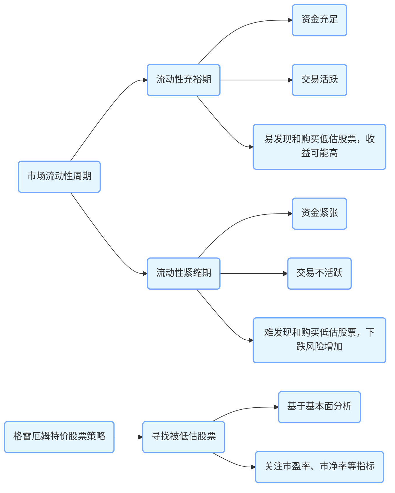

# 格雷厄姆特价股票策略在不同市场流动性周期中的动态调整

> 关键词：格雷厄姆特价股票策略、市场流动性周期、动态调整、价值投资、股票市场

> 摘要：本文深入探讨了格雷厄姆特价股票策略在不同市场流动性周期中的动态调整问题。首先介绍了研究的背景、目的、预期读者等基础信息，阐述了格雷厄姆特价股票策略及市场流动性周期的核心概念与联系。详细讲解了该策略的核心算法原理，通过 Python 代码进行了具体实现。引入数学模型和公式对策略进行量化分析，并举例说明。通过项目实战给出了代码实际案例及详细解释。分析了该策略在不同场景下的实际应用，推荐了相关的学习资源、开发工具和论文著作。最后总结了该策略的未来发展趋势与挑战，解答了常见问题并提供了扩展阅读与参考资料，旨在为投资者在不同市场流动性环境下优化格雷厄姆特价股票策略提供全面且深入的指导。

## 1. 背景介绍 
### 1.1 目的和范围
本研究的主要目的是深入探究格雷厄姆特价股票策略在不同市场流动性周期中的适应性和有效性，并提出合理的动态调整方法。市场流动性的变化会对股票价格、交易成本等产生显著影响，而格雷厄姆特价股票策略作为一种经典的价值投资策略，其在不同流动性环境下的表现值得深入研究。本研究的范围涵盖了不同市场流动性周期的划分、格雷厄姆特价股票策略的原理和应用、以及在不同周期下策略的调整方法等方面。

### 1.2 预期读者
本文预期读者包括对价值投资策略感兴趣的投资者、金融分析师、研究金融市场的学者以及相关专业的学生。对于投资者而言，希望通过本文能够在不同市场流动性环境下更好地运用格雷厄姆特价股票策略，提高投资收益；金融分析师可以将本文的研究成果作为分析市场和制定投资建议的参考；学者和学生则可以从理论和实践的角度深入了解该策略在不同市场条件下的应用和调整。

### 1.3 文档结构概述
本文首先介绍研究的背景信息，包括目的、预期读者和文档结构等。接着阐述格雷厄姆特价股票策略和市场流动性周期的核心概念与联系，通过文本示意图和 Mermaid 流程图进行直观展示。然后详细讲解核心算法原理，并使用 Python 代码进行具体实现。引入数学模型和公式对策略进行量化分析，并举例说明。通过项目实战给出代码实际案例及详细解释。分析该策略在不同场景下的实际应用，推荐相关的学习资源、开发工具和论文著作。最后总结未来发展趋势与挑战，解答常见问题并提供扩展阅读与参考资料。

### 1.4 术语表
#### 1.4.1 核心术语定义
- **格雷厄姆特价股票策略**：由本杰明·格雷厄姆提出的一种价值投资策略，主要通过寻找被市场低估的股票进行投资，通常基于股票的基本面分析，如低市盈率、低市净率等指标来筛选股票。
- **市场流动性周期**：指市场流动性在不同阶段的变化过程，通常包括流动性充裕期、流动性紧缩期等不同阶段，市场流动性的变化会影响股票的交易活跃度和价格波动。
- **动态调整**：指根据市场环境的变化，对投资策略进行相应的调整，以适应不同的市场条件，提高投资策略的有效性和适应性。

#### 1.4.2 相关概念解释
- **价值投资**：一种投资理念，强调通过分析股票的内在价值，寻找被市场低估的股票进行投资，以获取长期的投资回报。
- **市盈率（P/E）**：股票价格与每股收益的比率，反映了投资者为获取每股收益所愿意支付的价格，是衡量股票估值的重要指标之一。
- **市净率（P/B）**：股票价格与每股净资产的比率，反映了股票价格相对于每股净资产的倍数，也是衡量股票估值的重要指标之一。

#### 1.4.3 缩略词列表
- **P/E**：市盈率（Price-to-Earnings Ratio）
- **P/B**：市净率（Price-to-Book Ratio）

## 2. 核心概念与联系 

### 格雷厄姆特价股票策略原理
格雷厄姆特价股票策略的核心思想是寻找那些市场价格低于其内在价值的股票。内在价值是指股票所代表的公司的真实价值，通常通过对公司的财务报表、经营状况等基本面因素进行分析来估算。格雷厄姆认为，市场有时会出现非理性的波动，导致股票价格偏离其内在价值，投资者可以通过深入研究和分析，发现这些被低估的股票，并在价格回归内在价值时获得收益。

### 市场流动性周期
市场流动性是指市场上资产能够以合理价格迅速买卖的能力。市场流动性周期反映了市场流动性在不同阶段的变化情况，通常可以分为以下几个阶段：
- **流动性充裕期**：市场上资金充足，投资者的交易意愿较强，股票的交易活跃度较高，价格波动相对较小。
- **流动性紧缩期**：市场上资金相对紧张，投资者的交易意愿下降，股票的交易活跃度降低，价格波动可能会加大。

### 两者的联系
市场流动性周期会对格雷厄姆特价股票策略的实施产生重要影响。在流动性充裕期，市场上资金充足，投资者更容易发现和购买被低估的股票，同时股票价格的上涨也可能更为迅速，投资收益可能相对较高。而在流动性紧缩期，市场上资金紧张，投资者可能更倾向于持有现金，被低估的股票可能更难被发现和购买，同时股票价格的下跌风险也可能增加。因此，需要根据市场流动性周期的变化对格雷厄姆特价股票策略进行动态调整。

### 文本示意图
```plaintext
市场流动性周期
|-- 流动性充裕期
|   |-- 资金充足
|   |-- 交易活跃
|   |-- 对格雷厄姆策略影响：易发现和购买低估股票，收益可能高
|-- 流动性紧缩期
|   |-- 资金紧张
|   |-- 交易不活跃
|   |-- 对格雷厄姆策略影响：难发现和购买低估股票，下跌风险增加
格雷厄姆特价股票策略
|-- 寻找被低估股票
|   |-- 基于基本面分析
|   |-- 关注市盈率、市净率等指标
```

### Mermaid 流程图


## 3. 核心算法原理 & 具体操作步骤 

### 核心算法原理
格雷厄姆特价股票策略的核心算法主要基于对股票基本面指标的分析，以筛选出被低估的股票。常见的基本面指标包括市盈率（P/E）、市净率（P/B）等。一般来说，低市盈率和低市净率的股票更有可能被低估。

具体步骤如下：
1. **数据收集**：收集股票的财务数据，包括每股收益、每股净资产、股票价格等。
2. **指标计算**：根据收集到的数据计算市盈率和市净率等指标。
3. **筛选股票**：设定市盈率和市净率的阈值，筛选出市盈率和市净率低于阈值的股票。
4. **进一步分析**：对筛选出的股票进行进一步的基本面分析，如公司的盈利能力、偿债能力等，以确定其是否真正被低估。

### Python 代码实现
```python
import pandas as pd

# 模拟股票数据
data = {
    '股票代码': ['000001', '000002', '000003', '000004', '000005'],
    '股票价格': [10, 20, 15, 25, 30],
    '每股收益': [1, 2, 1.5, 2.5, 3],
    '每股净资产': [5, 10, 7.5, 12.5, 15]
}

df = pd.DataFrame(data)

# 计算市盈率和市净率
df['市盈率'] = df['股票价格'] / df['每股收益']
df['市净率'] = df['股票价格'] / df['每股净资产']

# 设定阈值
pe_threshold = 10
pb_threshold = 2

# 筛选股票
selected_stocks = df[(df['市盈率'] < pe_threshold) & (df['市净率'] < pb_threshold)]

print(selected_stocks)
```

### 代码解释
1. **数据收集**：使用 `pandas` 库创建一个包含股票代码、股票价格、每股收益和每股净资产的 DataFrame，模拟股票数据。
2. **指标计算**：通过将股票价格除以每股收益计算市盈率，将股票价格除以每股净资产计算市净率。
3. **筛选股票**：设定市盈率阈值为 10，市净率阈值为 2，使用布尔索引筛选出市盈率和市净率低于阈值的股票。
4. **输出结果**：打印筛选出的股票信息。

## 4. 数学模型和公式 & 详细讲解 & 举例说明 

### 数学模型和公式
- **市盈率（P/E）**：
$$P/E = \frac{股票价格}{每股收益}$$
市盈率反映了投资者为获取每股收益所愿意支付的价格，是衡量股票估值的重要指标之一。一般来说，较低的市盈率意味着股票可能被低估。

- **市净率（P/B）**：
$$P/B = \frac{股票价格}{每股净资产}$$
市净率反映了股票价格相对于每股净资产的倍数，也是衡量股票估值的重要指标之一。较低的市净率意味着股票可能被低估。

### 详细讲解
市盈率和市净率是格雷厄姆特价股票策略中常用的估值指标。市盈率可以帮助投资者判断股票的盈利水平和估值高低，市净率可以帮助投资者判断股票的资产价值和估值高低。在使用这两个指标时，需要结合行业平均水平和公司的基本面情况进行综合分析。

### 举例说明
假设某股票的价格为 20 元，每股收益为 2 元，每股净资产为 10 元。则该股票的市盈率为：
$$P/E = \frac{20}{2} = 10$$
市净率为：
$$P/B = \frac{20}{10} = 2$$
如果该行业的平均市盈率为 15，平均市净率为 2.5，则该股票的市盈率和市净率均低于行业平均水平，可能被低估。

## 5. 项目实战：代码实际案例和详细解释说明 

### 5.1  开发环境搭建
- **Python 安装**：从 Python 官方网站（https://www.python.org/downloads/）下载并安装 Python 3.x 版本。
- **库安装**：使用 `pip` 命令安装所需的库，如 `pandas`、`numpy` 等。
```bash
pip install pandas numpy
```

### 5.2  源代码详细实现和代码解读
```python
import pandas as pd
import numpy as np

# 读取股票数据文件
data = pd.read_csv('stock_data.csv')

# 计算市盈率和市净率
data['市盈率'] = data['股票价格'] / data['每股收益']
data['市净率'] = data['股票价格'] / data['每股净资产']

# 处理缺失值
data = data.dropna(subset=['市盈率', '市净率'])

# 设定阈值
pe_threshold = 12
pb_threshold = 2.5

# 筛选股票
selected_stocks = data[(data['市盈率'] < pe_threshold) & (data['市净率'] < pb_threshold)]

# 进一步分析，计算净资产收益率（ROE）
selected_stocks['净资产收益率'] = selected_stocks['每股收益'] / selected_stocks['每股净资产']

# 筛选出净资产收益率大于 10% 的股票
final_stocks = selected_stocks[selected_stocks['净资产收益率'] > 0.1]

# 输出结果
print(final_stocks)
```

### 5.3  代码解读与分析
1. **数据读取**：使用 `pandas` 库的 `read_csv` 函数读取存储股票数据的 CSV 文件。
2. **指标计算**：计算市盈率和市净率，并使用 `dropna` 函数处理缺失值。
3. **股票筛选**：设定市盈率阈值为 12，市净率阈值为 2.5，筛选出市盈率和市净率低于阈值的股票。
4. **进一步分析**：计算净资产收益率（ROE），并筛选出净资产收益率大于 10% 的股票。
5. **输出结果**：打印最终筛选出的股票信息。

## 6. 实际应用场景 
### 流动性充裕期
在流动性充裕期，市场上资金充足，投资者的交易意愿较强。此时，格雷厄姆特价股票策略可以更有效地实施。投资者可以更容易地发现和购买被低估的股票，同时股票价格的上涨也可能更为迅速。在这种情况下，投资者可以适当增加投资仓位，扩大投资范围，以获取更高的收益。

### 流动性紧缩期
在流动性紧缩期，市场上资金相对紧张，投资者的交易意愿下降。此时，被低估的股票可能更难被发现和购买，同时股票价格的下跌风险也可能增加。在这种情况下，投资者需要更加谨慎地选择股票，降低投资仓位，以控制风险。可以重点关注那些业绩稳定、现金流充足的公司股票，以提高投资的安全性。

### 不同行业
不同行业的市场流动性和估值水平可能存在差异。在应用格雷厄姆特价股票策略时，需要根据行业的特点进行调整。例如，对于一些新兴行业，由于其发展前景较好，市场可能会给予较高的估值，市盈率和市净率的阈值可以适当提高；而对于一些传统行业，由于其增长速度较慢，市场可能会给予较低的估值，市盈率和市净率的阈值可以适当降低。

## 7. 工具和资源推荐
### 7.1 学习资源推荐
#### 7.1.1 书籍推荐
- 《聪明的投资者》（The Intelligent Investor）：本杰明·格雷厄姆的经典著作，详细阐述了价值投资的理念和方法，是学习格雷厄姆特价股票策略的必读之书。
- 《证券分析》（Security Analysis）：同样是本杰明·格雷厄姆的著作，对证券分析的理论和实践进行了深入探讨，为投资者提供了系统的投资分析方法。

#### 7.1.2 在线课程
- Coursera 上的“Financial Markets”：由耶鲁大学教授罗伯特·席勒（Robert Shiller）讲授，介绍了金融市场的基本原理和投资策略，包括价值投资策略。
- edX 上的“Investment Management with Python and Machine Learning”：介绍了如何使用 Python 和机器学习技术进行投资管理，对于深入学习投资策略和数据分析有很大帮助。

#### 7.1.3 技术博客和网站
- 雪球（https://xueqiu.com/）：国内知名的投资交流社区，提供股票、基金等投资产品的信息和分析，投资者可以在上面交流投资经验和心得。
- Seeking Alpha（https://seekingalpha.com/）：国际知名的金融分析网站，提供专业的股票分析和投资建议，对于了解国际金融市场和投资策略有很大帮助。

### 7.2 开发工具框架推荐
#### 7.2.1 IDE和编辑器
- PyCharm：一款专业的 Python 集成开发环境，提供代码编辑、调试、版本控制等功能，适合开发 Python 投资分析程序。
- Jupyter Notebook：一种交互式的开发环境，支持 Python 代码的编写、运行和可视化展示，适合进行数据探索和分析。

#### 7.2.2 调试和性能分析工具
- `pdb`：Python 内置的调试工具，可以帮助开发者调试代码，查找程序中的错误。
- `cProfile`：Python 内置的性能分析工具，可以帮助开发者分析程序的性能瓶颈，优化代码。

#### 7.2.3 相关框架和库
- `pandas`：用于数据处理和分析的 Python 库，提供了高效的数据结构和数据分析工具，适合处理股票数据。
- `numpy`：用于科学计算的 Python 库，提供了高效的数组和矩阵运算功能，适合进行数值计算和数据分析。
- `matplotlib`：用于数据可视化的 Python 库，提供了丰富的绘图功能，适合展示股票数据和分析结果。

### 7.3 相关论文著作推荐
#### 7.3.1 经典论文
- “The Superinvestors of Graham-and-Doddsville”：沃伦·巴菲特（Warren Buffett）的经典论文，介绍了格雷厄姆价值投资策略的成功案例，证明了该策略的有效性。
- “Value Investing: The Use of Historical Financial Statement Information to Separate Winners from Losers”：由约瑟夫·拉科尼肖克（Josef Lakonishok）等人撰写的论文，对价值投资策略进行了深入研究，分析了价值投资策略的收益来源和风险特征。

#### 7.3.2 最新研究成果
- 关注金融领域的顶级学术期刊，如《Journal of Finance》、《Review of Financial Studies》等，这些期刊会发表关于投资策略和金融市场的最新研究成果。

#### 7.3.3 应用案例分析
- 一些金融研究机构和投资公司会发布关于价值投资策略的应用案例分析报告，这些报告可以帮助投资者了解该策略在实际应用中的效果和经验教训。

## 8. 总结：未来发展趋势与挑战
### 未来发展趋势
- **与量化投资的结合**：随着计算机技术和数据分析技术的发展，格雷厄姆特价股票策略可能会与量化投资相结合，通过建立量化模型来筛选股票和进行投资决策，提高投资策略的效率和准确性。
- **跨市场应用**：该策略可能会在不同的金融市场中得到更广泛的应用，包括国际股票市场、债券市场等，以实现资产的多元化配置和风险的分散。
- **考虑更多因素**：未来的研究可能会考虑更多的因素，如宏观经济因素、行业竞争因素等，以更全面地评估股票的内在价值和投资风险。

### 挑战
- **市场有效性的挑战**：随着市场的发展和投资者的成熟，市场的有效性可能会提高，股票价格可能更能反映其内在价值，这可能会增加寻找被低估股票的难度。
- **数据质量和可靠性**：格雷厄姆特价股票策略的实施依赖于准确的财务数据和市场数据，数据质量和可靠性可能会影响策略的有效性。
- **市场环境的变化**：市场环境是不断变化的，如宏观经济政策的调整、行业竞争格局的变化等，这些变化可能会影响股票的估值和投资风险，需要不断调整投资策略以适应市场环境的变化。

## 9. 附录：常见问题与解答
### 问题 1：如何确定市盈率和市净率的阈值？
答：市盈率和市净率的阈值可以根据行业平均水平、市场环境和个人投资目标等因素来确定。一般来说，可以参考同行业其他公司的市盈率和市净率水平，结合市场的整体估值情况，设定一个合理的阈值。同时，也可以根据个人的投资风险偏好和投资目标进行适当调整。

### 问题 2：格雷厄姆特价股票策略是否适用于所有市场？
答：格雷厄姆特价股票策略是一种价值投资策略，其基本原理在不同市场中具有一定的通用性。但不同市场的特点和环境可能存在差异，如市场的有效性、投资者结构、法律法规等，因此在应用该策略时需要根据具体市场情况进行调整。

### 问题 3：如何处理股票数据中的缺失值？
答：处理股票数据中的缺失值可以采用多种方法，如删除包含缺失值的记录、使用均值或中位数填充缺失值、使用插值方法填充缺失值等。具体方法的选择需要根据数据的特点和分析目的来确定。

## 10. 扩展阅读 & 参考资料
### 扩展阅读
- 《巴菲特致股东的信》（Letters to Shareholders of Berkshire Hathaway）：沃伦·巴菲特写给股东的信，分享了他的投资理念和经验，对于深入理解价值投资有很大帮助。
- 《金融炼金术》（The Alchemy of Finance）：乔治·索罗斯（George Soros）的著作，介绍了他的投资哲学和交易策略，对于了解金融市场的运行机制和投资风险有很大启发。

### 参考资料
- 本杰明·格雷厄姆（Benjamin Graham）的相关著作和论文。
- 金融领域的学术期刊和研究报告。
- 相关的金融网站和投资社区的资料。