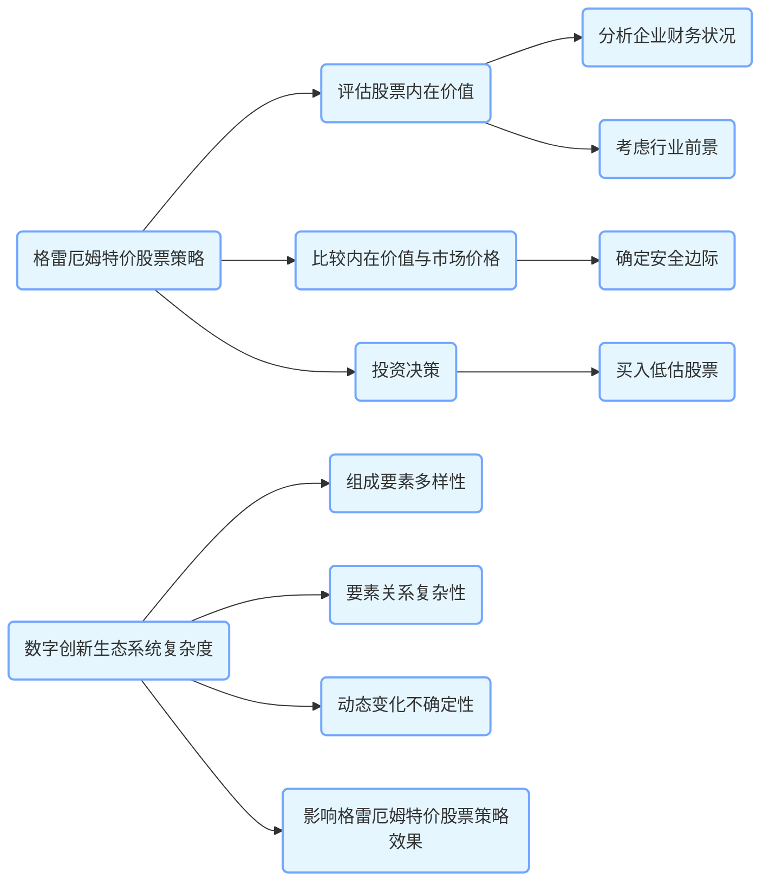

# 格雷厄姆特价股票策略在不同数字创新生态系统复杂度的效果

> 关键词：格雷厄姆特价股票策略、数字创新生态系统、复杂度、投资效果、股票分析

> 摘要：本文聚焦于格雷厄姆特价股票策略在不同数字创新生态系统复杂度下的效果研究。首先介绍了相关背景知识，包括研究的目的、范围、预期读者等内容。接着阐述了核心概念，如格雷厄姆特价股票策略的原理以及数字创新生态系统复杂度的定义与联系，并以示意图和流程图呈现。深入剖析了该策略的核心算法原理，用 Python 代码详细展示操作步骤，同时给出相关数学模型和公式并举例说明。通过项目实战，搭建开发环境，实现源代码并进行解读分析。探讨了该策略的实际应用场景，推荐了相关的学习资源、开发工具框架以及论文著作。最后总结未来发展趋势与挑战，提供常见问题解答和扩展阅读参考资料，旨在全面深入地研究格雷厄姆特价股票策略在不同数字创新生态系统复杂度下的表现，为投资者和相关研究人员提供有价值的参考。

## 1. 背景介绍 
### 1.1 目的和范围
本研究的主要目的在于深入探究格雷厄姆特价股票策略在不同数字创新生态系统复杂度环境下的投资效果。随着数字技术的飞速发展，创新生态系统日益复杂，股票市场也受到了深刻影响。格雷厄姆特价股票策略作为一种经典的价值投资策略，其在新的市场环境下的适用性和有效性值得深入研究。

研究范围涵盖了不同规模和发展阶段的数字创新生态系统，包括新兴的科技初创企业聚集的生态系统、成熟的数字科技产业集群等。通过对不同复杂度的数字创新生态系统中采用格雷厄姆特价股票策略的投资组合进行分析，比较其收益表现、风险水平等指标，以揭示该策略在不同环境下的效果差异。

### 1.2 预期读者
本文预期读者包括金融投资者，尤其是对价值投资策略感兴趣，希望在数字创新领域寻找投资机会的个人和机构投资者；金融分析师，需要深入了解不同市场环境下投资策略的有效性，为客户提供专业的投资建议；学术研究人员，专注于金融市场、投资策略和数字经济领域的研究，希望从理论和实践层面获取新的研究视角和数据支持；以及相关专业的学生，如金融、经济、管理等专业，希望通过本文了解投资策略在实际市场中的应用和效果。

### 1.3 文档结构概述
本文共分为十个部分。第一部分为背景介绍，阐述研究的目的、范围、预期读者和文档结构概述，并给出相关术语表。第二部分介绍核心概念与联系，通过文本示意图和 Mermaid 流程图展示格雷厄姆特价股票策略和数字创新生态系统复杂度的原理和关系。第三部分详细讲解核心算法原理，用 Python 源代码说明具体操作步骤。第四部分给出数学模型和公式，并进行详细讲解和举例说明。第五部分进行项目实战，包括开发环境搭建、源代码实现和代码解读分析。第六部分探讨实际应用场景。第七部分推荐相关的工具和资源，包括学习资源、开发工具框架和论文著作。第八部分总结未来发展趋势与挑战。第九部分为附录，提供常见问题与解答。第十部分列出扩展阅读和参考资料。

### 1.4 术语表
#### 1.4.1 核心术语定义
- **格雷厄姆特价股票策略**：由本杰明·格雷厄姆（Benjamin Graham）提出的一种价值投资策略，主要通过分析股票的内在价值，寻找价格低于其内在价值的股票进行投资，强调股票的安全边际。
- **数字创新生态系统**：由数字技术驱动的，包括创新主体（如科技企业、科研机构等）、创新资源（如资金、人才、技术等）、创新环境（如政策、市场等）相互作用形成的生态系统。
- **复杂度**：在数字创新生态系统中，复杂度指的是系统中组成要素的多样性、要素之间关系的复杂性以及系统动态变化的不确定性程度。

#### 1.4.2 相关概念解释
- **价值投资**：一种基于股票内在价值进行投资的理念，认为股票价格会围绕其内在价值波动，投资者应选择价格低于内在价值的股票，以获取长期投资回报。
- **安全边际**：指股票的市场价格低于其内在价值的幅度，安全边际越大，投资风险越低。
- **数字技术**：包括互联网、大数据、人工智能、区块链等一系列新兴技术，这些技术推动了数字创新生态系统的发展。

#### 1.4.3 缩略词列表
- **AI**：Artificial Intelligence，人工智能
- **BD**：Big Data，大数据
- **VR**：Virtual Reality，虚拟现实
- **AR**：Augmented Reality，增强现实

## 2. 核心概念与联系 

### 格雷厄姆特价股票策略原理
格雷厄姆特价股票策略的核心思想是寻找被市场低估的股票。其基本原理基于对股票内在价值的评估。内在价值是指股票所代表的企业的真实价值，它取决于企业的财务状况、盈利能力、行业前景等因素。

格雷厄姆认为，股票市场存在着非理性的波动，有时股票价格会低于其内在价值。投资者可以通过深入分析企业的基本面，如资产负债表、利润表等，计算出股票的内在价值，并与市场价格进行比较。当市场价格低于内在价值达到一定程度时，即存在安全边际，此时买入股票，等待市场价格回归内在价值，从而获取投资收益。

### 数字创新生态系统复杂度
数字创新生态系统复杂度是一个多维度的概念。从组成要素来看，包括众多不同类型的创新主体，如科技初创企业、大型科技公司、科研机构、风险投资机构等。这些主体具有不同的规模、技术实力和发展阶段。

要素之间的关系也十分复杂。科技企业之间可能存在竞争、合作、并购等多种关系；企业与科研机构之间有产学研合作关系；风险投资机构与企业之间存在投资与被投资关系。

系统的动态变化具有不确定性。数字技术的快速发展使得创新生态系统不断演变，新的技术、商业模式和市场需求不断涌现，这增加了系统的复杂性。

### 核心概念联系
数字创新生态系统复杂度对格雷厄姆特价股票策略的效果产生重要影响。在复杂度较低的数字创新生态系统中，企业的经营状况和发展前景相对容易预测，股票的内在价值也较容易评估。此时，格雷厄姆特价股票策略可能更容易找到被低估的股票，投资效果可能较好。

然而，在复杂度较高的数字创新生态系统中，由于企业面临的不确定性增加，如技术变革迅速、市场竞争激烈、商业模式不断创新等，股票的内在价值评估变得更加困难。这可能导致格雷厄姆特价股票策略难以准确找到被低估的股票，投资效果可能受到影响。

### 文本示意图
```plaintext
格雷厄姆特价股票策略
|
|-- 评估股票内在价值
|   |-- 分析企业财务状况
|   |-- 考虑行业前景
|
|-- 比较内在价值与市场价格
|   |-- 确定安全边际
|
|-- 投资决策
|   |-- 买入低估股票

数字创新生态系统复杂度
|
|-- 组成要素多样性
|   |-- 不同类型创新主体
|
|-- 要素关系复杂性
|   |-- 竞争、合作等关系
|
|-- 动态变化不确定性
|   |-- 技术变革、市场需求变化

两者联系：
数字创新生态系统复杂度 --> 影响 --> 格雷厄姆特价股票策略效果
```

### Mermaid 流程图


## 3. 核心算法原理 & 具体操作步骤 

### 核心算法原理
格雷厄姆特价股票策略的核心算法主要围绕股票内在价值的评估。一种常用的方法是使用格雷厄姆公式：

$$V = \frac{EPS \times (8.5 + 2g) \times 4.4}{Y}$$

其中：
- $V$ 表示股票的内在价值
- $EPS$ 表示每股收益（Earnings Per Share）
- $8.5$ 是格雷厄姆认为的无增长公司的合理市盈率
- $g$ 是预期的长期增长率
- $4.4$ 是格雷厄姆时代的 AAA 级公司债券利率
- $Y$ 是当前的 AAA 级公司债券利率

该公式的基本思想是，股票的内在价值与每股收益和预期增长率成正比，与当前的债券利率成反比。

### 具体操作步骤

#### 步骤 1：数据收集
收集股票的相关数据，包括每股收益（EPS）、预期的长期增长率（$g$）、当前的 AAA 级公司债券利率（$Y$）等。这些数据可以从金融数据提供商、公司财务报表等渠道获取。

#### 步骤 2：计算内在价值
根据格雷厄姆公式计算股票的内在价值。

#### 步骤 3：比较内在价值与市场价格
将计算得到的内在价值与股票的市场价格进行比较。如果市场价格低于内在价值，且安全边际达到一定程度（例如，市场价格低于内在价值的 50%），则认为该股票被低估。

#### 步骤 4：投资决策
根据比较结果，决定是否买入被低估的股票。

### Python 源代码实现
```python
def graham_value(EPS, g, Y):
    # 格雷厄姆公式中的固定参数
    base_pe = 8.5
    bond_rate_reference = 4.4
    # 计算内在价值
    V = (EPS * (base_pe + 2 * g) * bond_rate_reference) / Y
    return V

# 示例数据
EPS = 2.0  # 每股收益
g = 0.1  # 预期的长期增长率
Y = 0.03  # 当前的 AAA 级公司债券利率

# 计算内在价值
intrinsic_value = graham_value(EPS, g, Y)
print(f"股票的内在价值为: {intrinsic_value}")

# 假设市场价格
market_price = 30.0

# 比较内在价值与市场价格
if market_price < intrinsic_value:
    safety_margin = (intrinsic_value - market_price) / intrinsic_value
    if safety_margin > 0.5:
        print("该股票被低估，可以考虑买入。")
    else:
        print("安全边际不足，暂时不考虑买入。")
else:
    print("该股票没有被低估，不考虑买入。")
```

### 代码解释
- `graham_value` 函数实现了格雷厄姆公式的计算，接受每股收益（$EPS$）、预期的长期增长率（$g$）和当前的 AAA 级公司债券利率（$Y$）作为输入，返回股票的内在价值。
- 示例数据中，我们设置了每股收益、预期增长率和债券利率的值，并调用 `graham_value` 函数计算内在价值。
- 然后，我们假设了一个市场价格，并将其与内在价值进行比较。如果市场价格低于内在价值，且安全边际大于 50%，则建议买入该股票；否则，不建议买入。

## 4. 数学模型和公式 & 详细讲解 & 举例说明 

### 数学模型和公式
如前所述，格雷厄姆公式为：

$$V = \frac{EPS \times (8.5 + 2g) \times 4.4}{Y}$$

### 详细讲解
- **每股收益（$EPS$）**：是指公司净利润与发行在外普通股股数的比值，反映了公司的盈利能力。每股收益越高，说明公司的盈利能力越强，股票的内在价值也可能越高。
- **$8.5$**：格雷厄姆认为，对于无增长的公司，合理的市盈率应该是 8.5。市盈率是股票价格与每股收益的比值，反映了市场对公司未来盈利的预期。
- **$2g$**：$g$ 是预期的长期增长率，乘以 2 表示增长率对市盈率的影响。预期增长率越高，股票的市盈率也应该越高，从而内在价值也越高。
- **$4.4$**：是格雷厄姆时代的 AAA 级公司债券利率，作为一个参考利率。债券利率反映了市场的无风险收益率，股票的内在价值应该与债券利率成反比。
- **$Y$**：是当前的 AAA 级公司债券利率，反映了当前市场的无风险收益率水平。

### 举例说明
假设一家公司的每股收益为 $EPS = 3$ 元，预期的长期增长率为 $g = 0.1$（即 10%），当前的 AAA 级公司债券利率为 $Y = 0.04$（即 4%）。

根据格雷厄姆公式计算该股票的内在价值：

$$V = \frac{3 \times (8.5 + 2 \times 0.1) \times 4.4}{0.04}$$

首先计算括号内的值：

$$8.5 + 2 \times 0.1 = 8.5 + 0.2 = 8.7$$

然后计算分子的值：

$$3 \times 8.7 \times 4.4 = 114.84$$

最后计算内在价值：

$$V = \frac{114.84}{0.04} = 2871$$

如果该股票的市场价格为 2000 元，低于内在价值 2871 元，且安全边际为：

$$\text{安全边际} = \frac{2871 - 2000}{2871} \approx 0.303 = 30.3\%$$

如果我们设定的安全边际阈值为 50%，则该股票虽然被低估，但安全边际不足，暂时不考虑买入。

## 5. 项目实战：代码实际案例和详细解释说明 

### 5.1  开发环境搭建
#### 安装 Python
首先，需要安装 Python 开发环境。可以从 Python 官方网站（https://www.python.org/downloads/）下载适合自己操作系统的 Python 安装包，并按照安装向导进行安装。建议安装 Python 3.7 及以上版本。

#### 安装必要的库
为了进行数据收集和分析，需要安装一些必要的 Python 库，如 `pandas`、`numpy`、`yfinance` 等。可以使用 `pip` 命令进行安装：

```sh
pip install pandas numpy yfinance
```

- `pandas`：用于数据处理和分析。
- `numpy`：用于数值计算。
- `yfinance`：用于获取股票市场数据。

### 5.2  源代码详细实现和代码解读
```python
import yfinance as yf
import pandas as pd
import numpy as np

def get_stock_data(ticker):
    """
    获取股票的相关数据
    :param ticker: 股票代码
    :return: 包含每股收益和市场价格的 DataFrame
    """
    stock = yf.Ticker(ticker)
    # 获取每股收益
    eps = stock.info.get('trailingEps', np.nan)
    # 获取市场价格
    market_price = stock.history(period='1d')['Close'].iloc[-1]
    data = pd.DataFrame({'EPS': [eps], 'Market Price': [market_price]})
    return data

def graham_value(EPS, g, Y):
    """
    计算股票的内在价值
    :param EPS: 每股收益
    :param g: 预期的长期增长率
    :param Y: 当前的 AAA 级公司债券利率
    :return: 股票的内在价值
    """
    base_pe = 8.5
    bond_rate_reference = 4.4
    V = (EPS * (base_pe + 2 * g) * bond_rate_reference) / Y
    return V

def evaluate_stock(ticker, g, Y, safety_margin_threshold=0.5):
    """
    评估股票是否被低估
    :param ticker: 股票代码
    :param g: 预期的长期增长率
    :param Y: 当前的 AAA 级公司债券利率
    :param safety_margin_threshold: 安全边际阈值
    :return: 评估结果
    """
    data = get_stock_data(ticker)
    EPS = data['EPS'].iloc[0]
    market_price = data['Market Price'].iloc[0]
    if np.isnan(EPS):
        return "无法获取每股收益数据，无法评估。"
    intrinsic_value = graham_value(EPS, g, Y)
    if market_price < intrinsic_value:
        safety_margin = (intrinsic_value - market_price) / intrinsic_value
        if safety_margin > safety_margin_threshold:
            return "该股票被低估，可以考虑买入。"
        else:
            return "安全边际不足，暂时不考虑买入。"
    else:
        return "该股票没有被低估，不考虑买入。"

# 示例使用
ticker = 'AAPL'  # 苹果公司股票代码
g = 0.1  # 预期的长期增长率
Y = 0.03  # 当前的 AAA 级公司债券利率

result = evaluate_stock(ticker, g, Y)
print(f"股票 {ticker} 的评估结果: {result}")
```

### 5.3  代码解读与分析
- **`get_stock_data` 函数**：使用 `yfinance` 库获取指定股票的每股收益和市场价格，并将其存储在一个 `pandas` 的 `DataFrame` 中返回。
- **`graham_value` 函数**：实现了格雷厄姆公式，根据每股收益、预期增长率和债券利率计算股票的内在价值。
- **`evaluate_stock` 函数**：首先调用 `get_stock_data` 函数获取股票数据，然后计算内在价值，并将其与市场价格进行比较。根据安全边际阈值判断股票是否被低估，并返回评估结果。
- **示例使用**：我们选择了苹果公司的股票代码 `AAPL`，设定预期增长率为 10%，债券利率为 3%，调用 `evaluate_stock` 函数进行评估，并打印评估结果。

## 6. 实际应用场景 
### 个人投资者
对于个人投资者来说，格雷厄姆特价股票策略在不同数字创新生态系统复杂度下有不同的应用方式。在复杂度较低的数字创新生态系统中，个人投资者可以相对容易地运用该策略。例如，在一些专注于某一特定领域的数字创新园区，企业的业务模式相对清晰，财务状况也较容易分析。投资者可以通过研究这些企业的财务报表，运用格雷厄姆公式计算股票的内在价值，寻找被低估的股票进行投资。

在复杂度较高的数字创新生态系统中，个人投资者可以将格雷厄姆特价股票策略作为一种参考。由于市场的不确定性增加，投资者可以结合其他分析方法，如技术分析、行业趋势分析等，综合评估股票的投资价值。同时，投资者还可以关注那些具有创新能力和发展潜力的企业，即使这些企业的当前财务指标可能不符合格雷厄姆策略的严格标准，但从长远来看，它们可能具有较高的投资价值。

### 机构投资者
机构投资者通常具有更丰富的资源和专业的研究团队，他们在不同数字创新生态系统复杂度下运用格雷厄姆特价股票策略的方式也有所不同。在复杂度较低的生态系统中，机构投资者可以进行大规模的数据分析和研究，筛选出符合格雷厄姆策略的股票，并构建投资组合。他们可以利用专业的金融模型和工具，对股票的内在价值进行更精确的评估，以获取更稳定的投资回报。

在复杂度较高的数字创新生态系统中，机构投资者需要更加注重风险管理。他们可以通过分散投资、对冲等方式降低投资风险。同时，机构投资者还可以参与企业的战略投资和并购活动，以获取更多的信息和资源，提高投资决策的准确性。

### 金融分析师
金融分析师在不同数字创新生态系统复杂度下的工作重点也有所不同。在复杂度较低的生态系统中，金融分析师可以运用格雷厄姆特价股票策略对企业进行深入分析，为客户提供投资建议。他们可以通过撰写研究报告，向客户介绍企业的基本面、内在价值和投资机会。

在复杂度较高的数字创新生态系统中，金融分析师需要关注行业的动态变化和技术创新趋势。他们需要不断更新自己的知识和分析方法，以适应市场的变化。金融分析师还可以与企业管理层进行沟通，了解企业的战略规划和发展前景，为客户提供更全面的投资建议。

## 7. 工具和资源推荐
### 7.1 学习资源推荐
#### 7.1.1 书籍推荐
- 《聪明的投资者》（*The Intelligent Investor*）：本杰明·格雷厄姆的经典著作，详细阐述了价值投资的理念和方法，是学习格雷厄姆特价股票策略的必读之书。
- 《证券分析》（*Security Analysis*）：同样是本杰明·格雷厄姆的著作，对证券分析的理论和实践进行了系统的介绍，为投资者提供了深入的分析工具和方法。
- 《数字经济：智领新时代》：介绍了数字经济的发展趋势和创新模式，有助于读者了解数字创新生态系统的特点和规律。

#### 7.1.2 在线课程
- Coursera 平台上的“Financial Markets”课程：由耶鲁大学教授罗伯特·席勒（Robert Shiller）主讲，涵盖了金融市场的基本理论和实践，包括投资策略、风险管理等内容。
- edX 平台上的“Introduction to Financial Accounting”课程：帮助学习者掌握财务会计的基本知识，为分析企业财务报表和评估股票内在价值提供基础。
- 中国大学 MOOC 上的“数字经济概论”课程：介绍了数字经济的概念、发展现状和未来趋势，有助于学习者了解数字创新生态系统的背景知识。

#### 7.1.3 技术博客和网站
- Seeking Alpha：提供股票市场的分析和评论，包括对不同投资策略的讨论和应用案例，是投资者获取市场信息和投资建议的重要来源。
- Bloomberg：全球知名的金融信息服务提供商，提供实时的金融市场数据、新闻和分析，有助于投资者及时了解市场动态。
- 36氪：专注于新经济领域的媒体平台，提供数字创新领域的最新资讯、创业故事和行业分析，帮助读者了解数字创新生态系统的发展趋势。

### 7.2 开发工具框架推荐
#### 7.2.1 IDE和编辑器
- PyCharm：一款专业的 Python 集成开发环境（IDE），提供代码编辑、调试、版本控制等功能，适合开发 Python 投资分析程序。
- Visual Studio Code：一款轻量级的代码编辑器，支持多种编程语言，具有丰富的插件生态系统，可以方便地进行 Python 开发。

#### 7.2.2 调试和性能分析工具
- pdb：Python 内置的调试器，可以帮助开发者在程序运行过程中进行调试，查找问题和错误。
- cProfile：Python 标准库中的性能分析工具，可以分析程序的运行时间和函数调用情况，帮助开发者优化程序性能。

#### 7.2.3 相关框架和库
- pandas：用于数据处理和分析的 Python 库，提供了高效的数据结构和数据分析工具，方便处理股票市场数据。
- numpy：用于数值计算的 Python 库，提供了高性能的数组对象和数学函数，支持大规模数据的计算和处理。
- yfinance：用于获取股票市场数据的 Python 库，可以方便地获取股票的历史数据、财务指标等信息。

### 7.3 相关论文著作推荐
#### 7.3.1 经典论文
- Graham, Benjamin, and David L. Dodd. "Security Analysis." *McGraw-Hill*, 1934. 该论文是价值投资领域的经典之作，奠定了格雷厄姆特价股票策略的理论基础。
- Fama, Eugene F., and Kenneth R. French. "The Cross-Section of Expected Stock Returns." *Journal of Finance*, 1992. 该论文提出了著名的 Fama-French 三因子模型，对股票收益的影响因素进行了深入研究，为投资策略的研究提供了重要的理论支持。

#### 7.3.2 最新研究成果
- 近年来，随着数字技术的发展，一些学者开始研究数字创新生态系统对股票市场和投资策略的影响。相关研究成果可以在《Journal of Financial Economics》、《Review of Financial Studies》等金融领域的顶级期刊上查找。

#### 7.3.3 应用案例分析
- 一些金融机构和研究机构会发布关于投资策略应用案例的研究报告，这些报告可以提供实际应用中的经验和教训。例如，晨星公司（Morningstar）的研究报告对不同投资策略的绩效进行了评估和分析，具有较高的参考价值。

## 8. 总结：未来发展趋势与挑战
### 未来发展趋势
#### 数字创新生态系统的持续发展
随着数字技术的不断进步，数字创新生态系统将继续发展和演变。新的技术、商业模式和市场需求将不断涌现，这将为格雷厄姆特价股票策略的应用带来新的机遇和挑战。例如，人工智能、区块链等技术的应用可能会改变企业的经营模式和财务状况，投资者需要不断更新自己的分析方法和工具，以适应市场的变化。

#### 投资策略的多元化和智能化
未来，投资者可能会将格雷厄姆特价股票策略与其他投资策略相结合，形成多元化的投资组合。同时，随着人工智能和大数据技术的发展，投资策略将更加智能化。投资者可以利用机器学习算法对大量的市场数据进行分析和挖掘，提高投资决策的准确性和效率。

#### 国际市场的融合与互动
随着全球经济一体化的发展，国际金融市场的融合与互动将更加频繁。投资者可以在全球范围内寻找被低估的股票，运用格雷厄姆特价股票策略进行投资。这将扩大投资者的投资视野，提高投资回报的潜力。

### 挑战
#### 数字创新生态系统复杂度的增加
数字创新生态系统的复杂度不断增加，使得股票的内在价值评估变得更加困难。企业面临的不确定性增加，如技术变革迅速、市场竞争激烈、商业模式不断创新等，这些因素都增加了投资决策的难度。投资者需要具备更深入的行业知识和分析能力，才能准确评估股票的投资价值。

#### 数据质量和信息不对称
在数字创新生态系统中，数据质量和信息不对称是一个重要的问题。一些新兴企业的财务数据可能不够透明和准确，投资者难以获取全面的信息。同时，信息传播的速度和方式也在不断变化，投资者需要及时获取和分析信息，以做出正确的投资决策。

#### 监管政策的变化
金融市场的监管政策对投资策略的实施具有重要影响。随着数字创新的发展，监管政策也在不断调整和完善。投资者需要密切关注监管政策的变化，确保自己的投资行为符合法律法规的要求。

## 9. 附录：常见问题与解答
### 问题 1：格雷厄姆公式中的参数如何确定？
- **每股收益（$EPS$）**：可以从公司的财务报表中获取，通常使用过去一年的摊薄每股收益。
- **预期的长期增长率（$g$）**：需要综合考虑公司的历史业绩、行业发展趋势、市场竞争状况等因素进行估算。可以参考分析师的预测报告，但需要注意其准确性和可靠性。
- **当前的 AAA 级公司债券利率（$Y$）**：可以从金融数据提供商或相关网站获取。

### 问题 2：格雷厄姆特价股票策略在数字创新生态系统中是否仍然有效？
格雷厄姆特价股票策略的核心思想是寻找被低估的股票，这一原则在数字创新生态系统中仍然具有一定的有效性。然而，由于数字创新生态系统的复杂度较高，企业的经营状况和发展前景更加难以预测，股票的内在价值评估也更加困难。因此，投资者需要结合其他分析方法，综合评估股票的投资价值。

### 问题 3：如何判断数字创新生态系统的复杂度？
可以从以下几个方面判断数字创新生态系统的复杂度：
- **组成要素的多样性**：包括创新主体的类型、规模和发展阶段的多样性。
- **要素之间关系的复杂性**：如企业之间的竞争、合作、并购等关系的复杂程度。
- **动态变化的不确定性**：如技术变革的速度、市场需求的变化等因素。

### 问题 4：安全边际的阈值应该如何设定？
安全边际的阈值可以根据投资者的风险偏好和投资目标来设定。一般来说，安全边际越大，投资风险越低。格雷厄姆建议安全边际至少为 50%，但在实际应用中，投资者可以根据市场情况和自身情况进行调整。

## 10. 扩展阅读 & 参考资料
### 扩展阅读
- 《创新者的窘境》（*The Innovator's Dilemma*）：克莱顿·克里斯坦森（Clayton M. Christensen）的著作，探讨了创新对企业和市场的影响，有助于读者了解数字创新生态系统的发展规律。
- 《黑天鹅：如何应对不可预知的未来》（*The Black Swan: The Impact of the Highly Improbable*）：纳西姆·尼古拉斯·塔勒布（Nassim Nicholas Taleb）的著作，介绍了不确定性对投资和决策的影响，提醒投资者要关注市场中的黑天鹅事件。

### 参考资料
- 本杰明·格雷厄姆（Benjamin Graham）的相关著作和论文。
- 金融领域的学术期刊，如《Journal of Financial Economics》、《Review of Financial Studies》等。
- 金融数据提供商，如 Bloomberg、Yahoo Finance 等。
- 相关的行业研究报告和分析文章。