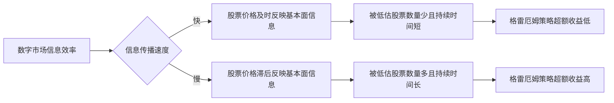

# 格雷厄姆特价股票策略在不同数字市场信息效率下的表现

> 关键词：格雷厄姆特价股票策略、数字市场、信息效率、股票表现、投资策略

> 摘要：本文旨在深入探究格雷厄姆特价股票策略在不同数字市场信息效率下的表现。首先介绍了研究的背景、目的、预期读者等内容，接着阐述了格雷厄姆特价股票策略和数字市场信息效率的核心概念及联系，详细讲解了相关核心算法原理和操作步骤，并通过数学模型和公式进行理论支撑与举例说明。然后通过项目实战，给出代码实际案例并详细解释，分析其在不同信息效率数字市场中的应用场景。还推荐了相关的学习资源、开发工具框架以及论文著作。最后总结了该策略未来的发展趋势与挑战，解答了常见问题并提供了扩展阅读和参考资料，为投资者和研究者全面了解该策略在不同市场环境下的表现提供参考。

## 1. 背景介绍 
### 1.1 目的和范围
在当今数字化的金融市场中，信息传播的速度和效率发生了巨大的变化。格雷厄姆特价股票策略作为一种经典的价值投资策略，其在不同数字市场信息效率下的表现值得深入研究。本研究的目的在于通过理论分析和实证研究，揭示该策略在不同信息效率环境下的收益情况、风险特征等，为投资者在不同市场环境下的决策提供依据。研究范围涵盖了不同类型的数字市场，包括股票市场、数字货币市场等，重点关注信息效率对格雷厄姆特价股票策略实施效果的影响。

### 1.2 预期读者
本文的预期读者主要包括专业投资者、金融分析师、学术研究人员以及对投资策略和数字市场感兴趣的爱好者。专业投资者可以通过本文了解格雷厄姆特价股票策略在不同信息效率市场中的适用性，从而优化自己的投资组合；金融分析师可以借鉴文中的分析方法和结论，为客户提供更准确的投资建议；学术研究人员可以在本文的基础上进行更深入的理论研究；投资爱好者则可以通过本文学习到经典投资策略与数字市场的结合应用。

### 1.3 文档结构概述
本文将按照以下结构展开：首先介绍相关的背景信息，包括研究目的、预期读者等；接着阐述格雷厄姆特价股票策略和数字市场信息效率的核心概念及它们之间的联系，并通过流程图进行直观展示；然后详细讲解核心算法原理和具体操作步骤，同时给出Python源代码；再通过数学模型和公式进行理论分析，并举例说明；之后通过项目实战，展示代码实际案例并进行详细解释和分析；随后探讨该策略在不同数字市场中的实际应用场景；接着推荐相关的学习资源、开发工具框架和论文著作；最后总结该策略未来的发展趋势与挑战，解答常见问题并提供扩展阅读和参考资料。

### 1.4 术语表
#### 1.4.1 核心术语定义
- **格雷厄姆特价股票策略**：由本杰明·格雷厄姆提出的一种价值投资策略，该策略主要通过寻找价格被低估的股票进行投资，通常依据股票的市盈率、市净率等财务指标来筛选股票。
- **数字市场**：基于数字化技术和互联网平台进行交易的市场，包括股票市场、数字货币市场、数字资产交易市场等。
- **信息效率**：指市场中信息传播的速度和准确性，以及投资者对信息的反应程度。信息效率高的市场，信息能够迅速、准确地反映在资产价格中；信息效率低的市场，信息传播缓慢，资产价格可能不能及时反映其真实价值。

#### 1.4.2 相关概念解释
- **价值投资**：一种投资理念，强调通过分析公司的基本面，寻找被市场低估的股票，长期持有以获取价值回归带来的收益。
- **市场有效性假说**：该假说认为在有效市场中，资产价格已经反映了所有可用的信息，投资者无法通过分析信息获得超额收益。市场有效性分为弱式有效、半强式有效和强式有效三个层次。

#### 1.4.3 缩略词列表
- **P/E**：市盈率（Price-to-Earnings Ratio），是股票价格与每股收益的比值，用于衡量股票的估值水平。
- **P/B**：市净率（Price-to-Book Ratio），是股票价格与每股净资产的比值，反映了股票的账面价值与市场价格的关系。

## 2. 核心概念与联系 
### 2.1 格雷厄姆特价股票策略原理
格雷厄姆特价股票策略的核心思想是寻找被市场低估的股票。其依据的主要财务指标包括市盈率（P/E）和市净率（P/B）等。一般来说，低市盈率和低市净率的股票可能被市场低估，具有投资价值。格雷厄姆认为，股票的内在价值是由公司的盈利能力、资产状况等基本面因素决定的，而市场价格可能会因为各种短期因素而偏离其内在价值。投资者可以通过分析公司的财务报表，筛选出那些价格低于内在价值的股票进行投资，等待市场价格回归内在价值，从而获得收益。

### 2.2 数字市场信息效率原理
数字市场信息效率是指市场中信息传播的速度和准确性，以及投资者对信息的反应程度。在信息效率高的数字市场中，新的信息能够迅速、准确地传播到市场参与者中，资产价格能够及时反映这些信息。例如，在股票市场中，如果公司发布了一份利好的财务报表，在信息效率高的市场中，股票价格会迅速上涨；而在信息效率低的市场中，信息传播可能存在延迟，股票价格可能不能及时反映这一利好信息。信息效率的高低受到多种因素的影响，包括市场的基础设施、投资者的素质、信息披露制度等。

### 2.3 两者联系
数字市场信息效率对格雷厄姆特价股票策略的实施效果有着重要的影响。在信息效率高的市场中，股票价格能够迅速反映公司的基本面信息，被低估的股票可能很快就会被市场发现，价格回归内在价值的速度也会较快。因此，在这种市场环境下，使用格雷厄姆特价股票策略可能更难找到被低估的股票，策略的超额收益可能相对较低。相反，在信息效率低的市场中，信息传播缓慢，股票价格可能不能及时反映公司的基本面信息，存在更多被低估的股票机会。投资者可以通过深入分析公司的财务报表，发现这些被低估的股票，从而获得更高的超额收益。

### 2.4 文本示意图
格雷厄姆特价股票策略与数字市场信息效率的联系可以用以下文本示意图表示：

数字市场信息效率 -- 影响 --> 股票价格对基本面信息的反映速度 -- 影响 --> 被低估股票的数量和持续时间 -- 影响 --> 格雷厄姆特价股票策略的实施效果

### 2.5 Mermaid 流程图


## 3. 核心算法原理 & 具体操作步骤 
### 3.1 核心算法原理
格雷厄姆特价股票策略的核心算法是通过筛选满足一定财务指标条件的股票来构建投资组合。主要的财务指标包括市盈率（P/E）和市净率（P/B）。一般来说，我们可以设定一个市盈率和市净率的阈值，选择市盈率低于阈值且市净率低于阈值的股票作为投资对象。以下是该算法的Python实现思路：

1. 获取股票的财务数据，包括市盈率和市净率。
2. 设定市盈率和市净率的阈值。
3. 筛选出市盈率低于阈值且市净率低于阈值的股票。
4. 根据筛选结果构建投资组合。

### 3.2 具体操作步骤
#### 3.2.1 数据获取
我们可以使用Python的第三方库`pandas-datareader`来获取股票的财务数据。以下是一个简单的示例代码：

```python
import pandas_datareader.data as web
import pandas as pd

# 定义股票代码列表
stock_symbols = ['AAPL', 'GOOG', 'MSFT']

# 定义数据获取的时间范围
start_date = '2020-01-01'
end_date = '2021-01-01'

# 存储股票数据的字典
stock_data = {}

for symbol in stock_symbols:
    try:
        # 获取股票的财务数据
        data = web.get_quote_yahoo(symbol)
        stock_data[symbol] = data[['trailingPE', 'priceToBook']]
    except Exception as e:
        print(f"Error getting data for {symbol}: {e}")

# 将数据转换为DataFrame
df = pd.concat(stock_data, axis=0)
df.index.names = ['Symbol', 'Attribute']
df = df.reset_index()
print(df)
```

#### 3.2.2 设定阈值
根据市场情况和投资目标，我们可以设定市盈率和市净率的阈值。例如，我们可以设定市盈率阈值为15，市净率阈值为1.5。

```python
# 设定市盈率和市净率的阈值
pe_threshold = 15
pb_threshold = 1.5
```

#### 3.2.3 筛选股票
根据设定的阈值，筛选出市盈率低于阈值且市净率低于阈值的股票。

```python
# 筛选股票
filtered_stocks = df[(df['trailingPE'] < pe_threshold) & (df['priceToBook'] < pb_threshold)]
print(filtered_stocks)
```

#### 3.2.4 构建投资组合
根据筛选结果，我们可以构建投资组合。例如，我们可以将资金平均分配到筛选出的股票中。

```python
# 获取筛选出的股票代码
selected_stocks = filtered_stocks['Symbol'].tolist()

# 假设总资金为10000元，平均分配到筛选出的股票中
total_funds = 10000
num_stocks = len(selected_stocks)
if num_stocks > 0:
    funds_per_stock = total_funds / num_stocks
    print(f"将 {funds_per_stock} 元投资到以下股票：{selected_stocks}")
else:
    print("没有符合条件的股票。")
```

## 4. 数学模型和公式 & 详细讲解 & 举例说明 
### 4.1 数学模型
格雷厄姆特价股票策略的数学模型可以基于股票的内在价值和市场价格来构建。假设股票的内在价值为 $V$，市场价格为 $P$，则股票的价值偏离度 $\Delta V$ 可以表示为：

$$\Delta V = V - P$$

当 $\Delta V > 0$ 时，股票被低估；当 $\Delta V < 0$ 时，股票被高估。格雷厄姆特价股票策略的目标是寻找 $\Delta V > 0$ 的股票进行投资。

### 4.2 公式推导
股票的内在价值 $V$ 可以通过多种方法进行估算，其中一种常用的方法是基于公司的盈利和资产状况。假设公司的每股收益为 $E$，每股净资产为 $B$，则股票的内在价值 $V$ 可以表示为：

$$V = k_1 \times E + k_2 \times B$$

其中，$k_1$ 和 $k_2$ 是权重系数，根据市场情况和投资者的偏好进行调整。市盈率（P/E）和市净率（P/B）可以表示为：

$$P/E = \frac{P}{E}$$

$$P/B = \frac{P}{B}$$

将 $P = P/E \times E$ 和 $P = P/B \times B$ 代入 $\Delta V = V - P$ 中，可以得到：

$$\Delta V = k_1 \times E + k_2 \times B - P/E \times E$$

或

$$\Delta V = k_1 \times E + k_2 \times B - P/B \times B$$

### 4.3 详细讲解
权重系数 $k_1$ 和 $k_2$ 的取值需要根据市场情况和投资者的偏好进行调整。一般来说，$k_1$ 反映了公司盈利能力对股票内在价值的影响，$k_2$ 反映了公司资产状况对股票内在价值的影响。在不同的市场环境下，$k_1$ 和 $k_2$ 的取值可能会有所不同。例如，在成长型市场中，投资者可能更关注公司的盈利能力，因此 $k_1$ 的取值可能会相对较大；在价值型市场中，投资者可能更关注公司的资产状况，因此 $k_2$ 的取值可能会相对较大。

### 4.4 举例说明
假设某股票的每股收益 $E = 2$ 元，每股净资产 $B = 10$ 元，市盈率 $P/E = 10$，市净率 $P/B = 1.5$，权重系数 $k_1 = 5$，$k_2 = 2$。则该股票的内在价值 $V$ 为：

$$V = k_1 \times E + k_2 \times B = 5 \times 2 + 2 \times 10 = 30$$

市场价格 $P$ 为：

$$P = P/E \times E = 10 \times 2 = 20$$

价值偏离度 $\Delta V$ 为：

$$\Delta V = V - P = 30 - 20 = 10$$

由于 $\Delta V > 0$，该股票被低估，可能具有投资价值。

## 5. 项目实战：代码实际案例和详细解释说明 
### 5.1  开发环境搭建
#### 5.1.1 安装Python
首先，需要安装Python环境。可以从Python官方网站（https://www.python.org/downloads/）下载适合自己操作系统的Python安装包，并按照安装向导进行安装。

#### 5.1.2 安装必要的库
在项目中，我们需要使用`pandas-datareader`、`pandas`等库。可以使用以下命令进行安装：

```sh
pip install pandas-datareader pandas
```

### 5.2  源代码详细实现和代码解读
以下是一个完整的Python代码示例，实现了格雷厄姆特价股票策略的筛选过程：

```python
import pandas_datareader.data as web
import pandas as pd

# 定义股票代码列表
stock_symbols = ['AAPL', 'GOOG', 'MSFT', 'AMZN', 'FB']

# 定义数据获取的时间范围
start_date = '2020-01-01'
end_date = '2021-01-01'

# 存储股票数据的字典
stock_data = {}

for symbol in stock_symbols:
    try:
        # 获取股票的财务数据
        data = web.get_quote_yahoo(symbol)
        stock_data[symbol] = data[['trailingPE', 'priceToBook']]
    except Exception as e:
        print(f"Error getting data for {symbol}: {e}")

# 将数据转换为DataFrame
df = pd.concat(stock_data, axis=0)
df.index.names = ['Symbol', 'Attribute']
df = df.reset_index()

# 设定市盈率和市净率的阈值
pe_threshold = 15
pb_threshold = 1.5

# 筛选股票
filtered_stocks = df[(df['trailingPE'] < pe_threshold) & (df['priceToBook'] < pb_threshold)]

# 获取筛选出的股票代码
selected_stocks = filtered_stocks['Symbol'].tolist()

# 假设总资金为10000元，平均分配到筛选出的股票中
total_funds = 10000
num_stocks = len(selected_stocks)
if num_stocks > 0:
    funds_per_stock = total_funds / num_stocks
    print(f"将 {funds_per_stock} 元投资到以下股票：{selected_stocks}")
else:
    print("没有符合条件的股票。")
```

### 5.3  代码解读与分析
#### 5.3.1 数据获取部分
```python
for symbol in stock_symbols:
    try:
        # 获取股票的财务数据
        data = web.get_quote_yahoo(symbol)
        stock_data[symbol] = data[['trailingPE', 'priceToBook']]
    except Exception as e:
        print(f"Error getting data for {symbol}: {e}")
```
这部分代码使用`pandas-datareader`库从雅虎财经获取股票的财务数据，包括市盈率（`trailingPE`）和市净率（`priceToBook`）。如果获取数据过程中出现错误，会打印错误信息。

#### 5.3.2 数据处理部分
```python
df = pd.concat(stock_data, axis=0)
df.index.names = ['Symbol', 'Attribute']
df = df.reset_index()
```
这部分代码将获取到的股票数据转换为`pandas`的`DataFrame`格式，并对索引进行命名和重置，方便后续的筛选操作。

#### 5.3.3 筛选股票部分
```python
pe_threshold = 15
pb_threshold = 1.5
filtered_stocks = df[(df['trailingPE'] < pe_threshold) & (df['priceToBook'] < pb_threshold)]
```
这部分代码设定了市盈率和市净率的阈值，并使用布尔索引筛选出市盈率低于阈值且市净率低于阈值的股票。

#### 5.3.4 构建投资组合部分
```python
selected_stocks = filtered_stocks['Symbol'].tolist()
total_funds = 10000
num_stocks = len(selected_stocks)
if num_stocks > 0:
    funds_per_stock = total_funds / num_stocks
    print(f"将 {funds_per_stock} 元投资到以下股票：{selected_stocks}")
else:
    print("没有符合条件的股票。")
```
这部分代码根据筛选结果获取股票代码列表，并假设总资金为10000元，将资金平均分配到筛选出的股票中。如果没有符合条件的股票，则打印相应的提示信息。

## 6. 实际应用场景 
### 6.1 股票市场
在股票市场中，格雷厄姆特价股票策略可以帮助投资者寻找被低估的股票，构建价值投资组合。在信息效率低的股票市场中，由于信息传播缓慢，股票价格可能不能及时反映公司的基本面信息，存在更多被低估的股票机会。投资者可以通过深入分析公司的财务报表，使用该策略筛选出具有投资价值的股票。例如，在一些新兴的股票市场或小型股票市场中，信息披露制度不够完善，投资者可以使用该策略寻找被低估的股票。

### 6.2 数字货币市场
数字货币市场是一个新兴的数字市场，其信息效率相对较低。由于数字货币市场的监管不够完善，信息传播存在一定的延迟和不准确性，价格波动较大。在这种市场环境下，格雷厄姆特价股票策略可以进行一定的改进和应用。例如，可以通过分析数字货币的基本面信息，如项目团队、技术实力、市场需求等，寻找被低估的数字货币进行投资。

### 6.3 数字资产交易市场
数字资产交易市场包括各种数字资产的交易，如虚拟土地、数字艺术品等。在这个市场中，信息效率也存在差异。一些热门的数字资产交易市场信息传播速度较快，而一些小众的市场信息传播相对较慢。投资者可以根据市场的信息效率，使用格雷厄姆特价股票策略的思想，寻找被低估的数字资产进行投资。

## 7. 工具和资源推荐
### 7.1 学习资源推荐
#### 7.1.1 书籍推荐
- 《聪明的投资者》（The Intelligent Investor）：本杰明·格雷厄姆的经典著作，详细阐述了价值投资的理念和方法，是学习格雷厄姆特价股票策略的必读之书。
- 《证券分析》（Security Analysis）：同样是本杰明·格雷厄姆的著作，对股票、债券等证券的分析方法进行了深入探讨，为投资者提供了系统的投资分析框架。
- 《金融市场与金融机构基础》（Fundamentals of Financial Markets and Institutions）：这本书全面介绍了金融市场和金融机构的相关知识，有助于投资者了解数字市场的运行机制和信息传播规律。

#### 7.1.2 在线课程
- Coursera平台上的“投资学原理”（Principles of Investing）课程：由知名大学的教授授课，系统地讲解了投资学的基本原理和方法，包括价值投资策略的应用。
- edX平台上的“金融市场”（Financial Markets）课程：该课程深入探讨了金融市场的运行机制和投资策略，对理解数字市场信息效率和格雷厄姆特价股票策略有很大帮助。

#### 7.1.3 技术博客和网站
- Seeking Alpha（https://seekingalpha.com/）：一个专业的金融投资博客网站，提供了大量的股票分析、投资策略和市场评论文章，投资者可以从中获取有关格雷厄姆特价股票策略的最新研究和应用案例。
- 雪球网（https://xueqiu.com/）：国内知名的投资社区，聚集了众多的投资者和金融专家，用户可以在上面交流投资经验、分享投资策略，了解数字市场的最新动态。

### 7.2 开发工具框架推荐
#### 7.2.1 IDE和编辑器
- PyCharm：一款专业的Python集成开发环境，提供了丰富的代码编辑、调试和分析功能，适合开发和调试与格雷厄姆特价股票策略相关的Python代码。
- Jupyter Notebook：一个交互式的开发环境，支持Python等多种编程语言，方便用户进行数据分析和可视化，对于研究格雷厄姆特价股票策略在不同数字市场信息效率下的表现非常有用。

#### 7.2.2 调试和性能分析工具
- pdb：Python自带的调试工具，可以帮助用户在代码执行过程中进行调试，查找和解决代码中的问题。
- cProfile：Python的性能分析工具，可以帮助用户分析代码的性能瓶颈，优化代码的执行效率。

#### 7.2.3 相关框架和库
- pandas：一个强大的数据处理和分析库，提供了丰富的数据结构和数据处理方法，方便用户对股票财务数据进行处理和分析。
- pandas-datareader：一个用于获取金融数据的库，可以从雅虎财经、谷歌财经等数据源获取股票的财务数据。

### 7.3 相关论文著作推荐
#### 7.3.1 经典论文
- Fama, E. F., & French, K. R. (1992). The cross-section of expected stock returns. Journal of Finance, 47(2), 427-465. 这篇论文提出了著名的Fama-French三因子模型，对股票收益率的影响因素进行了深入研究，为理解股票市场的定价机制和投资策略提供了理论基础。
- Graham, B., & Dodd, D. L. (1934). Security Analysis. McGraw-Hill. 本杰明·格雷厄姆和戴维·多德的经典著作，奠定了价值投资的理论基础，对格雷厄姆特价股票策略的提出和发展具有重要意义。

#### 7.3.2 最新研究成果
- 近年来，随着数字市场的发展，越来越多的研究关注格雷厄姆特价股票策略在不同数字市场信息效率下的表现。可以通过学术数据库，如IEEE Xplore、ACM Digital Library等，查找相关的最新研究论文。

#### 7.3.3 应用案例分析
- 一些金融研究机构和投资公司会发布关于格雷厄姆特价股票策略的应用案例分析报告。可以通过这些报告了解该策略在实际市场中的应用效果和操作方法。

## 8. 总结：未来发展趋势与挑战
### 8.1 未来发展趋势
- **与人工智能和大数据的结合**：随着人工智能和大数据技术的发展，格雷厄姆特价股票策略可以与这些技术相结合，提高策略的筛选效率和准确性。例如，通过机器学习算法对大量的股票财务数据和市场信息进行分析，挖掘出更有价值的投资机会。
- **跨市场应用**：未来，格雷厄姆特价股票策略可能会在更多的数字市场中得到应用，如区块链市场、物联网市场等。随着这些市场的发展，会产生更多的数字资产和投资机会，该策略可以帮助投资者在这些市场中寻找被低估的资产。
- **个性化投资策略**：根据投资者的风险偏好、投资目标等因素，定制个性化的格雷厄姆特价股票策略。通过对投资者的数据分析和建模，为投资者提供更符合其需求的投资组合。

### 8.2 挑战
- **信息过载**：在数字市场中，信息传播速度快、数量大，投资者面临着信息过载的问题。如何从海量的信息中筛选出有价值的信息，准确评估股票的内在价值，是该策略面临的一个挑战。
- **市场变化快速**：数字市场的变化非常快速，股票价格和市场环境可能会在短时间内发生巨大的变化。格雷厄姆特价股票策略是基于公司基本面分析的价值投资策略，对于市场的短期变化反应相对较慢，如何在快速变化的市场中及时调整投资组合，是该策略需要解决的问题。
- **监管政策不确定性**：数字市场的监管政策还在不断完善中，政策的不确定性可能会对格雷厄姆特价股票策略的实施产生影响。例如，监管政策的变化可能会导致某些市场的信息效率发生变化，从而影响该策略的应用效果。

## 9. 附录：常见问题与解答
### 9.1 格雷厄姆特价股票策略适用于所有市场吗？
不是的。该策略更适用于信息效率相对较低的市场，在这些市场中，股票价格可能不能及时反映公司的基本面信息，存在更多被低估的股票机会。在信息效率高的市场中，被低估的股票可能很快就会被市场发现，策略的超额收益可能相对较低。

### 9.2 如何确定市盈率和市净率的阈值？
市盈率和市净率的阈值需要根据市场情况和投资目标进行调整。一般来说，可以参考市场的平均市盈率和市净率水平，以及同行业公司的市盈率和市净率情况。同时，也可以根据自己的投资经验和风险偏好进行设定。

### 9.3 格雷厄姆特价股票策略的风险有哪些？
该策略的风险主要包括市场风险、行业风险和公司风险。市场风险是指整个市场的波动可能导致股票价格下跌；行业风险是指特定行业的发展变化可能对相关股票的价格产生影响；公司风险是指公司自身的经营管理问题可能导致股票价格下跌。此外，该策略是基于公司基本面分析的价值投资策略，对于市场的短期变化反应相对较慢，可能会错过一些短期的投资机会。

## 10. 扩展阅读 & 参考资料
### 10.1 扩展阅读
- 《漫步华尔街》（A Random Walk Down Wall Street）：这本书对各种投资理论和策略进行了全面的介绍和分析，包括有效市场假说、技术分析、价值投资等，有助于投资者更深入地了解投资领域的相关知识。
- 《黑天鹅》（The Black Swan）：探讨了不可预测的重大事件对金融市场和投资决策的影响，提醒投资者要注意市场中的不确定性和风险。

### 10.2 参考资料
- 雅虎财经（https://finance.yahoo.com/）：提供了丰富的股票财务数据和市场信息，是获取股票数据的重要数据源之一。
- 美国证券交易委员会（SEC）网站（https://www.sec.gov/）：提供了上市公司的财务报表和相关信息，对于分析公司的基本面非常有用。