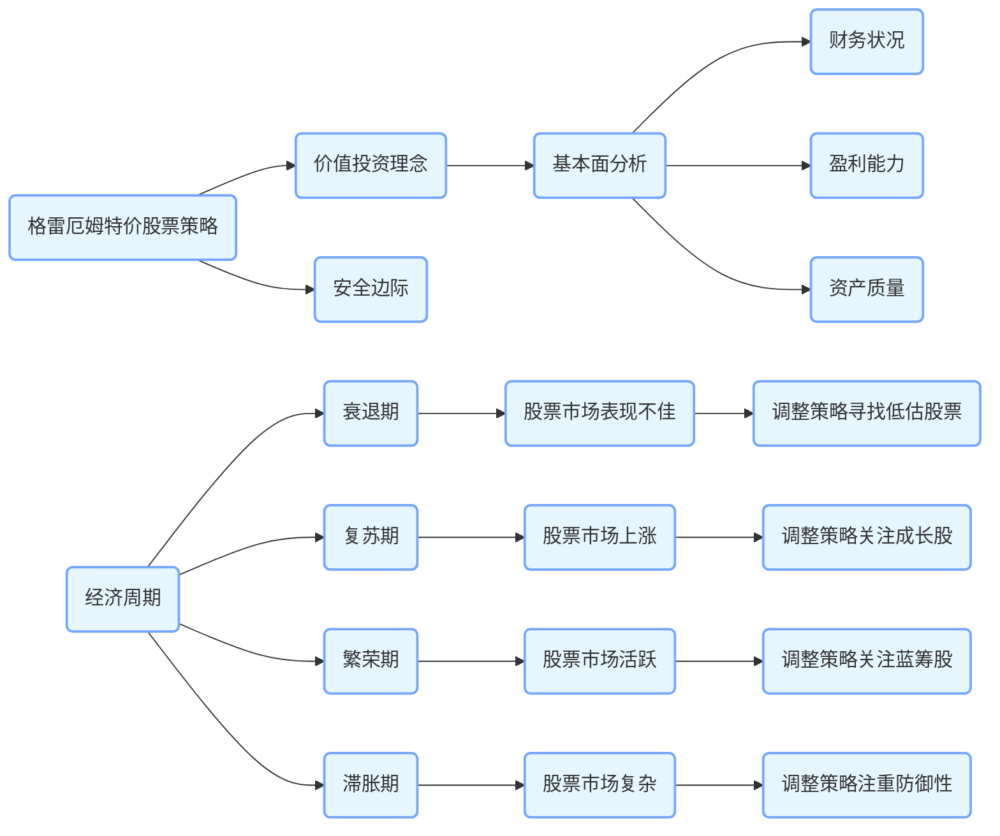

# 格雷厄姆特价股票策略在不同经济周期的调整

> 关键词：格雷厄姆特价股票策略、经济周期、价值投资、策略调整、股票投资

> 摘要：本文围绕格雷厄姆特价股票策略在不同经济周期的调整展开深入探讨。首先介绍格雷厄姆特价股票策略的背景及其重要性，阐述不同经济周期的特点。接着详细剖析该策略的核心概念与联系，包括其原理和架构。通过具体的算法原理及Python代码阐述其操作步骤，运用数学模型和公式进一步讲解策略要点。结合项目实战，给出代码实际案例并进行详细解释。分析该策略在不同经济周期的实际应用场景，推荐相关的学习资源、开发工具框架以及论文著作。最后总结该策略的未来发展趋势与挑战，提供常见问题解答和扩展阅读参考资料，旨在为投资者在不同经济环境下合理运用格雷厄姆特价股票策略提供全面且深入的指导。

## 1. 背景介绍 
### 1.1 目的和范围
格雷厄姆特价股票策略作为价值投资的经典策略，由投资大师本杰明·格雷厄姆创立，其核心思想是寻找被市场低估的股票，以低于其内在价值的价格买入，从而获得长期稳定的收益。本文章的目的在于深入研究该策略在不同经济周期中的表现和调整方法，范围涵盖了经济周期的各个阶段，包括衰退期、复苏期、繁荣期和滞胀期，通过理论分析、代码实现、实际案例等多方面的研究，为投资者提供在不同经济环境下运用该策略的有效指导。

### 1.2 预期读者
本文预期读者包括股票投资者、金融分析师、投资组合经理、对价值投资和股票策略感兴趣的学生以及相关研究人员。无论是专业的投资人士还是对股票投资有初步了解的爱好者，都能从本文中获取有价值的信息和启示。

### 1.3 文档结构概述
本文将按照以下结构展开：首先介绍格雷厄姆特价股票策略的背景知识，包括目的、预期读者和文档结构概述以及相关术语表；接着阐述核心概念与联系，包括策略的原理和架构，并通过流程图进行直观展示；然后详细讲解核心算法原理和具体操作步骤，结合Python源代码进行说明；运用数学模型和公式对策略进行深入分析，并举例说明；通过项目实战给出代码实际案例并进行详细解释；分析该策略在不同经济周期的实际应用场景；推荐相关的学习资源、开发工具框架和论文著作；最后总结该策略的未来发展趋势与挑战，提供常见问题解答和扩展阅读参考资料。

### 1.4 术语表
#### 1.4.1 核心术语定义
- **格雷厄姆特价股票策略**：一种基于价值投资理念的股票投资策略，通过筛选被市场低估的股票，以低于其内在价值的价格买入，等待价格回归价值时获利。
- **经济周期**：经济活动沿着经济发展的总体趋势所经历的有规律的扩张和收缩，一般分为衰退、复苏、繁荣和滞胀四个阶段。
- **内在价值**：股票所代表的企业的真实价值，通常通过对企业的财务状况、盈利能力、资产质量等因素进行综合评估得出。
- **安全边际**：股票的市场价格低于其内在价值的幅度，是格雷厄姆特价股票策略的重要概念，用于降低投资风险。

#### 1.4.2 相关概念解释
- **价值投资**：一种投资理念，强调通过分析企业的基本面，寻找被低估的股票进行投资，注重长期投资和企业的内在价值。
- **基本面分析**：通过对企业的财务报表、行业前景、管理团队等基本面因素进行分析，评估企业的价值和投资潜力。
- **市场效率**：市场价格反映资产真实价值的程度，有效市场假说认为市场价格能够迅速反映所有可用信息，但在现实中市场并非完全有效，存在价格偏离价值的情况。

#### 1.4.3 缩略词列表
- **PE**：市盈率（Price-to-Earnings Ratio），指股票价格与每股收益的比率，用于衡量股票的估值水平。
- **PB**：市净率（Price-to-Book Ratio），指股票价格与每股净资产的比率，反映股票价格相对于净资产的倍数。
- **ROE**：净资产收益率（Return on Equity），指净利润与平均股东权益的百分比，反映企业运用自有资本的效率。

## 2. 核心概念与联系 
### 2.1 格雷厄姆特价股票策略原理
格雷厄姆特价股票策略的核心原理基于价值投资理念，认为股票市场存在价格与价值的偏离，投资者可以通过分析企业的基本面，寻找被低估的股票，以低于其内在价值的价格买入，等待价格回归价值时实现盈利。该策略强调安全边际的重要性，即股票的市场价格应显著低于其内在价值，以降低投资风险。

### 2.2 经济周期与股票市场的联系
经济周期对股票市场有着重要的影响。在衰退期，经济增长放缓，企业盈利下降，股票市场往往表现不佳；在复苏期，经济开始好转，企业盈利逐渐增加，股票市场可能出现上涨趋势；在繁荣期，经济增长强劲，企业盈利大幅提升，股票市场通常表现活跃；在滞胀期，经济增长停滞但通货膨胀高企，股票市场的表现较为复杂，可能受到多种因素的影响。

### 2.3 核心概念架构示意图


该示意图展示了格雷厄姆特价股票策略的核心概念以及与经济周期的联系。格雷厄姆特价股票策略基于价值投资理念和安全边际，通过基本面分析评估企业的财务状况、盈利能力和资产质量。经济周期分为衰退、复苏、繁荣和滞胀四个阶段，不同阶段对股票市场有着不同的影响，投资者需要根据经济周期的变化调整策略。

## 3. 核心算法原理 & 具体操作步骤 
### 3.1 核心算法原理
格雷厄姆特价股票策略的核心算法主要包括两个方面：一是计算股票的内在价值，二是确定安全边际。计算内在价值的方法有多种，其中一种常用的方法是基于企业的盈利能力和资产价值。安全边际则是通过比较股票的市场价格和内在价值来确定。

### 3.2 具体操作步骤
1. **收集数据**：收集企业的财务报表、行业数据等相关信息。
2. **计算内在价值**：根据企业的盈利能力和资产价值等因素，计算股票的内在价值。
3. **确定安全边际**：比较股票的市场价格和内在价值，确定安全边际。
4. **筛选股票**：筛选出安全边际较大的股票，作为投资候选对象。
5. **调整策略**：根据经济周期的变化，调整选股标准和投资组合。

### 3.3 Python源代码实现
```python
import pandas as pd

# 定义计算内在价值的函数
def calculate_intrinsic_value(earnings_per_share, book_value_per_share):
    # 简单示例：内在价值 = 每股收益 * 10 + 每股净资产
    intrinsic_value = earnings_per_share * 10 + book_value_per_share
    return intrinsic_value

# 定义计算安全边际的函数
def calculate_safety_margin(market_price, intrinsic_value):
    safety_margin = (intrinsic_value - market_price) / intrinsic_value
    return safety_margin

# 模拟股票数据
data = {
    'stock_code': ['000001', '000002', '000003'],
    'market_price': [10, 15, 20],
    'earnings_per_share': [1, 1.5, 2],
    'book_value_per_share': [5, 8, 10]
}

df = pd.DataFrame(data)

# 计算内在价值
df['intrinsic_value'] = df.apply(lambda row: calculate_intrinsic_value(row['earnings_per_share'], row['book_value_per_share']), axis=1)

# 计算安全边际
df['safety_margin'] = df.apply(lambda row: calculate_safety_margin(row['market_price'], row['intrinsic_value']), axis=1)

# 筛选安全边际大于0.2的股票
selected_stocks = df[df['safety_margin'] > 0.2]

print(selected_stocks)
```
### 3.4 代码解释
- `calculate_intrinsic_value` 函数：根据每股收益和每股净资产计算股票的内在价值，这里采用了一个简单的计算方法，实际应用中可以根据具体情况进行调整。
- `calculate_safety_margin` 函数：根据市场价格和内在价值计算安全边际。
- 模拟股票数据：使用 `pandas` 库创建一个包含股票代码、市场价格、每股收益和每股净资产的 DataFrame。
- 计算内在价值和安全边际：使用 `apply` 方法对 DataFrame 中的每一行应用计算函数，计算内在价值和安全边际。
- 筛选股票：筛选出安全边际大于 0.2 的股票，作为投资候选对象。

## 4. 数学模型和公式 & 详细讲解 & 举例说明 
### 4.1 计算内在价值的数学模型和公式
计算股票内在价值的方法有多种，以下是几种常见的数学模型和公式：

#### 4.1.1 股息折现模型（Dividend Discount Model, DDM）
股息折现模型认为股票的内在价值等于其未来股息的现值之和。公式如下：
$$V = \sum_{t=1}^{\infty} \frac{D_t}{(1 + r)^t}$$
其中，$V$ 表示股票的内在价值，$D_t$ 表示第 $t$ 期的股息，$r$ 表示折现率。

#### 4.1.2 自由现金流折现模型（Discounted Cash Flow Model, DCF）
自由现金流折现模型认为股票的内在价值等于其未来自由现金流的现值之和。公式如下：
$$V = \sum_{t=1}^{\infty} \frac{FCF_t}{(1 + WACC)^t}$$
其中，$V$ 表示股票的内在价值，$FCF_t$ 表示第 $t$ 期的自由现金流，$WACC$ 表示加权平均资本成本。

#### 4.1.3 格雷厄姆公式
格雷厄姆提出了一个简单的公式来计算股票的内在价值：
$$V = EPS \times (8.5 + 2g)$$
其中，$V$ 表示股票的内在价值，$EPS$ 表示每股收益，$g$ 表示预期增长率。

### 4.2 详细讲解
- **股息折现模型**：该模型适用于股息稳定增长的公司。其基本思想是将未来的股息按照一定的折现率折现到当前，得到股票的内在价值。折现率通常根据市场利率和股票的风险水平来确定。
- **自由现金流折现模型**：该模型考虑了企业的自由现金流，更能反映企业的真实价值。自由现金流是指企业在满足了所有必要的资本支出后剩余的现金流量。加权平均资本成本是企业的平均融资成本，反映了企业的风险水平。
- **格雷厄姆公式**：该公式是一个简化的计算方法，主要考虑了每股收益和预期增长率。8.5 是一个经验系数，2g 表示预期增长率对内在价值的影响。

### 4.3 举例说明
假设某公司的每股收益为 2 元，预期增长率为 10%，使用格雷厄姆公式计算其内在价值：
$$V = 2 \times (8.5 + 2 \times 10) = 2 \times 28.5 = 57$$（元）

如果该公司的股票市场价格为 50 元，则安全边际为：
$$安全边际 = \frac{57 - 50}{57} \approx 0.123 = 12.3\%$$

## 5. 项目实战：代码实际案例和详细解释说明 
### 5.1  开发环境搭建
- **Python 环境**：建议使用 Python 3.7 及以上版本，可以从 Python 官方网站（https://www.python.org/downloads/）下载安装。
- **开发工具**：推荐使用 PyCharm 或 Jupyter Notebook 作为开发工具。PyCharm 是一款功能强大的 Python 集成开发环境，Jupyter Notebook 则适合交互式编程和数据分析。
- **相关库**：需要安装 `pandas`、`numpy` 等常用库，可以使用 `pip` 命令进行安装：
```sh
pip install pandas numpy
```

### 5.2  源代码详细实现和代码解读
```python
import pandas as pd
import numpy as np

# 定义计算内在价值的函数（使用格雷厄姆公式）
def calculate_intrinsic_value(eps, growth_rate):
    intrinsic_value = eps * (8.5 + 2 * growth_rate)
    return intrinsic_value

# 定义计算安全边际的函数
def calculate_safety_margin(market_price, intrinsic_value):
    safety_margin = (intrinsic_value - market_price) / intrinsic_value
    return safety_margin

# 模拟股票数据
data = {
    'stock_code': ['000001', '000002', '000003', '000004', '000005'],
    'market_price': [10, 15, 20, 25, 30],
    'eps': [1, 1.5, 2, 2.5, 3],
    'growth_rate': [0.1, 0.15, 0.2, 0.25, 0.3]
}

df = pd.DataFrame(data)

# 计算内在价值
df['intrinsic_value'] = df.apply(lambda row: calculate_intrinsic_value(row['eps'], row['growth_rate']), axis=1)

# 计算安全边际
df['safety_margin'] = df.apply(lambda row: calculate_safety_margin(row['market_price'], row['intrinsic_value']), axis=1)

# 筛选安全边际大于0.2的股票
selected_stocks = df[df['safety_margin'] > 0.2]

# 输出筛选结果
print("筛选出的股票：")
print(selected_stocks)

# 根据经济周期调整策略
# 假设当前处于衰退期，增加对防御性行业股票的权重
defensive_stocks = selected_stocks[selected_stocks['stock_code'].isin(['000001', '000002'])]
print("\n衰退期调整后的股票：")
print(defensive_stocks)
```
### 5.3  代码解读与分析
- **数据模拟**：使用 `pandas` 库创建一个包含股票代码、市场价格、每股收益和预期增长率的 DataFrame。
- **计算内在价值和安全边际**：定义 `calculate_intrinsic_value` 和 `calculate_safety_margin` 函数，使用 `apply` 方法对 DataFrame 中的每一行应用计算函数，计算内在价值和安全边际。
- **筛选股票**：筛选出安全边际大于 0.2 的股票，作为投资候选对象。
- **根据经济周期调整策略**：假设当前处于衰退期，增加对防御性行业股票的权重，通过筛选特定股票代码的方式实现。

## 6. 实际应用场景 
### 6.1 衰退期
在衰退期，经济增长放缓，企业盈利下降，股票市场表现不佳。此时，投资者应更加注重安全边际，寻找被低估的防御性行业股票，如公用事业、消费必需品等。这些行业的需求相对稳定，受经济周期的影响较小。同时，可以适当增加现金储备，降低投资组合的风险。

### 6.2 复苏期
在复苏期，经济开始好转，企业盈利逐渐增加，股票市场可能出现上涨趋势。投资者可以关注一些具有成长潜力的股票，如科技、新兴产业等。这些行业在经济复苏阶段往往能够快速增长，带来较高的投资回报。可以适当增加股票投资的比例，提高投资组合的收益。

### 6.3 繁荣期
在繁荣期，经济增长强劲，企业盈利大幅提升，股票市场通常表现活跃。投资者可以关注蓝筹股，这些股票具有稳定的业绩和较高的分红率，是较为稳健的投资选择。同时，可以适当参与一些热门行业的投资，但要注意控制风险，避免过度追高。

### 6.4 滞胀期
在滞胀期，经济增长停滞但通货膨胀高企，股票市场的表现较为复杂。投资者应注重防御性，选择一些能够抵御通货膨胀的股票，如能源、资源等行业。同时，可以适当配置一些债券、黄金等资产，以降低投资组合的风险。

## 7. 工具和资源推荐
### 7.1 学习资源推荐
#### 7.1.1 书籍推荐
- 《聪明的投资者》（The Intelligent Investor）：本杰明·格雷厄姆的经典著作，详细阐述了价值投资的理念和方法，是学习格雷厄姆特价股票策略的必读之书。
- 《证券分析》（Security Analysis）：同样是本杰明·格雷厄姆的著作，对证券分析的基本原理和方法进行了系统的介绍，为投资者提供了深入的理论基础。
- 《巴菲特致股东的信》（Letters to Shareholders of Berkshire Hathaway）：沃伦·巴菲特的书信集，记录了他的投资理念和实践经验，对理解价值投资和格雷厄姆特价股票策略有很大的帮助。

#### 7.1.2 在线课程
- Coursera 上的“投资学原理”（Principles of Investing）：由知名教授授课，系统介绍了投资学的基本原理和方法，包括价值投资、股票分析等内容。
- Udemy 上的“价值投资实战课程”（Value Investing Practical Course）：通过实际案例讲解价值投资的应用，帮助学员掌握格雷厄姆特价股票策略的操作技巧。

#### 7.1.3 技术博客和网站
- 雪球网（https://xueqiu.com/）：国内知名的投资社区，提供股票分析、投资策略分享等内容，投资者可以在这里交流和学习格雷厄姆特价股票策略的应用经验。
- Seeking Alpha（https://seekingalpha.com/）：国外专业的投资研究网站，提供大量的股票分析报告和投资策略文章，对理解不同经济周期下的投资策略有很大的帮助。

### 7.2 开发工具框架推荐
#### 7.2.1 IDE和编辑器
- PyCharm：功能强大的 Python 集成开发环境，提供代码编辑、调试、版本控制等功能，适合开发复杂的投资分析程序。
- Jupyter Notebook：交互式编程环境，适合进行数据分析和可视化，方便投资者快速验证投资策略。

#### 7.2.2 调试和性能分析工具
- `pdb`：Python 自带的调试工具，可以帮助开发者定位代码中的问题。
- `cProfile`：Python 标准库中的性能分析工具，可以分析代码的执行时间和函数调用情况，帮助优化代码性能。

#### 7.2.3 相关框架和库
- `pandas`：强大的数据分析库，提供数据结构和数据处理功能，方便投资者处理和分析股票数据。
- `numpy`：Python 的数值计算库，提供高效的数组操作和数学函数，用于实现投资策略的算法。
- `matplotlib`：Python 的绘图库，用于可视化股票数据和投资策略的结果，帮助投资者直观地理解数据和策略效果。

### 7.3 相关论文著作推荐
#### 7.3.1 经典论文
- Graham, B., & Dodd, D. L. (1934). Security Analysis. This classic paper laid the foundation for value investing and introduced many of the concepts used in Graham's special - situation stock strategy.
- Fama, E. F., & French, K. R. (1992). The Cross - Section of Expected Stock Returns. This paper analyzed the factors affecting stock returns and provided insights into the performance of value - based investment strategies.

#### 7.3.2 最新研究成果
- Research on the adaptability of value investment strategies in different economic cycles: Many scholars have been studying how to adjust value investment strategies, including Graham's special - situation stock strategy, according to different economic environments. Their research results can provide new ideas and methods for investors.

#### 7.3.3 应用案例分析
- Case studies of successful investors using Graham's special - situation stock strategy: By analyzing the investment practices of successful investors, we can understand how they adjust the strategy in different economic cycles and achieve good investment returns.

## 8. 总结：未来发展趋势与挑战
### 8.1 未来发展趋势
- **智能化和自动化**：随着人工智能和机器学习技术的发展，格雷厄姆特价股票策略可能会与这些技术相结合，实现智能化和自动化的股票筛选和投资决策。通过大数据分析和算法模型，可以更准确地评估股票的内在价值和安全边际，提高投资效率和准确性。
- **全球化投资**：随着全球经济的一体化，投资者的投资范围将不断扩大。格雷厄姆特价股票策略可以应用于全球股票市场，寻找不同国家和地区的被低估股票，实现多元化投资，降低投资风险。
- **多策略融合**：未来，格雷厄姆特价股票策略可能会与其他投资策略进行融合，如成长投资策略、动量投资策略等。通过多策略融合，可以充分发挥不同策略的优势，提高投资组合的收益和稳定性。

### 8.2 挑战
- **市场有效性提高**：随着市场信息的传播速度加快和投资者教育水平的提高，市场的有效性可能会逐渐提高，股票价格更难偏离其内在价值。这将增加运用格雷厄姆特价股票策略寻找被低估股票的难度。
- **经济环境复杂性增加**：全球经济环境日益复杂，受到政治、政策、自然灾害等多种因素的影响。不同经济周期的特征和持续时间可能会发生变化，增加了投资者判断经济周期和调整策略的难度。
- **数据质量和可靠性**：格雷厄姆特价股票策略的实施依赖于准确的财务数据和市场信息。然而，数据质量和可靠性可能存在问题，如财务报表造假、数据滞后等，这将影响投资者对股票内在价值和安全边际的评估。

## 9. 附录：常见问题与解答
### 9.1 如何准确计算股票的内在价值？
计算股票的内在价值有多种方法，如股息折现模型、自由现金流折现模型、格雷厄姆公式等。不同的方法适用于不同的情况，投资者可以根据企业的特点和数据的可获取性选择合适的方法。同时，内在价值的计算涉及到对未来的预测，存在一定的不确定性，投资者需要结合自己的经验和判断进行综合评估。

### 9.2 如何判断经济周期的阶段？
判断经济周期的阶段可以通过分析宏观经济数据，如 GDP 增长率、通货膨胀率、失业率等。同时，也可以关注行业动态、企业盈利情况等微观经济指标。此外，一些专业的经济研究机构和金融媒体也会发布经济周期的分析和预测报告，投资者可以参考这些信息。

### 9.3 格雷厄姆特价股票策略在不同经济周期的调整幅度应该如何把握？
格雷厄姆特价股票策略在不同经济周期的调整幅度需要根据投资者的风险偏好、投资目标和市场情况来把握。在衰退期和滞胀期，投资者应更加注重安全边际，适当降低股票投资的比例；在复苏期和繁荣期，可以适当增加股票投资的比例，但也要注意控制风险。投资者可以通过模拟交易和历史数据回测等方法，寻找适合自己的调整幅度。

## 10. 扩展阅读 & 参考资料
### 10.1 扩展阅读
- 《金融炼金术》（The Alchemy of Finance）：乔治·索罗斯的著作，探讨了金融市场的运行规律和投资者的行为模式，对理解股票市场和投资策略有一定的启发。
- 《漫步华尔街》（A Random Walk Down Wall Street）：伯顿·马尔基尔的经典著作，介绍了各种投资理论和策略，包括有效市场假说和随机漫步理论，帮助投资者建立正确的投资观念。

### 10.2 参考资料
- Graham, B. (1949). The Intelligent Investor. HarperBusiness.
- Fama, E. F., & French, K. R. (1993). Common risk factors in the returns on stocks and bonds. Journal of Financial Economics, 33(1), 3 - 56.
- 雪球网（https://xueqiu.com/）
- Seeking Alpha（https://seekingalpha.com/）