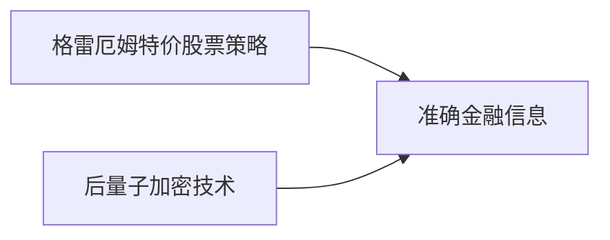

# 格雷厄姆特价股票策略在后量子加密金融时代的应用

> 关键词：格雷厄姆特价股票策略、后量子加密、金融时代、股票投资、量子计算、市场分析

> 摘要：本文深入探讨了格雷厄姆特价股票策略在后量子加密金融时代的应用。首先介绍了研究的背景、目的和范围，以及预期读者和文档结构。接着阐述了格雷厄姆特价股票策略和后量子加密的核心概念及其联系。详细讲解了该策略的核心算法原理，并给出了Python源代码示例。通过数学模型和公式进一步剖析其原理，并举例说明。进行项目实战，包括开发环境搭建、源代码实现与解读。分析了该策略在不同场景下的实际应用，推荐了相关的学习资源、开发工具框架和论文著作。最后总结了未来发展趋势与挑战，提供了常见问题解答和扩展阅读参考资料，旨在为投资者在后量子加密金融时代运用格雷厄姆特价股票策略提供全面的指导和参考。

## 1. 背景介绍 
### 1.1 目的和范围
本研究的主要目的是探索格雷厄姆特价股票策略在后量子加密金融时代的可行性和有效性。随着量子计算技术的快速发展，后量子加密成为保障金融安全的关键因素，而金融市场的环境也随之发生变化。格雷厄姆特价股票策略作为一种经典的价值投资策略，其在新的金融环境下的应用需要重新审视和研究。

研究范围涵盖了格雷厄姆特价股票策略的基本原理、后量子加密技术对金融市场的影响，以及该策略在新环境下的具体应用方法和案例分析。通过理论分析和实证研究，为投资者和金融从业者提供决策依据。

### 1.2 预期读者
本文预期读者包括金融投资者、股票分析师、金融科技研究者、量子计算与密码学领域的专业人士以及对金融市场和投资策略感兴趣的普通读者。对于投资者，希望能帮助他们在后量子加密金融时代更好地运用格雷厄姆特价股票策略进行投资决策；对于专业研究者，提供一个跨领域的研究视角和思路；对于普通读者，能帮助他们了解相关领域的前沿知识和发展趋势。

### 1.3 文档结构概述
本文共分为十个部分。第一部分为背景介绍，阐述研究的目的、范围、预期读者和文档结构；第二部分讲解格雷厄姆特价股票策略和后量子加密的核心概念与联系；第三部分介绍核心算法原理和具体操作步骤，并给出Python源代码；第四部分通过数学模型和公式详细讲解策略原理并举例说明；第五部分进行项目实战，包括开发环境搭建、源代码实现和代码解读；第六部分分析实际应用场景；第七部分推荐相关的学习资源、开发工具框架和论文著作；第八部分总结未来发展趋势与挑战；第九部分为附录，提供常见问题与解答；第十部分为扩展阅读和参考资料。

### 1.4 术语表
#### 1.4.1 核心术语定义
- **格雷厄姆特价股票策略**：由本杰明·格雷厄姆（Benjamin Graham）提出的一种价值投资策略，通过寻找价格低于内在价值的股票进行投资，以获取长期的投资回报。
- **后量子加密**：指在量子计算技术可能对现有加密算法构成威胁的背景下，开发和应用的能够抵抗量子计算机攻击的加密技术。
- **量子计算**：基于量子力学原理的计算技术，具有强大的计算能力，可能对传统的加密算法造成冲击。
- **内在价值**：股票所代表的企业的真实价值，通常通过对企业的财务状况、盈利能力、行业前景等因素进行分析评估得出。

#### 1.4.2 相关概念解释
- **价值投资**：一种投资理念，强调寻找被市场低估的资产，通过长期持有来实现资产的增值。
- **金融市场安全**：指金融市场在交易、存储和传输信息等方面的安全性，防止信息泄露、篡改和欺诈等行为。
- **加密算法**：用于对信息进行加密和解密的数学算法，保障信息的保密性和完整性。

#### 1.4.3 缩略词列表
- **QC**：Quantum Computing，量子计算
- **PQC**：Post - Quantum Cryptography，后量子加密

## 2. 核心概念与联系 

### 格雷厄姆特价股票策略原理
格雷厄姆特价股票策略的核心思想是寻找那些价格低于其内在价值的股票。格雷厄姆认为，市场有时会出现非理性的波动，导致股票价格偏离其内在价值。投资者可以通过对企业的财务报表、资产负债表、盈利能力等基本面因素进行分析，来估算股票的内在价值。当股票价格低于内在价值时，就存在投资机会。

其基本步骤包括：
1. **筛选股票**：从众多股票中筛选出具有一定规模和稳定性的公司。
2. **评估内在价值**：运用财务分析方法，如计算市盈率、市净率、股息率等指标，结合企业的盈利预测和资产状况，估算股票的内在价值。
3. **比较价格与价值**：将股票的市场价格与估算的内在价值进行比较，选择价格低于内在价值的股票进行投资。

### 后量子加密原理
后量子加密是为了应对量子计算对现有加密算法的威胁而发展起来的加密技术。传统的加密算法，如RSA、ECC等，是基于数学难题，如大整数分解和离散对数问题。而量子计算机具有强大的计算能力，可能在短时间内破解这些数学难题，从而使现有的加密算法失效。

后量子加密算法主要基于以下几种数学原理：
1. **格密码学**：基于格上的困难问题，如最短向量问题（SVP）和最近向量问题（CVP）。
2. **编码密码学**：利用纠错码的数学性质来构造加密算法。
3. **多变量密码学**：基于有限域上的多变量多项式方程组的求解困难性。

### 两者联系
后量子加密技术的发展对金融市场的安全和稳定性产生了深远的影响。在金融交易中，信息的安全传输和存储至关重要。后量子加密技术可以保障金融信息的安全性，防止量子计算机攻击导致的信息泄露和欺诈行为。

而格雷厄姆特价股票策略在投资决策过程中，需要依赖准确的金融信息。后量子加密技术保障了金融信息的安全和可靠性，使得投资者能够获取真实、准确的企业财务数据和市场信息，从而更准确地估算股票的内在价值，提高格雷厄姆特价股票策略的有效性。

### 文本示意图
```plaintext
格雷厄姆特价股票策略 <---- 依赖 ---- 准确金融信息
准确金融信息 <---- 保障 ---- 后量子加密技术
```

### Mermaid 流程图


## 3. 核心算法原理 & 具体操作步骤 

### 核心算法原理
格雷厄姆特价股票策略的核心算法主要围绕股票内在价值的估算和价格比较展开。以下是一种简化的估算内在价值的方法：

假设我们使用市盈率（P/E）和市净率（P/B）来估算股票的内在价值。首先，我们需要收集目标股票的财务数据，包括每股收益（EPS）和每股净资产（BVPS）。

内在价值（IV）的估算公式可以表示为：
\[IV = EPS \times \text{合理市盈率} + BVPS \times \text{合理市净率}\]

合理市盈率和合理市净率可以根据行业平均水平、企业的盈利能力和稳定性等因素进行调整。

### 具体操作步骤
1. **数据收集**：收集目标股票的财务报表，包括利润表、资产负债表等，提取每股收益（EPS）和每股净资产（BVPS）数据。
2. **确定合理比率**：根据行业平均水平和企业的具体情况，确定合理市盈率和合理市净率。
3. **计算内在价值**：使用上述公式计算股票的内在价值。
4. **比较价格与价值**：将股票的市场价格与计算得到的内在价值进行比较。如果市场价格低于内在价值，则认为该股票具有投资价值。

### Python源代码示例
```python
import pandas as pd

def calculate_intrinsic_value(eps, bvps, reasonable_pe, reasonable_pb):
    """
    计算股票的内在价值
    :param eps: 每股收益
    :param bvps: 每股净资产
    :param reasonable_pe: 合理市盈率
    :param reasonable_pb: 合理市净率
    :return: 内在价值
    """
    intrinsic_value = eps * reasonable_pe + bvps * reasonable_pb
    return intrinsic_value

def screen_stocks(financial_data, reasonable_pe, reasonable_pb):
    """
    筛选具有投资价值的股票
    :param financial_data: 包含每股收益和每股净资产的财务数据 DataFrame
    :param reasonable_pe: 合理市盈率
    :param reasonable_pb: 合理市净率
    :return: 具有投资价值的股票列表
    """
    valuable_stocks = []
    for index, row in financial_data.iterrows():
        eps = row['EPS']
        bvps = row['BVPS']
        market_price = row['Market_Price']
        intrinsic_value = calculate_intrinsic_value(eps, bvps, reasonable_pe, reasonable_pb)
        if market_price < intrinsic_value:
            valuable_stocks.append(index)
    return valuable_stocks

# 示例财务数据
data = {
    'EPS': [2.0, 1.5, 3.0],
    'BVPS': [10.0, 8.0, 15.0],
    'Market_Price': [25.0, 18.0, 40.0]
}
financial_data = pd.DataFrame(data, index=['Stock1', 'Stock2', 'Stock3'])

# 假设合理市盈率为10，合理市净率为1.5
reasonable_pe = 10
reasonable_pb = 1.5

# 筛选股票
valuable_stocks = screen_stocks(financial_data, reasonable_pe, reasonable_pb)
print("具有投资价值的股票:", valuable_stocks)
```

## 4. 数学模型和公式 & 详细讲解 & 举例说明 

### 数学模型和公式
在格雷厄姆特价股票策略中，我们主要使用以下数学模型和公式来估算股票的内在价值。

#### 基于市盈率和市净率的内在价值估算公式
\[IV = EPS \times \text{合理市盈率} + BVPS \times \text{合理市净率}\]

其中，$IV$ 表示股票的内在价值，$EPS$ 表示每股收益，$BVPS$ 表示每股净资产。

#### 安全边际公式
安全边际（Margin of Safety）是格雷厄姆投资理念中的一个重要概念，用于衡量股票价格与内在价值之间的差距。其计算公式为：
\[ \text{安全边际} = \frac{IV - P}{IV} \times 100\% \]

其中，$P$ 表示股票的市场价格。安全边际越大，说明股票价格越低于内在价值，投资风险越小。

### 详细讲解
- **市盈率（P/E）**：是指股票价格与每股收益的比率，反映了市场对企业盈利能力的预期。合理市盈率通常根据行业平均水平和企业的增长前景进行调整。一般来说，成熟行业的合理市盈率较低，而高增长行业的合理市盈率较高。
- **市净率（P/B）**：是指股票价格与每股净资产的比率，反映了市场对企业资产价值的评估。合理市净率也会因行业而异，一些重资产行业的合理市净率可能较高，而轻资产行业的合理市净率可能较低。
- **安全边际**：安全边际是格雷厄姆投资策略的核心之一。它为投资者提供了一定的缓冲空间，即使企业的实际表现不如预期，由于股票价格低于内在价值，投资者仍然有机会获得正的投资回报。

### 举例说明
假设我们要分析一只股票，其每股收益（EPS）为 3 元，每股净资产（BVPS）为 20 元，市场价格为 40 元。根据行业平均水平和企业的具体情况，我们确定合理市盈率为 12，合理市净率为 1.5。

首先，计算股票的内在价值：
\[IV = 3 \times 12 + 20 \times 1.5 = 36 + 30 = 66 \text{（元）}\]

然后，计算安全边际：
\[ \text{安全边际} = \frac{66 - 40}{66} \times 100\% \approx 39.4\% \]

由于安全边际较高，说明该股票价格低于内在价值，具有一定的投资价值。

## 5. 项目实战：代码实际案例和详细解释说明 

### 5.1  开发环境搭建
为了实现格雷厄姆特价股票策略的代码，我们需要搭建以下开发环境：

#### 操作系统
可以选择 Windows、Linux 或 macOS 操作系统。

#### 编程语言和版本
使用 Python 3.x 版本。Python 是一种功能强大、易于学习和使用的编程语言，拥有丰富的库和工具，适合进行数据分析和金融计算。

#### 安装必要的库
我们需要安装以下 Python 库：
- **pandas**：用于数据处理和分析。
- **numpy**：用于数值计算。

可以使用以下命令安装这些库：
```sh
pip install pandas numpy
```

### 5.2  源代码详细实现和代码解读
```python
import pandas as pd
import numpy as np

def calculate_intrinsic_value(eps, bvps, reasonable_pe, reasonable_pb):
    """
    计算股票的内在价值
    :param eps: 每股收益
    :param bvps: 每股净资产
    :param reasonable_pe: 合理市盈率
    :param reasonable_pb: 合理市净率
    :return: 内在价值
    """
    intrinsic_value = eps * reasonable_pe + bvps * reasonable_pb
    return intrinsic_value

def screen_stocks(financial_data, reasonable_pe, reasonable_pb):
    """
    筛选具有投资价值的股票
    :param financial_data: 包含每股收益和每股净资产的财务数据 DataFrame
    :param reasonable_pe: 合理市盈率
    :param reasonable_pb: 合理市净率
    :return: 具有投资价值的股票列表
    """
    valuable_stocks = []
    for index, row in financial_data.iterrows():
        eps = row['EPS']
        bvps = row['BVPS']
        market_price = row['Market_Price']
        intrinsic_value = calculate_intrinsic_value(eps, bvps, reasonable_pe, reasonable_pb)
        if market_price < intrinsic_value:
            valuable_stocks.append(index)
    return valuable_stocks

# 模拟从文件中读取财务数据
def read_financial_data(file_path):
    """
    从 CSV 文件中读取财务数据
    :param file_path: CSV 文件路径
    :return: 财务数据 DataFrame
    """
    try:
        data = pd.read_csv(file_path)
        data.set_index('Stock_Name', inplace=True)
        return data
    except FileNotFoundError:
        print(f"文件 {file_path} 未找到，请检查文件路径。")
        return None

# 主函数
def main():
    file_path = 'financial_data.csv'
    financial_data = read_financial_data(file_path)
    if financial_data is not None:
        # 假设合理市盈率为 10，合理市净率为 1.5
        reasonable_pe = 10
        reasonable_pb = 1.5
        valuable_stocks = screen_stocks(financial_data, reasonable_pe, reasonable_pb)
        print("具有投资价值的股票:", valuable_stocks)

if __name__ == "__main__":
    main()
```

### 代码解读与分析
- **`calculate_intrinsic_value` 函数**：该函数接受每股收益（`eps`）、每股净资产（`bvps`）、合理市盈率（`reasonable_pe`）和合理市净率（`reasonable_pb`）作为输入，根据公式计算股票的内在价值。
- **`screen_stocks` 函数**：该函数遍历财务数据中的每一行，调用 `calculate_intrinsic_value` 函数计算股票的内在价值，并将市场价格与内在价值进行比较。如果市场价格低于内在价值，则将该股票添加到具有投资价值的股票列表中。
- **`read_financial_data` 函数**：该函数从 CSV 文件中读取财务数据，并将股票名称设置为索引。如果文件不存在，则打印错误信息并返回 `None`。
- **`main` 函数**：该函数是程序的入口点，调用 `read_financial_data` 函数读取财务数据，然后调用 `screen_stocks` 函数筛选具有投资价值的股票，并打印结果。

## 6. 实际应用场景 
### 个人投资者
对于个人投资者来说，格雷厄姆特价股票策略在后量子加密金融时代具有重要的应用价值。在新的金融环境下，后量子加密技术保障了金融信息的安全，个人投资者可以更加放心地获取和使用准确的企业财务数据。通过运用格雷厄姆特价股票策略，个人投资者可以筛选出被市场低估的股票，进行长期投资，实现资产的增值。

例如，个人投资者可以使用上述代码示例，收集相关股票的财务数据，设置合理的市盈率和市净率，筛选出具有投资价值的股票。在投资过程中，结合安全边际的概念，选择安全边际较高的股票，降低投资风险。

### 机构投资者
机构投资者，如基金公司、保险公司等，通常管理着大量的资金，需要进行大规模的投资决策。格雷厄姆特价股票策略可以作为机构投资者的一种投资参考。在后量子加密金融时代，机构投资者可以利用后量子加密技术保障投资信息的安全，同时运用该策略筛选出优质的投资标的。

机构投资者可以通过建立自己的财务数据模型和投资分析系统，对大量的股票进行筛选和评估。在投资组合的构建中，结合格雷厄姆特价股票策略，选择具有投资价值的股票，优化投资组合的风险和收益。

### 金融研究机构
金融研究机构可以利用格雷厄姆特价股票策略和后量子加密技术进行金融市场的研究和分析。通过对大量股票数据的研究，分析该策略在后量子加密金融时代的有效性和适用性。

金融研究机构可以开展实证研究，比较不同时间段、不同市场环境下该策略的表现。同时，研究后量子加密技术对金融市场的影响，为金融市场的稳定和发展提供理论支持和政策建议。

## 7. 工具和资源推荐
### 7.1 学习资源推荐
#### 7.1.1 书籍推荐
- **《聪明的投资者》（The Intelligent Investor）**：本杰明·格雷厄姆的经典著作，详细阐述了价值投资的理念和方法，是学习格雷厄姆特价股票策略的必读之书。
- **《金融市场与金融机构》（Financial Markets and Institutions）**：全面介绍了金融市场和金融机构的基本知识和运作原理，有助于读者了解金融市场的环境和投资背景。
- **《量子计算与量子信息》（Quantum Computation and Quantum Information）**：由迈克尔·尼尔森（Michael Nielsen）和艾萨克·庄（Isaac Chuang）所著，是量子计算领域的经典教材，适合对量子计算和后量子加密技术感兴趣的读者。

#### 7.1.2 在线课程
- **Coursera 上的“投资学原理”课程**：由知名大学教授授课，系统地介绍了投资学的基本原理和方法，包括价值投资策略。
- **edX 上的“量子计算基础”课程**：帮助读者了解量子计算的基本概念、原理和应用，为学习后量子加密技术打下基础。
- **Udemy 上的“Python 金融数据分析”课程**：通过实际案例，教授如何使用 Python 进行金融数据的分析和处理，与格雷厄姆特价股票策略的实现相关。

#### 7.1.3 技术博客和网站
- **Seeking Alpha**：一个提供金融市场分析和投资建议的网站，有许多关于价值投资策略的文章和研究报告。
- **Quantum Computing Report**：专注于量子计算领域的新闻和研究报道，提供后量子加密技术的最新动态。
- **Medium 上的金融和技术博客**：有许多专业人士分享的关于金融投资和量子计算的文章和见解。

### 7.2 开发工具框架推荐
#### 7.2.1 IDE和编辑器
- **PyCharm**：一款专业的 Python 集成开发环境（IDE），具有强大的代码编辑、调试和项目管理功能，适合开发和调试格雷厄姆特价股票策略的代码。
- **Jupyter Notebook**：一种交互式的开发环境，支持 Python 代码的编写、运行和可视化展示，方便进行数据分析和实验。

#### 7.2.2 调试和性能分析工具
- **pdb**：Python 内置的调试工具，可以帮助开发者逐行调试代码，查找和解决问题。
- **cProfile**：Python 标准库中的性能分析工具，可以分析代码的运行时间和函数调用情况，帮助优化代码性能。

#### 7.2.3 相关框架和库
- **pandas**：用于数据处理和分析的 Python 库，提供了高效的数据结构和数据操作方法，适合处理股票财务数据。
- **numpy**：用于数值计算的 Python 库，提供了高性能的数组和矩阵运算功能，在计算股票内在价值等数值计算中非常有用。
- **scikit - learn**：一个机器学习库，可用于对股票数据进行建模和分析，辅助格雷厄姆特价股票策略的决策。

### 7.3 相关论文著作推荐
#### 7.3.1 经典论文
- **“The Security of Practical Quantum Key Distribution”**：该论文探讨了量子密钥分发的安全性问题，是后量子加密领域的经典文献。
- **“Value Investing: The Use of Historical Financial Statement Information to Separate Winners from Losers”**：研究了价值投资策略的有效性，通过对历史财务报表信息的分析，阐述了如何筛选出优质的投资标的。

#### 7.3.2 最新研究成果
- **关注 IEEE 量子计算与通信会议（IEEE Quantum Computing and Communications Conference）上的相关论文**：该会议汇集了量子计算和通信领域的最新研究成果，包括后量子加密技术的最新进展。
- **关注金融学术期刊，如《Journal of Finance》《Review of Financial Studies》等**：这些期刊发表了许多关于金融投资策略和市场分析的最新研究论文。

#### 7.3.3 应用案例分析
- **分析一些知名投资机构的投资报告和案例研究**：了解他们如何运用价值投资策略进行投资决策，以及在实际应用中遇到的问题和解决方案。
- **研究一些金融科技公司在量子加密和金融投资领域的创新应用案例**：学习他们的技术和业务模式。

## 8. 总结：未来发展趋势与挑战
### 未来发展趋势
- **后量子加密技术的广泛应用**：随着量子计算技术的不断发展，后量子加密技术将在金融领域得到更广泛的应用。金融机构将加大对后量子加密技术的研发和应用投入，保障金融信息的安全。
- **格雷厄姆特价股票策略的优化和创新**：在新的金融环境下，格雷厄姆特价股票策略将不断优化和创新。投资者可能会结合更多的因素，如企业的创新能力、数字化转型程度等，来更准确地估算股票的内在价值。
- **金融科技与投资策略的深度融合**：金融科技的发展将为格雷厄姆特价股票策略的应用提供更多的工具和支持。例如，人工智能和大数据技术可以帮助投资者更高效地收集和分析财务数据，提高投资决策的准确性。

### 挑战
- **量子计算技术的不确定性**：量子计算技术的发展速度和应用效果存在一定的不确定性。如果量子计算机在短期内取得重大突破，可能会对现有的金融加密体系造成巨大冲击，给金融市场带来不稳定因素。
- **数据质量和准确性问题**：格雷厄姆特价股票策略的有效性依赖于准确的财务数据。在实际应用中，可能会存在数据质量不高、数据不准确等问题，影响股票内在价值的估算和投资决策的准确性。
- **市场环境的复杂性**：金融市场是一个复杂的系统，受到多种因素的影响，如宏观经济环境、政策变化、市场情绪等。这些因素的复杂性增加了格雷厄姆特价股票策略应用的难度，投资者需要综合考虑各种因素，做出合理的投资决策。

## 9. 附录：常见问题与解答
### 1. 格雷厄姆特价股票策略在后量子加密金融时代是否仍然有效？
答：仍然有效。后量子加密技术保障了金融信息的安全，使得投资者能够获取更准确的企业财务数据，从而更准确地估算股票的内在价值。虽然金融市场环境发生了变化，但价值投资的基本理念仍然适用，格雷厄姆特价股票策略仍然可以作为一种有效的投资方法。

### 2. 如何确定合理的市盈率和市净率？
答：合理的市盈率和市净率可以根据行业平均水平、企业的盈利能力、增长前景和稳定性等因素进行确定。一般来说，可以参考同行业其他公司的市盈率和市净率，结合企业的财务报表和市场分析，进行适当的调整。同时，也可以参考专业机构的研究报告和分析意见。

### 3. 后量子加密技术对金融市场有哪些具体影响？
答：后量子加密技术对金融市场的影响主要体现在信息安全方面。它可以保障金融交易信息、客户信息和企业财务数据的安全，防止量子计算机攻击导致的信息泄露和欺诈行为。此外，后量子加密技术的应用也可能会推动金融科技的发展，促进金融市场的创新和变革。

### 4. 格雷厄姆特价股票策略适合所有投资者吗？
答：不适合所有投资者。该策略是一种价值投资策略，注重长期投资和基本面分析，需要投资者具备一定的财务知识和分析能力。对于短期投机者或缺乏耐心的投资者来说，可能不太适合。同时，该策略也不能保证一定能够获得投资收益，投资者需要根据自己的风险承受能力和投资目标来选择适合自己的投资策略。

## 10. 扩展阅读 & 参考资料
### 扩展阅读
- **《投资中最简单的事》**：作者邱国鹭从投资的基本理念、方法和策略等方面进行了深入的探讨，对格雷厄姆特价股票策略有进一步的阐述和延伸。
- **《量子力学史话》**：以生动有趣的方式讲述了量子力学的发展历程，有助于读者更深入地了解量子计算和后量子加密技术的理论基础。

### 参考资料
- 本杰明·格雷厄姆. 《聪明的投资者》. 人民邮电出版社.
- Michael Nielsen, Isaac Chuang. 《Quantum Computation and Quantum Information》. Cambridge University Press.
- 相关金融学术期刊和会议论文，如《Journal of Finance》《Review of Financial Studies》《IEEE Quantum Computing and Communications Conference》等。
- 金融数据提供商的网站和报告，如 Bloomberg、Wind 等。