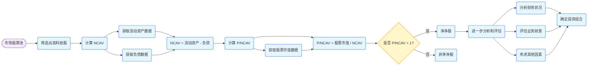

# 格雷厄姆的净净股策略：在高科技股中寻找价值

> 关键词：格雷厄姆、净净股策略、高科技股、价值投资、财务分析、股票估值、投资策略

> 摘要：本文深入探讨了格雷厄姆的净净股策略，并尝试将其应用于高科技股领域。首先介绍了净净股策略的背景和核心概念，阐述其原理与架构。接着详细讲解了该策略的核心算法原理，通过 Python 代码进行示例。同时给出了相关的数学模型和公式，并举例说明。在项目实战部分，展示了如何搭建开发环境、实现源代码以及对代码进行解读分析。还探讨了净净股策略在高科技股中的实际应用场景，推荐了相关的学习资源、开发工具框架以及论文著作。最后总结了该策略的未来发展趋势与挑战，解答了常见问题，并提供了扩展阅读和参考资料，旨在为投资者在高科技股中寻找价值提供全面且深入的指导。

## 1. 背景介绍 

### 1.1 目的和范围
本文章的主要目的是深入研究格雷厄姆的净净股策略，并探讨其在高科技股投资领域的应用。净净股策略是价值投资领域中一种经典且具有独特优势的投资方法，然而传统上该策略更多地应用于传统行业的股票分析。随着科技的飞速发展，高科技股在资本市场中的地位日益重要，但其估值和投资分析方法与传统行业有所不同。因此，本文旨在探索如何将净净股策略应用于高科技股，以帮助投资者在这个充满潜力和挑战的领域中寻找被低估的价值股，为投资者提供新的投资思路和方法。

本文的范围涵盖了净净股策略的基本概念、核心算法、数学模型、实际应用案例以及相关的工具和资源推荐等方面。通过对这些内容的详细阐述，读者将能够全面了解净净股策略，并掌握如何将其应用于高科技股的投资分析中。

### 1.2 预期读者
本文预期的读者主要包括对价值投资感兴趣的投资者、金融分析师、股票交易员以及相关领域的研究人员。对于希望深入了解格雷厄姆投资思想和净净股策略的初学者来说，本文将提供系统的知识讲解和实践指导；对于有一定投资经验的专业人士，本文关于净净股策略在高科技股中的应用探讨，将为他们提供新的投资视角和决策参考。

### 1.3 文档结构概述
本文将按照以下结构进行组织：
1. **背景介绍**：介绍文章的目的、范围、预期读者以及文档结构概述，并对相关术语进行定义和解释。
2. **核心概念与联系**：阐述净净股策略的核心概念，包括其原理和架构，并通过文本示意图和 Mermaid 流程图进行直观展示。
3. **核心算法原理 & 具体操作步骤**：详细讲解净净股策略的核心算法原理，并使用 Python 源代码进行示例，说明具体的操作步骤。
4. **数学模型和公式 & 详细讲解 & 举例说明**：给出净净股策略相关的数学模型和公式，并进行详细讲解，通过具体例子加深读者的理解。
5. **项目实战：代码实际案例和详细解释说明**：展示如何搭建开发环境，实现净净股策略的源代码，并对代码进行解读和分析。
6. **实际应用场景**：探讨净净股策略在高科技股投资中的实际应用场景，分析其优势和局限性。
7. **工具和资源推荐**：推荐与净净股策略和高科技股投资相关的学习资源、开发工具框架以及论文著作。
8. **总结：未来发展趋势与挑战**：总结净净股策略在高科技股投资中的应用现状，分析其未来发展趋势和面临的挑战。
9. **附录：常见问题与解答**：解答读者在学习和应用净净股策略过程中常见的问题。
10. **扩展阅读 & 参考资料**：提供相关的扩展阅读材料和参考资料，方便读者进一步深入学习。

### 1.4 术语表

#### 1.4.1 核心术语定义
- **净净股（Net - Net Stock）**：是指公司的股票市值低于其净流动资产价值（Net Current Asset Value，NCAV）的股票。净流动资产价值是指公司的流动资产减去所有负债后的价值。
- **价值投资（Value Investing）**：一种投资策略，投资者通过分析公司的基本面，寻找被市场低估的股票，以期望在未来股票价格回归其内在价值时获得收益。
- **高科技股（High - tech Stock）**：指那些从事高科技领域研发、生产和销售的公司的股票，这些领域通常包括信息技术、生物技术、新能源、新材料等。
- **流动资产（Current Assets）**：企业在一年或一个营业周期内能够变现或运用的资产，包括现金、应收账款、存货等。
- **负债（Liabilities）**：企业过去的交易或者事项形成的、预期会导致经济利益流出企业的现时义务，包括短期负债和长期负债。

#### 1.4.2 相关概念解释
- **净流动资产价值（NCAV）**：计算方法为流动资产减去所有负债，它反映了公司在极端情况下（如清算）能够为股东带来的最低价值。当股票市值低于 NCAV 时，意味着市场可能低估了公司的价值。
- **安全边际（Margin of Safety）**：价值投资中的一个重要概念，是指股票的内在价值与市场价格之间的差值。安全边际越大，投资的风险越低。净净股策略强调寻找具有较大安全边际的股票。

#### 1.4.3 缩略词列表
- **NCAV**：Net Current Asset Value，净流动资产价值
- **P/NCAV**：Price to Net Current Asset Value，市净流动资产率

## 2. 核心概念与联系 

### 核心概念原理
格雷厄姆的净净股策略基于价值投资的基本理念，认为市场有时会对股票进行错误定价，导致一些股票的市场价格低于其内在价值。净净股策略的核心在于关注公司的净流动资产价值，当股票的市值低于其净流动资产价值时，就认为该股票具有投资价值。

从原理上来说，净流动资产价值代表了公司在清算时能够为股东带来的最低价值。如果一家公司的股票市值低于其净流动资产价值，那么即使公司立即停止经营并进行清算，股东也有可能获得高于股票市值的回报。这为投资者提供了一个安全边际，降低了投资风险。

### 架构的文本示意图
```plaintext
净净股策略架构

市场股票池
|
|-- 筛选出高科技股
|
|-- 计算每只高科技股的净流动资产价值（NCAV）
|       |
|       |-- 获取流动资产数据
|       |-- 获取负债数据
|       |-- NCAV = 流动资产 - 负债
|
|-- 计算每只高科技股的市净流动资产率（P/NCAV）
|       |
|       |-- 获取股票市值数据
|       |-- P/NCAV = 股票市值 / NCAV
|
|-- 筛选出 P/NCAV < 1 的股票（净净股）
|
|-- 对净净股进行进一步分析和评估
|       |
|       |-- 分析公司的财务状况
|       |-- 评估公司的业务前景
|       |-- 考虑其他因素（如行业趋势、竞争优势等）
|
|-- 确定投资组合
```

### Mermaid 流程图


## 3. 核心算法原理 & 具体操作步骤 

### 核心算法原理
净净股策略的核心算法主要围绕计算净流动资产价值（NCAV）和市净流动资产率（P/NCAV）展开。具体步骤如下：
1. **获取公司的财务数据**：需要获取公司的流动资产数据和负债数据，这些数据通常可以从公司的财务报表中获得。
2. **计算净流动资产价值（NCAV）**：使用公式 $NCAV = \text{流动资产} - \text{负债}$ 计算公司的净流动资产价值。
3. **获取股票的市值数据**：股票市值可以通过股票的当前价格乘以总股本得到。
4. **计算市净流动资产率（P/NCAV）**：使用公式 $P/NCAV=\frac{\text{股票市值}}{NCAV}$ 计算市净流动资产率。
5. **筛选净净股**：如果 $P/NCAV < 1$，则认为该股票是净净股。

### 具体操作步骤及 Python 源代码
以下是一个使用 Python 实现净净股筛选的示例代码：

```python
import pandas as pd

# 定义一个函数来计算 NCAV 和 P/NCAV
def calculate_ncav_and_pncav(data):
    """
    此函数用于计算净流动资产价值（NCAV）和市净流动资产率（P/NCAV）
    :param data: 包含公司财务数据和股票市值的 DataFrame
    :return: 包含 NCAV 和 P/NCAV 的 DataFrame
    """
    # 计算 NCAV
    data['NCAV'] = data['Current_Assets'] - data['Liabilities']
    # 计算 P/NCAV
    data['P/NCAV'] = data['Market_Cap'] / data['NCAV']
    return data

# 定义一个函数来筛选净净股
def filter_net_net_stocks(data):
    """
    此函数用于筛选出 P/NCAV < 1 的净净股
    :param data: 包含 NCAV 和 P/NCAV 的 DataFrame
    :return: 净净股的 DataFrame
    """
    net_net_stocks = data[data['P/NCAV'] < 1]
    return net_net_stocks

# 示例数据
data = {
    'Stock_Name': ['TechStock1', 'TechStock2', 'TechStock3'],
    'Current_Assets': [1000000, 2000000, 1500000],
    'Liabilities': [500000, 1200000, 800000],
    'Market_Cap': [400000, 1000000, 900000]
}

# 将示例数据转换为 DataFrame
df = pd.DataFrame(data)

# 计算 NCAV 和 P/NCAV
df = calculate_ncav_and_pncav(df)

# 筛选净净股
net_net_stocks = filter_net_net_stocks(df)

# 输出结果
print("所有股票数据：")
print(df)
print("\n净净股数据：")
print(net_net_stocks)
```

### 代码解释
1. **`calculate_ncav_and_pncav` 函数**：该函数接受一个包含公司财务数据和股票市值的 DataFrame 作为输入，计算并添加 NCAV 和 P/NCAV 两列到 DataFrame 中。
2. **`filter_net_net_stocks` 函数**：该函数接受一个包含 NCAV 和 P/NCAV 的 DataFrame 作为输入，筛选出 P/NCAV < 1 的股票，返回一个包含净净股的 DataFrame。
3. **示例数据**：定义了一个包含三只高科技股的示例数据，包括股票名称、流动资产、负债和股票市值。
4. **数据处理和筛选**：将示例数据转换为 DataFrame，调用 `calculate_ncav_and_pncav` 函数计算 NCAV 和 P/NCAV，然后调用 `filter_net_net_stocks` 函数筛选出净净股。
5. **输出结果**：打印出所有股票数据和净净股数据。

## 4. 数学模型和公式 & 详细讲解 & 举例说明 

### 数学模型和公式
- **净流动资产价值（NCAV）的计算公式**：
$$NCAV = \text{流动资产} - \text{负债}$$
其中，流动资产包括现金、应收账款、存货等，负债包括短期负债和长期负债。

- **市净流动资产率（P/NCAV）的计算公式**：
$$P/NCAV=\frac{\text{股票市值}}{NCAV}$$
其中，股票市值 = 股票当前价格 × 总股本。

### 详细讲解
- **净流动资产价值（NCAV）**：NCAV 反映了公司在极端情况下（如清算）能够为股东带来的最低价值。如果公司的股票市值低于 NCAV，意味着即使公司立即停止经营并进行清算，股东也有可能获得高于股票市值的回报。因此，NCAV 可以作为一个衡量股票价值的重要指标。
- **市净流动资产率（P/NCAV）**：P/NCAV 用于衡量股票市值相对于 NCAV 的倍数。当 P/NCAV < 1 时，说明股票市值低于 NCAV，该股票可能被市场低估，具有投资价值。

### 举例说明
假设一家高科技公司的财务数据如下：
- 流动资产：$2000$ 万元
- 负债：$1000$ 万元
- 股票当前价格：$10$ 元
- 总股本：$80$ 万股

1. **计算净流动资产价值（NCAV）**：
根据公式 $NCAV = \text{流动资产} - \text{负债}$，可得：
$NCAV = 2000 - 1000 = 1000$（万元）

2. **计算股票市值**：
股票市值 = 股票当前价格 × 总股本 = $10 × 80 = 800$（万元）

3. **计算市净流动资产率（P/NCAV）**：
根据公式 $P/NCAV=\frac{\text{股票市值}}{NCAV}$，可得：
$P/NCAV=\frac{800}{1000} = 0.8$

由于 $P/NCAV = 0.8 < 1$，该股票是净净股，可能被市场低估，具有一定的投资价值。

## 5. 项目实战：代码实际案例和详细解释说明 

### 5.1 开发环境搭建
在进行净净股策略的项目实战之前，需要搭建相应的开发环境。以下是具体的步骤：

#### 安装 Python
首先，需要安装 Python 解释器。可以从 Python 官方网站（https://www.python.org/downloads/） 下载适合自己操作系统的 Python 版本，并按照安装向导进行安装。建议安装 Python 3.x 版本。

#### 安装必要的库
在项目中，我们将使用一些 Python 库来处理数据和进行分析，主要包括 `pandas`、`numpy` 等。可以使用以下命令来安装这些库：
```sh
pip install pandas numpy
```

#### 数据获取
要进行净净股策略的分析，需要获取公司的财务数据和股票市值数据。这些数据可以从金融数据提供商（如雅虎财经、雪球等）的 API 中获取，也可以从相关的数据库中下载。在本项目中，我们假设已经获取了所需的数据，并将其存储在 CSV 文件中。

### 5.2 源代码详细实现和代码解读
以下是一个完整的 Python 代码示例，用于从 CSV 文件中读取数据，计算 NCAV 和 P/NCAV，并筛选出净净股：

```python
import pandas as pd

# 读取 CSV 文件中的数据
def read_data(file_path):
    """
    此函数用于从 CSV 文件中读取数据
    :param file_path: CSV 文件的路径
    :return: 包含数据的 DataFrame
    """
    data = pd.read_csv(file_path)
    return data

# 计算 NCAV 和 P/NCAV
def calculate_ncav_and_pncav(data):
    """
    此函数用于计算净流动资产价值（NCAV）和市净流动资产率（P/NCAV）
    :param data: 包含公司财务数据和股票市值的 DataFrame
    :return: 包含 NCAV 和 P/NCAV 的 DataFrame
    """
    # 计算 NCAV
    data['NCAV'] = data['Current_Assets'] - data['Liabilities']
    # 计算 P/NCAV
    data['P/NCAV'] = data['Market_Cap'] / data['NCAV']
    return data

# 筛选净净股
def filter_net_net_stocks(data):
    """
    此函数用于筛选出 P/NCAV < 1 的净净股
    :param data: 包含 NCAV 和 P/NCAV 的 DataFrame
    :return: 净净股的 DataFrame
    """
    net_net_stocks = data[data['P/NCAV'] < 1]
    return net_net_stocks

# 主函数
def main():
    # 定义 CSV 文件的路径
    file_path = 'tech_stocks_data.csv'
    # 读取数据
    data = read_data(file_path)
    # 计算 NCAV 和 P/NCAV
    data = calculate_ncav_and_pncav(data)
    # 筛选净净股
    net_net_stocks = filter_net_net_stocks(data)
    # 保存净净股数据到新的 CSV 文件
    net_net_stocks.to_csv('net_net_stocks.csv', index=False)
    print("净净股数据已保存到 net_net_stocks.csv 文件中。")

if __name__ == "__main__":
    main()
```

### 代码解读
1. **`read_data` 函数**：该函数接受一个 CSV 文件的路径作为输入，使用 `pandas` 库的 `read_csv` 函数读取文件中的数据，并返回一个包含数据的 DataFrame。
2. **`calculate_ncav_and_pncav` 函数**：该函数接受一个包含公司财务数据和股票市值的 DataFrame 作为输入，计算并添加 NCAV 和 P/NCAV 两列到 DataFrame 中。
3. **`filter_net_net_stocks` 函数**：该函数接受一个包含 NCAV 和 P/NCAV 的 DataFrame 作为输入，筛选出 P/NCAV < 1 的股票，返回一个包含净净股的 DataFrame。
4. **`main` 函数**：该函数是程序的入口点，首先定义了 CSV 文件的路径，然后调用 `read_data` 函数读取数据，接着调用 `calculate_ncav_and_pncav` 函数计算 NCAV 和 P/NCAV，再调用 `filter_net_net_stocks` 函数筛选出净净股，最后将净净股数据保存到一个新的 CSV 文件中。

### 5.3 代码解读与分析
- **数据处理流程**：代码的整体数据处理流程清晰，从读取数据到计算 NCAV 和 P/NCAV，再到筛选净净股，最后保存结果，各个步骤之间逻辑连贯。
- **模块化设计**：代码采用了模块化的设计思想，将不同的功能封装在不同的函数中，提高了代码的可读性和可维护性。例如，`read_data` 函数负责数据读取，`calculate_ncav_and_pncav` 函数负责计算 NCAV 和 P/NCAV，`filter_net_net_stocks` 函数负责筛选净净股。
- **数据存储**：将筛选出的净净股数据保存到一个新的 CSV 文件中，方便后续的分析和使用。

## 6. 实际应用场景 
### 在高科技股投资中的应用
#### 寻找被低估的价值股
在高科技股市场中，由于行业发展迅速、技术创新频繁，市场对股票的定价往往受到情绪和预期的影响，导致一些具有良好基本面的公司股票被低估。净净股策略可以帮助投资者筛选出那些市值低于净流动资产价值的高科技股，这些股票可能具有较大的安全边际和投资价值。

例如，某些高科技公司可能由于短期的业绩波动、市场竞争压力或行业负面消息等原因，导致其股票价格下跌，但公司的流动资产仍然较为充足，负债水平较低。通过净净股策略，投资者可以发现这些被市场忽视的价值股，在股票价格回归其内在价值时获得收益。

#### 构建投资组合
投资者可以将净净股策略应用于高科技股投资组合的构建中。通过筛选出符合净净股标准的高科技股，并结合其他投资原则（如分散投资、风险控制等），构建一个具有一定风险收益特征的投资组合。

例如，投资者可以将一定比例的资金分配到净净股中，同时配置一些具有成长潜力的优质高科技股，以实现投资组合的多元化和风险分散。这样，即使部分净净股的表现不佳，其他股票的收益也可以在一定程度上弥补损失。

### 局限性和挑战
#### 高科技股的特殊性
高科技股具有与传统行业股票不同的特点，如技术更新换代快、研发投入大、无形资产占比较高等。这些特点使得净净股策略在应用于高科技股时面临一些挑战。

例如，高科技公司的价值往往更多地体现在其技术创新能力、品牌价值和市场份额等无形资产上，而净净股策略主要关注公司的净流动资产价值，可能会忽略这些重要的无形资产，导致对公司价值的评估不够准确。

#### 财务数据的准确性和及时性
净净股策略依赖于公司的财务数据来计算 NCAV 和 P/NCAV，因此财务数据的准确性和及时性至关重要。然而，高科技公司的财务数据可能存在一定的复杂性和不确定性，如研发费用的资本化处理、无形资产的估值等，这些都可能影响财务数据的准确性。

此外，财务数据的披露往往存在一定的滞后性，投资者可能无法及时获取最新的财务信息，从而影响投资决策的及时性。

#### 市场环境的变化
市场环境是不断变化的，高科技股市场更是如此。行业竞争格局的变化、宏观经济环境的波动、政策法规的调整等因素都可能对高科技股的价格和公司的基本面产生影响。

净净股策略是一种基于历史财务数据的静态分析方法，可能无法及时适应市场环境的变化。因此，投资者在应用净净股策略时，需要结合对市场环境的动态分析，及时调整投资策略。

## 7. 工具和资源推荐

### 7.1 学习资源推荐

#### 7.1.1 书籍推荐
- **《聪明的投资者》（The Intelligent Investor）**：作者是本杰明·格雷厄姆（Benjamin Graham），这本书是价值投资领域的经典之作，详细阐述了格雷厄姆的投资思想和方法，包括净净股策略等内容。对于想要深入了解净净股策略和价值投资的读者来说，是一本必读的书籍。
- **《证券分析》（Security Analysis）**：同样是本杰明·格雷厄姆的著作，被誉为投资领域的“圣经”。该书系统地介绍了证券分析的基本原理和方法，对公司财务报表分析、股票估值等方面进行了深入探讨，为投资者提供了全面的投资分析框架。
- **《怎样选择成长股》（Common Stocks and Uncommon Profits）**：作者是菲利普·费雪（Philip Fisher），这本书主要介绍了如何寻找具有成长潜力的股票。虽然与净净股策略的侧重点不同，但对于在高科技股领域寻找投资机会的投资者来说，具有一定的参考价值。

#### 7.1.2 在线课程
- **Coursera 上的“投资学原理”课程**：该课程由知名高校的教授授课，系统地介绍了投资学的基本原理和方法，包括股票投资、债券投资、投资组合管理等内容。课程中会涉及到价值投资的相关知识，对于学习净净股策略有一定的帮助。
- **Udemy 上的“价值投资实战”课程**：该课程结合实际案例，详细讲解了价值投资的策略和方法，包括如何筛选被低估的股票、如何进行财务分析等内容。课程内容丰富，具有较强的实践性。

#### 7.1.3 技术博客和网站
- **雪球（https://xueqiu.com/）**：一个知名的投资社区，提供了丰富的股票资讯、财务数据、研报等内容。投资者可以在雪球上关注一些价值投资领域的大 V，学习他们的投资经验和方法，同时也可以参与讨论，分享自己的观点。
- ** Seeking Alpha（https://seekingalpha.com/）**：一个全球知名的金融投资网站，提供了大量的股票分析文章、研究报告和投资策略建议。该网站的内容涵盖了各个行业和市场，对于投资者了解全球金融市场和学习投资知识有很大的帮助。

### 7.2 开发工具框架推荐

#### 7.2.1 IDE 和编辑器
- **PyCharm**：一款专业的 Python 集成开发环境（IDE），具有强大的代码编辑、调试、自动补全、代码分析等功能。对于使用 Python 进行净净股策略分析的开发者来说，PyCharm 是一个不错的选择。
- **Jupyter Notebook**：一个基于 Web 的交互式计算环境，支持多种编程语言，包括 Python。Jupyter Notebook 可以将代码、文本、图表等内容集成在一个文档中，方便进行数据分析和可视化展示。在进行净净股策略的数据分析和实验时，Jupyter Notebook 非常实用。

#### 7.2.2 调试和性能分析工具
- **pdb**：Python 自带的调试器，可以帮助开发者在代码运行过程中进行调试，查看变量的值、执行流程等信息。通过 pdb，开发者可以快速定位和解决代码中的问题。
- **cProfile**：Python 标准库中的性能分析工具，可以对 Python 代码的性能进行分析，找出代码中的性能瓶颈。在处理大量数据时，使用 cProfile 可以帮助开发者优化代码，提高程序的运行效率。

#### 7.2.3 相关框架和库
- **pandas**：一个强大的数据处理和分析库，提供了高效的数据结构（如 DataFrame 和 Series）和丰富的数据处理功能。在净净股策略的分析中，pandas 可以用于读取、处理和分析公司的财务数据和股票市值数据。
- **numpy**：一个用于科学计算的 Python 库，提供了高效的多维数组对象和各种数学函数。在进行数值计算和数据处理时，numpy 可以提高代码的运行效率。

### 7.3 相关论文著作推荐

#### 7.3.1 经典论文
- **《The Relationship between Earnings' Yields, Market Values and Return for NYSE Common Stocks》**：该论文研究了股票收益率、市场价值和回报率之间的关系，对价值投资的理论和实践具有重要的参考价值。
- **《Contrarian Investment, Extrapolation, and Risk》**：论文探讨了反向投资策略的原理和风险，分析了市场对股票的过度反应和低估现象，为净净股策略提供了理论支持。

#### 7.3.2 最新研究成果
- 关注金融领域的顶级学术期刊，如《Journal of Finance》、《Review of Financial Studies》等，这些期刊会发表关于投资策略、股票估值等方面的最新研究成果。通过阅读这些论文，投资者可以了解到净净股策略在当前市场环境下的应用和发展趋势。

#### 7.3.3 应用案例分析
- 一些金融研究机构和投资公司会发布关于价值投资和净净股策略的应用案例分析报告。这些报告通常会结合实际案例，详细分析净净股策略的实施过程、效果和风险。投资者可以通过阅读这些报告，学习如何将净净股策略应用于实际投资中。

## 8. 总结：未来发展趋势与挑战

### 未来发展趋势
#### 与科技手段的融合
随着人工智能、大数据、机器学习等技术的不断发展，净净股策略在高科技股投资中的应用将更加智能化和精准化。通过利用大数据技术，可以获取更全面、更及时的公司财务数据和市场信息，提高净净股筛选的准确性和效率。同时，机器学习算法可以对大量的历史数据进行分析和挖掘，发现潜在的投资机会和规律，为投资者提供更科学的投资决策建议。

例如，利用自然语言处理技术可以对公司的年报、新闻公告等文本信息进行分析，提取有用的信息，辅助净净股策略的分析和决策。

#### 跨市场和跨行业应用
净净股策略有望在更多的市场和行业中得到应用。随着全球金融市场的一体化和科技的发展，不同市场和行业之间的联系越来越紧密。投资者可以将净净股策略应用于国际市场的高科技股投资中，寻找全球范围内被低估的价值股。

此外，净净股策略也可以与其他投资策略相结合，如成长投资、趋势投资等，形成更加多元化和个性化的投资策略，以适应不同投资者的需求和市场环境的变化。

### 面临的挑战
#### 技术创新的不确定性
高科技行业的技术创新速度非常快，新的技术和产品不断涌现。这使得高科技公司的价值评估变得更加困难，因为公司的未来发展很大程度上取决于其技术创新能力和市场竞争力。净净股策略主要基于公司的历史财务数据进行分析，可能无法准确预测技术创新对公司价值的影响。

例如，一家高科技公司可能由于一项重大的技术突破而实现业绩的快速增长，但在技术突破之前，其财务数据可能并不理想，按照净净股策略可能不会被筛选为投资对象。

#### 市场监管和政策变化
市场监管和政策的变化对高科技股市场和净净股策略的应用具有重要影响。政府可能会出台相关的政策来支持或限制高科技行业的发展，这些政策的变化可能会导致高科技公司的基本面和市场环境发生变化。

例如，政府对高科技行业的税收优惠政策、研发补贴政策等可能会提高公司的盈利能力和市场竞争力，从而影响公司的净流动资产价值和股票市值。投资者需要密切关注市场监管和政策的变化，及时调整投资策略。

#### 投资者情绪和市场波动
投资者情绪和市场波动是影响股票价格的重要因素。在高科技股市场中，投资者情绪往往更加容易受到市场热点、行业趋势等因素的影响，导致股票价格的波动较大。净净股策略是一种基于价值投资的策略，强调股票的内在价值，但在市场情绪和波动较大的情况下，股票价格可能会偏离其内在价值，给投资者带来一定的风险。

例如，在市场处于牛市时，投资者往往更加关注股票的成长潜力和市场热点，对净净股的关注度可能较低，导致净净股的价格无法及时反映其内在价值。

## 9. 附录：常见问题与解答

### 问题 1：净净股策略在高科技股投资中一定能获得收益吗？
答：净净股策略并不能保证在高科技股投资中一定能获得收益。虽然净净股策略通过筛选市值低于净流动资产价值的股票，为投资者提供了一定的安全边际，但高科技股市场具有较高的不确定性和风险。高科技公司的技术创新、市场竞争、行业政策等因素都可能对公司的基本面和股票价格产生影响。此外，市场情绪和波动也可能导致股票价格偏离其内在价值。因此，投资者在应用净净股策略时，需要充分考虑各种风险因素，并结合其他投资分析方法和风险控制措施，以提高投资的成功率。

### 问题 2：如何获取准确的公司财务数据和股票市值数据？
答：可以通过以下几种途径获取准确的公司财务数据和股票市值数据：
- **金融数据提供商**：如雅虎财经、雪球、东方财富等，这些平台提供了丰富的金融数据，包括公司的财务报表、股票价格、市值等信息。
- **公司官方网站**：可以访问公司的官方网站，查找公司发布的年报、季报等财务报告，获取第一手的财务数据。
- **证券交易所网站**：各大证券交易所的官方网站会公布上市公司的相关信息，包括财务数据和股票交易数据。

### 问题 3：净净股策略是否适用于所有高科技公司？
答：净净股策略并不适用于所有高科技公司。高科技公司具有不同的发展阶段、业务模式和财务状况。一些处于初创期或快速成长期的高科技公司，可能由于大量的研发投入和市场拓展，导致其净流动资产价值较低甚至为负数，此时净净股策略可能无法准确评估其价值。

此外，一些高科技公司的价值更多地体现在其技术创新能力、品牌价值和市场份额等无形资产上，而净净股策略主要关注公司的净流动资产价值，可能会忽略这些重要的无形资产。因此，在应用净净股策略时，需要结合高科技公司的具体情况进行分析和判断。

### 问题 4：如何结合其他投资策略来应用净净股策略？
答：可以将净净股策略与其他投资策略相结合，以实现投资组合的多元化和风险分散。以下是一些常见的结合方式：
- **与成长投资策略结合**：在筛选出净净股的基础上，选择那些具有一定成长潜力的高科技公司进行投资。例如，关注公司的研发投入、技术创新能力、市场份额增长等指标，选择那些在未来有较大发展空间的公司。
- **与趋势投资策略结合**：结合市场趋势和行业趋势，选择那些处于上升趋势的净净股进行投资。例如，关注行业的发展前景和市场热点，选择那些符合行业发展趋势的高科技公司。
- **与分散投资策略结合**：将资金分散投资于多个净净股和其他类型的股票，以降低单一股票的风险。同时，根据不同股票的风险收益特征，合理配置资金比例。

## 10. 扩展阅读 & 参考资料

### 扩展阅读
- **《金融炼金术》（The Alchemy of Finance）**：作者是乔治·索罗斯（George Soros），这本书介绍了索罗斯的投资哲学和方法，对市场的反身性原理进行了深入探讨。虽然与净净股策略的直接关联不大，但对于投资者理解市场的运行机制和投资的本质具有重要的启发作用。
- **《巴菲特致股东的信》（Letters to Shareholders of Berkshire Hathaway）**：作者是沃伦·巴菲特（Warren Buffett），这本书收录了巴菲特历年致股东的信，分享了他的投资理念、经验和决策过程。巴菲特是价值投资的杰出代表，他的投资思想和方法对净净股策略的应用具有重要的参考价值。

### 参考资料
- 本杰明·格雷厄姆（Benjamin Graham）的著作《聪明的投资者》（The Intelligent Investor）和《证券分析》（Security Analysis）。
- 菲利普·费雪（Philip Fisher）的著作《怎样选择成长股》（Common Stocks and Uncommon Profits）。
- 金融领域的学术期刊，如《Journal of Finance》、《Review of Financial Studies》等发表的相关论文。
- 金融数据提供商（如雅虎财经、雪球、东方财富等）的官方网站。
- 各大证券交易所的官方网站。