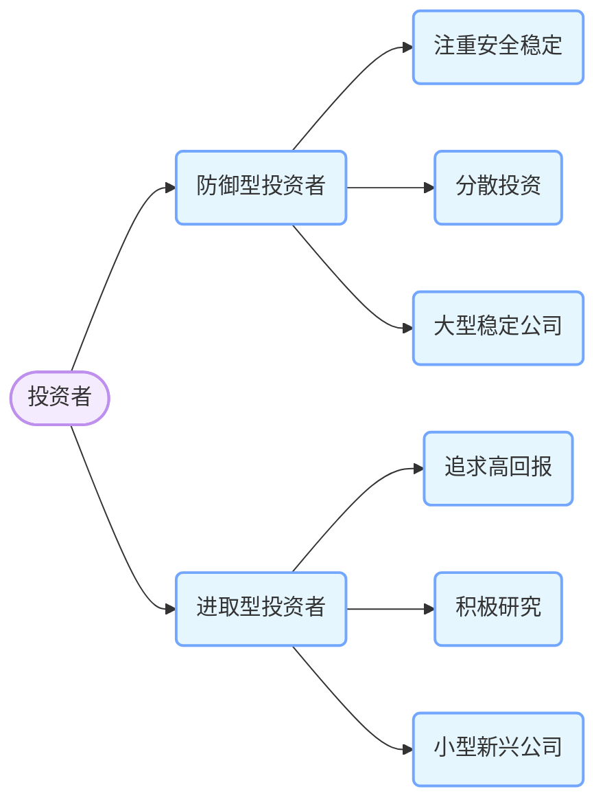

# 格雷厄姆的防御型和进取型投资者：找到适合自己的策略

> 关键词：格雷厄姆、防御型投资者、进取型投资者、投资策略、价值投资

> 摘要：本文深入探讨了格雷厄姆提出的防御型和进取型投资者两种不同的投资类型及其对应的投资策略。详细介绍了这两种策略的核心概念、原理、数学模型，通过具体的代码案例展示其在实际中的应用，分析了它们的实际应用场景。同时，推荐了相关的学习资源、开发工具和论文著作。最后总结了未来投资领域的发展趋势与挑战，并对常见问题进行解答，旨在帮助投资者找到适合自己的投资策略，在投资市场中做出更明智的决策。

## 1. 背景介绍 
### 1.1 目的和范围
在投资领域，不同的投资者由于风险承受能力、投资目标、知识储备和时间精力等因素的差异，需要不同的投资策略。本杰明·格雷厄姆作为价值投资理论的奠基人，提出了防御型和进取型投资者的分类及相应策略，为投资者提供了重要的指导。本文的目的在于全面深入地解读这两种投资策略，分析它们的特点、适用场景和操作方法，帮助投资者准确判断自己属于哪种类型的投资者，并选择适合自己的投资策略。范围涵盖了投资策略的理论基础、算法原理、实际应用以及相关的学习资源和发展趋势等方面。

### 1.2 预期读者
本文预期读者包括各类投资者，无论是初涉投资领域的新手，希望通过学习找到适合自己的投资方向；还是有一定投资经验的投资者，想要深入理解格雷厄姆的投资理念，优化自己的投资策略。同时，也适合对金融投资理论感兴趣的学者和研究人员阅读，为他们的研究提供参考。

### 1.3 文档结构概述
本文首先介绍了格雷厄姆投资理论的背景信息，包括目的、预期读者和文档结构。接着阐述了防御型和进取型投资者的核心概念及其联系，通过文本示意图和 Mermaid 流程图进行直观展示。然后详细讲解了核心算法原理和具体操作步骤，并用 Python 源代码进行说明。之后介绍了相关的数学模型和公式，并举例说明。在项目实战部分，给出了代码实际案例和详细解释。随后分析了这两种投资策略的实际应用场景。再推荐了相关的工具和资源，包括学习资源、开发工具框架和论文著作。最后总结了未来投资领域的发展趋势与挑战，解答了常见问题，并提供了扩展阅读和参考资料。

### 1.4 术语表
#### 1.4.1 核心术语定义
- **防御型投资者**：格雷厄姆定义的一类投资者，他们通常缺乏时间、知识或意愿去深入研究和分析投资，更注重资产的安全性和稳定性，追求长期的、较为稳健的投资回报，避免过度冒险。
- **进取型投资者**：这类投资者愿意花费时间和精力去研究投资机会，具备一定的投资知识和经验，能够承受较高的风险，追求更高的投资回报，积极主动地寻找被市场低估的投资标的。
- **价值投资**：一种投资理念，强调通过对企业内在价值的分析，寻找价格低于其内在价值的投资标的，以获取长期的投资收益。

#### 1.4.2 相关概念解释
- **内在价值**：企业或资产本身所具有的价值，它基于企业的财务状况、盈利能力、行业前景等基本面因素，是价值投资中判断投资标的是否值得投资的重要依据。
- **安全边际**：指投资标的的市场价格低于其内在价值的部分，安全边际越大，投资的风险越小，潜在的回报越高。

#### 1.4.3 缩略词列表
- **PE**：市盈率（Price - Earnings Ratio），是指股票价格除以每股收益的比率，用于衡量股票的估值水平。
- **PB**：市净率（Price - Book Ratio），是指股票价格与每股净资产的比率，反映了市场对企业净资产的估值。

## 2. 核心概念与联系 

### 防御型投资者
防御型投资者的核心目标是保护资本并获得稳定的回报。他们通常采用分散投资的方式，将资金分配到不同的资产类别，如股票、债券等，以降低风险。防御型投资者更倾向于投资大型、知名、财务状况稳定的公司，这些公司通常具有较强的市场竞争力和抗风险能力。他们不太关注短期的市场波动，而是注重长期的投资价值。

### 进取型投资者
进取型投资者则追求更高的投资回报，愿意承担更高的风险。他们会花费大量的时间和精力去研究市场和公司，寻找被市场低估的投资机会。进取型投资者可能会投资一些小型、新兴的公司，这些公司虽然具有较高的风险，但也可能带来更高的回报。他们对市场波动更为敏感，善于把握市场时机，进行积极的投资操作。

### 两者的联系
防御型投资者和进取型投资者并不是完全对立的，他们都基于价值投资的理念。两者的区别主要在于风险承受能力、投资目标和投资操作的积极程度。在实际投资中，投资者的类型也不是固定不变的，随着投资经验的积累和个人情况的变化，投资者可能会从防御型转变为进取型，或者在不同的投资阶段采用不同的投资策略。

### 文本示意图
```plaintext
              投资者
             /       \
  防御型投资者    进取型投资者
    |                |
  注重安全稳定     追求高回报
    |                |
  分散投资         积极研究
    |                |
  大型稳定公司     小型新兴公司
```

### Mermaid 流程图


## 3. 核心算法原理 & 具体操作步骤 

### 防御型投资者的核心算法原理
防御型投资者的核心算法原理在于通过合理的资产配置和选择优质的投资标的来降低风险，实现稳定的回报。一种常见的资产配置方法是采用固定比例的股票和债券组合，例如 60% 的股票和 40% 的债券。在选择股票时，防御型投资者通常会关注公司的基本面指标，如市盈率（PE）、市净率（PB）、股息率等。一般来说，他们会选择市盈率和市净率较低、股息率较高的公司，这些公司通常具有较强的盈利能力和财务稳定性。

以下是一个简单的 Python 代码示例，用于筛选符合防御型投资者标准的股票：
```python
import pandas as pd

# 模拟股票数据
data = {
    '股票代码': ['000001', '000002', '000003', '000004'],
    '市盈率': [10, 20, 15, 30],
    '市净率': [1.5, 2.5, 2, 3],
    '股息率': [0.05, 0.03, 0.04, 0.02]
}

df = pd.DataFrame(data)

# 筛选条件
pe_threshold = 18
pb_threshold = 2.2
dividend_yield_threshold = 0.035

# 筛选符合条件的股票
selected_stocks = df[(df['市盈率'] < pe_threshold) & (df['市净率'] < pb_threshold) & (df['股息率'] > dividend_yield_threshold)]

print(selected_stocks)
```
### 具体操作步骤
1. **确定资产配置比例**：根据自己的风险承受能力和投资目标，确定股票和债券的投资比例。
2. **收集股票数据**：收集市场上股票的基本面数据，如市盈率、市净率、股息率等。
3. **设置筛选条件**：根据防御型投资者的标准，设置市盈率、市净率、股息率等指标的阈值。
4. **筛选股票**：使用代码或手动筛选，找出符合条件的股票。
5. **构建投资组合**：将筛选出的股票按照一定的比例构建投资组合。

### 进取型投资者的核心算法原理
进取型投资者的核心算法原理在于寻找被市场低估的投资机会，通过深入的基本面分析和市场研究，挖掘具有成长潜力的公司。他们通常会使用一些估值模型，如现金流折现模型（DCF）来评估公司的内在价值。现金流折现模型的基本思想是将公司未来的现金流折现到当前，以确定公司的内在价值。

以下是一个简单的 Python 代码示例，用于计算公司的内在价值：
```python
def dcf_valuation(cash_flows, discount_rate):
    """
    现金流折现模型计算公司内在价值
    :param cash_flows: 未来各期的现金流列表
    :param discount_rate: 折现率
    :return: 公司的内在价值
    """
    intrinsic_value = 0
    for i, cash_flow in enumerate(cash_flows):
        present_value = cash_flow / (1 + discount_rate) ** (i + 1)
        intrinsic_value += present_value
    return intrinsic_value

# 示例数据
cash_flows = [100, 120, 150, 180, 200]
discount_rate = 0.1

# 计算内在价值
intrinsic_value = dcf_valuation(cash_flows, discount_rate)
print(f"公司的内在价值: {intrinsic_value}")
```
### 具体操作步骤
1. **选择投资标的**：通过行业研究、公司调研等方式，选择具有成长潜力的公司。
2. **预测现金流**：对公司未来的现金流进行预测，可以采用历史数据分析、行业趋势分析等方法。
3. **确定折现率**：根据市场情况和公司的风险水平，确定合适的折现率。
4. **计算内在价值**：使用现金流折现模型计算公司的内在价值。
5. **比较市场价格和内在价值**：如果市场价格低于内在价值，说明该股票被低估，可以考虑投资。

## 4. 数学模型和公式 & 详细讲解 & 举例说明 

### 防御型投资者相关数学模型和公式
#### 市盈率（PE）
市盈率是股票价格除以每股收益的比率，公式为：
$$PE = \frac{P}{EPS}$$
其中，$P$ 表示股票价格，$EPS$ 表示每股收益。市盈率反映了市场对公司盈利能力的预期，较低的市盈率通常表示股票被低估。

例如，某公司股票价格为 20 元，每股收益为 2 元，则该公司的市盈率为：
$$PE = \frac{20}{2} = 10$$

#### 市净率（PB）
市净率是股票价格与每股净资产的比率，公式为：
$$PB = \frac{P}{BVPS}$$
其中，$P$ 表示股票价格，$BVPS$ 表示每股净资产。市净率反映了市场对公司净资产的估值，较低的市净率通常表示股票被低估。

例如，某公司股票价格为 15 元，每股净资产为 5 元，则该公司的市净率为：
$$PB = \frac{15}{5} = 3$$

#### 股息率
股息率是股息与股票价格的比率，公式为：
$$股息率 = \frac{D}{P}$$
其中，$D$ 表示每股股息，$P$ 表示股票价格。股息率反映了公司的分红水平，较高的股息率通常表示公司具有较好的盈利能力和现金分红能力。

例如，某公司每股股息为 0.5 元，股票价格为 20 元，则该公司的股息率为：
$$股息率 = \frac{0.5}{20} = 0.025 = 2.5\%$$

### 进取型投资者相关数学模型和公式
#### 现金流折现模型（DCF）
现金流折现模型的基本公式为：
$$V = \sum_{t = 1}^{n} \frac{CF_t}{(1 + r)^t}$$
其中，$V$ 表示公司的内在价值，$CF_t$ 表示第 $t$ 期的现金流，$r$ 表示折现率，$n$ 表示预测期数。

例如，某公司未来 5 年的现金流分别为 100 万元、120 万元、150 万元、180 万元、200 万元，折现率为 10%，则该公司的内在价值为：
$$V = \frac{100}{(1 + 0.1)^1} + \frac{120}{(1 + 0.1)^2} + \frac{150}{(1 + 0.1)^3} + \frac{180}{(1 + 0.1)^4} + \frac{200}{(1 + 0.1)^5}$$
$$V \approx 90.91 + 99.17 + 112.70 + 122.94 + 124.18 = 549.90$$（万元）

## 5. 项目实战：代码实际案例和详细解释说明 

### 5.1  开发环境搭建
- **Python 安装**：从 Python 官方网站（https://www.python.org/downloads/）下载并安装适合你操作系统的 Python 版本，建议安装 Python 3.7 及以上版本。
- **开发工具**：可以使用 PyCharm、Jupyter Notebook 等开发工具。这里以 Jupyter Notebook 为例，安装步骤如下：
  - 打开命令行工具，输入以下命令安装 Jupyter Notebook：
    ```sh
    pip install jupyter notebook
    ```
  - 安装完成后，在命令行中输入以下命令启动 Jupyter Notebook：
    ```sh
    jupyter notebook
    ```
  - 浏览器会自动打开 Jupyter Notebook 的界面，你可以在其中创建和运行 Python 代码。
- **第三方库安装**：在本项目中，我们需要使用 `pandas` 库进行数据处理，使用以下命令安装：
  ```sh
  pip install pandas
  ```

### 5.2  源代码详细实现和代码解读
#### 防御型投资者股票筛选代码
```python
import pandas as pd

# 模拟股票数据
data = {
    '股票代码': ['000001', '000002', '000003', '000004'],
    '市盈率': [10, 20, 15, 30],
    '市净率': [1.5, 2.5, 2, 3],
    '股息率': [0.05, 0.03, 0.04, 0.02]
}

df = pd.DataFrame(data)

# 筛选条件
pe_threshold = 18
pb_threshold = 2.2
dividend_yield_threshold = 0.035

# 筛选符合条件的股票
selected_stocks = df[(df['市盈率'] < pe_threshold) & (df['市净率'] < pb_threshold) & (df['股息率'] > dividend_yield_threshold)]

print(selected_stocks)
```
**代码解读**：
1. **导入库**：`import pandas as pd` 导入 `pandas` 库，用于数据处理。
2. **模拟股票数据**：创建一个字典 `data`，包含股票代码、市盈率、市净率和股息率等信息，然后使用 `pd.DataFrame(data)` 将其转换为 `DataFrame` 对象。
3. **设置筛选条件**：定义市盈率、市净率和股息率的阈值。
4. **筛选股票**：使用布尔索引筛选出符合条件的股票，即市盈率低于阈值、市净率低于阈值且股息率高于阈值的股票。
5. **打印结果**：使用 `print(selected_stocks)` 打印筛选出的股票信息。

#### 进取型投资者现金流折现模型代码
```python
def dcf_valuation(cash_flows, discount_rate):
    """
    现金流折现模型计算公司内在价值
    :param cash_flows: 未来各期的现金流列表
    :param discount_rate: 折现率
    :return: 公司的内在价值
    """
    intrinsic_value = 0
    for i, cash_flow in enumerate(cash_flows):
        present_value = cash_flow / (1 + discount_rate) ** (i + 1)
        intrinsic_value += present_value
    return intrinsic_value

# 示例数据
cash_flows = [100, 120, 150, 180, 200]
discount_rate = 0.1

# 计算内在价值
intrinsic_value = dcf_valuation(cash_flows, discount_rate)
print(f"公司的内在价值: {intrinsic_value}")
```
**代码解读**：
1. **定义函数**：`def dcf_valuation(cash_flows, discount_rate)` 定义一个名为 `dcf_valuation` 的函数，用于计算公司的内在价值。
2. **初始化变量**：`intrinsic_value = 0` 初始化公司的内在价值为 0。
3. **计算现值**：使用 `for` 循环遍历未来各期的现金流，计算每期现金流的现值，并累加到 `intrinsic_value` 中。
4. **返回结果**：`return intrinsic_value` 返回公司的内在价值。
5. **示例数据和计算**：定义示例数据 `cash_flows` 和 `discount_rate`，调用 `dcf_valuation` 函数计算公司的内在价值，并打印结果。

### 5.3  代码解读与分析
#### 防御型投资者代码分析
- **优点**：代码简单易懂，通过设置筛选条件可以快速筛选出符合防御型投资者标准的股票，有助于投资者降低风险，选择优质的投资标的。
- **缺点**：数据是模拟的，实际应用中需要从真实数据源获取股票数据。而且筛选条件是固定的，可能无法适应不同市场环境和投资者需求。

#### 进取型投资者代码分析
- **优点**：现金流折现模型是一种较为科学的估值方法，能够考虑公司未来的现金流和时间价值，有助于进取型投资者寻找被低估的投资机会。
- **缺点**：现金流的预测和折现率的确定具有一定的主观性，不同的预测和折现率可能会导致不同的内在价值计算结果。而且模型假设公司未来的现金流是稳定可预测的，实际情况可能并非如此。

## 6. 实际应用场景 
### 防御型投资者的实际应用场景
- **退休人员**：退休人员通常希望保护自己的资产，获得稳定的收入，以满足日常生活的需求。防御型投资策略注重资产的安全性和稳定性，通过分散投资和选择优质的大型公司股票和债券，可以降低投资风险，确保资产的保值增值。
- **风险承受能力较低的投资者**：一些投资者由于财务状况、投资目标等原因，风险承受能力较低。他们更愿意接受较为稳定的投资回报，而不愿意承担过高的风险。防御型投资策略适合这类投资者，能够在保证资产安全的前提下，实现一定的收益。
- **缺乏投资经验和时间的投资者**：对于一些没有太多投资经验和时间去研究市场和公司的投资者来说，防御型投资策略是一种较为简单有效的投资方式。他们可以通过选择一些指数基金、大型蓝筹股等，实现资产的合理配置，而无需花费过多的精力去分析和研究。

### 进取型投资者的实际应用场景
- **年轻投资者**：年轻投资者通常具有较长的投资周期，能够承受较高的风险。他们希望通过积极的投资操作，获取更高的投资回报，实现资产的快速增长。进取型投资策略适合年轻投资者，他们可以通过深入研究市场和公司，寻找具有成长潜力的投资机会，获得超额收益。
- **专业投资者**：专业投资者具备丰富的投资知识和经验，能够对市场和公司进行深入的分析和研究。他们善于把握市场时机，进行积极的投资操作。进取型投资策略能够充分发挥他们的专业优势，实现更高的投资回报。
- **追求高收益的投资者**：一些投资者对投资回报有较高的期望，愿意承担较高的风险来追求更高的收益。进取型投资策略通过寻找被市场低估的投资机会，投资一些小型、新兴的公司，有可能获得较高的投资回报，满足这类投资者的需求。

## 7. 工具和资源推荐
### 7.1 学习资源推荐
#### 7.1.1 书籍推荐
- 《聪明的投资者》（The Intelligent Investor）：本杰明·格雷厄姆的经典著作，被誉为投资界的圣经，详细阐述了价值投资的理念和方法，包括防御型和进取型投资者的投资策略。
- 《证券分析》（Security Analysis）：同样是格雷厄姆的著作，是价值投资理论的奠基之作，对股票和债券的分析方法进行了深入的探讨。
- 《巴菲特致股东的信》（Letters to Shareholders of Berkshire Hathaway）：沃伦·巴菲特作为格雷厄姆的学生，继承和发展了价值投资理论。这本书收录了巴菲特致股东的信，通过这些信件可以了解巴菲特的投资理念和实践经验。

#### 7.1.2 在线课程
- Coursera 上的“投资学原理”（Principles of Investing）：该课程由知名大学的教授授课，系统地介绍了投资学的基本原理和方法，包括资产配置、股票估值、债券投资等内容。
- edX 上的“金融市场”（Financial Markets）：由耶鲁大学教授罗伯特·席勒（Robert Shiller）授课，深入探讨了金融市场的运行机制和投资策略。

#### 7.1.3 技术博客和网站
- 雪球网（https://xueqiu.com/）：国内知名的投资社区，提供股票、基金、债券等投资产品的资讯、分析和讨论，投资者可以在这里交流投资经验和分享投资观点。
- Seeking Alpha（https://seekingalpha.com/）：国外知名的投资研究网站，提供全球金融市场的分析报告、投资策略和公司评级等内容，是投资者获取投资信息和研究报告的重要来源。

### 7.2 开发工具框架推荐
#### 7.2.1 IDE和编辑器
- PyCharm：一款专业的 Python 集成开发环境（IDE），具有强大的代码编辑、调试、代码分析等功能，适合开发复杂的 Python 项目。
- Jupyter Notebook：一个开源的交互式计算环境，支持多种编程语言，尤其适合数据处理和分析。它可以将代码、文本、图表等内容整合在一个文档中，方便进行数据探索和分析。

#### 7.2.2 调试和性能分析工具
- PDB：Python 自带的调试器，可以在代码中设置断点，逐行执行代码，查看变量的值和程序的执行流程，帮助开发者调试代码。
- cProfile：Python 标准库中的性能分析工具，可以分析代码的运行时间和函数调用次数，找出代码中的性能瓶颈。

#### 7.2.3 相关框架和库
- Pandas：一个强大的数据处理和分析库，提供了 DataFrame、Series 等数据结构，方便进行数据的读取、清洗、分析和可视化。
- NumPy：一个用于科学计算的基础库，提供了高效的多维数组对象和数学函数，是许多数据分析和机器学习库的基础。

### 7.3 相关论文著作推荐
#### 7.3.1 经典论文
- 《The Theory of Investment Value》：由约翰·伯尔·威廉姆斯（John Burr Williams）撰写，提出了现金流折现模型的基本思想，对价值投资理论的发展产生了重要影响。
- 《Capital Asset Pricing Model (CAPM)》：由威廉·夏普（William Sharpe）等人提出，是现代金融理论中的重要模型，用于描述资产的预期收益率与风险之间的关系。

#### 7.3.2 最新研究成果
- 关注《Journal of Finance》、《Review of Financial Studies》等顶级金融学术期刊，这些期刊发表了许多关于投资理论、资产定价、风险管理等方面的最新研究成果。
- 参加金融学术会议，如美国金融协会（American Finance Association）年会等，了解金融领域的最新研究动态和前沿技术。

#### 7.3.3 应用案例分析
- 可以参考一些知名投资机构的研究报告和案例分析，了解他们在实际投资中如何应用防御型和进取型投资策略，以及如何进行资产配置和风险管理。
- 分析一些成功投资者的投资案例，如巴菲特的投资组合和投资决策过程，从中学习他们的投资理念和方法。

## 8. 总结：未来发展趋势与挑战
### 未来发展趋势
- **数字化和智能化**：随着科技的不断发展，投资领域将越来越数字化和智能化。人工智能、大数据、区块链等技术将在投资分析、风险评估、资产配置等方面发挥重要作用。例如，人工智能可以通过对大量数据的分析和学习，提供更准确的投资建议；区块链技术可以提高投资交易的透明度和安全性。
- **可持续投资**：越来越多的投资者开始关注环境、社会和治理（ESG）因素，将可持续发展理念纳入投资决策中。可持续投资不仅可以实现经济回报，还可以为社会和环境做出贡献。未来，可持续投资将成为投资领域的重要发展方向。
- **全球一体化**：随着全球经济的一体化和金融市场的互联互通，投资者的投资范围将越来越广泛。跨境投资、全球资产配置将成为常态，投资者需要更加了解不同国家和地区的市场环境和投资规则。

### 挑战
- **市场不确定性增加**：全球政治、经济形势的不确定性增加，如贸易摩擦、地缘政治冲突、经济衰退等，将导致市场波动加剧，投资风险增大。投资者需要更加谨慎地进行投资决策，加强风险管理。
- **技术变革带来的挑战**：虽然科技的发展为投资带来了机遇，但也带来了一些挑战。例如，人工智能和大数据技术的应用可能会导致数据隐私和安全问题，投资者需要加强对数据的保护和管理。同时，技术的快速发展也要求投资者不断学习和更新知识，以适应市场的变化。
- **投资者教育不足**：许多投资者缺乏必要的投资知识和经验，容易受到市场情绪和谣言的影响，做出不理性的投资决策。因此，加强投资者教育，提高投资者的风险意识和投资能力，是投资领域面临的重要挑战之一。

## 9. 附录：常见问题与解答
### 防御型投资者相关问题
- **问**：防御型投资者是否完全不考虑股票投资？
**答**：不是的，防御型投资者会进行股票投资，但通常会选择大型、知名、财务状况稳定的公司股票，并且会通过分散投资的方式降低风险。股票投资在防御型投资者的资产配置中通常占一定比例，如 40% - 60% 。
- **问**：防御型投资者如何选择债券？
**答**：防御型投资者选择债券时，通常会关注债券的信用评级、收益率、期限等因素。他们会选择信用评级较高、收益率相对稳定、期限适中的债券，以确保资产的安全性和稳定性。

### 进取型投资者相关问题
- **问**：进取型投资者如何控制风险？
**答**：进取型投资者虽然追求高回报，但也会注重风险控制。他们会通过深入的基本面分析和市场研究，选择具有成长潜力和安全边际的投资标的。同时，他们也会进行分散投资，避免过度集中投资于某一行业或某一公司。此外，进取型投资者还会设置止损点，及时止损，控制投资损失。
- **问**：现金流折现模型的预测数据不准确怎么办？
**答**：现金流折现模型的预测数据确实具有一定的主观性和不确定性。为了减少这种不确定性，进取型投资者可以采用多种方法进行预测，如历史数据分析、行业趋势分析、专家意见等。同时，他们也可以进行敏感性分析，分析不同预测数据对内在价值计算结果的影响，以评估投资的风险和收益。

## 10. 扩展阅读 & 参考资料
### 扩展阅读
- 《漫步华尔街》（A Random Walk Down Wall Street）：这本书介绍了各种投资理论和投资策略，包括有效市场假说、技术分析、基本面分析等，对投资者了解投资市场和投资方法有很大的帮助。
- 《金融炼金术》（The Alchemy of Finance）：乔治·索罗斯（George Soros）的著作，阐述了他的反身性理论和投资哲学，对投资者理解市场的运行机制和投资决策有一定的启发。

### 参考资料
- 本杰明·格雷厄姆的《聪明的投资者》、《证券分析》等原著。
- 相关金融学术期刊和研究报告，如《Journal of Finance》、《Review of Financial Studies》等。
- 雪球网、Seeking Alpha 等投资社区和网站的相关文章和讨论。