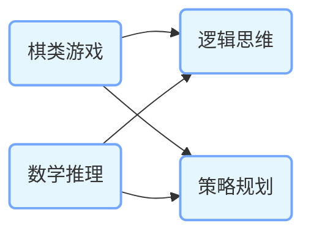

# 棋类游戏与数学推理:AI能力的对比研究

> 关键词：棋类游戏、数学推理、AI能力、对比研究、博弈算法、深度学习

> 摘要：本文聚焦于棋类游戏与数学推理中AI能力的对比研究。通过深入分析棋类游戏和数学推理的特点、核心概念，详细阐述相关算法原理及操作步骤，构建数学模型并举例说明。借助项目实战展示AI在这两个领域的代码实现与应用，探讨其实际应用场景。同时推荐相关的学习资源、开发工具框架及论文著作，最后总结AI在棋类游戏和数学推理领域的未来发展趋势与挑战，旨在为相关研究和实践提供全面且深入的参考。

## 1. 背景介绍 
### 1.1 目的和范围
本研究的主要目的是全面且深入地对比AI在棋类游戏和数学推理领域的能力。棋类游戏作为一种具有明确规则和竞争性质的活动，对AI的博弈策略、搜索算法等方面的能力有着较高要求。而数学推理则侧重于逻辑思维、问题求解和抽象建模等能力。通过对比这两个领域中AI的表现，能够更好地理解AI在不同类型任务中的优势和局限性，为进一步提升AI的综合能力提供理论和实践依据。

研究范围涵盖了常见的棋类游戏，如国际象棋、围棋、中国象棋等，以及多种数学推理任务，包括代数问题求解、几何证明、逻辑推理等。同时，会涉及到不同类型的AI技术和算法，如搜索算法、机器学习、深度学习等在这两个领域的应用。

### 1.2 预期读者
本文预期读者包括对AI技术感兴趣的研究人员、程序员、学生，以及从事棋类游戏和数学教育的专业人士。对于研究人员，本文可以为他们的研究方向提供新的思路和参考；程序员可以从文中的算法原理和代码实现中获取技术灵感，应用到实际开发中；学生能够通过阅读本文，了解AI在不同领域的应用，拓宽知识面；棋类游戏和数学教育工作者可以借助本文的研究成果，探索如何利用AI提升教学效果。

### 1.3 文档结构概述
本文将按照以下结构进行组织：首先介绍核心概念与联系，包括棋类游戏和数学推理的基本概念、两者之间的联系以及相关的架构示意图和流程图；接着详细阐述核心算法原理和具体操作步骤，并用Python代码进行说明；然后构建数学模型，给出相关公式并举例说明；通过项目实战展示AI在棋类游戏和数学推理中的代码实现和详细解释；探讨实际应用场景；推荐相关的工具和资源；总结未来发展趋势与挑战；提供附录，解答常见问题；最后列出扩展阅读和参考资料。

### 1.4 术语表
#### 1.4.1 核心术语定义
- **AI（Artificial Intelligence）**：即人工智能，是研究、开发用于模拟、延伸和扩展人的智能的理论、方法、技术及应用系统的一门新的技术科学。
- **棋类游戏**：是一类具有明确规则和目标的策略性游戏，玩家通过在棋盘上移动棋子来竞争胜利。
- **数学推理**：是指从一些事实和命题出发，依据规则推出其他命题的思维过程。
- **博弈算法**：是用于在博弈环境中寻找最优策略的算法，常见的有极小极大算法、α - β剪枝算法等。
- **深度学习**：是机器学习的一个分支领域，它是一种基于对数据进行表征学习的方法，通过构建深度神经网络来学习数据的复杂模式。

#### 1.4.2 相关概念解释
- **搜索树**：在棋类游戏中，搜索树是一种用于表示所有可能的游戏状态和行动序列的树结构。每个节点代表一个游戏状态，每条边代表一个可能的行动。
- **启发式函数**：是一种用于评估游戏状态优劣的函数，它可以帮助AI在搜索过程中更快地找到最优策略。
- **逻辑推理规则**：在数学推理中，逻辑推理规则是指用于从已知命题推导出新命题的规则，如三段论、假言推理等。

#### 1.4.3 缩略词列表
- **AI**：Artificial Intelligence（人工智能）
- **ML**：Machine Learning（机器学习）
- **DL**：Deep Learning（深度学习）
- **MCTS**：Monte Carlo Tree Search（蒙特卡罗树搜索）

## 2. 核心概念与联系 

### 棋类游戏的核心概念
棋类游戏通常具有明确的规则和目标。以国际象棋为例，棋盘由64个格子组成，双方各有16个棋子，包括王、后、车、象、马、兵等。游戏的目标是将对方的王逼入绝境，即“将死”。在游戏过程中，玩家需要根据当前的棋局状态，选择合适的棋子移动方式，以达到进攻或防守的目的。

### 数学推理的核心概念
数学推理是从已知的数学事实和命题出发，依据逻辑规则推导出新的数学命题的过程。例如，在代数中，我们可以根据已知的方程和运算法则，求解未知数的值；在几何中，我们可以根据已知的图形性质和定理，证明其他图形的性质。

### 两者的联系
棋类游戏和数学推理都需要逻辑思维和策略规划。在棋类游戏中，玩家需要预测对手的行动，并制定相应的策略来取得胜利；在数学推理中，我们需要根据已知条件，选择合适的推理规则和方法，逐步推导出结论。此外，两者都可以用抽象的模型来表示，棋类游戏可以用搜索树来表示所有可能的游戏状态和行动序列，数学推理可以用逻辑表达式和证明树来表示推理过程。

### 文本示意图
棋类游戏和数学推理的联系可以用以下文本示意图表示：

棋类游戏 <-- 逻辑思维、策略规划 --> 数学推理

### Mermaid 流程图


## 3. 核心算法原理 & 具体操作步骤 

### 棋类游戏中的博弈算法 - 极小极大算法
极小极大算法是一种用于在博弈环境中寻找最优策略的算法。其基本思想是假设对手总是采取最优的行动，因此在评估当前状态时，需要考虑对手的所有可能行动，并选择对自己最有利的行动。

以下是极小极大算法的Python实现：
```python
def minimax(state, depth, maximizing_player):
    if depth == 0 or is_terminal(state):
        return evaluate(state)
    if maximizing_player:
        max_eval = float('-inf')
        for action in get_possible_actions(state):
            new_state = make_move(state, action)
            eval = minimax(new_state, depth - 1, False)
            max_eval = max(max_eval, eval)
        return max_eval
    else:
        min_eval = float('inf')
        for action in get_possible_actions(state):
            new_state = make_move(state, action)
            eval = minimax(new_state, depth - 1, True)
            min_eval = min(min_eval, eval)
        return min_eval
```
### 操作步骤
1. **初始化**：设置搜索深度`depth`和当前玩家是否为最大化玩家`maximizing_player`。
2. **终止条件判断**：如果搜索深度为0或者当前状态为终止状态，则返回当前状态的评估值。
3. **最大化玩家行动**：如果当前玩家是最大化玩家，则遍历所有可能的行动，对每个行动生成新的状态，并递归调用`minimax`函数，选择评估值最大的行动。
4. **最小化玩家行动**：如果当前玩家是最小化玩家，则遍历所有可能的行动，对每个行动生成新的状态，并递归调用`minimax`函数，选择评估值最小的行动。

### 数学推理中的搜索算法 - 宽度优先搜索
宽度优先搜索是一种用于在图或树中搜索目标节点的算法。在数学推理中，可以用宽度优先搜索来寻找从已知条件到结论的推理路径。

以下是宽度优先搜索的Python实现：
```python
from collections import deque

def breadth_first_search(start_state, goal_state):
    queue = deque([(start_state, [])])
    visited = set()
    while queue:
        current_state, path = queue.popleft()
        if current_state == goal_state:
            return path
        if current_state not in visited:
            visited.add(current_state)
            for next_state in get_next_states(current_state):
                new_path = path + [next_state]
                queue.append((next_state, new_path))
    return None
```
### 操作步骤
1. **初始化**：将起始状态和空路径加入队列，并创建一个空的访问集合。
2. **队列处理**：从队列中取出一个状态和对应的路径，如果该状态等于目标状态，则返回路径。
3. **访问检查**：如果该状态未被访问过，则将其标记为已访问，并将其所有可能的下一个状态和对应的新路径加入队列。
4. **终止条件**：如果队列为空，则表示没有找到目标状态，返回`None`。

## 4. 数学模型和公式 & 详细讲解 & 举例说明 

### 棋类游戏中的评估函数模型
在棋类游戏中，评估函数用于评估当前棋局状态的优劣。一种常见的评估函数是基于棋子价值的线性组合。假设每个棋子有一个固定的价值，如国际象棋中，兵的价值为1，马和象的价值为3，车的价值为5，后的价值为9，王的价值为无穷大。则评估函数可以表示为：

$$V(s) = \sum_{i \in P_1} v_i - \sum_{j \in P_2} v_j$$

其中，$V(s)$ 表示状态 $s$ 的评估值，$P_1$ 表示当前玩家的棋子集合，$P_2$ 表示对手的棋子集合，$v_i$ 和 $v_j$ 分别表示棋子 $i$ 和 $j$ 的价值。

**举例说明**：在一个国际象棋棋局中，当前玩家有一个后、两个车和三个兵，对手有一个马、两个象和四个兵。则评估值为：

$V(s) = (9 + 2 \times 5 + 3 \times 1) - (3 + 2 \times 3 + 4 \times 1) = 22 - 13 = 9$

### 数学推理中的逻辑推理规则模型
在数学推理中，逻辑推理规则可以用命题逻辑和谓词逻辑来表示。例如，三段论规则可以表示为：

如果 $P \to Q$ 和 $P$ 为真，则 $Q$ 为真。

用符号表示为：

$$\frac{P \to Q, P}{Q}$$

**举例说明**：已知命题“如果一个数是偶数，则它能被2整除”（$P \to Q$）和“20是偶数”（$P$），根据三段论规则，可以推出“20能被2整除”（$Q$）。

## 5. 项目实战：代码实际案例和详细解释说明 

### 5.1  开发环境搭建
- **编程语言**：Python 3.x
- **开发工具**：PyCharm 或 VS Code
- **相关库**：NumPy、Matplotlib（可选，用于可视化）

### 5.2  源代码详细实现和代码解读
#### 棋类游戏 - 简单的井字棋AI
```python
import random

# 定义棋盘
board = [' ' for _ in range(9)]

# 定义玩家和AI的标记
PLAYER = 'X'
AI = 'O'

# 打印棋盘
def print_board(board):
    print(f'{board[0]}|{board[1]}|{board[2]}')
    print('-+-+-')
    print(f'{board[3]}|{board[4]}|{board[5]}')
    print('-+-+-')
    print(f'{board[6]}|{board[7]}|{board[8]}')

# 检查是否有玩家获胜
def check_winner(board, player):
    winning_combinations = [
        [0, 1, 2], [3, 4, 5], [6, 7, 8],  # 行
        [0, 3, 6], [1, 4, 7], [2, 5, 8],  # 列
        [0, 4, 8], [2, 4, 6]  # 对角线
    ]
    for combination in winning_combinations:
        if all(board[i] == player for i in combination):
            return True
    return False

# 检查棋盘是否已满
def is_full(board):
    return ' ' not in board

# AI的简单策略 - 随机选择空位
def ai_move(board):
    available_moves = [i for i in range(9) if board[i] == ' ']
    move = random.choice(available_moves)
    board[move] = AI

# 玩家的移动
def player_move(board):
    while True:
        try:
            move = int(input("请输入你的移动位置 (0-8): "))
            if 0 <= move <= 8 and board[move] == ' ':
                board[move] = PLAYER
                break
            else:
                print("无效的移动，请重新输入。")
        except ValueError:
            print("输入无效，请输入一个数字。")

# 主游戏循环
def play_game():
    while True:
        print_board(board)
        player_move(board)
        if check_winner(board, PLAYER):
            print_board(board)
            print("你赢了！")
            break
        if is_full(board):
            print_board(board)
            print("平局！")
            break
        ai_move(board)
        if check_winner(board, AI):
            print_board(board)
            print("AI赢了！")
            break
        if is_full(board):
            print_board(board)
            print("平局！")
            break

if __name__ == "__main__":
    play_game()
```
**代码解读**：
- **棋盘表示**：使用一个长度为9的列表来表示井字棋的棋盘，每个元素代表一个格子的状态。
- **获胜检查**：定义了所有可能的获胜组合，通过检查这些组合是否都被同一个玩家占据来判断是否有玩家获胜。
- **AI策略**：AI采用随机选择空位的简单策略。
- **玩家移动**：玩家通过输入一个0 - 8的数字来选择移动位置，程序会检查输入的有效性。
- **主游戏循环**：交替进行玩家和AI的移动，每次移动后检查是否有玩家获胜或棋盘是否已满。

#### 数学推理 - 简单的代数方程求解器
```python
import sympy as sp

# 定义符号变量
x = sp.Symbol('x')

# 定义方程
equation = sp.Eq(2 * x + 5, 13)

# 求解方程
solution = sp.solve(equation, x)

# 输出结果
print(f"方程 {equation} 的解为: {solution}")
```
**代码解读**：
- **符号变量定义**：使用`sympy`库定义符号变量`x`。
- **方程定义**：使用`sp.Eq`函数定义方程`2 * x + 5 = 13`。
- **方程求解**：使用`sp.solve`函数求解方程，返回所有可能的解。
- **结果输出**：打印方程的解。

### 5.3  代码解读与分析
#### 棋类游戏代码分析
- **优点**：代码简单易懂，实现了井字棋的基本功能，包括棋盘显示、玩家和AI的移动、获胜检查等。
- **缺点**：AI的策略比较简单，只是随机选择空位，没有考虑到棋局的实际情况。可以通过使用更复杂的博弈算法，如极小极大算法，来提高AI的智能水平。

#### 数学推理代码分析
- **优点**：使用`sympy`库可以方便地进行代数方程的求解，代码简洁高效。
- **缺点**：只能处理简单的代数方程，对于更复杂的数学推理任务，如几何证明、逻辑推理等，需要使用更高级的算法和工具。

## 6. 实际应用场景 
### 棋类游戏中的应用
- **棋类游戏教学**：AI可以作为教学工具，帮助初学者学习棋类游戏的规则和策略。例如，通过与AI对弈，初学者可以了解不同棋子的走法和价值，学习如何制定战略和战术。
- **棋类游戏竞赛**：AI可以作为强大的对手，与人类选手进行比赛。一些顶尖的棋类AI，如AlphaGo，已经在围棋领域取得了举世瞩目的成就，推动了棋类游戏的发展。
- **棋类游戏研究**：AI可以用于研究棋类游戏的理论和算法。通过对大量的棋局进行分析和模拟，研究人员可以发现新的策略和规律，提高棋类游戏的竞技水平。

### 数学推理中的应用
- **数学教育**：AI可以作为数学教学的辅助工具，帮助学生理解数学概念和解决数学问题。例如，通过提供解题思路和步骤，AI可以引导学生逐步掌握数学推理的方法和技巧。
- **科学研究**：在科学研究中，数学推理是解决问题的重要手段。AI可以帮助科学家进行复杂的数学计算和推理，加速科学研究的进程。例如，在物理学、工程学等领域，AI可以用于求解复杂的数学模型和方程。
- **人工智能领域**：数学推理是人工智能的重要基础。AI中的许多算法和技术，如机器学习、深度学习等，都依赖于数学推理。通过提高AI的数学推理能力，可以进一步提升其智能水平和应用范围。

## 7. 工具和资源推荐
### 7.1 学习资源推荐
#### 7.1.1 书籍推荐
- 《人工智能：一种现代的方法》：全面介绍了人工智能的基本概念、算法和应用，是人工智能领域的经典教材。
- 《Python机器学习》：详细讲解了Python在机器学习中的应用，包括各种机器学习算法的实现和案例分析。
- 《棋类游戏AI算法与实践》：专注于棋类游戏AI的算法和实现，提供了丰富的代码示例和实践经验。

#### 7.1.2 在线课程
- Coursera上的“人工智能基础”课程：由知名高校的教授授课，系统地介绍了人工智能的基础知识和算法。
- edX上的“机器学习”课程：深入讲解了机器学习的理论和实践，包括监督学习、无监督学习、深度学习等内容。
- 哔哩哔哩上的“棋类游戏AI教程”：由行业专家分享棋类游戏AI的开发经验和技巧，适合初学者学习。

#### 7.1.3 技术博客和网站
- AI研习社：提供了丰富的人工智能技术文章和案例，包括棋类游戏AI和数学推理相关的内容。
- 知乎：有许多关于人工智能和棋类游戏的讨论和分享，可以从中获取最新的研究成果和实践经验。
- GitHub：是开源代码的宝库，可以找到许多棋类游戏AI和数学推理的开源项目，学习他人的代码实现和算法思路。

### 7.2 开发工具框架推荐
#### 7.2.1 IDE和编辑器
- PyCharm：是一款专业的Python集成开发环境，提供了丰富的代码编辑、调试和项目管理功能，适合开发棋类游戏AI和数学推理相关的项目。
- VS Code：是一款轻量级的代码编辑器，支持多种编程语言和插件，具有良好的扩展性和用户体验。

#### 7.2.2 调试和性能分析工具
- PDB：是Python的内置调试器，可以帮助开发者定位和解决代码中的问题。
- cProfile：是Python的性能分析工具，可以分析代码的运行时间和资源消耗，帮助开发者优化代码性能。

#### 7.2.3 相关框架和库
- NumPy：是Python的科学计算库，提供了高效的数组操作和数学函数，常用于处理棋类游戏的棋盘状态和数学推理中的数值计算。
- TensorFlow：是一个开源的深度学习框架，提供了丰富的深度学习模型和工具，可用于开发更复杂的棋类游戏AI和数学推理算法。
- SymPy：是一个Python的符号计算库，可用于进行代数运算、方程求解、微积分等数学推理任务。

### 7.3 相关论文著作推荐
#### 7.3.1 经典论文
- “Mastering the Game of Go without Human Knowledge”：介绍了AlphaGo Zero的实现原理和算法，是棋类游戏AI领域的经典论文。
- “A Logical Calculus of the Ideas Immanent in Nervous Activity”：提出了神经网络的数学模型，为人工智能的发展奠定了基础。

#### 7.3.2 最新研究成果
- 每年的NeurIPS（神经信息处理系统大会）、ICML（国际机器学习会议）等学术会议上都会有关于棋类游戏AI和数学推理的最新研究成果发表，可以关注这些会议的论文集。
- 一些顶级学术期刊，如《Journal of Artificial Intelligence Research》、《Artificial Intelligence》等，也会刊登相关的高质量研究论文。

#### 7.3.3 应用案例分析
- 《人工智能在棋类游戏中的应用案例分析》：详细分析了AI在不同棋类游戏中的应用案例，包括国际象棋、围棋、中国象棋等，总结了成功经验和技术要点。
- 《数学推理AI在科学研究中的应用实例》：介绍了数学推理AI在物理学、工程学等领域的应用实例，展示了其在解决实际问题中的作用和价值。

## 8. 总结：未来发展趋势与挑战
### 未来发展趋势
- **融合多种技术**：未来的棋类游戏AI和数学推理AI将融合多种技术，如深度学习、强化学习、知识图谱等，以提高其智能水平和解决复杂问题的能力。
- **跨领域应用**：AI在棋类游戏和数学推理领域的技术将应用到更多的领域，如医疗、金融、交通等，为这些领域的发展提供支持。
- **人机协作**：人机协作将成为未来的发展趋势，人类和AI将相互协作，发挥各自的优势，共同解决复杂的问题。例如，在棋类游戏中，人类可以提供经验和直觉，AI可以提供计算和分析能力。

### 挑战
- **计算资源需求**：随着AI技术的不断发展，其计算资源需求也越来越高。如何在有限的计算资源下实现高效的棋类游戏AI和数学推理AI是一个挑战。
- **知识表示和推理**：在数学推理中，如何有效地表示和处理复杂的知识是一个难题。同时，如何将知识与推理算法相结合，提高推理的效率和准确性也是需要解决的问题。
- **伦理和安全问题**：随着AI的广泛应用，伦理和安全问题也越来越受到关注。例如，在棋类游戏竞赛中，如何确保AI的公平性和合法性；在数学推理应用中，如何防止AI被恶意利用等。

## 9. 附录：常见问题与解答
### 棋类游戏AI相关问题
- **问**：如何提高棋类游戏AI的智能水平？
**答**：可以通过使用更复杂的博弈算法，如极小极大算法、α - β剪枝算法、蒙特卡罗树搜索等；增加搜索深度；优化评估函数；使用深度学习技术等方法来提高棋类游戏AI的智能水平。
- **问**：棋类游戏AI的搜索深度有限制吗？
**答**：搜索深度受计算资源和时间的限制。搜索深度越大，AI的决策越准确，但计算时间也会越长。因此，需要在计算资源和决策准确性之间进行权衡。

### 数学推理AI相关问题
- **问**：数学推理AI可以处理所有类型的数学问题吗？
**答**：目前的数学推理AI还不能处理所有类型的数学问题。对于一些复杂的数学问题，如高等数学中的证明题、数学猜想等，还需要人类数学家的智慧和创造力。
- **问**：如何提高数学推理AI的推理效率？
**答**：可以通过优化推理算法，如使用更高效的搜索算法、逻辑推理规则；利用知识图谱来存储和管理数学知识；结合深度学习技术来学习数学推理的模式和规律等方法来提高数学推理AI的推理效率。

## 10. 扩展阅读 & 参考资料
### 扩展阅读
- 《人工智能简史》：了解人工智能的发展历程和重要事件，有助于更好地理解棋类游戏AI和数学推理AI的发展背景。
- 《数学之美》：展示了数学在各个领域的应用和魅力，对理解数学推理的本质和意义有很大帮助。

### 参考资料
- 相关的学术论文和研究报告，如上述推荐的经典论文和最新研究成果。
- 开源项目的文档和代码，如GitHub上的棋类游戏AI和数学推理相关项目。
- 相关的技术书籍和在线课程，如上述推荐的学习资源。