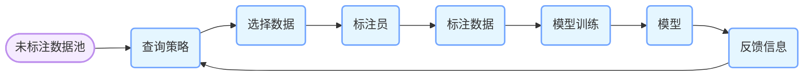

# 模型训练中的主动学习策略设计与实现

> 关键词：模型训练、主动学习、策略设计、实现方法、数据选择、标注效率

> 摘要：本文围绕模型训练中的主动学习策略展开深入探讨。首先介绍了主动学习在模型训练中的重要背景和意义，明确了目的、范围以及预期读者等内容。详细阐述了主动学习的核心概念、联系、算法原理、数学模型等理论知识，并通过Python代码进行具体实现。接着通过项目实战展示了主动学习策略的实际应用，包括开发环境搭建、源代码实现与解读。分析了主动学习在不同场景下的实际应用，推荐了相关的学习资源、开发工具框架以及论文著作。最后总结了主动学习的未来发展趋势与挑战，并给出常见问题的解答和扩展阅读参考资料，旨在为读者全面深入地了解和应用主动学习策略提供有价值的参考。

## 1. 背景介绍 
### 1.1 目的和范围
在当今的机器学习和人工智能领域，模型训练往往需要大量的标注数据。然而，数据标注是一个耗时、耗力且成本高昂的过程。主动学习策略旨在解决这一问题，通过智能地选择最有价值的数据进行标注，从而提高数据标注的效率，减少标注成本，同时提升模型的性能。

本文的范围涵盖了主动学习策略的基本概念、核心算法、数学模型、实际应用以及相关工具和资源推荐等方面。旨在为读者提供一个全面且深入的主动学习策略知识体系，帮助读者在实际的模型训练项目中能够设计和实现有效的主动学习策略。

### 1.2 预期读者
本文预期读者包括但不限于以下几类人群：
- 机器学习和人工智能领域的研究人员，希望深入了解主动学习策略的理论和前沿研究成果，为其科研工作提供新的思路和方法。
- 数据科学家和算法工程师，在实际项目中面临数据标注难题，需要借助主动学习策略提高工作效率和模型性能。
- 对机器学习和主动学习感兴趣的学生和爱好者，通过本文系统地学习主动学习的相关知识，为进一步的学习和实践打下基础。

### 1.3 文档结构概述
本文的结构如下：
- 核心概念与联系：介绍主动学习的基本概念、原理和架构，通过文本示意图和Mermaid流程图进行直观展示。
- 核心算法原理 & 具体操作步骤：详细讲解主动学习的核心算法，使用Python源代码进行具体实现和阐述。
- 数学模型和公式 & 详细讲解 & 举例说明：介绍主动学习的数学模型和相关公式，并通过具体例子进行说明。
- 项目实战：代码实际案例和详细解释说明，包括开发环境搭建、源代码实现和代码解读。
- 实际应用场景：分析主动学习在不同领域的实际应用场景。
- 工具和资源推荐：推荐学习主动学习的相关资源、开发工具框架以及论文著作。
- 总结：未来发展趋势与挑战：总结主动学习的发展趋势和面临的挑战。
- 附录：常见问题与解答：解答读者在学习和应用主动学习过程中常见的问题。
- 扩展阅读 & 参考资料：提供相关的扩展阅读材料和参考资料。

### 1.4 术语表
#### 1.4.1 核心术语定义
- **主动学习（Active Learning）**：一种机器学习范式，通过主动选择最有价值的数据进行标注，以提高模型的性能和数据标注的效率。
- **查询策略（Query Strategy）**：主动学习中用于选择最有价值数据的策略，常见的有不确定性采样、委员会查询等。
- **标注员（Annotator）**：负责对数据进行标注的人员或系统。
- **未标注数据池（Unlabeled Data Pool）**：包含大量未标注数据的集合，主动学习算法从中选择数据进行标注。
- **标注后数据（Labeled Data）**：已经经过标注员标注的数据，用于模型训练。

#### 1.4.2 相关概念解释
- **被动学习（Passive Learning）**：与主动学习相对，被动学习是指模型在固定的标注数据集上进行训练，不主动选择数据。
- **半监督学习（Semi - supervised Learning）**：利用少量的标注数据和大量的未标注数据进行学习的方法，主动学习可以看作是半监督学习的一种特殊形式。

#### 1.4.3 缩略词列表
- **AL**：Active Learning（主动学习）
- **US**：Uncertainty Sampling（不确定性采样）
- **QBC**：Query by Committee（委员会查询）

## 2. 核心概念与联系 

### 主动学习的基本原理
主动学习的核心思想是通过智能地选择最有价值的数据进行标注，从而在有限的标注资源下获得更好的模型性能。在传统的机器学习中，数据标注通常是随机进行的，而主动学习则根据模型的反馈信息，有针对性地选择数据进行标注。

### 主动学习的架构
主动学习的基本架构包括以下几个部分：
1. **未标注数据池**：包含大量未标注的数据。
2. **查询策略**：用于从未标注数据池中选择最有价值的数据。
3. **标注员**：对查询策略选择的数据进行标注。
4. **模型**：使用标注后的数据进行训练，并根据模型的反馈信息指导查询策略的选择。

### 文本示意图
```plaintext
未标注数据池 --(查询策略)--> 选择数据 --(标注员)--> 标注数据 --(模型训练)--> 模型
模型 --(反馈信息)--> 查询策略
```

### Mermaid流程图


## 3. 核心算法原理 & 具体操作步骤 

### 不确定性采样（Uncertainty Sampling）算法原理
不确定性采样是一种常见的主动学习查询策略，其基本思想是选择模型最不确定的样本进行标注。对于分类问题，通常使用预测概率来衡量模型的不确定性。例如，在一个二分类问题中，如果模型对某个样本的预测概率接近0.5，说明模型对该样本的分类结果比较不确定，那么这个样本就更有可能被选择进行标注。

### Python代码实现
```python
import numpy as np
from sklearn.datasets import make_classification
from sklearn.linear_model import LogisticRegression

# 生成一些示例数据
X, y = make_classification(n_samples=1000, n_features=10, n_informative=5, n_redundant=0, random_state=42)

# 划分未标注数据池和初始标注数据
unlabeled_data = X
labeled_data = []
labeled_labels = []

# 初始化模型
model = LogisticRegression()

# 主动学习循环
num_iterations = 10
for iteration in range(num_iterations):
    if len(labeled_data) > 0:
        # 训练模型
        model.fit(np.array(labeled_data), np.array(labeled_labels))
    
    # 计算未标注数据的不确定性
    if len(unlabeled_data) > 0:
        probabilities = model.predict_proba(unlabeled_data)
        uncertainties = 1 - np.max(probabilities, axis=1)
        
        # 选择最不确定的样本
        most_uncertain_index = np.argmax(uncertainties)
        most_uncertain_sample = unlabeled_data[most_uncertain_index]
        most_uncertain_label = y[np.where((X == most_uncertain_sample).all(axis=1))[0][0]]
        
        # 将选择的样本加入标注数据
        labeled_data.append(most_uncertain_sample)
        labeled_labels.append(most_uncertain_label)
        
        # 从未标注数据池中移除选择的样本
        unlabeled_data = np.delete(unlabeled_data, most_uncertain_index, axis=0)
    
    # 输出当前迭代的信息
    print(f"Iteration {iteration + 1}: Number of labeled samples = {len(labeled_data)}")
```

### 代码解释
1. **数据生成**：使用`make_classification`函数生成一些示例数据。
2. **初始化**：将所有数据作为未标注数据池，初始标注数据为空。
3. **主动学习循环**：
    - 若有标注数据，则训练模型。
    - 计算未标注数据的不确定性，选择最不确定的样本。
    - 将选择的样本加入标注数据，并从未标注数据池中移除。
4. **输出信息**：输出当前迭代的标注样本数量。

### 委员会查询（Query by Committee）算法原理
委员会查询算法通过训练多个不同的模型组成一个委员会，然后选择委员会成员之间分歧最大的样本进行标注。这种方法可以捕捉到模型之间的不一致性，从而选择出对模型性能提升最有帮助的样本。

### Python代码实现
```python
from sklearn.ensemble import RandomForestClassifier
from sklearn.svm import SVC

# 生成一些示例数据
X, y = make_classification(n_samples=1000, n_features=10, n_informative=5, n_redundant=0, random_state=42)

# 划分未标注数据池和初始标注数据
unlabeled_data = X
labeled_data = []
labeled_labels = []

# 初始化委员会模型
model1 = RandomForestClassifier()
model2 = SVC(probability=True)

# 主动学习循环
num_iterations = 10
for iteration in range(num_iterations):
    if len(labeled_data) > 0:
        # 训练委员会模型
        model1.fit(np.array(labeled_data), np.array(labeled_labels))
        model2.fit(np.array(labeled_data), np.array(labeled_labels))
    
    # 计算委员会成员之间的分歧
    if len(unlabeled_data) > 0:
        predictions1 = model1.predict(unlabeled_data)
        predictions2 = model2.predict(unlabeled_data)
        disagreements = predictions1 != predictions2
        
        # 选择分歧最大的样本
        most_disagreed_index = np.argmax(disagreements)
        most_disagreed_sample = unlabeled_data[most_disagreed_index]
        most_disagreed_label = y[np.where((X == most_disagreed_sample).all(axis=1))[0][0]]
        
        # 将选择的样本加入标注数据
        labeled_data.append(most_disagreed_sample)
        labeled_labels.append(most_disagreed_label)
        
        # 从未标注数据池中移除选择的样本
        unlabeled_data = np.delete(unlabeled_data, most_disagreed_index, axis=0)
    
    # 输出当前迭代的信息
    print(f"Iteration {iteration + 1}: Number of labeled samples = {len(labeled_data)}")
```

### 代码解释
1. **数据生成**：使用`make_classification`函数生成一些示例数据。
2. **初始化**：将所有数据作为未标注数据池，初始标注数据为空。
3. **初始化委员会模型**：使用随机森林分类器和支持向量机分类器组成委员会。
4. **主动学习循环**：
    - 若有标注数据，则训练委员会模型。
    - 计算委员会成员之间的分歧，选择分歧最大的样本。
    - 将选择的样本加入标注数据，并从未标注数据池中移除。
5. **输出信息**：输出当前迭代的标注样本数量。

## 4. 数学模型和公式 & 详细讲解 & 举例说明 

### 不确定性采样的数学模型
在不确定性采样中，对于一个分类问题，假设模型对样本 $x$ 的预测概率分布为 $P(y|x)$，其中 $y$ 是类别标签。通常使用熵来衡量模型的不确定性，熵的计算公式为：

$$H(P(y|x)) = -\sum_{y} P(y|x) \log P(y|x)$$

熵越大，说明模型对样本 $x$ 的分类结果越不确定。

### 举例说明
假设一个二分类问题，模型对样本 $x$ 的预测概率为 $P(y = 0|x) = 0.4$，$P(y = 1|x) = 0.6$。则该样本的熵为：

$$H(P(y|x)) = - (0.4 \log 0.4 + 0.6 \log 0.6) \approx 0.673$$

### 委员会查询的数学模型
在委员会查询中，假设委员会由 $M$ 个模型组成，对于样本 $x$，第 $i$ 个模型的预测结果为 $y_i$。可以使用分歧度来衡量委员会成员之间的不一致性，分歧度的计算公式为：

$$D(x) = \frac{1}{M} \sum_{i = 1}^{M} \sum_{j = i + 1}^{M} I(y_i \neq y_j)$$

其中 $I(y_i \neq y_j)$ 是指示函数，当 $y_i \neq y_j$ 时，$I(y_i \neq y_j) = 1$，否则 $I(y_i \neq y_j) = 0$。

### 举例说明
假设委员会由 3 个模型组成，对于样本 $x$，3 个模型的预测结果分别为 $y_1 = 0$，$y_2 = 1$，$y_3 = 1$。则该样本的分歧度为：

$$D(x) = \frac{1}{3} (I(0 \neq 1) + I(0 \neq 1) + I(1 \neq 1)) = \frac{2}{3}$$

## 5. 项目实战：代码实际案例和详细解释说明 

### 5.1  开发环境搭建
- **Python环境**：建议使用Python 3.7及以上版本。可以从Python官方网站（https://www.python.org/downloads/）下载并安装。
- **依赖库**：
    - `numpy`：用于数值计算。
    - `scikit - learn`：用于机器学习算法的实现。
    - 可以使用以下命令安装依赖库：
```bash
pip install numpy scikit-learn
```

### 5.2  源代码详细实现和代码解读
以下是一个使用主动学习进行图像分类的完整示例：

```python
import numpy as np
from sklearn.datasets import load_digits
from sklearn.linear_model import LogisticRegression
from sklearn.model_selection import train_test_split

# 加载手写数字数据集
digits = load_digits()
X = digits.data
y = digits.target

# 划分训练集和测试集
X_train, X_test, y_train, y_test = train_test_split(X, y, test_size=0.2, random_state=42)

# 划分未标注数据池和初始标注数据
unlabeled_data = X_train
labeled_data = []
labeled_labels = []

# 初始化模型
model = LogisticRegression()

# 主动学习循环
num_iterations = 10
for iteration in range(num_iterations):
    if len(labeled_data) > 0:
        # 训练模型
        model.fit(np.array(labeled_data), np.array(labeled_labels))
    
    # 计算未标注数据的不确定性
    if len(unlabeled_data) > 0:
        probabilities = model.predict_proba(unlabeled_data)
        uncertainties = 1 - np.max(probabilities, axis=1)
        
        # 选择最不确定的样本
        most_uncertain_index = np.argmax(uncertainties)
        most_uncertain_sample = unlabeled_data[most_uncertain_index]
        most_uncertain_label = y_train[np.where((X_train == most_uncertain_sample).all(axis=1))[0][0]]
        
        # 将选择的样本加入标注数据
        labeled_data.append(most_uncertain_sample)
        labeled_labels.append(most_uncertain_label)
        
        # 从未标注数据池中移除选择的样本
        unlabeled_data = np.delete(unlabeled_data, most_uncertain_index, axis=0)
    
    # 评估模型性能
    if len(labeled_data) > 0:
        accuracy = model.score(X_test, y_test)
        print(f"Iteration {iteration + 1}: Accuracy = {accuracy}")
```

### 5.3  代码解读与分析
1. **数据加载和划分**：使用`load_digits`函数加载手写数字数据集，并将其划分为训练集和测试集。
2. **初始化**：将训练集作为未标注数据池，初始标注数据为空。
3. **主动学习循环**：
    - 若有标注数据，则训练模型。
    - 计算未标注数据的不确定性，选择最不确定的样本。
    - 将选择的样本加入标注数据，并从未标注数据池中移除。
4. **模型评估**：在每次迭代后，使用测试集评估模型的性能，并输出准确率。

通过主动学习，模型可以在较少的标注数据下获得较好的性能，从而提高数据标注的效率。

## 6. 实际应用场景 
### 自然语言处理
在自然语言处理任务中，如文本分类、命名实体识别等，数据标注需要专业的语言知识和大量的时间。主动学习可以通过选择最有价值的文本数据进行标注，提高标注效率和模型性能。例如，在新闻文本分类任务中，主动学习可以选择那些分类结果不确定的新闻文本进行标注，从而更快地训练出准确的分类模型。

### 计算机视觉
在计算机视觉领域，如图像分类、目标检测等，数据标注通常需要人工标注图像中的物体类别和位置。主动学习可以帮助选择最具代表性和挑战性的图像进行标注，减少标注工作量。例如，在医学图像分析中，主动学习可以选择那些医生诊断结果存在分歧的图像进行标注，提高医学图像分析模型的准确性。

### 推荐系统
在推荐系统中，用户的反馈数据通常是稀疏的，标注用户的偏好信息也比较困难。主动学习可以通过选择最能反映用户偏好的样本进行标注，提高推荐系统的性能。例如，在电影推荐系统中，主动学习可以选择那些用户对推荐结果评价不确定的电影进行标注，从而更好地了解用户的喜好。

## 7. 工具和资源推荐
### 7.1 学习资源推荐
#### 7.1.1 书籍推荐
- 《机器学习》（周志华著）：全面介绍了机器学习的基本概念、算法和应用，其中包含了主动学习的相关内容。
- 《深度学习》（Ian Goodfellow、Yoshua Bengio和Aaron Courville著）：深入探讨了深度学习的理论和实践，对理解主动学习在深度学习中的应用有很大帮助。

#### 7.1.2 在线课程
- Coursera上的“Machine Learning”（Andrew Ng教授）：经典的机器学习课程，涵盖了主动学习的基本概念和算法。
- edX上的“Deep Learning Specialization”：深度学习的系列课程，介绍了主动学习在深度学习中的最新研究成果。

#### 7.1.3 技术博客和网站
- Medium上的“Towards Data Science”：有很多关于主动学习的技术文章和案例分享。
- Kaggle：提供了大量的数据集和竞赛，其中一些竞赛涉及到主动学习的应用。

### 7.2 开发工具框架推荐
#### 7.2.1 IDE和编辑器
- PyCharm：功能强大的Python集成开发环境，提供了代码编辑、调试、版本控制等功能。
- Jupyter Notebook：交互式的开发环境，适合进行数据探索和模型实验。

#### 7.2.2 调试和性能分析工具
- TensorBoard：用于可视化深度学习模型的训练过程和性能指标。
- Scikit - learn的`cross_val_score`函数：用于评估模型的性能和进行交叉验证。

#### 7.2.3 相关框架和库
- modAL：专门用于主动学习的Python库，提供了各种主动学习算法的实现。
- scikit - learn：包含了多种机器学习算法和工具，可用于实现主动学习策略。

### 7.3 相关论文著作推荐
#### 7.3.1 经典论文
- “Active Learning Literature Survey”（Burr Settles）：全面综述了主动学习的相关文献和研究成果。
- “Query by Committee”（H. S. Seung、M. Opper和H. Sompolinsky）：提出了委员会查询的主动学习算法。

#### 7.3.2 最新研究成果
- 关注顶级机器学习会议（如NeurIPS、ICML、CVPR等）上关于主动学习的最新研究论文。

#### 7.3.3 应用案例分析
- 查看相关领域的学术期刊和会议论文，了解主动学习在不同应用场景下的实际案例和效果。

## 8. 总结：未来发展趋势与挑战
### 未来发展趋势
- **与深度学习的结合**：随着深度学习的发展，主动学习将更多地与深度学习模型相结合，以提高深度学习模型的训练效率和性能。例如，在图像生成、自然语言处理等领域，主动学习可以帮助选择最有价值的数据进行标注，从而加速深度学习模型的训练。
- **多模态主动学习**：未来的主动学习将不仅仅局限于单一模态的数据，而是会涉及到多模态数据（如图像、文本、音频等）的主动学习。通过综合利用多模态数据的信息，可以提高模型的性能和泛化能力。
- **主动学习的自动化**：为了进一步提高主动学习的效率，未来将发展更多的自动化主动学习方法。例如，自动选择最优的查询策略、自动调整标注预算等。

### 挑战
- **查询策略的优化**：目前的查询策略仍然存在一些局限性，如不能很好地处理复杂的数据分布和高维数据。如何设计更高效、更通用的查询策略是主动学习面临的一个重要挑战。
- **标注成本的控制**：虽然主动学习可以减少标注成本，但在实际应用中，标注成本仍然是一个重要的考虑因素。如何在保证模型性能的前提下，进一步降低标注成本是一个亟待解决的问题。
- **模型的可解释性**：随着主动学习在越来越多的领域得到应用，模型的可解释性变得越来越重要。如何解释主动学习模型的决策过程和选择的数据，是主动学习面临的另一个挑战。

## 9. 附录：常见问题与解答
### 主动学习和传统机器学习有什么区别？
主动学习和传统机器学习的主要区别在于数据的选择方式。传统机器学习通常使用固定的标注数据集进行训练，而主动学习则通过智能地选择最有价值的数据进行标注，以提高模型的性能和数据标注的效率。

### 主动学习适用于所有类型的数据集吗？
主动学习并不适用于所有类型的数据集。一般来说，主动学习更适用于标注成本较高、数据量较大的数据集。对于标注成本较低、数据量较小的数据集，传统的机器学习方法可能更加适用。

### 如何选择合适的查询策略？
选择合适的查询策略需要考虑数据集的特点、模型的类型和任务的需求等因素。例如，对于分类问题，不确定性采样和委员会查询是比较常用的查询策略；对于回归问题，可以使用基于预测误差的查询策略。在实际应用中，可以通过实验比较不同查询策略的性能，选择最优的查询策略。

## 10. 扩展阅读 & 参考资料
### 扩展阅读
- 阅读更多关于机器学习和人工智能的经典著作，如《人工智能：一种现代的方法》等，以加深对相关领域的理解。
- 关注相关的技术博客和论坛，了解主动学习的最新研究动态和应用案例。

### 参考资料
- 周志华. 机器学习[M]. 清华大学出版社, 2016.
- Ian Goodfellow, Yoshua Bengio, Aaron Courville. 深度学习[M]. 人民邮电出版社, 2017.
- Burr Settles. Active Learning Literature Survey[R]. University of Wisconsin–Madison, 2009.
- H. S. Seung, M. Opper, H. Sompolinsky. Query by Committee[J]. Proceedings of the fifth annual workshop on Computational learning theory, 1992.