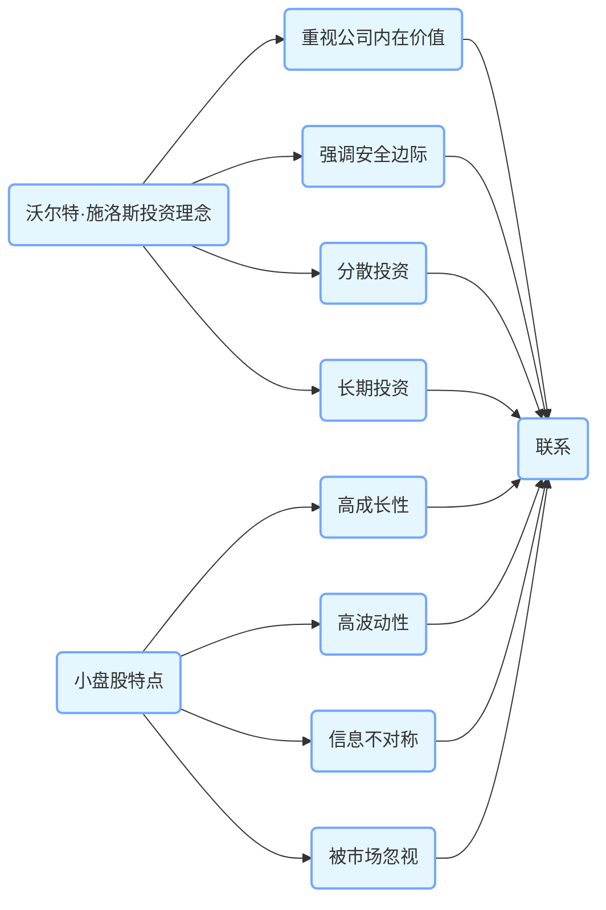

# 沃尔特·施洛斯的小盘股研究方法论

> 关键词：沃尔特·施洛斯、小盘股、研究方法论、价值投资、财务分析、风险评估

> 摘要：本文深入探讨了沃尔特·施洛斯的小盘股研究方法论。沃尔特·施洛斯是价值投资领域的传奇人物，其在小盘股投资方面有着独特且行之有效的方法。文章首先介绍了研究该方法论的背景和相关基础概念，接着详细阐述了核心算法原理及具体操作步骤，通过数学模型和公式进行理论支撑，并结合实际案例进行说明。还展示了该方法论在实际投资场景中的应用，推荐了相关学习工具和资源，最后总结了其未来发展趋势与挑战，解答常见问题并提供扩展阅读和参考资料，旨在帮助投资者更好地理解和运用施洛斯的小盘股研究方法，提升投资决策能力。

## 1. 背景介绍 
### 1.1 目的和范围
本研究的主要目的是全面剖析沃尔特·施洛斯的小盘股研究方法论，为投资者提供一套科学、系统且实用的小盘股投资分析框架。通过深入研究施洛斯的投资理念、策略和方法，挖掘其成功投资小盘股的核心要素，帮助投资者更好地理解小盘股的投资逻辑，提高投资决策的准确性和成功率。

研究范围涵盖了施洛斯的投资哲学、选股标准、财务分析方法、风险评估策略等多个方面。同时，结合实际案例，分析该方法论在不同市场环境下的应用效果，探讨其局限性和改进方向。

### 1.2 预期读者
本文预期读者主要包括以下几类人群：
- **专业投资者**：希望通过学习施洛斯的方法论，丰富自己的投资策略，提高投资业绩。
- **个人投资者**：对小盘股投资感兴趣，希望了解专业的投资分析方法，提升自己的投资水平。
- **金融从业者**：如分析师、基金经理等，希望从施洛斯的投资实践中获取灵感，为其研究和投资决策提供参考。
- **金融专业学生**：作为学习价值投资理论和实践的参考资料，加深对投资学的理解和认识。

### 1.3 文档结构概述
本文将按照以下结构进行阐述：
- **核心概念与联系**：介绍沃尔特·施洛斯的投资理念、小盘股的定义和特点，以及两者之间的联系。
- **核心算法原理 & 具体操作步骤**：详细阐述施洛斯的选股标准和分析方法，包括财务指标分析、估值方法等，并给出具体的操作步骤。
- **数学模型和公式 & 详细讲解 & 举例说明**：运用数学模型和公式对施洛斯的投资决策进行量化分析，并通过实际案例进行说明。
- **项目实战：代码实际案例和详细解释说明**：通过编写Python代码实现施洛斯的选股策略，并对代码进行详细解读。
- **实际应用场景**：分析施洛斯的方法论在不同市场环境下的应用效果，探讨其在实际投资中的应用场景。
- **工具和资源推荐**：推荐相关的学习资源、开发工具和框架，以及相关的论文著作，帮助读者深入学习和研究施洛斯的方法论。
- **总结：未来发展趋势与挑战**：总结施洛斯的方法论的优点和局限性，探讨其未来发展趋势和面临的挑战。
- **附录：常见问题与解答**：解答读者在学习和应用施洛斯的方法论过程中常见的问题。
- **扩展阅读 & 参考资料**：提供相关的扩展阅读资料和参考书目，方便读者进一步深入研究。

### 1.4 术语表
#### 1.4.1 核心术语定义
- **沃尔特·施洛斯**：美国著名的价值投资者，以其独特的小盘股投资策略而闻名于世。他的投资业绩长期跑赢市场，被视为价值投资领域的传奇人物。
- **小盘股**：通常指流通市值较小的股票。一般来说，小盘股的流通市值在几亿元到几十亿元之间，但具体的划分标准可能因市场和行业而异。
- **价值投资**：一种基于公司内在价值的投资策略，投资者通过分析公司的财务状况、经营业绩、行业前景等因素，寻找被市场低估的股票，并长期持有。
- **财务分析**：对公司的财务报表进行分析，以评估公司的财务状况、经营业绩和现金流量。常用的财务分析方法包括比率分析、趋势分析、结构分析等。
- **估值方法**：用于评估股票内在价值的方法，常见的估值方法包括市盈率法、市净率法、现金流折现法等。

#### 1.4.2 相关概念解释
- **安全边际**：价值投资中的一个重要概念，指股票的市场价格低于其内在价值的幅度。安全边际越大，投资风险越小。
- **分散投资**：将资金分散投资于不同的股票、行业和资产类别，以降低投资组合的风险。
- **内在价值**：公司的真实价值，由公司的资产、盈利能力、现金流等因素决定。内在价值是价值投资的核心概念之一。

#### 1.4.3 缩略词列表
- **PE**：市盈率（Price-to-Earnings Ratio），指股票价格与每股盈利的比率，用于评估股票的估值水平。
- **PB**：市净率（Price-to-Book Ratio），指股票价格与每股净资产的比率，用于评估股票的估值水平。
- **DCF**：现金流折现法（Discounted Cash Flow），一种常用的估值方法，通过预测公司未来的现金流，并将其折现到当前，以评估公司的内在价值。

## 2. 核心概念与联系 

### 沃尔特·施洛斯的投资理念
沃尔特·施洛斯是一位坚定的价值投资者，他的投资理念主要基于以下几点：
- **重视公司的内在价值**：施洛斯认为，股票的价值最终取决于公司的内在价值，而不是市场的短期波动。他通过深入研究公司的财务报表和业务情况，寻找被市场低估的股票。
- **强调安全边际**：施洛斯非常注重安全边际，他认为只有在股票价格低于其内在价值时才会买入。安全边际可以为投资者提供一定的缓冲，降低投资风险。
- **分散投资**：施洛斯主张分散投资，他通常会持有大量的股票，以降低单一股票的风险。他认为，通过分散投资，可以在一定程度上抵消个别股票的不利影响，提高投资组合的稳定性。
- **长期投资**：施洛斯是一位长期投资者，他一旦买入股票，就会长期持有，不会因为市场的短期波动而轻易卖出。他相信，随着时间的推移，公司的内在价值会逐渐体现出来，股票价格也会随之上涨。

### 小盘股的定义和特点
小盘股通常指流通市值较小的股票。与大盘股相比，小盘股具有以下特点：
- **高成长性**：小盘股通常处于成长阶段，具有较高的成长性。由于其规模较小，更容易实现快速增长，因此在市场上具有较大的发展潜力。
- **高波动性**：小盘股的市场流动性相对较差，因此其价格波动较大。投资者在投资小盘股时，需要承担较高的风险。
- **信息不对称**：小盘股的信息披露相对较少，投资者获取信息的难度较大。这就要求投资者具备较强的研究能力和分析能力，以准确评估小盘股的投资价值。
- **被市场忽视**：由于小盘股的规模较小，往往容易被市场忽视。这就为价值投资者提供了机会，他们可以通过深入研究，发现被市场低估的小盘股。

### 两者之间的联系
沃尔特·施洛斯的投资理念与小盘股的特点之间存在着密切的联系。施洛斯的投资理念强调寻找被市场低估的股票，而小盘股由于其规模较小、信息不对称等原因，往往容易被市场忽视，从而出现被低估的情况。因此，小盘股成为了施洛斯投资的重要对象。

同时，施洛斯的分散投资和长期投资策略也非常适合小盘股投资。由于小盘股的波动性较大，通过分散投资可以降低单一股票的风险；而长期投资则可以让投资者充分享受小盘股的成长潜力，实现资产的增值。

### 文本示意图
```plaintext
沃尔特·施洛斯投资理念
|-- 重视公司内在价值
|-- 强调安全边际
|-- 分散投资
|-- 长期投资

小盘股特点
|-- 高成长性
|-- 高波动性
|-- 信息不对称
|-- 被市场忽视

联系
|-- 小盘股易被低估，符合施洛斯找低估股票理念
|-- 分散投资和长期投资适合小盘股投资特点
```

### Mermaid 流程图


## 3. 核心算法原理 & 具体操作步骤 

### 选股标准
沃尔特·施洛斯的选股标准主要基于以下几个方面：
- **低市盈率（PE）**：施洛斯认为，低市盈率的股票通常具有较高的投资价值。他会选择市盈率低于市场平均水平的股票，以获取较高的投资回报。
- **低市净率（PB）**：市净率是衡量股票估值的另一个重要指标。施洛斯会选择市净率低于1的股票，认为这样的股票具有较高的安全边际。
- **高股息率**：股息率是指股票的股息与股价的比率。施洛斯会选择股息率较高的股票，以获取稳定的现金流。
- **财务状况良好**：施洛斯非常注重公司的财务状况，他会选择资产负债率较低、现金流充足、盈利能力稳定的公司。
- **管理层稳定**：管理层的能力和稳定性对公司的发展至关重要。施洛斯会选择管理层稳定、经验丰富的公司。

### 具体操作步骤
以下是按照沃尔特·施洛斯的方法论进行小盘股研究的具体操作步骤：
1. **筛选股票**：根据选股标准，从市场中筛选出符合条件的小盘股。可以使用金融数据平台或专业的选股软件进行筛选。
2. **财务分析**：对筛选出的股票进行详细的财务分析，包括资产负债表、利润表和现金流量表的分析。重点关注公司的盈利能力、偿债能力、运营能力等指标。
3. **估值分析**：运用市盈率、市净率、现金流折现法等估值方法，评估股票的内在价值。将股票的市场价格与内在价值进行比较，判断股票是否被低估。
4. **风险评估**：对股票的风险进行评估，包括市场风险、行业风险、公司风险等。可以通过分析公司的财务报表、行业竞争格局、宏观经济环境等因素来评估风险。
5. **决策与投资**：根据财务分析、估值分析和风险评估的结果，做出投资决策。如果股票被低估且风险可控，可以考虑买入；如果股票被高估或风险较大，则应避免投资。

### Python 源代码实现
以下是一个简单的 Python 代码示例，用于实现沃尔特·施洛斯的选股策略：

```python
import pandas as pd

# 模拟股票数据
data = {
    '股票代码': ['000001', '000002', '000003', '000004', '000005'],
    '市盈率': [10, 15, 8, 20, 12],
    '市净率': [0.8, 1.2, 0.9, 1.5, 1.1],
    '股息率': [0.05, 0.03, 0.06, 0.02, 0.04],
    '资产负债率': [0.4, 0.6, 0.3, 0.7, 0.5],
    '现金流状况': ['良好', '一般', '良好', '较差', '一般']
}

df = pd.DataFrame(data)

# 选股标准
pe_threshold = 12
pb_threshold = 1
dividend_yield_threshold = 0.04
debt_ratio_threshold = 0.5

# 筛选股票
selected_stocks = df[(df['市盈率'] < pe_threshold) &
                     (df['市净率'] < pb_threshold) &
                     (df['股息率'] > dividend_yield_threshold) &
                     (df['资产负债率'] < debt_ratio_threshold) &
                     (df['现金流状况'] == '良好')]

print('符合选股标准的股票：')
print(selected_stocks)
```

### 代码解释
1. **数据模拟**：使用 `pandas` 库创建一个包含股票数据的 DataFrame，包括股票代码、市盈率、市净率、股息率、资产负债率和现金流状况等信息。
2. **选股标准设定**：设定市盈率、市净率、股息率、资产负债率等选股标准的阈值。
3. **股票筛选**：使用布尔索引筛选出符合选股标准的股票。
4. **结果输出**：打印出符合选股标准的股票信息。

通过以上步骤，我们可以初步筛选出符合沃尔特·施洛斯选股标准的小盘股，为进一步的研究和投资决策提供参考。

## 4. 数学模型和公式 & 详细讲解 & 举例说明 

### 市盈率（PE）模型
市盈率（PE）是衡量股票估值的常用指标之一，其计算公式为：

$$PE = \frac{股价}{每股盈利}$$

其中，股价是指股票的市场价格，每股盈利是指公司每股股票的盈利。

市盈率反映了投资者为获取公司每一元盈利所愿意支付的价格。一般来说，市盈率越低，股票的估值越低，投资价值越高。

**举例说明**：假设某股票的市场价格为 20 元，每股盈利为 2 元，则该股票的市盈率为：

$$PE = \frac{20}{2} = 10$$

这意味着投资者为获取该公司每一元盈利愿意支付 10 元的价格。

### 市净率（PB）模型
市净率（PB）是衡量股票估值的另一个重要指标，其计算公式为：

$$PB = \frac{股价}{每股净资产}$$

其中，股价是指股票的市场价格，每股净资产是指公司每股股票的净资产。

市净率反映了投资者为获取公司每一元净资产所愿意支付的价格。一般来说，市净率越低，股票的估值越低，投资价值越高。

**举例说明**：假设某股票的市场价格为 15 元，每股净资产为 10 元，则该股票的市净率为：

$$PB = \frac{15}{10} = 1.5$$

这意味着投资者为获取该公司每一元净资产愿意支付 1.5 元的价格。

### 股息率模型
股息率是指股票的股息与股价的比率，其计算公式为：

$$股息率 = \frac{每股股息}{股价} \times 100\%$$

其中，每股股息是指公司每股股票支付的股息，股价是指股票的市场价格。

股息率反映了投资者从股票中获取的股息收益。一般来说，股息率越高，股票的投资价值越高。

**举例说明**：假设某股票的市场价格为 30 元，每股股息为 1.5 元，则该股票的股息率为：

$$股息率 = \frac{1.5}{30} \times 100\% = 5\%$$

这意味着投资者投资该股票每年可以获得 5% 的股息收益。

### 现金流折现法（DCF）模型
现金流折现法（DCF）是一种常用的估值方法，其基本原理是将公司未来的现金流折现到当前，以评估公司的内在价值。

DCF 模型的计算公式为：

$$V = \sum_{t=1}^{n} \frac{CF_t}{(1 + r)^t} + \frac{TV}{(1 + r)^n}$$

其中，$V$ 表示公司的内在价值，$CF_t$ 表示第 $t$ 期的现金流，$r$ 表示折现率，$n$ 表示预测期数，$TV$ 表示终值。

**详细讲解**：
- **现金流预测**：首先需要预测公司未来的现金流。这需要对公司的业务模式、市场前景、竞争格局等因素进行深入分析，以确定公司未来的盈利能力和现金流量。
- **折现率确定**：折现率是将未来现金流折现到当前的利率。折现率的确定需要考虑市场利率、公司风险等因素。一般来说，折现率越高，未来现金流的现值越低。
- **终值计算**：终值是指预测期结束后公司的价值。终值的计算通常采用永续增长模型，即假设公司在预测期结束后将保持一定的增长率。

**举例说明**：假设某公司未来三年的现金流分别为 100 万元、120 万元和 150 万元，预测期为三年，折现率为 10%，终值为 1000 万元。则该公司的内在价值为：

$$V = \frac{100}{(1 + 0.1)^1} + \frac{120}{(1 + 0.1)^2} + \frac{150}{(1 + 0.1)^3} + \frac{1000}{(1 + 0.1)^3}$$

$$V = 90.91 + 99.17 + 112.70 + 751.31 = 1054.09$$

这意味着该公司的内在价值为 1054.09 万元。

通过以上数学模型和公式，我们可以对小盘股的估值进行量化分析，为投资决策提供参考。

## 5. 项目实战：代码实际案例和详细解释说明 

### 5.1  开发环境搭建
在进行小盘股研究的项目实战之前，需要搭建相应的开发环境。以下是具体的搭建步骤：

#### 安装 Python
Python 是一种广泛使用的编程语言，在金融数据分析领域有着广泛的应用。可以从 Python 官方网站（https://www.python.org/downloads/）下载并安装最新版本的 Python。

#### 安装必要的库
在 Python 中，有许多库可以用于金融数据分析，如 `pandas`、`numpy`、`matplotlib` 等。可以使用 `pip` 命令来安装这些库：

```bash
pip install pandas numpy matplotlib
```

#### 数据获取
可以使用金融数据平台或 API 来获取股票数据。例如，可以使用 `tushare` 库来获取中国 A 股市场的股票数据。可以使用以下命令来安装 `tushare` 库：

```bash
pip install tushare
```

### 5.2  源代码详细实现和代码解读
以下是一个完整的 Python 代码示例，用于实现沃尔特·施洛斯的小盘股研究方法论：

```python
import tushare as ts
import pandas as pd
import numpy as np
import matplotlib.pyplot as plt

# 设置 tushare token
ts.set_token('your_token')
pro = ts.pro_api()

# 获取股票列表
def get_stock_list():
    data = pro.stock_basic(exchange='', list_status='L', fields='ts_code,symbol,name,area,industry,list_date')
    return data

# 获取财务数据
def get_financial_data(ts_code):
    df_income = pro.income(ts_code=ts_code, fields='ts_code,end_date,n_income_attr_p')
    df_balance = pro.balancesheet(ts_code=ts_code, fields='ts_code,end_date,tot_assets,tot_liab')
    df_cashflow = pro.cashflow(ts_code=ts_code, fields='ts_code,end_date,net_operate_cash_flow')
    return df_income, df_balance, df_cashflow

# 计算财务指标
def calculate_financial_indicators(df_income, df_balance, df_cashflow):
    # 计算每股盈利
    df_income['eps'] = df_income['n_income_attr_p'] / 10000  # 假设总股本为 10000 万股
    # 计算资产负债率
    df_balance['debt_ratio'] = df_balance['tot_liab'] / df_balance['tot_assets']
    # 计算经营现金流
    df_cashflow['net_operate_cash_flow'] = df_cashflow['net_operate_cash_flow'] / 10000  # 单位：万元
    return df_income, df_balance, df_cashflow

# 筛选股票
def select_stocks(stock_list):
    selected_stocks = []
    for index, row in stock_list.iterrows():
        ts_code = row['ts_code']
        try:
            df_income, df_balance, df_cashflow = get_financial_data(ts_code)
            df_income, df_balance, df_cashflow = calculate_financial_indicators(df_income, df_balance, df_cashflow)
            # 选股标准
            pe_threshold = 12
            pb_threshold = 1
            debt_ratio_threshold = 0.5
            cash_flow_threshold = 0
            # 获取最新财务数据
            latest_income = df_income.iloc[0]
            latest_balance = df_balance.iloc[0]
            latest_cashflow = df_cashflow.iloc[0]
            # 获取最新股价
            df_daily = pro.daily(ts_code=ts_code, start_date='20230101', end_date='20231231')
            latest_price = df_daily.iloc[0]['close']
            # 计算市盈率
            pe = latest_price / latest_income['eps']
            # 计算市净率
            pb = latest_price / (latest_balance['tot_assets'] - latest_balance['tot_liab']) / 10000  # 假设总股本为 10000 万股
            # 判断是否符合选股标准
            if pe < pe_threshold and pb < pb_threshold and latest_balance['debt_ratio'] < debt_ratio_threshold and latest_cashflow['net_operate_cash_flow'] > cash_flow_threshold:
                selected_stocks.append(ts_code)
        except Exception as e:
            print(f'Error processing {ts_code}: {e}')
    return selected_stocks

# 主函数
def main():
    stock_list = get_stock_list()
    selected_stocks = select_stocks(stock_list)
    print('符合选股标准的股票：')
    print(selected_stocks)

if __name__ == '__main__':
    main()
```

### 5.3  代码解读与分析
1. **数据获取**：
    - `get_stock_list` 函数：使用 `tushare` 库获取股票列表，包括股票代码、名称、行业等信息。
    - `get_financial_data` 函数：使用 `tushare` 库获取股票的财务数据，包括利润表、资产负债表和现金流量表。

2. **财务指标计算**：
    - `calculate_financial_indicators` 函数：计算每股盈利、资产负债率和经营现金流等财务指标。

3. **股票筛选**：
    - `select_stocks` 函数：根据选股标准筛选出符合条件的股票。选股标准包括市盈率、市净率、资产负债率和经营现金流等指标。

4. **主函数**：
    - `main` 函数：调用上述函数，完成股票列表的获取、财务数据的获取、财务指标的计算和股票的筛选，并打印出符合选股标准的股票。

通过以上代码，我们可以实现沃尔特·施洛斯的小盘股研究方法论，筛选出符合条件的小盘股。

## 6. 实际应用场景 
### 个人投资者
对于个人投资者来说，沃尔特·施洛斯的小盘股研究方法论可以帮助他们更好地选择投资标的，提高投资收益。个人投资者可以根据施洛斯的选股标准，筛选出被市场低估的小盘股，并长期持有。通过分散投资，可以降低单一股票的风险，提高投资组合的稳定性。

例如，个人投资者小李对小盘股投资感兴趣，他可以使用施洛斯的方法论，从市场中筛选出符合条件的小盘股。他可以关注股票的市盈率、市净率、股息率等指标，选择估值较低、财务状况良好的股票。同时，他可以将资金分散投资于多只股票，以降低投资风险。

### 专业投资者
对于专业投资者来说，施洛斯的方法论可以作为一种投资策略的参考。专业投资者可以结合自己的投资经验和市场分析，对施洛斯的选股标准进行调整和优化，以适应不同的市场环境和投资目标。

例如，基金经理小张管理着一只小盘股基金，他可以借鉴施洛斯的方法论，制定自己的投资策略。他可以在筛选股票时，不仅关注财务指标，还会考虑公司的行业前景、管理层能力等因素。同时，他可以根据市场情况，灵活调整投资组合，以获取更高的投资收益。

### 金融机构
金融机构可以将施洛斯的方法论应用于投资研究和风险管理。金融机构可以通过对小盘股的研究，为客户提供投资建议和资产配置方案。同时，金融机构可以利用施洛斯的方法论，对投资组合进行风险评估和管理，降低投资风险。

例如，证券公司的分析师可以使用施洛斯的方法论，对小盘股进行深入研究，撰写研究报告，为客户提供投资建议。银行可以利用施洛斯的方法论，对其理财产品的投资组合进行风险评估和管理，确保客户的资金安全。

## 7. 工具和资源推荐
### 7.1 学习资源推荐
#### 7.1.1 书籍推荐
- 《聪明的投资者》（The Intelligent Investor）：本杰明·格雷厄姆（Benjamin Graham）著，是价值投资领域的经典著作，对沃尔特·施洛斯的投资理念产生了深远影响。
- 《证券分析》（Security Analysis）：本杰明·格雷厄姆和戴维·多德（David Dodd）著，是价值投资的奠基之作，详细阐述了价值投资的理论和方法。
- 《沃尔特·施洛斯：格雷厄姆的门徒》（Walter Schloss: Disciple of Graham）：详细介绍了沃尔特·施洛斯的投资生涯和投资策略，是学习施洛斯方法论的重要参考书籍。

#### 7.1.2 在线课程
- Coursera 平台上的“投资学原理”（Principles of Investing）课程：由知名教授授课，系统介绍了投资学的基本原理和方法，包括价值投资理论。
- edX 平台上的“金融市场”（Financial Markets）课程：由耶鲁大学教授罗伯特·席勒（Robert Shiller）授课，深入探讨了金融市场的运行机制和投资策略。

#### 7.1.3 技术博客和网站
- 雪球网（https://xueqiu.com/）：中国知名的投资社区，提供股票行情、研究报告、投资策略等信息，是投资者交流和学习的重要平台。
- 价值投资网（https://www.value-investing.net/）：专注于价值投资领域，提供价值投资理论、案例分析、投资工具等资源，是学习价值投资的重要网站。

### 7.2 开发工具框架推荐
#### 7.2.1 IDE和编辑器
- PyCharm：一款专业的 Python 集成开发环境（IDE），提供代码编辑、调试、版本控制等功能，适合开发复杂的 Python 项目。
- Jupyter Notebook：一种交互式的开发环境，支持 Python、R 等多种编程语言，适合进行数据分析和可视化。

#### 7.2.2 调试和性能分析工具
- pdb：Python 内置的调试工具，可以帮助开发者调试代码，查找错误。
- cProfile：Python 内置的性能分析工具，可以帮助开发者分析代码的性能瓶颈，优化代码。

#### 7.2.3 相关框架和库
- pandas：Python 中用于数据处理和分析的库，提供了高效的数据结构和数据分析工具。
- numpy：Python 中用于科学计算的库，提供了高效的数组和矩阵运算功能。
- matplotlib：Python 中用于数据可视化的库，提供了丰富的绘图功能。

### 7.3 相关论文著作推荐
#### 7.3.1 经典论文
- “The Superinvestors of Graham-and-Doddsville”：沃伦·巴菲特（Warren Buffett）著，介绍了本杰明·格雷厄姆的价值投资理念和其门徒的投资业绩，是价值投资领域的经典论文。
- “Value Investing: The Use of Historical Financial Statement Information to Separate Winners from Losers”：约瑟夫·拉科尼肖克（Josef Lakonishok）、安德烈·施莱弗（Andrei Shleifer）和罗伯特·维什尼（Robert Vishny）著，通过实证研究证明了价值投资策略的有效性。

#### 7.3.2 最新研究成果
- 关注顶级金融学术期刊，如《Journal of Finance》、《Review of Financial Studies》等，了解价值投资领域的最新研究成果。

#### 7.3.3 应用案例分析
- 可以参考一些投资机构和基金公司的研究报告，了解他们在小盘股投资方面的应用案例和经验分享。

## 8. 总结：未来发展趋势与挑战
### 未来发展趋势
- **数字化和智能化**：随着信息技术的不断发展，小盘股研究将越来越数字化和智能化。投资者可以利用大数据、人工智能等技术，对小盘股进行更深入的研究和分析，提高投资决策的准确性和效率。
- **全球化**：随着全球经济的一体化，小盘股投资将越来越全球化。投资者可以关注全球范围内的小盘股市场，寻找更多的投资机会。
- **多元化**：未来，小盘股投资策略将越来越多元化。投资者可以结合不同的投资理念和方法，制定个性化的投资策略，以适应不同的市场环境和投资目标。

### 挑战
- **信息不对称**：小盘股的信息披露相对较少，投资者获取信息的难度较大。这就要求投资者具备较强的研究能力和分析能力，以准确评估小盘股的投资价值。
- **市场波动**：小盘股的市场流动性相对较差，价格波动较大。投资者在投资小盘股时，需要承担较高的风险。
- **竞争激烈**：随着小盘股投资市场的不断发展，竞争将越来越激烈。投资者需要不断提高自己的投资能力和水平，才能在市场中获得超额收益。

## 9. 附录：常见问题与解答
### 问题 1：如何确定小盘股的标准？
答：小盘股的标准并没有统一的定义，通常可以根据流通市值来划分。一般来说，流通市值在几亿元到几十亿元之间的股票可以被视为小盘股。但具体的划分标准可能因市场和行业而异。

### 问题 2：沃尔特·施洛斯的方法论适用于所有市场环境吗？
答：沃尔特·施洛斯的方法论主要基于价值投资理念，强调寻找被市场低估的股票。虽然该方法论在大多数市场环境下都具有一定的有效性，但在不同的市场环境下，其应用效果可能会有所不同。在市场处于牛市时，小盘股可能会表现出较高的成长性，此时施洛斯的方法论可能会错过一些投资机会；而在市场处于熊市时，小盘股的风险可能会加大，此时施洛斯的方法论可以帮助投资者降低风险。

### 问题 3：如何获取准确的股票财务数据？
答：可以通过金融数据平台、证券交易所网站、上市公司年报等渠道获取股票的财务数据。同时，也可以使用专业的金融数据服务提供商，如 Wind、同花顺等，获取更准确、更全面的财务数据。

### 问题 4：在使用施洛斯的方法论进行选股时，需要注意哪些问题？
答：在使用施洛斯的方法论进行选股时，需要注意以下几点：
- 选股标准不是绝对的，需要根据市场情况和投资目标进行调整。
- 财务数据只是参考，还需要结合公司的业务模式、行业前景、管理层能力等因素进行综合分析。
- 投资小盘股需要承担较高的风险，需要合理控制仓位，分散投资。

## 10. 扩展阅读 & 参考资料
### 扩展阅读
- 《怎样选择成长股》（Common Stocks and Uncommon Profits）：菲利普·费雪（Philip Fisher）著，介绍了成长股投资的理论和方法，与沃尔特·施洛斯的价值投资理念可以相互补充。
- 《穷查理宝典》（Poor Charlie's Almanack）：查理·芒格（Charlie Munger）著，介绍了查理·芒格的投资理念和人生智慧，对投资者具有重要的启示作用。

### 参考资料
- 沃尔特·施洛斯的投资记录和访谈资料。
- 相关的金融学术期刊和研究报告。
- 金融数据平台和网站提供的股票数据和分析工具。