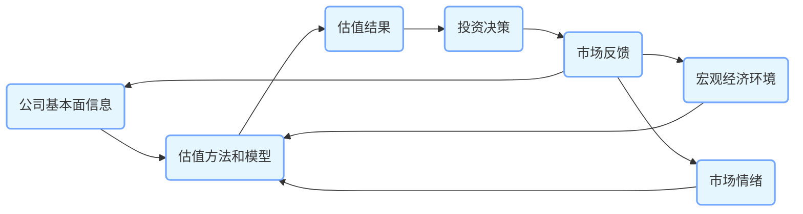

# 法国股市估值:欧元区重要经济体的投资价值

> 关键词：法国股市、估值、欧元区、投资价值、经济分析

> 摘要：本文聚焦于法国股市估值，深入探讨作为欧元区重要经济体的法国其股市所蕴含的投资价值。通过对法国股市相关背景的介绍，剖析其核心概念与联系，阐述核心算法原理与具体操作步骤，借助数学模型和公式进行理论支撑，结合项目实战案例进行详细解释说明，探究实际应用场景，推荐相关工具和资源，最后总结未来发展趋势与挑战并解答常见问题。旨在为投资者全面、深入地了解法国股市估值及投资价值提供专业的参考依据。

## 1. 背景介绍 
### 1.1 目的和范围
本文的目的在于全面、深入地分析法国股市的估值情况，挖掘其在欧元区重要经济体背景下所具备的投资价值。范围涵盖法国股市的历史发展、现状分析、估值方法探讨、投资价值评估以及未来趋势展望等多个方面。通过对这些内容的研究，为投资者提供科学、准确的决策依据，帮助他们更好地把握法国股市的投资机会。

### 1.2 预期读者
本文预期读者包括专业的金融投资者、股票分析师、金融研究机构人员、对法国股市及欧元区经济感兴趣的财经爱好者以及相关领域的学者等。这些读者希望通过本文深入了解法国股市的估值原理和投资价值，从而在投资决策、学术研究等方面获得有益的参考。

### 1.3 文档结构概述
本文将按照以下结构展开：首先介绍法国股市估值的背景信息，包括目的、预期读者和文档结构概述等；接着阐述核心概念与联系，明确相关概念的内涵和相互关系；然后讲解核心算法原理与具体操作步骤，通过Python代码详细说明；再运用数学模型和公式进行理论分析并举例说明；之后通过项目实战案例展示代码实现和解读；随后探讨实际应用场景；接着推荐相关的工具和资源；最后总结未来发展趋势与挑战，解答常见问题并提供扩展阅读和参考资料。

### 1.4 术语表
#### 1.4.1 核心术语定义
- **法国股市**：指法国境内进行股票发行、交易的市场，主要包括巴黎证券交易所等，是法国企业融资和投资者投资的重要平台。
- **估值**：对股票或整个股市的价值进行评估的过程，通过一定的方法和指标来确定其合理的价格区间。
- **投资价值**：指股票或股市对于投资者所具有的潜在获利能力和吸引力，包括股息收益、资本增值等方面。
- **欧元区**：指欧洲联盟成员中使用欧盟的统一货币——欧元的国家区域，法国是欧元区的重要成员国之一。

#### 1.4.2 相关概念解释
- **市盈率（P/E）**：是指股票价格除以每股收益的比率，反映了投资者为获取公司每一元盈利所愿意支付的价格，是衡量股票估值的常用指标之一。
- **市净率（P/B）**：是指股票价格与每股净资产的比率，用于评估股票相对于其净资产的价值，反映了市场对公司资产质量的预期。
- **股息率**：是指股息与股票价格的比率，体现了股票的分红水平，是衡量股票投资收益的重要指标之一。

#### 1.4.3 缩略词列表
- **P/E**：市盈率（Price - Earnings Ratio）
- **P/B**：市净率（Price - Book Ratio）

## 2. 核心概念与联系 

### 法国股市估值的核心概念原理
法国股市估值是基于多种因素对法国上市公司股票或整个股市的价值进行评估的过程。其核心原理在于综合考虑公司的基本面因素（如盈利能力、资产质量、现金流等）、宏观经济环境（如法国国内经济增长、欧元区经济形势等）以及市场情绪等因素。

从公司基本面来看，盈利能力是影响股票估值的重要因素之一。一家盈利能力强、业绩稳定增长的公司，其股票往往具有较高的估值。例如，法国的一些知名企业，如欧莱雅、施耐德电气等，由于其在全球市场具有较强的竞争力和稳定的盈利能力，其股票估值相对较高。

资产质量也是关键因素。公司的净资产、固定资产、无形资产等构成了其资产基础。资产质量好的公司，能够为股东提供更坚实的价值支撑，从而提升股票的估值。

宏观经济环境对法国股市估值有着重要影响。法国作为欧元区的重要经济体，其经济增长、通货膨胀、利率水平等宏观经济指标的变化会直接影响企业的经营环境和投资者的预期。例如，当法国经济增长强劲时，企业的盈利预期会增加，投资者对股市的信心也会增强，从而推动股市估值上升；反之，当经济衰退时，股市估值往往会下降。

市场情绪同样不可忽视。投资者的乐观或悲观情绪会导致股票价格的波动，进而影响股市估值。例如，在市场出现恐慌情绪时，投资者可能会大量抛售股票，导致股市估值大幅下降。

### 架构的文本示意图
法国股市估值的架构可以分为三个层次：基础层、中间层和上层。

基础层包括公司基本面信息，如财务报表数据（利润表、资产负债表、现金流量表等）、行业竞争态势、公司治理结构等。这些信息是评估股票估值的基础数据来源。

中间层是估值方法和模型，如市盈率法、市净率法、现金流折现法等。这些方法和模型根据基础层提供的数据，对股票或股市的价值进行计算和评估。

上层是投资决策和市场反馈。投资者根据中间层得出的估值结果，结合自身的投资目标和风险偏好，做出投资决策。这些决策会影响股票的供求关系，进而反馈到市场上，影响股票价格和股市估值。

### Mermaid 流程图


## 3. 核心算法原理 & 具体操作步骤 

### 市盈率法估值原理
市盈率法是一种常用的股票估值方法，其基本原理是根据股票的市盈率和每股收益来计算股票的价值。市盈率反映了市场对公司盈利的预期和投资者愿意为公司盈利支付的价格倍数。

计算公式为：股票价值 = 市盈率 × 每股收益

### Python 代码实现
```python
# 定义市盈率和每股收益
pe_ratio = 20  # 假设市盈率为 20
eps = 2.5  # 假设每股收益为 2.5

# 计算股票价值
stock_value = pe_ratio * eps

# 输出结果
print(f"根据市盈率法计算的股票价值为: {stock_value}")
```

### 操作步骤
1. 收集数据：收集目标公司的每股收益数据和同行业或市场的平均市盈率数据。每股收益可以从公司的财务报表中获取，平均市盈率可以通过金融数据提供商或相关研究机构获取。
2. 确定市盈率：根据目标公司的基本面情况、行业前景、市场环境等因素，选择合适的市盈率。可以选择同行业的平均市盈率作为参考，也可以根据自己的分析和判断进行调整。
3. 计算股票价值：将确定的市盈率乘以每股收益，得到股票的估值。
4. 评估投资价值：将计算得到的股票估值与当前股票市场价格进行比较。如果估值高于市场价格，说明股票可能被低估，具有投资价值；反之，如果估值低于市场价格，说明股票可能被高估，投资需谨慎。

### 市净率法估值原理
市净率法是根据股票的市净率和每股净资产来计算股票的价值。市净率反映了市场对公司净资产的估值水平。

计算公式为：股票价值 = 市净率 × 每股净资产

### Python 代码实现
```python
# 定义市净率和每股净资产
pb_ratio = 1.5  # 假设市净率为 1.5
book_value_per_share = 10  # 假设每股净资产为 10

# 计算股票价值
stock_value = pb_ratio * book_value_per_share

# 输出结果
print(f"根据市净率法计算的股票价值为: {stock_value}")
```

### 操作步骤
1. 收集数据：收集目标公司的每股净资产数据和同行业或市场的平均市净率数据。每股净资产可以从公司的资产负债表中获取，平均市净率可以通过金融数据提供商或相关研究机构获取。
2. 确定市净率：根据目标公司的资产质量、行业特点、市场环境等因素，选择合适的市净率。可以选择同行业的平均市净率作为参考，也可以根据自己的分析和判断进行调整。
3. 计算股票价值：将确定的市净率乘以每股净资产，得到股票的估值。
4. 评估投资价值：将计算得到的股票估值与当前股票市场价格进行比较。如果估值高于市场价格，说明股票可能被低估，具有投资价值；反之，如果估值低于市场价格，说明股票可能被高估，投资需谨慎。

## 4. 数学模型和公式 & 详细讲解 & 举例说明 

### 现金流折现模型（DCF）
现金流折现模型是一种基于未来现金流的股票估值模型，其核心思想是将公司未来的现金流按照一定的折现率折现到当前时刻，得到公司的内在价值。

#### 数学公式
$$V = \sum_{t = 1}^{n} \frac{CF_t}{(1 + r)^t} + \frac{TV}{(1 + r)^n}$$

其中：
- $V$ 表示公司的内在价值
- $CF_t$ 表示第 $t$ 期的自由现金流
- $r$ 表示折现率
- $n$ 表示预测期数
- $TV$ 表示终值

#### 详细讲解
1. **自由现金流（$CF_t$）**：自由现金流是指公司在满足了所有必要的资本支出和营运资金需求后剩余的现金流，它反映了公司实际可用于分配给股东或进行再投资的现金流量。计算自由现金流需要对公司的财务报表进行分析和调整。
2. **折现率（$r$）**：折现率是将未来现金流折现到当前时刻的比率，它反映了投资者对投资风险的预期和要求的回报率。折现率通常由无风险利率和风险溢价组成。无风险利率可以参考国债收益率，风险溢价则根据公司的行业特点、经营风险、财务风险等因素确定。
3. **预测期数（$n$）**：预测期数是指对公司未来现金流进行预测的时间段。一般来说，预测期数不宜过长，通常为 5 - 10 年。
4. **终值（$TV$）**：终值是指预测期结束后公司的价值。终值的计算通常采用永续增长模型，假设公司在预测期结束后以一个稳定的增长率持续增长。

#### 举例说明
假设某法国公司的初始自由现金流为 1000 万欧元，预计未来 5 年的自由现金流增长率分别为 10%、8%、6%、4%、2%，从第 6 年开始，自由现金流将以 1% 的增长率永续增长。折现率为 8%。

首先，计算前 5 年的自由现金流：
- $CF_1 = 1000 \times (1 + 0.1) = 1100$ 万欧元
- $CF_2 = 1100 \times (1 + 0.08) = 1188$ 万欧元
- $CF_3 = 1188 \times (1 + 0.06) = 1259.28$ 万欧元
- $CF_4 = 1259.28 \times (1 + 0.04) = 1309.65$ 万欧元
- $CF_5 = 1309.65 \times (1 + 0.02) = 1335.84$ 万欧元

然后，计算第 6 年的自由现金流：
$CF_6 = 1335.84 \times (1 + 0.01) = 1349.20$ 万欧元

接着，计算终值：
$TV = \frac{CF_6}{r - g} = \frac{1349.20}{0.08 - 0.01} = 19274.29$ 万欧元

最后，计算公司的内在价值：
$$V = \frac{1100}{(1 + 0.08)^1} + \frac{1188}{(1 + 0.08)^2} + \frac{1259.28}{(1 + 0.08)^3} + \frac{1309.65}{(1 + 0.08)^4} + \frac{1335.84}{(1 + 0.08)^5} + \frac{19274.29}{(1 + 0.08)^5}$$
$$V \approx 1018.52 + 1017.86 + 992.38 + 954.77 + 908.44 + 12944.84 = 17836.81$$ 万欧元

### 股息折现模型（DDM）
股息折现模型是一种基于股息的股票估值模型，其核心思想是将公司未来的股息按照一定的折现率折现到当前时刻，得到股票的内在价值。

#### 数学公式
- **零增长模型**：$V = \frac{D}{r}$
其中：
- $V$ 表示股票的内在价值
- $D$ 表示每年固定的股息
- $r$ 表示折现率

- **固定增长模型**：$V = \frac{D_1}{r - g}$
其中：
- $D_1$ 表示下一期的股息
- $g$ 表示股息的固定增长率

#### 详细讲解
1. **零增长模型**：适用于股息稳定不变的公司。假设公司每年支付的股息相同，将股息按照折现率折现到当前时刻，即可得到股票的内在价值。
2. **固定增长模型**：适用于股息以固定增长率增长的公司。假设公司的股息以一个固定的增长率 $g$ 持续增长，将下一期的股息按照折现率 $r$ 与增长率 $g$ 的差值折现到当前时刻，即可得到股票的内在价值。

#### 举例说明
- **零增长模型**：假设某法国公司每年支付的股息为 2 欧元，折现率为 10%。则该股票的内在价值为：
$V = \frac{2}{0.1} = 20$ 欧元

- **固定增长模型**：假设某法国公司下一期的股息为 2.2 欧元，股息的固定增长率为 5%，折现率为 10%。则该股票的内在价值为：
$V = \frac{2.2}{0.1 - 0.05} = 44$ 欧元

## 5. 项目实战：代码实际案例和详细解释说明 

### 5.1  开发环境搭建
1. **安装 Python**：从 Python 官方网站（https://www.python.org/downloads/）下载并安装 Python 3.x 版本。
2. **安装必要的库**：使用 pip 命令安装以下库：
```sh
pip install pandas numpy matplotlib yfinance
```
- `pandas`：用于数据处理和分析。
- `numpy`：用于数值计算。
- `matplotlib`：用于数据可视化。
- `yfinance`：用于获取股票数据。

### 5.2  源代码详细实现和代码解读
以下是一个使用 Python 计算法国股票市盈率和市净率并进行估值分析的示例代码：

```python
import yfinance as yf
import pandas as pd

# 定义股票代码（以法国知名公司欧莱雅为例，股票代码为 OR.PA）
stock_symbol = 'OR.PA'

# 获取股票数据
stock_data = yf.Ticker(stock_symbol)

# 获取每股收益（EPS）和每股净资产（Book Value per Share）
try:
    eps = stock_data.info['trailingEps']
    book_value_per_share = stock_data.info['bookValue']
except KeyError:
    print("无法获取每股收益或每股净资产数据。")
    eps = None
    book_value_per_share = None

# 获取当前股票价格
try:
    current_price = stock_data.history(period='1d')['Close'].iloc[-1]
except IndexError:
    print("无法获取当前股票价格数据。")
    current_price = None

# 计算市盈率和市净率
if eps is not None and current_price is not None:
    pe_ratio = current_price / eps
    print(f"市盈率 (P/E): {pe_ratio}")
else:
    print("无法计算市盈率。")

if book_value_per_share is not None and current_price is not None:
    pb_ratio = current_price / book_value_per_share
    print(f"市净率 (P/B): {pb_ratio}")
else:
    print("无法计算市净率。")

# 进行估值分析
if pe_ratio is not None and pb_ratio is not None:
    # 假设同行业平均市盈率为 25，平均市净率为 3
    average_pe = 25
    average_pb = 3

    if pe_ratio < average_pe and pb_ratio < average_pb:
        print("该股票可能被低估，具有投资价值。")
    elif pe_ratio > average_pe and pb_ratio > average_pb:
        print("该股票可能被高估，投资需谨慎。")
    else:
        print("该股票估值处于合理范围。")
```

### 5.3  代码解读与分析
1. **导入必要的库**：导入 `yfinance` 库用于获取股票数据，`pandas` 库用于数据处理。
2. **定义股票代码**：选择法国知名公司欧莱雅的股票代码 `OR.PA` 作为示例。
3. **获取股票数据**：使用 `yf.Ticker` 函数获取股票的基本信息和历史数据。
4. **获取每股收益和每股净资产**：从股票信息中提取每股收益和每股净资产数据。如果无法获取这些数据，会输出相应的错误信息。
5. **获取当前股票价格**：从历史数据中提取当前股票价格。如果无法获取价格数据，会输出相应的错误信息。
6. **计算市盈率和市净率**：根据当前股票价格、每股收益和每股净资产计算市盈率和市净率。如果数据缺失，则无法计算相应的比率。
7. **进行估值分析**：假设同行业平均市盈率为 25，平均市净率为 3。将计算得到的市盈率和市净率与平均水平进行比较，判断股票是否被低估、高估或处于合理范围，并输出相应的结论。

## 6. 实际应用场景 
### 投资者决策
投资者可以利用法国股市估值的方法和结果，判断股票的投资价值，从而做出合理的投资决策。例如，通过计算市盈率、市净率等指标，比较不同股票的估值水平，选择被低估的股票进行投资，以获取更高的收益。同时，投资者还可以根据现金流折现模型等方法，评估公司的内在价值，判断股票的长期投资价值。

### 金融机构研究
金融机构（如银行、证券公司、基金公司等）可以对法国股市进行深入研究，为客户提供专业的投资建议和研究报告。金融分析师可以运用各种估值方法，对法国上市公司进行分析和评级，帮助客户了解股票的投资价值和风险。此外，金融机构还可以通过对法国股市估值的研究，制定投资策略和资产配置方案，为客户实现资产的保值增值。

### 企业并购重组
在企业并购重组过程中，准确的估值是关键环节之一。收购方需要对目标公司的价值进行评估，以确定合理的收购价格。通过对法国股市估值的研究和分析，可以采用合适的估值方法，评估目标公司的资产、盈利能力、市场竞争力等因素，为并购重组决策提供依据。同时，被收购方也可以通过估值了解自身的价值，在谈判中争取更有利的条件。

### 宏观经济分析
法国股市估值与宏观经济环境密切相关。政府部门、经济研究机构等可以通过对法国股市估值的监测和分析，了解宏观经济的运行状况和市场预期。例如，当股市估值普遍上升时，可能意味着市场对经济前景较为乐观，经济增长预期较强；反之，当股市估值下降时，可能反映出市场对经济形势的担忧。通过对股市估值的分析，可以为宏观经济政策的制定和调整提供参考。

## 7. 工具和资源推荐
### 7.1 学习资源推荐
#### 7.1.1 书籍推荐
- 《证券分析》（本杰明·格雷厄姆著）：被誉为投资领域的圣经，详细介绍了股票估值的基本原理和方法，对价值投资理念进行了深入阐述。
- 《聪明的投资者》（本杰明·格雷厄姆著）：是格雷厄姆的另一部经典著作，适合普通投资者阅读，书中提供了实用的投资策略和方法，帮助投资者做出明智的投资决策。
- 《财务报表分析与证券定价》（斯蒂芬·佩因曼著）：从财务报表分析的角度出发，介绍了如何通过财务数据评估公司的价值和股票的投资价值，具有较高的专业性和实用性。

#### 7.1.2 在线课程
- Coursera 平台上的“投资学原理”课程：由知名大学的教授授课，系统地介绍了投资学的基本理论和方法，包括股票估值、资产定价等内容。
- edX 平台上的“财务报表分析”课程：专注于财务报表的分析方法和技巧，帮助学习者掌握如何通过财务报表评估公司的财务状况和经营业绩，为股票估值提供基础。
- 中国大学 MOOC 平台上的“金融市场学”课程：涵盖了金融市场的各个方面，包括股票市场、债券市场等，对股票估值的相关理论和方法也有详细讲解。

#### 7.1.3 技术博客和网站
- Seeking Alpha（https://seekingalpha.com/）：是一个专业的金融投资博客网站，提供全球股市的分析和评论，包括法国股市。网站上有许多专业的投资者和分析师分享他们的观点和研究成果，对投资者了解法国股市估值和投资价值有很大帮助。
- Bloomberg（https://www.bloomberg.com/）：是全球知名的金融资讯提供商，提供实时的金融市场数据、新闻和分析。通过 Bloomberg 可以获取法国股市的最新行情、公司财务数据等信息，为股票估值和投资决策提供数据支持。
- Yahoo Finance（https://finance.yahoo.com/）：是一个综合性的金融网站，提供股票、债券、基金等多种金融产品的信息和分析。Yahoo Finance 上有丰富的法国股市数据和研究报告，方便投资者进行股票估值和投资分析。

### 7.2 开发工具框架推荐
#### 7.2.1 IDE和编辑器
- PyCharm：是一款专业的 Python 集成开发环境（IDE），具有强大的代码编辑、调试、版本控制等功能，适合开发和调试与法国股市估值相关的 Python 代码。
- Jupyter Notebook：是一个交互式的开发环境，支持 Python 等多种编程语言。Jupyter Notebook 可以方便地进行数据处理、分析和可视化，适合进行法国股市估值的数据分析和模型验证。
- Visual Studio Code：是一款轻量级的代码编辑器，具有丰富的插件生态系统。通过安装 Python 相关的插件，Visual Studio Code 可以成为一个强大的 Python 开发工具，适合快速开发和测试与法国股市估值相关的代码。

#### 7.2.2 调试和性能分析工具
- pdb：是 Python 内置的调试器，可以帮助开发者在代码中设置断点、单步执行、查看变量值等，方便调试与法国股市估值相关的 Python 代码。
- cProfile：是 Python 内置的性能分析工具，可以分析代码的执行时间和函数调用次数，帮助开发者找出代码中的性能瓶颈，优化与法国股市估值相关的代码。
- Py-Spy：是一个开源的 Python 性能分析工具，可以实时分析 Python 程序的性能，找出性能瓶颈并提供优化建议，适用于分析与法国股市估值相关的复杂 Python 程序。

#### 7.2.3 相关框架和库
- Pandas：是一个强大的数据处理和分析库，提供了高效的数据结构和数据操作方法，适合处理和分析法国股市的历史数据、财务数据等。
- Numpy：是一个用于数值计算的库，提供了高效的数组操作和数学函数，在法国股市估值的数学模型计算中发挥重要作用。
- Matplotlib：是一个用于数据可视化的库，可以绘制各种类型的图表，如折线图、柱状图、散点图等，帮助开发者直观地展示法国股市数据和估值结果。
- Scikit-learn：是一个机器学习库，提供了多种机器学习算法和工具，可用于构建和训练与法国股市估值相关的预测模型，如回归模型、分类模型等。

### 7.3 相关论文著作推荐
#### 7.3.1 经典论文
- Fama, E. F., & French, K. R. (1992). The cross - section of expected stock returns. The Journal of Finance, 47(2), 427 - 465. 该论文提出了著名的 Fama - French 三因子模型，对股票收益的横截面进行了深入分析，为股票估值和投资组合理论提供了重要的理论基础。
- Sharpe, W. F. (1964). Capital asset prices: A theory of market equilibrium under conditions of risk. The Journal of Finance, 19(3), 425 - 442. 这篇论文提出了资本资产定价模型（CAPM），阐述了资产的预期收益率与风险之间的关系，是现代金融理论的重要基石之一，对股票估值和投资决策具有重要的指导意义。

#### 7.3.2 最新研究成果
- 关注国际知名金融学术期刊，如 The Journal of Financial Economics、The Review of Financial Studies 等，这些期刊会发表关于股票估值、金融市场等领域的最新研究成果，及时了解法国股市估值的前沿理论和方法。
- 参加国际金融学术会议，如 American Finance Association（AFA）年会、European Finance Association（EFA）年会等，与全球的金融学者和研究人员交流最新的研究进展和成果。

#### 7.3.3 应用案例分析
- 一些知名的金融研究机构和咨询公司会发布关于法国股市估值和投资的应用案例分析报告，如麦肯锡公司、波士顿咨询集团等。这些报告通过实际案例分析，展示了如何运用各种估值方法和工具对法国上市公司进行估值和投资决策，具有较高的参考价值。
- 上市公司的年报和招股说明书中也包含了丰富的公司财务信息和估值分析内容，可以通过研究这些文档，了解企业自身的估值方法和市场对企业的估值情况，为法国股市估值的研究提供实际案例参考。

## 8. 总结：未来发展趋势与挑战
### 未来发展趋势
1. **数字化转型加速**：随着信息技术的不断发展，法国股市将加速数字化转型。电子交易平台将更加智能化、高效化，投资者可以通过移动终端随时随地进行股票交易和投资分析。同时，大数据、人工智能等技术将在股市估值和投资决策中得到更广泛的应用，提高估值的准确性和投资决策的科学性。
2. **可持续投资兴起**：在全球可持续发展的背景下，投资者对企业的环境、社会和治理（ESG）表现越来越关注。法国作为欧洲可持续发展的重要推动者，法国股市中的可持续投资将逐渐兴起。具有良好 ESG 表现的企业将受到投资者的青睐，其股票估值也可能会相应提高。
3. **国际化程度加深**：法国股市作为欧元区重要的金融市场之一，将进一步加深国际化程度。随着欧洲一体化进程的推进和全球金融市场的互联互通，更多的国际投资者将参与法国股市的投资，法国上市公司也将更多地走向国际市场。这将促进法国股市与国际金融市场的融合，提高法国股市的国际影响力。

### 挑战
1. **宏观经济不确定性**：全球经济形势的不确定性，如贸易摩擦、地缘政治风险、疫情等，将对法国经济和法国股市产生影响。宏观经济环境的变化可能导致企业盈利波动，进而影响股票估值和投资价值。投资者需要密切关注宏观经济动态，及时调整投资策略。
2. **技术风险**：数字化转型和新技术的应用也带来了技术风险。例如，网络安全问题可能导致投资者信息泄露和交易系统故障，影响股市的正常运行。同时，人工智能等技术在股市估值和投资决策中的应用也存在模型误差和数据偏差等问题，需要不断改进和完善。
3. **监管压力**：随着金融市场的发展和变化，监管机构对股市的监管力度将不断加强。法国股市需要遵守严格的监管规定，如信息披露要求、市场操纵防范等。企业和投资者需要适应不断变化的监管环境，确保合规运营和投资。

## 9. 附录：常见问题与解答
### 问题 1：如何获取准确的法国股市数据？
答：可以通过以下途径获取准确的法国股市数据：
- 金融数据提供商，如 Bloomberg、Yahoo Finance 等，这些平台提供实时的股票行情、公司财务数据等信息。
- 法国证券交易所的官方网站，可获取上市公司的公告、财务报表等详细信息。
- 专业的金融数据库，如 Wind 数据库、CEIC 数据库等，提供丰富的金融数据和研究报告。

### 问题 2：不同的估值方法得出的结果差异较大，如何选择合适的估值方法？
答：选择合适的估值方法需要考虑以下因素：
- 公司的特点：不同类型的公司适用不同的估值方法。例如，对于盈利稳定的公司，市盈率法和股息折现模型可能比较适用；对于资产密集型公司，市净率法可能更合适；对于具有高增长潜力的公司，现金流折现模型可能更能反映其内在价值。
- 数据的可获取性：某些估值方法需要特定的数据支持，如果数据无法获取或不准确，可能会影响估值结果的准确性。因此，需要根据数据的可获取性选择合适的估值方法。
- 市场环境：市场环境的变化也会影响估值方法的选择。例如，在市场波动较大的情况下，相对估值法（如市盈率法、市净率法）可能更具参考价值；在市场稳定的情况下，绝对估值法（如现金流折现模型、股息折现模型）可能更能反映公司的内在价值。

### 问题 3：法国股市与其他国家股市有哪些关联？
答：法国股市与其他国家股市存在多方面的关联：
- 宏观经济关联：全球经济一体化使得各国经济相互依存，法国经济的发展受到全球经济形势的影响，其他国家的经济数据和政策变化也会对法国股市产生影响。例如，美国经济数据的好坏可能会影响全球投资者的风险偏好，进而影响法国股市。
- 行业关联：一些跨国企业在多个国家上市，其业绩和发展前景会同时影响相关国家的股市。此外，某些行业具有全球性的产业链，行业的发展动态会在不同国家的股市中有所体现。例如，汽车行业的发展趋势会影响法国、德国、日本等国家的汽车相关股票。
- 资金流动关联：全球投资者会根据不同国家股市的估值水平、风险状况等因素进行资产配置，资金的流动会导致不同国家股市之间的联动。当某个国家的股市表现较好时，可能会吸引全球资金流入，反之则可能导致资金流出。

### 问题 4：法国股市投资有哪些风险？
答：法国股市投资存在以下风险：
- 市场风险：股票价格会受到宏观经济环境、市场情绪、行业竞争等多种因素的影响，导致股价波动。投资者可能面临股价下跌的风险，从而造成投资损失。
- 公司风险：个别公司可能会面临经营不善、财务造假、管理层变动等问题，这些问题会影响公司的业绩和股价，给投资者带来风险。
- 汇率风险：如果投资者使用非欧元货币投资法国股市，汇率的波动会影响投资收益。当欧元贬值时，投资者的投资收益可能会减少。
- 政策风险：法国政府的经济政策、税收政策、监管政策等的变化可能会对股市产生影响，投资者需要关注政策动态，及时调整投资策略。

## 10. 扩展阅读 & 参考资料
### 扩展阅读
- 《金融炼金术》（乔治·索罗斯著）：书中介绍了索罗斯的投资哲学和操作方法，对理解金融市场的运行机制和股票投资有很大的启发。
- 《漫步华尔街》（伯顿·马尔基尔著）：这本书以通俗易懂的语言介绍了股票投资的基本知识和策略，适合初学者阅读。
- 《金融市场与金融机构基础》（弗兰克·J·法博齐等著）：系统地介绍了金融市场和金融机构的基本概念、运作机制和发展趋势，对全面了解金融市场有很大帮助。

### 参考资料
- 法国证券交易所官方网站（https://www.euronext.com/）
- 欧洲央行官方网站（https://www.ecb.europa.eu/）
- 法国统计局官方网站（https://www.insee.fr/）
- 相关金融学术期刊和研究报告，如 The Journal of Finance、The Journal of Financial Economics 等。