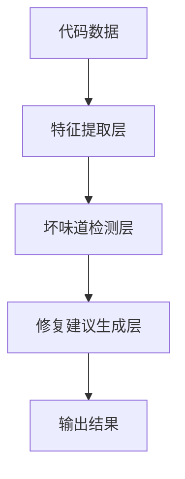

# 深度学习在代码坏味道检测与修复建议中的应用

> 关键词：深度学习、代码坏味道、检测、修复建议、软件质量

> 摘要：本文深入探讨了深度学习在代码坏味道检测与修复建议中的应用。首先介绍了相关背景，包括目的、预期读者等内容。接着阐述了核心概念及联系，详细讲解了核心算法原理与具体操作步骤，并给出了对应的 Python 代码。同时，对相关的数学模型和公式进行了详细说明与举例。通过项目实战，展示了代码的实际案例及分析。探讨了深度学习在代码坏味道检测与修复建议中的实际应用场景，推荐了相关的工具和资源。最后总结了未来发展趋势与挑战，还给出了常见问题的解答及扩展阅读与参考资料，旨在为提升软件代码质量提供全面而深入的技术指导。

## 1. 背景介绍 
### 1.1 目的和范围
在软件开发过程中，代码坏味道是指那些表面上不会影响程序正常运行，但实际上会降低代码的可维护性、可扩展性和可读性的代码特征。随着软件系统规模的不断增大，手动检测和修复代码坏味道变得越来越困难且效率低下。本研究的目的是利用深度学习技术，开发出高效准确的代码坏味道检测与修复建议系统，提高软件的质量和开发效率。

本研究的范围涵盖了常见的代码坏味道类型，如过长方法、过大类、数据泥团等。通过对大量开源代码的学习和分析，训练深度学习模型来识别这些坏味道，并给出相应的修复建议。

### 1.2 预期读者
本文的预期读者包括软件开发人员、软件测试人员、软件架构师以及对深度学习和软件工程领域感兴趣的研究人员。对于软件开发人员来说，了解如何利用深度学习检测和修复代码坏味道可以提高他们的代码质量和开发效率；软件测试人员可以借助相关技术更全面地进行软件测试；软件架构师可以从宏观角度把握软件系统的质量；研究人员则可以在此基础上进行更深入的学术研究。

### 1.3 文档结构概述
本文首先介绍了研究的背景，包括目的、预期读者和文档结构概述等内容。接着阐述了深度学习在代码坏味道检测与修复建议中的核心概念及它们之间的联系，并给出了相应的文本示意图和 Mermaid 流程图。然后详细讲解了核心算法原理和具体操作步骤，通过 Python 代码进行了深入阐述。之后介绍了相关的数学模型和公式，并举例说明。在项目实战部分，展示了代码的实际案例和详细的代码解读与分析。探讨了深度学习在该领域的实际应用场景，推荐了相关的工具和资源。最后总结了未来的发展趋势与挑战，给出了常见问题的解答及扩展阅读与参考资料。

### 1.4 术语表
#### 1.4.1 核心术语定义
- **代码坏味道**：指那些在代码中存在的，可能导致软件可维护性、可扩展性和可读性降低的代码特征或模式。
- **深度学习**：是一类基于人工神经网络的机器学习技术，通过构建多层神经网络来自动学习数据中的特征和模式。
- **软件质量**：软件满足规定需求和隐含需求能力的特性总和，包括功能性、可靠性、易用性、效率、可维护性和可移植性等方面。

#### 1.4.2 相关概念解释
- **机器学习**：是一门多领域交叉学科，涉及概率论、统计学、逼近论、凸分析、算法复杂度理论等多门学科。它专门研究计算机怎样模拟或实现人类的学习行为，以获取新的知识或技能，重新组织已有的知识结构使之不断改善自身的性能。
- **人工神经网络**：是一种模仿人类神经系统的计算模型，由大量的神经元组成，这些神经元通过连接权重相互作用，能够自动学习数据中的复杂模式和特征。

#### 1.4.3 缩略词列表
- **CNN**：Convolutional Neural Network，卷积神经网络
- **RNN**：Recurrent Neural Network，循环神经网络
- **LSTM**：Long Short - Term Memory，长短期记忆网络
- **GRU**：Gated Recurrent Unit，门控循环单元

## 2. 核心概念与联系 

### 核心概念原理
#### 代码坏味道
代码坏味道是软件开发过程中逐渐形成的一些不良代码模式。例如，过长方法是指一个方法包含了过多的代码逻辑，导致代码难以理解和维护；过大类是指一个类承担了过多的职责，违反了单一职责原则。这些坏味道可能是由于开发人员的经验不足、时间压力等原因造成的。

#### 深度学习
深度学习通过构建多层神经网络来学习数据中的特征和模式。在代码坏味道检测中，深度学习模型可以将代码作为输入，通过学习代码的语法、语义等特征，判断代码是否存在坏味道，并给出相应的修复建议。常见的深度学习模型包括卷积神经网络（CNN）、循环神经网络（RNN）及其变体（如 LSTM、GRU）等。

### 架构的文本示意图
```plaintext
输入层（代码数据） -> 特征提取层（深度学习模型） -> 坏味道检测层（分类器） -> 修复建议生成层 -> 输出层（坏味道检测结果和修复建议）
```

### Mermaid 流程图


## 3. 核心算法原理 & 具体操作步骤 

### 核心算法原理
在代码坏味道检测与修复建议中，我们可以使用卷积神经网络（CNN）来提取代码的特征。CNN 由卷积层、池化层和全连接层组成。卷积层通过卷积核在代码数据上滑动，提取局部特征；池化层用于减少特征的维度，降低计算量；全连接层将提取的特征进行组合，输出分类结果。

### 具体操作步骤
1. **数据预处理**：将代码数据进行清洗、分词等操作，将其转换为适合深度学习模型输入的格式。
2. **模型构建**：构建 CNN 模型，包括定义卷积层、池化层和全连接层的参数。
3. **模型训练**：使用标注好的代码数据对模型进行训练，调整模型的参数，使其能够准确地检测代码坏味道。
4. **坏味道检测**：使用训练好的模型对新的代码数据进行检测，判断是否存在坏味道。
5. **修复建议生成**：根据检测结果，生成相应的修复建议。

### Python 源代码详细阐述
```python
import numpy as np
import tensorflow as tf
from tensorflow.keras import layers, models

# 数据预处理
def preprocess_data(code_data):
    # 这里简单示例，将代码转换为数字序列
    tokenized_code = [list(map(ord, line)) for line in code_data]
    max_length = max(len(line) for line in tokenized_code)
    padded_code = np.array([line + [0] * (max_length - len(line)) for line in tokenized_code])
    return padded_code

# 模型构建
def build_model(input_shape):
    model = models.Sequential()
    model.add(layers.Conv1D(32, 3, activation='relu', input_shape=input_shape))
    model.add(layers.MaxPooling1D(2))
    model.add(layers.Flatten())
    model.add(layers.Dense(64, activation='relu'))
    model.add(layers.Dense(1, activation='sigmoid'))
    model.compile(optimizer='adam', loss='binary_crossentropy', metrics=['accuracy'])
    return model

# 模型训练
def train_model(model, X_train, y_train, epochs=10, batch_size=32):
    model.fit(X_train, y_train, epochs=epochs, batch_size=batch_size)
    return model

# 坏味道检测
def detect_bad_smell(model, code_data):
    processed_data = preprocess_data(code_data)
    predictions = model.predict(processed_data)
    return predictions

# 修复建议生成（简单示例）
def generate_repair_suggestion(predictions):
    suggestions = []
    for pred in predictions:
        if pred > 0.5:
            suggestions.append("可能存在代码坏味道，请检查代码逻辑并简化。")
        else:
            suggestions.append("代码质量良好。")
    return suggestions

# 示例代码数据
code_data = ["def long_method():", "    # 很多代码逻辑", "    pass"]
X_train = preprocess_data(code_data)
y_train = np.array([1])  # 假设这是有坏味道的代码

# 构建模型
input_shape = (X_train.shape[1], 1)
model = build_model(input_shape)

# 训练模型
trained_model = train_model(model, X_train, y_train)

# 检测坏味道
predictions = detect_bad_smell(trained_model, code_data)

# 生成修复建议
suggestions = generate_repair_suggestion(predictions)
print(suggestions)
```

## 4. 数学模型和公式 & 详细讲解 & 举例说明 

### 卷积操作
卷积操作是 CNN 的核心操作之一，其数学公式为：
$$y_{i,j} = \sum_{m=0}^{M - 1}\sum_{n=0}^{N - 1}x_{i + m,j + n} \cdot w_{m,n} + b$$
其中，$x$ 是输入数据，$w$ 是卷积核，$b$ 是偏置项，$y$ 是卷积输出。

详细讲解：卷积操作通过卷积核在输入数据上滑动，将卷积核与输入数据对应位置的元素相乘并求和，再加上偏置项，得到卷积输出。这个过程可以提取输入数据的局部特征。

举例说明：假设输入数据 $x$ 是一个 $3\times3$ 的矩阵：
$$x = \begin{bmatrix}
1 & 2 & 3 \\
4 & 5 & 6 \\
7 & 8 & 9
\end{bmatrix}$$
卷积核 $w$ 是一个 $2\times2$ 的矩阵：
$$w = \begin{bmatrix}
1 & 0 \\
0 & 1
\end{bmatrix}$$
偏置项 $b = 1$。

首先，卷积核在输入数据的左上角位置进行卷积操作：
$$y_{0,0} = 1\times1 + 2\times0 + 4\times0 + 5\times1 + 1 = 7$$
然后，卷积核向右滑动一个位置：
$$y_{0,1} = 2\times1 + 3\times0 + 5\times0 + 6\times1 + 1 = 9$$
以此类推，最终得到卷积输出。

### 池化操作
池化操作通常用于减少特征的维度，常见的池化操作有最大池化和平均池化。最大池化的数学公式为：
$$y_{i,j} = \max_{m = 0}^{M - 1}\max_{n = 0}^{N - 1}x_{i\times s + m,j\times s + n}$$
其中，$x$ 是输入数据，$s$ 是池化步长，$y$ 是池化输出。

详细讲解：最大池化操作在输入数据的每个池化窗口内选择最大的元素作为输出，从而减少数据的维度，同时保留重要的特征。

举例说明：假设输入数据 $x$ 是一个 $4\times4$ 的矩阵：
$$x = \begin{bmatrix}
1 & 2 & 3 & 4 \\
5 & 6 & 7 & 8 \\
9 & 10 & 11 & 12 \\
13 & 14 & 15 & 16
\end{bmatrix}$$
池化窗口大小为 $2\times2$，步长 $s = 2$。

首先，在左上角的 $2\times2$ 窗口内选择最大元素：
$$y_{0,0} = \max(1, 2, 5, 6) = 6$$
然后，向右滑动一个窗口：
$$y_{0,1} = \max(3, 4, 7, 8) = 8$$
以此类推，最终得到池化输出。

### 全连接层
全连接层将前面层提取的特征进行组合，其数学公式为：
$$y = \sigma(Wx + b)$$
其中，$x$ 是输入特征，$W$ 是权重矩阵，$b$ 是偏置向量，$\sigma$ 是激活函数。

详细讲解：全连接层将输入特征与权重矩阵相乘，再加上偏置向量，然后通过激活函数进行非线性变换，得到输出结果。

举例说明：假设输入特征 $x$ 是一个长度为 4 的向量：
$$x = \begin{bmatrix}
1 \\
2 \\
3 \\
4
\end{bmatrix}$$
权重矩阵 $W$ 是一个 $2\times4$ 的矩阵：
$$W = \begin{bmatrix}
1 & 2 & 3 & 4 \\
5 & 6 & 7 & 8
\end{bmatrix}$$
偏置向量 $b$ 是一个长度为 2 的向量：
$$b = \begin{bmatrix}
1 \\
2
\end{bmatrix}$$
激活函数 $\sigma$ 为 sigmoid 函数。

首先计算 $Wx + b$：
$$Wx + b = \begin{bmatrix}
1\times1 + 2\times2 + 3\times3 + 4\times4 + 1 \\
5\times1 + 6\times2 + 7\times3 + 8\times4 + 2
\end{bmatrix} = \begin{bmatrix}
31 \\
76
\end{bmatrix}$$
然后通过 sigmoid 函数进行非线性变换：
$$y = \begin{bmatrix}
\frac{1}{1 + e^{-31}} \\
\frac{1}{1 + e^{-76}}
\end{bmatrix}$$

## 5. 项目实战：代码实际案例和详细解释说明 

### 5.1  开发环境搭建
1. **安装 Python**：建议安装 Python 3.7 及以上版本，可以从 Python 官方网站下载并安装。
2. **安装深度学习框架**：使用 TensorFlow 作为深度学习框架，可以通过以下命令进行安装：
```sh
pip install tensorflow
```
3. **安装其他依赖库**：如 NumPy、Pandas 等，可以使用以下命令进行安装：
```sh
pip install numpy pandas
```

### 5.2  源代码详细实现和代码解读
```python
import numpy as np
import tensorflow as tf
from tensorflow.keras import layers, models
import pandas as pd

# 数据加载和预处理
def load_and_preprocess_data(file_path):
    data = pd.read_csv(file_path)
    code_data = data['code'].tolist()
    labels = data['label'].tolist()

    # 代码预处理
    tokenized_code = [list(map(ord, line)) for line in code_data]
    max_length = max(len(line) for line in tokenized_code)
    padded_code = np.array([line + [0] * (max_length - len(line)) for line in tokenized_code])

    return padded_code, np.array(labels)

# 模型构建
def build_model(input_shape):
    model = models.Sequential()
    model.add(layers.Conv1D(32, 3, activation='relu', input_shape=input_shape))
    model.add(layers.MaxPooling1D(2))
    model.add(layers.Flatten())
    model.add(layers.Dense(64, activation='relu'))
    model.add(layers.Dense(1, activation='sigmoid'))
    model.compile(optimizer='adam', loss='binary_crossentropy', metrics=['accuracy'])
    return model

# 模型训练
def train_model(model, X_train, y_train, epochs=10, batch_size=32):
    model.fit(X_train, y_train, epochs=epochs, batch_size=batch_size)
    return model

# 坏味道检测
def detect_bad_smell(model, code_data):
    tokenized_code = [list(map(ord, line)) for line in code_data]
    max_length = max(len(line) for line in tokenized_code)
    padded_code = np.array([line + [0] * (max_length - len(line)) for line in tokenized_code])
    predictions = model.predict(padded_code)
    return predictions

# 修复建议生成（简单示例）
def generate_repair_suggestion(predictions):
    suggestions = []
    for pred in predictions:
        if pred > 0.5:
            suggestions.append("可能存在代码坏味道，请检查代码逻辑并简化。")
        else:
            suggestions.append("代码质量良好。")
    return suggestions

# 主函数
if __name__ == "__main__":
    # 加载数据
    file_path = "code_data.csv"
    X, y = load_and_preprocess_data(file_path)

    # 划分训练集和测试集
    train_size = int(0.8 * len(X))
    X_train, X_test = X[:train_size], X[train_size:]
    y_train, y_test = y[:train_size], y[train_size:]

    # 构建模型
    input_shape = (X_train.shape[1], 1)
    model = build_model(input_shape)

    # 训练模型
    trained_model = train_model(model, X_train, y_train)

    # 检测坏味道
    test_code_data = ["def long_method():", "    # 很多代码逻辑", "    pass"]
    predictions = detect_bad_smell(trained_model, test_code_data)

    # 生成修复建议
    suggestions = generate_repair_suggestion(predictions)
    print(suggestions)
```

### 5.3  代码解读与分析
1. **数据加载和预处理**：`load_and_preprocess_data` 函数从 CSV 文件中加载代码数据和标签，将代码转换为数字序列，并进行填充，使其长度一致。
2. **模型构建**：`build_model` 函数构建了一个简单的 CNN 模型，包括卷积层、池化层和全连接层。
3. **模型训练**：`train_model` 函数使用训练数据对模型进行训练，调整模型的参数。
4. **坏味道检测**：`detect_bad_smell` 函数使用训练好的模型对新的代码数据进行检测，得到预测结果。
5. **修复建议生成**：`generate_repair_suggestion` 函数根据预测结果生成相应的修复建议。

## 6. 实际应用场景 
### 软件开发过程中的质量保证
在软件开发过程中，开发人员可以使用深度学习代码坏味道检测与修复建议系统，在编写代码的同时实时检测代码是否存在坏味道，并根据系统给出的建议及时进行修复，从而提高代码的质量和可维护性。

### 软件代码审查
在软件代码审查阶段，审查人员可以借助该系统快速发现代码中的潜在问题，提高审查效率和准确性。对于一些复杂的代码库，手动审查可能会遗漏一些代码坏味道，而深度学习系统可以更全面地进行检测。

### 开源软件的质量提升
对于开源软件项目，由于参与开发的人员众多，代码风格和质量可能参差不齐。使用深度学习技术可以对开源软件的代码进行检测和分析，发现其中的代码坏味道，并提供修复建议，有助于提升开源软件的整体质量。

### 软件维护和升级
在软件维护和升级过程中，系统可以帮助开发人员快速定位代码中的问题，减少维护成本和时间。当对软件进行功能扩展或修改时，检测代码坏味道可以避免引入新的问题，保证软件的稳定性。

## 7. 工具和资源推荐
### 7.1 学习资源推荐
#### 7.1.1 书籍推荐
- 《深度学习》（Deep Learning）：由 Ian Goodfellow、Yoshua Bengio 和 Aaron Courville 所著，是深度学习领域的经典教材，全面介绍了深度学习的基本概念、算法和应用。
- 《Python 深度学习》（Deep Learning with Python）：作者是 Francois Chollet，他也是 Keras 深度学习框架的开发者。这本书以 Keras 为基础，详细介绍了深度学习的实践应用。
- 《软件测试的艺术》（The Art of Software Testing）：虽然主要介绍软件测试，但其中也涉及到代码质量和代码坏味道的相关内容，有助于从软件工程的角度理解代码坏味道检测的重要性。

#### 7.1.2 在线课程
- Coursera 上的“深度学习专项课程”（Deep Learning Specialization）：由 Andrew Ng 教授授课，系统地介绍了深度学习的各个方面，包括神经网络、卷积神经网络、循环神经网络等。
- edX 上的“人工智能基础”（Introduction to Artificial Intelligence）：该课程涵盖了人工智能的基本概念和技术，其中包括深度学习的相关内容。
- 中国大学 MOOC 上的“机器学习”课程：由国内知名高校的教授授课，对机器学习和深度学习的理论和实践进行了详细讲解。

#### 7.1.3 技术博客和网站
- Medium：上面有很多关于深度学习和软件工程的技术博客文章，涵盖了最新的研究成果和实践经验。
- Towards Data Science：专注于数据科学和机器学习领域，提供了大量高质量的技术文章和教程。
- GitHub：可以在上面找到很多与代码坏味道检测和深度学习相关的开源项目，通过学习这些项目的代码和文档，可以深入了解相关技术。

### 7.2 开发工具框架推荐
#### 7.2.1 IDE和编辑器
- PyCharm：是一款专门为 Python 开发设计的集成开发环境，具有强大的代码编辑、调试和分析功能，适合进行深度学习项目的开发。
- Visual Studio Code：是一款轻量级的代码编辑器，支持多种编程语言和插件扩展，可以通过安装相关插件来进行深度学习项目的开发。
- Jupyter Notebook：是一个交互式的开发环境，非常适合进行数据探索、模型训练和可视化，在深度学习研究和开发中被广泛使用。

#### 7.2.2 调试和性能分析工具
- TensorBoard：是 TensorFlow 提供的一个可视化工具，可以用于可视化模型的训练过程、损失函数的变化、模型的结构等，帮助开发人员进行调试和性能分析。
- PyTorch Profiler：是 PyTorch 提供的性能分析工具，可以帮助开发人员分析模型的性能瓶颈，优化模型的运行效率。
- cProfile：是 Python 内置的性能分析工具，可以对 Python 代码的执行时间进行分析，找出性能瓶颈。

#### 7.2.3 相关框架和库
- TensorFlow：是一个开源的深度学习框架，提供了丰富的工具和函数，支持多种深度学习模型的构建和训练。
- PyTorch：是另一个流行的深度学习框架，具有简洁的 API 和动态图机制，适合快速开发和研究。
- Keras：是一个高级神经网络 API，基于 TensorFlow、Theano 等后端，提供了简单易用的接口，适合初学者快速上手。

### 7.3 相关论文著作推荐
#### 7.3.1 经典论文
- “ImageNet Classification with Deep Convolutional Neural Networks”：由 Alex Krizhevsky、Ilya Sutskever 和 Geoffrey E. Hinton 发表，介绍了第一个在 ImageNet 图像分类任务中取得重大突破的卷积神经网络 AlexNet，开创了深度学习在计算机视觉领域的新纪元。
- “Long Short - Term Memory”：由 Sepp Hochreiter 和 Jürgen Schmidhuber 发表，提出了长短期记忆网络（LSTM），解决了传统循环神经网络中的梯度消失问题，在自然语言处理等领域得到了广泛应用。
- “Learning Representations by Back - Propagating Errors”：由 David E. Rumelhart、Geoffrey E. Hinton 和 Ronald J. Williams 发表，详细介绍了反向传播算法，是神经网络训练的核心算法之一。

#### 7.3.2 最新研究成果
- 可以关注顶级学术会议如 NeurIPS（神经信息处理系统大会）、ICML（国际机器学习会议）、CVPR（计算机视觉与模式识别会议）等的最新论文，了解深度学习在代码坏味道检测等领域的最新研究进展。
- 一些知名的学术期刊如 Journal of Artificial Intelligence Research（JAIR）、Artificial Intelligence 等也会发表相关的高质量研究论文。

#### 7.3.3 应用案例分析
- 可以在 IEEE Xplore、ACM Digital Library 等数据库中查找关于深度学习在软件工程领域应用的案例分析论文，了解实际项目中如何应用深度学习技术进行代码坏味道检测和修复建议。

## 8. 总结：未来发展趋势与挑战
### 未来发展趋势
1. **多模态融合**：未来的代码坏味道检测系统可能会融合多种模态的信息，如代码的文本信息、结构信息、执行信息等，提高检测的准确性和全面性。
2. **强化学习的应用**：可以使用强化学习技术来优化修复建议的生成过程，使系统能够根据不同的代码场景和开发需求，给出更合适的修复建议。
3. **与软件开发工具的深度集成**：深度学习代码坏味道检测与修复建议系统将与现有的软件开发工具（如 IDE、版本控制系统等）深度集成，实现更便捷的代码质量检测和修复。
4. **跨语言支持**：随着软件开发中多语言混合编程的趋势增加，系统需要支持更多的编程语言，以满足不同项目的需求。

### 挑战
1. **数据标注困难**：代码坏味道的标注需要专业的软件开发人员，且不同的人对代码坏味道的判断可能存在差异，导致数据标注的一致性和准确性难以保证。
2. **模型解释性**：深度学习模型通常是黑盒模型，其决策过程难以解释。在代码坏味道检测中，开发人员需要了解模型为什么判断代码存在坏味道，以及修复建议的依据是什么，因此提高模型的解释性是一个重要的挑战。
3. **计算资源需求高**：深度学习模型的训练和推理需要大量的计算资源，对于一些小型开发团队或个人开发者来说，可能难以承担相应的计算成本。
4. **代码语义理解**：准确理解代码的语义是代码坏味道检测的关键，但目前的深度学习技术在代码语义理解方面还存在一定的局限性，需要进一步研究和改进。

## 9. 附录：常见问题与解答
### 1. 深度学习模型在代码坏味道检测中的准确率如何？
深度学习模型的准确率受到多种因素的影响，如数据质量、模型结构、训练参数等。在实际应用中，通过合理选择模型和优化训练过程，可以达到较高的准确率。但由于代码坏味道的定义和判断存在一定的主观性，完全准确的检测是比较困难的。

### 2. 如何选择适合的深度学习模型进行代码坏味道检测？
可以根据具体的应用场景和数据特点选择合适的模型。对于代码数据，卷积神经网络（CNN）和循环神经网络（RNN）及其变体（如 LSTM、GRU）都有较好的效果。CNN 适合提取代码的局部特征，RNN 及其变体更擅长处理序列数据，可以捕捉代码的上下文信息。

### 3. 代码坏味道检测系统的修复建议是否可靠？
修复建议是基于模型的判断生成的，其可靠性取决于模型的准确性和修复建议生成算法的合理性。目前的系统可以给出一些通用的修复建议，但在复杂的代码场景下，可能需要开发人员根据实际情况进行进一步的判断和调整。

### 4. 如何解决深度学习模型的计算资源需求高的问题？
可以采用以下方法解决计算资源需求高的问题：
- 使用云计算平台，如 Amazon Web Services（AWS）、Google Cloud Platform（GCP）等，这些平台提供了强大的计算资源和灵活的计费方式。
- 对模型进行优化，如减少模型的层数和参数数量，采用量化技术等，降低模型的计算复杂度。
- 采用分布式训练的方法，将训练任务分配到多个计算节点上并行进行，提高训练效率。

## 10. 扩展阅读 & 参考资料
### 扩展阅读
- “Code Smells: A Roadmap for the Future”：进一步探讨了代码坏味道的相关概念和未来的研究方向。
- “Deep Learning for Software Engineering”：介绍了深度学习在软件工程领域的更多应用场景和技术细节。

### 参考资料
1. Goodfellow, I., Bengio, Y., & Courville, A. (2016). Deep Learning. MIT Press.
2. Chollet, F. (2018). Deep Learning with Python. Manning Publications.
3. Myers, G. J., Sandler, C. H., & Badgett, T. M. (2011). The Art of Software Testing. Wiley.
4. Krizhevsky, A., Sutskever, I., & Hinton, G. E. (2012). ImageNet Classification with Deep Convolutional Neural Networks. Advances in Neural Information Processing Systems.
5. Hochreiter, S., & Schmidhuber, J. (1997). Long Short - Term Memory. Neural Computation.
6. Rumelhart, D. E., Hinton, G. E., & Williams, R. J. (1986). Learning Representations by Back - Propagating Errors. Nature.