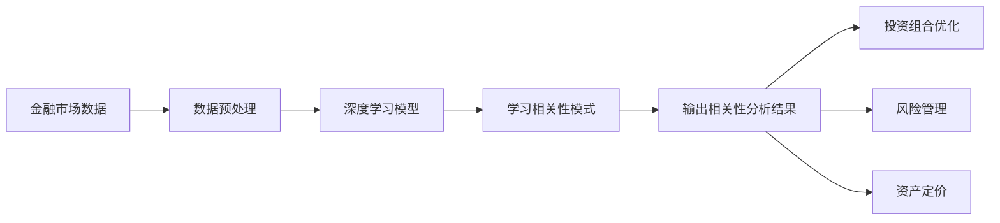

# 深度学习在金融资产相关性分析中的应用

> 关键词：深度学习、金融资产、相关性分析、时间序列、神经网络

> 摘要：本文深入探讨了深度学习在金融资产相关性分析中的应用。首先介绍了研究的背景和目的，阐述了核心概念与联系，包括金融资产相关性和深度学习的基本原理。详细讲解了核心算法原理及具体操作步骤，给出了相应的Python代码示例。从数学模型和公式的角度深入剖析相关性分析的原理，并举例说明。通过项目实战，展示了如何搭建开发环境、实现源代码并进行解读。分析了深度学习在金融资产相关性分析中的实际应用场景，推荐了相关的学习资源、开发工具框架以及论文著作。最后总结了未来的发展趋势与挑战，解答了常见问题并提供扩展阅读和参考资料，旨在为相关领域的研究和实践提供全面且深入的指导。

## 1. 背景介绍 
### 1.1 目的和范围
金融市场中，准确分析金融资产之间的相关性对于投资组合优化、风险管理、资产定价等诸多方面都具有至关重要的意义。传统的相关性分析方法，如线性相关分析，在处理复杂的金融数据时存在一定的局限性。深度学习作为一种强大的数据分析工具，能够自动从大量数据中学习复杂的模式和关系，为金融资产相关性分析提供了新的思路和方法。

本文的范围主要集中在探讨深度学习技术如何应用于金融资产相关性分析，涵盖从核心概念的介绍、算法原理的阐述、数学模型的分析，到实际项目的实现和应用场景的讨论等多个方面。

### 1.2 预期读者
本文预期读者包括金融领域的研究人员、从业者，对深度学习和金融数据分析感兴趣的程序员、数据科学家，以及相关专业的学生。希望通过本文的介绍，能够帮助读者深入理解深度学习在金融资产相关性分析中的应用原理和方法，为他们的研究和实践提供参考。

### 1.3 文档结构概述
本文将按照以下结构进行阐述：首先介绍背景信息，包括目的、预期读者和文档结构概述等；接着讲解核心概念与联系，明确金融资产相关性和深度学习的基本原理及它们之间的联系；然后详细介绍核心算法原理和具体操作步骤，并给出Python代码示例；再从数学模型和公式的角度深入分析相关性分析的原理；通过项目实战展示如何实现深度学习在金融资产相关性分析中的应用；分析实际应用场景；推荐相关的学习资源、开发工具框架和论文著作；最后总结未来发展趋势与挑战，解答常见问题并提供扩展阅读和参考资料。

### 1.4 术语表
#### 1.4.1 核心术语定义
- **金融资产**：指一切代表未来收益或资产合法要求权的凭证，亦称金融工具或证券，包括股票、债券、基金、外汇等。
- **相关性分析**：研究两个或多个变量之间关系的统计方法，用于衡量变量之间的关联程度。
- **深度学习**：一类基于人工神经网络的机器学习技术，通过构建多层神经网络来自动学习数据中的复杂模式和特征。
- **时间序列**：按时间顺序排列的一组观测值，在金融领域中常用于表示金融资产的历史价格、收益率等数据。

#### 1.4.2 相关概念解释
- **投资组合优化**：根据投资者的风险偏好和预期收益目标，选择合适的金融资产组合，以实现风险最小化和收益最大化的过程。
- **风险管理**：识别、评估和应对金融市场中的各种风险，如市场风险、信用风险、流动性风险等，以保护投资者的资产安全。
- **资产定价**：确定金融资产的合理价格，通常基于资产的预期收益、风险等因素进行计算。

#### 1.4.3 缩略词列表
- **ANN**：Artificial Neural Network，人工神经网络
- **RNN**：Recurrent Neural Network，循环神经网络
- **LSTM**：Long Short - Term Memory，长短期记忆网络
- **GRU**：Gated Recurrent Unit，门控循环单元
- **CNN**：Convolutional Neural Network，卷积神经网络

## 2. 核心概念与联系 

### 2.1 金融资产相关性
金融资产之间的相关性反映了它们价格或收益率变动的相似程度。正相关表示两种资产的价格或收益率倾向于同向变动，负相关则表示反向变动。相关性的强弱可以用相关系数来衡量，常见的相关系数包括皮尔逊相关系数、斯皮尔曼相关系数等。

皮尔逊相关系数是最常用的线性相关系数，用于衡量两个变量之间的线性关系。其计算公式为：
$$\rho_{X,Y}=\frac{\text{Cov}(X,Y)}{\sigma_X\sigma_Y}$$
其中，$\text{Cov}(X,Y)$ 是变量 $X$ 和 $Y$ 的协方差，$\sigma_X$ 和 $\sigma_Y$ 分别是变量 $X$ 和 $Y$ 的标准差。

### 2.2 深度学习基本原理
深度学习基于人工神经网络，通过构建多层神经网络模型来学习数据中的复杂模式和特征。神经网络由输入层、隐藏层和输出层组成，每层包含多个神经元。神经元之间通过权重连接，权重表示神经元之间的连接强度。

神经网络的训练过程是通过不断调整权重，使得模型的输出与真实标签之间的误差最小化。常用的训练算法包括梯度下降算法及其变种，如随机梯度下降（SGD）、自适应矩估计（Adam）等。

### 2.3 深度学习与金融资产相关性分析的联系
传统的相关性分析方法通常假设变量之间存在线性关系，而金融市场中的资产价格和收益率往往受到多种复杂因素的影响，呈现出非线性、动态变化的特征。深度学习能够自动学习数据中的非线性模式和关系，通过构建合适的神经网络模型，可以更准确地捕捉金融资产之间的相关性。

例如，循环神经网络（RNN）及其变种（LSTM、GRU）可以处理时间序列数据，考虑到金融资产价格的时间依赖性，从而更好地分析资产之间的动态相关性。卷积神经网络（CNN）可以用于提取金融数据中的局部特征，有助于发现资产之间的潜在相关性。

### 2.4 文本示意图
金融资产相关性分析与深度学习的联系可以用以下文本示意图表示：

金融市场数据（包含多种金融资产的时间序列数据） -> 数据预处理（清洗、归一化等） -> 深度学习模型（RNN、LSTM、CNN等） -> 学习金融资产之间的相关性模式 -> 输出相关性分析结果（相关系数、相关性矩阵等） -> 应用于投资组合优化、风险管理等领域

### 2.5 Mermaid流程图


## 3. 核心算法原理 & 具体操作步骤 

### 3.1 基于LSTM的金融资产相关性分析算法原理
长短期记忆网络（LSTM）是一种特殊的循环神经网络，能够有效地处理时间序列数据中的长距离依赖问题。在金融资产相关性分析中，LSTM可以学习金融资产价格或收益率的时间序列模式，从而推断资产之间的相关性。

LSTM单元的核心结构包含输入门、遗忘门和输出门，通过这些门控机制来控制信息的流动和记忆。输入门决定了当前输入信息的哪些部分将被添加到细胞状态中，遗忘门决定了细胞状态中哪些信息将被遗忘，输出门决定了细胞状态的哪些部分将作为输出。

### 3.2 具体操作步骤
#### 3.2.1 数据收集与预处理
收集多种金融资产的历史价格或收益率数据，这些数据可以从金融数据提供商（如雅虎财经、Wind等）获取。对数据进行清洗，处理缺失值和异常值。然后进行归一化处理，将数据缩放到相同的范围，以提高模型的训练效果。

#### 3.2.2 数据集划分
将预处理后的数据划分为训练集、验证集和测试集。训练集用于模型的训练，验证集用于调整模型的超参数，测试集用于评估模型的性能。

#### 3.2.3 模型构建
使用Python的深度学习框架（如TensorFlow、PyTorch等）构建LSTM模型。模型的输入是金融资产的时间序列数据，输出是资产之间的相关性预测结果。

#### 3.2.4 模型训练
使用训练集对模型进行训练，通过不断调整模型的权重，使得模型的预测结果与真实的相关性标签之间的误差最小化。在训练过程中，使用验证集来监控模型的性能，防止过拟合。

#### 3.2.5 模型评估
使用测试集对训练好的模型进行评估，计算模型的预测误差和其他性能指标，如均方误差（MSE）、平均绝对误差（MAE）等。

#### 3.2.6 结果分析
分析模型的预测结果，得到金融资产之间的相关性矩阵或相关系数。根据相关性分析结果，可以进行投资组合优化、风险管理等决策。

### 3.3 Python代码示例
以下是一个使用TensorFlow构建LSTM模型进行金融资产相关性分析的示例代码：

```python
import numpy as np
import pandas as pd
from sklearn.preprocessing import MinMaxScaler
from tensorflow.keras.models import Sequential
from tensorflow.keras.layers import LSTM, Dense

# 数据收集与预处理
# 假设已经从金融数据提供商获取了两种金融资产的收益率数据
data = pd.read_csv('financial_assets_data.csv')
scaler = MinMaxScaler()
scaled_data = scaler.fit_transform(data)

# 数据集划分
train_size = int(len(scaled_data) * 0.7)
val_size = int(len(scaled_data) * 0.15)
test_size = len(scaled_data) - train_size - val_size

train_data = scaled_data[:train_size]
val_data = scaled_data[train_size:train_size + val_size]
test_data = scaled_data[train_size + val_size:]

# 准备训练数据
def create_sequences(data, seq_length):
    X = []
    y = []
    for i in range(len(data) - seq_length):
        X.append(data[i:i + seq_length])
        y.append(data[i + seq_length])
    return np.array(X), np.array(y)

seq_length = 10
X_train, y_train = create_sequences(train_data, seq_length)
X_val, y_val = create_sequences(val_data, seq_length)
X_test, y_test = create_sequences(test_data, seq_length)

# 模型构建
model = Sequential()
model.add(LSTM(50, return_sequences=True, input_shape=(seq_length, X_train.shape[2])))
model.add(LSTM(50, return_sequences=False))
model.add(Dense(2))  # 假设预测两种金融资产的相关性
model.compile(optimizer='adam', loss='mse')

# 模型训练
model.fit(X_train, y_train, batch_size=32, epochs=50, validation_data=(X_val, y_val))

# 模型评估
test_loss = model.evaluate(X_test, y_test)
print(f"Test Loss: {test_loss}")

# 结果分析
predictions = model.predict(X_test)
# 可以进一步计算相关性矩阵或相关系数
```

## 4. 数学模型和公式 & 详细讲解 & 举例说明 

### 4.1 皮尔逊相关系数数学模型
皮尔逊相关系数是衡量两个变量之间线性关系强度的统计量，其数学模型如下：

设 $X = \{x_1, x_2, \cdots, x_n\}$ 和 $Y = \{y_1, y_2, \cdots, y_n\}$ 是两个变量的样本数据，皮尔逊相关系数 $\rho_{X,Y}$ 的计算公式为：

$$\rho_{X,Y}=\frac{\sum_{i = 1}^{n}(x_i-\bar{x})(y_i-\bar{y})}{\sqrt{\sum_{i = 1}^{n}(x_i-\bar{x})^2\sum_{i = 1}^{n}(y_i-\bar{y})^2}}$$

其中，$\bar{x}=\frac{1}{n}\sum_{i = 1}^{n}x_i$ 和 $\bar{y}=\frac{1}{n}\sum_{i = 1}^{n}y_i$ 分别是变量 $X$ 和 $Y$ 的样本均值。

### 4.2 详细讲解
- 分子 $\sum_{i = 1}^{n}(x_i-\bar{x})(y_i-\bar{y})$ 表示变量 $X$ 和 $Y$ 的协方差，反映了 $X$ 和 $Y$ 之间的线性变化趋势。当 $x_i$ 大于 $\bar{x}$ 且 $y_i$ 大于 $\bar{y}$ ，或者 $x_i$ 小于 $\bar{x}$ 且 $y_i$ 小于 $\bar{y}$ 时，$(x_i - \bar{x})(y_i - \bar{y})$ 为正，说明 $X$ 和 $Y$ 同向变化；当 $x_i$ 大于 $\bar{x}$ 而 $y_i$ 小于 $\bar{y}$ ，或者 $x_i$ 小于 $\bar{x}$ 而 $y_i$ 大于 $\bar{y}$ 时，$(x_i - \bar{x})(y_i - \bar{y})$ 为负，说明 $X$ 和 $Y$ 反向变化。
- 分母 $\sqrt{\sum_{i = 1}^{n}(x_i-\bar{x})^2\sum_{i = 1}^{n}(y_i-\bar{y})^2}$ 是为了将协方差标准化，使得相关系数的取值范围在 $[-1, 1]$ 之间。当 $\rho_{X,Y} = 1$ 时，表示 $X$ 和 $Y$ 完全正相关；当 $\rho_{X,Y} = -1$ 时，表示 $X$ 和 $Y$ 完全负相关；当 $\rho_{X,Y} = 0$ 时，表示 $X$ 和 $Y$ 之间不存在线性关系。

### 4.3 举例说明
假设有两种股票 $A$ 和 $B$ 的收益率数据如下：

| 时间 | 股票 $A$ 收益率 $x$ | 股票 $B$ 收益率 $y$ |
|---|---|---|
| 1 | 0.02 | 0.03 |
| 2 | 0.01 | 0.02 |
| 3 | -0.01 | -0.02 |
| 4 | 0.03 | 0.04 |
| 5 | 0.02 | 0.03 |

首先计算样本均值：
$$\bar{x}=\frac{0.02 + 0.01 - 0.01 + 0.03 + 0.02}{5}=0.014$$
$$\bar{y}=\frac{0.03 + 0.02 - 0.02 + 0.04 + 0.03}{5}=0.02$$

然后计算分子：
$$\sum_{i = 1}^{5}(x_i-\bar{x})(y_i-\bar{y})=(0.02 - 0.014)(0.03 - 0.02)+(0.01 - 0.014)(0.02 - 0.02)+(-0.01 - 0.014)(-0.02 - 0.02)+(0.03 - 0.014)(0.04 - 0.02)+(0.02 - 0.014)(0.03 - 0.02)$$
$$=0.00006+0+0.00096+0.00032+0.00006 = 0.0014$$

接着计算分母：
$$\sum_{i = 1}^{5}(x_i-\bar{x})^2=(0.02 - 0.014)^2+(0.01 - 0.014)^2+(-0.01 - 0.014)^2+(0.03 - 0.014)^2+(0.02 - 0.014)^2$$
$$=0.000036+0.000016+0.000576+0.000256+0.000036 = 0.00092$$

$$\sum_{i = 1}^{5}(y_i-\bar{y})^2=(0.03 - 0.02)^2+(0.02 - 0.02)^2+(-0.02 - 0.02)^2+(0.04 - 0.02)^2+(0.03 - 0.02)^2$$
$$=0.0001+0+0.0016+0.0004+0.0001 = 0.0022$$

$$\sqrt{\sum_{i = 1}^{5}(x_i-\bar{x})^2\sum_{i = 1}^{5}(y_i-\bar{y})^2}=\sqrt{0.00092\times0.0022}\approx0.00142$$

最后计算皮尔逊相关系数：
$$\rho_{X,Y}=\frac{0.0014}{0.00142}\approx0.986$$

这表明股票 $A$ 和 $B$ 的收益率之间存在很强的正相关关系。

### 4.4 深度学习中的损失函数和优化算法
在深度学习中，常用的损失函数是均方误差（MSE），用于衡量模型预测结果与真实标签之间的误差。其数学公式为：

$$MSE=\frac{1}{n}\sum_{i = 1}^{n}(y_i-\hat{y}_i)^2$$

其中，$y_i$ 是真实标签，$\hat{y}_i$ 是模型的预测结果，$n$ 是样本数量。

优化算法的目标是通过不断调整模型的权重，使得损失函数的值最小化。常见的优化算法如随机梯度下降（SGD）的更新公式为：

$$\theta_{t+1}=\theta_t-\alpha\frac{\partial L(\theta_t)}{\partial \theta_t}$$

其中，$\theta_t$ 是第 $t$ 次迭代时的模型权重，$\alpha$ 是学习率，$\frac{\partial L(\theta_t)}{\partial \theta_t}$ 是损失函数 $L(\theta_t)$ 关于权重 $\theta_t$ 的梯度。

## 5. 项目实战：代码实际案例和详细解释说明 

### 5.1  开发环境搭建
#### 5.1.1 安装Python
首先需要安装Python环境，建议使用Python 3.7及以上版本。可以从Python官方网站（https://www.python.org/downloads/） 下载并安装。

#### 5.1.2 安装深度学习框架
本文使用TensorFlow作为深度学习框架，可以使用以下命令进行安装：
```sh
pip install tensorflow
```

#### 5.1.3 安装其他依赖库
还需要安装一些其他的依赖库，如NumPy、Pandas、Scikit - learn等，可以使用以下命令进行安装：
```sh
pip install numpy pandas scikit-learn
```

### 5.2  源代码详细实现和代码解读
以下是一个完整的基于LSTM的金融资产相关性分析项目的源代码：

```python
import numpy as np
import pandas as pd
from sklearn.preprocessing import MinMaxScaler
from tensorflow.keras.models import Sequential
from tensorflow.keras.layers import LSTM, Dense
import matplotlib.pyplot as plt

# 数据收集与预处理
# 假设已经从金融数据提供商获取了两种金融资产的收益率数据
data = pd.read_csv('financial_assets_data.csv')
scaler = MinMaxScaler()
scaled_data = scaler.fit_transform(data)

# 数据集划分
train_size = int(len(scaled_data) * 0.7)
val_size = int(len(scaled_data) * 0.15)
test_size = len(scaled_data) - train_size - val_size

train_data = scaled_data[:train_size]
val_data = scaled_data[train_size:train_size + val_size]
test_data = scaled_data[train_size + val_size:]

# 准备训练数据
def create_sequences(data, seq_length):
    X = []
    y = []
    for i in range(len(data) - seq_length):
        X.append(data[i:i + seq_length])
        y.append(data[i + seq_length])
    return np.array(X), np.array(y)

seq_length = 10
X_train, y_train = create_sequences(train_data, seq_length)
X_val, y_val = create_sequences(val_data, seq_length)
X_test, y_test = create_sequences(test_data, seq_length)

# 模型构建
model = Sequential()
model.add(LSTM(50, return_sequences=True, input_shape=(seq_length, X_train.shape[2])))
model.add(LSTM(50, return_sequences=False))
model.add(Dense(2))  # 假设预测两种金融资产的相关性
model.compile(optimizer='adam', loss='mse')

# 模型训练
history = model.fit(X_train, y_train, batch_size=32, epochs=50, validation_data=(X_val, y_val))

# 模型评估
test_loss = model.evaluate(X_test, y_test)
print(f"Test Loss: {test_loss}")

# 结果分析
predictions = model.predict(X_test)
# 反归一化
predictions = scaler.inverse_transform(predictions)
y_test = scaler.inverse_transform(y_test)

# 绘制预测结果和真实值的对比图
plt.plot(y_test[:, 0], label='True Value Asset 1')
plt.plot(predictions[:, 0], label='Predicted Value Asset 1')
plt.plot(y_test[:, 1], label='True Value Asset 2')
plt.plot(predictions[:, 1], label='Predicted Value Asset 2')
plt.legend()
plt.show()
```

### 5.3  代码解读与分析
#### 5.3.1 数据收集与预处理
- `data = pd.read_csv('financial_assets_data.csv')`：从CSV文件中读取金融资产的收益率数据。
- `scaler = MinMaxScaler()` 和 `scaled_data = scaler.fit_transform(data)`：使用MinMaxScaler对数据进行归一化处理，将数据缩放到 $[0, 1]$ 范围内。

#### 5.3.2 数据集划分
- `train_size = int(len(scaled_data) * 0.7)`、`val_size = int(len(scaled_data) * 0.15)` 和 `test_size = len(scaled_data) - train_size - val_size`：将数据集按照70%、15%、15%的比例划分为训练集、验证集和测试集。

#### 5.3.3 准备训练数据
- `create_sequences` 函数：将时间序列数据转换为适合LSTM模型输入的序列数据。每个输入序列的长度为 `seq_length`，对应的输出是下一个时间步的值。

#### 5.3.4 模型构建
- `model = Sequential()`：创建一个Sequential模型。
- `model.add(LSTM(50, return_sequences=True, input_shape=(seq_length, X_train.shape[2])))`：添加一个LSTM层，包含50个神经元，`return_sequences=True` 表示返回整个序列的输出。
- `model.add(LSTM(50, return_sequences=False))`：再添加一个LSTM层，不返回整个序列的输出。
- `model.add(Dense(2))`：添加一个全连接层，输出维度为2，表示预测两种金融资产的相关性。
- `model.compile(optimizer='adam', loss='mse')`：使用Adam优化器和均方误差（MSE）损失函数编译模型。

#### 5.3.5 模型训练
- `history = model.fit(X_train, y_train, batch_size=32, epochs=50, validation_data=(X_val, y_val))`：使用训练集对模型进行训练，训练50个epoch，每个batch包含32个样本，同时使用验证集监控模型的性能。

#### 5.3.6 模型评估
- `test_loss = model.evaluate(X_test, y_test)`：使用测试集评估模型的性能，计算测试集上的损失值。

#### 5.3.7 结果分析
- `predictions = model.predict(X_test)`：使用训练好的模型对测试集进行预测。
- `predictions = scaler.inverse_transform(predictions)` 和 `y_test = scaler.inverse_transform(y_test)`：对预测结果和真实值进行反归一化处理，恢复原始数据的尺度。
- 绘制预测结果和真实值的对比图，直观地观察模型的预测效果。

## 6. 实际应用场景 
### 6.1 投资组合优化
通过深度学习分析金融资产之间的相关性，可以帮助投资者构建更有效的投资组合。在投资组合中，选择相关性较低的资产可以降低组合的风险。例如，如果股票 $A$ 和股票 $B$ 的相关性较低，同时持有这两种股票可以在一定程度上分散风险。深度学习模型可以更准确地捕捉资产之间的动态相关性，从而为投资组合优化提供更可靠的依据。

### 6.2 风险管理
金融机构需要对各种风险进行有效的管理，包括市场风险、信用风险等。金融资产相关性分析可以帮助识别不同资产之间的风险传导机制。例如，当某些资产的价格下跌时，通过分析相关性可以预测其他相关资产的价格变化，从而提前采取措施进行风险控制。深度学习模型可以处理复杂的金融数据，更好地预测风险的传播和演变。

### 6.3 资产定价
资产定价是金融领域的核心问题之一。金融资产的价格往往受到多种因素的影响，包括市场利率、宏观经济环境、资产之间的相关性等。深度学习可以通过分析资产之间的相关性，挖掘潜在的定价因素，提高资产定价的准确性。例如，在期权定价中，考虑标的资产与其他相关资产的相关性可以更准确地估计期权的价值。

### 6.4 高频交易
在高频交易中，需要快速准确地分析市场信息和资产之间的关系。深度学习可以实时处理大量的金融数据，捕捉资产价格的微小变化和相关性的动态调整。通过分析资产之间的相关性，高频交易策略可以更及时地做出买卖决策，提高交易的效率和收益。

## 7. 工具和资源推荐
### 7.1 学习资源推荐
#### 7.1.1 书籍推荐
- 《深度学习》（Deep Learning），作者：Ian Goodfellow、Yoshua Bengio和Aaron Courville。这本书是深度学习领域的经典著作，系统地介绍了深度学习的基本原理、算法和应用。
- 《Python深度学习》（Deep Learning with Python），作者：Francois Chollet。本书以Python和Keras为工具，详细介绍了深度学习的实践方法，适合初学者入门。
- 《金融时间序列分析》（Analysis of Financial Time Series），作者：Ruey S. Tsay。这本书专门介绍了金融时间序列的分析方法和模型，对于理解金融资产的时间序列特性非常有帮助。

#### 7.1.2 在线课程
- Coursera上的“深度学习专项课程”（Deep Learning Specialization），由Andrew Ng教授主讲，包括神经网络和深度学习、改善深层神经网络、结构化机器学习项目、卷积神经网络、序列模型等多个课程，全面系统地介绍了深度学习的知识和技能。
- edX上的“金融工程原理”（Principles of Financial Engineering），该课程介绍了金融工程的基本原理和方法，包括资产定价、风险管理等内容，对于理解金融领域的应用场景有很大帮助。

#### 7.1.3 技术博客和网站
- Medium上有很多关于深度学习和金融数据分析的技术博客，如Towards Data Science、The Startup等，这些博客上有很多优秀的文章和案例分享。
- arXiv（https://arxiv.org/） 是一个预印本数据库，上面有很多关于深度学习和金融领域的最新研究成果，可以及时了解该领域的前沿动态。

### 7.2 开发工具框架推荐
#### 7.2.1 IDE和编辑器
- PyCharm：是一款专业的Python集成开发环境（IDE），提供了丰富的功能，如代码编辑、调试、版本控制等，非常适合Python开发。
- Jupyter Notebook：是一个交互式的开发环境，可以将代码、文本、图表等整合在一起，方便进行数据分析和模型开发。

#### 7.2.2 调试和性能分析工具
- TensorBoard：是TensorFlow提供的可视化工具，可以帮助用户监控模型的训练过程，如损失函数的变化、模型的准确率等，还可以可视化模型的结构。
- PyTorch Profiler：是PyTorch提供的性能分析工具，可以帮助用户分析模型的性能瓶颈，如计算时间、内存使用等，从而进行优化。

#### 7.2.3 相关框架和库
- TensorFlow：是一个开源的深度学习框架，由Google开发，提供了丰富的深度学习模型和工具，支持多种硬件平台。
- PyTorch：是另一个开源的深度学习框架，由Facebook开发，具有动态图的特点，易于使用和调试。
- Scikit - learn：是一个Python的机器学习库，提供了丰富的机器学习算法和工具，如数据预处理、模型选择、评估等，对于金融数据的处理和分析非常有用。

### 7.3 相关论文著作推荐
#### 7.3.1 经典论文
- “Long Short - Term Memory”，作者：Sepp Hochreiter和Jürgen Schmidhuber。这篇论文提出了长短期记忆网络（LSTM），是深度学习领域的经典之作，对于处理时间序列数据具有重要意义。
- “Efficient Markets Hypothesis”，作者：Eugene F. Fama。这篇论文提出了有效市场假说，是金融领域的经典理论，对于理解金融市场的运行机制和资产定价有重要影响。

#### 7.3.2 最新研究成果
- 关注顶级学术会议和期刊，如NeurIPS（神经信息处理系统大会）、ICML（国际机器学习会议）、Journal of Financial Economics（金融经济学杂志）等，这些会议和期刊上有很多关于深度学习在金融领域应用的最新研究成果。

#### 7.3.3 应用案例分析
- 一些金融机构和研究机构会发布关于深度学习在金融资产相关性分析、投资组合优化等方面的应用案例，可以通过它们的官方网站或相关报告进行查阅。

## 8. 总结：未来发展趋势与挑战
### 8.1 未来发展趋势
#### 8.1.1 融合多源数据
未来，深度学习在金融资产相关性分析中将不仅仅依赖于传统的金融数据，还会融合更多的多源数据，如新闻文本、社交媒体数据、宏观经济数据等。通过分析这些多源数据，可以更全面地了解金融市场的动态，提高相关性分析的准确性。

#### 8.1.2 强化学习与深度学习的结合
强化学习可以用于优化投资策略和风险管理决策。将强化学习与深度学习相结合，可以使模型在动态的金融市场环境中自适应地调整投资组合，实现更智能的投资决策。

#### 8.1.3 可解释性深度学习模型
目前，深度学习模型往往被视为“黑箱”，难以解释其决策过程。未来，研究人员将致力于开发可解释性的深度学习模型，使得金融从业者能够理解模型的决策依据，提高模型的可信度和实用性。

### 8.2 挑战
#### 8.2.1 数据质量和隐私问题
金融数据的质量和隐私是深度学习应用的重要挑战。金融数据可能存在缺失值、异常值等问题，需要进行有效的预处理。同时，金融数据涉及到用户的隐私和商业机密，如何在保护数据隐私的前提下进行有效的数据分析是一个亟待解决的问题。

#### 8.2.2 模型复杂性和计算资源需求
深度学习模型通常具有较高的复杂性，需要大量的计算资源和时间进行训练。在实际应用中，如何优化模型结构，减少计算资源的需求，提高模型的训练效率是一个挑战。

#### 8.2.3 市场不确定性和模型泛化能力
金融市场具有高度的不确定性，市场环境和资产价格随时可能发生变化。深度学习模型需要具备良好的泛化能力，能够在不同的市场环境下保持稳定的性能。如何提高模型的泛化能力，应对市场的不确定性是一个重要的挑战。

## 9. 附录：常见问题与解答
### 9.1 深度学习模型在金融资产相关性分析中的准确率如何保证？
要保证深度学习模型在金融资产相关性分析中的准确率，需要从多个方面入手。首先，要确保数据的质量，对数据进行充分的清洗和预处理，处理缺失值和异常值。其次，选择合适的模型结构和超参数，可以通过交叉验证等方法进行调优。此外，要进行充分的模型评估，使用多种评估指标来衡量模型的性能，如均方误差、平均绝对误差、相关系数等。最后，要不断更新和优化模型，以适应金融市场的变化。

### 9.2 如何处理金融数据中的噪声？
处理金融数据中的噪声可以采用多种方法。一种方法是使用滤波技术，如移动平均滤波、卡尔曼滤波等，去除数据中的高频噪声。另一种方法是使用深度学习模型本身的特性，如正则化技术（L1、L2正则化）、Dropout等，来减少噪声对模型的影响。此外，还可以通过增加数据量、进行数据增强等方法来提高模型对噪声的鲁棒性。

### 9.3 深度学习模型在金融领域的应用是否存在法律和监管风险？
深度学习模型在金融领域的应用存在一定的法律和监管风险。例如，模型的决策过程可能缺乏透明度，难以满足监管机构的要求。此外，模型的预测结果可能存在误差，导致投资者的损失，从而引发法律纠纷。因此，在应用深度学习模型时，需要遵守相关的法律法规和监管要求，确保模型的开发和使用是合法合规的。

### 9.4 如何选择适合金融资产相关性分析的深度学习模型？
选择适合金融资产相关性分析的深度学习模型需要考虑多个因素。如果数据具有时间序列特性，可以选择循环神经网络（RNN）及其变种（LSTM、GRU），因为它们能够处理时间序列数据中的长距离依赖问题。如果数据具有局部特征，可以选择卷积神经网络（CNN），用于提取局部特征。此外，还可以考虑使用深度学习与传统机器学习方法相结合的混合模型，以充分发挥各自的优势。

## 10. 扩展阅读 & 参考资料
### 10.1 扩展阅读
- 《智能金融：AI时代金融行业的转型与创新》，本书介绍了人工智能在金融领域的应用现状和未来发展趋势，包括智能投顾、风险管理、客户服务等方面的内容。
- 《金融科技：重构未来金融生态》，该书探讨了金融科技的发展对金融行业的影响，以及如何利用金融科技实现金融创新和转型升级。

### 10.2 参考资料
- 雅虎财经（https://finance.yahoo.com/） ：提供丰富的金融数据和市场信息。
- Wind金融终端：是国内专业的金融数据服务平台，提供全面的金融数据和分析工具。
- TensorFlow官方文档（https://www.tensorflow.org/） ：提供TensorFlow框架的详细文档和教程。
- PyTorch官方文档（https://pytorch.org/） ：提供PyTorch框架的详细文档和教程。