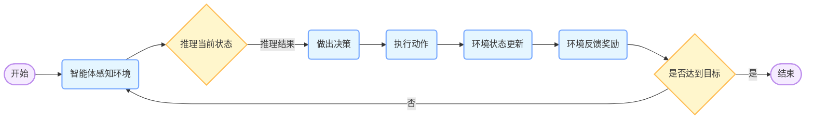

# 深度强化学习在多智能体推理协作中的应用

> 关键词：深度强化学习、多智能体、推理协作、智能体交互、马尔可夫决策过程

> 摘要：本文聚焦于深度强化学习在多智能体推理协作中的应用。首先介绍了该领域的研究背景，包括目的、预期读者、文档结构和相关术语。接着阐述了深度强化学习与多智能体推理协作的核心概念及联系，通过示意图和流程图展示其架构。详细讲解了核心算法原理和具体操作步骤，并给出Python代码示例。同时，介绍了相关数学模型和公式，结合实例进行说明。在项目实战部分，从开发环境搭建到源代码实现及解读进行了全面分析。探讨了深度强化学习在多智能体推理协作中的实际应用场景，推荐了相关的学习资源、开发工具框架和论文著作。最后总结了未来发展趋势与挑战，并提供常见问题解答和扩展阅读参考资料。

## 1. 背景介绍 
### 1.1 目的和范围
深度强化学习在多智能体推理协作领域的研究目的在于使多个智能体能够在复杂环境中协同工作，实现高效的任务执行。传统的单智能体强化学习在处理复杂任务时存在局限性，而多智能体系统可以通过智能体之间的协作来应对更复杂的场景，如自动驾驶中的车辆协同、机器人团队的任务执行等。本文的范围涵盖了深度强化学习在多智能体推理协作中的核心概念、算法原理、数学模型、项目实战、应用场景以及相关资源推荐等方面。

### 1.2 预期读者
本文预期读者包括人工智能、机器学习、控制科学与工程等相关专业的研究人员、学生，以及对深度强化学习和多智能体系统感兴趣的工程师和技术爱好者。读者需要具备一定的机器学习和编程基础，对强化学习的基本概念有一定的了解。

### 1.3 文档结构概述
本文将按照以下结构进行组织：首先介绍深度强化学习和多智能体推理协作的核心概念与联系，包括原理和架构的示意图和流程图；接着详细讲解核心算法原理和具体操作步骤，并给出Python代码实现；然后介绍相关的数学模型和公式，结合实际例子进行说明；在项目实战部分，从开发环境搭建到源代码实现及解读进行全面分析；探讨深度强化学习在多智能体推理协作中的实际应用场景；推荐相关的学习资源、开发工具框架和论文著作；最后总结未来发展趋势与挑战，提供常见问题解答和扩展阅读参考资料。

### 1.4 术语表
#### 1.4.1 核心术语定义
- **深度强化学习（Deep Reinforcement Learning）**：结合了深度学习和强化学习的方法，通过深度神经网络来近似值函数或策略函数，以解决复杂的强化学习问题。
- **多智能体系统（Multi - Agent System）**：由多个智能体组成的系统，每个智能体可以自主地感知环境、做出决策并采取行动，智能体之间可以进行交互和协作。
- **智能体（Agent）**：能够感知环境并根据自身的目标和策略做出决策和行动的实体。
- **推理协作（Reasoning and Collaboration）**：智能体在执行任务过程中，通过对环境信息的推理和与其他智能体的协作，实现共同的目标。
- **马尔可夫决策过程（Markov Decision Process, MDP）**：一种用于描述强化学习问题的数学模型，包括状态、动作、奖励和状态转移概率等要素。

#### 1.4.2 相关概念解释
- **值函数（Value Function）**：表示在某个状态下，遵循某个策略所能获得的期望累积奖励。在深度强化学习中，通常使用深度神经网络来近似值函数。
- **策略函数（Policy Function）**：决定智能体在某个状态下应该采取的动作。策略可以是确定性的或随机性的。
- **经验回放（Experience Replay）**：深度强化学习中的一种技术，将智能体的经验（状态、动作、奖励、下一个状态）存储在经验池中，训练时随机从经验池中采样进行学习，以提高学习效率和稳定性。
- **探索与利用（Exploration and Exploitation）**：智能体在学习过程中需要在探索新的动作和利用已有的经验之间进行平衡，以找到最优策略。

#### 1.4.3 缩略词列表
- **DRL**：Deep Reinforcement Learning（深度强化学习）
- **MAS**：Multi - Agent System（多智能体系统）
- **MDP**：Markov Decision Process（马尔可夫决策过程）
- **Q - learning**：一种基于值函数的强化学习算法
- **A2C**：Advantage Actor - Critic（优势演员 - 评论家算法）
- **PPO**：Proximal Policy Optimization（近端策略优化算法）

## 2. 核心概念与联系 

### 核心概念原理
深度强化学习是一种通过智能体与环境进行交互，不断尝试不同的动作，并根据环境反馈的奖励来学习最优策略的方法。在多智能体系统中，每个智能体都可以看作是一个独立的学习者，同时又需要与其他智能体进行协作。多智能体推理协作的核心在于智能体能够根据自身的感知和其他智能体的信息，推理出当前的环境状态，并做出合适的决策以实现共同的目标。

以自动驾驶场景为例，每辆车可以看作一个智能体，它们需要感知周围的交通状况、其他车辆的位置和速度等信息，通过推理判断可能的危险情况，并与其他车辆进行协作，如调整车速、保持安全距离等，以确保整个交通系统的安全和高效运行。

### 架构的文本示意图
```plaintext
多智能体系统
|
|-- 智能体1
|   |-- 感知模块（获取环境信息）
|   |-- 推理模块（根据感知信息和其他智能体信息进行推理）
|   |-- 决策模块（根据推理结果做出决策）
|   |-- 动作执行模块（执行决策动作）
|
|-- 智能体2
|   |-- 感知模块
|   |-- 推理模块
|   |-- 决策模块
|   |-- 动作执行模块
|
|-- ...
|
|-- 环境
    |-- 状态更新（根据智能体的动作更新环境状态）
    |-- 奖励反馈（给智能体提供奖励）
```

### Mermaid 流程图


## 3. 核心算法原理 & 具体操作步骤 

### 算法原理讲解
在多智能体深度强化学习中，有多种算法可以用于智能体的学习和协作。这里以Q - learning算法为例进行详细讲解。

Q - learning是一种基于值函数的强化学习算法，其核心思想是通过学习一个Q值函数 $Q(s, a)$ 来表示在状态 $s$ 下采取动作 $a$ 所能获得的最大期望累积奖励。智能体在每个时间步根据当前状态 $s$ 选择一个动作 $a$，执行动作后环境会反馈一个奖励 $r$ 并转移到下一个状态 $s'$。Q值函数的更新公式为：

$$Q(s, a) \leftarrow Q(s, a) + \alpha\left[r + \gamma\max_{a'}Q(s', a') - Q(s, a)\right]$$

其中，$\alpha$ 是学习率，控制每次更新的步长；$\gamma$ 是折扣因子，用于权衡当前奖励和未来奖励的重要性。

### Python源代码实现
```python
import numpy as np

# 定义环境参数
num_states = 10
num_actions = 4
gamma = 0.9  # 折扣因子
alpha = 0.1  # 学习率

# 初始化Q表
Q = np.zeros((num_states, num_actions))

# 定义智能体的动作选择策略（epsilon - greedy）
def epsilon_greedy(Q, state, epsilon):
    if np.random.uniform(0, 1) < epsilon:
        action = np.random.choice(num_actions)
    else:
        action = np.argmax(Q[state, :])
    return action

# 模拟环境的状态转移和奖励反馈
def environment_step(state, action):
    # 这里简单模拟状态转移和奖励反馈
    next_state = (state + action) % num_states
    if next_state == 0:
        reward = 1
    else:
        reward = 0
    return next_state, reward

# 训练过程
num_episodes = 1000
epsilon = 0.1

for episode in range(num_episodes):
    state = np.random.randint(0, num_states)
    done = False
    while not done:
        action = epsilon_greedy(Q, state, epsilon)
        next_state, reward = environment_step(state, action)
        # Q值更新
        Q[state, action] = Q[state, action] + alpha * (reward + gamma * np.max(Q[next_state, :]) - Q[state, action])
        state = next_state
        if state == 0:
            done = True

# 输出最终的Q表
print("Final Q - table:")
print(Q)
```

### 具体操作步骤
1. **初始化**：初始化Q表 $Q(s, a)$ 为全零矩阵，设置学习率 $\alpha$、折扣因子 $\gamma$ 和探索率 $\epsilon$。
2. **智能体选择动作**：在每个时间步，智能体根据当前状态 $s$ 和 $\epsilon$ - greedy策略选择一个动作 $a$。
3. **执行动作并获取反馈**：智能体执行动作 $a$，环境根据动作更新状态并反馈奖励 $r$，得到下一个状态 $s'$。
4. **Q值更新**：根据Q值更新公式更新Q表。
5. **状态转移**：将当前状态更新为下一个状态 $s = s'$。
6. **终止条件判断**：判断是否达到终止条件（如达到目标状态），如果是则结束当前回合；否则继续下一个时间步。
7. **重复训练**：重复上述步骤进行多个回合的训练，直到Q表收敛。

## 4. 数学模型和公式 & 详细讲解 & 举例说明 

### 马尔可夫决策过程（MDP）
马尔可夫决策过程是描述强化学习问题的基本数学模型，它可以用一个五元组 $\langle S, A, P, R, \gamma\rangle$ 来表示，其中：
- $S$ 是状态空间，表示环境可能处于的所有状态的集合。
- $A$ 是动作空间，表示智能体可以采取的所有动作的集合。
- $P$ 是状态转移概率函数，$P(s'|s, a)$ 表示在状态 $s$ 下采取动作 $a$ 后转移到状态 $s'$ 的概率。
- $R$ 是奖励函数，$R(s, a, s')$ 表示在状态 $s$ 下采取动作 $a$ 并转移到状态 $s'$ 时获得的奖励。
- $\gamma$ 是折扣因子，用于权衡当前奖励和未来奖励的重要性，$0\leqslant\gamma\leqslant1$。

### 值函数和策略函数
#### 值函数
值函数分为状态值函数 $V(s)$ 和动作值函数 $Q(s, a)$。状态值函数 $V(s)$ 表示在状态 $s$ 下，遵循某个策略 $\pi$ 所能获得的期望累积奖励：

$$V^{\pi}(s) = \mathbb{E}\left[\sum_{t = 0}^{\infty}\gamma^{t}R_{t + 1}|S_{0}=s, \pi\right]$$

动作值函数 $Q(s, a)$ 表示在状态 $s$ 下采取动作 $a$，并遵循某个策略 $\pi$ 所能获得的期望累积奖励：

$$Q^{\pi}(s, a) = \mathbb{E}\left[\sum_{t = 0}^{\infty}\gamma^{t}R_{t + 1}|S_{0}=s, A_{0}=a, \pi\right]$$

#### 策略函数
策略函数 $\pi(a|s)$ 表示在状态 $s$ 下选择动作 $a$ 的概率。确定性策略可以表示为 $\pi(s) = a$，即对于每个状态 $s$，只有一个确定的动作 $a$。

### 贝尔曼方程
贝尔曼方程是强化学习中的核心方程，它描述了值函数的递归关系。对于状态值函数 $V(s)$，贝尔曼方程可以表示为：

$$V^{\pi}(s) = \sum_{a\in A}\pi(a|s)\sum_{s'\in S}P(s'|s, a)\left[R(s, a, s')+\gamma V^{\pi}(s')\right]$$

对于动作值函数 $Q(s, a)$，贝尔曼方程可以表示为：

$$Q^{\pi}(s, a) = \sum_{s'\in S}P(s'|s, a)\left[R(s, a, s')+\gamma\sum_{a'\in A}\pi(a'|s')Q^{\pi}(s', a')\right]$$

### 举例说明
考虑一个简单的网格世界环境，智能体需要从起点移动到终点。环境的状态空间 $S$ 是网格中的所有位置，动作空间 $A$ 包括上下左右四个方向的移动。状态转移概率 $P$ 是确定性的，即智能体执行某个动作后，会确定性地转移到相应的位置。奖励函数 $R$ 可以设置为：到达终点获得正奖励，撞到障碍物或边界获得负奖励，其他情况奖励为零。

假设智能体采用随机策略 $\pi$，即每个动作的选择概率都是 $0.25$。我们可以根据贝尔曼方程计算状态值函数 $V(s)$ 和动作值函数 $Q(s, a)$。例如，对于某个状态 $s$，如果智能体采取向上移动的动作 $a$，转移到状态 $s'$ 并获得奖励 $r$，则可以根据贝尔曼方程更新 $Q(s, a)$ 的值。

## 5. 项目实战：代码实际案例和详细解释说明 

### 5.1  开发环境搭建
#### 安装Python
首先需要安装Python环境，建议使用Python 3.6及以上版本。可以从Python官方网站（https://www.python.org/downloads/）下载并安装。

#### 安装必要的库
在多智能体深度强化学习项目中，常用的库包括NumPy、TensorFlow或PyTorch等。可以使用以下命令进行安装：
```bash
pip install numpy tensorflow
```
或者
```bash
pip install numpy torch
```

### 5.2  源代码详细实现和代码解读
以下是一个基于PyTorch实现的多智能体深度强化学习示例，使用的是A2C（Advantage Actor - Critic）算法。

```python
import torch
import torch.nn as nn
import torch.optim as optim
import numpy as np

# 定义智能体网络
class AgentNetwork(nn.Module):
    def __init__(self, input_dim, output_dim):
        super(AgentNetwork, self).__init__()
        self.fc1 = nn.Linear(input_dim, 64)
        self.fc2 = nn.Linear(64, 64)
        self.actor = nn.Linear(64, output_dim)
        self.critic = nn.Linear(64, 1)

    def forward(self, x):
        x = torch.relu(self.fc1(x))
        x = torch.relu(self.fc2(x))
        action_probs = torch.softmax(self.actor(x), dim = -1)
        state_value = self.critic(x)
        return action_probs, state_value

# 定义环境
class Environment:
    def __init__(self):
        self.num_states = 10
        self.num_actions = 4
        self.state = np.random.randint(0, self.num_states)

    def step(self, action):
        next_state = (self.state + action) % self.num_states
        if next_state == 0:
            reward = 1
        else:
            reward = 0
        self.state = next_state
        done = (next_state == 0)
        return next_state, reward, done

# 训练过程
def train():
    input_dim = 1
    output_dim = 4
    agent = AgentNetwork(input_dim, output_dim)
    optimizer = optim.Adam(agent.parameters(), lr = 0.001)
    env = Environment()
    num_episodes = 1000
    gamma = 0.9

    for episode in range(num_episodes):
        states = []
        actions = []
        rewards = []
        dones = []
        state = env.state
        done = False
        while not done:
            state_tensor = torch.FloatTensor([state]).unsqueeze(0)
            action_probs, state_value = agent(state_tensor)
            action = torch.multinomial(action_probs, 1).item()
            next_state, reward, done = env.step(action)
            states.append(state)
            actions.append(action)
            rewards.append(reward)
            dones.append(done)
            state = next_state

        # 计算回报
        returns = []
        discounted_return = 0
        for r, d in zip(reversed(rewards), reversed(dones)):
            if d:
                discounted_return = 0
            discounted_return = r + gamma * discounted_return
            returns.insert(0, discounted_return)

        returns = torch.FloatTensor(returns)
        states = torch.FloatTensor(states).unsqueeze(1)
        actions = torch.LongTensor(actions)

        action_probs, state_values = agent(states)
        log_probs = torch.log(action_probs.gather(1, actions.unsqueeze(1)).squeeze(1))
        advantages = returns - state_values.squeeze(1)

        actor_loss = -(log_probs * advantages.detach()).mean()
        critic_loss = advantages.pow(2).mean()
        loss = actor_loss + critic_loss

        optimizer.zero_grad()
        loss.backward()
        optimizer.step()

        if episode % 100 == 0:
            print(f"Episode {episode}: Loss = {loss.item()}")

if __name__ == "__main__":
    train()
```

### 5.3  代码解读与分析
#### 智能体网络定义
`AgentNetwork` 类定义了智能体的神经网络，包括一个演员网络（Actor）和一个评论家网络（Critic）。演员网络用于输出动作概率分布，评论家网络用于估计状态值。

#### 环境定义
`Environment` 类定义了一个简单的环境，智能体在状态空间中移动，根据动作转移到下一个状态，并获得相应的奖励。

#### 训练过程
在训练过程中，智能体与环境进行交互，收集状态、动作、奖励和终止信息。然后计算回报和优势值，根据A2C算法的损失函数更新网络参数。

- **回报计算**：使用折扣因子 $\gamma$ 计算每个时间步的回报。
- **优势计算**：优势值表示当前动作相对于平均动作的优势，用于指导演员网络的更新。
- **损失函数**：损失函数由演员损失和评论家损失组成，通过反向传播更新网络参数。

## 6. 实际应用场景 
### 自动驾驶
在自动驾驶领域，多智能体深度强化学习可以用于车辆之间的协作。每辆车作为一个智能体，通过感知周围环境和与其他车辆的通信，学习最优的驾驶策略。例如，车辆可以根据交通状况、其他车辆的行驶意图等信息，实时调整车速、车道变换等动作，以提高交通效率和安全性。

### 机器人团队协作
在机器人团队协作中，多个机器人可以通过深度强化学习进行推理和协作。例如，在仓库物流场景中，机器人需要协作完成货物的搬运任务。每个机器人可以感知周围环境和其他机器人的位置，学习如何合理分配任务、规划路径，以提高物流效率。

### 智能电网
在智能电网中，多个发电单元和用电单元可以看作是智能体。通过深度强化学习，这些智能体可以根据电网的实时状态、电价等信息，进行发电和用电的优化调度。例如，发电单元可以根据电价和负荷需求调整发电功率，用电单元可以根据电价和自身需求调整用电时间和用电量，以实现电网的稳定运行和节能减排。

### 游戏领域
在多人游戏中，多智能体深度强化学习可以用于智能体的协作和对抗。例如，在策略游戏中，玩家控制的角色可以通过学习与队友协作，制定最优的战术策略；在竞技游戏中，智能体可以学习如何对抗对手，提高游戏胜率。

## 7. 工具和资源推荐
### 7.1 学习资源推荐
#### 7.1.1 书籍推荐
- 《Reinforcement Learning: An Introduction》（《强化学习：原理与Python实现》）：由Richard S. Sutton和Andrew G. Barto所著，是强化学习领域的经典教材，全面介绍了强化学习的基本概念、算法和应用。
- 《Deep Reinforcement Learning Hands-On》（《深度强化学习实战》）：由Max Lapan所著，通过实际案例和代码讲解深度强化学习的实现，适合有一定编程基础的读者。

#### 7.1.2 在线课程
- Coursera上的“Reinforcement Learning Specialization”：由University of Alberta提供，系统地介绍了强化学习的理论和实践。
- edX上的“Introduction to Deep Learning”：由MIT提供，涵盖了深度学习的基本概念和方法，为学习深度强化学习打下基础。

#### 7.1.3 技术博客和网站
- OpenAI Blog（https://openai.com/blog/）：OpenAI发布的最新研究成果和技术文章，对深度强化学习的发展动态有很好的介绍。
- DeepMind Blog（https://deepmind.com/blog/）：DeepMind的官方博客，分享了许多关于人工智能和深度强化学习的前沿研究。

### 7.2 开发工具框架推荐
#### 7.2.1 IDE和编辑器
- PyCharm：一款功能强大的Python集成开发环境，提供代码编辑、调试、版本控制等功能，适合开发深度强化学习项目。
- Jupyter Notebook：一种交互式的开发环境，方便进行代码演示、实验和数据分析，常用于深度学习的教学和研究。

#### 7.2.2 调试和性能分析工具
- TensorBoard：TensorFlow的可视化工具，可以用于监控训练过程中的损失函数、准确率等指标，帮助调试和优化模型。
- PyTorch Profiler：PyTorch提供的性能分析工具，可以分析模型的运行时间、内存使用等情况，找出性能瓶颈。

#### 7.2.3 相关框架和库
- TensorFlow：一个开源的深度学习框架，提供了丰富的工具和函数，支持深度强化学习算法的实现。
- PyTorch：另一个流行的深度学习框架，具有动态图的优势，易于使用和调试，广泛应用于深度强化学习研究。
- Stable Baselines：一个基于OpenAI Gym的深度强化学习库，提供了多种预训练的强化学习算法和环境，方便快速进行实验和开发。

### 7.3 相关论文著作推荐
#### 7.3.1 经典论文
- “Playing Atari with Deep Reinforcement Learning”：首次将深度神经网络应用于强化学习，提出了深度Q网络（DQN）算法，开启了深度强化学习的时代。
- “Asynchronous Methods for Deep Reinforcement Learning”：提出了异步优势演员 - 评论家（A3C）算法，提高了深度强化学习的训练效率。

#### 7.3.2 最新研究成果
- 关注顶级学术会议如NeurIPS、ICML、AAAI等上发表的关于多智能体深度强化学习的论文，了解最新的研究进展和技术趋势。

#### 7.3.3 应用案例分析
- 可以参考一些实际应用案例的论文，如自动驾驶、机器人协作等领域的应用，学习如何将深度强化学习应用到实际场景中。

## 8. 总结：未来发展趋势与挑战
### 未来发展趋势
- **更复杂的协作场景**：未来多智能体深度强化学习将应用于更加复杂的协作场景，如大规模的城市交通管理、星际探索中的多机器人协作等。
- **与其他技术的融合**：深度强化学习将与计算机视觉、自然语言处理等技术进行更深入的融合，实现更加智能的多智能体系统。例如，智能体可以通过视觉感知环境，通过自然语言与其他智能体进行交流。
- **理论研究的深入**：随着研究的不断深入，多智能体深度强化学习的理论基础将更加完善，为算法的设计和优化提供更坚实的理论支持。

### 挑战
- **智能体之间的通信和协调**：在多智能体系统中，智能体之间的通信和协调是一个关键问题。如何设计高效的通信协议和协调机制，确保智能体能够在有限的通信带宽下进行有效的协作，是未来需要解决的挑战之一。
- **可扩展性**：随着智能体数量的增加，多智能体深度强化学习算法的计算复杂度和通信复杂度会急剧增加。如何设计具有良好可扩展性的算法，以应对大规模多智能体系统，是一个重要的挑战。
- **安全性和可靠性**：在一些关键应用场景中，如自动驾驶、医疗保健等，多智能体系统的安全性和可靠性至关重要。如何确保智能体在复杂环境下做出安全可靠的决策，是需要进一步研究的问题。

## 9. 附录：常见问题与解答
### 问题1：多智能体深度强化学习与单智能体深度强化学习有什么区别？
答：单智能体深度强化学习只考虑一个智能体与环境的交互，而多智能体深度强化学习需要考虑多个智能体之间的交互和协作。在多智能体系统中，每个智能体的决策不仅受到环境的影响，还受到其他智能体的影响，因此问题更加复杂。

### 问题2：如何选择合适的深度强化学习算法用于多智能体系统？
答：选择合适的算法需要考虑多个因素，如问题的复杂度、智能体的数量、通信带宽等。对于简单的问题，可以选择Q - learning等基于值函数的算法；对于复杂的问题，可以选择Actor - Critic类算法，如A2C、PPO等。此外，还可以根据具体情况对算法进行改进和优化。

### 问题3：多智能体深度强化学习的训练时间通常比较长，如何提高训练效率？
答：可以采用以下方法提高训练效率：
- 使用并行计算：利用GPU或分布式计算平台，并行训练多个智能体或多个回合，加速训练过程。
- 经验回放：将智能体的经验存储在经验池中，随机采样进行学习，提高数据的利用率。
- 算法优化：选择高效的算法，如A3C、PPO等，并对算法进行调优。

### 问题4：在多智能体系统中，智能体之间的通信方式有哪些？
答：常见的通信方式包括：
- 直接通信：智能体之间直接交换信息，如状态、动作、意图等。
- 广播通信：一个智能体向其他所有智能体广播信息。
- 基于环境的通信：智能体通过改变环境状态来间接传递信息。

## 10. 扩展阅读 & 参考资料
### 扩展阅读
- 《Multi - Agent Systems: Algorithmic, Game - Theoretic, and Logical Foundations》：全面介绍了多智能体系统的理论和方法，包括算法设计、博弈论和逻辑推理等方面。
- 《Artificial Intelligence: A Modern Approach》：人工智能领域的经典教材，涵盖了多智能体系统、强化学习等多个方面的内容。

### 参考资料
- Sutton, R. S., & Barto, A. G. (2018). Reinforcement Learning: An Introduction. MIT Press.
- Mnih, V., Kavukcuoglu, K., Silver, D., et al. (2013). Playing Atari with Deep Reinforcement Learning. arXiv preprint arXiv:1312.5602.
- Mnih, V., Badia, A. P., Mirza, M., et al. (2016). Asynchronous Methods for Deep Reinforcement Learning. In Proceedings of the 33rd International Conference on Machine Learning.