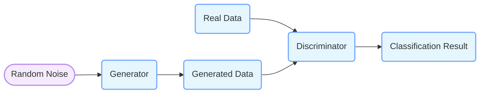

# 深度生成对抗网络在创造性推理中的应用

> 关键词：深度生成对抗网络、创造性推理、生成器、判别器、应用场景

> 摘要：本文深入探讨了深度生成对抗网络（GANs）在创造性推理领域的应用。首先介绍了深度生成对抗网络和创造性推理的相关背景知识，包括目的、预期读者等。接着详细阐述了核心概念与联系，给出了核心概念原理和架构的文本示意图以及 Mermaid 流程图。在核心算法原理部分，使用 Python 源代码进行了详细讲解。同时，介绍了相关的数学模型和公式，并举例说明。通过项目实战，展示了代码的实际案例和详细解释。分析了深度生成对抗网络在创造性推理中的实际应用场景，推荐了相关的工具和资源。最后总结了未来发展趋势与挑战，并给出常见问题解答和扩展阅读参考资料。

## 1. 背景介绍 
### 1.1 目的和范围
深度生成对抗网络（GANs）自提出以来，在图像生成、数据合成等领域取得了巨大的成功。本文章的目的是探索 GANs 在创造性推理方面的应用。创造性推理涉及到从已知信息中推导出新颖、有创意的结论，而 GANs 具有生成新数据的能力，二者的结合具有重要的研究价值和应用前景。文章的范围将涵盖 GANs 的基本原理、创造性推理的概念、GANs 在创造性推理中的算法实现、实际应用场景以及相关的工具和资源推荐等方面。

### 1.2 预期读者
本文预期读者包括人工智能领域的研究人员、程序员、对创造性推理和深度生成对抗网络感兴趣的技术爱好者以及相关专业的学生。对于有一定编程基础和机器学习知识的读者，能够更好地理解文章中的算法原理和代码实现；而对于初学者，通过本文也能对深度生成对抗网络在创造性推理中的应用有一个全面的认识。

### 1.3 文档结构概述
本文将按照以下结构进行组织：首先介绍深度生成对抗网络和创造性推理的相关背景知识，包括术语表；接着阐述核心概念与联系，给出原理和架构的示意图和流程图；然后详细讲解核心算法原理，使用 Python 代码进行说明；再介绍相关的数学模型和公式，并举例；通过项目实战展示代码的实际应用和详细解释；分析实际应用场景；推荐相关的工具和资源；最后总结未来发展趋势与挑战，给出常见问题解答和扩展阅读参考资料。

### 1.4 术语表
#### 1.4.1 核心术语定义
- **深度生成对抗网络（GANs）**：由生成器（Generator）和判别器（Discriminator）两个神经网络组成，通过对抗训练的方式，生成器试图生成逼真的数据，判别器试图区分生成的数据和真实的数据。
- **创造性推理**：基于已知的信息和规则，通过创新的思维方式推导出新颖、有价值的结论或解决方案的过程。
- **生成器**：GANs 中的一个神经网络，负责生成数据，其输入通常是随机噪声，输出是生成的数据。
- **判别器**：GANs 中的另一个神经网络，负责判断输入的数据是真实数据还是生成器生成的假数据。

#### 1.4.2 相关概念解释
- **对抗训练**：生成器和判别器之间进行的一种博弈训练过程。生成器的目标是生成能够欺骗判别器的假数据，而判别器的目标是准确区分真实数据和假数据。在训练过程中，两者不断优化自身的参数，直到达到一个平衡状态。
- **随机噪声**：生成器的输入，通常是从一个特定的分布（如正态分布）中采样得到的随机向量。随机噪声的作用是为生成器提供多样性，使得生成器能够生成不同的样本。

#### 1.4.3 缩略词列表
- **GANs**：Generative Adversarial Networks（生成对抗网络）
- **MLP**：Multi - Layer Perceptron（多层感知机）

## 2. 核心概念与联系 

### 核心概念原理
深度生成对抗网络（GANs）的核心思想是通过两个神经网络——生成器（Generator）和判别器（Discriminator）之间的对抗来学习数据的分布。生成器接收随机噪声作为输入，尝试生成与真实数据分布相似的假数据；判别器则接收真实数据和生成器生成的假数据作为输入，尝试区分它们。在训练过程中，生成器和判别器不断进行对抗训练，生成器的目标是提高生成数据的质量，使得判别器难以区分真假数据；判别器的目标是提高自己的判别能力，准确地识别出真实数据和假数据。

### 架构的文本示意图
```plaintext
              +-----------------+
              |   Random Noise  |
              +-----------------+
                      |
                      v
              +-----------------+
              |    Generator    |
              +-----------------+
                      |
                      v
           +----------------------+
           |  Generated Data (Fake) |
           +----------------------+
                  /           \
                 /             \
                v               v
 +-----------------+     +-----------------+
 |    Discriminator  |     |  Real Data    |
 +-----------------+     +-----------------+
        |                      |
        v                      v
+----------------------+  +----------------------+
|  Classification Result |  |  Classification Result |
+----------------------+  +----------------------+
```

### Mermaid 流程图


## 3. 核心算法原理 & 具体操作步骤 

### 算法原理
深度生成对抗网络的训练过程可以分为两个阶段：判别器训练阶段和生成器训练阶段。

#### 判别器训练阶段
在判别器训练阶段，我们的目标是让判别器能够准确地区分真实数据和生成器生成的假数据。具体来说，我们会从真实数据集中随机抽取一批数据，同时让生成器生成一批假数据。然后将这两批数据分别输入到判别器中，计算判别器的损失函数。判别器的损失函数通常使用二元交叉熵损失函数，其目的是最大化判别器正确分类真实数据和假数据的概率。

#### 生成器训练阶段
在生成器训练阶段，我们的目标是让生成器生成的假数据能够欺骗判别器。具体来说，我们会让生成器生成一批假数据，然后将这些假数据输入到判别器中。此时，我们希望判别器将这些假数据误判为真实数据，因此生成器的损失函数是让判别器对生成数据的分类结果尽可能接近真实数据的标签。

### Python 源代码实现

```python
import torch
import torch.nn as nn
import torch.optim as optim
import numpy as np

# 定义生成器
class Generator(nn.Module):
    def __init__(self, input_dim, output_dim):
        super(Generator, self).__init__()
        self.model = nn.Sequential(
            nn.Linear(input_dim, 128),
            nn.LeakyReLU(0.2),
            nn.Linear(128, 256),
            nn.BatchNorm1d(256),
            nn.LeakyReLU(0.2),
            nn.Linear(256, 512),
            nn.BatchNorm1d(512),
            nn.LeakyReLU(0.2),
            nn.Linear(512, output_dim),
            nn.Tanh()
        )

    def forward(self, z):
        return self.model(z)

# 定义判别器
class Discriminator(nn.Module):
    def __init__(self, input_dim):
        super(Discriminator, self).__init__()
        self.model = nn.Sequential(
            nn.Linear(input_dim, 512),
            nn.LeakyReLU(0.2),
            nn.Linear(512, 256),
            nn.LeakyReLU(0.2),
            nn.Linear(256, 1),
            nn.Sigmoid()
        )

    def forward(self, x):
        return self.model(x)

# 超参数设置
input_dim = 100
output_dim = 784  # 假设输出是 28x28 的图像
batch_size = 32
epochs = 100
lr = 0.0002

# 初始化生成器和判别器
generator = Generator(input_dim, output_dim)
discriminator = Discriminator(output_dim)

# 定义损失函数和优化器
criterion = nn.BCELoss()
g_optimizer = optim.Adam(generator.parameters(), lr=lr)
d_optimizer = optim.Adam(discriminator.parameters(), lr=lr)

# 训练过程
for epoch in range(epochs):
    # 模拟真实数据
    real_data = torch.randn(batch_size, output_dim)

    # 训练判别器
    discriminator.zero_grad()
    # 计算判别器对真实数据的损失
    real_labels = torch.ones(batch_size, 1)
    real_output = discriminator(real_data)
    d_real_loss = criterion(real_output, real_labels)

    # 生成假数据
    z = torch.randn(batch_size, input_dim)
    fake_data = generator(z)
    fake_labels = torch.zeros(batch_size, 1)
    fake_output = discriminator(fake_data.detach())
    d_fake_loss = criterion(fake_output, fake_labels)

    # 判别器总损失
    d_loss = d_real_loss + d_fake_loss
    d_loss.backward()
    d_optimizer.step()

    # 训练生成器
    generator.zero_grad()
    fake_labels = torch.ones(batch_size, 1)
    fake_output = discriminator(fake_data)
    g_loss = criterion(fake_output, fake_labels)
    g_loss.backward()
    g_optimizer.step()

    if epoch % 10 == 0:
        print(f'Epoch [{epoch}/{epochs}], D_loss: {d_loss.item()}, G_loss: {g_loss.item()}')

```

### 具体操作步骤
1. **定义生成器和判别器**：使用 PyTorch 定义生成器和判别器的神经网络结构。
2. **设置超参数**：包括输入维度、输出维度、批量大小、训练轮数和学习率等。
3. **初始化模型和优化器**：初始化生成器和判别器的模型参数，并定义损失函数和优化器。
4. **训练判别器**：在每个训练轮次中，首先训练判别器。从真实数据集中抽取一批数据，同时让生成器生成一批假数据，分别计算判别器对真实数据和假数据的损失，然后更新判别器的参数。
5. **训练生成器**：训练完判别器后，训练生成器。让生成器生成一批假数据，将这些假数据输入到判别器中，计算生成器的损失，然后更新生成器的参数。
6. **输出训练结果**：每隔一定的轮数，输出判别器和生成器的损失值，以便观察训练过程。

## 4. 数学模型和公式 & 详细讲解 & 举例说明 

### 数学模型
深度生成对抗网络的目标是学习真实数据的分布 $p_{data}(x)$。生成器 $G(z; \theta_g)$ 接收随机噪声 $z$ 作为输入，生成数据 $x = G(z; \theta_g)$，其中 $\theta_g$ 是生成器的参数。判别器 $D(x; \theta_d)$ 接收数据 $x$ 作为输入，输出一个概率值，表示 $x$ 是真实数据的概率，其中 $\theta_d$ 是判别器的参数。

### 目标函数
GANs 的目标函数可以表示为一个极小极大博弈问题：

$$
\min_G \max_D V(D, G) = \mathbb{E}_{x \sim p_{data}(x)}[\log D(x)] + \mathbb{E}_{z \sim p_z(z)}[\log(1 - D(G(z)))]
$$

其中，$\mathbb{E}_{x \sim p_{data}(x)}$ 表示对真实数据分布 $p_{data}(x)$ 进行期望运算，$\mathbb{E}_{z \sim p_z(z)}$ 表示对随机噪声分布 $p_z(z)$ 进行期望运算。

### 详细讲解
- **判别器的目标**：判别器的目标是最大化 $V(D, G)$。对于真实数据 $x$，判别器希望 $D(x)$ 尽可能接近 1，即 $\log D(x)$ 尽可能大；对于生成器生成的假数据 $G(z)$，判别器希望 $D(G(z))$ 尽可能接近 0，即 $\log(1 - D(G(z)))$ 尽可能大。
- **生成器的目标**：生成器的目标是最小化 $V(D, G)$。生成器希望生成的假数据 $G(z)$ 能够欺骗判别器，使得 $D(G(z))$ 尽可能接近 1，即 $\log(1 - D(G(z)))$ 尽可能小。

### 举例说明
假设我们有一个简单的一维数据分布 $p_{data}(x)$，它是一个正态分布 $N(0, 1)$。生成器 $G(z; \theta_g)$ 接收一个随机噪声 $z$（也是从正态分布 $N(0, 1)$ 中采样得到），并尝试生成与 $p_{data}(x)$ 相似的样本。判别器 $D(x; \theta_d)$ 接收一个样本 $x$，并判断它是来自真实数据分布还是生成器生成的假数据。

在训练过程中，判别器会学习区分真实数据和假数据。如果生成器生成的假数据与真实数据差异较大，判别器能够很容易地识别出来，此时 $D(G(z))$ 会接近 0；随着训练的进行，生成器会不断调整自己的参数，使得生成的假数据越来越接近真实数据，判别器就会越来越难以区分，此时 $D(G(z))$ 会接近 1。

## 5. 项目实战：代码实际案例和详细解释说明 

### 5.1  开发环境搭建
#### 安装 Python
首先，确保你已经安装了 Python 3.6 或更高版本。你可以从 Python 官方网站（https://www.python.org/downloads/） 下载并安装适合你操作系统的 Python 版本。

#### 安装 PyTorch
使用以下命令安装 PyTorch：
```sh
pip install torch torchvision
```
这将安装 PyTorch 和 torchvision 库，torchvision 库包含了一些常用的数据集和图像处理工具。

#### 安装其他依赖库
安装其他必要的依赖库，如 NumPy：
```sh
pip install numpy
```

### 5.2  源代码详细实现和代码解读
以下是一个完整的使用深度生成对抗网络生成手写数字图像的代码示例：

```python
import torch
import torch.nn as nn
import torch.optim as optim
import torchvision
import torchvision.datasets as datasets
import torchvision.transforms as transforms
from torch.utils.data import DataLoader

# 定义生成器
class Generator(nn.Module):
    def __init__(self, input_dim, output_dim):
        super(Generator, self).__init__()
        self.model = nn.Sequential(
            nn.Linear(input_dim, 256),
            nn.LeakyReLU(0.2),
            nn.Linear(256, 512),
            nn.LeakyReLU(0.2),
            nn.Linear(512, 1024),
            nn.LeakyReLU(0.2),
            nn.Linear(1024, output_dim),
            nn.Tanh()
        )

    def forward(self, z):
        return self.model(z)

# 定义判别器
class Discriminator(nn.Module):
    def __init__(self, input_dim):
        super(Discriminator, self).__init__()
        self.model = nn.Sequential(
            nn.Linear(input_dim, 1024),
            nn.LeakyReLU(0.2),
            nn.Dropout(0.3),
            nn.Linear(1024, 512),
            nn.LeakyReLU(0.2),
            nn.Dropout(0.3),
            nn.Linear(512, 256),
            nn.LeakyReLU(0.2),
            nn.Dropout(0.3),
            nn.Linear(256, 1),
            nn.Sigmoid()
        )

    def forward(self, x):
        return self.model(x)

# 超参数设置
input_dim = 100
output_dim = 784  # 28x28 图像
batch_size = 64
epochs = 50
lr = 0.0002

# 数据加载
transform = transforms.Compose([
    transforms.ToTensor(),
    transforms.Normalize((0.5,), (0.5,))
])

train_dataset = datasets.MNIST(root='./data', train=True,
                               transform=transform, download=True)
train_loader = DataLoader(train_dataset, batch_size=batch_size, shuffle=True)

# 初始化生成器和判别器
generator = Generator(input_dim, output_dim)
discriminator = Discriminator(output_dim)

# 定义损失函数和优化器
criterion = nn.BCELoss()
g_optimizer = optim.Adam(generator.parameters(), lr=lr)
d_optimizer = optim.Adam(discriminator.parameters(), lr=lr)

# 训练过程
for epoch in range(epochs):
    for i, (real_images, _) in enumerate(train_loader):
        real_images = real_images.view(-1, output_dim)

        # 训练判别器
        discriminator.zero_grad()
        real_labels = torch.ones(real_images.size(0), 1)
        real_output = discriminator(real_images)
        d_real_loss = criterion(real_output, real_labels)

        z = torch.randn(real_images.size(0), input_dim)
        fake_images = generator(z)
        fake_labels = torch.zeros(real_images.size(0), 1)
        fake_output = discriminator(fake_images.detach())
        d_fake_loss = criterion(fake_output, fake_labels)

        d_loss = d_real_loss + d_fake_loss
        d_loss.backward()
        d_optimizer.step()

        # 训练生成器
        generator.zero_grad()
        fake_labels = torch.ones(real_images.size(0), 1)
        fake_output = discriminator(fake_images)
        g_loss = criterion(fake_output, fake_labels)
        g_loss.backward()
        g_optimizer.step()

    print(f'Epoch [{epoch + 1}/{epochs}], D_loss: {d_loss.item()}, G_loss: {g_loss.item()}')

# 生成一些样本进行可视化
import matplotlib.pyplot as plt

z = torch.randn(16, input_dim)
generated_images = generator(z).detach().view(-1, 1, 28, 28)
generated_images = (generated_images + 1) / 2.0  # 反归一化

fig, axes = plt.subplots(4, 4, figsize=(4, 4))
axes = axes.flatten()

for i in range(16):
    axes[i].imshow(generated_images[i].squeeze(), cmap='gray')
    axes[i].axis('off')

plt.show()

```

### 代码解读与分析
#### 数据加载部分
使用 `torchvision.datasets.MNIST` 加载 MNIST 手写数字数据集，并使用 `torch.utils.data.DataLoader` 进行数据的批量加载。在数据加载过程中，使用 `transforms.Compose` 对数据进行预处理，包括将图像转换为张量和归一化操作。

#### 生成器和判别器定义
- **生成器**：使用多层感知机（MLP）构建生成器，输入是随机噪声，输出是生成的图像。最后一层使用 `Tanh` 激活函数，将输出值映射到 $[-1, 1]$ 之间。
- **判别器**：同样使用 MLP 构建判别器，输入是图像，输出是一个概率值，表示该图像是真实图像的概率。最后一层使用 `Sigmoid` 激活函数，将输出值映射到 $[0, 1]$ 之间。

#### 训练过程
- **判别器训练**：在每个训练批次中，首先训练判别器。从数据集中获取真实图像，同时让生成器生成一批假图像。分别计算判别器对真实图像和假图像的损失，然后将两者相加得到判别器的总损失，最后更新判别器的参数。
- **生成器训练**：训练完判别器后，训练生成器。让生成器生成一批假图像，将这些假图像输入到判别器中，计算生成器的损失，然后更新生成器的参数。

#### 可视化部分
训练完成后，使用生成器生成一些样本，并将其可视化展示。通过反归一化操作，将生成的图像恢复到原始的像素范围。

## 6. 实际应用场景 
### 图像生成
深度生成对抗网络在图像生成领域有广泛的应用。例如，生成逼真的人脸图像、风景图像等。通过训练 GANs，可以让生成器学习到真实图像的分布，从而生成出高质量的图像。一些艺术创作中也会使用 GANs 来生成新颖的艺术作品，为艺术家提供创意灵感。

### 数据合成
在一些数据稀缺的领域，GANs 可以用于合成数据。例如，在医学图像领域，真实的医学图像数据往往非常稀缺，且标注成本高。通过训练 GANs，可以生成合成的医学图像，用于模型的训练和验证，提高模型的泛化能力。

### 创造性推理辅助
在创造性推理任务中，GANs 可以作为一种辅助工具。例如，在设计领域，设计师在进行创意设计时，可能会遇到灵感枯竭的情况。GANs 可以根据设计师输入的一些基本元素和要求，生成一些新颖的设计方案，为设计师提供新的思路和创意。

### 文本生成
GANs 也可以应用于文本生成任务。例如，生成诗歌、故事等。通过将文本数据转换为向量表示，训练 GANs 可以学习到文本的语义和语法结构，从而生成具有创意的文本内容。

## 7. 工具和资源推荐
### 7.1 学习资源推荐
#### 7.1.1 书籍推荐
- 《深度学习》（Deep Learning）：由 Ian Goodfellow、Yoshua Bengio 和 Aaron Courville 所著，是深度学习领域的经典教材，涵盖了深度生成对抗网络等相关内容。
- 《Python 深度学习》（Deep Learning with Python）：作者是 Francois Chollet，书中介绍了如何使用 Python 和 Keras 进行深度学习模型的开发，包括 GANs 的实现。

#### 7.1.2 在线课程
- Coursera 上的“深度学习专项课程”（Deep Learning Specialization）：由 Andrew Ng 教授授课，包含了多个深度学习相关的课程，其中有关于生成对抗网络的详细讲解。
- Udemy 上的“生成对抗网络（GANs）实战”（GANs in Action）：该课程通过实际案例，详细介绍了如何使用 GANs 进行图像生成等任务。

#### 7.1.3 技术博客和网站
- Medium：上面有很多关于深度学习和 GANs 的技术博客文章，作者们会分享他们的研究成果和实践经验。
- arXiv：一个预印本数据库，包含了很多最新的学术研究论文，你可以在上面找到关于深度生成对抗网络的最新研究进展。

### 7.2 开发工具框架推荐
#### 7.2.1 IDE和编辑器
- PyCharm：是一款专门为 Python 开发设计的集成开发环境（IDE），具有代码自动补全、调试等功能，非常适合开发深度学习项目。
- Jupyter Notebook：是一个交互式的开发环境，支持 Python 代码的实时运行和可视化展示，方便进行模型的实验和调试。

#### 7.2.2 调试和性能分析工具
- TensorBoard：是 TensorFlow 提供的一个可视化工具，可以用于监控模型的训练过程，如损失函数的变化、模型参数的分布等。
- PyTorch Profiler：是 PyTorch 提供的性能分析工具，可以帮助开发者分析模型的性能瓶颈，优化代码。

#### 7.2.3 相关框架和库
- PyTorch：是一个开源的深度学习框架，提供了丰富的神经网络模块和优化算法，方便开发者实现深度生成对抗网络。
- TensorFlow：也是一个广泛使用的深度学习框架，具有强大的分布式训练和部署能力，同样可以用于实现 GANs。

### 7.3 相关论文著作推荐
#### 7.3.1 经典论文
- “Generative Adversarial Networks”：由 Ian Goodfellow 等人发表的论文，首次提出了生成对抗网络的概念，是该领域的经典之作。
- “Unsupervised Representation Learning with Deep Convolutional Generative Adversarial Networks”：提出了深度卷积生成对抗网络（DCGAN），在图像生成领域取得了很好的效果。

#### 7.3.2 最新研究成果
- 关注 arXiv 上关于 GANs 的最新论文，了解该领域的最新研究进展，如一些改进的 GANs 架构和训练方法。

#### 7.3.3 应用案例分析
- 可以在学术数据库（如 IEEE Xplore、ACM Digital Library 等）中搜索关于 GANs 在不同领域应用的案例分析论文，学习如何将 GANs 应用到实际问题中。

## 8. 总结：未来发展趋势与挑战
### 未来发展趋势
- **多模态融合**：未来的深度生成对抗网络可能会融合多种模态的数据，如图像、文本、音频等。通过多模态融合，可以生成更加丰富和多样化的内容，为创造性推理提供更多的可能性。
- **强化学习结合**：将强化学习与 GANs 相结合，可以更好地引导生成器生成符合特定目标的内容。例如，在创造性设计任务中，通过强化学习可以让生成器根据用户的反馈不断优化生成的方案。
- **可解释性增强**：目前 GANs 的可解释性较差，未来的研究可能会致力于提高 GANs 的可解释性，使得生成的结果更容易被理解和控制。

### 挑战
- **训练稳定性**：GANs 的训练过程非常不稳定，容易出现模式崩溃等问题。如何提高 GANs 的训练稳定性，是目前该领域面临的一个重要挑战。
- **数据质量要求高**：GANs 的性能很大程度上依赖于训练数据的质量。如果训练数据存在偏差或噪声，会影响生成结果的质量。因此，如何获取高质量的训练数据是一个需要解决的问题。
- **伦理和法律问题**：随着 GANs 的广泛应用，可能会带来一些伦理和法律问题。例如，生成的虚假图像和文本可能会被用于恶意目的，如虚假新闻传播、身份伪造等。如何应对这些伦理和法律问题，是未来需要关注的方向。

## 9. 附录：常见问题与解答
### 问题 1：GANs 训练过程中出现模式崩溃怎么办？
**解答**：模式崩溃是指生成器只能生成有限的几种样本，而无法覆盖真实数据的分布。可以尝试以下方法来解决：
- 调整超参数：如学习率、批量大小等。
- 使用正则化方法：如谱归一化、梯度惩罚等。
- 改进网络结构：如使用更复杂的生成器和判别器结构。

### 问题 2：如何选择合适的损失函数？
**解答**：常见的损失函数有二元交叉熵损失函数、Wasserstein 损失函数等。二元交叉熵损失函数适用于基本的 GANs 训练；Wasserstein 损失函数可以提高训练的稳定性，尤其在处理高维数据时效果较好。可以根据具体的任务和数据特点选择合适的损失函数。

### 问题 3：GANs 生成的样本质量不高怎么办？
**解答**：可以从以下几个方面进行改进：
- 增加训练数据：更多的训练数据可以让生成器学习到更丰富的特征。
- 调整网络结构：如增加网络的层数、神经元数量等。
- 优化训练过程：如增加训练轮数、调整学习率等。

## 10. 扩展阅读 & 参考资料
### 扩展阅读
- Goodfellow, I. J., Bengio, Y., & Courville, A. (2016). Deep Learning. MIT Press.
- Chollet, F. (2017). Deep Learning with Python. Manning Publications.
- Goodfellow, I. J., et al. (2014). Generative Adversarial Networks. arXiv preprint arXiv:1406.2661.
- Radford, A., Metz, L., & Chintala, S. (2015). Unsupervised Representation Learning with Deep Convolutional Generative Adversarial Networks. arXiv preprint arXiv:1511.06434.

### 参考资料
- PyTorch 官方文档：https://pytorch.org/docs/stable/index.html
- TensorFlow 官方文档：https://www.tensorflow.org/api_docs
- Coursera 课程：https://www.coursera.org/specializations/deep-learning
- Udemy 课程：https://www.udemy.com/course/gans-in-action/
- Medium 技术博客：https://medium.com/
- arXiv 预印本数据库：https://arxiv.org/