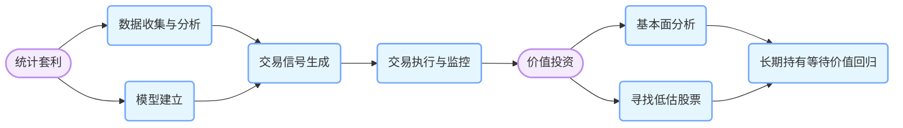

# 爱德华·索普的统计套利在价值投资中的应用

> 关键词：爱德华·索普、统计套利、价值投资、量化交易、金融市场、投资策略、风险控制

> 摘要：本文深入探讨了爱德华·索普的统计套利在价值投资中的应用。首先介绍了相关的背景知识，包括目的范围、预期读者等内容。接着阐述了统计套利和价值投资的核心概念及其联系，并给出了相应的原理和架构示意图。详细讲解了统计套利的核心算法原理，用Python代码进行了具体实现和说明。同时，介绍了相关的数学模型和公式，并举例进行解释。通过项目实战，展示了如何在实际中运用统计套利进行价值投资，包括开发环境搭建、源代码实现和解读。分析了统计套利在价值投资中的实际应用场景，推荐了相关的学习资源、开发工具框架和论文著作。最后总结了未来的发展趋势与挑战，还包含常见问题解答和扩展阅读参考资料，旨在为投资者和研究者提供全面深入的参考，以便更好地理解和运用统计套利于价值投资之中。

## 1. 背景介绍 
### 1.1 目的和范围
本文的主要目的是深入研究爱德华·索普所提出的统计套利策略在价值投资领域的应用。通过详细剖析统计套利的原理、算法、数学模型以及实际操作方法，旨在为投资者和金融从业者提供一种新的投资思路和方法，帮助他们更好地在金融市场中进行价值投资决策，提高投资收益并降低风险。

范围涵盖了统计套利和价值投资的基本概念、两者之间的联系、统计套利的核心算法和数学模型、基于统计套利的价值投资项目实战案例、实际应用场景分析以及相关工具和资源的推荐等方面。

### 1.2 预期读者
本文预期读者包括金融市场的投资者，如个人投资者、机构投资者等，他们希望通过学习新的投资策略来优化自己的投资组合；金融从业者，如基金经理、交易员等，以便在实际工作中运用统计套利进行价值投资决策；金融领域的研究者和学生，他们对金融投资理论和实践有深入研究的需求，可将本文作为研究参考资料。

### 1.3 文档结构概述
本文将按照以下结构进行阐述：首先介绍背景知识，包括目的范围、预期读者、文档结构概述和术语表；接着讲解统计套利和价值投资的核心概念与联系，并给出相应的示意图和流程图；然后详细阐述统计套利的核心算法原理和具体操作步骤，用Python代码进行说明；介绍相关的数学模型和公式，并举例解释；通过项目实战展示统计套利在价值投资中的实际应用，包括开发环境搭建、源代码实现和解读；分析统计套利在价值投资中的实际应用场景；推荐相关的学习资源、开发工具框架和论文著作；最后总结未来的发展趋势与挑战，包含常见问题解答和扩展阅读参考资料。

### 1.4 术语表
#### 1.4.1 核心术语定义
- **统计套利**：是一种基于统计学原理的套利策略，通过对历史数据的分析和建模，发现金融资产价格之间的统计关系，当这些关系出现偏离时，进行相应的买卖操作，以获取套利收益。
- **价值投资**：是一种投资理念，投资者通过分析公司的基本面，如财务状况、盈利能力、行业地位等，寻找被市场低估的股票，长期持有以获得价值回归带来的收益。
- **量化交易**：指利用数学模型和计算机程序进行交易决策和执行的交易方式，通过对大量数据的分析和处理，寻找交易机会。

#### 1.4.2 相关概念解释
- **基本面分析**：是价值投资的重要方法，通过研究公司的财务报表、行业竞争格局、宏观经济环境等因素，评估公司的内在价值。
- **套利机会**：指在不同市场或不同资产之间存在价格差异，通过同时买入和卖出相关资产，以获取无风险或低风险的收益。
- **风险控制**：在投资过程中，通过各种方法和手段，如分散投资、设置止损等，降低投资风险，保护投资者的资金安全。

#### 1.4.3 缩略词列表
- **ETF**：交易型开放式指数基金（Exchange Traded Fund）
- **VAR**：风险价值（Value at Risk）
- **CAPM**：资本资产定价模型（Capital Asset Pricing Model）

## 2. 核心概念与联系 

### 统计套利的核心概念原理
统计套利的核心思想是基于金融资产价格之间的统计关系。在有效市场假设下，相关资产的价格应该存在某种稳定的关系。例如，同一行业的不同股票，由于受到相似的行业因素和宏观经济因素的影响，它们的价格走势应该具有一定的相关性。当这种相关性出现短期偏离时，就可能存在套利机会。

统计套利通常通过以下步骤实现：
1. **数据收集与分析**：收集相关金融资产的历史价格数据，运用统计学方法分析它们之间的关系，如相关性分析、协整分析等。
2. **模型建立**：根据分析结果建立统计模型，确定资产价格之间的正常关系和偏离阈值。
3. **交易信号生成**：当资产价格之间的关系偏离正常范围时，模型会生成交易信号，指示投资者进行买入或卖出操作。
4. **交易执行与监控**：根据交易信号进行实际的交易操作，并实时监控资产价格的变化，当价格关系回归正常时，平仓获利。

### 价值投资的核心概念原理
价值投资的核心是寻找被市场低估的股票。投资者认为，股票的价格会围绕其内在价值波动。通过对公司的基本面进行深入分析，如财务报表分析、行业竞争分析、管理层评估等，可以估算出公司的内在价值。当股票价格低于其内在价值时，投资者认为该股票被低估，具有投资价值，于是买入并长期持有，等待价格回归价值。

### 统计套利与价值投资的联系
统计套利和价值投资虽然是两种不同的投资策略，但它们之间存在一定的联系。统计套利可以为价值投资提供辅助决策。在价值投资中，投资者通过基本面分析确定了一些具有投资价值的股票，但可能无法确定最佳的买入和卖出时机。统计套利可以通过对股票价格的统计分析，帮助价值投资者更好地把握买卖时机，提高投资收益。

例如，价值投资者通过基本面分析发现某只股票被低估，但该股票价格可能还会继续下跌一段时间。统计套利可以通过分析该股票与相关股票或市场指数的价格关系，确定价格下跌的极限，帮助价值投资者在价格最低点附近买入。

### 核心概念原理和架构的文本示意图
```plaintext
统计套利与价值投资联系示意图

             统计套利
            /        \
           /          \
数据收集与分析     模型建立
           \          /
            \        /
         交易信号生成
                 |
                 V
          交易执行与监控
                 |
                 V
            价值投资
            /        \
           /          \
基本面分析  寻找低估股票
           \          /
            \        /
        长期持有等待价值回归
```

### Mermaid 流程图


## 3. 核心算法原理 & 具体操作步骤 

### 统计套利的核心算法原理
统计套利中常用的算法是基于协整分析的方法。协整分析用于检验两个或多个非平稳时间序列之间是否存在长期稳定的关系。如果两个时间序列是协整的，那么它们之间的差值（称为残差）应该是平稳的。

假设我们有两个股票的价格序列 $P_1(t)$ 和 $P_2(t)$，我们可以通过线性回归来建立它们之间的关系：

$$P_1(t) = \alpha + \beta P_2(t) + \epsilon(t)$$

其中，$\alpha$ 和 $\beta$ 是回归系数，$\epsilon(t)$ 是残差序列。如果 $P_1(t)$ 和 $P_2(t)$ 是协整的，那么 $\epsilon(t)$ 应该是平稳的。

当 $\epsilon(t)$ 偏离其均值时，就可能存在套利机会。具体来说，当 $\epsilon(t)$ 大于某个正阈值时，我们可以卖出 $P_1(t)$ 并买入 $P_2(t)$；当 $\epsilon(t)$ 小于某个负阈值时，我们可以买入 $P_1(t)$ 并卖出 $P_2(t)$。

### 具体操作步骤
1. **数据收集**：收集相关股票的历史价格数据，可以从金融数据提供商（如雅虎财经、万得等）获取。
2. **数据预处理**：对收集到的数据进行清洗和处理，包括去除缺失值、调整价格等。
3. **协整检验**：使用统计方法（如恩格尔 - 格兰杰检验）对股票价格序列进行协整检验，确定它们是否存在协整关系。
4. **回归分析**：如果存在协整关系，进行线性回归，计算回归系数 $\alpha$ 和 $\beta$，并得到残差序列 $\epsilon(t)$。
5. **阈值确定**：根据残差序列的统计特性（如均值、标准差等）确定交易阈值。
6. **交易信号生成**：根据残差序列和阈值生成交易信号。
7. **交易执行**：根据交易信号进行实际的交易操作。

### Python 源代码实现
```python
import pandas as pd
import numpy as np
import statsmodels.api as sm
from statsmodels.tsa.stattools import coint

# 数据收集（这里假设已经有两个股票的价格数据）
# 示例数据，实际应用中需要替换为真实数据
np.random.seed(0)
t = np.linspace(0, 100, 100)
p1 = np.sin(t) + np.random.normal(0, 0.1, 100)
p2 = 0.5 * np.sin(t) + np.random.normal(0, 0.1, 100)
data = pd.DataFrame({'P1': p1, 'P2': p2})

# 数据预处理（去除缺失值）
data = data.dropna()

# 协整检验
_, p_value, _ = coint(data['P1'], data['P2'])
if p_value < 0.05:
    print("两个时间序列存在协整关系")
else:
    print("两个时间序列不存在协整关系")

# 回归分析
X = sm.add_constant(data['P2'])
model = sm.OLS(data['P1'], X).fit()
alpha = model.params[0]
beta = model.params[1]
residuals = model.resid

# 阈值确定
mean_residual = residuals.mean()
std_residual = residuals.std()
upper_threshold = mean_residual + 1.5 * std_residual
lower_threshold = mean_residual - 1.5 * std_residual

# 交易信号生成
signals = []
for residual in residuals:
    if residual > upper_threshold:
        signals.append(-1)  # 卖出 P1，买入 P2
    elif residual < lower_threshold:
        signals.append(1)   # 买入 P1，卖出 P2
    else:
        signals.append(0)   # 不操作

data['signals'] = signals

# 输出交易信号
print(data[['P1', 'P2', 'signals']])
```

### 代码解释
1. **数据收集**：使用 `numpy` 生成示例数据，实际应用中需要从金融数据提供商获取真实数据。
2. **数据预处理**：使用 `pandas` 的 `dropna()` 方法去除缺失值。
3. **协整检验**：使用 `statsmodels` 库的 `coint()` 函数进行协整检验，判断两个时间序列是否存在协整关系。
4. **回归分析**：使用 `statsmodels` 库的 `OLS()` 函数进行线性回归，计算回归系数 $\alpha$ 和 $\beta$，并得到残差序列。
5. **阈值确定**：根据残差序列的均值和标准差确定交易阈值。
6. **交易信号生成**：根据残差序列和阈值生成交易信号，存储在 `signals` 列表中。
7. **输出交易信号**：将交易信号添加到 `data` 数据框中，并输出结果。

## 4. 数学模型和公式 & 详细讲解 & 举例说明 

### 协整分析的数学模型和公式
#### 单位根检验
在进行协整分析之前，需要先检验时间序列是否存在单位根。常用的单位根检验方法是迪基 - 富勒检验（Dickey - Fuller Test）。

对于一个时间序列 $y_t$，其自回归模型可以表示为：

$$\Delta y_t = \alpha + \beta t + \gamma y_{t - 1} + \sum_{i = 1}^{p} \delta_i \Delta y_{t - i} + \epsilon_t$$

其中，$\Delta y_t = y_t - y_{t - 1}$ 是 $y_t$ 的一阶差分，$\alpha$ 是截距项，$\beta$ 是趋势项系数，$\gamma$ 是自回归系数，$\delta_i$ 是滞后差分系数，$\epsilon_t$ 是误差项。

迪基 - 富勒检验的原假设是 $\gamma = 0$，即时间序列存在单位根，是非平稳的；备择假设是 $\gamma < 0$，即时间序列是平稳的。

#### 恩格尔 - 格兰杰检验
恩格尔 - 格兰杰检验用于检验两个或多个非平稳时间序列之间是否存在协整关系。具体步骤如下：
1. 对两个时间序列 $y_{1t}$ 和 $y_{2t}$ 进行线性回归：

$$y_{1t} = \alpha + \beta y_{2t} + \epsilon_t$$

2. 对残差序列 $\epsilon_t$ 进行单位根检验。如果残差序列是平稳的，则说明 $y_{1t}$ 和 $y_{2t}$ 是协整的。

### 详细讲解
单位根检验的目的是判断时间序列是否平稳。如果时间序列存在单位根，那么它的均值、方差等统计特性会随时间变化，不适合直接进行统计分析。通过单位根检验，可以确定是否需要对时间序列进行差分处理，使其变为平稳序列。

恩格尔 - 格兰杰检验则是在单位根检验的基础上，进一步检验两个非平稳时间序列之间是否存在长期稳定的关系。如果两个时间序列是协整的，那么它们之间的差值（残差序列）应该是平稳的，这意味着它们的价格走势在长期内是相互关联的。

### 举例说明
假设我们有两个股票的价格序列 $P_1(t)$ 和 $P_2(t)$，如下所示：

| 时间 | $P_1(t)$ | $P_2(t)$ |
|------|----------|----------|
| 1    | 100      | 50       |
| 2    | 102      | 51       |
| 3    | 103      | 51.5     |
| 4    | 101      | 50.5     |
| 5    | 104      | 52       |

首先，对 $P_1(t)$ 和 $P_2(t)$ 进行单位根检验，发现它们都存在单位根，是非平稳的。

然后，进行线性回归：

$$P_1(t) = \alpha + \beta P_2(t) + \epsilon(t)$$

使用最小二乘法估计回归系数 $\alpha$ 和 $\beta$，得到：

$$P_1(t) = 50 + 1 \times P_2(t) + \epsilon(t)$$

接着，对残差序列 $\epsilon(t)$ 进行单位根检验，发现残差序列是平稳的，说明 $P_1(t)$ 和 $P_2(t)$ 是协整的。

当 $\epsilon(t)$ 大于某个正阈值时，如 $\epsilon(t) > 2$，我们可以卖出 $P_1(t)$ 并买入 $P_2(t)$；当 $\epsilon(t)$ 小于某个负阈值时，如 $\epsilon(t) < -2$，我们可以买入 $P_1(t)$ 并卖出 $P_2(t)$。

## 5. 项目实战：代码实际案例和详细解释说明 

### 5.1  开发环境搭建
#### 操作系统
可以选择 Windows、Linux 或 macOS 操作系统，建议使用 Linux 或 macOS 系统，因为它们在数据处理和开发方面具有更好的性能和稳定性。

#### 编程语言
使用 Python 编程语言，Python 具有丰富的数据分析和金融计算库，非常适合用于金融数据处理和统计套利策略的实现。

#### 开发工具
可以使用 Anaconda 作为 Python 开发环境的管理工具，它包含了许多常用的科学计算库和工具。同时，可以使用 PyCharm 或 Jupyter Notebook 作为开发工具，PyCharm 适合进行大型项目的开发，Jupyter Notebook 适合进行交互式的数据分析和代码演示。

#### 金融数据获取
可以使用雅虎财经、万得等金融数据提供商的 API 获取股票价格数据。也可以使用 `pandas-datareader` 库来获取雅虎财经的数据。

### 5.2  源代码详细实现和代码解读
```python
import pandas as pd
import numpy as np
import statsmodels.api as sm
from statsmodels.tsa.stattools import coint
import pandas_datareader.data as web
import matplotlib.pyplot as plt

# 数据获取
start_date = '2010-01-01'
end_date = '2020-12-31'
ticker1 = 'AAPL'
ticker2 = 'MSFT'
data1 = web.DataReader(ticker1, 'yahoo', start_date, end_date)['AdjClose']
data2 = web.DataReader(ticker2, 'yahoo', start_date, end_date)['AdjClose']
data = pd.DataFrame({'P1': data1, 'P2': data2})

# 数据预处理
data = data.dropna()

# 协整检验
_, p_value, _ = coint(data['P1'], data['P2'])
if p_value < 0.05:
    print("两个时间序列存在协整关系")
else:
    print("两个时间序列不存在协整关系")

# 回归分析
X = sm.add_constant(data['P2'])
model = sm.OLS(data['P1'], X).fit()
alpha = model.params[0]
beta = model.params[1]
residuals = model.resid

# 阈值确定
mean_residual = residuals.mean()
std_residual = residuals.std()
upper_threshold = mean_residual + 1.5 * std_residual
lower_threshold = mean_residual - 1.5 * std_residual

# 交易信号生成
signals = []
positions = [0]
for i in range(len(residuals)):
    if residuals[i] > upper_threshold:
        signals.append(-1)  # 卖出 P1，买入 P2
    elif residuals[i] < lower_threshold:
        signals.append(1)   # 买入 P1，卖出 P2
    else:
        signals.append(0)   # 不操作
    if i > 0:
        positions.append(positions[-1] + signals[i])

data['signals'] = signals
data['positions'] = positions

# 计算收益
returns1 = data['P1'].pct_change()
returns2 = data['P2'].pct_change()
portfolio_returns = data['positions'].shift(1) * (returns1 - beta * returns2)
cumulative_returns = (1 + portfolio_returns).cumprod()

# 绘制收益曲线
plt.figure(figsize=(12, 6))
plt.plot(cumulative_returns)
plt.title('Cumulative Returns of Statistical Arbitrage Strategy')
plt.xlabel('Date')
plt.ylabel('Cumulative Returns')
plt.show()
```

### 5.3  代码解读与分析
1. **数据获取**：使用 `pandas_datareader` 库从雅虎财经获取苹果（AAPL）和微软（MSFT）的调整后收盘价数据。
2. **数据预处理**：使用 `pandas` 的 `dropna()` 方法去除缺失值。
3. **协整检验**：使用 `statsmodels` 库的 `coint()` 函数进行协整检验，判断两个时间序列是否存在协整关系。
4. **回归分析**：使用 `statsmodels` 库的 `OLS()` 函数进行线性回归，计算回归系数 $\alpha$ 和 $\beta$，并得到残差序列。
5. **阈值确定**：根据残差序列的均值和标准差确定交易阈值。
6. **交易信号生成**：根据残差序列和阈值生成交易信号，并计算持仓位置。
7. **计算收益**：计算两个股票的收益率，根据持仓位置计算投资组合的收益率，并计算累计收益率。
8. **绘制收益曲线**：使用 `matplotlib` 库绘制累计收益率曲线，直观展示统计套利策略的收益情况。

通过对代码的分析，我们可以看到统计套利策略的实现过程，包括数据获取、数据处理、协整检验、回归分析、交易信号生成、收益计算和可视化等步骤。同时，我们可以根据收益曲线评估策略的性能，进一步优化策略参数。

## 6. 实际应用场景 
### 股票市场
在股票市场中，统计套利可以帮助投资者发现不同股票之间的价格偏离关系，进行套利交易。例如，同一行业的不同股票，由于受到相似的行业因素和宏观经济因素的影响，它们的价格走势应该具有一定的相关性。当这种相关性出现短期偏离时，投资者可以通过买入低估的股票，卖出高估的股票，等待价格回归正常，获取套利收益。

### 期货市场
期货市场中，统计套利也有广泛的应用。不同期货合约之间可能存在价格差异，如同一商品的不同到期月份合约，或者相关商品的期货合约。投资者可以通过分析这些合约之间的价格关系，进行跨期套利、跨品种套利等操作。

### 外汇市场
外汇市场中，不同货币对之间的汇率也存在一定的统计关系。投资者可以通过分析汇率的历史数据，发现汇率之间的偏离关系，进行外汇套利交易。

### 基金投资
在基金投资中，统计套利可以帮助投资者选择合适的基金组合。例如，通过分析不同基金的净值走势，发现它们之间的相关性和偏离关系，选择具有互补性的基金进行投资，降低投资风险，提高投资收益。

## 7. 工具和资源推荐
### 7.1 学习资源推荐
#### 7.1.1 书籍推荐
- 《金融计量学：从基础到高级建模技术》：这本书系统介绍了金融计量学的基本理论和方法，包括时间序列分析、回归分析、协整分析等，是学习统计套利的重要参考书籍。
- 《量化投资：策略与技术》：全面介绍了量化投资的概念、策略和技术，包括统计套利、机器学习在投资中的应用等内容，对投资者和金融从业者有很大的帮助。
- 《聪明的投资者》：这是价值投资的经典著作，由本杰明·格雷厄姆所著，详细阐述了价值投资的理念和方法，对理解价值投资有重要的指导意义。

#### 7.1.2 在线课程
- Coursera 上的“Financial Markets”课程：由耶鲁大学的罗伯特·席勒教授授课，介绍了金融市场的基本原理和投资策略，包括统计套利和价值投资等内容。
- edX 上的“Quantitative Methods for Finance”课程：系统介绍了金融计量学的方法和应用，对学习统计套利的算法和模型有很大的帮助。

#### 7.1.3 技术博客和网站
- 优矿（uqer.io）：提供了丰富的金融数据和量化交易平台，同时有许多关于统计套利和价值投资的技术文章和案例分享。
- 聚宽（joinquant.com）：也是一个量化交易平台，有大量的量化策略和代码示例，对学习统计套利的实践应用有很大的帮助。

### 7.2 开发工具框架推荐
#### 7.2.1 IDE和编辑器
- PyCharm：是一款功能强大的 Python 集成开发环境，具有代码自动补全、调试、版本控制等功能，适合进行大型项目的开发。
- Jupyter Notebook：是一个交互式的开发环境，适合进行数据分析和代码演示，方便用户进行实验和验证。

#### 7.2.2 调试和性能分析工具
- PySnooper：可以在不写大量日志的情况下，快速查看 Python 代码的执行过程，方便调试代码。
- cProfile：是 Python 内置的性能分析工具，可以帮助用户找出代码中的性能瓶颈，进行优化。

#### 7.2.3 相关框架和库
- `pandas`：是一个强大的数据分析库，提供了丰富的数据结构和数据处理方法，适合进行金融数据的处理和分析。
- `numpy`：是 Python 的数值计算库，提供了高效的数组和矩阵运算功能，是许多数据分析和机器学习库的基础。
- `statsmodels`：是一个统计分析库，提供了多种统计模型和方法，如线性回归、协整分析等，适合进行统计套利的算法实现。

### 7.3 相关论文著作推荐
#### 7.3.1 经典论文
- Engle, R. F., & Granger, C. W. J. (1987). Cointegration and error correction: representation, estimation, and testing. Econometrica, 55(2), 251 - 276. 这篇论文提出了协整分析的理论和方法，是统计套利领域的经典论文。
- Fama, E. F., & French, K. R. (1992). The cross - section of expected stock returns. The Journal of Finance, 47(2), 427 - 465. 这篇论文提出了著名的 Fama - French 三因子模型，对理解股票收益率的影响因素有重要的意义。

#### 7.3.2 最新研究成果
- 可以关注《Journal of Financial Economics》、《Review of Financial Studies》等金融领域的顶级学术期刊，获取统计套利和价值投资的最新研究成果。

#### 7.3.3 应用案例分析
- 一些金融机构和量化投资公司会发布他们的投资策略和应用案例，可以通过他们的官方网站或研究报告获取相关信息，学习他们的实践经验。

## 8. 总结：未来发展趋势与挑战
### 未来发展趋势
#### 与人工智能的结合
随着人工智能技术的发展，统计套利将越来越多地与人工智能算法相结合。例如，使用机器学习算法对金融数据进行分析和建模，挖掘更复杂的价格关系和套利机会。深度学习算法可以处理大量的非结构化数据，如新闻文本、社交媒体数据等，为统计套利提供更多的信息和决策依据。

#### 多资产类别的应用
未来，统计套利将不仅仅局限于股票、期货、外汇等传统资产类别，还将扩展到更多的资产类别，如加密货币、大宗商品、房地产等。随着金融市场的不断创新和发展，不同资产类别之间的相关性和套利机会将更加复杂和多样化。

#### 全球化的发展
随着全球金融市场的一体化，统计套利将越来越具有全球化的特点。投资者可以利用不同国家和地区金融市场的差异，进行跨国套利交易。同时，国际金融市场的互联互通也将为统计套利提供更多的机会和挑战。

### 挑战
#### 数据质量和获取难度
统计套利依赖于大量的历史数据进行分析和建模，数据的质量和获取难度是一个重要的挑战。金融数据可能存在缺失值、错误值等问题，需要进行复杂的数据清洗和预处理。同时，一些金融数据可能需要付费获取，增加了数据获取的成本。

#### 市场环境的变化
金融市场是动态变化的，市场环境的变化可能导致统计套利策略的失效。例如，宏观经济政策的调整、行业竞争格局的变化、突发事件的影响等，都可能导致资产价格的波动和相关性的变化，使原有的套利机会消失或产生新的风险。

#### 监管政策的约束
随着金融市场的发展，监管政策也在不断加强。统计套利作为一种金融交易策略，可能受到监管政策的约束。例如，一些国家和地区对高频交易、套利交易等有严格的监管规定，投资者需要遵守相关的法律法规，否则可能面临法律风险。

## 9. 附录：常见问题与解答
### 1. 统计套利一定能赚钱吗？
统计套利并不能保证一定能赚钱。虽然统计套利是基于历史数据和统计模型进行的，但金融市场是复杂多变的，未来的价格走势可能与历史数据不同。同时，市场环境的变化、突发事件的影响等都可能导致套利策略的失效，产生亏损。

### 2. 如何选择适合统计套利的资产？
选择适合统计套利的资产需要考虑多个因素。首先，资产之间应该具有一定的相关性，这样才能通过分析它们之间的价格关系发现套利机会。其次，资产的流动性要好，以便在需要买卖时能够顺利成交。此外，还需要考虑资产的交易成本、市场容量等因素。

### 3. 统计套利的风险如何控制？
统计套利的风险控制可以从多个方面进行。首先，要合理设置交易阈值，避免过度交易和风险暴露。其次，要进行分散投资，选择不同的资产组合进行套利交易，降低单一资产的风险。此外，还可以设置止损和止盈点，及时控制亏损和锁定收益。

### 4. 统计套利和价值投资哪个更好？
统计套利和价值投资是两种不同的投资策略，各有优缺点，不能简单地说哪个更好。统计套利更注重短期的价格波动和套利机会，通过快速买卖获取收益；价值投资更注重公司的基本面和长期价值，通过长期持有获取价值回归带来的收益。投资者可以根据自己的投资目标、风险承受能力和投资经验等因素，选择适合自己的投资策略，也可以将两者结合起来使用。

## 10. 扩展阅读 & 参考资料
### 扩展阅读
- 《金融炼金术》：乔治·索罗斯的著作，介绍了他的投资理念和方法，对理解金融市场的复杂性和不确定性有很大的帮助。
- 《漫步华尔街》：这本书介绍了多种投资策略和方法，包括随机漫步理论、有效市场假说等，对投资者有很大的启发。

### 参考资料
- 雅虎财经（https://finance.yahoo.com/）：提供了丰富的金融数据和市场信息。
- 万得资讯（https://www.wind.com.cn/）：是国内领先的金融数据服务商，提供全面的金融数据和分析工具。
- 维基百科（https://en.wikipedia.org/）：可以获取关于统计套利、价值投资等相关概念和理论的详细介绍。