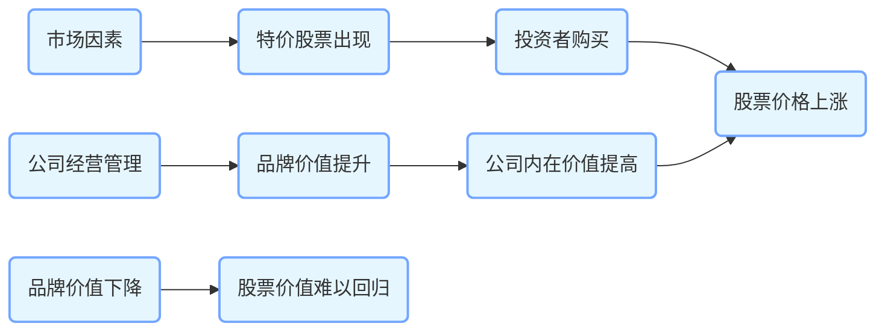

# 特价股票与公司品牌价值的长期关系

> 关键词：特价股票、公司品牌价值、长期关系、股票估值、品牌评估

> 摘要：本文深入探讨了特价股票与公司品牌价值之间的长期关系。通过对相关概念的阐述、核心算法原理的讲解、数学模型的分析以及实际案例的研究，揭示了两者在长期维度下相互影响的内在机制。旨在帮助投资者更好地理解股票价值与公司品牌价值的联系，为投资决策提供理论和实践依据，同时也为企业管理者在品牌建设和股票市场表现方面提供参考。

## 1. 背景介绍 
### 1.1 目的和范围
本研究的主要目的是全面剖析特价股票与公司品牌价值之间的长期关系。通过对这一关系的深入探究，为投资者提供更准确的投资决策参考，帮助他们识别那些具有潜在增长价值的特价股票。同时，也为企业管理者提供关于品牌建设对股票市场表现影响的见解，以制定更有效的品牌战略和财务策略。研究范围涵盖了不同行业、不同规模的上市公司，通过对历史数据的分析和案例研究，揭示两者关系的普遍性和特殊性。

### 1.2 预期读者
本文的预期读者主要包括投资者、金融分析师、企业管理者以及对金融市场和品牌管理感兴趣的研究人员。对于投资者而言，了解特价股票与公司品牌价值的关系有助于他们筛选出更具投资潜力的股票；金融分析师可以将本文的研究成果应用于股票估值和投资报告的撰写；企业管理者能够从中获取关于品牌建设对公司市场价值影响的信息，以优化品牌战略和资源配置；研究人员则可以将本文作为进一步深入研究的基础。

### 1.3 文档结构概述
本文将按照以下结构进行组织：首先介绍相关背景知识，包括研究目的、预期读者和文档结构概述，并给出重要术语的定义和解释。接着阐述特价股票和公司品牌价值的核心概念及其相互联系，通过文本示意图和 Mermaid 流程图进行直观展示。然后详细讲解核心算法原理和具体操作步骤，使用 Python 源代码进行示例说明。再介绍相关的数学模型和公式，并通过具体例子进行详细讲解。之后通过项目实战，展示代码实际案例并进行详细解释和分析。随后探讨实际应用场景，为读者提供实际操作的参考。接着推荐相关的学习资源、开发工具框架和论文著作，帮助读者进一步深入学习。最后对未来发展趋势与挑战进行总结，并提供常见问题的解答和扩展阅读及参考资料。

### 1.4 术语表
#### 1.4.1 核心术语定义
- **特价股票**：指市场价格明显低于其内在价值的股票。这种价格差异可能是由于市场短期波动、投资者情绪、行业竞争等多种因素导致的。
- **公司品牌价值**：是指品牌在消费者心目中的形象、声誉和认知度所带来的经济价值。它反映了品牌对消费者购买决策的影响力以及品牌为公司带来的长期竞争优势。
- **股票内在价值**：是指股票所代表的公司未来预期现金流的现值。它是基于公司的财务状况、盈利能力、行业前景等因素进行评估的。

#### 1.4.2 相关概念解释
- **品牌资产**：是公司品牌价值的具体体现，包括品牌知名度、品牌忠诚度、品牌形象等多个方面。品牌资产的增加可以提高公司的市场竞争力和盈利能力。
- **市场效率**：是指市场价格反映所有可用信息的程度。在有效市场中，股票价格能够及时、准确地反映公司的内在价值；而在非有效市场中，可能会出现特价股票的情况。

#### 1.4.3 缩略词列表
- **P/E**：市盈率（Price-to-Earnings Ratio），是指股票价格与每股收益的比率，用于衡量股票的估值水平。
- **DCF**：现金流折现法（Discounted Cash Flow），是一种常用的股票估值方法，通过将公司未来预期现金流折现来计算股票的内在价值。

## 2. 核心概念与联系 

### 核心概念原理
#### 特价股票
特价股票的出现通常是由于市场的短期非理性行为导致的。市场参与者的情绪波动、信息不对称等因素可能会使股票价格偏离其内在价值。例如，当市场出现恐慌性抛售时，一些优质公司的股票价格可能会被过度压低，从而形成特价股票。投资者可以通过对公司基本面的分析，识别出这些被低估的股票，从而获得潜在的投资回报。

#### 公司品牌价值
公司品牌价值是公司在长期经营过程中积累的无形资产。它主要来源于品牌的知名度、美誉度和忠诚度。一个具有高品牌价值的公司，能够吸引更多的消费者，提高产品或服务的售价，从而增加公司的盈利能力。品牌价值的提升还可以降低公司的营销成本，提高市场份额，增强公司的抗风险能力。

### 架构的文本示意图
特价股票与公司品牌价值之间存在着复杂的相互关系。从长期来看，公司品牌价值的提升有助于提高公司的内在价值，从而使股票价格更有可能回归到其合理水平。而特价股票的出现可能为投资者提供了一个以较低成本投资具有高品牌价值公司的机会。当投资者购买了特价股票后，如果公司的品牌价值持续提升，那么股票价格也有望随之上涨，投资者将获得资本增值收益。反之，如果公司的品牌价值下降，即使股票价格曾经被低估，也可能无法实现价值回归。

### Mermaid 流程图


## 3. 核心算法原理 & 具体操作步骤 

### 核心算法原理
#### 股票估值算法
我们可以使用现金流折现法（DCF）来估算股票的内在价值。DCF 方法的基本原理是将公司未来预期的现金流折现到当前时刻，以确定公司的内在价值。具体步骤如下：
1. **预测未来现金流**：根据公司的历史财务数据、行业发展趋势和宏观经济环境，预测公司未来若干年的自由现金流。
2. **确定折现率**：折现率反映了投资者对投资风险的要求。通常可以使用加权平均资本成本（WACC）作为折现率。
3. **计算现值**：将预测的未来现金流按照折现率折现到当前时刻，得到公司的内在价值。
4. **计算每股内在价值**：将公司的内在价值除以总股本，得到每股内在价值。

#### 品牌价值评估算法
品牌价值评估可以采用多种方法，这里我们介绍一种基于市场法的品牌价值评估算法。该方法的基本思路是通过比较具有相似品牌特征的公司的市场价值，来估算目标公司的品牌价值。具体步骤如下：
1. **选择可比公司**：选择与目标公司在行业、规模、市场地位等方面相似的公司作为可比公司。
2. **计算可比公司的品牌价值倍数**：品牌价值倍数可以定义为可比公司的市场价值与除品牌资产外的其他资产价值的比率。
3. **估算目标公司的品牌价值**：将目标公司除品牌资产外的其他资产价值乘以可比公司的品牌价值倍数，得到目标公司的品牌价值。

### 具体操作步骤及 Python 源代码
```python
import numpy as np

# 现金流折现法计算股票内在价值
def dcf_valuation(free_cash_flows, discount_rate, growth_rate, shares_outstanding):
    """
    现金流折现法计算股票内在价值
    :param free_cash_flows: 未来 n 年的自由现金流列表
    :param discount_rate: 折现率
    :param growth_rate: 永续增长率
    :param shares_outstanding: 总股本
    :return: 每股内在价值
    """
    n = len(free_cash_flows)
    terminal_value = free_cash_flows[-1] * (1 + growth_rate) / (discount_rate - growth_rate)
    discounted_cash_flows = []
    for i, fcf in enumerate(free_cash_flows):
        discounted_cash_flows.append(fcf / ((1 + discount_rate) ** (i + 1)))
    discounted_cash_flows.append(terminal_value / ((1 + discount_rate) ** n))
    enterprise_value = sum(discounted_cash_flows)
    equity_value = enterprise_value
    intrinsic_value_per_share = equity_value / shares_outstanding
    return intrinsic_value_per_share

# 基于市场法的品牌价值评估
def brand_value_evaluation(target_asset_value, comparable_brand_multiplier):
    """
    基于市场法的品牌价值评估
    :param target_asset_value: 目标公司除品牌资产外的其他资产价值
    :param comparable_brand_multiplier: 可比公司的品牌价值倍数
    :return: 目标公司的品牌价值
    """
    brand_value = target_asset_value * comparable_brand_multiplier
    return brand_value

# 示例数据
free_cash_flows = [100, 120, 130, 140, 150]
discount_rate = 0.1
growth_rate = 0.03
shares_outstanding = 100
target_asset_value = 500
comparable_brand_multiplier = 1.5

# 计算股票内在价值
intrinsic_value = dcf_valuation(free_cash_flows, discount_rate, growth_rate, shares_outstanding)
print(f"每股内在价值: {intrinsic_value}")

# 计算品牌价值
brand_value = brand_value_evaluation(target_asset_value, comparable_brand_multiplier)
print(f"目标公司的品牌价值: {brand_value}")
```

## 4. 数学模型和公式 & 详细讲解 & 举例说明 

### 现金流折现法（DCF）数学模型和公式
#### 数学公式
- **未来现金流现值公式**：$PV = \frac{FCF_1}{(1 + r)^1}+\frac{FCF_2}{(1 + r)^2}+\cdots+\frac{FCF_n}{(1 + r)^n}+\frac{TV}{(1 + r)^n}$
其中，$PV$ 表示公司的内在价值，$FCF_i$ 表示第 $i$ 年的自由现金流，$r$ 表示折现率，$n$ 表示预测期数，$TV$ 表示终值。
- **终值公式**：$TV=\frac{FCF_n\times(1 + g)}{r - g}$
其中，$g$ 表示永续增长率。
- **每股内在价值公式**：$IVPS=\frac{PV}{S}$
其中，$IVPS$ 表示每股内在价值，$S$ 表示总股本。

#### 详细讲解
现金流折现法的核心思想是将公司未来的现金流折现到当前时刻，以反映资金的时间价值。在预测未来现金流时，需要考虑公司的经营状况、行业发展趋势等因素。折现率的选择通常基于公司的资本成本和投资风险。终值的计算假设公司在预测期结束后将以一个稳定的增长率持续经营。

#### 举例说明
假设一家公司未来 5 年的自由现金流分别为 100 万元、120 万元、130 万元、140 万元和 150 万元，折现率为 10%，永续增长率为 3%，总股本为 100 万股。
首先计算终值：
$TV=\frac{150\times(1 + 0.03)}{0.1 - 0.03}=\frac{154.5}{0.07}\approx2207.14$（万元）
然后计算未来现金流的现值：
$PV=\frac{100}{(1 + 0.1)^1}+\frac{120}{(1 + 0.1)^2}+\frac{130}{(1 + 0.1)^3}+\frac{140}{(1 + 0.1)^4}+\frac{150}{(1 + 0.1)^5}+\frac{2207.14}{(1 + 0.1)^5}$
$PV\approx90.91 + 99.17 + 97.67 + 95.62 + 93.14 + 1366.03=1842.54$（万元）
最后计算每股内在价值：
$IVPS=\frac{1842.54}{100}=18.43$（元/股）

### 基于市场法的品牌价值评估数学模型和公式
#### 数学公式
- **品牌价值倍数公式**：$BM=\frac{MV}{NA}$
其中，$BM$ 表示品牌价值倍数，$MV$ 表示可比公司的市场价值，$NA$ 表示可比公司除品牌资产外的其他资产价值。
- **目标公司品牌价值公式**：$BV = NA_t\times BM$
其中，$BV$ 表示目标公司的品牌价值，$NA_t$ 表示目标公司除品牌资产外的其他资产价值。

#### 详细讲解
基于市场法的品牌价值评估方法是通过比较可比公司的市场价值和除品牌资产外的其他资产价值，来确定品牌价值倍数。然后将目标公司的其他资产价值乘以该倍数，得到目标公司的品牌价值。这种方法的关键在于选择合适的可比公司，确保它们在行业、规模、市场地位等方面与目标公司相似。

#### 举例说明
假设一家可比公司的市场价值为 1000 万元，除品牌资产外的其他资产价值为 600 万元，则品牌价值倍数为：
$BM=\frac{1000}{600}\approx1.67$
如果目标公司除品牌资产外的其他资产价值为 500 万元，则目标公司的品牌价值为：
$BV = 500\times1.67 = 835$（万元）

## 5. 项目实战：代码实际案例和详细解释说明 

### 5.1  开发环境搭建
#### 操作系统
本项目可以在 Windows、Linux 或 macOS 操作系统上进行开发。建议使用较新版本的操作系统，以确保兼容性和稳定性。

#### Python 环境
需要安装 Python 3.x 版本。可以从 Python 官方网站（https://www.python.org/downloads/）下载并安装适合您操作系统的 Python 版本。

#### 依赖库安装
本项目使用了 `numpy` 库，用于数值计算。可以使用以下命令安装 `numpy` 库：
```sh
pip install numpy
```

### 5.2  源代码详细实现和代码解读
```python
import numpy as np

# 现金流折现法计算股票内在价值
def dcf_valuation(free_cash_flows, discount_rate, growth_rate, shares_outstanding):
    """
    现金流折现法计算股票内在价值
    :param free_cash_flows: 未来 n 年的自由现金流列表
    :param discount_rate: 折现率
    :param growth_rate: 永续增长率
    :param shares_outstanding: 总股本
    :return: 每股内在价值
    """
    n = len(free_cash_flows)
    # 计算终值
    terminal_value = free_cash_flows[-1] * (1 + growth_rate) / (discount_rate - growth_rate)
    discounted_cash_flows = []
    # 计算每年现金流的现值
    for i, fcf in enumerate(free_cash_flows):
        discounted_cash_flows.append(fcf / ((1 + discount_rate) ** (i + 1)))
    # 加上终值的现值
    discounted_cash_flows.append(terminal_value / ((1 + discount_rate) ** n))
    # 计算企业价值
    enterprise_value = sum(discounted_cash_flows)
    equity_value = enterprise_value
    # 计算每股内在价值
    intrinsic_value_per_share = equity_value / shares_outstanding
    return intrinsic_value_per_share

# 基于市场法的品牌价值评估
def brand_value_evaluation(target_asset_value, comparable_brand_multiplier):
    """
    基于市场法的品牌价值评估
    :param target_asset_value: 目标公司除品牌资产外的其他资产价值
    :param comparable_brand_multiplier: 可比公司的品牌价值倍数
    :return: 目标公司的品牌价值
    """
    brand_value = target_asset_value * comparable_brand_multiplier
    return brand_value

# 示例数据
free_cash_flows = [100, 120, 130, 140, 150]
discount_rate = 0.1
growth_rate = 0.03
shares_outstanding = 100
target_asset_value = 500
comparable_brand_multiplier = 1.5

# 计算股票内在价值
intrinsic_value = dcf_valuation(free_cash_flows, discount_rate, growth_rate, shares_outstanding)
print(f"每股内在价值: {intrinsic_value}")

# 计算品牌价值
brand_value = brand_value_evaluation(target_asset_value, comparable_brand_multiplier)
print(f"目标公司的品牌价值: {brand_value}")
```

### 代码解读与分析
#### `dcf_valuation` 函数
- **输入参数**：`free_cash_flows` 是一个包含未来 $n$ 年自由现金流的列表，`discount_rate` 是折现率，`growth_rate` 是永续增长率，`shares_outstanding` 是总股本。
- **函数逻辑**：首先计算终值，然后计算每年现金流的现值并存储在 `discounted_cash_flows` 列表中，接着将终值的现值也加入该列表。最后计算企业价值和每股内在价值。
- **返回值**：返回每股内在价值。

#### `brand_value_evaluation` 函数
- **输入参数**：`target_asset_value` 是目标公司除品牌资产外的其他资产价值，`comparable_brand_multiplier` 是可比公司的品牌价值倍数。
- **函数逻辑**：将目标公司的其他资产价值乘以品牌价值倍数，得到目标公司的品牌价值。
- **返回值**：返回目标公司的品牌价值。

#### 主程序
- 定义示例数据，包括未来现金流、折现率、永续增长率、总股本、目标公司其他资产价值和可比公司品牌价值倍数。
- 调用 `dcf_valuation` 函数计算每股内在价值，并打印结果。
- 调用 `brand_value_evaluation` 函数计算目标公司的品牌价值，并打印结果。

## 6. 实际应用场景 
### 投资者角度
#### 价值投资
投资者可以利用特价股票与公司品牌价值的关系进行价值投资。当发现某只股票价格明显低于其内在价值，且公司具有较高的品牌价值时，可以考虑买入该股票。例如，一些知名品牌的公司可能由于短期市场波动导致股价下跌，但品牌的长期竞争力依然存在。投资者买入这些特价股票后，随着公司品牌价值的进一步提升和市场对公司价值的重新认识，股票价格有望上涨，从而获得投资收益。

#### 投资组合优化
在构建投资组合时，投资者可以将具有不同品牌价值的特价股票纳入其中。通过分散投资，降低投资风险。同时，关注公司品牌价值的变化趋势，及时调整投资组合。例如，如果某家公司的品牌价值出现下降趋势，投资者可以考虑减少对该股票的持仓。

### 企业管理者角度
#### 品牌建设决策
企业管理者可以通过了解品牌价值对股票市场表现的影响，制定更有效的品牌建设策略。例如，加大品牌推广投入，提升品牌知名度和美誉度，从而提高公司的品牌价值。品牌价值的提升不仅可以增加公司的市场竞争力，还可以吸引更多的投资者，提高股票价格。

#### 融资决策
当企业需要进行融资时，较高的品牌价值可以提高企业的信用评级和市场认可度，从而降低融资成本。例如，银行更愿意为具有高品牌价值的企业提供贷款，投资者也更愿意购买这些企业发行的债券或股票。

## 7. 工具和资源推荐
### 7.1 学习资源推荐
#### 7.1.1 书籍推荐
- 《聪明的投资者》（The Intelligent Investor）：作者本杰明·格雷厄姆（Benjamin Graham），这本书是价值投资的经典之作，详细介绍了股票投资的基本原理和方法，对理解特价股票的投资价值具有重要指导意义。
- 《品牌资产管理》（Managing Brand Equity）：作者大卫·艾克（David Aaker），该书系统地阐述了品牌资产的概念、评估方法和管理策略，有助于深入了解公司品牌价值的构成和提升途径。
- 《财务报表分析》（Financial Statement Analysis）：作者马丁·弗里德森（Martin Fridson）和费尔南多·阿尔瓦雷斯（Fernando Alvarez），本书介绍了如何通过分析公司的财务报表来评估公司的内在价值，为股票估值提供了实用的方法和技巧。

#### 7.1.2 在线课程
- Coursera 平台上的“投资学原理”（Principles of Investing）课程：该课程由知名高校的教授授课，涵盖了股票投资的基本理论和实践方法，适合初学者学习。
- edX 平台上的“品牌管理”（Brand Management）课程：课程内容包括品牌战略、品牌传播、品牌评估等方面，有助于提升对公司品牌价值的认识和管理能力。
- Udemy 平台上的“Python 金融数据分析”（Python for Financial Analysis）课程：该课程介绍了如何使用 Python 进行金融数据的分析和处理，对于实现股票估值和品牌价值评估的算法具有重要帮助。

#### 7.1.3 技术博客和网站
- Seeking Alpha：这是一个知名的金融投资博客网站，提供了大量的股票分析和投资建议。投资者可以在该网站上了解到关于特价股票和公司品牌价值的最新研究和观点。
- Brand Finance：该网站专注于品牌价值评估和研究，定期发布全球品牌价值排行榜和相关研究报告，为了解公司品牌价值的动态变化提供了重要参考。
- QuantNet：这是一个量化投资社区，提供了丰富的金融量化分析资源和技术交流平台。在该社区中，投资者可以学习到最新的股票估值和投资策略。

### 7.2 开发工具框架推荐
#### 7.2.1 IDE和编辑器
- PyCharm：是一款专门为 Python 开发设计的集成开发环境（IDE），具有强大的代码编辑、调试和自动补全功能，适合进行金融数据分析和算法实现。
- Jupyter Notebook：是一个交互式的开发环境，支持 Python 代码的编写、运行和可视化展示。在进行数据探索和模型验证时，Jupyter Notebook 非常方便。

#### 7.2.2 调试和性能分析工具
- PDB：是 Python 自带的调试工具，可以帮助开发者定位代码中的错误和问题。通过设置断点、单步执行等功能，开发者可以深入了解代码的执行过程。
- cProfile：是 Python 的性能分析工具，可以统计代码的运行时间和函数调用次数，帮助开发者找出代码中的性能瓶颈。

#### 7.2.3 相关框架和库
- Pandas：是一个强大的数据分析库，提供了高效的数据结构和数据处理方法，适合进行金融数据的清洗、分析和可视化。
- NumPy：是 Python 的数值计算库，提供了高效的数组操作和数学函数，为股票估值和品牌价值评估的算法实现提供了基础支持。
- Scikit-learn：是一个机器学习库，提供了多种机器学习算法和工具，可用于构建股票价格预测模型和品牌价值评估模型。

### 7.3 相关论文著作推荐
#### 7.3.1 经典论文
- “The Capital Asset Pricing Model: A Theory of Market Equilibrium Under Conditions of Risk” by William F. Sharpe：该论文提出了资本资产定价模型（CAPM），为股票估值和投资组合理论奠定了基础。
- “Brand Equity and Advertising: An Integrated Framework for Improving Brand Evaluation” by David A. Aaker and Kevin Lane Keller：论文探讨了品牌资产与广告之间的关系，提出了一种综合的品牌评估框架。
- “Valuation of Brands” by Interbrand：该论文介绍了 Interbrand 公司的品牌价值评估方法，是品牌价值评估领域的经典文献。

#### 7.3.2 最新研究成果
- 关注《Journal of Financial Economics》、《Journal of Marketing》等顶级学术期刊，这些期刊经常发表关于股票估值、品牌管理等方面的最新研究成果。
- 参加金融和营销领域的学术会议，如美国金融协会年会（AFA Annual Meeting）、美国营销协会年会（AMA Annual Conference）等，了解最新的研究动态和前沿技术。

#### 7.3.3 应用案例分析
- 《案例分析：品牌价值对企业市场表现的影响》：该案例分析了不同行业中品牌价值对企业股票价格、市场份额和盈利能力的影响，为实际应用提供了参考。
- 《投资案例：挖掘特价股票的价值》：通过具体的投资案例，介绍了如何利用公司品牌价值和股票估值方法挖掘具有投资潜力的特价股票。

## 8. 总结：未来发展趋势与挑战
### 未来发展趋势
#### 数字化品牌建设
随着互联网和移动技术的发展，数字化品牌建设将成为未来企业提升品牌价值的重要途径。企业可以通过社交媒体、电商平台等渠道进行品牌推广和营销，提高品牌的知名度和影响力。同时，利用大数据和人工智能技术，企业可以更精准地了解消费者需求，优化品牌策略。

#### 可持续发展与品牌价值
消费者对企业的社会责任和可持续发展越来越关注。具有良好社会形象和可持续发展战略的企业，其品牌价值有望得到提升。未来，企业将更加注重环境保护、社会责任等方面的工作，以增强品牌的竞争力。

#### 金融科技与股票投资
金融科技的发展将为股票投资带来更多的机遇和挑战。例如，人工智能和机器学习技术可以用于股票估值和投资策略的优化，量化投资将得到更广泛的应用。同时，区块链技术的应用可以提高股票交易的透明度和安全性。

### 挑战
#### 品牌价值评估的准确性
目前，品牌价值评估方法还存在一定的局限性，不同的评估方法可能得出不同的结果。如何提高品牌价值评估的准确性，是未来需要解决的重要问题。

#### 市场不确定性
股票市场受到多种因素的影响，如宏观经济环境、政策变化、行业竞争等，市场不确定性较大。投资者很难准确预测股票价格的走势，这增加了投资的风险。

#### 技术更新换代快
金融科技领域的技术更新换代非常快，投资者和企业管理者需要不断学习和掌握新的技术和方法，以适应市场的变化。否则，可能会在竞争中处于劣势。

## 9. 附录：常见问题与解答
### 问题 1：如何确定股票是否为特价股票？
答：可以通过比较股票的市场价格和内在价值来确定。内在价值可以使用现金流折现法、市盈率法等方法进行估算。如果股票的市场价格明显低于其内在价值，则可以认为该股票是特价股票。

### 问题 2：品牌价值对股票价格的影响是短期还是长期的？
答：品牌价值对股票价格的影响通常是长期的。品牌价值的提升需要企业长期的努力和投入，它可以提高公司的市场竞争力和盈利能力，从而对股票价格产生积极的影响。短期内，股票价格可能会受到市场情绪、宏观经济环境等因素的影响而波动，但从长期来看，品牌价值将是影响股票价格的重要因素之一。

### 问题 3：品牌价值评估方法有哪些局限性？
答：品牌价值评估方法存在一定的局限性。例如，基于市场法的评估方法需要选择合适的可比公司，但在实际操作中，很难找到完全相似的可比公司。另外，品牌价值的评估还受到主观因素的影响，不同的评估人员可能会得出不同的结果。

### 问题 4：如何利用 Python 进行股票估值和品牌价值评估？
答：可以使用 Python 的相关库，如 Pandas、NumPy 等进行数据处理和计算。通过编写相应的算法函数，实现现金流折现法、市场法等股票估值和品牌价值评估方法。具体实现可以参考本文中的代码示例。

## 10. 扩展阅读 & 参考资料
### 扩展阅读
- 《金融炼金术》（The Alchemy of Finance）：作者乔治·索罗斯（George Soros），该书探讨了金融市场的运行规律和投资者的心理行为，对理解股票市场的波动具有重要启示。
- 《品牌的力量》（The Power of Brands）：作者约翰·菲利普·琼斯（John Philip Jones），书中介绍了品牌在市场竞争中的重要作用和品牌建设的方法。

### 参考资料
- 相关上市公司的年报和财务报表
- 金融数据提供商，如 Bloomberg、Wind 等提供的数据
- 学术数据库，如 EBSCOhost、ProQuest 等中的相关研究论文