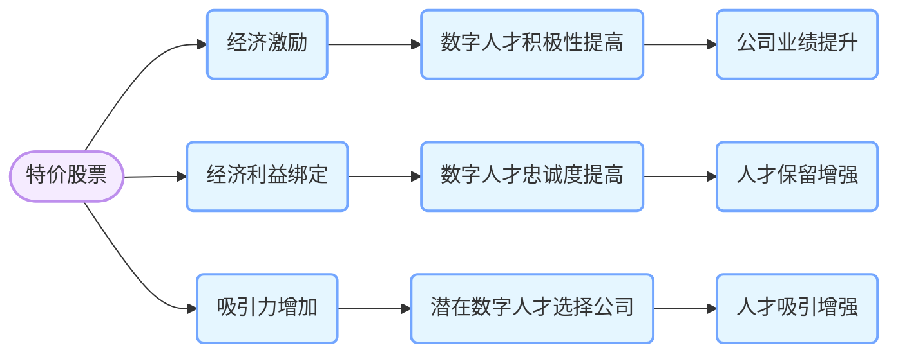

# 特价股票与公司数字人才吸引与保留能力的关系探讨

> 关键词：特价股票、数字人才、人才吸引、人才保留、公司竞争力

> 摘要：本文深入探讨了特价股票与公司数字人才吸引和保留能力之间的关系。首先介绍了研究的背景、目的、预期读者等内容，接着阐述了相关核心概念及其联系，分析了特价股票影响数字人才吸引与保留的核心算法原理及具体操作步骤，通过数学模型和公式进行了理论支撑，并结合实际案例进行详细说明。在项目实战部分，展示了开发环境搭建、源代码实现与解读。还探讨了该关系在实际中的应用场景，推荐了相关的学习资源、开发工具和论文著作。最后总结了未来发展趋势与挑战，解答了常见问题并提供了扩展阅读与参考资料，旨在为企业在数字人才管理方面提供有价值的见解和策略。

## 1. 背景介绍 
### 1.1 目的和范围
在当今数字化时代，数字人才成为企业发展的核心驱动力。企业面临着激烈的人才竞争，如何吸引和保留优秀的数字人才是众多企业关注的焦点。特价股票作为一种激励手段，在企业的人才管理中逐渐受到重视。本研究的目的在于深入探讨特价股票与公司数字人才吸引和保留能力之间的关系，分析特价股票对数字人才的吸引力以及如何影响他们在公司的长期留存。研究范围涵盖了不同行业、不同规模的企业，旨在为各类企业提供具有普遍适用性的参考和建议。

### 1.2 预期读者
本文的预期读者主要包括企业的人力资源管理者、高层管理人员、财务人员以及对数字人才管理和股权激励感兴趣的研究者。人力资源管理者可以从本文中获取关于特价股票在人才吸引和保留方面的策略和方法；高层管理人员能够了解特价股票对企业发展战略的影响；财务人员可以学习到特价股票的成本核算和财务处理；研究者则可以获得相关的理论和实证研究素材。

### 1.3 文档结构概述
本文将按照以下结构展开：首先介绍背景信息，包括研究目的、预期读者和文档结构概述等；接着阐述相关的核心概念及其联系，通过文本示意图和 Mermaid 流程图进行直观展示；然后分析特价股票影响数字人才吸引与保留的核心算法原理，并给出具体操作步骤，同时使用 Python 源代码进行详细阐述；之后通过数学模型和公式对该关系进行理论分析，并举例说明；在项目实战部分，介绍开发环境搭建、源代码实现和代码解读；探讨该关系在实际中的应用场景；推荐相关的学习资源、开发工具和论文著作；最后总结未来发展趋势与挑战，解答常见问题并提供扩展阅读与参考资料。

### 1.4 术语表
#### 1.4.1 核心术语定义
- **特价股票**：指公司以低于市场价格的方式向员工发售的股票，通常作为一种激励手段，旨在吸引和留住优秀人才。
- **数字人才**：具备数字化技能和知识，能够在数字化领域从事技术研发、数据分析、数字营销等工作的专业人才。
- **人才吸引**：企业通过各种手段和策略，将潜在的优秀人才吸引到企业中来的过程。
- **人才保留**：企业采取措施，使已经入职的优秀人才长期留在企业，为企业的发展做出贡献。

#### 1.4.2 相关概念解释
- **股权激励**：企业以股权为基础，对员工进行激励的一种方式，包括股票期权、限制性股票等多种形式。特价股票是股权激励的一种特殊形式。
- **数字转型**：企业利用数字技术对业务模式、运营流程等进行全面改造和升级的过程，数字人才是企业数字转型的关键力量。

#### 1.4.3 缩略词列表
- **HR**：人力资源（Human Resources）
- **CEO**：首席执行官（Chief Executive Officer）
- **CFO**：首席财务官（Chief Financial Officer）

## 2. 核心概念与联系 

### 核心概念原理
特价股票作为一种激励工具，其核心原理在于通过给予数字人才经济上的利益，使其与公司的利益紧密绑定。数字人才在获得特价股票后，成为公司的股东之一，他们的个人利益与公司的长期发展息息相关。当公司业绩提升、股价上涨时，数字人才持有的特价股票价值也会相应增加，从而获得经济回报。这种经济激励机制能够激发数字人才的工作积极性和创造力，提高他们对公司的忠诚度。

公司的数字人才吸引与保留能力则取决于多种因素，包括公司的品牌形象、发展前景、企业文化、薪酬福利等。特价股票作为薪酬福利的一部分，能够在一定程度上增强公司对数字人才的吸引力。对于潜在的数字人才来说，特价股票是一种具有吸引力的经济激励，能够使他们在选择工作时更倾向于该公司。对于已经入职的数字人才，特价股票能够增加他们的离职成本，因为一旦离职，他们可能会失去持有的特价股票所带来的潜在收益，从而提高他们的留存率。

### 架构的文本示意图
特价股票与公司数字人才吸引和保留能力之间的关系可以用以下文本示意图表示：

特价股票 -> 经济激励 -> 数字人才积极性提高 -> 公司业绩提升
特价股票 -> 经济利益绑定 -> 数字人才忠诚度提高 -> 人才保留增强
特价股票 -> 吸引力增加 -> 潜在数字人才选择公司 -> 人才吸引增强

### Mermaid 流程图


## 3. 核心算法原理 & 具体操作步骤 

### 核心算法原理
我们可以通过建立一个简单的数学模型来分析特价股票对数字人才吸引和保留的影响。假设数字人才的决策受到经济收益和工作满意度两个因素的影响。经济收益主要来自于特价股票的潜在价值，工作满意度则受到公司的文化、发展前景等因素的影响。

设数字人才对公司的综合评价指标为 $S$，经济收益为 $E$，工作满意度为 $W$，则有：

$S = \alpha E + \beta W$

其中，$\alpha$ 和 $\beta$ 分别为经济收益和工作满意度的权重系数，且 $\alpha + \beta = 1$。

经济收益 $E$ 可以表示为特价股票的预期价值，假设特价股票的购买价格为 $P_0$，市场价格为 $P_1$，持有数量为 $n$，则：

$E = n(P_1 - P_0)$

工作满意度 $W$ 可以通过问卷调查等方式进行量化，取值范围为 $[0, 1]$。

### 具体操作步骤
#### 步骤 1：确定特价股票的发行方案
公司需要根据自身的财务状况、发展战略和人才需求，确定特价股票的发行价格、数量、发行对象等。发行价格通常要低于市场价格，以体现激励效果。发行对象主要为数字人才，包括技术研发人员、数据分析人员等。

#### 步骤 2：评估数字人才的工作满意度
通过问卷调查、面谈等方式，了解数字人才对公司的工作满意度。根据调查结果，调整工作满意度的权重系数 $\beta$。

#### 步骤 3：计算数字人才的综合评价指标
根据上述公式，计算数字人才对公司的综合评价指标 $S$。如果 $S$ 较高，则说明特价股票对数字人才的吸引力较大，有利于人才的吸引和保留。

#### 步骤 4：动态调整特价股票方案
根据数字人才的反馈和公司的实际情况，动态调整特价股票的发行方案。例如，如果发现数字人才对特价股票的兴趣不高，可以适当降低发行价格或增加发行数量。

### Python 源代码实现
```python
# 定义计算综合评价指标的函数
def calculate_comprehensive_score(alpha, beta, n, P0, P1, W):
    # 计算经济收益
    E = n * (P1 - P0)
    # 计算综合评价指标
    S = alpha * E + beta * W
    return S

# 示例参数
alpha = 0.6  # 经济收益的权重系数
beta = 0.4  # 工作满意度的权重系数
n = 1000  # 特价股票的持有数量
P0 = 50  # 特价股票的购买价格
P1 = 80  # 市场价格
W = 0.8  # 工作满意度

# 计算综合评价指标
S = calculate_comprehensive_score(alpha, beta, n, P0, P1, W)
print(f"数字人才的综合评价指标 S: {S}")
```

## 4. 数学模型和公式 & 详细讲解 & 举例说明 

### 数学模型和公式
我们在前面已经介绍了数字人才对公司的综合评价指标 $S$ 的计算公式：

$S = \alpha E + \beta W$

其中，$\alpha$ 和 $\beta$ 分别为经济收益和工作满意度的权重系数，且 $\alpha + \beta = 1$。经济收益 $E$ 的计算公式为：

$E = n(P_1 - P_0)$

### 详细讲解
- **综合评价指标 $S$**：该指标反映了数字人才对公司的整体评价，综合考虑了经济收益和工作满意度两个因素。$S$ 值越高，说明数字人才对公司的评价越好，越有可能被吸引到公司并长期留在公司。
- **经济收益 $E$**：经济收益主要来自于特价股票的潜在价值。数字人才通过购买特价股票，在市场价格高于购买价格时，可以获得差价收益。$n$ 表示持有特价股票的数量，$P_0$ 表示购买价格，$P_1$ 表示市场价格。
- **权重系数 $\alpha$ 和 $\beta$**：$\alpha$ 和 $\beta$ 分别表示经济收益和工作满意度在综合评价指标中的重要程度。不同的公司和数字人才可能对经济收益和工作满意度的重视程度不同，因此 $\alpha$ 和 $\beta$ 的取值也会有所差异。

### 举例说明
假设一家科技公司计划向数字人才发行特价股票。特价股票的购买价格 $P_0$ 为 50 元，市场价格 $P_1$ 为 80 元，数字人才持有数量 $n$ 为 1000 股。通过问卷调查得知，数字人才的工作满意度 $W$ 为 0.8。经济收益的权重系数 $\alpha$ 为 0.6，工作满意度的权重系数 $\beta$ 为 0.4。

首先，计算经济收益 $E$：

$E = n(P_1 - P_0) = 1000\times(80 - 50) = 30000$（元）

然后，计算综合评价指标 $S$：

$S = \alpha E + \beta W = 0.6\times30000 + 0.4\times0.8 = 18000 + 0.32 = 18000.32$

通过计算结果可以看出，该数字人才对公司的综合评价指标较高，说明特价股票对他具有一定的吸引力，有利于公司吸引和保留该数字人才。

## 5. 项目实战：代码实际案例和详细解释说明 

### 5.1  开发环境搭建
#### 操作系统
本项目可以在 Windows、Linux 或 macOS 等操作系统上进行开发。建议使用较新的操作系统版本，以确保兼容性和稳定性。

#### Python 环境
安装 Python 3.x 版本，可以从 Python 官方网站（https://www.python.org/downloads/）下载并安装。安装完成后，确保将 Python 解释器的路径添加到系统环境变量中，以便在命令行中可以直接使用 Python 命令。

#### 开发工具
可以使用 PyCharm、Visual Studio Code 等集成开发环境（IDE）进行开发。这些 IDE 提供了丰富的功能，如代码编辑、调试、版本控制等，能够提高开发效率。

### 5.2  源代码详细实现和代码解读
以下是一个完整的 Python 代码示例，用于模拟特价股票对数字人才吸引和保留的影响：

```python
import random

# 定义计算综合评价指标的函数
def calculate_comprehensive_score(alpha, beta, n, P0, P1, W):
    # 计算经济收益
    E = n * (P1 - P0)
    # 计算综合评价指标
    S = alpha * E + beta * W
    return S

# 定义模拟数字人才决策的函数
def simulate_talent_decision(num_talents, alpha, beta, P0, P1_range, W_range, n):
    decisions = []
    for _ in range(num_talents):
        # 随机生成市场价格和工作满意度
        P1 = random.uniform(*P1_range)
        W = random.uniform(*W_range)
        # 计算综合评价指标
        S = calculate_comprehensive_score(alpha, beta, n, P0, P1, W)
        # 根据综合评价指标做出决策
        if S > 15000:
            decision = "加入并留下"
        elif S > 10000:
            decision = "考虑加入"
        else:
            decision = "不考虑"
        decisions.append(decision)
    return decisions

# 示例参数
alpha = 0.6  # 经济收益的权重系数
beta = 0.4  # 工作满意度的权重系数
P0 = 50  # 特价股票的购买价格
P1_range = (60, 100)  # 市场价格的范围
W_range = (0.5, 0.9)  # 工作满意度的范围
n = 1000  # 特价股票的持有数量
num_talents = 10  # 模拟的数字人才数量

# 模拟数字人才的决策
decisions = simulate_talent_decision(num_talents, alpha, beta, P0, P1_range, W_range, n)

# 输出结果
for i, decision in enumerate(decisions):
    print(f"数字人才 {i + 1} 的决策: {decision}")
```

### 代码解读与分析
- **calculate_comprehensive_score 函数**：该函数用于计算数字人才对公司的综合评价指标 $S$。它接受经济收益的权重系数 $\alpha$、工作满意度的权重系数 $\beta$、特价股票的持有数量 $n$、购买价格 $P_0$、市场价格 $P_1$ 和工作满意度 $W$ 作为参数，返回综合评价指标 $S$。
- **simulate_talent_decision 函数**：该函数用于模拟多个数字人才的决策过程。它接受模拟的数字人才数量 $num\_talents$、经济收益的权重系数 $\alpha$、工作满意度的权重系数 $\beta$、特价股票的购买价格 $P_0$、市场价格的范围 $P_1\_range$、工作满意度的范围 $W\_range$ 和特价股票的持有数量 $n$ 作为参数。在函数内部，通过随机生成市场价格和工作满意度，计算每个数字人才的综合评价指标 $S$，并根据 $S$ 的值做出决策。
- **主程序**：在主程序中，我们设置了示例参数，调用 $simulate\_talent\_decision$ 函数模拟 10 个数字人才的决策，并输出每个数字人才的决策结果。

通过这个代码示例，我们可以直观地看到特价股票对数字人才决策的影响。不同的市场价格和工作满意度会导致数字人才做出不同的决策，从而为企业制定特价股票发行方案提供参考。

## 6. 实际应用场景 
### 初创企业吸引数字人才
对于初创企业来说，资金相对有限，难以提供高额的薪酬和福利。特价股票作为一种激励手段，可以在不增加过多成本的情况下，吸引优秀的数字人才。初创企业的发展前景具有较大的不确定性，但如果能够给予数字人才一定数量的特价股票，让他们分享企业未来的成长收益，会增加企业对数字人才的吸引力。例如，一家专注于人工智能技术研发的初创企业，通过向数字人才发行特价股票，吸引了一批具有丰富经验的技术人员加入，为企业的发展奠定了坚实的基础。

### 传统企业数字转型过程中保留数字人才
传统企业在进行数字转型时，需要大量的数字人才来推动转型的顺利进行。然而，传统企业的薪酬体系和激励机制可能无法满足数字人才的需求，导致数字人才的流失。特价股票可以作为一种有效的保留手段，让数字人才与企业的数字转型成果紧密绑定。例如，一家制造业企业在进行数字化改造时，向参与转型项目的数字人才发行特价股票，激励他们积极投入工作，提高了数字人才的留存率，确保了数字转型项目的顺利实施。

### 科技企业提升团队凝聚力
科技企业的竞争主要是人才的竞争，拥有一支稳定、高效的数字人才团队是企业成功的关键。特价股票可以增强数字人才对企业的归属感和忠诚度，提高团队的凝聚力。当数字人才持有公司的特价股票时，他们会更加关注公司的整体利益，积极与团队成员合作，共同推动公司的发展。例如，一家互联网科技公司通过实施特价股票激励计划，团队成员之间的协作更加紧密，创新能力得到了显著提升，公司的业绩也取得了长足的进步。

## 7. 工具和资源推荐
### 7.1 学习资源推荐
#### 7.1.1 书籍推荐
- 《股权激励：企业成功的关键》：本书详细介绍了股权激励的理论和实践，包括特价股票等多种激励方式，为企业实施股权激励提供了全面的指导。
- 《数字人才管理：打造企业数字化竞争力》：探讨了数字人才的特点、需求和管理策略，对于企业吸引和保留数字人才具有重要的参考价值。
- 《公司金融》：涵盖了公司融资、投资、股权激励等方面的知识，有助于深入理解特价股票的财务原理和应用。

#### 7.1.2 在线课程
- Coursera 平台上的“股权激励与公司治理”课程：由知名商学院教授授课，系统讲解了股权激励的设计、实施和评估等内容。
- edX 平台上的“数字人才战略与管理”课程：聚焦于数字时代的人才管理问题，提供了实用的数字人才吸引和保留策略。

#### 7.1.3 技术博客和网站
- 36氪：关注科技行业的最新动态和创新模式，经常发布关于数字人才和股权激励的深度报道和分析文章。
- 虎嗅网：提供了丰富的商业资讯和管理经验分享，对于企业在数字人才管理和特价股票应用方面具有一定的启发作用。

### 7.2 开发工具框架推荐
#### 7.2.1 IDE和编辑器
- PyCharm：一款专业的 Python 集成开发环境，具有代码智能提示、调试、版本控制等强大功能，适合开发与特价股票和数字人才管理相关的 Python 程序。
- Visual Studio Code：一款轻量级的代码编辑器，支持多种编程语言和插件扩展，可用于开发和调试各类项目。

#### 7.2.2 调试和性能分析工具
- PDB：Python 自带的调试器，可以帮助开发者定位和解决代码中的问题。
- cProfile：Python 的性能分析工具，用于分析代码的执行时间和资源消耗情况，优化代码性能。

#### 7.2.3 相关框架和库
- Pandas：用于数据处理和分析的 Python 库，可以对特价股票数据和数字人才信息进行高效处理和分析。
- NumPy：提供了高效的数值计算功能，可用于实现特价股票相关的数学模型和算法。

### 7.3 相关论文著作推荐
#### 7.3.1 经典论文
- 《股权激励与企业绩效：基于中国上市公司的实证研究》：通过对中国上市公司的数据分析，探讨了股权激励对企业绩效的影响，为特价股票的应用提供了实证依据。
- 《数字人才流动与企业创新能力提升》：研究了数字人才的流动规律和对企业创新能力的影响，对于企业吸引和保留数字人才具有重要的理论指导意义。

#### 7.3.2 最新研究成果
- 《人工智能时代的数字人才管理策略研究》：关注人工智能时代数字人才的特点和需求，提出了相应的管理策略，为企业在新的技术环境下吸引和保留数字人才提供了新思路。
- 《特价股票激励机制的设计与优化研究》：深入探讨了特价股票激励机制的设计原则和优化方法，有助于企业提高特价股票的激励效果。

#### 7.3.3 应用案例分析
- 《XX 公司特价股票激励计划的实施与效果评估》：通过实际案例分析，展示了某公司实施特价股票激励计划的具体过程和取得的效果，为其他企业提供了可借鉴的经验。

## 8. 总结：未来发展趋势与挑战
### 未来发展趋势
- **个性化激励方案**：随着数字人才的需求和期望日益多样化，企业将更加注重为不同类型的数字人才制定个性化的特价股票激励方案。根据数字人才的技能水平、岗位重要性、职业发展阶段等因素，设计不同的股票发行价格、数量和解锁条件，以提高激励的针对性和有效性。
- **与其他激励方式结合**：特价股票将与其他激励方式，如现金奖励、晋升机会、培训发展等相结合，形成更加全面、多元化的激励体系。通过综合运用多种激励手段，满足数字人才不同方面的需求，进一步增强企业对数字人才的吸引力和保留能力。
- **数字化管理平台**：利用数字化技术，建立专门的股权激励管理平台，实现特价股票的发行、管理、交易等全流程的数字化。数字化管理平台可以提高管理效率，降低管理成本，同时为数字人才提供更加便捷、透明的参与体验。

### 挑战
- **法律法规限制**：特价股票的发行和交易受到相关法律法规的严格限制。企业在实施特价股票激励计划时，需要确保符合法律法规的要求，避免法律风险。随着法律法规的不断变化和完善，企业需要及时调整激励方案，以适应新的监管环境。
- **市场波动风险**：特价股票的价值与市场行情密切相关。市场波动可能导致特价股票的价格大幅波动，从而影响数字人才的收益预期。如果市场行情不佳，特价股票的价值下降，可能会降低数字人才对激励计划的满意度，甚至影响他们的工作积极性和留存率。
- **公平性问题**：在特价股票的发行过程中，如何确保公平性是一个重要的挑战。不同部门、不同岗位的数字人才对企业的贡献程度不同，如何合理分配特价股票，避免出现不公平现象，是企业需要解决的问题。如果公平性得不到保障，可能会引发数字人才之间的矛盾和不满，影响团队的凝聚力和工作效率。

## 9. 附录：常见问题与解答
### 问题 1：特价股票的发行价格如何确定？
解答：特价股票的发行价格通常要低于市场价格，以体现激励效果。具体的发行价格可以根据公司的财务状况、发展前景、市场行情等因素来确定。一般来说，可以参考同行业类似公司的股权激励方案，结合公司自身的实际情况进行调整。

### 问题 2：数字人才持有特价股票有哪些限制条件？
解答：数字人才持有特价股票通常会有一些限制条件，如锁定期、业绩考核等。锁定期是指数字人才在一定期限内不能出售持有的特价股票，以确保他们与公司的利益长期绑定。业绩考核则要求数字人才在一定时期内达到一定的业绩目标，才能解锁和出售特价股票。

### 问题 3：特价股票激励计划对公司的财务状况有什么影响？
解答：特价股票激励计划会对公司的财务状况产生一定的影响。一方面，发行特价股票会增加公司的股本，可能会稀释原有股东的股权。另一方面，公司需要承担一定的股权激励成本，如股票的公允价值计量等，这会对公司的利润产生一定的影响。但是，从长期来看，如果特价股票激励计划能够有效地吸引和保留数字人才，提高公司的业绩，那么对公司的财务状况是有利的。

### 问题 4：如何评估特价股票激励计划的效果？
解答：可以从多个方面评估特价股票激励计划的效果，如数字人才的吸引和保留情况、公司的业绩表现、员工的满意度等。通过对比激励计划实施前后的相关指标，分析激励计划对公司的影响。同时，还可以收集数字人才的反馈意见，了解他们对激励计划的看法和建议，以便对激励计划进行优化和改进。

## 10. 扩展阅读 & 参考资料
### 扩展阅读
- 《人力资源管理前沿》：该杂志关注人力资源管理领域的最新研究成果和实践经验，对于深入了解数字人才管理和股权激励具有重要的参考价值。
- 《商业评论》：提供了丰富的商业案例和管理思想，有助于企业管理者拓宽视野，学习先进的管理理念和方法。

### 参考资料
- 《中华人民共和国公司法》
- 《上市公司股权激励管理办法》
- 各公司的年度报告和股权激励计划公告

通过以上文章，我们对特价股票与公司数字人才吸引和保留能力的关系进行了全面、深入的探讨。希望本文能够为企业在数字人才管理方面提供有益的参考和指导，帮助企业制定更加有效的特价股票激励计划，提高企业的竞争力。