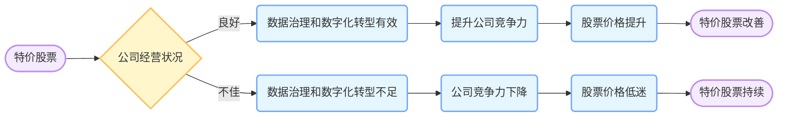

# 特价股票与公司数据治理与数字化转型协同性的关系分析

> 关键词：特价股票、公司数据治理、数字化转型、协同性、关系分析

> 摘要：本文旨在深入剖析特价股票与公司数据治理及数字化转型之间的协同性关系。通过对相关核心概念的阐述，详细讲解核心算法原理、数学模型和公式，并结合实际项目案例进行分析，探讨了特价股票与公司数据治理和数字化转型在实际应用场景中的相互作用。同时，推荐了学习、开发工具等相关资源，最后总结了未来发展趋势与挑战，并解答常见问题。研究特价股票与公司数据治理和数字化转型的协同性，有助于企业更好地进行战略决策，提升市场竞争力。

## 1. 背景介绍 
### 1.1 目的和范围
本研究的目的是全面分析特价股票与公司数据治理和数字化转型之间的协同性关系。在当今数字化快速发展的时代，公司的数字化转型和数据治理成为提升竞争力的关键因素，而特价股票的表现也受到多种因素的影响。通过研究它们之间的协同性，能够为企业管理者、投资者等提供有价值的决策参考。

研究范围涵盖了不同行业、不同规模公司的特价股票情况，以及公司在数据治理和数字化转型方面的实践和成果。同时，考虑了宏观经济环境、行业发展趋势等因素对这种协同性关系的影响。

### 1.2 预期读者
本文的预期读者包括企业管理者，他们可以通过了解这种协同性关系，更好地制定公司的数据治理和数字化转型战略，提升公司的市场价值和竞争力；投资者，他们可以借助研究结果，更准确地评估特价股票的投资价值；以及对该领域感兴趣的研究人员，为他们的学术研究提供参考。

### 1.3 文档结构概述
本文将按照以下结构进行阐述：首先介绍相关核心概念和它们之间的联系，包括用文本示意图和 Mermaid 流程图展示；接着详细讲解核心算法原理和具体操作步骤，并使用 Python 源代码进行说明；然后介绍相关的数学模型和公式，并举例说明；之后通过项目实战案例，包括开发环境搭建、源代码实现和解读等进行分析；再探讨实际应用场景；推荐相关的工具和资源；最后总结未来发展趋势与挑战，解答常见问题，并列出扩展阅读和参考资料。

### 1.4 术语表
#### 1.4.1 核心术语定义
- **特价股票**：指在股票市场中，价格相对其内在价值或同行业其他股票价格较低的股票。这种低价可能是由于市场短期波动、公司短期困境等原因导致。
- **公司数据治理**：是指公司为了确保数据的质量、安全性、合规性和有效利用，制定的一系列政策、流程和标准。通过数据治理，公司能够更好地管理和利用数据资源，支持业务决策。
- **数字化转型**：指公司利用数字技术对业务流程、商业模式、组织架构等进行全面变革和升级的过程。数字化转型能够提高公司的运营效率、创新能力和市场竞争力。

#### 1.4.2 相关概念解释
- **数据质量**：包括数据的准确性、完整性、一致性、及时性等方面。高质量的数据是公司进行有效决策和业务运营的基础。
- **数据安全**：指保护公司数据免受未经授权的访问、使用、披露、破坏等威胁。数据安全是数据治理的重要组成部分。
- **商业模式创新**：在数字化转型过程中，公司通过利用数字技术，创造新的商业模式，以满足市场需求和提升竞争力。

#### 1.4.3 缩略词列表
- **AI**：Artificial Intelligence，人工智能
- **BI**：Business Intelligence，商业智能
- **ETL**：Extract, Transform, Load，数据抽取、转换和加载

## 2. 核心概念与联系 

### 核心概念原理
#### 特价股票原理
特价股票的形成通常与市场的非理性因素和公司的短期状况有关。市场上的投资者情绪、宏观经济环境的短期波动等可能导致股票价格偏离其内在价值。例如，当市场出现恐慌性抛售时，一些基本面良好的公司股票也可能被过度抛售，从而形成特价股票。

#### 公司数据治理原理
公司数据治理的核心原理是通过建立一套完善的体系，确保数据在整个生命周期内的质量和安全。这包括数据的采集、存储、处理、分析和共享等环节。通过制定数据标准和规范，明确数据的所有权和管理责任，保证数据的一致性和准确性。

#### 数字化转型原理
数字化转型是利用数字技术对公司的业务进行全方位的改造。其原理是通过引入新技术，如人工智能、大数据、云计算等，提高公司的运营效率、创新能力和客户体验。例如，利用大数据分析客户需求，实现精准营销；利用人工智能优化生产流程，提高生产效率。

### 架构的文本示意图
特价股票、公司数据治理和数字化转型之间存在着复杂的相互关系。公司的数据治理和数字化转型状况会影响公司的经营业绩和市场形象，进而影响股票价格。如果公司能够有效地进行数据治理和数字化转型，提升了自身的竞争力和盈利能力，那么其股票价格可能会得到提升，特价股票的情况可能会得到改善。

反之，特价股票的市场表现也可能反映公司在数据治理和数字化转型方面的问题。如果公司的股票长期处于特价状态，可能意味着公司在数据利用和业务创新方面存在不足，需要加强数据治理和数字化转型。

### Mermaid 流程图


## 3. 核心算法原理 & 具体操作步骤 

### 核心算法原理
为了分析特价股票与公司数据治理和数字化转型的协同性，我们可以采用机器学习中的回归分析算法。回归分析可以建立特价股票价格与公司数据治理和数字化转型相关指标之间的数学关系。

具体来说，我们可以将特价股票价格作为因变量 $y$，公司数据治理和数字化转型的相关指标作为自变量 $x_1, x_2, \cdots, x_n$。假设它们之间存在线性关系，则回归方程可以表示为：

$y = \beta_0 + \beta_1x_1 + \beta_2x_2 + \cdots + \beta_nx_n + \epsilon$

其中，$\beta_0$ 是截距，$\beta_1, \beta_2, \cdots, \beta_n$ 是回归系数，$\epsilon$ 是误差项。

### 具体操作步骤
#### 步骤 1：数据收集
收集特价股票的价格数据，以及公司数据治理和数字化转型的相关指标数据。公司数据治理指标可以包括数据质量评估得分、数据安全措施得分等；数字化转型指标可以包括数字化业务收入占比、数字化技术投入等。

#### 步骤 2：数据预处理
对收集到的数据进行清洗、转换和归一化处理。清洗数据可以去除缺失值、异常值等；转换数据可以将非数值型数据转换为数值型数据；归一化处理可以将不同范围的数据统一到相同的尺度上。

#### 步骤 3：模型训练
使用训练数据集对回归模型进行训练，通过最小化误差项的平方和来估计回归系数 $\beta_0, \beta_1, \cdots, \beta_n$。

#### 步骤 4：模型评估
使用测试数据集对训练好的模型进行评估，常用的评估指标包括均方误差（MSE）、均方根误差（RMSE）、决定系数（$R^2$）等。

#### 步骤 5：结果分析
根据模型评估结果，分析特价股票价格与公司数据治理和数字化转型相关指标之间的关系。如果回归系数显著，则说明该指标对特价股票价格有重要影响。

### Python 源代码实现
```python
import pandas as pd
from sklearn.model_selection import train_test_split
from sklearn.linear_model import LinearRegression
from sklearn.metrics import mean_squared_error, r2_score

# 步骤 1：数据收集
# 假设我们已经将数据存储在 CSV 文件中
data = pd.read_csv('stock_data.csv')

# 步骤 2：数据预处理
# 去除缺失值
data = data.dropna()

# 分离自变量和因变量
X = data.drop('stock_price', axis=1)
y = data['stock_price']

# 划分训练集和测试集
X_train, X_test, y_train, y_test = train_test_split(X, y, test_size=0.2, random_state=42)

# 步骤 3：模型训练
model = LinearRegression()
model.fit(X_train, y_train)

# 步骤 4：模型评估
y_pred = model.predict(X_test)
mse = mean_squared_error(y_test, y_pred)
rmse = mse ** 0.5
r2 = r2_score(y_test, y_pred)

print(f"均方误差 (MSE): {mse}")
print(f"均方根误差 (RMSE): {rmse}")
print(f"决定系数 (R^2): {r2}")

# 步骤 5：结果分析
coefficients = pd.DataFrame({'特征': X.columns, '系数': model.coef_})
print(coefficients)
```

## 4. 数学模型和公式 & 详细讲解 & 举例说明 

### 数学模型
在上述回归分析中，我们使用的线性回归模型可以用以下数学公式表示：

$y = \beta_0 + \beta_1x_1 + \beta_2x_2 + \cdots + \beta_nx_n + \epsilon$

其中，$y$ 是因变量，即特价股票价格；$x_1, x_2, \cdots, x_n$ 是自变量，即公司数据治理和数字化转型的相关指标；$\beta_0$ 是截距，$\beta_1, \beta_2, \cdots, \beta_n$ 是回归系数，$\epsilon$ 是误差项。

### 详细讲解
#### 截距 $\beta_0$
截距 $\beta_0$ 表示当所有自变量都为 0 时，因变量 $y$ 的取值。在实际应用中，它可能没有实际的物理意义，但在数学模型中是必要的。

#### 回归系数 $\beta_i$
回归系数 $\beta_i$ 表示自变量 $x_i$ 对因变量 $y$ 的影响程度。如果 $\beta_i$ 为正，则说明 $x_i$ 增加时，$y$ 也会增加；如果 $\beta_i$ 为负，则说明 $x_i$ 增加时，$y$ 会减少。

#### 误差项 $\epsilon$
误差项 $\epsilon$ 表示模型无法解释的部分，它包含了各种随机因素和未考虑到的变量的影响。

### 举例说明
假设我们有以下数据：

| 特价股票价格 ($y$) | 数据质量评估得分 ($x_1$) | 数字化业务收入占比 ($x_2$) |
| --- | --- | --- |
| 10 | 80 | 20 |
| 12 | 85 | 25 |
| 15 | 90 | 30 |
| 18 | 95 | 35 |

我们使用上述数据对线性回归模型进行训练，得到回归方程为：

$y = 2 + 0.1x_1 + 0.2x_2$

这意味着当数据质量评估得分每增加 1 分，特价股票价格会增加 0.1 元；当数字化业务收入占比每增加 1%，特价股票价格会增加 0.2 元。截距 2 表示当数据质量评估得分和数字化业务收入占比都为 0 时，特价股票价格的理论值。

## 5. 项目实战：代码实际案例和详细解释说明 

### 5.1 开发环境搭建
#### 安装 Python
首先，需要安装 Python 环境。可以从 Python 官方网站（https://www.python.org/downloads/）下载适合自己操作系统的 Python 版本，并按照安装向导进行安装。

#### 安装必要的库
在安装好 Python 后，需要安装一些必要的库，如 Pandas、Scikit-learn 等。可以使用以下命令进行安装：

```sh
pip install pandas scikit-learn
```

### 5.2 源代码详细实现和代码解读
```python
import pandas as pd
from sklearn.model_selection import train_test_split
from sklearn.linear_model import LinearRegression
from sklearn.metrics import mean_squared_error, r2_score

# 步骤 1：数据收集
# 假设我们已经将数据存储在 CSV 文件中
data = pd.read_csv('stock_data.csv')

# 步骤 2：数据预处理
# 去除缺失值
data = data.dropna()

# 分离自变量和因变量
X = data.drop('stock_price', axis=1)
y = data['stock_price']

# 划分训练集和测试集
X_train, X_test, y_train, y_test = train_test_split(X, y, test_size=0.2, random_state=42)

# 步骤 3：模型训练
model = LinearRegression()
model.fit(X_train, y_train)

# 步骤 4：模型评估
y_pred = model.predict(X_test)
mse = mean_squared_error(y_test, y_pred)
rmse = mse ** 0.5
r2 = r2_score(y_test, y_pred)

print(f"均方误差 (MSE): {mse}")
print(f"均方根误差 (RMSE): {rmse}")
print(f"决定系数 (R^2): {r2}")

# 步骤 5：结果分析
coefficients = pd.DataFrame({'特征': X.columns, '系数': model.coef_})
print(coefficients)
```

#### 代码解读
1. **数据收集**：使用 Pandas 的 `read_csv` 函数从 CSV 文件中读取数据。
2. **数据预处理**：使用 `dropna` 函数去除数据中的缺失值。然后使用 `drop` 函数分离自变量和因变量。
3. **划分训练集和测试集**：使用 `train_test_split` 函数将数据划分为训练集和测试集，其中测试集占比为 20%。
4. **模型训练**：创建一个线性回归模型对象 `LinearRegression`，并使用 `fit` 方法对模型进行训练。
5. **模型评估**：使用训练好的模型对测试集进行预测，然后计算均方误差（MSE）、均方根误差（RMSE）和决定系数（$R^2$）。
6. **结果分析**：将回归系数存储在 DataFrame 中，并打印出来，以便分析每个自变量对因变量的影响程度。

### 5.3 代码解读与分析
#### 均方误差（MSE）
均方误差是预测值与真实值之间误差的平方的平均值。MSE 越小，说明模型的预测效果越好。

#### 均方根误差（RMSE）
均方根误差是均方误差的平方根。RMSE 与因变量的单位相同，更直观地反映了模型的预测误差。

#### 决定系数（$R^2$）
决定系数表示模型对数据的拟合程度，取值范围在 0 到 1 之间。$R^2$ 越接近 1，说明模型对数据的拟合效果越好。

#### 回归系数分析
通过分析回归系数，可以了解每个自变量对因变量的影响程度。如果回归系数为正，则说明该自变量与因变量呈正相关；如果回归系数为负，则说明该自变量与因变量呈负相关。

## 6. 实际应用场景 
### 企业战略决策
企业管理者可以通过分析特价股票与公司数据治理和数字化转型的协同性，制定合理的战略决策。如果发现数据治理和数字化转型的相关指标对特价股票价格有显著影响，企业可以加大在这方面的投入，提升公司的竞争力和市场价值。

### 投资者投资决策
投资者可以利用这种协同性关系，评估特价股票的投资价值。如果公司在数据治理和数字化转型方面表现良好，但股票价格处于特价状态，那么该股票可能具有较大的投资潜力。

### 行业研究
研究人员可以通过对不同行业的特价股票与公司数据治理和数字化转型的协同性进行研究，了解行业的发展趋势和特点。这有助于发现行业的潜在机会和挑战，为行业的发展提供参考。

## 7. 工具和资源推荐
### 7.1 学习资源推荐
#### 7.1.1 书籍推荐
- 《数据治理：概念、战略与实施》：详细介绍了数据治理的概念、方法和实践，帮助读者深入了解数据治理的重要性和实施步骤。
- 《数字化转型：企业的必修课》：探讨了企业数字化转型的战略、方法和案例，为企业管理者提供了数字化转型的思路和指导。
- 《机器学习实战》：通过实际案例介绍了机器学习的算法和应用，适合初学者学习机器学习知识。

#### 7.1.2 在线课程
- Coursera 上的“数据治理与管理”课程：由知名高校的教授授课，系统地介绍了数据治理的理论和实践。
- edX 上的“数字化转型战略”课程：帮助学员了解数字化转型的战略规划和实施方法。
- Kaggle 上的机器学习微课程：提供了丰富的机器学习实践项目和教程，适合有一定基础的学习者提高实践能力。

#### 7.1.3 技术博客和网站
- 数据观（https://www.dataview.cn/）：提供了大量的数据治理和数据分析的文章和案例，有助于读者了解行业动态和最新技术。
- 数字化转型网（https://www.digitaltransformation.cn/）：专注于企业数字化转型的研究和报道，为企业管理者提供了丰富的转型经验和案例。
- Medium 上的机器学习和数据科学相关博客：有许多优秀的技术文章和案例分享，帮助读者拓宽技术视野。

### 7.2 开发工具框架推荐
#### 7.2.1 IDE和编辑器
- PyCharm：一款专业的 Python 集成开发环境，提供了丰富的代码编辑、调试和项目管理功能。
- Jupyter Notebook：一个交互式的编程环境，适合进行数据分析和机器学习实验。
- Visual Studio Code：一款轻量级的代码编辑器，支持多种编程语言和插件，具有良好的扩展性。

#### 7.2.2 调试和性能分析工具
- PDB：Python 自带的调试器，可以帮助开发者定位和解决代码中的问题。
- cProfile：Python 的性能分析工具，可以分析代码的运行时间和函数调用情况，帮助开发者优化代码性能。
- Scikit-learn 的交叉验证工具：可以帮助开发者评估模型的性能和稳定性，选择最优的模型参数。

#### 7.2.3 相关框架和库
- Pandas：一个强大的数据分析库，提供了高效的数据结构和数据处理方法，适合进行数据清洗、转换和分析。
- Scikit-learn：一个常用的机器学习库，提供了丰富的机器学习算法和工具，适合进行模型训练和评估。
- TensorFlow 和 PyTorch：深度学习框架，适合进行复杂的深度学习任务，如图像识别、自然语言处理等。

### 7.3 相关论文著作推荐
#### 7.3.1 经典论文
- “Data Governance: A Comprehensive Framework for Managing Data as a Strategic Asset”：提出了数据治理的综合框架，为数据治理的研究和实践提供了重要的理论基础。
- “The Digital Transformation of Business: A Strategic Perspective”：从战略角度探讨了企业数字化转型的重要性和方法，对企业数字化转型的研究具有重要的指导意义。
- “Machine Learning for Stock Price Prediction: A Review”：对机器学习在股票价格预测中的应用进行了综述，为相关研究提供了参考。

#### 7.3.2 最新研究成果
- 可以通过学术数据库，如 IEEE Xplore、ACM Digital Library、ScienceDirect 等，搜索关于特价股票、公司数据治理和数字化转型的最新研究论文。这些论文通常反映了该领域的最新研究动态和技术发展趋势。

#### 7.3.3 应用案例分析
- 一些商业咨询公司和行业研究机构会发布关于企业数据治理和数字化转型的应用案例分析报告。这些报告可以帮助读者了解实际企业在这些方面的实践经验和成功案例，为自己的项目提供参考。

## 8. 总结：未来发展趋势与挑战
### 未来发展趋势
#### 数据治理和数字化转型的深度融合
未来，公司的数据治理和数字化转型将更加紧密地结合在一起。数据治理将为数字化转型提供坚实的数据基础，而数字化转型将推动数据治理的不断创新和完善。

#### 人工智能和大数据技术的广泛应用
人工智能和大数据技术将在特价股票分析、公司数据治理和数字化转型中得到更广泛的应用。例如，利用人工智能算法对特价股票进行精准预测，利用大数据技术对公司的数据进行深度分析和挖掘。

#### 行业标准和规范的建立
随着数据治理和数字化转型的发展，行业将逐渐建立起统一的标准和规范。这将有助于提高企业之间的数据共享和互操作性，促进整个行业的健康发展。

### 挑战
#### 数据安全和隐私保护
在数据治理和数字化转型过程中，数据安全和隐私保护将面临更大的挑战。企业需要加强数据安全管理，采取有效的技术和管理措施，保护用户的隐私和数据安全。

#### 人才短缺
数据治理和数字化转型需要大量的专业人才，包括数据科学家、人工智能工程师、数字化转型专家等。目前，这类人才相对短缺，企业需要加大人才培养和引进的力度。

#### 技术更新换代快
人工智能和大数据技术发展迅速，技术更新换代快。企业需要不断学习和掌握新的技术，及时调整战略和业务模式，以适应市场的变化。

## 9. 附录：常见问题与解答
### 问题 1：特价股票一定是有投资价值的吗？
解答：不一定。特价股票的价格低可能是由于多种原因导致的，如公司基本面不佳、行业竞争激烈等。虽然公司数据治理和数字化转型可能会影响特价股票的投资价值，但不能仅仅根据股票价格低就判断其有投资价值。投资者还需要综合考虑公司的财务状况、行业前景等因素。

### 问题 2：数据治理和数字化转型对所有公司都适用吗？
解答：是的。在当今数字化时代，数据已经成为企业的重要资产，数据治理和数字化转型对于提高企业的竞争力和运营效率具有重要意义。无论是传统企业还是新兴企业，都可以通过数据治理和数字化转型实现业务的创新和升级。

### 问题 3：如何评估公司的数据治理和数字化转型效果？
解答：可以从多个方面进行评估。对于数据治理，可以评估数据质量、数据安全、数据合规等指标；对于数字化转型，可以评估数字化业务收入占比、数字化技术投入产出比、客户满意度等指标。同时，还可以通过与同行业其他公司进行对比，了解公司在数据治理和数字化转型方面的优势和不足。

## 10. 扩展阅读 & 参考资料
### 扩展阅读
- 《智能时代》：介绍了人工智能时代的发展趋势和影响，帮助读者了解未来科技发展的方向。
- 《大数据时代》：探讨了大数据对社会、经济和生活的影响，为读者提供了大数据应用的思路和方法。
- 《数字化生存》：提出了数字化时代的生存理念和方法，对企业和个人的数字化转型具有重要的启示作用。

### 参考资料
- 相关行业报告和统计数据，如证券交易所发布的股票市场报告、咨询公司发布的行业研究报告等。
- 学术论文和研究成果，如在学术数据库中搜索到的关于特价股票、公司数据治理和数字化转型的论文。
- 企业官方网站和公告，了解企业在数据治理和数字化转型方面的实践和成果。