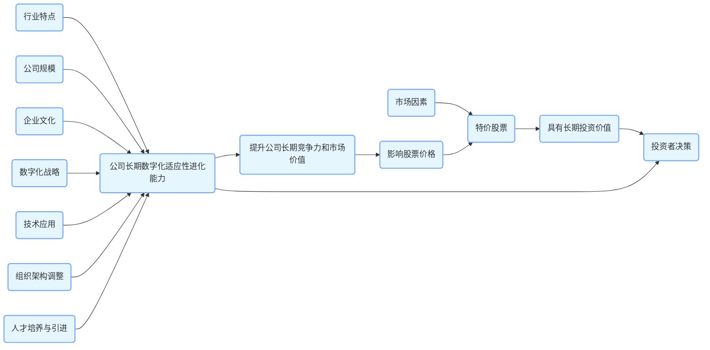

# 特价股票与公司长期数字化适应性进化能力的关联性研究

> 关键词：特价股票、公司数字化、适应性进化能力、关联性、股票估值、企业竞争力、长期发展

> 摘要：本文聚焦于特价股票与公司长期数字化适应性进化能力之间的关联性。通过对特价股票的定义、特征分析以及公司数字化适应性进化能力的内涵、影响因素探讨，运用多种理论和方法深入研究两者的关系。结合具体的数学模型和公式、Python 代码示例以及项目实战案例，阐述这种关联性在实际中的体现和应用。同时，分析其在不同实际场景中的应用情况，推荐相关学习资源、开发工具和论文著作，最后总结未来发展趋势与挑战，并对常见问题进行解答，旨在为投资者、企业管理者和相关研究人员提供全面深入的参考。

## 1. 背景介绍 
### 1.1 目的和范围
本研究的主要目的在于深入探究特价股票与公司长期数字化适应性进化能力之间的内在联系。通过对这一关联性的研究，为投资者提供更全面的投资决策依据，帮助他们在选择股票时不仅关注股票价格，还能考虑到公司的长期发展潜力。同时，也为企业管理者提供参考，促使他们重视公司的数字化适应性进化能力，以提升公司的市场竞争力和长期价值。

研究范围涵盖了不同行业的上市公司，分析特价股票的特征和公司数字化适应性进化能力的各个方面，包括数字化战略、技术应用、组织架构调整等。同时，研究还涉及到股票市场的相关理论和企业管理领域的数字化转型理论。

### 1.2 预期读者
本文预期读者包括股票投资者、金融分析师、企业管理者、学术研究人员以及对股票市场和企业数字化转型感兴趣的人士。投资者可以通过本文了解如何从公司数字化适应性进化能力的角度评估特价股票的投资价值；金融分析师可以将本文的研究成果应用到股票评级和投资建议中；企业管理者可以借鉴本文的观点，制定更有效的数字化转型战略；学术研究人员可以在本文的基础上开展进一步的理论和实证研究。

### 1.3 文档结构概述
本文首先介绍研究的背景、目的、预期读者和文档结构，然后对核心概念进行详细解释，包括特价股票和公司长期数字化适应性进化能力的定义、特征和联系。接着，阐述核心算法原理和具体操作步骤，通过 Python 代码进行详细说明。之后，介绍相关的数学模型和公式，并通过具体例子进行讲解。再通过项目实战案例，展示如何在实际中应用这些理论和方法。随后，分析实际应用场景，推荐相关的学习资源、开发工具和论文著作。最后，总结未来发展趋势与挑战，解答常见问题，并提供扩展阅读和参考资料。

### 1.4 术语表
#### 1.4.1 核心术语定义
- **特价股票**：指在股票市场中，价格相对其内在价值被低估的股票。这种低估可能是由于市场短期波动、投资者情绪等因素导致的。
- **公司长期数字化适应性进化能力**：指公司在长期发展过程中，能够适应数字化时代的变化，通过不断调整战略、技术应用、组织架构等方面，实现数字化转型和进化的能力。

#### 1.4.2 相关概念解释
- **股票内在价值**：是指股票未来预期现金流的现值，它反映了股票的真实价值。内在价值的评估通常需要考虑公司的财务状况、盈利能力、行业前景等因素。
- **数字化转型**：是指企业利用数字技术，对业务流程、商业模式、组织架构等进行全面的变革和创新，以提高企业的效率、竞争力和价值创造能力。

#### 1.4.3 缩略词列表
- **EPS**：Earnings Per Share，每股收益，是指公司净利润与发行在外普通股股数的比值，反映了每股股票的盈利水平。
- **ROE**：Return on Equity，净资产收益率，是指公司净利润与股东权益的比值，反映了股东权益的收益水平。

## 2. 核心概念与联系 

### 2.1 特价股票的特征与形成原因
特价股票通常具有以下特征：
- **低市盈率（P/E）**：市盈率是股票价格与每股收益的比值，低市盈率意味着股票价格相对较低，而公司的盈利水平相对较高。
- **低市净率（P/B）**：市净率是股票价格与每股净资产的比值，低市净率表示股票价格相对其净资产被低估。
- **高股息率**：股息率是股息与股票价格的比值，高股息率意味着投资者可以获得较高的股息收益。

特价股票的形成原因主要包括以下几个方面：
- **市场短期波动**：股票市场受到宏观经济环境、政策变化、投资者情绪等因素的影响，会出现短期的波动。在市场下跌时，一些优质公司的股票价格也可能会被过度压低，从而形成特价股票。
- **行业竞争压力**：某些行业可能面临激烈的竞争，导致公司的业绩暂时下滑，股票价格也随之下降。但如果公司具有较强的竞争力和发展潜力，其股票价格可能会被低估。
- **公司负面事件**：公司可能会因为一些负面事件，如财务造假、产品质量问题等，导致投资者对其信心下降，股票价格下跌。但如果这些负面事件是暂时的，公司能够及时采取措施解决问题，其股票价格可能会有回升的机会。

### 2.2 公司长期数字化适应性进化能力的内涵与影响因素
公司长期数字化适应性进化能力的内涵包括以下几个方面：
- **数字化战略**：公司需要制定明确的数字化战略，明确数字化转型的目标、路径和重点领域。数字化战略应该与公司的整体战略相匹配，以实现公司的长期发展目标。
- **技术应用**：公司需要积极应用数字技术，如人工智能、大数据、云计算、区块链等，提升公司的运营效率、创新能力和客户体验。
- **组织架构调整**：数字化转型需要公司对组织架构进行相应的调整，以适应数字技术的应用和业务模式的创新。公司需要建立灵活、高效的组织架构，加强部门之间的协作和沟通。
- **人才培养与引进**：公司需要培养和引进一批具有数字化技能和创新能力的人才，为数字化转型提供人才支持。

影响公司长期数字化适应性进化能力的因素主要包括以下几个方面：
- **行业特点**：不同行业的数字化程度和数字化转型的难度不同，对公司数字化适应性进化能力的要求也不同。例如，金融、科技等行业的数字化程度较高，对公司的数字化能力要求也较高；而传统制造业的数字化转型相对较慢，对公司的数字化能力要求也相对较低。
- **公司规模**：一般来说，大型公司具有更强的资源和实力，能够更好地推动数字化转型。但小型公司也可以通过创新和灵活的运营模式，实现快速的数字化转型。
- **企业文化**：企业文化对公司的数字化转型具有重要影响。具有创新、开放、包容等文化特点的公司，更容易推动数字化转型；而保守、封闭的企业文化则可能会阻碍数字化转型的进程。

### 2.3 特价股票与公司长期数字化适应性进化能力的联系
特价股票与公司长期数字化适应性进化能力之间存在着密切的联系。一方面，具有较强数字化适应性进化能力的公司，其长期发展潜力较大，未来的盈利水平和市场价值可能会不断提升。如果这些公司的股票价格由于市场短期波动等原因被低估，就可能成为特价股票。另一方面，投资者在选择特价股票时，如果能够关注公司的数字化适应性进化能力，就可以更好地评估公司的长期发展潜力，从而做出更明智的投资决策。

### 2.4 核心概念原理和架构的文本示意图
特价股票与公司长期数字化适应性进化能力的关系可以用以下文本示意图表示：

特价股票 <-- 市场短期波动、行业竞争压力、公司负面事件等因素导致价格低估 --> 具有长期投资价值
公司长期数字化适应性进化能力 <-- 数字化战略、技术应用、组织架构调整、人才培养与引进等因素支撑 --> 提升公司长期竞争力和市场价值
特价股票与公司长期数字化适应性进化能力 <-- 相互关联 --> 投资者可通过评估公司数字化能力选择有潜力的特价股票

### 2.5 Mermaid 流程图


## 3. 核心算法原理 & 具体操作步骤 

### 3.1 评估特价股票的算法原理
评估特价股票的常用方法是基于股票的内在价值进行评估。其中，最经典的方法是股息贴现模型（Dividend Discount Model，DDM）。该模型的基本思想是，股票的内在价值等于其未来股息的现值之和。

股息贴现模型的公式为：
$$V = \sum_{t=1}^{\infty} \frac{D_t}{(1 + r)^t}$$
其中，$V$ 表示股票的内在价值，$D_t$ 表示第 $t$ 期的股息，$r$ 表示贴现率。

在实际应用中，由于未来股息的预测存在不确定性，通常会采用简化的模型，如固定增长股息贴现模型（Gordon Growth Model）。该模型假设股息以固定的增长率 $g$ 增长，其公式为：
$$V = \frac{D_1}{r - g}$$
其中，$D_1$ 表示下一期的股息。

### 3.2 评估公司长期数字化适应性进化能力的算法原理
评估公司长期数字化适应性进化能力可以采用多指标综合评价法。具体步骤如下：
1. **确定评价指标体系**：根据公司长期数字化适应性进化能力的内涵，确定一系列评价指标，如数字化战略的明确性、技术应用的广度和深度、组织架构的灵活性、人才队伍的数字化技能水平等。
2. **确定指标权重**：采用专家打分法、层次分析法等方法，确定各个评价指标的权重。
3. **数据收集与处理**：收集公司的相关数据，对数据进行标准化处理，以消除不同指标之间的量纲差异。
4. **计算综合得分**：根据各个评价指标的得分和权重，计算公司的综合得分，得分越高表示公司的数字化适应性进化能力越强。

### 3.3 具体操作步骤及 Python 代码实现
#### 3.3.1 评估特价股票的 Python 代码实现
```python
def gordon_growth_model(D1, r, g):
    """
    固定增长股息贴现模型计算股票内在价值
    :param D1: 下一期的股息
    :param r: 贴现率
    :param g: 股息增长率
    :return: 股票内在价值
    """
    if r <= g:
        raise ValueError("贴现率必须大于股息增长率")
    return D1 / (r - g)

# 示例数据
D1 = 2  # 下一期股息为 2 元
r = 0.1  # 贴现率为 10%
g = 0.05  # 股息增长率为 5%

# 计算股票内在价值
intrinsic_value = gordon_growth_model(D1, r, g)
print(f"股票内在价值: {intrinsic_value} 元")
```

#### 3.3.2 评估公司长期数字化适应性进化能力的 Python 代码实现
```python
import numpy as np

# 评价指标得分
scores = np.array([80, 75, 85, 90])  # 假设四个评价指标的得分

# 指标权重
weights = np.array([0.2, 0.3, 0.25, 0.25])  # 假设四个评价指标的权重

# 计算综合得分
composite_score = np.dot(scores, weights)
print(f"公司数字化适应性进化能力综合得分: {composite_score}")
```

## 4. 数学模型和公式 & 详细讲解 & 举例说明 

### 4.1 股息贴现模型的详细讲解
股息贴现模型（DDM）是基于股票的基本价值理论，即股票的价值取决于其未来所能带来的现金流。在 DDM 中，现金流主要表现为股息。

#### 4.1.1 基本公式推导
假设股票的股息为 $D_1, D_2, \cdots, D_n$，贴现率为 $r$，则股票的内在价值 $V$ 为：
$$V = \frac{D_1}{1 + r} + \frac{D_2}{(1 + r)^2} + \cdots + \frac{D_n}{(1 + r)^n} + \frac{P_n}{(1 + r)^n}$$
其中，$P_n$ 表示第 $n$ 期的股票价格。

当 $n \to \infty$ 时，$\frac{P_n}{(1 + r)^n} \to 0$（假设股票价格不会无限增长），则有：
$$V = \sum_{t=1}^{\infty} \frac{D_t}{(1 + r)^t}$$

#### 4.1.2 固定增长股息贴现模型推导
假设股息以固定的增长率 $g$ 增长，即 $D_{t+1} = D_t(1 + g)$，则有：
$$V = \frac{D_1}{1 + r} + \frac{D_1(1 + g)}{(1 + r)^2} + \frac{D_1(1 + g)^2}{(1 + r)^3} + \cdots$$
这是一个无穷等比数列求和，首项 $a = \frac{D_1}{1 + r}$，公比 $q = \frac{1 + g}{1 + r}$。

根据无穷等比数列求和公式 $S = \frac{a}{1 - q}$（$|q| < 1$），可得：
$$V = \frac{\frac{D_1}{1 + r}}{1 - \frac{1 + g}{1 + r}} = \frac{D_1}{r - g}$$

### 4.1.3 举例说明
假设某公司下一期的股息为 $D_1 = 1$ 元，贴现率 $r = 0.1$，股息增长率 $g = 0.05$，则根据固定增长股息贴现模型，该股票的内在价值为：
$$V = \frac{D_1}{r - g} = \frac{1}{0.1 - 0.05} = 20$$（元）

如果该股票的市场价格为 15 元，低于其内在价值 20 元，则该股票可能是特价股票。

### 4.2 多指标综合评价法的详细讲解
多指标综合评价法是一种将多个评价指标综合起来，对评价对象进行全面评价的方法。

#### 4.2.1 指标体系构建
指标体系的构建需要根据评价对象的特点和评价目的进行。在评估公司长期数字化适应性进化能力时，指标体系可以包括以下几个方面：
- **数字化战略**：包括战略的明确性、与公司整体战略的匹配度等。
- **技术应用**：包括数字技术的应用广度和深度、技术创新能力等。
- **组织架构**：包括组织架构的灵活性、部门之间的协作效率等。
- **人才队伍**：包括人才队伍的数字化技能水平、人才培养和引进机制等。

#### 4.2.2 指标权重确定
指标权重的确定可以采用多种方法，如专家打分法、层次分析法等。专家打分法是由一组专家对各个指标的重要性进行打分，然后取平均值作为指标的权重。层次分析法是一种将复杂问题分解为多个层次，通过两两比较确定各层次元素相对重要性的方法。

#### 4.2.3 数据标准化处理
由于不同评价指标的量纲和取值范围可能不同，为了消除这些差异，需要对数据进行标准化处理。常用的标准化方法有 min-max 标准化和 z-score 标准化。

min-max 标准化公式为：
$$x_{norm} = \frac{x - x_{min}}{x_{max} - x_{min}}$$
其中，$x$ 是原始数据，$x_{min}$ 和 $x_{max}$ 分别是数据的最小值和最大值，$x_{norm}$ 是标准化后的数据。

z-score 标准化公式为：
$$x_{norm} = \frac{x - \mu}{\sigma}$$
其中，$\mu$ 是数据的均值，$\sigma$ 是数据的标准差。

#### 4.2.4 综合得分计算
综合得分的计算是将各个评价指标的得分乘以其权重，然后求和得到。公式为：
$$S = \sum_{i=1}^{n} w_i x_i$$
其中，$S$ 是综合得分，$w_i$ 是第 $i$ 个指标的权重，$x_i$ 是第 $i$ 个指标的得分，$n$ 是指标的个数。

### 4.2.5 举例说明
假设某公司的数字化战略、技术应用、组织架构和人才队伍四个评价指标的得分分别为 80、75、85、90，对应的权重分别为 0.2、0.3、0.25、0.25，则该公司的综合得分计算如下：
$$S = 0.2 \times 80 + 0.3 \times 75 + 0.25 \times 85 + 0.25 \times 90 = 82.25$$

## 5. 项目实战：代码实际案例和详细解释说明 

### 5.1  开发环境搭建
本项目实战使用 Python 语言进行开发，需要安装以下库：
- **numpy**：用于数值计算和数组操作。
- **pandas**：用于数据处理和分析。

可以使用以下命令安装这些库：
```sh
pip install numpy pandas
```

### 5.2  源代码详细实现和代码解读
#### 5.2.1 数据收集与处理
```python
import pandas as pd

# 模拟收集公司数据
data = {
    '公司名称': ['A 公司', 'B 公司', 'C 公司'],
    '下一期股息（元）': [2, 1.5, 1],
    '贴现率': [0.1, 0.12, 0.11],
    '股息增长率': [0.05, 0.04, 0.03],
    '数字化战略得分': [80, 75, 85],
    '技术应用得分': [75, 80, 82],
    '组织架构得分': [85, 82, 88],
    '人才队伍得分': [90, 85, 92]
}

df = pd.DataFrame(data)

# 数据处理：计算股票内在价值
def gordon_growth_model(row):
    D1 = row['下一期股息（元）']
    r = row['贴现率']
    g = row['股息增长率']
    if r <= g:
        raise ValueError("贴现率必须大于股息增长率")
    return D1 / (r - g)

df['股票内在价值'] = df.apply(gordon_growth_model, axis=1)

# 数据处理：计算公司数字化适应性进化能力综合得分
weights = [0.2, 0.3, 0.25, 0.25]
columns = ['数字化战略得分', '技术应用得分', '组织架构得分', '人才队伍得分']
df['数字化适应性进化能力综合得分'] = df[columns].values @ weights

print(df)
```

#### 5.2.2 代码解读
1. **数据收集与存储**：使用字典 `data` 模拟收集公司的相关数据，包括下一期股息、贴现率、股息增长率、数字化战略得分、技术应用得分、组织架构得分和人才队伍得分等。然后将这些数据存储在 `pandas` 的 `DataFrame` 中。
2. **计算股票内在价值**：定义 `gordon_growth_model` 函数，根据固定增长股息贴现模型计算股票的内在价值。使用 `apply` 方法将该函数应用到 `DataFrame` 的每一行，计算出每只股票的内在价值，并将结果存储在新的列 `股票内在价值` 中。
3. **计算公司数字化适应性进化能力综合得分**：定义指标权重 `weights` 和评价指标列名 `columns`，使用矩阵乘法 `@` 计算公司的数字化适应性进化能力综合得分，并将结果存储在新的列 `数字化适应性进化能力综合得分` 中。

### 5.3  代码解读与分析
通过上述代码，我们可以得到每只股票的内在价值和每家公司的数字化适应性进化能力综合得分。投资者可以根据这些结果，筛选出股票价格低于内在价值（特价股票）且数字化适应性进化能力较强的公司进行投资。

例如，如果某只股票的市场价格低于其内在价值，且该公司的数字化适应性进化能力综合得分较高，那么这只股票可能具有较高的投资价值。因为该公司具有较强的数字化转型能力，未来的盈利水平和市场价值可能会不断提升，从而推动股票价格上涨。

## 6. 实际应用场景 
### 6.1 投资者决策
投资者在选择股票时，可以将公司的数字化适应性进化能力作为一个重要的参考因素。通过评估公司的数字化战略、技术应用、组织架构和人才队伍等方面的情况，判断公司是否具有长期的发展潜力。如果某只股票的价格相对较低，且公司具有较强的数字化适应性进化能力，那么这只股票可能是一个较好的投资选择。

### 6.2 企业战略规划
企业管理者可以通过评估自身的数字化适应性进化能力，制定更有效的数字化转型战略。了解公司在数字化方面的优势和不足，有针对性地进行技术应用、组织架构调整和人才培养等方面的工作，提升公司的数字化水平和市场竞争力。

### 6.3 金融机构评级
金融机构在对上市公司进行评级时，可以将公司的数字化适应性进化能力纳入评级指标体系。综合考虑公司的财务状况、盈利能力、行业前景和数字化能力等因素，给出更准确的评级结果，为投资者提供更有价值的参考。

### 6.4 行业研究与分析
行业研究人员可以通过研究不同行业公司的数字化适应性进化能力，了解行业的数字化发展趋势和竞争格局。分析行业内领先企业的数字化转型经验和成功案例，为其他企业提供借鉴和参考。

## 7. 工具和资源推荐
### 7.1 学习资源推荐
#### 7.1.1 书籍推荐
- 《数字化转型：企业破局与增长的路径》：本书详细介绍了企业数字化转型的理论、方法和实践案例，帮助读者了解数字化转型的本质和关键要素。
- 《股票估值与分析》：该书系统地介绍了股票估值的方法和模型，包括股息贴现模型、市盈率模型等，为投资者提供了全面的股票估值知识。
- 《企业战略管理》：讲述了企业战略管理的基本理论和方法，包括战略分析、战略选择和战略实施等方面，有助于读者理解企业数字化战略的制定和实施。

#### 7.1.2 在线课程
- Coursera 上的 “Digital Transformation in Business”：该课程由知名商学院教授授课，介绍了企业数字化转型的前沿理论和实践经验。
- edX 上的 “Valuation of Stocks and Bonds”：课程详细讲解了股票和债券的估值方法，包括各种估值模型的原理和应用。
- 中国大学 MOOC 上的 “企业战略管理”：国内高校教授主讲，系统地介绍了企业战略管理的知识体系和案例分析。

#### 7.1.3 技术博客和网站
- 36氪：提供科技、商业等领域的最新资讯和深度分析，包括企业数字化转型的案例和趋势报道。
- 艾瑞网：专注于互联网行业的研究和分析，发布了大量关于数字化经济、企业数字化转型的研究报告和文章。
- 雪球网：是一个股票投资社区，投资者可以在上面交流股票投资经验和心得，了解公司的基本面信息和市场动态。

### 7.2 开发工具框架推荐
#### 7.2.1 IDE和编辑器
- PyCharm：是一款专业的 Python 集成开发环境，具有代码编辑、调试、版本控制等功能，适合 Python 开发。
- Visual Studio Code：是一款轻量级的代码编辑器，支持多种编程语言，具有丰富的插件扩展功能，可用于 Python 开发。

#### 7.2.2 调试和性能分析工具
- pdb：Python 内置的调试器，可以帮助开发者定位代码中的问题。
- cProfile：Python 内置的性能分析工具，可以分析代码的运行时间和函数调用情况，帮助开发者优化代码性能。

#### 7.2.3 相关框架和库
- numpy：用于数值计算和数组操作，是 Python 科学计算的基础库。
- pandas：用于数据处理和分析，提供了高效的数据结构和数据操作方法。
- scikit-learn：用于机器学习和数据分析，提供了各种机器学习算法和工具。

### 7.3 相关论文著作推荐
#### 7.3.1 经典论文
- “The Theory of Investment Value” by John Burr Williams：提出了股息贴现模型的基本理论，是股票估值领域的经典论文。
- “Competitive Advantage: Creating and Sustaining Superior Performance” by Michael E. Porter：阐述了企业竞争优势的理论和方法，对企业战略管理具有重要的指导意义。

#### 7.3.2 最新研究成果
- 关注顶级学术期刊，如 “Management Science”、“Strategic Management Journal” 等，这些期刊上发表了关于企业数字化转型、股票估值等领域的最新研究成果。

#### 7.3.3 应用案例分析
- 一些商业咨询公司，如麦肯锡、波士顿咨询集团等，会发布关于企业数字化转型的应用案例分析报告，这些报告具有很高的实践参考价值。

## 8. 总结：未来发展趋势与挑战
### 8.1 未来发展趋势
- **数字化转型加速**：随着数字技术的不断发展和应用，企业的数字化转型将加速推进。具有较强数字化适应性进化能力的公司将在市场竞争中占据优势，其股票的投资价值也将不断提升。
- **数据驱动的投资决策**：投资者将越来越依赖数据和分析工具来做出投资决策。通过对公司数字化能力等多方面数据的分析，投资者可以更准确地评估公司的长期发展潜力，选择更有价值的股票。
- **行业融合与创新**：不同行业之间的融合将越来越深入，数字化技术将促进新的商业模式和业态的出现。这将为企业带来新的发展机遇，也将对投资者的投资策略提出新的挑战。

### 8.2 挑战
- **数据质量和可靠性**：评估公司数字化适应性进化能力需要大量的数据支持，但数据的质量和可靠性可能存在问题。不准确或不完整的数据可能会导致评估结果的偏差，影响投资决策的准确性。
- **技术变革的不确定性**：数字技术发展迅速，新的技术不断涌现。企业需要不断适应技术变革，否则可能会面临被淘汰的风险。投资者在评估公司数字化能力时，需要考虑技术变革的不确定性，准确判断公司的应对能力。
- **市场情绪和投资者行为**：股票市场受到市场情绪和投资者行为的影响较大。即使公司具有较强的数字化适应性进化能力，但其股票价格也可能因为市场短期波动和投资者情绪的影响而出现较大的波动，增加了投资的风险。

## 9. 附录：常见问题与解答
### 9.1 如何确定贴现率和股息增长率？
贴现率通常可以参考市场无风险利率加上一定的风险溢价来确定。风险溢价的大小取决于股票的风险程度，如行业风险、公司经营风险等。股息增长率可以根据公司的历史股息数据、盈利增长情况和行业发展趋势等因素进行预测。

### 9.2 多指标综合评价法中指标权重的确定是否具有主观性？
指标权重的确定确实存在一定的主观性，不同的专家或评价者可能会给出不同的权重。为了减少主观性的影响，可以采用多种方法确定权重，如专家打分法、层次分析法等，并进行多次评估和调整。

### 9.3 如何判断公司的数字化适应性进化能力是否真正影响其长期发展？
可以通过分析公司的财务数据、市场份额、创新能力等指标的变化情况来判断公司的数字化适应性进化能力是否真正影响其长期发展。如果公司在数字化转型后，财务状况得到改善，市场份额扩大，创新能力增强，那么可以认为数字化适应性进化能力对其长期发展产生了积极的影响。

### 9.4 特价股票是否一定具有投资价值？
特价股票不一定具有投资价值。虽然特价股票的价格相对较低，但可能存在公司基本面恶化、行业前景不佳等问题。投资者在选择特价股票时，需要综合考虑公司的各种因素，包括数字化适应性进化能力、财务状况、盈利能力等，以判断其是否具有投资价值。

## 10. 扩展阅读 & 参考资料
- [1] 格雷厄姆, 多德. 证券分析[M]. 海南出版社, 2006.
- [2] 陈春花. 价值共生：数字化时代的组织管理[M]. 机械工业出版社, 2021.
- [3] 约翰·博格. 共同基金常识[M]. 中国人民大学出版社, 2011.
- [4] “The Digital Transformation of Business” on Harvard Business Review.
- [5] “Stock Valuation: Principles and Practice” on Investopedia.