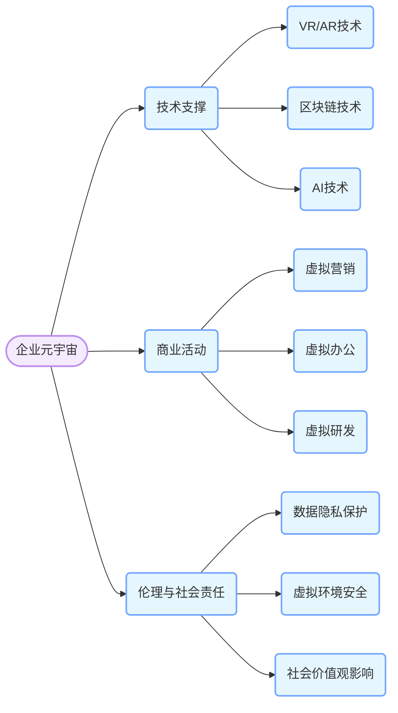

# 特价股票投资中的企业元宇宙伦理与社会责任量化评估

> 关键词：特价股票投资、企业元宇宙、伦理、社会责任、量化评估

> 摘要：本文聚焦于特价股票投资领域，深入探讨企业在元宇宙背景下的伦理与社会责任量化评估问题。首先介绍了研究的背景、目的、预期读者等内容。接着阐述了企业元宇宙、伦理、社会责任等核心概念及其联系，给出了相应的原理和架构示意图。详细讲解了核心算法原理，并用Python代码进行了实现。从数学模型和公式的角度进一步剖析量化评估的方法，并举例说明。通过项目实战，展示了代码的实际应用和解读。分析了该量化评估在实际中的应用场景，推荐了相关的学习资源、开发工具框架和论文著作。最后总结了未来发展趋势与挑战，提供了常见问题解答和扩展阅读参考资料，旨在为特价股票投资者在评估企业元宇宙伦理与社会责任方面提供全面且深入的指导。

## 1. 背景介绍 
### 1.1 目的和范围
在当今的金融市场中，特价股票投资因其潜在的高回报率吸引了众多投资者的目光。与此同时，元宇宙作为新兴的技术和商业领域，正逐渐改变着企业的运营模式和社会影响。企业在元宇宙中的活动不仅关乎自身的发展，还涉及到诸多伦理和社会责任问题。本研究的目的在于建立一套科学、有效的量化评估体系，帮助特价股票投资者在决策过程中，综合考虑企业在元宇宙中的伦理与社会责任表现。

研究范围涵盖了特价股票市场中涉及元宇宙业务的各类企业，包括但不限于科技公司、游戏公司、传媒公司等。评估的内容主要集中在企业在元宇宙开发、运营过程中的伦理行为和社会责任履行情况，如数据隐私保护、虚拟环境安全、对社会价值观的影响等。

### 1.2 预期读者
本文的预期读者主要包括以下几类人群：
- 特价股票投资者：希望通过对企业元宇宙伦理与社会责任的量化评估，降低投资风险，提高投资回报率。
- 金融分析师：为其提供新的分析视角和评估方法，以便更全面地分析企业的价值和潜力。
- 企业管理者：促使企业重视在元宇宙中的伦理和社会责任问题，提升企业的社会形象和可持续发展能力。
- 学术研究人员：为相关领域的学术研究提供参考和借鉴，推动该领域的理论和实践发展。

### 1.3 文档结构概述
本文将按照以下结构展开：
- 核心概念与联系：介绍企业元宇宙、伦理、社会责任等核心概念，以及它们之间的相互关系，并通过文本示意图和Mermaid流程图进行直观展示。
- 核心算法原理 & 具体操作步骤：详细讲解量化评估的核心算法原理，并使用Python代码实现具体的操作步骤。
- 数学模型和公式 & 详细讲解 & 举例说明：从数学角度建立量化评估的模型和公式，并通过具体例子进行说明。
- 项目实战：代码实际案例和详细解释说明：通过实际项目案例，展示量化评估的具体应用和代码实现过程，并对代码进行详细解读。
- 实际应用场景：分析量化评估在特价股票投资中的实际应用场景和价值。
- 工具和资源推荐：推荐相关的学习资源、开发工具框架和论文著作，帮助读者进一步深入学习和研究。
- 总结：未来发展趋势与挑战：总结量化评估的发展趋势，分析面临的挑战和问题。
- 附录：常见问题与解答：解答读者在阅读过程中可能遇到的常见问题。
- 扩展阅读 & 参考资料：提供相关的扩展阅读材料和参考资料，方便读者进一步深入研究。

### 1.4 术语表
#### 1.4.1 核心术语定义
- 特价股票：指价格相对较低，可能被市场低估的股票。
- 企业元宇宙：企业利用虚拟现实、增强现实、区块链等技术构建的虚拟世界，用于开展商业活动、社交互动等。
- 伦理：指在特定社会文化背景下，人们普遍认可的道德原则和行为规范。在企业元宇宙中，伦理涉及到数据隐私、虚拟财产安全、公平竞争等方面。
- 社会责任：企业在创造经济价值的同时，对社会和利益相关者所承担的责任，包括环境保护、员工权益保护、社区发展等。
- 量化评估：将企业在元宇宙中的伦理与社会责任表现转化为具体的数值或指标，以便进行比较和分析。

#### 1.4.2 相关概念解释
- 数据隐私保护：企业在元宇宙中收集、使用和存储用户数据时，应遵循相关法律法规和道德准则，确保用户数据的安全和隐私。
- 虚拟环境安全：保障元宇宙中的虚拟资产、虚拟身份和虚拟社交环境的安全，防止黑客攻击、诈骗等行为。
- 社会价值观影响：企业在元宇宙中的活动应符合社会主流价值观，避免传播不良信息和价值观。

#### 1.4.3 缩略词列表
- VR：虚拟现实（Virtual Reality）
- AR：增强现实（Augmented Reality）
- AI：人工智能（Artificial Intelligence）
- ESG：环境、社会和治理（Environmental, Social and Governance）

## 2. 核心概念与联系 

### 核心概念原理
#### 企业元宇宙
企业元宇宙是企业利用先进的信息技术构建的虚拟世界，它将现实世界与虚拟世界相融合，为企业提供了新的商业机会和发展空间。在企业元宇宙中，企业可以开展虚拟营销、虚拟办公、虚拟研发等活动，实现业务的创新和升级。

#### 伦理
伦理是企业在元宇宙中行为的准则和规范。企业在元宇宙中涉及到大量的用户数据、虚拟资产和社交互动，因此必须遵循伦理原则，保障用户的合法权益，维护虚拟世界的公平和正义。例如，企业应保护用户的隐私，不滥用用户数据；保障虚拟资产的安全，防止盗窃和欺诈等行为。

#### 社会责任
社会责任是企业在元宇宙中对社会和利益相关者所承担的义务。企业在元宇宙中的活动不仅会影响用户的体验和权益，还会对社会产生一定的影响。因此，企业应积极履行社会责任，促进元宇宙的健康发展。例如，企业可以通过开展公益活动、推动技术创新等方式，为社会做出贡献。

### 核心概念架构的文本示意图
```plaintext
企业元宇宙
├── 技术支撑
│   ├── VR/AR技术
│   ├── 区块链技术
│   ├── AI技术
├── 商业活动
│   ├── 虚拟营销
│   ├── 虚拟办公
│   ├── 虚拟研发
├── 伦理与社会责任
│   ├── 数据隐私保护
│   ├── 虚拟环境安全
│   ├── 社会价值观影响
```

### Mermaid流程图


从上述示意图和流程图可以看出，企业元宇宙是一个复杂的系统，由技术支撑、商业活动和伦理与社会责任三个部分组成。技术支撑为企业元宇宙的构建和发展提供了基础，商业活动是企业在元宇宙中的主要业务内容，而伦理与社会责任则是企业在元宇宙中必须遵循的准则和规范。这三个部分相互关联、相互影响，共同构成了企业元宇宙的整体架构。

## 3. 核心算法原理 & 具体操作步骤 

### 核心算法原理
本量化评估的核心算法基于多指标综合评价法，通过构建一系列指标体系，对企业在元宇宙中的伦理与社会责任表现进行量化评估。具体步骤如下：
1. **确定评估指标**：根据企业元宇宙的特点和伦理与社会责任的要求，确定一系列评估指标，如数据隐私保护程度、虚拟环境安全等级、社会价值观影响指数等。
2. **确定指标权重**：采用专家打分法、层次分析法等方法，确定各评估指标的权重，以反映各指标在整体评估中的重要程度。
3. **数据收集与标准化**：收集企业在各评估指标上的数据，并进行标准化处理，以消除不同指标之间的量纲差异。
4. **计算综合得分**：根据各评估指标的权重和标准化后的数据，计算企业的综合得分，以反映企业在元宇宙中的伦理与社会责任表现。

### 具体操作步骤及Python代码实现

#### 步骤1：确定评估指标
假设我们确定了以下四个评估指标：
- 数据隐私保护程度（$x_1$）
- 虚拟环境安全等级（$x_2$）
- 社会价值观影响指数（$x_3$）
- 社会责任履行情况（$x_4$）

#### 步骤2：确定指标权重
假设通过专家打分法确定各指标的权重分别为：
- $w_1 = 0.3$
- $w_2 = 0.2$
- $w_3 = 0.3$
- $w_4 = 0.2$

#### 步骤3：数据收集与标准化
假设我们收集到了某企业在各评估指标上的数据如下：
- $x_1 = 80$
- $x_2 = 70$
- $x_3 = 90$
- $x_4 = 75$

为了消除不同指标之间的量纲差异，我们采用线性标准化方法，将数据标准化到$[0, 1]$区间。线性标准化公式为：
$$x_{i}^{*}=\frac{x_{i}-x_{min}}{x_{max}-x_{min}}$$
其中，$x_{i}$为原始数据，$x_{min}$为该指标的最小值，$x_{max}$为该指标的最大值。

以下是Python代码实现：
```python
import numpy as np

# 原始数据
x = np.array([80, 70, 90, 75])

# 假设各指标的最小值和最大值
x_min = np.array([0, 0, 0, 0])
x_max = np.array([100, 100, 100, 100])

# 线性标准化
x_star = (x - x_min) / (x_max - x_min)

print("标准化后的数据:", x_star)
```

#### 步骤4：计算综合得分
根据各评估指标的权重和标准化后的数据，计算企业的综合得分。综合得分公式为：
$$S=\sum_{i = 1}^{n}w_{i}x_{i}^{*}$$
其中，$S$为综合得分，$w_{i}$为第$i$个指标的权重，$x_{i}^{*}$为第$i$个指标标准化后的数据。

以下是Python代码实现：
```python
# 指标权重
w = np.array([0.3, 0.2, 0.3, 0.2])

# 计算综合得分
S = np.sum(w * x_star)

print("综合得分:", S)
```

通过以上步骤，我们就可以对企业在元宇宙中的伦理与社会责任表现进行量化评估。

## 4. 数学模型和公式 & 详细讲解 & 举例说明 

### 数学模型
本量化评估的数学模型基于多指标综合评价法，通过构建指标体系和确定指标权重，将企业在元宇宙中的伦理与社会责任表现转化为综合得分。具体数学模型如下：
设企业在元宇宙中的伦理与社会责任表现由$n$个评估指标$x_1, x_2, \cdots, x_n$来衡量，各指标的权重分别为$w_1, w_2, \cdots, w_n$，且满足$\sum_{i = 1}^{n}w_{i}=1$。对各指标进行标准化处理后得到$x_{1}^{*}, x_{2}^{*}, \cdots, x_{n}^{*}$，则企业的综合得分$S$为：
$$S=\sum_{i = 1}^{n}w_{i}x_{i}^{*}$$

### 详细讲解
- **指标体系构建**：指标体系的构建是量化评估的基础，需要根据企业元宇宙的特点和伦理与社会责任的要求，选择合适的评估指标。评估指标应具有代表性、可操作性和可比性。
- **指标权重确定**：指标权重反映了各指标在整体评估中的重要程度，需要采用科学的方法进行确定。常用的方法有专家打分法、层次分析法等。
- **数据标准化处理**：由于不同评估指标的量纲和取值范围可能不同，为了消除这些差异，需要对数据进行标准化处理。常用的标准化方法有线性标准化、非线性标准化等。
- **综合得分计算**：综合得分是企业在元宇宙中的伦理与社会责任表现的综合体现，通过将各指标的权重与标准化后的数据相乘并求和得到。

### 举例说明
假设我们要对两家企业A和B在元宇宙中的伦理与社会责任表现进行量化评估。我们确定了以下四个评估指标：
- 数据隐私保护程度（$x_1$）
- 虚拟环境安全等级（$x_2$）
- 社会价值观影响指数（$x_3$）
- 社会责任履行情况（$x_4$）

各指标的权重分别为：
- $w_1 = 0.3$
- $w_2 = 0.2$
- $w_3 = 0.3$
- $w_4 = 0.2$

两家企业在各评估指标上的原始数据如下：
| 企业 | $x_1$ | $x_2$ | $x_3$ | $x_4$ |
| ---- | ---- | ---- | ---- | ---- |
| A    | 80   | 70   | 90   | 75   |
| B    | 75   | 80   | 85   | 80   |

各指标的最小值和最大值假设为：
- $x_{min} = [0, 0, 0, 0]$
- $x_{max} = [100, 100, 100, 100]$

首先，对数据进行标准化处理：
对于企业A：
$$x_{1A}^{*}=\frac{80 - 0}{100 - 0}=0.8$$
$$x_{2A}^{*}=\frac{70 - 0}{100 - 0}=0.7$$
$$x_{3A}^{*}=\frac{90 - 0}{100 - 0}=0.9$$
$$x_{4A}^{*}=\frac{75 - 0}{100 - 0}=0.75$$

对于企业B：
$$x_{1B}^{*}=\frac{75 - 0}{100 - 0}=0.75$$
$$x_{2B}^{*}=\frac{80 - 0}{100 - 0}=0.8$$
$$x_{3B}^{*}=\frac{85 - 0}{100 - 0}=0.85$$
$$x_{4B}^{*}=\frac{80 - 0}{100 - 0}=0.8$$

然后，计算两家企业的综合得分：
对于企业A：
$$S_A = 0.3\times0.8 + 0.2\times0.7 + 0.3\times0.9 + 0.2\times0.75 = 0.81$$

对于企业B：
$$S_B = 0.3\times0.75 + 0.2\times0.8 + 0.3\times0.85 + 0.2\times0.8 = 0.8$$

通过比较两家企业的综合得分，我们可以得出企业A在元宇宙中的伦理与社会责任表现优于企业B。

## 5. 项目实战：代码实际案例和详细解释说明 

### 5.1  开发环境搭建
为了实现企业元宇宙伦理与社会责任量化评估的项目，我们需要搭建相应的开发环境。以下是具体的搭建步骤：

#### 安装Python
Python是一种广泛使用的编程语言，具有丰富的库和工具。我们可以从Python官方网站（https://www.python.org/downloads/）下载并安装Python 3.x版本。

#### 安装必要的库
我们需要安装一些必要的Python库，如NumPy、Pandas等。可以使用以下命令进行安装：
```sh
pip install numpy pandas
```

#### 选择开发工具
可以选择使用PyCharm、Jupyter Notebook等开发工具。PyCharm是一款专业的Python集成开发环境，具有强大的代码编辑、调试等功能；Jupyter Notebook是一种交互式的开发环境，适合进行数据分析和可视化。

### 5.2  源代码详细实现和代码解读

#### 数据准备
假设我们有一个包含多家企业在各评估指标上数据的CSV文件`enterprise_data.csv`，文件内容如下：
```plaintext
企业名称,数据隐私保护程度,虚拟环境安全等级,社会价值观影响指数,社会责任履行情况
企业A,80,70,90,75
企业B,75,80,85,80
企业C,85,75,95,85
```

以下是读取数据的Python代码：
```python
import pandas as pd

# 读取CSV文件
data = pd.read_csv('enterprise_data.csv')

# 提取评估指标数据
x = data[['数据隐私保护程度', '虚拟环境安全等级', '社会价值观影响指数', '社会责任履行情况']].values

# 提取企业名称
enterprise_names = data['企业名称'].values

print("评估指标数据:", x)
print("企业名称:", enterprise_names)
```

#### 数据标准化
使用线性标准化方法对数据进行标准化处理：
```python
import numpy as np

# 假设各指标的最小值和最大值
x_min = np.array([0, 0, 0, 0])
x_max = np.array([100, 100, 100, 100])

# 线性标准化
x_star = (x - x_min) / (x_max - x_min)

print("标准化后的数据:", x_star)
```

#### 确定指标权重
假设通过专家打分法确定各指标的权重分别为：
```python
# 指标权重
w = np.array([0.3, 0.2, 0.3, 0.2])
```

#### 计算综合得分
根据各评估指标的权重和标准化后的数据，计算企业的综合得分：
```python
# 计算综合得分
S = np.sum(w * x_star, axis=1)

# 将综合得分添加到DataFrame中
data['综合得分'] = S

print("各企业综合得分:", data[['企业名称', '综合得分']])
```

### 5.3  代码解读与分析
- **数据准备部分**：使用`pandas`库的`read_csv`函数读取CSV文件，提取评估指标数据和企业名称。
- **数据标准化部分**：使用线性标准化公式将数据标准化到$[0, 1]$区间，消除不同指标之间的量纲差异。
- **确定指标权重部分**：通过专家打分法确定各指标的权重，存储在`w`数组中。
- **计算综合得分部分**：使用`numpy`库的`sum`函数计算各企业的综合得分，并将结果添加到`DataFrame`中。

通过以上代码，我们可以对多家企业在元宇宙中的伦理与社会责任表现进行量化评估，并得到各企业的综合得分。

## 6. 实际应用场景 
### 特价股票投资决策
在特价股票投资中，投资者可以使用企业元宇宙伦理与社会责任量化评估结果，作为投资决策的参考依据。具有较高伦理与社会责任得分的企业，通常具有更好的社会形象和可持续发展能力，其股票可能具有更高的投资价值。例如，一家在元宇宙中注重数据隐私保护和虚拟环境安全的企业，可能会吸引更多的用户和投资者，从而提升其市场竞争力和股价表现。

### 企业自身发展评估
企业可以利用量化评估结果，对自身在元宇宙中的伦理与社会责任表现进行评估和改进。通过分析各评估指标的得分情况，企业可以发现自身存在的问题和不足，采取相应的措施加以改进。例如，如果企业在数据隐私保护方面得分较低，就可以加强数据安全管理，完善隐私政策，提高用户对企业的信任度。

### 监管部门监管
监管部门可以将企业元宇宙伦理与社会责任量化评估纳入监管体系，对企业在元宇宙中的活动进行监督和管理。通过设定相应的标准和要求，监管部门可以促使企业遵守伦理和社会责任准则，维护元宇宙市场的健康发展。例如，监管部门可以对伦理与社会责任得分较低的企业进行重点监管，要求其限期整改。

### 行业研究与比较
研究机构和行业协会可以利用量化评估结果，对不同企业在元宇宙中的伦理与社会责任表现进行研究和比较。通过分析行业内企业的整体表现和差异，研究机构可以为行业发展提供建议和指导，促进行业的规范和健康发展。例如，研究机构可以发布行业报告，分析行业内企业在伦理与社会责任方面的优势和不足，为企业提供参考和借鉴。

## 7. 工具和资源推荐
### 7.1 学习资源推荐
#### 7.1.1 书籍推荐
- 《元宇宙通证》：本书深入探讨了元宇宙的经济体系和通证机制，对于理解企业在元宇宙中的商业活动和经济模式具有重要的参考价值。
- 《人工智能伦理》：介绍了人工智能领域的伦理问题和挑战，对于理解企业在元宇宙中涉及的伦理问题具有一定的启示作用。
- 《社会责任投资》：详细阐述了社会责任投资的理论和实践，为投资者在特价股票投资中考虑企业伦理与社会责任提供了理论支持。

#### 7.1.2 在线课程
- Coursera平台上的“元宇宙技术与应用”课程：系统介绍了元宇宙的技术原理、应用场景和发展趋势，帮助学习者深入了解元宇宙。
- edX平台上的“人工智能伦理与社会”课程：探讨了人工智能伦理的基本概念、原则和方法，以及人工智能对社会的影响。
- Udemy平台上的“社会责任投资实战”课程：通过实际案例和操作，介绍了社会责任投资的方法和技巧。

#### 7.1.3 技术博客和网站
- 元宇宙前沿（https://metaversefrontier.com/）：提供元宇宙领域的最新技术、行业动态和研究成果。
- 人工智能伦理网（https://aiethics.org/）：专注于人工智能伦理问题的研究和讨论，分享相关的学术论文和观点。
- 社会责任投资论坛（https://sriforum.org/）：汇聚了社会责任投资领域的专家和从业者，提供相关的研究报告、案例分析和交流平台。

### 7.2 开发工具框架推荐
#### 7.2.1 IDE和编辑器
- PyCharm：一款专业的Python集成开发环境，具有强大的代码编辑、调试、代码分析等功能，适合Python项目的开发。
- Jupyter Notebook：一种交互式的开发环境，支持多种编程语言，适合进行数据分析、可视化和模型训练。
- Visual Studio Code：一款轻量级的代码编辑器，具有丰富的插件和扩展功能，支持多种编程语言，可用于开发各种类型的项目。

#### 7.2.2 调试和性能分析工具
- Py-Spy：一个用于Python代码性能分析的工具，可以帮助开发者找出代码中的性能瓶颈。
- PDB：Python自带的调试器，可以帮助开发者调试Python代码，定位和解决问题。
- Memory Profiler：一个用于Python代码内存分析的工具，可以帮助开发者找出代码中的内存泄漏问题。

#### 7.2.3 相关框架和库
- NumPy：一个用于科学计算的Python库，提供了高效的数组操作和数学函数，是数据分析和机器学习的基础库。
- Pandas：一个用于数据处理和分析的Python库，提供了丰富的数据结构和数据操作方法，方便进行数据清洗、转换和分析。
- Scikit-learn：一个用于机器学习的Python库，提供了各种机器学习算法和工具，可用于数据建模、模型训练和评估。

### 7.3 相关论文著作推荐
#### 7.3.1 经典论文
- “The Ethical Implications of Artificial Intelligence in the Metaverse”：探讨了人工智能在元宇宙中的伦理问题和挑战，提出了相应的伦理原则和解决方案。
- “Corporate Social Responsibility in the Digital Age: A Review and Future Research Agenda”：对数字时代企业社会责任的研究进行了综述，并提出了未来的研究方向。
- “Quantitative Assessment of Corporate Social Responsibility: A Literature Review”：对企业社会责任量化评估的研究进行了综述，介绍了不同的评估方法和模型。

#### 7.3.2 最新研究成果
- “Metaverse and Corporate Governance: Challenges and Opportunities”：研究了元宇宙对企业治理的影响，分析了企业在元宇宙中面临的挑战和机遇。
- “Ethical Considerations in the Development of Metaverse Technologies”：探讨了元宇宙技术开发过程中的伦理问题，提出了相应的伦理准则和建议。
- “Quantitative Evaluation of Corporate Social Responsibility in the Metaverse: A New Approach”：提出了一种新的企业在元宇宙中社会责任量化评估方法，并通过实证研究验证了该方法的有效性。

#### 7.3.3 应用案例分析
- “Case Study: How a Tech Company Implements Ethical and Social Responsibility in the Metaverse”：通过实际案例分析了一家科技公司在元宇宙中实施伦理与社会责任的具体做法和经验。
- “Analysis of Social Responsibility Investment in the Metaverse Stock Market”：分析了元宇宙股票市场中的社会责任投资案例，探讨了社会责任投资在元宇宙领域的应用前景和挑战。

## 8. 总结：未来发展趋势与挑战
### 未来发展趋势
#### 评估体系不断完善
随着元宇宙技术的不断发展和应用，企业在元宇宙中的活动将越来越复杂多样，对伦理与社会责任的要求也将越来越高。因此，企业元宇宙伦理与社会责任量化评估体系将不断完善，评估指标将更加全面、科学，评估方法将更加精准、有效。

#### 与投资决策深度融合
在未来的特价股票投资中，企业元宇宙伦理与社会责任量化评估结果将与投资决策更加深度融合。投资者将更加注重企业在元宇宙中的伦理与社会责任表现，将其作为投资决策的重要参考因素之一。同时，金融机构也将开发更多基于伦理与社会责任评估的投资产品和服务。

#### 跨行业合作与交流加强
企业元宇宙伦理与社会责任问题涉及多个领域和行业，需要跨行业的合作与交流。未来，不同行业的企业、研究机构和监管部门将加强合作，共同探讨和解决元宇宙中的伦理与社会责任问题。例如，科技公司、金融机构和社会组织可以联合开展研究项目，共同制定行业标准和规范。

#### 技术创新推动评估发展
随着人工智能、区块链、大数据等技术的不断发展，这些技术将为企业元宇宙伦理与社会责任量化评估提供更强大的技术支持。例如，人工智能可以用于数据分析和模型训练，提高评估的准确性和效率；区块链可以用于数据存储和共享，保障数据的安全性和可信度。

### 挑战
#### 伦理和社会责任标准难以统一
由于不同国家、地区和文化背景的差异，对于企业在元宇宙中的伦理和社会责任标准存在不同的理解和认识。因此，如何制定统一的伦理和社会责任标准是一个亟待解决的问题。

#### 数据获取和质量问题
企业元宇宙伦理与社会责任量化评估需要大量的数据支持，但是数据的获取和质量存在一定的困难。一方面，部分企业可能不愿意公开其在元宇宙中的相关数据；另一方面，数据的准确性和完整性也需要进一步验证和保证。

#### 技术应用的伦理风险
虽然技术创新可以推动评估发展，但是技术应用也可能带来新的伦理风险。例如，人工智能算法可能存在偏见和歧视，区块链技术可能被用于非法活动等。因此，如何在技术应用过程中避免伦理风险是一个需要关注的问题。

#### 监管难度大
元宇宙是一个新兴的领域，监管体系还不够完善。企业在元宇宙中的活动具有虚拟性、全球性和创新性等特点，给监管带来了很大的难度。如何建立有效的监管机制，保障元宇宙的健康发展是一个重要的挑战。

## 9. 附录：常见问题与解答
### 问题1：什么是特价股票？
特价股票是指价格相对较低，可能被市场低估的股票。特价股票通常具有较高的投资潜力，但也伴随着较高的风险。

### 问题2：为什么要对企业在元宇宙中的伦理与社会责任进行量化评估？
对企业在元宇宙中的伦理与社会责任进行量化评估具有重要的意义。一方面，对于投资者来说，可以帮助他们降低投资风险，提高投资回报率；另一方面，对于企业来说，可以促使其重视伦理和社会责任问题，提升企业的社会形象和可持续发展能力。

### 问题3：如何确定评估指标的权重？
确定评估指标的权重可以采用多种方法，如专家打分法、层次分析法等。专家打分法是邀请相关领域的专家对各评估指标的重要程度进行打分，然后根据打分结果确定权重；层次分析法是通过构建层次结构模型，对各评估指标的相对重要性进行比较和排序，从而确定权重。

### 问题4：数据标准化的作用是什么？
数据标准化的作用是消除不同评估指标之间的量纲差异，使各指标具有可比性。在量化评估中，如果不进行数据标准化处理，不同指标的取值范围和量纲可能会对综合得分产生影响，导致评估结果不准确。

### 问题5：量化评估结果的可靠性如何保证？
为了保证量化评估结果的可靠性，需要从以下几个方面入手：
- 合理选择评估指标：评估指标应具有代表性、可操作性和可比性，能够全面反映企业在元宇宙中的伦理与社会责任表现。
- 科学确定指标权重：采用科学的方法确定指标权重，确保各指标在整体评估中的重要程度得到合理体现。
- 保证数据质量：收集准确、完整的数据，并进行严格的数据清洗和验证，确保数据的可靠性。
- 选择合适的评估方法：根据评估对象和目的，选择合适的评估方法，如多指标综合评价法、模糊综合评价法等。

## 10. 扩展阅读 & 参考资料
### 扩展阅读
- 《元宇宙：从概念到现实》：深入探讨了元宇宙的概念、技术和应用，为读者提供了更全面的元宇宙知识。
- 《企业社会责任：理论与实践》：系统介绍了企业社会责任的理论和实践，对于理解企业在元宇宙中的社会责任具有重要的参考价值。
- 《金融科技与投资决策》：介绍了金融科技在投资决策中的应用，为投资者在特价股票投资中应用量化评估提供了新的思路和方法。

### 参考资料
- 相关学术期刊：《管理世界》、《金融研究》、《计算机学报》等。
- 行业报告：《元宇宙行业发展报告》、《社会责任投资年度报告》等。
- 政府文件和政策：《关于推动元宇宙产业健康发展的指导意见》、《企业社会责任指引》等。